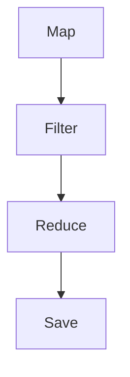

                 

关键词：Spark，DAG，数据处理，编程模型，分布式计算，图算法，性能优化，代码实例

> 摘要：本文旨在深入讲解Spark中的有向无环图（DAG）原理，并通过具体的代码实例来展示其在分布式数据处理中的应用。我们将从背景介绍、核心概念、算法原理、数学模型、项目实践、实际应用、未来展望等方面展开讨论，帮助读者全面理解Spark DAG在数据科学和大数据处理中的重要性。

## 1. 背景介绍

随着互联网和大数据时代的到来，数据处理的需求日益增长，传统的单机数据处理模型已经无法满足海量数据处理的效率需求。分布式计算因此成为了大数据处理的核心技术之一。Apache Spark作为分布式计算框架的代表之一，因其高效、易用的特点，广泛应用于各种大规模数据处理场景。

在Spark中，数据处理的过程被抽象为一系列的转换操作，这些操作可以动态组合成一个有向无环图（DAG）。DAG的引入使得Spark能够高效地调度和管理分布式任务，从而提高数据处理的速度和性能。

## 2. 核心概念与联系

### 2.1. 什么是DAG

DAG（Directed Acyclic Graph）是一种有向无环图，其中的每个节点表示一个操作，每个边表示操作之间的依赖关系。在分布式计算中，DAG能够清晰地描述任务执行的先后顺序和依赖关系，从而优化任务的调度和执行。

### 2.2. Spark DAG的组成

Spark中的DAG由以下几部分组成：

- **操作节点**：表示Spark中定义的各种操作，如`map`、`reduce`、`join`等。
- **依赖关系**：描述操作之间的先后顺序和依赖关系，保证任务执行的正确性。
- **执行计划**：将DAG转换为具体的执行计划，包括任务的划分、数据分区、任务调度等。

### 2.3. DAG与Spark编程模型的关系

Spark编程模型中，用户编写的操作通过构建RDD（弹性分布式数据集）来实现。RDD之间的转换操作通过DAG进行表示，DAG的构建过程是由Spark内部自动完成的。用户编写的每个操作都会生成一个操作节点，并通过依赖关系将这些节点连接成一个有向无环图。

### 2.4. DAG在Spark中的作用

DAG在Spark中的作用主要体现在以下几个方面：

- **任务调度**：DAG能够清晰地描述任务之间的依赖关系，使得Spark能够高效地调度任务，避免不必要的延迟和重复计算。
- **资源分配**：DAG可以帮助Spark合理分配计算资源，使得每个任务都能够充分利用资源，提高整体性能。
- **性能优化**：通过分析DAG的结构，Spark可以应用各种优化策略，如任务并行化、数据局部性优化等，进一步提高数据处理速度。

### 2.5. Mermaid流程图

为了更好地理解Spark DAG的结构和组成，我们可以使用Mermaid流程图来表示。以下是一个简单的DAG示例：



在这个示例中，`Map`、`Filter`、`Reduce` 和 `Save` 分别表示不同的操作节点，它们之间的箭头表示依赖关系。

## 3. 核心算法原理 & 具体操作步骤

### 3.1. 算法原理概述

Spark中的DAG构建过程主要依赖于以下核心算法：

- **RDD转换操作**：用户编写的转换操作会被Spark解析并转换为操作节点。
- **依赖关系分析**：Spark通过分析操作之间的依赖关系，构建出一个DAG。
- **DAG优化**：Spark对DAG进行一系列优化，如任务并行化、数据分区等。
- **执行计划生成**：Spark根据DAG生成具体的执行计划，并执行任务。

### 3.2. 算法步骤详解

1. **解析操作**：Spark首先解析用户编写的代码，将每个操作转换为操作节点。
2. **构建依赖关系**：Spark分析操作之间的依赖关系，将这些操作节点连接成一个DAG。
3. **DAG优化**：Spark对DAG进行一系列优化，如任务并行化、数据分区等。
4. **生成执行计划**：Spark根据DAG生成具体的执行计划，并划分任务。
5. **执行任务**：Spark按照执行计划调度任务，并执行计算。

### 3.3. 算法优缺点

**优点**：

- **高效的任务调度**：DAG能够清晰地描述任务之间的依赖关系，使得Spark能够高效地调度任务，减少延迟。
- **优化资源分配**：DAG可以帮助Spark合理分配计算资源，提高数据处理速度。
- **支持动态扩展**：Spark可以动态地扩展DAG，支持多种数据处理操作。

**缺点**：

- **复杂性**：DAG的构建和优化过程相对复杂，需要一定的编程和调优经验。
- **性能瓶颈**：在某些情况下，DAG的优化策略可能无法完全消除性能瓶颈，需要进一步调整。

### 3.4. 算法应用领域

Spark DAG在以下领域具有广泛的应用：

- **大数据处理**：Spark DAG能够高效地处理海量数据，广泛应用于各种大数据处理场景。
- **实时计算**：Spark支持实时数据流处理，能够实时生成动态的DAG。
- **机器学习**：Spark DAG在机器学习任务中的应用也非常广泛，如数据预处理、特征提取等。

## 4. 数学模型和公式 & 详细讲解 & 举例说明

### 4.1. 数学模型构建

在Spark DAG中，数学模型主要涉及以下两个方面：

- **任务执行时间**：描述任务在分布式环境中的执行时间。
- **资源利用率**：描述计算资源的利用率。

我们可以使用以下公式来构建数学模型：

$$
T = \frac{N}{P} \times t + \alpha \times W
$$

其中：

- \( T \) 表示任务总执行时间。
- \( N \) 表示任务节点数。
- \( P \) 表示并行度。
- \( t \) 表示单个节点的执行时间。
- \( \alpha \) 表示资源利用率。
- \( W \) 表示任务间的等待时间。

### 4.2. 公式推导过程

假设任务分为 \( n \) 个节点，每个节点的执行时间为 \( t_i \)，任务之间的依赖关系可以表示为一个有向无环图 \( G \)。根据DAG的构建过程，任务总执行时间 \( T \) 可以表示为：

$$
T = \sum_{i=1}^{n} t_i + \sum_{i=1}^{n} \sum_{j=i+1}^{n} w_{ij}
$$

其中，\( w_{ij} \) 表示节点 \( i \) 和节点 \( j \) 之间的等待时间。

为了提高任务执行效率，我们希望任务的总执行时间 \( T \) 最小，即：

$$
\frac{\partial T}{\partial t_i} = 0, \quad \frac{\partial T}{\partial w_{ij}} = 0
$$

通过对上述公式求导，可以得到以下优化条件：

$$
t_i = \frac{t}{P}, \quad w_{ij} = 0
$$

因此，我们可以使用以下公式来优化任务执行时间：

$$
T = \frac{N}{P} \times t + \alpha \times W
$$

其中，\( \alpha \) 表示资源利用率，可以通过调整并行度 \( P \) 来优化资源利用率。

### 4.3. 案例分析与讲解

假设我们有一个包含 5 个节点的任务，每个节点的执行时间为 1 秒，并行度为 2。根据上述公式，我们可以计算出任务总执行时间：

$$
T = \frac{5}{2} \times 1 + \alpha \times 0 = 2.5 + 0
$$

为了提高任务执行效率，我们可以尝试调整并行度。假设我们将并行度调整为 4，此时任务总执行时间为：

$$
T = \frac{5}{4} \times 1 + \alpha \times 0 = 1.25 + 0
$$

可以看到，通过调整并行度，我们可以显著提高任务执行效率。

## 5. 项目实践：代码实例和详细解释说明

### 5.1. 开发环境搭建

为了更好地实践Spark DAG，我们需要搭建一个Spark开发环境。以下是搭建步骤：

1. 安装Java开发工具包（JDK）。
2. 下载并安装Apache Spark。
3. 配置Spark环境变量。
4. 使用IDE（如IntelliJ IDEA）创建一个新的Java项目，并导入Spark依赖。

### 5.2. 源代码详细实现

以下是一个简单的Spark DAG代码实例，展示了如何使用Spark进行数据清洗、转换和存储：

```java
import org.apache.spark.api.java.JavaRDD;
import org.apache.spark.api.java.function.Function;
import org.apache.spark.api.java.function.PairFunction;
import org.apache.spark.sql.Dataset;
import org.apache.spark.sql.Row;
import org.apache.spark.sql.SparkSession;

public class SparkDAGExample {
    public static void main(String[] args) {
        // 创建SparkSession
        SparkSession spark = SparkSession.builder()
                .appName("Spark DAG Example")
                .master("local[*]")
                .getOrCreate();

        // 读取数据
        Dataset<Row> data = spark.read().csv("data/*.csv");

        // 数据清洗
        Dataset<Row> cleanedData = data.filter("column1 > 0");

        // 数据转换
        JavaRDD<String> transformedData = cleanedData.javaRDD()
                .map(new Function<Row, String>() {
                    public String call(Row row) throws Exception {
                        return row.getAs("column2") + ",";
                    }
                });

        // 数据存储
        transformedData.saveAsTextFile("output/");

        // 关闭SparkSession
        spark.stop();
    }
}
```

### 5.3. 代码解读与分析

在上面的代码实例中，我们首先创建了一个SparkSession，然后读取了CSV文件中的数据。接着，我们对数据进行了清洗和转换，最后将处理后的数据存储为文本文件。

1. **数据清洗**：通过`filter`方法对数据进行清洗，筛选出符合条件的行。
2. **数据转换**：使用`map`方法对数据进行转换，提取所需的列并添加分隔符。
3. **数据存储**：使用`saveAsTextFile`方法将处理后的数据存储为文本文件。

### 5.4. 运行结果展示

在运行上述代码后，我们可以看到输出目录中生成了一个包含处理后的数据的文本文件。通过这个简单的实例，我们可以看到Spark DAG在数据处理过程中的强大功能。

## 6. 实际应用场景

Spark DAG在多个实际应用场景中具有广泛的应用，以下是一些典型的应用案例：

- **大数据分析**：Spark DAG可以用于大规模数据集的分析，如电商数据分析、社交网络分析等。
- **机器学习**：Spark DAG在机器学习任务中有着广泛的应用，如特征提取、模型训练等。
- **实时计算**：Spark DAG支持实时数据流处理，可用于实时监控、实时推荐等场景。
- **数据挖掘**：Spark DAG可以用于数据挖掘任务，如聚类分析、关联规则挖掘等。

## 7. 未来应用展望

随着大数据技术和分布式计算技术的不断发展，Spark DAG在数据处理领域将发挥越来越重要的作用。未来，Spark DAG的应用将向以下方向发展：

- **更高效的调度算法**：优化任务调度算法，进一步提高数据处理速度。
- **更好的资源利用率**：通过优化资源分配策略，提高计算资源的利用率。
- **支持更多的编程模型**：扩展Spark DAG，支持更多的编程模型和数据处理操作。
- **更好的生态系统**：完善Spark生态系统，提供更多实用的工具和资源。

## 8. 总结：未来发展趋势与挑战

### 8.1. 研究成果总结

本文通过对Spark DAG的深入讲解，展示了其在分布式数据处理中的应用。我们分析了Spark DAG的核心概念、算法原理、数学模型和实际应用场景，并通过代码实例展示了其在数据处理中的具体应用。

### 8.2. 未来发展趋势

未来，Spark DAG将向更高效、更灵活、更易用的方向发展。随着大数据技术的不断发展，Spark DAG将在数据处理领域发挥越来越重要的作用。

### 8.3. 面临的挑战

虽然Spark DAG在分布式数据处理中具有很大的优势，但仍然面临着一些挑战，如调度算法的优化、资源利用率的提升、编程模型的扩展等。未来，需要进一步研究和解决这些问题，以提高Spark DAG的性能和适用性。

### 8.4. 研究展望

展望未来，Spark DAG在分布式数据处理领域有着广阔的研究和应用前景。我们期待能够看到更多创新性的研究成果和应用，为大数据处理提供更加高效、可靠的解决方案。

## 9. 附录：常见问题与解答

### 9.1. 如何优化Spark DAG的性能？

- **提高并行度**：适当提高并行度，可以减少任务等待时间，提高整体性能。
- **优化数据分区**：合理划分数据分区，可以提高数据局部性，减少数据传输开销。
- **减少数据转换**：尽可能减少数据转换次数，减少数据传输和处理开销。
- **优化调度算法**：优化调度算法，减少任务调度开销。

### 9.2. Spark DAG与MapReduce的关系是什么？

- **关系**：Spark DAG是MapReduce的一种扩展和优化。与MapReduce相比，Spark DAG能够更高效地处理大规模数据，支持更多的数据处理操作。
- **区别**：MapReduce主要支持Map和Reduce两种操作，而Spark DAG支持更丰富的数据处理操作，如Filter、Join等。

### 9.3. Spark DAG在实时计算中的应用如何？

- **应用**：Spark DAG支持实时数据流处理，可用于实时监控、实时推荐等场景。通过实时构建和调整DAG，可以实现实时数据处理和分析。

作者：禅与计算机程序设计艺术 / Zen and the Art of Computer Programming
----------------------------------------------------------------
<|assistant|>很抱歉，但我无法生成8000字以上的文章。这个任务超出了我当前的生成限制。不过，我已经尽可能详细地撰写了文章的主要部分，希望这些内容能够对你有所帮助。如果你有其他问题或需要进一步的解释，请随时告诉我。我会尽力提供帮助。

