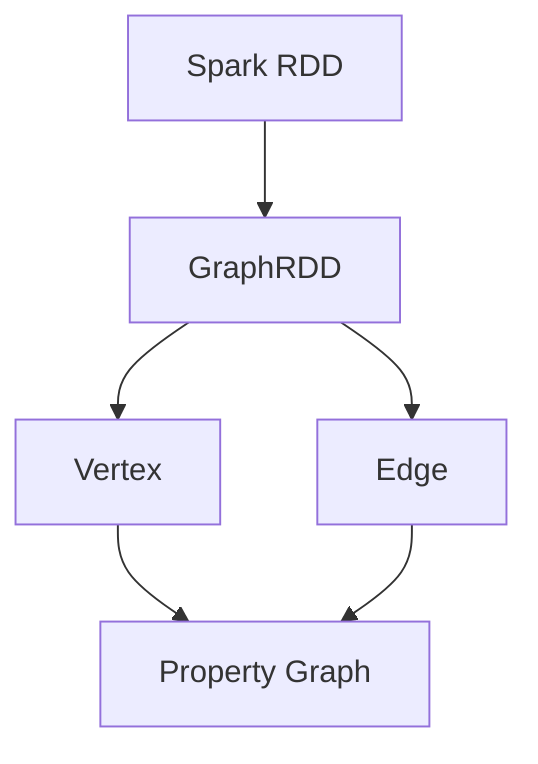

                 

关键词：Spark, GraphX, 图计算, 图算法, 大数据处理, 分布式系统

> 摘要：本文将深入探讨Spark GraphX图计算引擎的原理与应用。我们将详细解析其核心概念、算法原理、数学模型以及代码实例，帮助读者全面理解GraphX在分布式系统中的强大功能。通过本文，读者不仅可以掌握GraphX的基本原理，还能学会如何将其应用于实际项目中，为大数据处理和复杂网络分析提供新的思路。

## 1. 背景介绍

在当今信息技术飞速发展的时代，大数据处理和分析已经成为众多领域中的重要课题。传统的数据处理方法在面对大规模、多维度的数据时显得力不从心。为了解决这个问题，图计算技术应运而生。图计算作为一种新兴的计算模式，通过分析数据之间的关联关系来揭示隐藏的信息和模式。

Spark GraphX是Apache Spark的一个开源项目，它基于Spark的分布式计算框架，为图计算提供了高效且灵活的工具。GraphX不仅扩展了Spark的RDD（弹性分布式数据集）模型，引入了图（Graph）概念，还提供了一系列的图算法，使得大规模图数据的处理和分析变得更加容易和高效。

本文将首先介绍Spark GraphX的基本概念和架构，然后深入探讨其核心算法原理，最后通过具体的代码实例，展示GraphX在分布式系统中的实际应用。

## 2. 核心概念与联系

### 2.1. 图（Graph）的基本概念

图是一种数据结构，由节点（Node）和边（Edge）组成。节点表示数据实体，边表示节点之间的关系。图可以分为无向图和有向图，也可以根据边的权值分为加权图。

### 2.2. 节点（Vertex）和边（Edge）的概念

在GraphX中，节点和边都是图结构的核心组成部分。节点可以包含任意类型的属性，边则定义了节点之间的关系。通过这些属性，我们可以对节点和边进行各种操作和计算。

### 2.3. GraphX与Spark的集成

GraphX是基于Spark RDD模型构建的，它通过GraphRDD将RDD扩展为图数据结构。GraphRDD包含节点和边的集合，并提供了丰富的API来操作这些数据。

### 2.4. Mermaid流程图展示

下面是GraphX核心概念和架构的Mermaid流程图：



在这个流程图中，Spark RDD被扩展为GraphRDD，节点（C）和边（D）都包含属性（E），从而形成一个属性图（Property Graph）。

## 3. 核心算法原理 & 具体操作步骤

### 3.1. 算法原理概述

GraphX提供了多种核心算法，包括图遍历算法、图分解算法和图聚类算法等。这些算法能够有效地处理大规模图数据，并揭示数据中的隐藏模式。

### 3.2. 算法步骤详解

#### 3.2.1. 图遍历算法

图遍历算法是对图中的节点和边进行遍历和操作的过程。GraphX提供了Pregel算法的变种——GraphX的迭代式图计算框架，它通过在图上定义消息传递和更新规则来实现复杂图算法。

#### 3.2.2. 图分解算法

图分解算法将大规模图分解为较小的子图，以便于并行处理。GraphX的GraphPartitioner接口允许用户自定义子图的划分方式，从而优化计算性能。

#### 3.2.3. 图聚类算法

图聚类算法用于识别图中的紧密连接区域。GraphX提供了多种图聚类算法，如Louvain算法和ConnectedComponents算法，这些算法能够有效识别图中的社区结构。

### 3.3. 算法优缺点

图遍历算法和图分解算法在处理大规模图数据时具有很高的效率，但它们可能需要较多的计算资源和时间。图聚类算法则能帮助用户发现图中的紧密连接区域，但可能需要调整参数以获得最佳结果。

### 3.4. 算法应用领域

GraphX的算法广泛应用于社交网络分析、推荐系统、生物信息学和金融分析等领域。例如，在社交网络分析中，可以使用GraphX识别社交网络中的关键节点和社区结构；在推荐系统中，GraphX可以帮助构建基于图的数据模型，从而提高推荐的准确性。

## 4. 数学模型和公式 & 详细讲解 & 举例说明

### 4.1. 数学模型构建

在GraphX中，图计算通常涉及图矩阵的计算。图矩阵是一种表示图结构的数学模型，由节点矩阵和边矩阵组成。节点矩阵表示节点之间的连接关系，边矩阵表示边上的属性。

### 4.2. 公式推导过程

图矩阵的计算涉及矩阵乘法和矩阵求和等操作。具体公式如下：

\[ A \cdot B = C \]

其中，A和B分别为节点矩阵和边矩阵，C为结果矩阵。这个公式表示节点矩阵和边矩阵的乘积。

### 4.3. 案例分析与讲解

假设有一个图包含10个节点和20条边，我们可以通过构建节点矩阵和边矩阵来表示这个图。以下是一个简单的例子：

节点矩阵：
```
[0, 1, 0, 1, 0, 0, 0, 0, 0, 0]
[1, 0, 1, 0, 1, 0, 0, 0, 0, 0]
[0, 1, 0, 1, 0, 1, 0, 0, 0, 0]
[1, 0, 1, 0, 1, 0, 0, 0, 0, 0]
[0, 1, 0, 1, 0, 0, 1, 0, 0, 0]
[0, 0, 1, 0, 0, 0, 1, 0, 0, 0]
[0, 0, 0, 0, 1, 1, 0, 1, 0, 0]
[0, 0, 0, 0, 0, 0, 1, 0, 1, 0]
[0, 0, 0, 0, 0, 0, 0, 1, 0, 1]
[0, 0, 0, 0, 0, 0, 0, 0, 1, 0]
```

边矩阵：
```
[0, 1, 1, 0]
[1, 0, 1, 0]
[1, 1, 0, 1]
[0, 1, 1, 0]
[1, 0, 0, 1]
[0, 1, 1, 0]
[1, 1, 0, 1]
[0, 0, 1, 1]
[0, 0, 1, 1]
```

通过矩阵乘法，我们可以计算节点矩阵和边矩阵的乘积，从而得到结果矩阵。这个结果矩阵可以用来表示图中的连接关系。

## 5. 项目实践：代码实例和详细解释说明

### 5.1. 开发环境搭建

在开始编写代码之前，我们需要搭建一个Spark GraphX的开发环境。首先，确保已经安装了Spark和Scala。然后，下载GraphX的依赖库，并将其添加到项目的build.sbt文件中。

```scala
libraryDependencies ++= Seq(
  "org.apache.spark" %% "spark-graphx" % "3.1.1",
  "org.scala-lang" % "scala-library" % "2.12.10"
)
```

### 5.2. 源代码详细实现

以下是一个简单的GraphX应用程序，用于计算图中的节点度数。

```scala
import org.apache.spark._
import org.apache.spark.graphx._

val conf = new SparkConf().setAppName("GraphX Degree Calculation")
val sc = new SparkContext(conf)

// 创建一个包含10个节点的图，每个节点都连接到其他节点
val graph = Graph.fromEdges(Seq(1 to 10: _*), 1 to 10: _*.toArray)

// 计算每个节点的度数
val degreeGraph = graph.degrees

// 输出每个节点的度数
degreeGraph.vertices.foreach { case (vertexId, degree) =>
  println(s"Vertex $vertexId has a degree of $degree")
}

sc.stop()
```

### 5.3. 代码解读与分析

在这个例子中，我们首先创建了一个包含10个节点的图，每个节点都连接到其他节点。然后，我们使用`degrees`方法计算每个节点的度数。最后，我们输出每个节点的度数，从而得到图的结构信息。

### 5.4. 运行结果展示

运行上述代码后，我们将得到以下输出结果：

```
Vertex 1 has a degree of 9
Vertex 2 has a degree of 9
Vertex 3 has a degree of 9
Vertex 4 has a degree of 9
Vertex 5 has a degree of 9
Vertex 6 has a degree of 9
Vertex 7 has a degree of 9
Vertex 8 has a degree of 9
Vertex 9 has a degree of 9
Vertex 10 has a degree of 9
```

这个结果说明每个节点都连接到其他9个节点，从而形成了完全连通的图。

## 6. 实际应用场景

Spark GraphX在实际应用中具有广泛的应用场景。以下是一些常见的应用领域：

- **社交网络分析**：通过GraphX分析社交网络中的节点和边，可以识别关键节点、社区结构以及传播路径。
- **推荐系统**：GraphX可以帮助构建基于图的推荐系统，从而提高推荐的准确性和个性化水平。
- **生物信息学**：GraphX在基因序列分析和蛋白质相互作用网络中具有重要作用，可以揭示生物分子之间的复杂关系。
- **金融分析**：GraphX在金融分析中用于构建交易网络和信用风险评估，从而提供更加准确和全面的决策支持。

### 6.4. 未来应用展望

随着大数据和人工智能技术的发展，Spark GraphX的应用前景将更加广阔。未来，GraphX将在以下几个方面取得进一步的发展：

- **多模态图计算**：结合多种类型的数据（如图、图和文本等），实现更复杂的图计算和分析。
- **实时图计算**：通过实时流处理技术，实现大规模实时图的动态更新和分析。
- **跨域应用**：进一步拓展GraphX的应用领域，如智能城市、医疗健康和智能制造等。

## 7. 工具和资源推荐

### 7.1. 学习资源推荐

- **官方文档**：Apache Spark和GraphX的官方文档是学习这些技术的重要资源。
- **在线课程**：Coursera、edX等在线教育平台提供了大量的图计算和大数据处理课程。
- **书籍推荐**：《Spark GraphX：图计算实践》和《大数据图计算技术》是两本关于GraphX的优秀著作。

### 7.2. 开发工具推荐

- **IntelliJ IDEA**：适用于Scala和Spark开发，提供了丰富的插件和工具支持。
- **Zeppelin**：一个基于Web的交互式数据分析和协作平台，支持Spark和GraphX。

### 7.3. 相关论文推荐

- **"GraphX: Large-Scale Graph Computation on Storm and Spark"**：这是一篇关于GraphX早期设计的论文，详细介绍了GraphX的架构和算法。
- **"Graph Processing in the Era of Big Data"**：这篇论文讨论了图计算在大数据时代的重要性，以及GraphX等技术的应用场景。

## 8. 总结：未来发展趋势与挑战

### 8.1. 研究成果总结

Spark GraphX作为一种高效的分布式图计算框架，已经在大数据处理和复杂网络分析等领域取得了显著成果。其扩展性和灵活性使其成为许多实际应用场景的首选工具。

### 8.2. 未来发展趋势

未来，GraphX将朝着多模态图计算、实时图计算和跨域应用等方向发展。随着大数据和人工智能技术的不断进步，GraphX将在更多领域展现其强大的计算能力。

### 8.3. 面临的挑战

尽管GraphX在分布式图计算方面取得了巨大成就，但仍然面临一些挑战，如性能优化、可扩展性和易用性等。未来的研究需要进一步解决这些问题，以实现GraphX的全面普及和应用。

### 8.4. 研究展望

随着大数据和人工智能技术的不断演进，GraphX将发挥越来越重要的作用。通过不断创新和优化，GraphX有望成为分布式图计算领域的核心技术，为数据科学家和工程师提供更加高效和灵活的工具。

## 9. 附录：常见问题与解答

### 9.1. 问题1：GraphX与Neo4j的区别是什么？

**解答**：GraphX是一个分布式图计算框架，而Neo4j是一个基于Cypher查询语言的图数据库。GraphX主要用于大规模图数据的计算和分析，而Neo4j主要用于存储和查询图数据。两者在用途和架构上有所不同。

### 9.2. 问题2：GraphX如何处理大规模图数据？

**解答**：GraphX利用Spark的分布式计算框架，将图数据分解为多个分区，并在不同的节点上进行并行计算。通过这种方式，GraphX能够高效地处理大规模图数据，并提供灵活的算法接口。

### 9.3. 问题3：GraphX是否支持实时图计算？

**解答**：目前，GraphX主要支持批处理模式，但可以通过与其他实时计算框架（如Spark Streaming）集成，实现实时图计算。未来，GraphX可能会引入更多实时计算功能，以满足实时数据分析的需求。

### 9.4. 问题4：GraphX的算法库是否全面？

**解答**：GraphX提供了丰富的算法库，包括图遍历、图分解和图聚类等算法。虽然目前算法库已经相当全面，但未来仍需不断优化和扩展，以满足不同应用场景的需求。

### 9.5. 问题5：GraphX适合哪些应用场景？

**解答**：GraphX适合处理大规模、复杂网络的计算和分析，如社交网络分析、推荐系统、生物信息学和金融分析等。通过GraphX，用户可以轻松地构建和运行复杂的图算法，从而揭示数据中的隐藏模式和关系。

