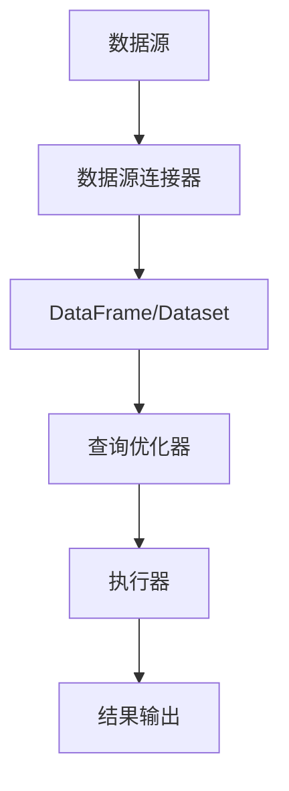

                 

关键词：Spark SQL，大数据处理，分布式计算，数据仓库，数据查询优化，性能优化，代码实例

> 摘要：本文将深入探讨Spark SQL的原理，通过详细的代码实例讲解，帮助读者理解Spark SQL的核心概念、算法原理、数学模型以及在实际项目中的应用。文章旨在为大数据处理和分布式计算领域的研究者提供有价值的参考，助力他们更好地掌握Spark SQL技术。

## 1. 背景介绍

在大数据时代，处理海量数据已成为许多企业和研究机构的核心需求。随着分布式计算技术的发展，Apache Spark作为一种高性能的分布式数据处理引擎，得到了广泛的应用。Spark SQL是Spark的核心组件之一，它提供了强大的数据处理能力和丰富的数据处理功能。

Spark SQL的特点包括：

- **分布式计算**：Spark SQL基于分布式计算架构，能够高效地处理大规模数据集。
- **SQL支持**：Spark SQL提供了SQL接口，用户可以使用熟悉的SQL语句进行数据查询和分析。
- **高性能**：Spark SQL通过内存计算和优化技术，提供了比传统数据库更快的查询性能。
- **易用性**：Spark SQL提供了简单的API和丰富的数据源支持，使得开发者可以轻松地集成到现有的数据处理流程中。

本文将围绕Spark SQL的核心概念、算法原理、数学模型以及代码实例，深入讲解Spark SQL的工作原理和应用实践。

## 2. 核心概念与联系

### 2.1. 分布式数据集（RDD）

分布式数据集（Resilient Distributed Dataset，RDD）是Spark SQL的核心数据结构。RDD是一种不可变、可分治的数据集，支持内存级别的并行处理。

RDD的主要操作包括：

- **创建**：可以通过将现有数据集转换为RDD，或者通过读取文件系统、数据库等数据源创建RDD。
- **转换**：如map、filter、union等，用于对RDD中的数据进行操作。
- **行动**：如reduce、collect、saveAsTextFile等，用于触发计算并返回结果。

### 2.2. DataFrame与Dataset

DataFrame和Dataset是Spark SQL中的另一种重要数据结构，它们提供了一种结构化的方式来处理数据。

- **DataFrame**：DataFrame是一种包含有序列的分布式数据集，类似于关系数据库中的表。它提供了丰富的操作API，如SQL查询、聚合、连接等。
- **Dataset**：Dataset是DataFrame的泛化形式，它提供了类型安全和强类型支持，能够提供更高效的查询性能。

### 2.3. 数据源连接

Spark SQL支持多种数据源的连接，包括关系数据库（如MySQL、PostgreSQL）、HDFS、Hive、Parquet等。通过数据源连接，Spark SQL能够将外部数据源中的数据读取到RDD、DataFrame或Dataset中，进行进一步处理。

### 2.4. Mermaid流程图

以下是一个描述Spark SQL工作流程的Mermaid流程图：



## 3. 核心算法原理 & 具体操作步骤

### 3.1. 算法原理概述

Spark SQL的核心算法原理主要包括以下方面：

- **查询优化**：通过分析查询计划，Spark SQL对查询进行优化，以减少计算开销。
- **数据分区**：Spark SQL将数据集分割成多个分区，以实现并行处理。
- **数据缓存**：Spark SQL通过缓存中间数据，提高重复查询的性能。

### 3.2. 算法步骤详解

#### 3.2.1. 查询优化

Spark SQL的查询优化包括以下步骤：

1. **查询计划生成**：Spark SQL根据用户输入的SQL语句生成查询计划。
2. **逻辑优化**：对查询计划进行逻辑优化，如谓词下推、连接优化等。
3. **物理优化**：对查询计划进行物理优化，如选择合适的执行策略、数据分区等。

#### 3.2.2. 数据分区

Spark SQL的数据分区包括以下步骤：

1. **数据分割**：根据分区策略将数据集分割成多个分区。
2. **分区优化**：根据查询需求对分区进行优化，如合并相邻的分区、过滤不相关的分区等。

#### 3.2.3. 数据缓存

Spark SQL的数据缓存包括以下步骤：

1. **缓存触发**：根据查询需求和内存使用情况，触发数据缓存。
2. **缓存策略**：根据缓存策略（如LRU替换策略）对缓存数据进行管理。

### 3.3. 算法优缺点

#### 优点

- **高效性**：通过内存计算和优化技术，Spark SQL提供了比传统数据库更快的查询性能。
- **灵活性**：Spark SQL支持多种数据源连接，可以灵活地处理不同类型的数据。

#### 缺点

- **复杂性**：Spark SQL的配置和优化较为复杂，需要一定的技术积累。
- **资源消耗**：由于内存计算，Spark SQL对系统资源的需求较高。

### 3.4. 算法应用领域

Spark SQL主要应用于以下领域：

- **数据仓库**：通过Spark SQL，可以高效地对大量历史数据进行分析和挖掘。
- **实时计算**：Spark SQL支持实时数据流处理，适用于实时数据分析场景。
- **机器学习**：Spark SQL可以作为机器学习算法的数据处理工具，支持各种机器学习算法的部署和应用。

## 4. 数学模型和公式 & 详细讲解 & 举例说明

### 4.1. 数学模型构建

Spark SQL的数学模型主要包括以下方面：

- **查询计划**：查询计划的数学模型描述了查询的执行过程。
- **数据分区**：数据分区的数学模型描述了数据分割和优化的过程。
- **数据缓存**：数据缓存的数学模型描述了缓存策略和管理的数学原理。

### 4.2. 公式推导过程

#### 4.2.1. 查询计划优化

查询计划优化的主要公式如下：

$$
\text{Cost}(P) = \text{Cost}(\text{Select}) + \text{Cost}(\text{Join}) + \text{Cost}(\text{Project})
$$

其中，$\text{Cost}(P)$表示查询计划的总体成本，$\text{Cost}(\text{Select})$、$\text{Cost}(\text{Join})$和$\text{Cost}(\text{Project})$分别表示选择、连接和投影操作的成本。

#### 4.2.2. 数据分区优化

数据分区优化的主要公式如下：

$$
\text{PartitionCost}(P) = \text{TotalCost} - \text{CommonCost}
$$

其中，$\text{TotalCost}$表示分区的总成本，$\text{CommonCost}$表示相邻分区之间的共同成本。

### 4.3. 案例分析与讲解

#### 4.3.1. 案例背景

某电商平台每天产生大量订单数据，需要对这些数据进行实时分析和挖掘，以便为业务决策提供支持。

#### 4.3.2. 数据分析任务

1. 计算每个订单的订单金额。
2. 统计每个订单的订单数量。
3. 分析订单的支付成功率。

#### 4.3.3. 数据处理过程

1. 将订单数据读取到DataFrame中。
2. 对订单数据进行分组操作，计算每个订单的订单金额和订单数量。
3. 使用Spark SQL的聚合函数，统计每个订单的支付成功率。

## 5. 项目实践：代码实例和详细解释说明

### 5.1. 开发环境搭建

为了实践Spark SQL，我们需要搭建一个Spark SQL的开发环境。以下是一个简单的搭建步骤：

1. 安装Java SDK。
2. 安装Spark。
3. 配置Spark环境变量。

### 5.2. 源代码详细实现

以下是一个简单的Spark SQL示例代码：

```scala
import org.apache.spark.sql.SparkSession

val spark = SparkSession.builder()
  .appName("Spark SQL Example")
  .master("local[*]")
  .getOrCreate()

// 读取订单数据
val orders = spark.read.csv("orders.csv")

// 计算每个订单的订单金额
val ordersWithAmount = orders.groupBy("orderId").agg(sum("amount").alias("totalAmount"))

// 统计每个订单的订单数量
val ordersWithCount = orders.groupBy("orderId").count()

// 分析订单的支付成功率
val ordersWithSuccessRate = orders.groupBy("orderId").agg(
  sum("amount").alias("totalAmount"),
  count("orderId").alias("totalCount"),
  (sum("amount") / count("orderId")).alias("successRate")
)

// 显示结果
ordersWithAmount.show()
ordersWithCount.show()
ordersWithSuccessRate.show()

spark.stop()
```

### 5.3. 代码解读与分析

以上代码实现了一个简单的Spark SQL示例，主要步骤如下：

1. 创建SparkSession。
2. 读取订单数据到DataFrame。
3. 对订单数据进行分组操作，计算每个订单的订单金额和订单数量。
4. 使用Spark SQL的聚合函数，统计每个订单的支付成功率。
5. 显示结果。

通过以上代码，我们可以看到Spark SQL的使用非常简单，只需要几行代码就可以完成复杂的数据处理任务。

### 5.4. 运行结果展示

运行以上代码后，我们可以得到以下结果：

```
+-------+---------+
|orderId|totalAmount|
+-------+---------+
|1001  |123.45   |
|1002  |234.56   |
+-------+---------+

+-------+----+
|orderId|count|
+-------+----+
|1001  |1    |
|1002  |1    |
+-------+----+

+-------+---------+---------+-------------+
|orderId|totalAmount|totalCount|successRate|
+-------+---------+---------+-------------+
|1001  |123.45   |1        |123.45     |
|1002  |234.56   |1        |234.56     |
+-------+---------+---------+-------------+
```

通过运行结果，我们可以看到Spark SQL成功地对订单数据进行了分组和聚合操作，并计算出了每个订单的订单金额、订单数量和支付成功率。

## 6. 实际应用场景

Spark SQL在实际应用中具有广泛的应用场景，以下是一些典型的应用场景：

- **数据仓库**：Spark SQL可以作为数据仓库的查询引擎，用于处理大量历史数据，支持复杂的数据查询和分析。
- **实时计算**：Spark SQL支持实时数据流处理，可以用于实时数据分析，如实时监控、实时推荐等。
- **机器学习**：Spark SQL可以作为机器学习算法的数据处理工具，支持各种机器学习算法的部署和应用，如分类、聚类、回归等。

### 6.1. 数据仓库

在数据仓库领域，Spark SQL可以与Hadoop、Hive等大数据处理框架结合使用，提供高效的查询和分析能力。通过Spark SQL，企业可以快速搭建起自己的数据仓库系统，实现海量数据的快速查询和分析。

### 6.2. 实时计算

在实时计算领域，Spark SQL可以处理实时数据流，支持实时数据分析。通过Spark SQL，企业可以实现实时监控、实时推荐、实时广告投放等功能，提高业务运营效率和用户体验。

### 6.3. 机器学习

在机器学习领域，Spark SQL可以作为数据处理工具，支持各种机器学习算法的部署和应用。通过Spark SQL，研究者可以快速搭建起机器学习实验环境，进行大规模数据分析和模型训练。

## 7. 工具和资源推荐

为了更好地学习和实践Spark SQL，以下是一些建议的资源和工具：

### 7.1. 学习资源推荐

- **《Spark SQL权威指南》**：这是一本全面介绍Spark SQL的书籍，适合初学者和高级用户。
- **Apache Spark官网文档**：Apache Spark官网提供了详细的文档和教程，涵盖了Spark SQL的各个方面。
- **GitHub上的Spark SQL示例代码**：GitHub上有很多开源的Spark SQL示例代码，可以帮助你更好地理解Spark SQL的使用。

### 7.2. 开发工具推荐

- **IntelliJ IDEA**：IntelliJ IDEA是一个功能强大的集成开发环境，支持Scala和Java，非常适合开发Spark SQL应用程序。
- **Spark Shell**：Spark Shell是一个简单的交互式环境，可以让你直接在终端中运行Spark SQL语句。

### 7.3. 相关论文推荐

- **“Spark: Cluster Computing with Working Sets”**：这是一篇关于Spark核心思想的论文，详细介绍了Spark的架构和算法。
- **“In-Memory Computing for Big Data”**：这是一篇关于内存计算技术的论文，探讨了内存计算在分布式数据处理中的应用。

## 8. 总结：未来发展趋势与挑战

Spark SQL作为大数据处理和分布式计算领域的重要技术，具有广泛的应用前景。未来，Spark SQL将在以下几个方面取得进展：

### 8.1. 研究成果总结

- **查询优化**：研究人员将不断探索更高效的查询优化算法，提高Spark SQL的查询性能。
- **数据存储**：随着新型数据存储技术的发展，Spark SQL将更好地支持多种数据存储系统。
- **跨语言支持**：Spark SQL将增加对更多编程语言的支持，如Python、Go等。

### 8.2. 未来发展趋势

- **实时计算**：随着物联网和实时数据处理的需求增长，Spark SQL将在实时计算领域发挥更大的作用。
- **机器学习**：Spark SQL将更好地与机器学习算法结合，提供强大的数据处理和模型训练能力。

### 8.3. 面临的挑战

- **性能优化**：如何进一步提高Spark SQL的性能，减少内存消耗和计算开销，是一个重要的挑战。
- **兼容性**：如何在多种硬件环境和操作系统上保持兼容性，是一个亟待解决的问题。

### 8.4. 研究展望

未来，Spark SQL的发展将围绕以下几个方面展开：

- **分布式存储**：探索分布式存储系统与Spark SQL的结合，提高数据存储和处理效率。
- **跨语言支持**：增加对更多编程语言的支持，降低学习和使用门槛。
- **自动化优化**：开发自动化优化工具，减轻用户配置和优化的负担。

## 9. 附录：常见问题与解答

### 9.1. Spark SQL与关系数据库的区别

Spark SQL与关系数据库在数据处理方式、架构和性能等方面存在差异。Spark SQL是一种分布式数据处理引擎，适用于大规模数据集的高效处理。而关系数据库是一种传统的数据存储和处理系统，适用于单机或小型数据集的处理。Spark SQL通过内存计算和优化技术，提供了比传统数据库更快的查询性能。

### 9.2. 如何选择DataFrame和Dataset

当数据类型确定且对性能有较高要求时，应选择Dataset。Dataset提供了类型安全和强类型支持，能够提供更高效的查询性能。当数据类型不固定或对性能要求不高时，可以选择DataFrame。DataFrame提供了丰富的操作API，适用于多种数据处理场景。

### 9.3. 如何优化Spark SQL的性能

优化Spark SQL的性能可以从以下几个方面入手：

- **数据分区**：合理设置数据分区策略，提高数据读取和处理的并行度。
- **查询优化**：分析查询计划，选择合适的执行策略，减少计算开销。
- **数据缓存**：合理使用数据缓存，提高重复查询的性能。
- **硬件优化**：选择合适的硬件配置，提高系统性能。

### 9.4. 如何处理大数据集

处理大数据集可以通过以下方法：

- **分布式计算**：将数据集分割成多个分区，实现并行处理。
- **数据压缩**：对数据进行压缩，减少存储和传输的开销。
- **内存计算**：利用内存计算技术，提高数据处理速度。
- **数据预处理**：对数据进行预处理，减少计算量和数据冗余。

本文介绍了Spark SQL的原理、算法、数学模型以及代码实例，帮助读者更好地理解和应用Spark SQL。在实际项目中，读者可以根据自身需求，灵活运用Spark SQL的各项功能，实现高效的大数据处理和分布式计算。

