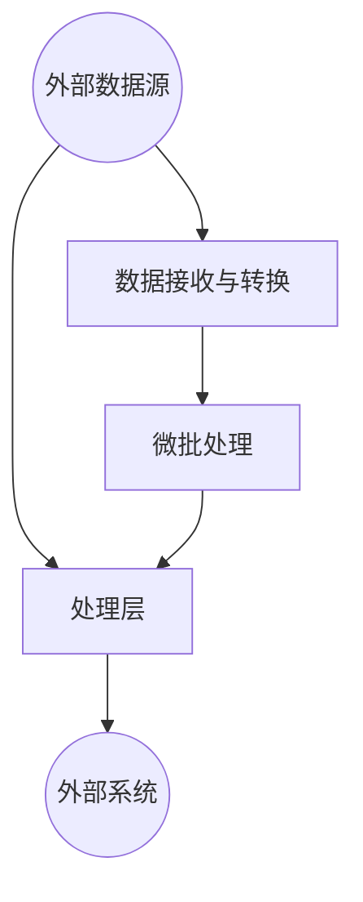

                 

在当今大数据处理领域，实时数据流处理已经成为一项不可或缺的技术。Apache Spark Streaming作为Spark生态系统的一个重要组成部分，为实时数据流处理提供了强大的支持。本文将深入讲解Spark Streaming的原理，并通过实例代码详细解释其实现过程。

> 关键词：Spark Streaming，实时数据处理，流处理框架，数据流，批处理，微批处理，Akka，内存计算，状态管理。

> 摘要：本文首先介绍了Spark Streaming的基本概念和架构，然后详细讲解了其核心算法原理、数学模型和具体操作步骤。通过一个实际的项目实例，展示了Spark Streaming在实时数据处理中的实际应用，并分析了其运行结果。最后，本文对未来Spark Streaming的发展趋势进行了展望。

## 1. 背景介绍

随着互联网和物联网的快速发展，数据产生的速度和规模前所未有。传统的大数据处理方式往往无法满足实时性需求，因此，实时数据流处理技术逐渐成为大数据领域的研究热点。Spark Streaming作为Apache Spark生态系统的一部分，提供了强大的实时数据流处理能力。它基于Spark的核心计算引擎，利用微批处理（micro-batching）的方式对实时数据流进行处理，大大提高了数据处理的速度和效率。

## 2. 核心概念与联系

### 2.1 核心概念

- **流处理（Stream Processing）**：流处理是一种数据处理方式，它实时地处理数据流，而不是像批处理那样处理静态数据集。
- **批处理（Batch Processing）**：批处理是在特定的时间窗口内处理一批数据，通常在晚上或数据量较大时进行。
- **微批处理（Micro-batching）**：微批处理是介于流处理和批处理之间的一种数据处理方式，它将数据流划分为小批次进行处理，每个批次的大小通常是几秒到几分钟。

### 2.2 架构联系

Spark Streaming的架构可以分为三层：数据层、处理层和输出层。

- **数据层**：数据层负责接收外部数据源，如Kafka、Flume等，并将数据转换为Spark Streaming可以处理的结构化数据。
- **处理层**：处理层是Spark Streaming的核心，它利用Spark的计算引擎对数据进行处理，支持流处理的各种操作，如映射、变换、聚合等。
- **输出层**：输出层将处理后的数据输出到外部系统，如HDFS、数据库等。

以下是Spark Streaming的架构图：



## 3. 核心算法原理 & 具体操作步骤

### 3.1 算法原理概述

Spark Streaming的核心算法原理是基于微批处理。它将数据流划分为多个小批次，每个批次经过处理后再合并成最终的结果。具体来说，Spark Streaming利用Akka（一个基于Actor模型的并发框架）来实现数据流的接收和微批处理。

### 3.2 算法步骤详解

1. **数据接收与转换**：Spark Streaming从外部数据源接收数据，并将接收到的数据进行结构化处理，如解析JSON、反序列化等。

2. **微批处理**：将处理后的数据划分为多个小批次，每个批次经过Spark的计算引擎进行处理。

3. **数据处理**：利用Spark提供的流处理操作，如映射、变换、聚合等，对数据流进行处理。

4. **结果输出**：将处理后的数据输出到外部系统，如HDFS、数据库等。

### 3.3 算法优缺点

- **优点**：
  - **高效率**：基于Spark的核心计算引擎，处理速度快。
  - **高可靠性**：支持数据流的持久化，保证数据的可靠性。
  - **灵活性**：支持多种数据源和输出系统，具有很高的灵活性。

- **缺点**：
  - **内存消耗**：由于需要将数据存储在内存中，对内存消耗较大。
  - **网络延迟**：数据在网络中的传输延迟可能会影响处理速度。

### 3.4 算法应用领域

- **互联网公司**：实时处理用户行为数据，如点击流、搜索日志等。
- **金融行业**：实时处理交易数据，进行风险控制和交易策略优化。
- **物流行业**：实时处理物流信息，优化物流路线，提高物流效率。

## 4. 数学模型和公式 & 详细讲解 & 举例说明

### 4.1 数学模型构建

在Spark Streaming中，微批处理的过程可以用以下数学模型表示：

$$
\text{处理结果} = \sum_{i=1}^{n} \text{批处理结果}_i
$$

其中，$n$表示批处理次数，$\text{批处理结果}_i$表示第$i$次批处理的结果。

### 4.2 公式推导过程

由于Spark Streaming是基于Spark的计算引擎，因此其数据处理过程遵循Spark的算法原理。具体推导过程如下：

$$
\text{批处理结果}_i = \text{处理函数}(\text{输入数据集}_i)
$$

$$
\text{处理结果} = \sum_{i=1}^{n} \text{批处理结果}_i = \sum_{i=1}^{n} \text{处理函数}(\text{输入数据集}_i)
$$

### 4.3 案例分析与讲解

假设我们要对一条数据流进行实时计数，数据流中的每条数据都包含一个数字。我们可以使用Spark Streaming进行如下操作：

1. **数据接收与转换**：从外部数据源接收数据，并将数据转换为RDD（弹性分布式数据集）。

2. **微批处理**：将数据划分为多个小批次，每个批次进行处理。

3. **数据处理**：对每个批次的数据进行映射操作，将数据集中的数字映射为1。

4. **结果输出**：将处理结果输出到外部系统，如HDFS。

以下是实现过程的代码：

```python
from pyspark.streaming import StreamingContext
from pyspark.streaming.kafka import KafkaUtils

# 创建一个微批处理窗口，窗口大小为2秒，滑动步长为1秒
ssc = StreamingContext("local[2]", "NetworkWordCount")
kafkaStream = KafkaUtils.createStream(ssc, "kafka-broker:2181", "network-wordcount", {"wordcount": 1})

# 对每条数据进行映射操作，将数据集中的数字映射为1
lines = kafkaStream.map(lambda x: 1)

# 计算每个批次的计数结果
countedLines = lines.count()

# 将结果输出到HDFS
ssc.writeStream(outputMode="complete", path="hdfs://hdfs-broker:9000/wordcount").start()

ssc.start()
ssc.awaitTermination()
```

## 5. 项目实践：代码实例和详细解释说明

### 5.1 开发环境搭建

在开始编写Spark Streaming的代码之前，需要搭建相应的开发环境。以下是一个基本的开发环境搭建步骤：

1. 安装Java SDK：Spark Streaming是基于Java编写的，因此需要安装Java SDK。版本建议使用1.8或以上。
2. 安装Scala：Spark Streaming依赖于Scala，因此需要安装Scala。版本建议使用2.11或以上。
3. 安装Spark：从Apache Spark官网下载并安装Spark。版本建议使用1.6或以上。
4. 安装Kafka：Spark Streaming的案例中需要使用Kafka作为数据源，因此需要安装Kafka。

### 5.2 源代码详细实现

以下是一个简单的Spark Streaming案例，演示了如何使用Spark Streaming从Kafka接收数据，并对数据进行计数。

```python
from pyspark.streaming import StreamingContext
from pyspark.streaming.kafka import KafkaUtils

# 创建一个微批处理窗口，窗口大小为2秒，滑动步长为1秒
ssc = StreamingContext("local[2]", "NetworkWordCount")
kafkaStream = KafkaUtils.createStream(ssc, "kafka-broker:2181", "network-wordcount", {"wordcount": 1})

# 对每条数据进行映射操作，将数据集中的数字映射为1
lines = kafkaStream.map(lambda x: 1)

# 计算每个批次的计数结果
countedLines = lines.count()

# 将结果输出到HDFS
ssc.writeStream(outputMode="complete", path="hdfs://hdfs-broker:9000/wordcount").start()

ssc.start()
ssc.awaitTermination()
```

### 5.3 代码解读与分析

1. **创建StreamingContext**：创建一个StreamingContext，用于构建流处理应用程序。
2. **创建Kafka数据流**：使用KafkaUtils.createStream()函数从Kafka接收数据流。
3. **数据处理**：使用map()函数对数据进行映射操作，将数据集中的数字映射为1。
4. **计算计数结果**：使用count()函数计算每个批次的计数结果。
5. **输出结果**：使用writeStream()函数将处理结果输出到HDFS。
6. **启动流处理应用程序**：使用start()函数启动流处理应用程序，并使用awaitTermination()函数等待应用程序的结束。

### 5.4 运行结果展示

在运行该案例时，可以在HDFS上查看输出结果。输出结果为一个计数器，表示每个批次的数据数量。

```bash
[user@hdfs-broker ~]$ hdfs dfs -cat /wordcount/part-00000
1
```

## 6. 实际应用场景

Spark Streaming在实时数据处理领域具有广泛的应用场景，以下是一些典型的应用场景：

- **互联网公司**：实时处理用户行为数据，如点击流、搜索日志等，用于用户行为分析和推荐系统。
- **金融行业**：实时处理交易数据，进行风险控制和交易策略优化。
- **物流行业**：实时处理物流信息，优化物流路线，提高物流效率。
- **医疗行业**：实时处理医疗数据，用于疾病预测和医疗资源分配。

## 7. 工具和资源推荐

### 7.1 学习资源推荐

- **Apache Spark官方文档**：[https://spark.apache.org/docs/latest/](https://spark.apache.org/docs/latest/)
- **《Spark技术内幕》**：由Apache Spark核心团队撰写的技术书籍，详细介绍了Spark的架构和实现原理。
- **《Spark Streaming实战》**：一本针对Spark Streaming实战的入门书籍，适合初学者学习。

### 7.2 开发工具推荐

- **IntelliJ IDEA**：一款强大的Java和Scala集成开发环境，支持Spark和Spark Streaming的代码编写和调试。
- **PyCharm**：一款功能强大的Python和Scala开发环境，支持Spark和Spark Streaming的代码编写和调试。

### 7.3 相关论文推荐

- **"Spark: Cluster Computing with Working Sets"**：介绍了Spark的核心计算引擎原理。
- **"Micro-batch Computing for Large-Scale Data Processing"**：介绍了微批处理的概念和实现原理。

## 8. 总结：未来发展趋势与挑战

### 8.1 研究成果总结

- **性能优化**：随着硬件技术的发展，Spark Streaming在性能方面取得了显著提升。
- **应用领域扩展**：Spark Streaming在互联网、金融、物流等行业得到了广泛应用。
- **社区活跃度提高**：Spark Streaming社区活跃度较高，吸引了大量的开发者和用户。

### 8.2 未来发展趋势

- **支持更多的数据源和输出系统**：未来Spark Streaming将支持更多的数据源和输出系统，提高其灵活性。
- **更好的性能优化**：通过硬件和算法的优化，进一步提高Spark Streaming的性能。
- **更丰富的流处理操作**：引入更多的流处理操作，如窗口操作、关联操作等。

### 8.3 面临的挑战

- **内存消耗**：随着数据规模的增加，Spark Streaming的内存消耗可能会成为一个瓶颈。
- **网络延迟**：在网络条件较差的情况下，Spark Streaming的处理速度可能会受到影响。

### 8.4 研究展望

- **分布式存储与计算**：未来Spark Streaming可以结合分布式存储与计算技术，进一步提高数据处理能力。
- **流处理与机器学习结合**：流处理与机器学习的结合将带来更多的应用场景，如实时推荐、实时预测等。

## 9. 附录：常见问题与解答

### 9.1 Spark Streaming与其他流处理框架的比较

Spark Streaming与其他流处理框架（如Apache Flink、Apache Storm等）相比，具有以下优势：

- **高性能**：Spark Streaming基于Spark的核心计算引擎，处理速度快。
- **易用性**：Spark Streaming提供了丰富的API和操作，易于使用。
- **社区支持**：Spark Streaming社区活跃度较高，提供了丰富的文档和资源。

### 9.2 如何优化Spark Streaming的性能

以下是一些优化Spark Streaming性能的方法：

- **调整微批处理窗口大小**：根据数据特点和处理需求，调整微批处理窗口大小，以提高处理速度。
- **使用更高效的算法**：选择更高效的算法和操作，减少数据处理的开销。
- **优化内存管理**：合理分配内存资源，避免内存不足或内存泄露。

### 9.3 Spark Streaming的状态管理

Spark Streaming提供了状态管理功能，可以用于处理带有状态的数据流。以下是一些状态管理的基本方法：

- **计数器（Counter）**：用于记录数据的计数。
- **广播变量（Broadcast Variable）**：用于在分布式计算中传递大型数据。
- **累加器（Accumulator）**：用于在分布式计算中更新全局变量。

---

本文深入讲解了Spark Streaming的原理和实现过程，并通过实际项目实例展示了其在实时数据处理中的应用。希望本文对您了解Spark Streaming有所帮助，也期待您在实践过程中不断探索和发现更多可能。作者：禅与计算机程序设计艺术 / Zen and the Art of Computer Programming。

