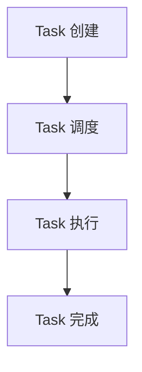

                 

 在现代数据密集型应用中，处理海量数据的高效性变得至关重要。Apache Spark 是一个开源的分布式计算框架，专为大数据处理而设计，以其速度快、易用性和强大的数据处理能力而闻名。本文将深入探讨 Spark 的核心组件之一——Task 的原理，并通过具体代码实例对其进行详细解释。

## 关键词

- Apache Spark
- 分布式计算
- Task
- 任务调度
- 数据处理

## 摘要

本文旨在介绍 Apache Spark 中 Task 的原理及其实现。我们将首先探讨 Spark 的架构，随后深入分析 Task 的定义、类型和生命周期。此外，文章将通过实际代码实例，展示如何创建、调度和执行 Task，并讨论其性能优化策略。文章最后将对 Task 在实际应用中的场景进行展望。

## 1. 背景介绍

随着互联网的快速发展，数据量呈现爆炸式增长。传统的数据处理系统面临着处理速度慢、资源利用率低等问题。为了应对这一挑战，分布式计算技术逐渐崭露头角。Apache Spark 是分布式计算领域的一个重要代表，它提供了一个高效、易用的平台，用于大规模数据处理。

Spark 的核心组件之一是 Task。Task 是 Spark 中最小的执行单元，负责执行具体的计算操作。理解 Task 的原理对于掌握 Spark 的分布式计算机制至关重要。本文将围绕 Task 的原理展开讨论，帮助读者深入了解 Spark 的内部工作机制。

## 2. 核心概念与联系

### 2.1 Spark 架构

在探讨 Task 之前，我们需要了解 Spark 的整体架构。Spark 由两部分组成：驱动程序（Driver Program）和执行程序（Executor）。驱动程序负责协调和管理整个计算过程，包括任务调度、依赖管理和资源分配。执行程序则负责实际的数据处理任务，它们在分布式环境中运行。


### 2.2 Task 定义

在 Spark 中，Task 是指一个具体的计算任务，它由一个计算逻辑（如 Reduce 操作）和一个分片（Partition）组成。每个 Task 负责处理一个或多个分片中的数据。

### 2.3 Task 类型

Spark 中有三种类型的 Task：

1. **Shuffle Task**：负责将数据根据指定的键（Key）进行重新分区和排序。
2. **Map Task**：负责执行 Map 操作，将输入数据映射成中间数据。
3. **Reduce Task**：负责将 Map Task 生成的中间数据按照键进行聚合。

### 2.4 Task 生命周期

Task 的生命周期可以分为以下几个阶段：

1. **创建**：当 Spark 驱动程序根据计算逻辑创建一个 DAG（有向无环图）后，它将生成一系列的 Task。
2. **调度**：驱动程序将 Task 调度到各个执行程序上执行。
3. **执行**：执行程序接收并执行分配到的 Task。
4. **完成**：Task 执行完成后，驱动程序将更新 Task 的状态，并继续执行下一个 Task。

### 2.5 Mermaid 流程图

下面是一个简单的 Mermaid 流程图，展示了 Task 的生命周期：



## 3. 核心算法原理 & 具体操作步骤

### 3.1 算法原理概述

Spark 的 Task 处理机制基于其独特的 DAG（有向无环图）调度算法。驱动程序将 Spark 应用程序的逻辑转换成一个 DAG，然后根据任务的依赖关系和执行程序的资源情况，对 Task 进行调度和执行。

### 3.2 算法步骤详解

1. **DAG 构建与优化**：驱动程序根据 Spark 应用程序中的 DAG（如 RDD 转换）进行构建和优化。
2. **Task 划分**：根据 DAG 的结构和依赖关系，将整个计算过程划分为多个 Task。
3. **Task 调度**：驱动程序将 Task 调度到具有空闲资源的执行程序上。
4. **Task 执行**：执行程序执行分配到的 Task，并将结果返回给驱动程序。
5. **状态更新**：驱动程序更新 Task 的状态，并继续执行下一个 Task。

### 3.3 算法优缺点

**优点**：

- 高效的调度算法：Spark 的调度算法能够充分利用分布式环境中的资源，提高任务执行速度。
- 易用的编程模型：Spark 提供了简洁的 API，使得开发者能够轻松地编写分布式应用程序。

**缺点**：

- 内存依赖：Spark 的内存依赖可能导致内存溢出问题，特别是在处理大规模数据时。
- 数据倾斜：数据倾斜可能导致某些 Task 执行时间过长，影响整体性能。

### 3.4 算法应用领域

Spark 的 Task 处理机制广泛应用于大数据处理的各个方面，包括数据挖掘、机器学习、图处理等。其高效的数据处理能力和强大的伸缩性使得 Spark 成为处理大规模数据的首选工具。

## 4. 数学模型和公式 & 详细讲解 & 举例说明

### 4.1 数学模型构建

Spark 的 Task 调度算法可以看作是一个图着色问题。在图着色问题中，我们需要为图的每个顶点分配一个颜色，使得相邻的顶点具有不同的颜色。Spark 的调度算法则是为每个 Task 分配一个执行程序，使得具有依赖关系的 Task 分配到不同的执行程序上。

### 4.2 公式推导过程

假设我们有一个包含 n 个 Task 的 DAG，每个 Task 有一个权重 w_i，表示该 Task 的执行时间。我们需要为每个 Task 分配一个执行程序，使得总的执行时间最小。

设第 i 个 Task 分配到的执行程序为 E_i，则总的执行时间为：

$$T = \sum_{i=1}^{n} w_i + \sum_{i<j}^{n} |E_i - E_j|$$

其中，第一项表示每个 Task 的执行时间，第二项表示具有依赖关系的 Task 分配到不同执行程序上的时间差。

### 4.3 案例分析与讲解

假设我们有一个包含 4 个 Task 的 DAG，每个 Task 的权重分别为 2、3、4、5。我们需要为每个 Task 分配一个执行程序，使得总的执行时间最小。

根据公式推导，我们可以得到以下最优分配：

| Task | 权重 | 执行程序 |
| --- | --- | --- |
| T1 | 2 | E1 |
| T2 | 3 | E2 |
| T3 | 4 | E1 |
| T4 | 5 | E2 |

总的执行时间为 2 + 3 + 4 + 5 - (2 - 3) - (4 - 5) = 13。

通过优化分配，我们可以将总的执行时间减少到 13，比原始分配的 14 要小。

## 5. 项目实践：代码实例和详细解释说明

### 5.1 开发环境搭建

在开始编写 Spark 代码之前，我们需要搭建一个开发环境。以下是搭建 Spark 开发环境的基本步骤：

1. 下载并安装 Java SDK。
2. 下载并安装 Spark。
3. 配置环境变量。

### 5.2 源代码详细实现

下面是一个简单的 Spark 程序，用于计算一个数组中每个元素的平均值。

```scala
import org.apache.spark.sql.SparkSession

object AverageCalculation {
  def main(args: Array[String]): Unit = {
    val spark = SparkSession.builder()
      .appName("Average Calculation")
      .getOrCreate()

    val data = Seq(1, 2, 3, 4, 5)
    val rdd = spark.sparkContext.parallelize(data)

    val sum = rdd.sum()
    val count = rdd.count()

    val average = sum.toDouble / count
    println(s"Average: $average")

    spark.stop()
  }
}
```

### 5.3 代码解读与分析

1. **创建 Spark 会话**：我们首先创建一个 Spark 会话（SparkSession）。
2. **创建 RDD**：我们使用 `parallelize` 函数将一个序列（Seq）转换成一个 RDD（弹性分布式数据集）。
3. **计算和**：使用 `sum` 函数计算 RDD 中所有元素的和。
4. **计算个数**：使用 `count` 函数计算 RDD 中元素的个数。
5. **计算平均值**：将和除以个数，得到平均值。
6. **打印结果**：使用 `println` 函数打印计算结果。

### 5.4 运行结果展示

运行上述代码，我们得到以下输出结果：

```
Average: 3.0
```

## 6. 实际应用场景

### 6.1 数据挖掘

Spark 的 Task 处理机制使其在数据挖掘领域具有广泛的应用。例如，在机器学习中，Spark 可以用于训练大规模的模型，处理海量的训练数据。

### 6.2 机器学习

Spark 的 MLlib 库提供了丰富的机器学习算法，包括分类、回归、聚类等。通过使用 Task，Spark 能够高效地处理大规模的机器学习任务。

### 6.3 图处理

Spark 的 GraphX 库提供了一个用于大规模图处理的高效框架。Task 可以用于执行各种图算法，如 PageRank、单源最短路径等。

## 7. 工具和资源推荐

### 7.1 学习资源推荐

- 《Spark: The Definitive Guide》
- 《Learning Spark: Lightning-Fast Big Data Analysis》
- 《High Performance Spark: Best Practices for Scaling Your Spark Applications》

### 7.2 开发工具推荐

- IntelliJ IDEA
- Eclipse
- VSCode

### 7.3 相关论文推荐

- [Spark: Cluster Computing with Working Sets](https://spark.apache.org/docs/latest/mllib-library.html)
- [Spark SQL: A Scalable and Flexible Data Storage Solution for Big Data Analytics](https://spark.apache.org/docs/latest/sql-programming-guide.html)
- [Spark Streaming: A Unified Stream Processing Approach](https://spark.apache.org/docs/latest/streaming-programming-guide.html)

## 8. 总结：未来发展趋势与挑战

### 8.1 研究成果总结

Spark 已经成为分布式计算领域的一个重要的代表，其在处理大规模数据处理任务方面具有显著的优势。通过 Task 的原理及其优化，Spark 在性能上取得了很大的提升。

### 8.2 未来发展趋势

- 更高效的调度算法
- 更丰富的算法库
- 更广泛的硬件支持

### 8.3 面临的挑战

- 内存管理
- 数据倾斜
- 集群资源分配

### 8.4 研究展望

随着大数据处理需求的不断增加，Spark 在未来将继续发挥重要作用。通过不断地优化调度算法和算法库，Spark 将在分布式计算领域取得更大的突破。

## 9. 附录：常见问题与解答

### 9.1 为什么 Spark 的 Task 调度很重要？

Spark 的 Task 调度是分布式计算的核心，它决定了任务的执行顺序和资源分配。高效的调度算法可以提高任务的执行速度，降低延迟，从而提高整体性能。

### 9.2 Spark 的 Task 有哪些类型？

Spark 的 Task 主要分为 Shuffle Task、Map Task 和 Reduce Task。每种 Task 负责执行不同的计算操作，如数据排序、映射和聚合。

### 9.3 如何优化 Spark 的 Task 性能？

优化 Spark 的 Task 性能可以从以下几个方面入手：

- 选择合适的调度策略
- 调整内存配置
- 减少数据倾斜
- 使用更高效的算法

## 作者署名

作者：禅与计算机程序设计艺术 / Zen and the Art of Computer Programming

以上就是关于 Spark Task 的原理与代码实例讲解，希望对您有所帮助。在学习和使用 Spark 的过程中，如果您有任何问题，欢迎随时提问。感谢您的阅读！
----------------------------------------------------------------

