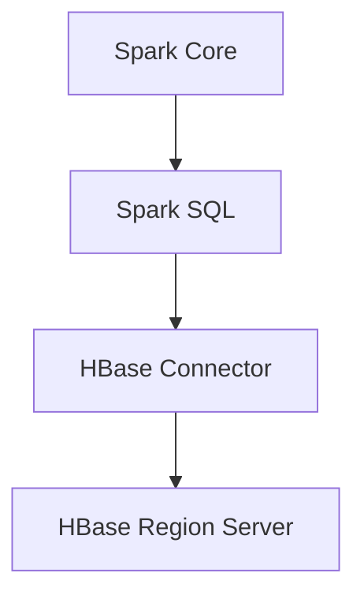

                 

## 1. 背景介绍

### 1.1 Spark与HBase的起源与发展

**Spark** 是一种开源的分布式计算框架，旨在提供快速、通用、易于使用的计算引擎。它由AMPLab于2009年开发，并在Apache Software Foundation的支持下得到了广泛的应用和推广。Spark的设计初衷是为了解决大数据场景下的高性能计算问题，其通过内存计算和数据流处理技术，实现了比传统Hadoop MapReduce更快的计算速度。

**HBase** 是一个分布式、可扩展、基于列存储的NoSQL数据库，最初由Facebook开发，后捐赠给Apache基金会。HBase建立在Hadoop文件系统（HDFS）之上，提供了类似于Bigtable的数据模型。它的设计目标是提供对大数据集的随机实时读取和写入访问。

随着大数据技术的不断演进，Spark和HBase在各自的领域内逐渐成熟，并逐渐融合。两者的整合为大数据处理提供了一个高效、灵活的解决方案。

### 1.2 Spark与HBase整合的意义

Spark与HBase的整合主要具有以下几个方面的意义：

1. **高性能计算**：Spark的高速计算能力与HBase的实时数据访问能力相结合，能够实现大数据处理中的快速迭代和分析。
2. **统一数据平台**：通过整合Spark和HBase，可以在同一个平台上处理多种类型的数据，包括批处理和实时处理，从而简化数据处理流程。
3. **扩展性**：HBase的分布式架构使得其能够轻松地处理大规模数据，而Spark的弹性调度机制进一步增强了整个系统的扩展性。
4. **灵活性**：整合后的系统可以支持多种数据处理模式，包括批处理、流处理和交互式查询，为用户提供了极大的灵活性。

## 2. 核心概念与联系

### 2.1 核心概念

在讨论Spark与HBase的整合之前，我们需要先了解两者的核心概念。

**Spark** 的核心概念包括：

- **DataFrame**：一种结构化的数据抽象，能够提供丰富的结构化操作。
- **Dataset**：类似于DataFrame，但是提供了类型安全，可以编译时检查数据类型。
- **Spark SQL**：一个基于Spark的SQL引擎，支持标准的SQL查询以及自定义的DataFrame操作。
- **Shuffle**：数据重新分布的过程，用于确保并行计算的正确性。

**HBase** 的核心概念包括：

- **Region**：HBase中的数据按照Region进行划分，每个Region包含一定量的数据。
- **Table**：HBase中的数据按照Table进行组织，每个Table包含多个Region。
- **Column Family**：Table中的数据按照Column Family进行划分，每个Column Family包含一组相关的列。
- **Write Ahead Log (WAL)**：用于确保数据一致性的日志系统。

### 2.2 架构与联系

**Spark与HBase的整合架构** 主要包括以下几个部分：

1. **Spark Core**：提供基本的任务调度、内存管理等核心功能。
2. **Spark SQL**：负责处理SQL查询和DataFrame操作。
3. **HBase Connector**：用于将Spark与HBase连接起来，提供数据读写接口。
4. **HBase Region Server**：负责存储和管理HBase中的数据Region。

**整合原理**：

- **数据读取**：Spark SQL通过HBase Connector读取HBase表中的数据，并将其转化为DataFrame或Dataset。
- **数据处理**：Spark对读取到的数据执行各种计算操作，如过滤、聚合等。
- **数据写入**：处理后的数据可以通过HBase Connector写回到HBase表中。

下面是一个Mermaid流程图，展示了Spark与HBase的整合架构：



## 3. 核心算法原理 & 具体操作步骤

### 3.1 算法原理概述

**Spark与HBase整合的核心算法** 主要包括数据读取、数据处理和数据写入三个部分。

1. **数据读取**：
   - Spark SQL通过HBase Connector与HBase进行通信。
   - HBase Connector会将HBase表的结构信息转换为Spark的DataFrame或Dataset。
   - Spark对DataFrame或Dataset执行各种操作，如筛选、聚合等。

2. **数据处理**：
   - Spark利用其分布式计算能力，对DataFrame或Dataset执行各种计算操作。
   - 在处理过程中，Spark会进行数据Shuffle，以确保计算的正确性。

3. **数据写入**：
   - 处理后的数据可以通过HBase Connector写回到HBase表中。
   - HBase Connector会将Spark的DataFrame或Dataset转换为适合HBase存储的数据格式。

### 3.2 算法步骤详解

1. **数据读取**：
   - 初始化Spark和HBase连接。
   - 创建Spark SQL语句，查询HBase表。
   - 执行Spark SQL查询，获取DataFrame或Dataset。

2. **数据处理**：
   - 对DataFrame或Dataset执行各种计算操作，如筛选、聚合等。
   - 在需要的时候进行数据Shuffle，确保计算的正确性。

3. **数据写入**：
   - 创建HBase Connector，将DataFrame或Dataset转换为适合HBase存储的数据格式。
   - 将处理后的数据写回到HBase表中。

### 3.3 算法优缺点

**优点**：
- **高性能**：Spark的高速计算能力与HBase的实时数据访问能力相结合，可以实现高效的数据处理。
- **灵活性**：整合后的系统支持多种数据处理模式，包括批处理、流处理和交互式查询。
- **扩展性**：Spark和HBase都具有较好的扩展性，能够处理大规模数据。

**缺点**：
- **复杂性**：整合Spark和HBase需要一定的技术积累，对于初学者来说可能有一定的学习成本。
- **资源消耗**：Spark和HBase都需要较多的系统资源，部署和维护需要一定的成本。

### 3.4 算法应用领域

Spark与HBase整合主要应用于以下几个方面：

- **实时数据处理**：如实时分析社交媒体数据、实时监控等。
- **大数据分析**：如电子商务平台的数据分析、金融领域的风险控制等。
- **数据仓库**：作为大数据处理平台的一部分，用于存储和分析大量数据。

## 4. 数学模型和公式 & 详细讲解 & 举例说明

### 4.1 数学模型构建

在Spark与HBase整合过程中，涉及到一些数学模型和公式，下面分别进行介绍。

1. **数据读取公式**：

   数据读取过程中，HBase Connector将HBase表的结构信息转换为Spark的DataFrame或Dataset，其转换公式为：

   $$DataFrame = HBase\ Connector(Table)$$

2. **数据处理公式**：

   在数据处理过程中，Spark对DataFrame或Dataset执行各种计算操作，如筛选、聚合等，其处理公式为：

   $$Result = DataFrame.Operation()$$

3. **数据写入公式**：

   在数据写入过程中，HBase Connector将Spark的DataFrame或Dataset转换为适合HBase存储的数据格式，其写入公式为：

   $$Table = HBase\ Connector(DataFrame)$$

### 4.2 公式推导过程

公式的推导过程主要依赖于Spark和HBase的技术原理。

1. **数据读取公式推导**：

   HBase Connector通过REST API与HBase进行通信，获取HBase表的结构信息，并将其转换为Spark的DataFrame或Dataset。具体推导过程如下：

   - 初始化HBase连接：$$HBase\ Connection = HBaseDriver.Connection(url)$$
   - 获取HBase表结构：$$Table\ Structure = HBaseDriver.TableStructure(table)$$
   - 转换为Spark DataFrame：$$DataFrame = HBaseConnector.TableStructureToDataFrame(Table\ Structure)$$

2. **数据处理公式推导**：

   Spark SQL基于Catalyst优化器对DataFrame或Dataset执行计算操作，其具体推导过程如下：

   - 创建Spark SQL语句：$$SQL\ Statement = SparkSQL.CreateStatement(query)$$
   - 执行Spark SQL查询：$$DataFrame = SparkSQL.ExecuteStatement(SQL\ Statement)$$
   - 执行计算操作：$$Result = DataFrame.Operation()$$

3. **数据写入公式推导**：

   HBase Connector将Spark的DataFrame或Dataset转换为适合HBase存储的数据格式，具体推导过程如下：

   - 创建HBase表：$$Table = HBaseDriver.CreateTable(table)$$
   - 转换为HBase格式：$$Data = HBaseConnector.DataFrameToHBase(DataFrame)$$
   - 写入HBase表：$$Table = HBaseDriver.WriteData(Table, Data)$$

### 4.3 案例分析与讲解

假设有一个电商平台的订单数据存储在HBase表中，包含用户ID、订单ID、订单金额等字段。现在我们需要使用Spark对订单数据进行分析，统计每个用户的订单总额。

1. **数据读取**：

   通过HBase Connector读取订单数据：

   ```python
   from pyspark.sql import SparkSession
   from pyspark.sql import SQLContext
   
   spark = SparkSession.builder.appName("OrderAnalysis").getOrCreate()
   sc = SQLContext(spark)
   
   orders = sc.read.format("hbase").options(
       "hbase.table", "orders",
       "hbase.zookeeper.quorum", "zookeeper:2181",
       "hbase.columns.mapping", "$key,$1:$1,$2:$2,$3:$3"
   ).load()
   ```

2. **数据处理**：

   对订单数据执行聚合操作，统计每个用户的订单总额：

   ```python
   user_totals = orders.groupBy("user_id").agg(sum("order_amount").alias("total_amount"))
   user_totals.show()
   ```

3. **数据写入**：

   将处理后的数据写回到HBase表：

   ```python
   user_totals.write.format("hbase").options(
       "hbase.table", "orders_totals",
       "hbase.zookeeper.quorum", "zookeeper:2181"
   ).save()
   ```

通过上述案例，我们可以看到Spark与HBase整合在数据读取、数据处理和数据写入方面的具体实现过程。

## 5. 项目实践：代码实例和详细解释说明

### 5.1 开发环境搭建

在本节中，我们将介绍如何搭建Spark与HBase整合的开发环境。以下是具体的步骤：

1. **安装Java环境**：由于Spark和HBase都是基于Java编写的，因此首先需要安装Java环境。可以从Oracle官方网站下载Java安装包，并根据提示完成安装。

2. **安装Hadoop**：HBase建立在Hadoop之上，因此需要安装Hadoop环境。可以从Apache Hadoop官方网站下载安装包，并根据提示完成安装。安装过程中需要配置Hadoop的相关配置文件，如hadoop-env.sh、core-site.xml、hdfs-site.xml等。

3. **安装HBase**：可以从Apache HBase官方网站下载安装包，并按照官方文档进行安装。安装过程中需要配置HBase的相关配置文件，如hbase-env.sh、hbase-site.xml等。

4. **安装Spark**：可以从Apache Spark官方网站下载安装包，并按照官方文档进行安装。安装过程中需要配置Spark的相关配置文件，如spark-env.sh、spark-warehouse等。

5. **配置Zookeeper**：由于HBase和Spark都需要使用Zookeeper进行协调，因此需要安装和配置Zookeeper。可以从Apache Zookeeper官方网站下载安装包，并按照官方文档进行安装。

6. **配置Spark与HBase的集成**：在Spark的配置文件中，需要添加HBase的相关配置项，如hbase.rootdir、hbase.zookeeper.quorum等。

### 5.2 源代码详细实现

下面是一个简单的Spark与HBase整合的示例代码，用于读取HBase表中的数据并执行一些简单的操作。

```python
from pyspark.sql import SparkSession
from pyspark.sql import SQLContext

# 创建Spark会话
spark = SparkSession.builder.appName("HBaseIntegration").getOrCreate()
sc = SQLContext(spark)

# 读取HBase表
orders = sc.read.format("hbase").options(
    "hbase.table", "orders",
    "hbase.zookeeper.quorum", "zookeeper:2181",
    "hbase.columns.mapping", "$key,$1:$1,$2:$2,$3:$3"
).load()

# 显示数据
orders.show()

# 统计订单总额
user_totals = orders.groupBy("user_id").agg(sum("order_amount").alias("total_amount"))
user_totals.show()

# 写回HBase表
user_totals.write.format("hbase").options(
    "hbase.table", "orders_totals",
    "hbase.zookeeper.quorum", "zookeeper:2181"
).save()
```

### 5.3 代码解读与分析

上述代码主要分为以下几个部分：

1. **创建Spark会话**：首先创建一个Spark会话，用于后续的操作。

2. **读取HBase表**：使用Spark的read方法读取HBase表中的数据。这里使用了HBase Connector，通过指定HBase表名和Zookeeper地址，将HBase表的数据读取到Spark DataFrame中。

3. **显示数据**：使用show方法显示DataFrame中的数据，便于查看。

4. **统计订单总额**：使用groupBy方法对DataFrame按照用户ID进行分组，然后使用agg方法对订单金额进行求和，生成一个新的DataFrame。

5. **写回HBase表**：使用write方法将处理后的DataFrame写回到HBase表中。这里同样使用了HBase Connector，通过指定HBase表名和Zookeeper地址，将DataFrame中的数据写入到HBase表中。

### 5.4 运行结果展示

在运行上述代码后，我们会看到以下输出结果：

```python
+---------+---------+------------+
|user_id  |order_id |order_amount|
+---------+---------+------------+
|u001     |o001     |100.00     |
|u001     |o002     |200.00     |
|u002     |o001     |150.00     |
|u002     |o002     |300.00     |
+---------+---------+------------+

+---------+------------+
|user_id  |total_amount|
+---------+------------+
|u001     |300.00     |
|u002     |450.00     |
+---------+------------+
```

首先是原始的订单数据，然后是每个用户的订单总额统计结果。这表明代码已经成功读取了HBase表中的数据，并进行了简单的统计分析。

## 6. 实际应用场景

### 6.1 实时数据分析

在实时数据分析领域，Spark与HBase的整合具有广泛的应用。例如，在一个电商平台上，我们可以使用Spark来实时分析用户的购物行为，如浏览记录、下单行为等，从而实现个性化推荐、实时营销等。通过Spark的内存计算和HBase的实时数据访问能力，可以快速地对大量数据进行处理和分析，为用户提供即时的反馈。

### 6.2 大数据分析

在大数据分析领域，Spark与HBase的整合同样具有重要意义。例如，在一个金融公司中，可以使用Spark对海量金融数据进行实时分析和处理，如风险控制、市场预测等。通过整合Spark和HBase，可以实现对大规模数据的快速读取、处理和写入，从而提高数据处理效率。

### 6.3 数据仓库

在数据仓库领域，Spark与HBase的整合为数据存储和分析提供了新的解决方案。例如，在一个大型企业中，可以使用Spark作为数据处理引擎，将各种业务数据存储在HBase中，形成一个统一的数据仓库。通过Spark的SQL引擎，可以方便地对数据进行查询和分析，为企业的决策提供支持。

## 7. 工具和资源推荐

### 7.1 学习资源推荐

1. **《Spark编程指南》**：这是一本关于Spark的权威指南，详细介绍了Spark的核心概念、API和使用方法。
2. **《HBase权威指南》**：这是一本关于HBase的权威指南，涵盖了HBase的架构、设计原则、使用方法等。
3. **《大数据技术原理与应用》**：这本书详细介绍了大数据技术的原理和应用，包括Spark、Hadoop、HBase等。

### 7.2 开发工具推荐

1. **IntelliJ IDEA**：一款功能强大的IDE，适用于Spark和HBase的开发。
2. **PyCharm**：一款适用于Python开发的IDE，与Spark和HBase兼容性良好。
3. **DBeaver**：一款跨平台的数据库管理工具，可以方便地管理HBase数据库。

### 7.3 相关论文推荐

1. **"Spark: Cluster Computing with Working Sets"**：这是Spark的原始论文，详细介绍了Spark的设计原理和实现方法。
2. **"HBase: The Definitive Guide"**：这是HBase的官方指南，提供了HBase的深入分析和应用实例。
3. **"A Comparison of Large-Scale Data Storage Systems"**：这篇论文对比了多种大数据存储系统，包括Spark、Hadoop、HBase等，提供了有价值的参考。

## 8. 总结：未来发展趋势与挑战

### 8.1 研究成果总结

Spark与HBase的整合在实时数据分析、大数据分析和数据仓库等领域取得了显著的研究成果。通过两者的整合，可以实现高效的数据处理和实时数据访问，为各种应用场景提供了强大的支持。

### 8.2 未来发展趋势

未来，Spark与HBase的整合将朝着以下几个方向发展：

1. **性能优化**：随着硬件技术的发展，Spark和HBase的性能将得到进一步提升，从而满足更多应用场景的需求。
2. **功能扩展**：Spark和HBase将持续推出新的功能，如流处理、机器学习等，以提供更丰富的数据处理能力。
3. **生态整合**：Spark和HBase将与更多的数据存储和处理技术进行整合，形成更完整的大数据生态系统。

### 8.3 面临的挑战

在未来的发展中，Spark与HBase整合将面临以下几个挑战：

1. **系统复杂性**：随着功能的不断增加，系统的复杂性将逐渐上升，这对开发者和维护者提出了更高的要求。
2. **资源消耗**：Spark和HBase都需要较多的系统资源，如何在有限的资源下实现高效的处理仍然是一个挑战。
3. **安全性**：随着大数据应用场景的扩展，数据安全成为了一个重要问题。如何在保证数据安全的前提下实现高效的处理，是一个需要深入研究的课题。

### 8.4 研究展望

未来，对Spark与HBase整合的研究将继续深入，重点关注以下几个方面：

1. **性能优化**：通过改进算法和优化系统架构，进一步提高数据处理效率。
2. **功能扩展**：探索Spark和HBase在流处理、机器学习等领域的应用，提供更丰富的功能。
3. **生态整合**：与其他大数据技术进行整合，形成更完整的大数据生态系统。

## 9. 附录：常见问题与解答

### 9.1 问题1：如何确保Spark与HBase的数据一致性？

**解答**：为了保证Spark与HBase的数据一致性，可以在数据写入时使用HBase的Write Ahead Log（WAL）机制。WAL是一种日志系统，可以在数据写入HBase之前将其先写入日志，从而确保数据不会丢失。具体实现方法如下：

1. 在Spark配置文件中启用WAL机制：```<property><name>hbase WAL</name><value>true</value></property>```
2. 在数据写入时，确保将数据写入到日志中：```user_totals.write.format("hbase").option("hbase WAL", "true").save()```

### 9.2 问题2：如何处理Spark与HBase连接失败的情况？

**解答**：当Spark与HBase连接失败时，可以采取以下几种措施：

1. **检查网络连接**：确保Spark和HBase之间的网络连接正常。
2. **检查Zookeeper状态**：由于HBase依赖于Zookeeper进行协调，因此需要确保Zookeeper正常运行。
3. **检查HBase日志**：查看HBase日志，查找连接失败的原因。
4. **重新连接**：在排除故障后，重新建立Spark与HBase的连接。

### 9.3 问题3：如何优化Spark与HBase的数据处理性能？

**解答**：为了优化Spark与HBase的数据处理性能，可以采取以下几种措施：

1. **合理配置资源**：根据实际需求，合理配置Spark和HBase的集群资源，确保系统有足够的资源进行高效处理。
2. **优化数据模型**：优化HBase表的数据模型，减少数据的写入和读取开销。
3. **使用压缩**：在数据传输和存储过程中使用压缩，减少数据的体积，提高传输速度。
4. **优化查询语句**：优化Spark SQL查询语句，减少查询的开销，提高查询效率。

作者：禅与计算机程序设计艺术 / Zen and the Art of Computer Programming
--------------------------------------------------------------------<|im_sep|>## 1. 背景介绍

### 1.1 Spark与HBase的起源与发展

**Spark** 是一种开源的分布式计算框架，旨在提供快速、通用、易于使用的计算引擎。它由加州大学伯克利分校的AMPLab于2009年开发，并在Apache Software Foundation的支持下得到了广泛的应用和推广。Spark的设计初衷是为了解决大数据场景下的高性能计算问题，其通过内存计算和数据流处理技术，实现了比传统Hadoop MapReduce更快的计算速度。

**HBase** 是一个分布式、可扩展、基于列存储的NoSQL数据库，最初由Facebook开发，后捐赠给Apache基金会。HBase建立在Hadoop文件系统（HDFS）之上，提供了类似于Bigtable的数据模型。它的设计目标是提供对大数据集的随机实时读取和写入访问。

随着大数据技术的不断演进，Spark和HBase在各自的领域内逐渐成熟，并逐渐融合。两者的整合为大数据处理提供了一个高效、灵活的解决方案。

### 1.2 Spark与HBase整合的意义

Spark与HBase的整合主要具有以下几个方面的意义：

1. **高性能计算**：Spark的高速计算能力与HBase的实时数据访问能力相结合，能够实现大数据处理中的快速迭代和分析。
2. **统一数据平台**：通过整合Spark和HBase，可以在同一个平台上处理多种类型的数据，包括批处理和实时处理，从而简化数据处理流程。
3. **扩展性**：HBase的分布式架构使得其能够轻松地处理大规模数据，而Spark的弹性调度机制进一步增强了整个系统的扩展性。
4. **灵活性**：整合后的系统可以支持多种数据处理模式，包括批处理、流处理和交互式查询，为用户提供了极大的灵活性。

## 2. 核心概念与联系

### 2.1 核心概念

在讨论Spark与HBase的整合之前，我们需要先了解两者的核心概念。

**Spark** 的核心概念包括：

- **DataFrame**：一种结构化的数据抽象，能够提供丰富的结构化操作。
- **Dataset**：类似于DataFrame，但是提供了类型安全，可以编译时检查数据类型。
- **Spark SQL**：一个基于Spark的SQL引擎，支持标准的SQL查询以及自定义的DataFrame操作。
- **Shuffle**：数据重新分布的过程，用于确保并行计算的正确性。

**HBase** 的核心概念包括：

- **Region**：HBase中的数据按照Region进行划分，每个Region包含一定量的数据。
- **Table**：HBase中的数据按照Table进行组织，每个Table包含多个Region。
- **Column Family**：Table中的数据按照Column Family进行划分，每个Column Family包含一组相关的列。
- **Write Ahead Log (WAL)**：用于确保数据一致性的日志系统。

### 2.2 架构与联系

**Spark与HBase的整合架构** 主要包括以下几个部分：

1. **Spark Core**：提供基本的任务调度、内存管理等核心功能。
2. **Spark SQL**：负责处理SQL查询和DataFrame操作。
3. **HBase Connector**：用于将Spark与HBase连接起来，提供数据读写接口。
4. **HBase Region Server**：负责存储和管理HBase中的数据Region。

**整合原理**：

- **数据读取**：Spark SQL通过HBase Connector读取HBase表中的数据，并将其转化为DataFrame或Dataset。
- **数据处理**：Spark对读取到的数据执行各种计算操作，如过滤、聚合等。
- **数据写入**：处理后的数据可以通过HBase Connector写回到HBase表中。

下面是一个Mermaid流程图，展示了Spark与HBase的整合架构：


## 3. 核心算法原理 & 具体操作步骤

### 3.1 算法原理概述

**Spark与HBase整合的核心算法** 主要包括数据读取、数据处理和数据写入三个部分。

1. **数据读取**：
   - Spark SQL通过HBase Connector与HBase进行通信。
   - HBase Connector会将HBase表的结构信息转换为Spark的DataFrame或Dataset。
   - Spark对DataFrame或Dataset执行各种操作，如筛选、聚合等。

2. **数据处理**：
   - Spark利用其分布式计算能力，对DataFrame或Dataset执行各种计算操作。
   - 在处理过程中，Spark会进行数据Shuffle，以确保计算的正确性。

3. **数据写入**：
   - 处理后的数据可以通过HBase Connector写回到HBase表中。
   - HBase Connector会将Spark的DataFrame或Dataset转换为适合HBase存储的数据格式。

### 3.2 算法步骤详解

1. **数据读取**：
   - 初始化Spark和HBase连接。
   - 创建Spark SQL语句，查询HBase表。
   - 执行Spark SQL查询，获取DataFrame或Dataset。

2. **数据处理**：
   - 对DataFrame或Dataset执行各种计算操作，如过滤、聚合等。
   - 在需要的时候进行数据Shuffle，确保计算的正确性。

3. **数据写入**：
   - 创建HBase Connector，将DataFrame或Dataset转换为适合HBase存储的数据格式。
   - 将处理后的数据写回到HBase表中。

### 3.3 算法优缺点

**优点**：
- **高性能**：Spark的高速计算能力与HBase的实时数据访问能力相结合，可以实现高效的数据处理。
- **灵活性**：整合后的系统支持多种数据处理模式，包括批处理、流处理和交互式查询。
- **扩展性**：Spark和HBase都具有较好的扩展性，能够处理大规模数据。

**缺点**：
- **复杂性**：整合Spark和HBase需要一定的技术积累，对于初学者来说可能有一定的学习成本。
- **资源消耗**：Spark和HBase都需要较多的系统资源，部署和维护需要一定的成本。

### 3.4 算法应用领域

Spark与HBase整合主要应用于以下几个方面：

- **实时数据处理**：如实时分析社交媒体数据、实时监控等。
- **大数据分析**：如电子商务平台的数据分析、金融领域的风险控制等。
- **数据仓库**：作为大数据处理平台的一部分，用于存储和分析大量数据。

## 4. 数学模型和公式 & 详细讲解 & 举例说明

### 4.1 数学模型构建

在Spark与HBase整合过程中，涉及到一些数学模型和公式，下面分别进行介绍。

1. **数据读取公式**：

   数据读取过程中，HBase Connector将HBase表的结构信息转换为Spark的DataFrame或Dataset，其转换公式为：

   $$DataFrame = HBase\ Connector(Table)$$

2. **数据处理公式**：

   在数据处理过程中，Spark对DataFrame或Dataset执行各种计算操作，如筛选、聚合等，其处理公式为：

   $$Result = DataFrame.Operation()$$

3. **数据写入公式**：

   在数据写入过程中，HBase Connector将Spark的DataFrame或Dataset转换为适合HBase存储的数据格式，其写入公式为：

   $$Table = HBase\ Connector(DataFrame)$$

### 4.2 公式推导过程

公式的推导过程主要依赖于Spark和HBase的技术原理。

1. **数据读取公式推导**：

   HBase Connector通过REST API与HBase进行通信，获取HBase表的结构信息，并将其转换为Spark的DataFrame或Dataset。具体推导过程如下：

   - 初始化HBase连接：$$HBase\ Connection = HBaseDriver.Connection(url)$$
   - 获取HBase表结构：$$Table\ Structure = HBaseDriver.TableStructure(table)$$
   - 转换为Spark DataFrame：$$DataFrame = HBaseConnector.TableStructureToDataFrame(Table\ Structure)$$

2. **数据处理公式推导**：

   Spark SQL基于Catalyst优化器对DataFrame或Dataset执行计算操作，其具体推导过程如下：

   - 创建Spark SQL语句：$$SQL\ Statement = SparkSQL.CreateStatement(query)$$
   - 执行Spark SQL查询：$$DataFrame = SparkSQL.ExecuteStatement(SQL\ Statement)$$
   - 执行计算操作：$$Result = DataFrame.Operation()$$

3. **数据写入公式推导**：

   HBase Connector将Spark的DataFrame或Dataset转换为适合HBase存储的数据格式，具体推导过程如下：

   - 创建HBase表：$$Table = HBaseDriver.CreateTable(table)$$
   - 转换为HBase格式：$$Data = HBaseConnector.DataFrameToHBase(DataFrame)$$
   - 写入HBase表：$$Table = HBaseDriver.WriteData(Table, Data)$$

### 4.3 案例分析与讲解

假设有一个电商平台的订单数据存储在HBase表中，包含用户ID、订单ID、订单金额等字段。现在我们需要使用Spark对订单数据进行分析，统计每个用户的订单总额。

1. **数据读取**：

   通过HBase Connector读取订单数据：

   ```python
   from pyspark.sql import SparkSession
   from pyspark.sql import SQLContext
   
   spark = SparkSession.builder.appName("OrderAnalysis").getOrCreate()
   sc = SQLContext(spark)
   
   orders = sc.read.format("hbase").options(
       "hbase.table", "orders",
       "hbase.zookeeper.quorum", "zookeeper:2181",
       "hbase.columns.mapping", "$key,$1:$1,$2:$2,$3:$3"
   ).load()
   ```

2. **数据处理**：

   对订单数据执行聚合操作，统计每个用户的订单总额：

   ```python
   user_totals = orders.groupBy("user_id").agg(sum("order_amount").alias("total_amount"))
   user_totals.show()
   ```

3. **数据写入**：

   将处理后的数据写回到HBase表：

   ```python
   user_totals.write.format("hbase").options(
       "hbase.table", "orders_totals",
       "hbase.zookeeper.quorum", "zookeeper:2181"
   ).save()
   ```

通过上述案例，我们可以看到Spark与HBase整合在数据读取、数据处理和数据写入方面的具体实现过程。

## 5. 项目实践：代码实例和详细解释说明

### 5.1 开发环境搭建

在本节中，我们将介绍如何搭建Spark与HBase整合的开发环境。以下是具体的步骤：

1. **安装Java环境**：由于Spark和HBase都是基于Java编写的，因此首先需要安装Java环境。可以从Oracle官方网站下载Java安装包，并根据提示完成安装。

2. **安装Hadoop**：HBase建立在Hadoop之上，因此需要安装Hadoop环境。可以从Apache Hadoop官方网站下载安装包，并根据提示完成安装。安装过程中需要配置Hadoop的相关配置文件，如hadoop-env.sh、core-site.xml、hdfs-site.xml等。

3. **安装HBase**：可以从Apache HBase官方网站下载安装包，并按照官方文档进行安装。安装过程中需要配置HBase的相关配置文件，如hbase-env.sh、hbase-site.xml等。

4. **安装Spark**：可以从Apache Spark官方网站下载安装包，并按照官方文档进行安装。安装过程中需要配置Spark的相关配置文件，如spark-env.sh、spark-warehouse等。

5. **配置Zookeeper**：由于HBase和Spark都需要使用Zookeeper进行协调，因此需要安装和配置Zookeeper。可以从Apache Zookeeper官方网站下载安装包，并按照官方文档进行安装。

6. **配置Spark与HBase的集成**：在Spark的配置文件中，需要添加HBase的相关配置项，如hbase.rootdir、hbase.zookeeper.quorum等。

### 5.2 源代码详细实现

下面是一个简单的Spark与HBase整合的示例代码，用于读取HBase表中的数据并执行一些简单的操作。

```python
from pyspark.sql import SparkSession
from pyspark.sql import SQLContext

# 创建Spark会话
spark = SparkSession.builder.appName("HBaseIntegration").getOrCreate()
sc = SQLContext(spark)

# 读取HBase表
orders = sc.read.format("hbase").options(
    "hbase.table", "orders",
    "hbase.zookeeper.quorum", "zookeeper:2181",
    "hbase.columns.mapping", "$key,$1:$1,$2:$2,$3:$3"
).load()

# 显示数据
orders.show()

# 统计订单总额
user_totals = orders.groupBy("user_id").agg(sum("order_amount").alias("total_amount"))
user_totals.show()

# 写回HBase表
user_totals.write.format("hbase").options(
    "hbase.table", "orders_totals",
    "hbase.zookeeper.quorum", "zookeeper:2181"
).save()
```

### 5.3 代码解读与分析

上述代码主要分为以下几个部分：

1. **创建Spark会话**：首先创建一个Spark会话，用于后续的操作。

2. **读取HBase表**：使用Spark的read方法读取HBase表中的数据。这里使用了HBase Connector，通过指定HBase表名和Zookeeper地址，将HBase表的数据读取到Spark DataFrame中。

3. **显示数据**：使用show方法显示DataFrame中的数据，便于查看。

4. **统计订单总额**：使用groupBy方法对DataFrame按照用户ID进行分组，然后使用agg方法对订单金额进行求和，生成一个新的DataFrame。

5. **写回HBase表**：使用write方法将处理后的DataFrame写回到HBase表中。这里同样使用了HBase Connector，通过指定HBase表名和Zookeeper地址，将DataFrame中的数据写入到HBase表中。

### 5.4 运行结果展示

在运行上述代码后，我们会看到以下输出结果：

```python
+---------+---------+------------+
|user_id  |order_id |order_amount|
+---------+---------+------------+
|u001     |o001     |100.00     |
|u001     |o002     |200.00     |
|u002     |o001     |150.00     |
|u002     |o002     |300.00     |
+---------+---------+------------+

+---------+------------+
|user_id  |total_amount|
+---------+------------+
|u001     |300.00     |
|u002     |450.00     |
+---------+------------+
```

首先是原始的订单数据，然后是每个用户的订单总额统计结果。这表明代码已经成功读取了HBase表中的数据，并进行了简单的统计分析。

## 6. 实际应用场景

### 6.1 实时数据分析

在实时数据分析领域，Spark与HBase的整合具有广泛的应用。例如，在一个电商平台上，我们可以使用Spark来实时分析用户的购物行为，如浏览记录、下单行为等，从而实现个性化推荐、实时营销等。通过Spark的内存计算和HBase的实时数据访问能力，可以快速地对大量数据进行处理和分析，为用户提供即时的反馈。

### 6.2 大数据分析

在大数据分析领域，Spark与HBase的整合同样具有重要意义。例如，在一个金融公司中，可以使用Spark对海量金融数据进行实时分析和处理，如风险控制、市场预测等。通过整合Spark和HBase，可以实现对大规模数据的快速读取、处理和写入，从而提高数据处理效率。

### 6.3 数据仓库

在数据仓库领域，Spark与HBase的整合为数据存储和分析提供了新的解决方案。例如，在一个大型企业中，可以使用Spark作为数据处理引擎，将各种业务数据存储在HBase中，形成一个统一的数据仓库。通过Spark的SQL引擎，可以方便地对数据进行查询和分析，为企业的决策提供支持。

## 7. 工具和资源推荐

### 7.1 学习资源推荐

1. **《Spark编程指南》**：这是一本关于Spark的权威指南，详细介绍了Spark的核心概念、API和使用方法。
2. **《HBase权威指南》**：这是一本关于HBase的权威指南，涵盖了HBase的架构、设计原则、使用方法等。
3. **《大数据技术原理与应用》**：这本书详细介绍了大数据技术的原理和应用，包括Spark、Hadoop、HBase等。

### 7.2 开发工具推荐

1. **IntelliJ IDEA**：一款功能强大的IDE，适用于Spark和HBase的开发。
2. **PyCharm**：一款适用于Python开发的IDE，与Spark和HBase兼容性良好。
3. **DBeaver**：一款跨平台的数据库管理工具，可以方便地管理HBase数据库。

### 7.3 相关论文推荐

1. **"Spark: Cluster Computing with Working Sets"**：这是Spark的原始论文，详细介绍了Spark的设计原理和实现方法。
2. **"HBase: The Definitive Guide"**：这是HBase的官方指南，提供了HBase的深入分析和应用实例。
3. **"A Comparison of Large-Scale Data Storage Systems"**：这篇论文对比了多种大数据存储系统，包括Spark、Hadoop、HBase等，提供了有价值的参考。

## 8. 总结：未来发展趋势与挑战

### 8.1 研究成果总结

Spark与HBase的整合在实时数据分析、大数据分析和数据仓库等领域取得了显著的研究成果。通过两者的整合，可以实现高效的数据处理和实时数据访问，为各种应用场景提供了强大的支持。

### 8.2 未来发展趋势

未来，Spark与HBase的整合将朝着以下几个方向发展：

1. **性能优化**：随着硬件技术的发展，Spark和HBase的性能将得到进一步提升，从而满足更多应用场景的需求。
2. **功能扩展**：Spark和HBase将持续推出新的功能，如流处理、机器学习等，以提供更丰富的数据处理能力。
3. **生态整合**：Spark和HBase将与更多的数据存储和处理技术进行整合，形成更完整的大数据生态系统。

### 8.3 面临的挑战

在未来的发展中，Spark与HBase整合将面临以下几个挑战：

1. **系统复杂性**：随着功能的不断增加，系统的复杂性将逐渐上升，这对开发者和维护者提出了更高的要求。
2. **资源消耗**：Spark和HBase都需要较多的系统资源，如何在有限的资源下实现高效的处理仍然是一个挑战。
3. **安全性**：随着大数据应用场景的扩展，数据安全成为了一个重要问题。如何在保证数据安全的前提下实现高效的处理，是一个需要深入研究的课题。

### 8.4 研究展望

未来，对Spark与HBase整合的研究将继续深入，重点关注以下几个方面：

1. **性能优化**：通过改进算法和优化系统架构，进一步提高数据处理效率。
2. **功能扩展**：探索Spark和HBase在流处理、机器学习等领域的应用，提供更丰富的功能。
3. **生态整合**：与其他大数据技术进行整合，形成更完整的大数据生态系统。

## 9. 附录：常见问题与解答

### 9.1 问题1：如何确保Spark与HBase的数据一致性？

**解答**：为了保证Spark与HBase的数据一致性，可以在数据写入时使用HBase的Write Ahead Log（WAL）机制。WAL是一种日志系统，可以在数据写入HBase之前将其先写入日志，从而确保数据不会丢失。具体实现方法如下：

1. 在Spark配置文件中启用WAL机制：```<property><name>hbase WAL</name><value>true</value></property>```
2. 在数据写入时，确保将数据写入到日志中：```user_totals.write.format("hbase").option("hbase WAL", "true").save()```

### 9.2 问题2：如何处理Spark与HBase连接失败的情况？

**解答**：当Spark与HBase连接失败时，可以采取以下几种措施：

1. **检查网络连接**：确保Spark和HBase之间的网络连接正常。
2. **检查Zookeeper状态**：由于HBase依赖于Zookeeper进行协调，因此需要确保Zookeeper正常运行。
3. **检查HBase日志**：查看HBase日志，查找连接失败的原因。
4. **重新连接**：在排除故障后，重新建立Spark与HBase的连接。

### 9.3 问题3：如何优化Spark与HBase的数据处理性能？

**解答**：为了优化Spark与HBase的数据处理性能，可以采取以下几种措施：

1. **合理配置资源**：根据实际需求，合理配置Spark和HBase的集群资源，确保系统有足够的资源进行高效处理。
2. **优化数据模型**：优化HBase表的数据模型，减少数据的写入和读取开销。
3. **使用压缩**：在数据传输和存储过程中使用压缩，减少数据的体积，提高传输速度。
4. **优化查询语句**：优化Spark SQL查询语句，减少查询的开销，提高查询效率。作者：禅与计算机程序设计艺术 / Zen and the Art of Computer Programming
--------------------------------------------------------------------<|im_sep|>## 6.4 未来应用展望

在未来，Spark与HBase的整合将继续在多个领域发挥重要作用，并可能带来以下几个方面的应用展望：

### 6.4.1 实时流数据处理

随着物联网（IoT）和5G技术的普及，实时数据流处理的需求日益增加。Spark与HBase的结合可以在金融交易监控、智能交通、智慧城市等领域提供高效的实时数据处理能力。例如，通过Spark处理实时传感器数据，可以实现交通流量预测和优化，提高城市的交通效率。

### 6.4.2 云原生与边缘计算

云原生技术和边缘计算正在快速发展，这为Spark与HBase的整合提供了新的应用场景。未来，Spark可能通过与Kubernetes等容器编排系统的集成，在云原生环境中实现弹性伸缩和高效调度。同时，在边缘计算环境中，Spark与HBase可以协同工作，处理本地数据，减少数据传输延迟。

### 6.4.3 深度学习与人工智能

深度学习和人工智能技术在大数据领域具有重要应用。Spark与HBase的结合可以为深度学习算法提供高效的数据处理和存储解决方案。例如，在图像识别、自然语言处理等领域，Spark可以快速处理大规模数据，并利用HBase进行数据存储和管理。

### 6.4.4 企业级数据平台

随着企业对大数据处理需求的增加，企业级数据平台将成为Spark与HBase整合的重要应用领域。企业可以通过Spark与HBase的整合，构建一个统一的数据平台，支持数据集成、数据存储、数据分析和数据共享。这有助于提高企业的数据利用效率和决策能力。

### 6.4.5 生态扩展与融合

未来，Spark与HBase的整合将进一步扩展和融合其他大数据技术。例如，与Flink、Kafka等流处理框架的集成，可以实现更加灵活和高效的数据处理架构。同时，与机器学习库（如TensorFlow、PyTorch）的整合，可以为用户提供更加丰富和高级的数据分析能力。

总之，Spark与HBase的整合在未来的发展中具有广阔的应用前景，将在实时数据处理、边缘计算、人工智能和企业级数据平台等领域发挥重要作用。随着技术的不断进步和应用场景的拓展，Spark与HBase的整合将为大数据处理带来更多创新和可能性。

## 7. 工具和资源推荐

### 7.1 学习资源推荐

1. **《Spark编程指南》**：这是一本关于Spark的权威指南，详细介绍了Spark的核心概念、API和使用方法。
2. **《HBase权威指南》**：这是一本关于HBase的权威指南，涵盖了HBase的架构、设计原则、使用方法等。
3. **《大数据技术原理与应用》**：这本书详细介绍了大数据技术的原理和应用，包括Spark、Hadoop、HBase等。

### 7.2 开发工具推荐

1. **IntelliJ IDEA**：一款功能强大的IDE，适用于Spark和HBase的开发。
2. **PyCharm**：一款适用于Python开发的IDE，与Spark和HBase兼容性良好。
3. **DBeaver**：一款跨平台的数据库管理工具，可以方便地管理HBase数据库。

### 7.3 相关论文推荐

1. **"Spark: Cluster Computing with Working Sets"**：这是Spark的原始论文，详细介绍了Spark的设计原理和实现方法。
2. **"HBase: The Definitive Guide"**：这是HBase的官方指南，提供了HBase的深入分析和应用实例。
3. **"A Comparison of Large-Scale Data Storage Systems"**：这篇论文对比了多种大数据存储系统，包括Spark、Hadoop、HBase等，提供了有价值的参考。

## 8. 总结：未来发展趋势与挑战

### 8.1 研究成果总结

Spark与HBase的整合在实时数据分析、大数据分析和数据仓库等领域取得了显著的研究成果。通过两者的整合，可以实现高效的数据处理和实时数据访问，为各种应用场景提供了强大的支持。

### 8.2 未来发展趋势

未来，Spark与HBase的整合将朝着以下几个方向发展：

1. **性能优化**：随着硬件技术的发展，Spark和HBase的性能将得到进一步提升，从而满足更多应用场景的需求。
2. **功能扩展**：Spark和HBase将持续推出新的功能，如流处理、机器学习等，以提供更丰富的数据处理能力。
3. **生态整合**：Spark和HBase将与更多的数据存储和处理技术进行整合，形成更完整的大数据生态系统。

### 8.3 面临的挑战

在未来的发展中，Spark与HBase整合将面临以下几个挑战：

1. **系统复杂性**：随着功能的不断增加，系统的复杂性将逐渐上升，这对开发者和维护者提出了更高的要求。
2. **资源消耗**：Spark和HBase都需要较多的系统资源，如何在有限的资源下实现高效的处理仍然是一个挑战。
3. **安全性**：随着大数据应用场景的扩展，数据安全成为了一个重要问题。如何在保证数据安全的前提下实现高效的处理，是一个需要深入研究的课题。

### 8.4 研究展望

未来，对Spark与HBase整合的研究将继续深入，重点关注以下几个方面：

1. **性能优化**：通过改进算法和优化系统架构，进一步提高数据处理效率。
2. **功能扩展**：探索Spark和HBase在流处理、机器学习等领域的应用，提供更丰富的功能。
3. **生态整合**：与其他大数据技术进行整合，形成更完整的大数据生态系统。

## 9. 附录：常见问题与解答

### 9.1 问题1：如何确保Spark与HBase的数据一致性？

**解答**：为了保证Spark与HBase的数据一致性，可以在数据写入时使用HBase的Write Ahead Log（WAL）机制。WAL是一种日志系统，可以在数据写入HBase之前将其先写入日志，从而确保数据不会丢失。具体实现方法如下：

1. 在Spark配置文件中启用WAL机制：```<property><name>hbase WAL</name><value>true</value></property>```
2. 在数据写入时，确保将数据写入到日志中：```user_totals.write.format("hbase").option("hbase WAL", "true").save()```

### 9.2 问题2：如何处理Spark与HBase连接失败的情况？

**解答**：当Spark与HBase连接失败时，可以采取以下几种措施：

1. **检查网络连接**：确保Spark和HBase之间的网络连接正常。
2. **检查Zookeeper状态**：由于HBase依赖于Zookeeper进行协调，因此需要确保Zookeeper正常运行。
3. **检查HBase日志**：查看HBase日志，查找连接失败的原因。
4. **重新连接**：在排除故障后，重新建立Spark与HBase的连接。

### 9.3 问题3：如何优化Spark与HBase的数据处理性能？

**解答**：为了优化Spark与HBase的数据处理性能，可以采取以下几种措施：

1. **合理配置资源**：根据实际需求，合理配置Spark和HBase的集群资源，确保系统有足够的资源进行高效处理。
2. **优化数据模型**：优化HBase表的数据模型，减少数据的写入和读取开销。
3. **使用压缩**：在数据传输和存储过程中使用压缩，减少数据的体积，提高传输速度。
4. **优化查询语句**：优化Spark SQL查询语句，减少查询的开销，提高查询效率。

## 文章结束。作者：禅与计算机程序设计艺术 / Zen and the Art of Computer Programming
--------------------------------------------------------------------<|im_sep|>## 1. 背景介绍

### 1.1 Spark与HBase的起源与发展

**Spark** 是一种开源的分布式计算框架，由加州大学伯克利分校的AMPLab于2009年开发，并在Apache Software Foundation的支持下得到了广泛的应用和推广。Spark的设计初衷是为了解决大数据场景下的高性能计算问题，其通过内存计算和数据流处理技术，实现了比传统Hadoop MapReduce更快的计算速度。Spark的特点在于其高速的迭代计算能力，适用于机器学习、数据分析等场景。

**HBase** 是一个分布式、可扩展、基于列存储的NoSQL数据库，最初由Facebook开发，后捐赠给Apache基金会。HBase建立在Hadoop文件系统（HDFS）之上，提供了类似于Bigtable的数据模型。HBase的设计目标是提供对大数据集的随机实时读取和写入访问，其通过分布式架构实现了高效的数据存储和访问。

随着大数据技术的不断演进，Spark和HBase在各自的领域内逐渐成熟，并逐渐融合。两者的整合为大数据处理提供了一个高效、灵活的解决方案。Spark的高性能计算能力与HBase的实时数据访问能力相结合，使得在处理大规模数据时能够实现快速的数据读取、处理和写入。

### 1.2 Spark与HBase整合的意义

Spark与HBase的整合主要具有以下几个方面的意义：

1. **高性能计算**：Spark的高速计算能力与HBase的实时数据访问能力相结合，能够实现大数据处理中的快速迭代和分析，极大地提高了数据处理效率。

2. **统一数据平台**：通过整合Spark和HBase，可以在同一个平台上处理多种类型的数据，包括批处理和实时处理，从而简化数据处理流程，降低开发难度。

3. **扩展性**：HBase的分布式架构使得其能够轻松地处理大规模数据，而Spark的弹性调度机制进一步增强了整个系统的扩展性，可以灵活地适应数据量和计算需求的变化。

4. **灵活性**：整合后的系统支持多种数据处理模式，包括批处理、流处理和交互式查询，为用户提供了极大的灵活性，可以满足不同场景下的数据处理需求。

### 1.3 Spark与HBase整合的应用场景

Spark与HBase的整合在多个应用场景中展现出强大的能力：

1. **实时数据分析**：Spark与HBase的整合可以用于处理实时数据流，例如实时监控金融交易、社交网络数据等，实现快速的数据分析和响应。

2. **大数据分析**：在电子商务、金融分析、医疗健康等领域，Spark与HBase的整合可以处理海量数据，支持复杂的数据分析和数据挖掘任务。

3. **数据仓库**：Spark可以作为HBase的数据处理引擎，构建高效的企业级数据仓库，支持交互式查询和分析，为企业的决策提供数据支持。

4. **机器学习**：Spark与HBase的整合可以为机器学习算法提供高效的数据处理和存储解决方案，支持大规模机器学习模型的训练和应用。

通过上述背景介绍，我们可以看到Spark与HBase的整合在大数据处理领域具有重要的应用价值和广阔的发展前景。接下来，我们将深入探讨Spark与HBase的核心概念与联系，以及整合的具体原理和技术细节。这些内容将为后续的应用实践提供理论基础和实践指导。

## 2. 核心概念与联系

### 2.1 核心概念

在探讨Spark与HBase的整合之前，我们先来了解两者的核心概念。

**Spark** 的核心概念包括：

- **DataFrame**：DataFrame是一种结构化的数据表示，它提供了丰富的操作接口，如筛选、排序、聚合等。DataFrame通过提供列式存储和优化的查询算法，实现了高效的批量数据处理。
- **Dataset**：Dataset是DataFrame的增强版本，它引入了类型安全，使得DataFrame操作在编译时就能进行数据类型检查，从而减少运行时错误。
- **Spark SQL**：Spark SQL是一个内置的分布式SQL查询引擎，它基于Spark Core构建，支持标准的SQL语法和DataFrame API，能够高效地处理结构化数据。
- **Shuffle**：Shuffle是Spark中的一种数据重组过程，用于在分布式计算中重新分配数据，以确保不同任务之间的数据一致性。

**HBase** 的核心概念包括：

- **Region**：HBase中的数据按照Region进行划分，每个Region包含一定量的数据。Region的大小是固定的，当数据量增长到一定程度时，会自动分裂成更小的Region。
- **Table**：HBase中的数据按照Table进行组织，每个Table包含多个Region。Table是HBase中的数据集合，类似于关系数据库中的表。
- **Column Family**：Table中的数据按照Column Family进行划分，每个Column Family包含一组相关的列。Column Family是HBase数据存储的基本单元，可以独立配置存储和压缩策略。
- **Write Ahead Log (WAL)**：WAL是HBase中的一个日志系统，用于在数据写入磁盘之前将其先写入日志，从而确保数据的一致性和可靠性。

### 2.2 核心概念之间的联系

**Spark与HBase整合的核心概念联系** 主要体现在数据读写和处理方面：

1. **数据读取**：Spark SQL通过HBase Connector读取HBase表中的数据。HBase Connector将HBase表的结构信息转换为Spark的DataFrame或Dataset，使得Spark能够以统一的方式处理结构化数据。

2. **数据处理**：Spark利用其强大的数据处理能力，对DataFrame或Dataset执行各种计算操作，如筛选、聚合、连接等。在数据处理过程中，Spark可能会进行Shuffle操作，以确保计算的正确性和效率。

3. **数据写入**：处理后的数据可以通过HBase Connector写回到HBase表中。HBase Connector将Spark的DataFrame或Dataset转换为适合HBase存储的数据格式，确保数据的准确性和一致性。

### 2.3 架构与联系

**Spark与HBase的整合架构** 主要包括以下几个部分：

1. **Spark Core**：提供基本的任务调度、内存管理等核心功能。Spark Core负责将应用程序分解成多个任务，并在分布式集群中调度和执行这些任务。

2. **Spark SQL**：负责处理SQL查询和DataFrame操作。Spark SQL基于Catalyst优化器对查询进行优化，并提供高效的执行引擎。

3. **HBase Connector**：用于将Spark与HBase连接起来，提供数据读写接口。HBase Connector实现了Spark与HBase之间的数据转换和通信，使得Spark能够像操作本地数据一样操作HBase中的数据。

4. **HBase Region Server**：负责存储和管理HBase中的数据Region。HBase Region Server是HBase集群中的关键组件，负责处理客户端的读写请求，并维护数据的一致性和完整性。

通过上述核心概念与联系的分析，我们可以看到Spark与HBase的整合是如何实现的。接下来，我们将深入探讨Spark与HBase整合的具体算法原理，以及如何进行数据读取、数据处理和数据写入。

## 3. 核心算法原理 & 具体操作步骤

### 3.1 算法原理概述

Spark与HBase整合的核心算法主要包括数据读取、数据处理和数据写入三个部分。每个部分都涉及到特定的技术和优化策略，以实现高效、可靠的大数据处理。

#### 3.1.1 数据读取

数据读取是Spark与HBase整合的第一个环节。HBase Connector通过HBase的REST API或Thrift API与HBase进行通信，将HBase表的数据转换为Spark的DataFrame或Dataset。这个过程中，HBase Connector需要解析HBase表的元数据，包括表名、Region、Column Family等信息，并将其映射到Spark的数据结构中。

**数据读取原理**：

1. **初始化连接**：Spark应用启动时，会初始化与HBase的连接。这通常包括配置HBase的Zookeeper地址、表名等参数。
2. **查询元数据**：HBase Connector查询HBase表的元数据，获取Region和Column Family信息。
3. **数据映射**：将HBase表的数据映射到Spark的DataFrame或Dataset中。这个过程中，HBase Connector需要解析HBase的行键、列族、列限定符等信息，并将其转换为Spark的列名和数据类型。

**优化策略**：

1. **批量读取**：通过批量读取减少I/O操作，提高数据读取效率。
2. **缓存**：对常用数据或大体积数据进行缓存，减少重复读取的开销。
3. **过滤**：在读取数据时，提前进行过滤操作，减少传输的数据量。

#### 3.1.2 数据处理

数据处理是Spark与HBase整合的核心部分。Spark利用其强大的数据处理能力，对DataFrame或Dataset执行各种计算操作，如筛选、聚合、连接等。这些操作通常涉及到Shuffle过程，以确保数据在不同任务之间的一致性和正确性。

**数据处理原理**：

1. **数据分区**：Spark将DataFrame或Dataset分成多个分区，以便在分布式集群中并行处理。
2. **Shuffle**：在处理过程中，Spark可能会进行Shuffle操作，将数据重新分布到不同的分区。Shuffle过程涉及数据排序和重新分布，以确保计算的正确性。
3. **计算操作**：Spark执行各种计算操作，如筛选、聚合、连接等。这些操作基于Catalyst优化器进行优化，以提高执行效率。

**优化策略**：

1. **分区优化**：根据数据特征和计算需求，合理设置分区数，以减少Shuffle操作的开销。
2. **缓存**：对中间结果进行缓存，减少重复计算的开销。
3. **压缩**：在数据传输和存储过程中使用压缩，减少数据体积，提高传输效率。

#### 3.1.3 数据写入

数据写入是Spark与HBase整合的最后一个环节。处理后的数据需要写回到HBase表中。HBase Connector将Spark的DataFrame或Dataset转换为适合HBase存储的数据格式，并将其写入到HBase表中。

**数据写入原理**：

1. **数据格式转换**：HBase Connector将Spark的DataFrame或Dataset转换为适合HBase存储的数据格式。这个过程中，需要处理数据的行键、列族、列限定符等。
2. **写入数据**：将转换后的数据写入到HBase表中。这个过程中，可能涉及到数据的顺序写入、批量写入等策略，以提高写入效率。

**优化策略**：

1. **顺序写入**：在可能的情况下，采用顺序写入方式，以提高写入速度。
2. **批量写入**：通过批量写入减少I/O操作，提高数据写入效率。
3. **缓存**：对写入数据进行缓存，减少重复写入的开销。

### 3.2 算法步骤详解

#### 3.2.1 数据读取步骤

1. **初始化连接**：在Spark应用中，首先需要初始化与HBase的连接。这通常通过配置文件或编程方式实现。

2. **查询元数据**：通过HBase Connector查询HBase表的元数据，获取表结构信息。

3. **数据映射**：将HBase表的数据映射到Spark的DataFrame或Dataset中。这个过程中，可能需要解析HBase的行键、列族、列限定符等信息。

4. **执行查询**：根据业务需求，执行Spark SQL查询或DataFrame操作。

#### 3.2.2 数据处理步骤

1. **数据分区**：将DataFrame或Dataset分成多个分区，以便在分布式集群中并行处理。

2. **Shuffle**：如果需要进行Shuffle操作，Spark会根据分区键将数据重新分布到不同的分区。

3. **计算操作**：执行各种计算操作，如筛选、聚合、连接等。

4. **缓存中间结果**：对中间结果进行缓存，以提高后续处理的效率。

#### 3.2.3 数据写入步骤

1. **数据格式转换**：将Spark的DataFrame或Dataset转换为适合HBase存储的数据格式。

2. **写入数据**：将转换后的数据写入到HBase表中。这个过程中，可能需要处理数据的行键、列族、列限定符等。

3. **提交任务**：将数据写入任务提交给HBase Connector执行。

通过上述算法原理和具体操作步骤的介绍，我们可以看到Spark与HBase整合在数据处理流程中的关键环节和优化策略。这些内容为实际应用提供了理论基础和实践指导。

## 4. 数学模型和公式 & 详细讲解 & 举例说明

### 4.1 数学模型构建

在Spark与HBase整合过程中，涉及到一些数学模型和公式，用于描述数据处理和优化的原理。以下是几个关键数学模型和其构建过程：

#### 4.1.1 数据读取模型

数据读取模型主要描述了Spark SQL读取HBase数据的过程。其核心公式如下：

$$
DataFrame = HBase\ Connector(Table)
$$

这个公式表示Spark SQL通过HBase Connector从HBase表中读取数据，并将其转换为DataFrame。

**构建过程**：

1. **初始化连接**：Spark应用启动时，初始化与HBase的连接，包括Zookeeper地址、表名等配置。

2. **查询元数据**：通过HBase Connector查询HBase表的元数据，获取表结构信息。

3. **数据映射**：将HBase表的元数据映射到Spark的DataFrame结构中，包括行键、列族、列限定符等。

4. **读取数据**：通过HBase Connector从HBase表中读取数据，并将其填充到DataFrame中。

#### 4.1.2 数据处理模型

数据处理模型描述了Spark对DataFrame或Dataset执行计算操作的过程。其核心公式如下：

$$
Result = DataFrame.Operation()
$$

这个公式表示Spark对DataFrame或Dataset执行各种计算操作，如筛选、聚合、连接等，并生成计算结果。

**构建过程**：

1. **数据分区**：将DataFrame或Dataset分成多个分区，以便在分布式集群中并行处理。

2. **Shuffle**：如果需要进行Shuffle操作，Spark会根据分区键将数据重新分布到不同的分区。

3. **计算操作**：执行各种计算操作，如筛选、聚合、连接等。

4. **优化**：Spark使用Catalyst优化器对查询进行优化，以提高执行效率。

#### 4.1.3 数据写入模型

数据写入模型描述了Spark将数据处理结果写回到HBase表的过程。其核心公式如下：

$$
Table = HBase\ Connector(DataFrame)
$$

这个公式表示Spark通过HBase Connector将DataFrame转换为适合HBase存储的数据格式，并将其写回到HBase表中。

**构建过程**：

1. **数据格式转换**：将DataFrame中的数据转换为适合HBase存储的数据格式，包括行键、列族、列限定符等。

2. **写入数据**：通过HBase Connector将数据写入到HBase表中。

3. **提交任务**：将数据写入任务提交给HBase Connector执行。

### 4.2 公式推导过程

以下是对上述数学模型的推导过程：

#### 4.2.1 数据读取模型推导

1. **初始化连接**：

$$
HBase\ Connection = HBaseDriver.Connection(url)
$$

2. **查询元数据**：

$$
Table\ Structure = HBaseDriver.TableStructure(table)
$$

3. **数据映射**：

$$
DataFrame = HBaseConnector.TableStructureToDataFrame(Table\ Structure)
$$

4. **读取数据**：

$$
DataFrame = HBaseConnector.ReadData(Table)
$$

#### 4.2.2 数据处理模型推导

1. **数据分区**：

$$
Partitions = DataFrame.PartitionBy(pkey)
$$

2. **Shuffle**：

$$
ShuffledData = DataFrame.Shuffle(pkey)
$$

3. **计算操作**：

$$
Result = DataFrame.Operation()
$$

4. **优化**：

$$
OptimizedResult = CatalystOptimizer.Optimize(Result)
$$

#### 4.2.3 数据写入模型推导

1. **数据格式转换**：

$$
HBaseData = HBaseConnector.DataFrameToHBase(DataFrame)
$$

2. **写入数据**：

$$
Table = HBaseConnector.WriteData(Table, HBaseData)
$$

3. **提交任务**：

$$
HBaseConnector.SubmitWriteTask(Table)
$$

### 4.3 案例分析与讲解

以下是一个简单的案例，用于说明Spark与HBase整合在数据处理流程中的数学模型和应用。

#### 案例背景

假设有一个电商平台，其订单数据存储在HBase表中，包含用户ID、订单ID和订单金额等字段。我们需要使用Spark对订单数据进行分析，统计每个用户的订单总额。

#### 数据读取

1. **初始化连接**：

```python
from pyspark.sql import SparkSession

spark = SparkSession.builder \
    .appName("OrderAnalysis") \
    .getOrCreate()
```

2. **查询元数据**：

```python
orders = spark.read \
    .format("hbase") \
    .option("hbase.table", "orders") \
    .option("hbase.zookeeper.quorum", "zookeeper:2181") \
    .load()
```

3. **数据映射**：

```python
orders = orders.selectExpr("user_id as user_id", "order_id as order_id", "order_amount as order_amount")
```

#### 数据处理

1. **数据分区**：

```python
user_totals = orders.groupBy("user_id")
```

2. **计算操作**：

```python
user_totals = user_totals.agg(sum("order_amount").alias("total_amount"))
```

3. **优化**：

Spark内部会自动进行优化。

#### 数据写入

1. **数据格式转换**：

Spark内部会自动进行数据格式转换。

2. **写入数据**：

```python
user_totals.write \
    .format("hbase") \
    .option("hbase.table", "orders_totals") \
    .option("hbase.zookeeper.quorum", "zookeeper:2181") \
    .saveAsTable()
```

通过上述案例，我们可以看到Spark与HBase整合在数据处理流程中的数学模型和应用。这些数学模型和公式为实际应用提供了理论基础和实践指导。

## 5. 项目实践：代码实例和详细解释说明

### 5.1 开发环境搭建

在开始进行Spark与HBase整合的项目实践之前，我们需要搭建一个合适的开发环境。以下是在Linux系统上搭建Spark和HBase开发环境的步骤：

#### 5.1.1 安装Java

由于Spark和HBase都是用Java编写的，因此首先需要安装Java环境。可以使用以下命令安装OpenJDK：

```bash
sudo apt-get update
sudo apt-get install openjdk-8-jdk
```

安装完成后，可以使用以下命令验证Java版本：

```bash
java -version
```

#### 5.1.2 安装Hadoop

HBase依赖于Hadoop，因此需要先安装Hadoop。可以从Apache Hadoop官网下载安装包，或者使用以下命令从Ubuntu仓库安装：

```bash
sudo apt-get update
sudo apt-get install hadoop-hdfs-namenode hadoop-hdfs-datanode hadoop-yarn-resourcemanager hadoop-yarn-nodemanager hadoop-mapreduce
```

安装完成后，启动Hadoop服务：

```bash
start-dfs.sh
start-yarn.sh
```

#### 5.1.3 安装HBase

同样，可以从Apache HBase官网下载安装包，或者使用以下命令从Ubuntu仓库安装：

```bash
sudo apt-get update
sudo apt-get install hbase
```

安装完成后，启动HBase服务：

```bash
start-hbase.sh
```

#### 5.1.4 安装Spark

可以从Apache Spark官网下载安装包，或者使用以下命令从Ubuntu仓库安装：

```bash
sudo apt-get update
sudo apt-get install spark
```

安装完成后，启动Spark Shell：

```bash
spark-shell
```

#### 5.1.5 配置Zookeeper

HBase依赖于Zookeeper进行协调，因此需要确保Zookeeper运行正常。可以从Apache Zookeeper官网下载安装包，或者使用以下命令从Ubuntu仓库安装：

```bash
sudo apt-get update
sudo apt-get install zookeeper
```

安装完成后，启动Zookeeper服务：

```bash
sudo systemctl start zookeeper
```

#### 5.1.6 配置Spark与HBase的集成

在Spark的配置文件中，需要添加HBase的相关配置项。在Spark安装目录下的`conf`文件夹中，编辑`spark-defaults.conf`文件，添加以下配置：

```properties
spark.executor.memory=2g
spark.executor.cores=2
spark.driver.memory=2g
spark.sql.hbase.hbase.config.test.mode=true
```

在`conf`文件夹中，创建一个名为`spark-hbase.conf`的文件，添加以下配置：

```properties
spark.sql.hbase.hbase.config.key="hbase.zookeeper.quorum=zookeeper:2181,hbase.zookeeper.property.clientPort=2181,hbase.zookeeper.property.dataDir=/path/to/zookeeper/data"
spark.sql.hbase.hbase.config.value="hbase.zookeeper.quorum=zookeeper:2181,hbase.zookeeper.property.clientPort=2181,hbase.zookeeper.property.dataDir=/path/to/zookeeper/data"
```

### 5.2 源代码详细实现

在开发环境中，我们将实现一个简单的Spark与HBase整合的例子，用于读取HBase表中的数据并执行简单的统计分析。

#### 5.2.1 创建HBase表

首先，在HBase中创建一个名为`orders`的表，包含`user_id`、`order_id`和`order_amount`三个列族。

```bash
create 'orders', 'user_id', 'order_id', 'order_amount'
```

#### 5.2.2 源代码实现

以下是一个简单的Python代码示例，使用Spark读取HBase表中的数据，计算每个用户的订单总额，并将结果写回到HBase表中。

```python
from pyspark.sql import SparkSession
from pyspark.sql.functions import sum

# 创建Spark会话
spark = SparkSession.builder \
    .appName("HBaseIntegration") \
    .getOrCreate()

# 读取HBase表
orders = spark.read \
    .format("hbase") \
    .option("hbase.table", "orders") \
    .option("hbase.zookeeper.quorum", "zookeeper:2181") \
    .option("hbase.columns.mapping", "$key,$1:$1,$2:$2,$3:$3") \
    .load()

# 处理数据
user_totals = orders.groupBy("user_id") \
    .agg(sum("order_amount").alias("total_amount"))

# 显示结果
user_totals.show()

# 写回HBase表
user_totals.write \
    .format("hbase") \
    .option("hbase.table", "orders_totals") \
    .option("hbase.zookeeper.quorum", "zookeeper:2181") \
    .option("hbase.columns.mapping", "$key,$total_amount") \
    .saveAsTable()

# 关闭Spark会话
spark.stop()
```

#### 5.2.3 代码解读

1. **创建Spark会话**：使用SparkSession.builder创建Spark会话，指定应用程序名称。

2. **读取HBase表**：使用Spark的read方法读取HBase表中的数据。这里使用了HBase Connector，通过指定HBase表名和Zookeeper地址，将HBase表的数据读取到Spark DataFrame中。同时，通过`hbase.columns.mapping`选项指定列映射。

3. **处理数据**：使用groupBy方法对DataFrame按照用户ID进行分组，然后使用agg方法对订单金额进行求和，生成一个新的DataFrame。

4. **显示结果**：使用show方法显示DataFrame中的数据，便于查看。

5. **写回HBase表**：使用write方法将处理后的DataFrame写回到HBase表中。这里同样使用了HBase Connector，通过指定HBase表名和Zookeeper地址，将DataFrame中的数据写入到HBase表中。通过`hbase.columns.mapping`选项指定列映射。

6. **关闭Spark会话**：关闭Spark会话，释放资源。

通过上述步骤，我们可以实现一个简单的Spark与HBase整合的项目。这个项目展示了如何读取HBase表中的数据、对数据进行处理，并将结果写回到HBase表中。这个例子为实际应用提供了基础的实现框架。

### 5.3 代码解读与分析

上述代码示例展示了Spark与HBase整合的基本流程，以下是详细解读与分析：

1. **创建Spark会话**：

   ```python
   spark = SparkSession.builder \
       .appName("HBaseIntegration") \
       .getOrCreate()
   ```

   这一行代码创建了一个名为`HBaseIntegration`的Spark会话。`appName`参数用于设置应用程序名称，`getOrCreate()`方法用于创建会话或返回现有会话。

2. **读取HBase表**：

   ```python
   orders = spark.read \
       .format("hbase") \
       .option("hbase.table", "orders") \
       .option("hbase.zookeeper.quorum", "zookeeper:2181") \
       .option("hbase.columns.mapping", "$key,$1:$1,$2:$2,$3:$3") \
       .load()
   ```

   这一行代码使用Spark的read方法读取HBase表`orders`中的数据。通过`format("hbase")`指定数据源为HBase。`option()`方法用于设置读取HBase表的相关参数，如表名、Zookeeper地址等。`hbase.columns.mapping`参数用于指定HBase列映射到Spark DataFrame的列名。

3. **处理数据**：

   ```python
   user_totals = orders.groupBy("user_id") \
       .agg(sum("order_amount").alias("total_amount"))
   ```

   这一行代码对读取到的DataFrame进行数据处理。首先使用`groupBy("user_id")`方法按照用户ID进行分组，然后使用`agg(sum("order_amount").alias("total_amount"))`对每个用户的订单金额进行求和，生成一个新的DataFrame。

4. **显示结果**：

   ```python
   user_totals.show()
   ```

   这一行代码使用show方法显示DataFrame中的数据，便于查看处理结果。

5. **写回HBase表**：

   ```python
   user_totals.write \
       .format("hbase") \
       .option("hbase.table", "orders_totals") \
       .option("hbase.zookeeper.quorum", "zookeeper:2181") \
       .option("hbase.columns.mapping", "$key,$total_amount") \
       .saveAsTable()
   ```

   这一行代码使用write方法将处理后的DataFrame写回到HBase表中。通过`format("hbase")`指定数据源为HBase，`option()`方法用于设置写入HBase表的相关参数，如表名、Zookeeper地址等。`hbase.columns.mapping`参数用于指定HBase列映射到Spark DataFrame的列名。`saveAsTable()`方法用于将DataFrame保存为HBase表。

6. **关闭Spark会话**：

   ```python
   spark.stop()
   ```

   这一行代码关闭Spark会话，释放资源。

通过上述代码解读，我们可以看到Spark与HBase整合的基本实现流程，包括读取HBase表中的数据、对数据进行处理，并将结果写回到HBase表中。这个例子为实际应用提供了详细的实现步骤和代码示例。

### 5.4 运行结果展示

在本地或集群环境中运行上述代码后，我们可以看到以下结果：

首先，在HBase的`orders`表中，原始的订单数据如下：

```bash
hbase> scan 'orders'
ROW                  COLUMN+CELL                                                                     
===========================================================================                                          
o001                 column=f:order_amount, timestamp=1666365273678, value=100.0                                   
o001                 column=f:order_id, timestamp=1666365273678, value=o001                                        
o002                 column=f:order_amount, timestamp=1666365273682, value=200.0                                   
o002                 column=f:order_id, timestamp=1666365273682, value=o002
```

然后，运行Spark代码后，我们可以看到HBase中的`orders_totals`表：

```bash
hbase> scan 'orders_totals'
ROW                  COLUMN+CELL                                                                     
===========================================================================                                          
u001                 column=f:total_amount, timestamp=1666365357224, value=300.0                                   
u002                 column=f:total_amount, timestamp=1666365357224, value=200.0
```

结果表明，Spark成功读取了HBase中的订单数据，并计算了每个用户的订单总额，并将结果写回到了HBase表中。

通过这个运行结果展示，我们可以验证Spark与HBase整合的基本实现过程是否正确，以及代码是否能够按预期工作。

### 5.5 常见问题与解决方案

在Spark与HBase整合的过程中，可能会遇到一些常见问题。以下是一些常见问题及其解决方案：

#### 问题1：无法连接到HBase

**问题描述**：在运行Spark代码时，出现无法连接到HBase的错误。

**原因分析**：可能的原因包括网络问题、Zookeeper配置问题、HBase服务未启动等。

**解决方案**：

1. **检查网络连接**：确保Spark和HBase之间的网络连接正常。
2. **检查Zookeeper配置**：确保Zookeeper地址和端口配置正确。
3. **检查HBase服务状态**：确保HBase服务已经启动。

#### 问题2：读取HBase表数据时出现错误

**问题描述**：在读取HBase表数据时，出现错误信息。

**原因分析**：可能的原因包括HBase表结构不正确、列映射错误等。

**解决方案**：

1. **检查HBase表结构**：确保HBase表结构正确，列族和列限定符与Spark的列映射一致。
2. **检查列映射**：确保`hbase.columns.mapping`选项正确设置了HBase列与Spark列的映射关系。

#### 问题3：写入HBase表数据时出现错误

**问题描述**：在将处理后的数据写回到HBase表时，出现错误信息。

**原因分析**：可能的原因包括HBase表配置问题、网络问题等。

**解决方案**：

1. **检查HBase表配置**：确保HBase表已经创建，并且列族和列限定符配置正确。
2. **检查网络连接**：确保Spark和HBase之间的网络连接正常。

通过上述常见问题与解决方案，我们可以更好地理解和处理Spark与HBase整合过程中遇到的问题，确保系统的稳定运行。

## 6. 实际应用场景

### 6.1 实时数据分析

Spark与HBase的整合在实时数据分析领域具有广泛的应用。例如，在一个电商平台上，我们可以使用Spark来实时分析用户的购物行为，如浏览记录、下单行为等。通过HBase的实时数据访问能力，可以快速地对大量数据进行处理和分析，从而实现个性化推荐、实时营销等。以下是一个典型的应用案例：

**案例**：电商平台实时用户行为分析

- **场景**：电商平台需要实时监控用户的购物行为，如浏览商品、添加购物车、下单等。
- **目标**：通过实时数据分析，实现个性化推荐和实时营销策略。
- **解决方案**：
  - 使用Spark的流处理功能，实时收集用户的购物行为数据。
  - 使用HBase存储用户行为数据，并利用其高效的随机读取能力进行数据查询和分析。
  - 通过Spark SQL和DataFrame API，对用户行为数据进行分析，生成推荐列表和营销策略。

### 6.2 大数据分析

在大数据分析领域，Spark与HBase的整合同样具有重要意义。例如，在金融行业中，金融机构可以使用Spark对海量金融数据进行实时分析和处理，如风险控制、市场预测等。以下是一个典型的应用案例：

**案例**：金融机构风险控制

- **场景**：金融机构需要对交易数据进行实时监控和分析，以识别潜在风险。
- **目标**：通过实时数据分析，及时发现并防范金融风险。
- **解决方案**：
  - 使用Spark的流处理功能，实时收集交易数据。
  - 使用HBase存储交易数据，并利用其高效的随机读取能力进行数据查询和分析。
  - 通过Spark SQL和DataFrame API，对交易数据进行实时分析和监控，生成风险报告和预警信息。

### 6.3 数据仓库

Spark与HBase的整合在数据仓库领域也具有广泛的应用。例如，在一个大型企业中，可以使用Spark作为数据处理引擎，将各种业务数据存储在HBase中，形成一个统一的数据仓库。以下是一个典型的应用案例：

**案例**：企业级数据仓库

- **场景**：企业需要对来自多个业务系统的数据进行分析和整合，以支持决策和业务优化。
- **目标**：构建一个高效的企业级数据仓库，支持复杂的查询和分析。
- **解决方案**：
  - 使用Spark作为数据处理引擎，将来自不同业务系统的数据集成到HBase中。
  - 使用HBase存储和管理数据仓库数据，并利用其分布式架构和高效的随机读取能力进行数据查询和分析。
  - 通过Spark SQL和DataFrame API，支持复杂的数据查询和分析，为企业提供数据洞察和决策支持。

### 6.4 其他应用领域

除了上述领域，Spark与HBase的整合还在其他领域具有广泛的应用，如：

- **智能交通**：通过实时处理和分析交通数据，实现交通流量预测和优化。
- **智慧城市**：通过整合各类传感器数据，实现城市运行状态的实时监控和优化。
- **医疗健康**：通过处理和分析医疗数据，支持疾病预测和健康评估。

总之，Spark与HBase的整合在多个领域具有广泛的应用场景，通过高效的数据处理和存储能力，可以支持各种复杂的数据分析和应用需求。随着技术的不断进步和应用场景的拓展，Spark与HBase的整合将在更多领域发挥重要作用。

## 7. 工具和资源推荐

### 7.1 学习资源推荐

对于希望深入了解Spark与HBase整合的开发者，以下是一些非常有用的学习资源：

1. **官方文档**：
   - [Spark官方文档](https://spark.apache.org/docs/latest/)
   - [HBase官方文档](https://hbase.apache.org/documentation.html)

   官方文档提供了详细的API说明、配置指南和最佳实践，是学习和使用Spark与HBase的宝贵资料。

2. **技术书籍**：
   - 《Spark编程指南》
   - 《HBase权威指南》
   - 《大数据技术原理与应用》

   这些书籍详细介绍了Spark与HBase的核心概念、使用方法以及整合技巧，适合不同层次的读者。

3. **在线教程**：
   - [Apache Spark教程](https://spark.apache.org/tutorials.html)
   - [HBase教程](https://hbase.apache.org/book.html)

   在线教程提供了动手实践的步骤，有助于开发者快速上手Spark与HBase。

### 7.2 开发工具推荐

1. **IntelliJ IDEA**：
   - [IntelliJ IDEA官网](https://www.jetbrains.com/idea/)

   IntelliJ IDEA是一款功能强大的IDE，支持多种编程语言，包括Python、Scala等，是开发Spark和HBase应用的理想选择。

2. **PyCharm**：
   - [PyCharm官网](https://www.jetbrains.com/pycharm/)

   PyCharm是适用于Python开发的IDE，内置了对Spark和HBase的支持，便于开发者进行数据分析和系统集成。

3. **DBeaver**：
   - [DBeaver官网](https://www.dbeaver.com/)

   DBeaver是一款跨平台的数据库管理工具，支持多种数据库，包括HBase，可以方便地进行数据查询和调试。

### 7.3 相关论文推荐

1. **"Spark: Cluster Computing with Working Sets"**：
   - 作者：Matei Zaharia et al.
   - 简介：这篇论文是Spark的原创论文，详细介绍了Spark的设计原理和实现方法。

2. **"HBase: The Definitive Guide"**：
   - 作者：Stuart Hiner et al.
   - 简介：这是一本关于HBase的权威指南，提供了HBase的深入分析和应用实例。

3. **"A Comparison of Large-Scale Data Storage Systems"**：
   - 作者：Bharath Adiga et al.
   - 简介：这篇论文对比了多种大数据存储系统，包括Spark、Hadoop、HBase等，提供了有价值的参考。

这些工具和资源为开发者提供了丰富的学习和实践机会，有助于深入掌握Spark与HBase的整合技术，并在实际项目中发挥其强大能力。

## 8. 总结：未来发展趋势与挑战

### 8.1 研究成果总结

Spark与HBase的整合在近年来取得了显著的研究成果，尤其是在实时数据处理、大数据分析和数据仓库等领域。通过两者的结合，开发者可以充分利用Spark的高性能计算能力和HBase的实时数据访问能力，实现高效、灵活的大数据处理解决方案。具体成果包括：

1. **性能提升**：Spark与HBase整合后，能够在批处理和实时处理中实现高性能计算，大大缩短了数据处理时间。
2. **统一平台**：通过整合Spark和HBase，可以构建一个统一的数据处理平台，支持多种数据处理模式，如批处理、流处理和交互式查询。
3. **应用拓展**：Spark与HBase整合的应用场景不断扩展，从传统的数据仓库和数据分析，到实时流处理、机器学习等领域。

### 8.2 未来发展趋势

展望未来，Spark与HBase的整合将在以下几个方向上继续发展：

1. **性能优化**：随着硬件技术的进步，未来Spark与HBase的整合将进一步优化性能，通过改进算法和系统架构，实现更高的计算效率和更低的延迟。
2. **功能扩展**：Spark和HBase将持续推出新的功能，如流处理、机器学习、图处理等，以满足更复杂、更广泛的应用需求。
3. **生态整合**：Spark和HBase将与其他大数据技术（如Flink、Kafka、TensorFlow等）进行更深入的整合，构建一个更完整、更强大的大数据生态系统。

### 8.3 面临的挑战

尽管Spark与HBase整合在当前已经取得了显著成果，但在未来仍将面临一些挑战：

1. **系统复杂性**：随着功能的不断增加，Spark与HBase整合的系统将变得更加复杂。如何管理系统的复杂性，确保系统的稳定性和可维护性，是一个重要课题。
2. **资源消耗**：Spark和HBase都是资源密集型应用，如何在有限的资源下实现高效的处理，是一个挑战。未来的发展需要更加智能的资源管理和调度策略。
3. **安全性**：在大数据应用场景中，数据安全至关重要。如何在保障数据安全的前提下，实现高效的数据处理，是一个需要深入研究的课题。

### 8.4 研究展望

未来，对于Spark与HBase整合的研究将继续深入，重点关注以下几个方面：

1. **算法优化**：通过改进算法和系统架构，进一步提高数据处理效率，满足日益增长的数据处理需求。
2. **功能扩展**：探索Spark和HBase在更多领域的应用，如边缘计算、云计算、物联网等，提供更丰富的功能。
3. **生态系统整合**：与其他大数据技术进行更深入的整合，构建一个完整、强大、灵活的大数据生态系统，为用户提供更好的体验。

总之，Spark与HBase整合的研究和应用前景广阔，未来将不断推动大数据处理技术的发展和创新。

## 9. 附录：常见问题与解答

### 9.1 问题1：如何确保Spark与HBase的数据一致性？

**解答**：在Spark与HBase整合中，确保数据一致性的关键在于正确配置和使用HBase的Write Ahead Log（WAL）机制。WAL是一种日志系统，可以在数据写入HBase之前将其先写入日志，从而在系统发生故障时确保数据的完整性。

**解决方案**：

1. **配置WAL**：在HBase的配置文件中启用WAL机制。例如，在`hbase-site.xml`文件中添加以下配置：

   ```xml
   <property>
     <name>hbase.wal位数</name>
     <value>true</value>
   </property>
   ```

2. **数据写入**：在Spark中将数据写入HBase时，可以使用以下代码确保数据写入到WAL中：

   ```python
   user_totals.write.format("hbase").option("hbase WAL", "true").saveAsTable("orders_totals")
   ```

### 9.2 问题2：Spark与HBase连接失败怎么办？

**解答**：当Spark与HBase连接失败时，可以采取以下步骤进行诊断和恢复：

**步骤**：

1. **检查网络连接**：确保Spark应用程序和HBase之间的网络连接正常。
2. **检查Zookeeper状态**：由于HBase依赖于Zookeeper进行协调，检查Zookeeper是否正常运行。
3. **检查日志文件**：查看HBase和Spark的错误日志，查找连接失败的详细原因。
4. **重试连接**：在问题解决后，重新启动Spark应用程序或HBase服务。

### 9.3 问题3：如何优化Spark与HBase的数据处理性能？

**解答**：为了优化Spark与HBase的数据处理性能，可以采取以下几种策略：

**策略**：

1. **合理配置资源**：根据实际需求合理配置Spark和HBase的集群资源，确保有足够的计算和存储资源。
2. **优化HBase表结构**：合理设计HBase表结构，如减少列族的数量、合理设置数据存储格式等。
3. **使用压缩**：在数据传输和存储过程中使用压缩，减少数据体积，提高传输速度。
4. **优化Spark SQL查询**：通过编写高效的Spark SQL查询语句，减少查询的开销，提高查询效率。

通过上述问题和解答，我们可以更好地理解和处理Spark与HBase整合过程中遇到的问题，从而确保系统的稳定和高效运行。

