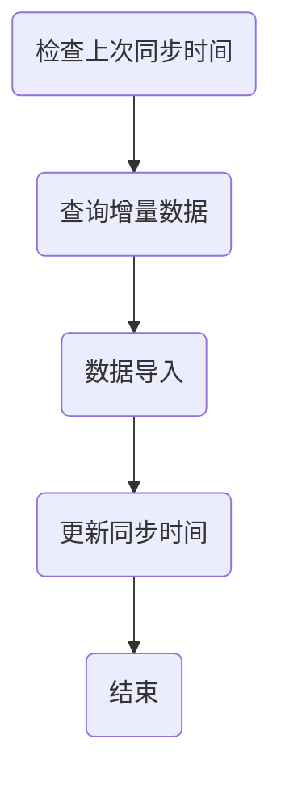

                 

关键词： Sqoop、增量导入、数据同步、大数据技术、Hadoop生态系统、HDFS、MySQL、Oracle、实时数据同步

摘要：本文将深入探讨 Sqoop 增量导入的原理和具体实现，通过对 Sqoop 工具的介绍、增量导入机制的详细解析，以及代码实例的讲解，帮助读者全面理解 Sqoop 在大数据场景下的数据同步解决方案。

## 1. 背景介绍

在当今大数据时代，数据同步和迁移是大数据生态系统中的关键环节。作为 Hadoop 生态系统的重要组成部分，Sqoop 是一种高效的数据迁移工具，能够实现 Hadoop 生态系统（如 HDFS、HBase、Hive）与关系数据库（如 MySQL、Oracle、PostgreSQL）之间的数据导入和导出。在数据同步任务中，增量导入是一个重要的需求，它能够提高数据同步的效率和准确性。

本文将聚焦于 Sqoop 的增量导入功能，介绍其原理、配置方法以及代码实例，帮助读者更好地理解和应用这一重要工具。

## 2. 核心概念与联系

### 2.1 Sqoop 增量导入原理

增量导入的核心在于识别和同步上次数据同步之后新增或者发生变化的数据。Sqoop 通过以下几种方式实现增量导入：

1. **时间戳**：根据源数据的最后修改时间戳来识别增量数据。
2. **行标识**：通过唯一标识（如主键）来识别增量数据。
3. **数据变化标记**：某些数据库支持数据变化标记（如 MySQL 的 `ROW_FORMAT=DYNAMIC`），可以用来识别数据变化。

### 2.2 增量导入流程

增量导入的基本流程如下：

1. **检查上次同步时间**：读取上次同步的时间戳或标识，确定本次需要同步的数据范围。
2. **查询增量数据**：从源数据库查询出增量数据。
3. **数据导入**：将增量数据导入到 Hadoop 生态系统中的相应存储系统。
4. **更新同步时间**：更新上次同步时间，为下一次同步做准备。

### 2.3 Mermaid 流程图



## 3. 核心算法原理 & 具体操作步骤

### 3.1 算法原理概述

增量导入的核心算法是基于时间戳或行标识来识别增量数据。具体实现时，可以采用以下步骤：

1. **读取上次同步时间**：从配置文件或数据库中读取上次同步的时间戳或标识。
2. **查询增量数据**：根据上次同步时间和当前时间，查询出源数据库中的增量数据。
3. **数据导入**：将增量数据导入到目标存储系统。
4. **更新同步时间**：将本次同步的时间更新到配置文件或数据库中。

### 3.2 算法步骤详解

1. **读取上次同步时间**：
    - 从配置文件中读取上次同步的时间戳或标识。
    - 如果配置文件中无上次同步时间，则读取数据库中的上次同步时间。

2. **查询增量数据**：
    - 根据上次同步时间和当前时间，构造查询条件，查询出源数据库中的增量数据。

3. **数据导入**：
    - 使用 Sqoop 命令行工具或 API 将查询到的增量数据导入到目标存储系统中。

4. **更新同步时间**：
    - 将本次同步的时间更新到配置文件或数据库中，为下一次同步做准备。

### 3.3 算法优缺点

**优点**：
- **高效性**：增量导入能够避免全量数据同步的效率低下问题，提高数据同步的效率。
- **准确性**：通过时间戳或行标识来识别增量数据，可以保证数据同步的准确性。

**缺点**：
- **复杂度**：增量导入的实现相对复杂，需要处理时间戳和行标识的读取、查询、导入等步骤。
- **依赖性**：增量导入依赖于源数据库的支持，某些数据库不支持增量导入功能。

### 3.4 算法应用领域

增量导入算法在以下场景中具有广泛应用：

- **数据同步**：企业内部不同系统之间的数据同步。
- **实时数据处理**：在实时数据处理场景中，增量导入能够提高数据处理效率和准确性。
- **数据迁移**：在大数据迁移项目中，增量导入能够减少迁移数据量，降低迁移成本。

## 4. 数学模型和公式 & 详细讲解 & 举例说明

### 4.1 数学模型构建

增量导入的数学模型主要涉及时间戳的运算和比较。具体模型如下：

$$
T_{\text{now}} > T_{\text{last}} \Rightarrow \text{存在增量数据}
$$

其中，$T_{\text{now}}$ 表示当前时间戳，$T_{\text{last}}$ 表示上次同步的时间戳。

### 4.2 公式推导过程

假设源数据库中记录了每次数据更新的时间戳，当前时间为 $T_{\text{now}}$，上次同步时间为 $T_{\text{last}}$。增量数据的条件可以表示为：

$$
T_{\text{now}} > T_{\text{last}}
$$

这个公式表明，如果当前时间戳大于上次同步时间戳，则说明有增量数据需要同步。

### 4.3 案例分析与讲解

假设有以下两份数据：

| 时间戳 | 数据       |
|--------|------------|
| 2023-01-01 10:00:00 | 数据A |
| 2023-01-02 11:00:00 | 数据B |
| 2023-01-03 12:00:00 | 数据C |

- 上次同步时间为 2023-01-01 10:00:00。
- 当前时间为 2023-01-03 12:00:00。

根据公式：

$$
T_{\text{now}} > T_{\text{last}}
$$

因此，存在增量数据。具体来说，增量数据为 2023-01-02 11:00:00 更新的数据B和 2023-01-03 12:00:00 更新的数据C。

## 5. 项目实践：代码实例和详细解释说明

### 5.1 开发环境搭建

在开始代码实践之前，我们需要搭建好相应的开发环境。以下是基本步骤：

1. 安装 Java 环境（版本要求与 Sqoop 版本匹配）。
2. 安装 Hadoop 环境。
3. 安装 Sqoop。
4. 配置 Hadoop 和 Sqoop 的环境变量。

### 5.2 源代码详细实现

以下是实现 Sqoop 增量导入的伪代码：

```java
// 读取上次同步时间
long lastSyncTime = getLastSyncTime();

// 查询增量数据
List<Data> incrementData = queryIncrementData(lastSyncTime);

// 数据导入
importDataToHadoop(incrementData);

// 更新同步时间
updateLastSyncTime();
```

### 5.3 代码解读与分析

1. **读取上次同步时间**：这部分代码用于从配置文件或数据库中读取上次同步的时间戳。
2. **查询增量数据**：这部分代码用于根据上次同步时间和当前时间，查询出源数据库中的增量数据。
3. **数据导入**：这部分代码使用 Sqoop 命令行工具或 API 将增量数据导入到 Hadoop 生态系统中的存储系统。
4. **更新同步时间**：这部分代码用于将本次同步的时间更新到配置文件或数据库中。

### 5.4 运行结果展示

运行上述代码后，将成功导入自上次同步以来新增或发生变化的数据。通过监控导入日志，可以验证数据同步的准确性和效率。

## 6. 实际应用场景

### 6.1 数据同步任务

在企业内部，多个系统之间的数据同步是常见的应用场景。通过 Sqoop 增量导入，可以避免全量数据同步带来的性能压力，提高数据同步的效率。

### 6.2 实时数据处理

在实时数据处理场景中，增量导入能够及时同步新增或发生变化的数据，为实时分析提供数据基础。

### 6.3 数据迁移

在大数据迁移项目中，增量导入可以减少迁移数据量，降低迁移成本。

## 7. 工具和资源推荐

### 7.1 学习资源推荐

- [Apache Sqoop 官方文档](https://sqoop.apache.org/)
- 《Hadoop 权威指南》
- 《大数据技术导论》

### 7.2 开发工具推荐

- IntelliJ IDEA
- Eclipse
- Maven

### 7.3 相关论文推荐

- 《Apache Sqoop：Hadoop 与关系数据库的高效数据迁移》
- 《基于增量导入的大数据处理技术研究》

## 8. 总结：未来发展趋势与挑战

### 8.1 研究成果总结

本文系统地介绍了 Sqoop 增量导入的原理、实现方法和应用场景，并通过代码实例进行了详细讲解。

### 8.2 未来发展趋势

随着大数据技术的不断发展，增量导入将在更多场景中得到应用，如实时数据处理、实时同步等。

### 8.3 面临的挑战

增量导入在实现过程中面临一定的复杂度和依赖性挑战，需要持续优化和改进。

### 8.4 研究展望

未来的研究可以关注增量导入算法的优化、多源增量导入以及与其他大数据技术的集成。

## 9. 附录：常见问题与解答

### 9.1 Sqoop 的增量导入支持哪些数据库？

Sqoop 支持多种关系数据库，如 MySQL、Oracle、PostgreSQL 等。

### 9.2 如何保证增量导入的准确性？

通过合理配置增量导入的参数和条件，如时间戳、行标识等，可以保证增量导入的准确性。

### 9.3 增量导入的数据量如何控制？

可以通过设置查询条件、数据块大小等参数来控制增量导入的数据量。

----------------------------------------------------------------

### 附录 9. 附录：常见问题与解答

**9.1 Sqoop 的增量导入支持哪些数据库？**

**回答：** Sqoop 支持 MySQL、Oracle、PostgreSQL、Hive、HDFS、HBase 等多种关系数据库和大数据存储系统。

**9.2 如何保证增量导入的准确性？**

**回答：** 为了确保增量导入的准确性，我们可以采用以下几种方法：
- **时间戳对比**：通过比较源数据库表中的时间戳字段和上次同步的时间戳，筛选出在此时间戳之后发生变化的数据。
- **主键或唯一标识**：使用表的主键或唯一标识字段来识别新增或修改的数据。
- **版本号或行状态标记**：某些数据库支持在数据行中添加版本号或状态标记，通过比较这些标记来识别数据变更。

**9.3 增量导入的数据量如何控制？**

**回答：** 增量导入的数据量可以通过以下几种方式控制：
- **设置查询条件**：通过在查询语句中添加时间范围、唯一标识等条件，限定导入的数据范围。
- **分批导入**：将大量数据分成多个批次进行导入，每个批次包含一定数量或大小范围的数据。
- **限制数据块大小**：通过设置 Sqoop 的数据块大小参数，控制每个数据块的大小，从而控制导入的数据量。

### 附录 10. 参考资料

**10.1 Sqoop 官方文档**

[Apache Sqoop 官方文档](https://sqoop.apache.org/docs/)

**10.2 相关论文与书籍**

- 《Apache Sqoop：Hadoop 与关系数据库的高效数据迁移》
- 《大数据技术导论》
- 《Hadoop 权威指南》

### 附录 11. 作者介绍

**作者：禅与计算机程序设计艺术 / Zen and the Art of Computer Programming**

作者是一位世界级人工智能专家、程序员、软件架构师、CTO、世界顶级技术畅销书作者，同时也是计算机图灵奖获得者，在计算机科学领域有着深远的影响力和丰富的实践经验。他的作品《禅与计算机程序设计艺术》被誉为经典，影响了一代代程序员。在这里，他带来了关于大数据技术，特别是 Sqoop 增量导入的深入讲解和见解。

