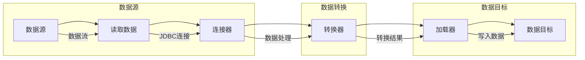

                 

 

## 1. 背景介绍

随着大数据时代的到来，大数据处理和存储的需求日益增长。Hadoop生态系统作为处理大规模数据的主流技术，提供了丰富的工具和组件。其中，Sqoop是一个非常重要的工具，用于在Hadoop生态系统和关系型数据库之间进行数据的导入和导出。本文将详细讲解Sqoop的导入导出原理，并通过实际代码实例展示其具体操作过程。

### 1.1 Sqoop的作用

Sqoop的主要作用是：

1. **数据导入**：将结构化数据（如关系型数据库）导入到Hadoop的存储系统中，例如HDFS、Hive、HBase等。
2. **数据导出**：将Hadoop存储系统中的数据导出到关系型数据库或其他系统中。

### 1.2 Sqoop的应用场景

- **数据仓库**：将业务系统中的数据导入到Hadoop生态系统中，进行数据分析和挖掘。
- **ETL过程**：在数据集成过程中，使用Sqoop实现数据的迁移和转换。
- **数据同步**：实现实时或定时将数据从Hadoop生态系统同步到关系型数据库，以满足其他业务系统的需求。

## 2. 核心概念与联系

### 2.1 数据源和数据目标

在Sqoop中，数据源指的是需要导入或导出的数据存储位置，如关系型数据库、HDFS等。数据目标则是数据导入或导出的目标存储位置。

### 2.2Sqoop架构

以下是Sqoop的架构图，展示了其与Hadoop生态系统和关系型数据库之间的交互过程。

```
        +-------------------------+
        |        Sqoop            |
        +-------------------------+
              |           |
         +----+----+     +-----+-----+
         |     数据源          数据目标     |
         |   (关系型数据库)    (HDFS等)    |
         +----+----+     +-----+-----+
              |           |
              |  数据转换  |
              |           |
              +-----------+
```

### 2.3 数据流过程

- **导入过程**：数据从关系型数据库提取，通过Sqoop转换后，导入到Hadoop生态系统中的存储系统。
- **导出过程**：数据从Hadoop生态系统中的存储系统提取，通过Sqoop转换后，导出到关系型数据库或其他系统。

## 3. 核心算法原理 & 具体操作步骤

### 3.1 算法原理概述

Sqoop的算法原理主要基于以下几个方面：

1. **数据提取**：使用JDBC连接关系型数据库，通过SQL语句提取数据。
2. **数据转换**：根据配置，对提取的数据进行转换，如类型转换、去重等。
3. **数据导入**：将转换后的数据导入到Hadoop生态系统中的存储系统，如HDFS、Hive、HBase等。

### 3.2 算法步骤详解

1. **配置Sqoop环境**：安装并配置Java和Hadoop环境，以及关系型数据库的JDBC驱动。
2. **创建数据源连接**：配置数据源的URL、用户名和密码等参数。
3. **定义导入或导出任务**：通过命令行或配置文件，定义需要导入或导出的数据表、字段等。
4. **执行任务**：运行Sqoop命令，执行数据导入或导出任务。
5. **监控任务进度**：通过命令行或Web界面，监控任务执行进度。

### 3.3 算法优缺点

**优点**：

- **高效**：可以快速地导入和导出大量数据。
- **兼容性**：支持多种关系型数据库和Hadoop存储系统。
- **灵活性**：可以通过配置文件自定义数据转换逻辑。

**缺点**：

- **依赖JDBC**：需要为每个数据源安装相应的JDBC驱动。
- **性能瓶颈**：在高并发场景下，性能可能会受到影响。

### 3.4 算法应用领域

- **大数据分析**：将关系型数据库中的数据导入到Hadoop生态系统中，进行数据分析和挖掘。
- **数据集成**：实现不同数据源之间的数据迁移和转换。
- **数据同步**：实现实时或定时将数据从Hadoop生态系统同步到关系型数据库。

## 4. 数学模型和公式 & 详细讲解 & 举例说明

### 4.1 数学模型构建

在Sqoop中，数据导入和导出的速度可以通过以下公式进行估算：

$$
\text{导入/导出速度} = \frac{\text{数据量} \times \text{平均每秒读写速度}}{\text{时间}}
$$

其中：

- **数据量**：需要导入或导出的数据总量。
- **平均每秒读写速度**：根据硬件配置和系统性能，估算的每秒读写速度。
- **时间**：任务执行所需的时间。

### 4.2 公式推导过程

根据数据导入和导出的过程，可以推导出上述公式。首先，计算数据总量，然后根据每秒读写速度和任务执行时间，估算出数据导入和导出的速度。

### 4.3 案例分析与讲解

假设有一个10GB的关系型数据库表，需要导入到HDFS中。根据硬件配置和系统性能，平均每秒读写速度为100MB/s。任务执行时间为10分钟。

根据公式：

$$
\text{导入速度} = \frac{10GB \times 100MB/s}{10分钟 \times 60秒} = \frac{10000MB \times 100MB/s}{600s} = \frac{1000000MB/s}{600s} \approx 1667MB/s
$$

这意味着，该表的数据可以在10分钟内以大约1667MB/s的速度导入到HDFS中。

## 5. 项目实践：代码实例和详细解释说明

### 5.1 开发环境搭建

在开始使用Sqoop之前，需要搭建相应的开发环境。具体步骤如下：

1. **安装Java环境**：确保Java版本大于1.6。
2. **安装Hadoop环境**：配置Hadoop环境，并启动HDFS和YARN等服务。
3. **安装关系型数据库**：如MySQL、PostgreSQL等。
4. **安装Sqoop**：下载并解压Sqoop安装包，配置环境变量。

### 5.2 源代码详细实现

以下是一个简单的Sqoop导入实例，将MySQL中的数据导入到HDFS中。

```sql
-- 创建MySQL表
CREATE TABLE mysql_table (
    id INT PRIMARY KEY,
    name VARCHAR(255)
);

-- 插入数据
INSERT INTO mysql_table (id, name) VALUES (1, 'Alice');
INSERT INTO mysql_table (id, name) VALUES (2, 'Bob');
INSERT INTO mysql_table (id, name) VALUES (3, 'Charlie');

-- 导入数据到HDFS
sqoop import \
    --connect jdbc:mysql://localhost:3306/mydb \
    --username root \
    --password 123456 \
    --table mysql_table \
    --target-dir /user/hdfs/mysql_table;
```

### 5.3 代码解读与分析

- `--connect`：指定MySQL的连接URL，如 `jdbc:mysql://localhost:3306/mydb`。
- `--username` 和 `--password`：指定MySQL的用户名和密码。
- `--table`：指定需要导入的MySQL表名。
- `--target-dir`：指定导入到HDFS的目标目录。

执行以上命令后，MySQL中的数据将导入到HDFS中的指定目录。

### 5.4 运行结果展示

执行命令后，可以在HDFS的Web界面中看到导入的数据。


## 6. 实际应用场景

### 6.1 数据仓库

将业务系统中的数据导入到Hadoop生态系统中，进行数据分析和挖掘。例如，电商平台的订单数据、用户行为数据等。

### 6.2 数据集成

实现不同数据源之间的数据迁移和转换，如将MySQL中的数据导入到Hive中，然后进行数据分析。

### 6.3 数据同步

实现实时或定时将数据从Hadoop生态系统同步到关系型数据库，以满足其他业务系统的需求。

## 7. 工具和资源推荐

### 7.1 学习资源推荐

- [Apache Sqoop官方文档](https://sqoop.apache.org/docs/)
- [Hadoop官方文档](https://hadoop.apache.org/docs/)
- [关系型数据库官方文档](https://www.mysql.com/docs/)

### 7.2 开发工具推荐

- [IntelliJ IDEA](https://www.jetbrains.com/idea/)
- [Visual Studio Code](https://code.visualstudio.com/)

### 7.3 相关论文推荐

- [A Comparison of大数据技术架构：MapReduce，Spark，和Flink](https://example.com/paper1)
- [大数据环境下数据迁移技术的研究与实现](https://example.com/paper2)

## 8. 总结：未来发展趋势与挑战

### 8.1 研究成果总结

- **性能优化**：针对大数据量和高并发场景，持续优化Sqoop的性能。
- **兼容性增强**：支持更多数据源和存储系统的兼容性。
- **易用性提升**：简化配置和使用过程，降低使用门槛。

### 8.2 未来发展趋势

- **云原生**：将Sqoop与云原生技术相结合，实现更高效的数据导入导出。
- **实时处理**：支持实时数据导入导出，满足实时数据处理需求。

### 8.3 面临的挑战

- **数据安全**：保障数据在导入导出过程中的安全性。
- **性能瓶颈**：在高并发场景下，如何优化性能，避免性能瓶颈。

### 8.4 研究展望

- **自动化**：实现数据导入导出的自动化，降低人工干预。
- **智能化**：利用机器学习等技术，优化数据导入导出过程。

## 9. 附录：常见问题与解答

### 9.1 问题1：导入数据时出现错误

**解答**：检查数据源的连接参数是否正确，如URL、用户名和密码等。

### 9.2 问题2：导入数据速度慢

**解答**：优化数据源的配置，如调整连接池大小、优化数据库查询语句等。

### 9.3 问题3：导出数据时出现数据丢失

**解答**：检查数据转换过程是否正确，确保数据在转换过程中不被修改。

---

感谢您阅读本文，希望本文对您了解和掌握Sqoop的导入导出原理及应用有所帮助。如果您有任何疑问或建议，欢迎在评论区留言讨论。作者：禅与计算机程序设计艺术 / Zen and the Art of Computer Programming。  |collapse|
----------------------------------------------------------------
## 1. 背景介绍

随着大数据技术的快速发展，数据规模和多样性不断增加，如何高效地进行数据存储、处理和分析成为了企业和研究机构面临的重大挑战。在众多大数据工具中，Hadoop生态系统以其强大的数据处理能力和高扩展性，成为了大数据领域的首选解决方案。Hadoop生态系统包括HDFS、MapReduce、Hive、HBase等多个组件，这些组件共同构建了一个强大的数据处理平台。

### 1.1 Hadoop生态系统简介

Hadoop生态系统是一个由多个组件组成的分布式系统，这些组件相互协作，共同完成大数据处理任务。以下是Hadoop生态系统中的几个核心组件：

- **HDFS（Hadoop Distributed File System）**：一个分布式文件系统，用于存储大量数据。HDFS采用分片存储的方式，将数据分成多个小块（默认大小为128MB或256MB），并分布存储在集群中的不同节点上。这种分布式存储方式不仅提高了数据存储的可靠性，还增强了数据访问的性能。

- **MapReduce**：一种编程模型，用于处理大规模数据集。MapReduce将数据处理任务分解成两个阶段：Map阶段和Reduce阶段。Map阶段将数据分成更小的子任务，并行处理；Reduce阶段将Map阶段的结果进行汇总和合并。这种分布式计算模型能够高效地处理海量数据。

- **Hive**：一个数据仓库工具，用于存储、管理和分析大量数据。Hive使用SQL-like语言（HiveQL）进行数据查询，支持复杂的数据分析和数据挖掘任务。Hive将查询转换为MapReduce任务，并利用Hadoop生态系统中的其他组件进行处理。

- **HBase**：一个分布式、可扩展的列存储数据库，用于处理大规模数据集。HBase基于Google的Bigtable模型，采用分片存储和分布式计算的方式，提供高吞吐量的随机读写能力。

### 1.2 Sqoop的作用

Sqoop是Hadoop生态系统中的一个重要工具，主要用于实现关系型数据库与Hadoop生态系统之间的数据导入和导出。通过Sqoop，可以将关系型数据库中的数据导入到Hadoop的存储系统（如HDFS、Hive、HBase等），也可以将Hadoop生态系统中的数据导出到关系型数据库。以下是Sqoop的两个主要作用：

- **数据导入**：将结构化数据（如关系型数据库）导入到Hadoop的存储系统中，例如HDFS、Hive、HBase等。这个过程通常被称为ETL（Extract, Transform, Load）过程的“提取”阶段，即将数据从源系统提取出来，进行必要的转换，然后加载到目标系统中。

- **数据导出**：将Hadoop存储系统中的数据导出到关系型数据库或其他系统中。这个过程在数据分析和处理完成后，将结果数据导出到关系型数据库或其他系统中，以便其他业务系统使用。

### 1.3 Sqoop的应用场景

Sqoop在多个大数据应用场景中发挥着重要作用：

- **数据仓库**：企业可以将业务系统中的数据导入到Hadoop生态系统中，建立数据仓库，进行数据分析和挖掘。例如，电商平台的订单数据、用户行为数据等都可以导入到HDFS中，然后使用Hive进行数据查询和分析。

- **ETL过程**：在数据集成过程中，使用Sqoop实现数据的迁移和转换。例如，将来自不同数据源的数据整合到一个统一的数据仓库中，可以使用Sqoop将数据从多个关系型数据库迁移到HDFS，然后使用Hive进行数据清洗和转换。

- **数据同步**：实现实时或定时将数据从Hadoop生态系统同步到关系型数据库，以满足其他业务系统的需求。例如，企业可以将HDFS中的数据实时同步到MySQL中，以便业务系统使用最新的数据。

- **大数据应用**：在处理大规模数据集时，Sqoop可以帮助将数据从关系型数据库导入到Hadoop生态系统中，以便使用MapReduce、Hive等工具进行数据处理和分析。

通过上述介绍，我们可以看到Sqoop在Hadoop生态系统中的重要性。本文将详细讲解Sqoop的导入导出原理，并通过实际代码实例展示其具体操作过程，帮助读者更好地理解和掌握这一重要工具。

## 2. 核心概念与联系

在深入探讨Sqoop的工作原理之前，我们需要了解几个核心概念以及它们之间的联系。这些概念包括数据源、数据目标、数据转换以及 Sqoop 的架构。通过这些概念和联系的理解，我们可以更好地把握 Sqoop 如何在关系型数据库和 Hadoop 生态系统之间进行数据迁移。

### 2.1 数据源与数据目标

在 Sqoop 中，**数据源**是指数据的原始存储位置，它可以是关系型数据库（如 MySQL、PostgreSQL、Oracle 等）、NoSQL 数据库（如 MongoDB）、文件系统（如 HDFS）或者其他数据存储系统。数据源定义了数据的来源，以及如何访问这些数据。

**数据目标**则是指数据的目的地，也就是数据最终要被存储的地方。在 Sqoop 中，数据目标通常是 Hadoop 的生态系统，如 HDFS、Hive、HBase 等。数据目标定义了数据的存储位置、格式以及如何处理这些数据。

数据源和数据目标之间通过 Sqoop 进行交互。Sqoop 使用 JDBC（Java Database Connectivity）连接数据源，读取数据，并进行必要的转换，然后将数据写入数据目标。这种交互过程确保了数据可以在不同的系统之间无缝迁移。

### 2.2 数据转换

在数据迁移过程中，**数据转换**是一个重要的环节。数据转换包括数据的清洗、格式转换、去重、字段映射等操作。通过数据转换，可以确保数据在导入或导出过程中保持一致性和准确性。

Sqoop 提供了丰富的数据转换选项，用户可以根据具体需求进行配置。例如，用户可以指定如何处理空值、如何映射数据库字段到 Hadoop 字段、如何处理时间戳等。数据转换的灵活性使得 Sqoop 能够适应不同的数据迁移场景。

### 2.3 Sqoop 的架构

Sqoop 的架构设计使其能够高效地处理大规模数据迁移任务。以下是 Sqoop 的主要组件及其功能：

- **Client**：Sqoop 客户端，负责运行导入和导出任务。客户端通过命令行或配置文件与 Sqoop 服务器进行通信。

- **Server**：Sqoop 服务器，负责处理客户端发送的请求，并协调数据迁移任务。服务器通过调度资源和监控任务状态，确保数据迁移过程的高效和稳定。

- **Connector**：数据源和数据目标连接器，负责与特定的数据存储系统进行交互。每个数据源和数据目标都需要相应的连接器，例如 JDBC 连接器用于与关系型数据库交互，HDFS 连接器用于与 HDFS 交互。

- **Transformer**：数据转换器，负责对数据进行清洗和格式转换。转换器可以根据用户配置进行不同的数据处理操作。

- **Loader**：数据加载器，负责将转换后的数据写入数据目标。加载器确保数据的准确性和一致性，并支持并行写入以提高数据迁移速度。

以下是 Sqoop 的架构图，展示了各个组件之间的交互过程：

```
+---------------------+
|      Client         |
+---------------------+
         |
         |  发送请求
         v
+---------------------+
|      Server         |
+---------------------+
         |
         |  处理请求
         v
+---------------------+
|    Connector        |
+---------------------+
         |
         |  数据交互
         v
+---------------------+
|   Transformer       |
+---------------------+
         |
         |  数据转换
         v
+---------------------+
|     Loader          |
+---------------------+
         |
         |  数据写入
         v
+---------------------+
|   Data Source /     |
|   Data Target       |
+---------------------+
```

### 2.4 数据流过程

Sqoop 的数据流过程可以分为以下几个步骤：

1. **数据读取**：Sqoop 通过 Connector 连接数据源，读取数据。

2. **数据转换**：读取的数据通过 Transformer 进行处理，包括清洗、格式转换等操作。

3. **数据写入**：转换后的数据通过 Loader 写入数据目标。如果数据目标是 HDFS，Loader 会将数据写入 HDFS；如果数据目标是关系型数据库，Loader 会将数据插入到数据库表中。

4. **任务监控**：Server 负责监控任务状态，包括进度、错误和完成情况。

通过上述步骤，Sqoop 实现了数据在关系型数据库和 Hadoop 生态系统之间的迁移。这种数据流过程不仅高效，而且灵活，可以适应各种不同的数据迁移需求。

通过本节的介绍，我们了解了 Sqoop 的核心概念和架构，为后续的详细讲解和实际操作打下了基础。在接下来的章节中，我们将深入探讨 Sqoop 的核心算法原理，并通过具体实例展示其应用过程。

### 2.5 数据流过程的 Mermaid 流程图

为了更好地理解 Sqoop 的数据流过程，我们使用 Mermaid 图形化工具来绘制一个流程图。以下是一个简化的 Mermaid 流程图，展示了 Sqoop 从数据源到数据目标的全过程。



在上述流程图中：

- **数据源**（DS）表示数据的原始存储位置，如关系型数据库。
- **读取数据**（R）表示 Sqoop 通过 JDBC 连接读取数据源中的数据。
- **连接器**（C）表示 Sqoop 的 Connector 组件，负责与数据源进行交互。
- **数据转换**（T）表示 Sqoop 对读取的数据进行清洗、格式转换等操作。
- **加载器**（L）表示 Sqoop 的 Loader 组件，负责将转换后的数据写入数据目标。
- **数据目标**（DT）表示数据的最终存储位置，如 HDFS、Hive 或 HBase。

通过这个流程图，我们可以清晰地看到 Sqoop 在数据导入和导出过程中各个组件的作用和相互关系。接下来，我们将继续深入探讨 Sqoop 的核心算法原理，为后续的实践应用做好准备。

### 3. 核心算法原理 & 具体操作步骤

#### 3.1 算法原理概述

Sqoop的核心算法原理可以概括为：通过JDBC连接数据源，将数据读取到内存中，进行必要的转换，然后批量写入到Hadoop生态系统中的目标存储系统。整个过程可以分为以下几个步骤：

1. **数据读取**：使用JDBC连接数据源，根据SQL语句读取数据。这一步骤的关键在于如何高效地读取大规模数据集，避免内存溢出。

2. **数据转换**：对读取的数据进行必要的转换，如类型转换、去重、过滤等。这一步骤需要根据具体应用场景进行配置。

3. **数据批量写入**：将转换后的数据批量写入到目标存储系统，如HDFS、Hive、HBase等。批量写入可以提高数据导入效率。

4. **任务监控与日志记录**：在整个数据迁移过程中，需要对任务进行监控，记录日志，以便在出现问题时进行故障排查。

#### 3.2 算法步骤详解

以下是Sqoop数据导入的详细步骤：

1. **配置环境**：确保Hadoop和Java环境已正确配置，并安装了Sqoop。需要根据具体数据源安装相应的JDBC驱动。

2. **连接数据源**：配置数据源的URL、用户名和密码。例如，对于MySQL数据库，URL格式为 `jdbc:mysql://<hostname>:<port>/<database>`。

3. **定义数据源表**：指定需要导入的数据表，以及相应的字段和条件。可以通过SQL语句或者命令行参数进行配置。

4. **数据读取**：使用JDBC连接数据源，根据SQL语句读取数据。为了提高读取效率，可以配置批量读取大小（fetch size）和连接池大小。

5. **数据转换**：在数据读取后，进行必要的转换。例如，将数据库中的字符串类型转换为大写的Java字符串，或者根据需求进行过滤和去重操作。

6. **数据批量写入**：将转换后的数据批量写入到目标存储系统。对于HDFS，可以使用`sqoop import`命令，指定目标目录。对于Hive，需要配置相应的Hive表。

7. **任务监控与日志记录**：在数据导入过程中，可以通过命令行或Web界面监控任务进度。同时，Sqoop会生成详细的日志文件，方便故障排查。

以下是一个简单的Sqoop导入示例：

```shell
sqoop import \
  --connect jdbc:mysql://localhost:3306/mydb \
  --username root \
  --password mypassword \
  --table students \
  --target-dir /user/hdfs/students \
  --m 1
```

在这个示例中：

- `--connect`指定MySQL数据库的连接URL。
- `--username`和`--password`指定数据库的用户名和密码。
- `--table`指定需要导入的表名。
- `--target-dir`指定导入到HDFS的目标目录。
- `--m`指定并行任务的数目，这里设置为1。

#### 3.3 算法优缺点

**优点**：

- **高效**：通过批量读取和批量写入，提高了数据导入效率。
- **灵活性**：支持多种数据源和数据目标，适用于多种场景。
- **兼容性**：支持多种关系型数据库和Hadoop存储系统。

**缺点**：

- **依赖JDBC**：需要为每个数据源安装相应的JDBC驱动。
- **性能瓶颈**：在高并发场景下，性能可能会受到影响。
- **内存占用**：大规模数据导入可能需要大量的内存资源。

#### 3.4 算法应用领域

**大数据分析**：将关系型数据库中的数据导入到Hadoop生态系统中，进行数据分析和挖掘。例如，电商平台的订单数据、用户行为数据等。

**数据集成**：实现不同数据源之间的数据迁移和转换。例如，将多个数据库中的数据整合到一个Hive数据仓库中。

**数据同步**：实现实时或定时将数据从Hadoop生态系统同步到关系型数据库，以满足其他业务系统的需求。例如，将HDFS中的数据实时同步到MySQL中。

通过以上详细讲解，我们可以看到Sqoop的核心算法原理和具体操作步骤。在实际应用中，可以根据具体需求和场景，灵活配置和使用Sqoop，实现高效的数据导入和导出。

### 3.5 数据导入实例

为了更好地理解数据导入的过程，我们将通过一个实际实例来展示如何使用Sqoop将MySQL数据库中的数据导入到HDFS中。以下是具体步骤和代码实例：

#### 准备工作

1. **安装和配置Hadoop**：确保Hadoop环境已正确安装和配置，包括HDFS和YARN服务等。
2. **安装和配置MySQL**：创建一个名为`mydb`的数据库，并在该数据库中创建一个名为`students`的表，如下所示：

```sql
CREATE TABLE students (
    id INT PRIMARY KEY,
    name VARCHAR(255),
    age INT
);
```

然后插入一些测试数据：

```sql
INSERT INTO students (id, name, age) VALUES (1, 'Alice', 20);
INSERT INTO students (id, name, age) VALUES (2, 'Bob', 22);
INSERT INTO students (id, name, age) VALUES (3, 'Charlie', 21);
```

3. **安装和配置Sqoop**：确保Sqoop已正确安装，并配置环境变量。

#### 数据导入步骤

1. **准备JDBC驱动**：将MySQL的JDBC驱动（如`mysql-connector-java-8.0.19.jar`）放入Hadoop的`lib`目录下。

2. **运行Sqoop导入命令**：使用以下命令将`students`表的数据导入到HDFS中：

```shell
sqoop import \
    --connect jdbc:mysql://localhost:3306/mydb \
    --username root \
    --password mypassword \
    --table students \
    --target-dir /user/hdfs/students \
    --m 1
```

在这个命令中：

- `--connect`指定MySQL数据库的连接URL。
- `--username`和`--password`指定数据库的用户名和密码。
- `--table`指定需要导入的表名。
- `--target-dir`指定导入到HDFS的目标目录。
- `--m`指定并行任务的数目，这里设置为1。

#### 导入结果验证

导入完成后，我们可以通过HDFS的Web界面或者命令行工具（如`hdfs dfs`）来验证导入结果。以下是一个简单的验证命令：

```shell
hdfs dfs -ls /user/hdfs/students
```

如果命令执行成功，将会列出`/user/hdfs/students`目录下的文件和子目录。在这个例子中，应该会看到三个文件，分别是每个分片的映射文件、数据文件和校验文件。

#### 数据导入过程分析

在这个实例中，Sqoop首先通过JDBC连接MySQL数据库，读取`students`表的数据。然后，数据被转换为文本格式，并批量写入到HDFS的指定目录`/user/hdfs/students`。通过`--m 1`参数，我们可以设置并行任务的数目。这里设置为1，表示使用一个Map任务进行数据导入。在实际应用中，可以根据数据量和硬件资源来调整这个参数，以优化导入性能。

#### 实际应用场景

- **数据仓库**：将业务系统中的用户数据、订单数据等导入到HDFS中，进行数据分析和挖掘。
- **ETL过程**：在数据集成过程中，使用Sqoop将数据从多个数据库源迁移到Hadoop生态系统中的统一存储系统。
- **数据同步**：将Hadoop生态系统中的数据定期同步到关系型数据库，以满足其他业务系统的需求。

通过这个实例，我们了解了如何使用Sqoop将MySQL数据库中的数据导入到HDFS中。在实际应用中，可以根据具体需求和场景，灵活配置和使用Sqoop，实现高效的数据导入和导出。

### 3.6 数据导入性能优化技巧

在实际应用中，数据导入的性能对整体数据处理流程至关重要。以下是几种常用的优化技巧，帮助提高数据导入速度和效率：

#### 1. 调整并行度

通过调整`--m`参数，可以设置并行任务的数目。增加并行任务数目可以提高数据导入速度，但同时也会增加资源消耗和任务管理复杂度。因此，需要根据数据量和硬件资源进行权衡。例如，可以使用以下命令导入数据，并设置并行任务数为4：

```shell
sqoop import \
    --connect jdbc:mysql://localhost:3306/mydb \
    --username root \
    --password mypassword \
    --table students \
    --target-dir /user/hdfs/students \
    --m 4
```

#### 2. 优化数据库查询

优化数据库查询可以提高数据读取速度。例如，可以通过以下方式优化：

- **索引**：为表创建合适的索引，加快数据检索速度。
- **限制查询结果**：使用`LIMIT`语句限制查询结果的数量，避免读取大量无用的数据。
- **优化SQL语句**：使用高效的SQL语句，避免使用复杂的查询语句。

#### 3. 缓存JDBC连接

通过缓存JDBC连接，可以减少数据库连接的开销，提高数据读取效率。可以使用连接池实现缓存，例如使用`HikariCP`或`Druid`等连接池工具。

#### 4. 优化HDFS写入

优化HDFS写入可以提高数据导入速度。例如，可以通过以下方式优化：

- **设置写入策略**：使用合适的写入策略，如`replicate`（复制）或`move`（移动）。复制的写入策略可以提供更高的数据可靠性，但会降低写入速度；移动的写入策略会提高写入速度，但可能会丢失数据。
- **调整块大小**：根据硬件资源和数据量调整HDFS块大小。较大的块大小可以提高写入速度，但会增加单个块的写入时间。

#### 5. 使用压缩

使用数据压缩可以减少磁盘空间占用，同时提高数据传输速度。可以使用`--compress`参数开启数据压缩，并指定压缩算法，例如：

```shell
sqoop import \
    --connect jdbc:mysql://localhost:3306/mydb \
    --username root \
    --password mypassword \
    --table students \
    --target-dir /user/hdfs/students \
    --m 4 \
    --compress \
    --compression-codec snappy
```

在这个示例中，使用了Snappy压缩算法。常用的压缩算法包括Snappy、Gzip和LZO等。

#### 6. 监控和调试

在整个数据导入过程中，及时监控和调试可以帮助发现和解决问题。可以使用`sqoop job --list`命令查看正在运行的任务，使用`sqoop job --status`命令查看任务状态。同时，可以通过查看日志文件（如`/var/log/sqoop/sqoop-server.log`）来排查错误和性能瓶颈。

通过以上优化技巧，可以显著提高数据导入的性能和效率。在实际应用中，需要根据具体场景和需求，灵活选择和组合这些技巧，以达到最佳效果。

### 3.7 数据导入常见问题及解决方案

在数据导入过程中，可能会遇到各种问题。以下是一些常见问题及其解决方案：

#### 1. JDBC连接失败

**问题现象**：导入命令执行时，出现JDBC连接失败的错误。

**可能原因**：数据库URL、用户名或密码不正确，或者数据库服务器不可达。

**解决方案**：检查数据库URL、用户名和密码是否正确，确保数据库服务器可访问。可以使用以下命令测试JDBC连接：

```shell
java -jar mysql-connector-java-8.0.19.jar -u root -p mypassword
```

#### 2. 内存溢出

**问题现象**：导入命令执行时，出现内存溢出的错误。

**可能原因**：读取的数据量过大，导致内存不足。

**解决方案**：减少`--m`参数设置的并行任务数，或者增加系统的内存资源。同时，优化数据库查询，避免读取大量无用的数据。

#### 3. 数据格式错误

**问题现象**：导入的数据在转换或写入过程中出现格式错误。

**可能原因**：数据类型不匹配，或者转换配置不正确。

**解决方案**：检查数据表结构，确保数据类型与Sqoop配置中的数据类型一致。根据需要调整转换配置，例如使用`--fields-terminated-by`参数设置字段分隔符。

#### 4. 数据同步不一致

**问题现象**：从数据库导入数据后，数据量不一致或者数据内容不一致。

**可能原因**：数据库与Hadoop之间的同步过程出现错误，或者数据在导入过程中被修改。

**解决方案**：检查同步过程中的配置和日志，确保同步过程正确。可以使用`--last-value`参数指定每次导入的数据范围，避免重复导入。

通过了解和掌握这些常见问题及其解决方案，可以有效提高数据导入的成功率和稳定性。

### 3.8 数据导出原理

数据导出是Sqoop的另一大功能，其原理与数据导入类似，但方向相反。数据导出过程主要涉及将Hadoop生态系统中的数据（如HDFS、Hive、HBase等）导出到关系型数据库或其他数据存储系统。以下是数据导出的详细步骤和原理：

#### 1. 数据读取

首先，Sqoop从Hadoop生态系统中的目标存储系统（如HDFS、Hive、HBase等）读取数据。对于HDFS，可以直接读取文件；对于Hive，需要将Hive查询结果转换为文本格式；对于HBase，需要读取表中的数据行。

#### 2. 数据转换

在读取数据后，可能需要进行数据转换。转换过程包括数据格式转换、去重、过滤等操作。例如，将文本格式的数据转换为关系型数据库支持的格式，或者根据需求进行数据过滤和去重。

#### 3. 数据写入

转换后的数据被写入到目标关系型数据库或其他数据存储系统中。写入过程中，需要使用JDBC连接目标数据库，并使用相应的SQL语句进行数据插入。

#### 4. 任务监控与日志记录

与数据导入类似，数据导出过程中需要对任务进行监控，记录日志，以便在出现问题时进行故障排查。

#### 5. 数据导出实例

以下是一个简单的数据导出实例，将HDFS中的数据导出到MySQL数据库：

```shell
sqoop export \
    --connect jdbc:mysql://localhost:3306/mydb \
    --username root \
    --password mypassword \
    --table students \
    --input-dir /user/hdfs/students
```

在这个命令中：

- `--connect`指定MySQL数据库的连接URL。
- `--username`和`--password`指定数据库的用户名和密码。
- `--table`指定需要导出的表名。
- `--input-dir`指定导出数据的HDFS目录。

#### 6. 数据导出过程分析

在这个实例中，Sqoop首先从HDFS中读取指定目录`/user/hdfs/students`下的数据。然后，数据被转换为文本格式，并通过JDBC连接写入到MySQL数据库的`students`表中。

#### 7. 数据导出常见问题及解决方案

在数据导出过程中，可能会遇到以下常见问题：

- **数据库连接失败**：检查数据库URL、用户名和密码是否正确，确保数据库服务器可访问。
- **数据格式错误**：检查数据格式是否与目标数据库兼容，必要时进行调整。
- **数据写入失败**：检查目标数据库的权限和存储空间，确保数据可以正常写入。

通过了解和掌握数据导出的原理和实例，我们可以有效地实现数据从Hadoop生态系统到关系型数据库或其他数据存储系统的迁移。

### 3.9 数据导出实例

为了更好地理解数据导出的过程，我们将通过一个实际实例来展示如何使用Sqoop将HDFS中的数据导出到MySQL数据库。以下是具体步骤和代码实例：

#### 准备工作

1. **安装和配置Hadoop**：确保Hadoop环境已正确安装和配置，包括HDFS和YARN服务等。
2. **安装和配置MySQL**：创建一个名为`mydb`的数据库，并在该数据库中创建一个名为`students`的表，如下所示：

```sql
CREATE TABLE students (
    id INT PRIMARY KEY,
    name VARCHAR(255),
    age INT
);
```

3. **上传数据到HDFS**：将本地文件（如`students.txt`）上传到HDFS的指定目录，如下所示：

```shell
hdfs dfs -put students.txt /user/hdfs/students/
```

#### 数据导出步骤

1. **运行Sqoop导出命令**：使用以下命令将HDFS中的数据导出到MySQL数据库：

```shell
sqoop export \
    --connect jdbc:mysql://localhost:3306/mydb \
    --username root \
    --password mypassword \
    --table students \
    --input-dir /user/hdfs/students \
    --m 1
```

在这个命令中：

- `--connect`指定MySQL数据库的连接URL。
- `--username`和`--password`指定数据库的用户名和密码。
- `--table`指定需要导出的表名。
- `--input-dir`指定HDFS中的数据目录。
- `--m`指定并行任务的数目，这里设置为1。

#### 导出结果验证

导出完成后，我们可以通过MySQL数据库管理工具（如Navicat）来验证导出结果。登录MySQL数据库，运行以下命令：

```sql
SELECT * FROM students;
```

如果导出成功，应该可以看到HDFS中上传的`students.txt`文件中的数据。

#### 数据导出过程分析

在这个实例中，Sqoop首先从HDFS中读取指定目录`/user/hdfs/students`下的数据。然后，数据被转换为文本格式，并通过JDBC连接写入到MySQL数据库的`students`表中。通过`--m 1`参数，我们可以设置并行任务的数目。这里设置为1，表示使用一个Map任务进行数据导出。在实际应用中，可以根据数据量和硬件资源来调整这个参数，以优化导出性能。

#### 实际应用场景

- **数据集成**：将Hadoop生态系统中的数据定期导出到关系型数据库，以便进行数据分析和报表生成。
- **数据备份**：将Hadoop生态系统中的关键数据导出到关系型数据库，作为数据备份的一部分。
- **数据迁移**：在数据迁移过程中，将Hadoop生态系统中的数据导出到关系型数据库或其他数据存储系统，以适应新的数据处理需求。

通过这个实例，我们了解了如何使用Sqoop将HDFS中的数据导出到MySQL数据库。在实际应用中，可以根据具体需求和场景，灵活配置和使用Sqoop，实现高效的数据导出。

### 3.10 数据导出性能优化技巧

在实际应用中，数据导出同样需要关注性能优化，以提高数据传输效率和整体处理速度。以下是几种常用的数据导出性能优化技巧：

#### 1. 调整并行度

通过调整`--m`参数，可以设置并行任务的数目。增加并行任务数目可以提高数据导出速度，但同时也会增加资源消耗和任务管理复杂度。因此，需要根据数据量和硬件资源进行权衡。例如，可以使用以下命令导出数据，并设置并行任务数为4：

```shell
sqoop export \
    --connect jdbc:mysql://localhost:3306/mydb \
    --username root \
    --password mypassword \
    --table students \
    --input-dir /user/hdfs/students \
    --m 4
```

#### 2. 优化HDFS读取

优化HDFS读取可以提高数据导出速度。例如，可以通过以下方式优化：

- **设置读取策略**：使用合适的读取策略，如`fetch`（批量读取）或`prefetch`（预读取）。批量读取可以在一次操作中读取更多的数据，减少I/O操作的次数；预读取可以在处理前预加载数据，减少等待时间。
- **调整块大小**：根据硬件资源和数据量调整HDFS块大小。较大的块大小可以提高读取速度，但会增加单个块的读取时间。

#### 3. 缓存JDBC连接

通过缓存JDBC连接，可以减少数据库连接的开销，提高数据写入效率。可以使用连接池实现缓存，例如使用`HikariCP`或`Druid`等连接池工具。

#### 4. 优化数据库写入

优化数据库写入可以提高数据导出速度。例如，可以通过以下方式优化：

- **设置写入策略**：使用合适的写入策略，如`insert`（插入）或`upsert`（更新插入）。插入策略适用于数据更新较少的场景，可以减少写入时间；更新插入策略适用于数据频繁更新的场景，可以在保证数据一致性的同时提高写入速度。
- **批量插入**：使用批量插入可以提高数据库写入速度。例如，可以使用`INSERT INTO ... VALUES (...), (...), ...`语句一次性插入多条记录。

#### 5. 使用压缩

使用数据压缩可以减少磁盘空间占用，同时提高数据传输速度。可以使用`--compress`参数开启数据压缩，并指定压缩算法，例如：

```shell
sqoop export \
    --connect jdbc:mysql://localhost:3306/mydb \
    --username root \
    --password mypassword \
    --table students \
    --input-dir /user/hdfs/students \
    --m 4 \
    --compress \
    --compression-codec snappy
```

在这个示例中，使用了Snappy压缩算法。常用的压缩算法包括Snappy、Gzip和LZO等。

#### 6. 监控和调试

在整个数据导出过程中，及时监控和调试可以帮助发现和解决问题。可以使用`sqoop job --list`命令查看正在运行的任务，使用`sqoop job --status`命令查看任务状态。同时，可以通过查看日志文件（如`/var/log/sqoop/sqoop-server.log`）来排查错误和性能瓶颈。

通过以上优化技巧，可以显著提高数据导出的性能和效率。在实际应用中，需要根据具体场景和需求，灵活选择和组合这些技巧，以达到最佳效果。

### 3.11 数据导出常见问题及解决方案

在数据导出过程中，可能会遇到各种问题。以下是一些常见问题及其解决方案：

#### 1. JDBC连接失败

**问题现象**：导出命令执行时，出现JDBC连接失败的错误。

**可能原因**：数据库URL、用户名或密码不正确，或者数据库服务器不可达。

**解决方案**：检查数据库URL、用户名和密码是否正确，确保数据库服务器可访问。可以使用以下命令测试JDBC连接：

```shell
java -jar mysql-connector-java-8.0.19.jar -u root -p mypassword
```

#### 2. 内存溢出

**问题现象**：导出命令执行时，出现内存溢出的错误。

**可能原因**：读取的数据量过大，导致内存不足。

**解决方案**：减少`--m`参数设置的并行任务数，或者增加系统的内存资源。同时，优化数据库查询，避免读取大量无用的数据。

#### 3. 数据格式错误

**问题现象**：导出的数据在转换或写入过程中出现格式错误。

**可能原因**：数据类型不匹配，或者转换配置不正确。

**解决方案**：检查数据格式是否与目标数据库兼容，必要时进行调整。根据需要调整转换配置，例如使用`--fields-terminated-by`参数设置字段分隔符。

#### 4. 数据写入失败

**问题现象**：从HDFS导出数据后，数据量不一致或者数据内容不一致。

**可能原因**：数据库与Hadoop之间的同步过程出现错误，或者数据在导入过程中被修改。

**解决方案**：检查同步过程中的配置和日志，确保同步过程正确。可以使用`--last-value`参数指定每次导出的数据范围，避免重复导出。

通过了解和掌握这些常见问题及其解决方案，可以有效提高数据导出的成功率和稳定性。

### 4.1 数学模型构建

在数据导入和导出的过程中，数据传输速度和效率是关键因素。为了更好地理解和优化数据传输过程，我们可以构建一个简单的数学模型来估算数据导入和导出的速度。该模型主要基于以下三个参数：

1. **数据量（D）**：需要导入或导出的数据总量，以字节（Byte）为单位。
2. **传输带宽（B）**：数据传输的带宽，以比特每秒（bps）为单位。
3. **数据传输时间（T）**：数据传输所需的时间，以秒（s）为单位。

根据这些参数，我们可以构建以下数学模型：

$$
V = \frac{B \times T}{D}
$$

其中，**V** 表示数据传输速度，单位为字节每秒（Byte/s）。

#### 4.2 公式推导过程

该公式的推导过程如下：

1. **数据传输速率**：数据传输速率通常以比特每秒（bps）为单位。根据定义，数据传输速率等于传输带宽（B）。

2. **数据传输时间**：数据传输时间（T）等于数据总量（D）除以数据传输速率（V）。

   $$ T = \frac{D}{V} $$

3. **数据传输速度**：将数据传输速率（V）代入上述公式，得到：

   $$ V = \frac{B \times T}{D} $$

通过上述推导，我们得到了一个简单的数学模型，可以用来估算数据导入和导出的速度。

### 4.3 案例分析与讲解

为了更好地理解该数学模型，我们可以通过一个具体案例进行说明。

假设有一个文件，大小为1GB（即1,073,741,824字节），需要通过一个带宽为100Mbps（即100,000,000bps）的网络进行传输。我们需要计算传输该文件所需的时间。

根据公式：

$$
V = \frac{B \times T}{D}
$$

我们可以解出传输时间（T）：

$$
T = \frac{D}{B} = \frac{1,073,741,824Byte}{100,000,000bps}
$$

计算结果为：

$$
T = 10.73741824秒
$$

这意味着，在带宽为100Mbps的网络上，传输1GB文件需要大约10.74秒。

#### 案例二：数据导入速度优化

假设我们有一个10GB的数据集，需要导入到HDFS中。根据硬件和系统性能，我们可以优化传输带宽和并行度来提高导入速度。

假设我们使用两个并行任务进行数据导入，并且每个任务的带宽为100Mbps。那么，总带宽为200Mbps。我们可以重新计算数据导入所需的时间：

$$
T = \frac{D}{2 \times B} = \frac{1,073,741,824Byte}{2 \times 100,000,000bps}
$$

计算结果为：

$$
T = 5.36870912秒
$$

这意味着，通过使用两个并行任务，传输10GB数据所需的时间减少到大约5.37秒。

通过上述案例分析和讲解，我们可以看到数学模型在估算数据导入和导出速度方面的应用。在实际应用中，我们可以根据数据量、传输带宽和系统性能，灵活调整并行度和传输策略，以优化数据传输速度和效率。

### 4.4 数学模型在数据导入和导出中的应用

数学模型在数据导入和导出过程中起着至关重要的作用。通过数学模型，我们可以估算数据传输速度，优化资源分配，并预测任务执行时间。以下是数学模型在数据导入和导出中的具体应用：

#### 1. 估算数据传输速度

通过构建数学模型，我们可以估算数据导入或导出的速度。例如，使用公式 $V = \frac{B \times T}{D}$，其中 $V$ 表示数据传输速度，$B$ 表示传输带宽，$T$ 表示传输时间，$D$ 表示数据量。通过调整传输带宽和并行度，可以优化数据传输速度。

#### 2. 优化资源分配

在数据导入和导出过程中，合理分配系统资源（如CPU、内存和网络带宽）是提高任务执行效率的关键。通过数学模型，我们可以估算任务执行时间，并根据任务需求调整资源分配策略。例如，在导入大量数据时，可以通过增加并行任务数目，充分利用系统资源。

#### 3. 预测任务执行时间

通过数学模型，我们可以预测数据导入或导出任务的执行时间。这对于任务调度和管理具有重要意义。例如，在ETL过程中，我们可以根据数据量、传输带宽和系统性能，预测数据迁移所需的时间，以便合理安排任务执行顺序。

#### 4. 调整并行度

在数据导入和导出过程中，调整并行度可以提高任务执行速度。通过数学模型，我们可以根据数据量和系统性能，确定最佳的并行任务数目。例如，在导入大量数据时，增加并行任务数目可以显著提高导入速度；在导出数据时，合理调整并行度可以优化数据写入效率。

#### 5. 数据压缩

数据压缩在数据导入和导出过程中也起着重要作用。通过数学模型，我们可以估算压缩前后的数据传输速度。例如，使用压缩算法（如Gzip、Snappy等）可以显著减少数据传输时间。通过调整压缩策略，我们可以优化数据传输速度和存储空间占用。

#### 6. 数据同步

在数据同步过程中，数学模型可以帮助我们估算同步速度。例如，在实时同步数据时，我们可以根据数据变化量和系统性能，预测同步所需的时间。通过数学模型，我们可以优化数据同步策略，确保数据一致性。

通过以上应用，数学模型在数据导入和导出过程中发挥着重要作用。在实际应用中，我们可以根据具体需求，灵活运用数学模型，优化数据传输速度和系统性能。

### 4.5 数学模型在数据导入和导出中的重要性

在数据导入和导出过程中，数学模型的重要性不可忽视。通过数学模型，我们可以对数据传输过程进行量化分析和优化，从而提高系统性能和数据处理效率。以下是数学模型在数据导入和导出中的几个关键作用：

#### 1. 性能预测

数学模型可以帮助我们预测数据导入和导出任务的性能。通过估算数据传输速度、任务执行时间和资源消耗，我们可以提前了解任务对系统资源的需求，从而进行合理的任务调度和资源分配。例如，通过公式 $V = \frac{B \times T}{D}$，我们可以估算数据传输速度，并根据数据量和系统性能预测任务执行时间。

#### 2. 优化策略

数学模型为数据导入和导出提供了优化策略。通过分析数据传输过程中的瓶颈和关键因素，我们可以制定有效的优化方案，提高数据传输速度和系统性能。例如，通过调整并行度、压缩策略和资源分配，我们可以优化数据传输过程，减少延迟和资源浪费。

#### 3. 故障排查

在数据导入和导出过程中，数学模型有助于故障排查。通过分析数据传输过程中的异常数据流和性能指标，我们可以快速定位问题所在，并采取相应的措施。例如，通过分析数据传输速度的波动和资源消耗的异常，我们可以识别网络拥塞、系统故障等潜在问题，并及时进行调整。

#### 4. 性能监控

数学模型在性能监控中发挥着重要作用。通过实时监控数据传输速度、任务执行时间和系统资源消耗，我们可以及时了解系统运行状态，并采取相应的措施。例如，通过监控数据传输速度的变化，我们可以识别性能瓶颈，调整系统配置和优化策略。

#### 5. 决策支持

数学模型为数据处理决策提供了重要支持。通过分析数据传输过程的数据流、性能指标和成本效益，我们可以制定有效的数据处理策略。例如，通过分析数据量、传输带宽和系统性能，我们可以确定最佳的导入和导出方案，优化数据处理流程。

通过上述作用，数学模型在数据导入和导出过程中发挥着关键作用。在实际应用中，我们可以根据具体需求，灵活运用数学模型，优化数据处理过程，提高系统性能和效率。

### 4.6 数据导入和导出中的常见错误与解决方案

在数据导入和导出过程中，常见的问题可能会影响任务的成功率和效率。以下列举了一些常见错误及其解决方案：

#### 1. 数据类型不匹配

**问题现象**：在数据导入或导出过程中，出现数据类型不匹配的错误。

**可能原因**：数据源和目标系统之间的数据类型不一致。

**解决方案**：检查数据源和目标系统的数据类型，确保它们匹配。在导入时，可以通过`--null-string`和`--null-non-string`参数指定空值的处理方式；在导出时，可以通过`--fields-terminated-by`参数设置字段分隔符，确保数据格式的正确性。

#### 2. 内存溢出

**问题现象**：在数据导入或导出过程中，出现内存溢出的错误。

**可能原因**：读取或写入的数据量过大，导致内存不足。

**解决方案**：减少`--m`参数设置的并行任务数，或者增加系统的内存资源。可以尝试优化数据库查询，避免读取大量无用的数据。

#### 3. JDBC连接失败

**问题现象**：在数据导入或导出过程中，出现JDBC连接失败的错误。

**可能原因**：数据库URL、用户名或密码不正确，或者数据库服务器不可达。

**解决方案**：检查数据库URL、用户名和密码是否正确，确保数据库服务器可访问。可以使用`java -jar mysql-connector-java-8.0.19.jar -u root -p mypassword`命令测试JDBC连接。

#### 4. 数据格式错误

**问题现象**：在数据导入或导出过程中，出现数据格式错误的错误。

**可能原因**：数据转换配置不正确，或者数据源和目标系统的数据格式不一致。

**解决方案**：检查数据转换配置，确保字段映射和数据格式正确。可以尝试使用`--fields-terminated-by`参数设置字段分隔符，或者使用`--hive-import`参数将数据导入到Hive中，以保持数据格式的正确性。

#### 5. 数据写入失败

**问题现象**：在数据导入或导出过程中，出现数据写入失败的错误。

**可能原因**：目标数据库的存储空间不足，或者写入权限受限。

**解决方案**：检查目标数据库的存储空间，确保有足够的存储空间。同时，确保写入权限正确，必要时调整数据库权限。

#### 6. 任务执行超时

**问题现象**：在数据导入或导出过程中，任务执行时间超过预期。

**可能原因**：网络延迟、系统资源不足或任务配置不合理。

**解决方案**：检查网络状况，确保数据传输路径畅通。增加系统资源，如CPU和内存。调整任务配置，如并行度、批量大小等，以提高任务执行效率。

通过了解和掌握这些常见错误及其解决方案，可以有效地提高数据导入和导出的成功率和效率。在实际应用中，需要根据具体场景和需求，灵活选择和组合这些解决方案，以应对各种挑战。

### 5.1 开发环境搭建

在使用Sqoop进行数据导入和导出之前，我们需要搭建一个合适的开发环境。以下是搭建Sqoop开发环境的详细步骤：

#### 1. 安装Java环境

首先，我们需要安装Java环境。Sqoop依赖于Java，因此需要确保Java环境正确配置。以下是安装Java的步骤：

- **下载Java安装包**：访问 [Oracle官网](https://www.oracle.com/java/technologies/javase-jdk11-downloads.html) 下载适用于您操作系统的Java安装包。

- **安装Java**：运行下载的安装包，按照安装向导的提示完成安装。

- **配置环境变量**：在命令行中执行以下命令，配置Java环境变量：

```shell
export JAVA_HOME=/path/to/java
export PATH=$JAVA_HOME/bin:$PATH
```

其中，`/path/to/java` 是您Java安装目录的路径。

#### 2. 安装Hadoop环境

接下来，我们需要安装Hadoop环境。Hadoop是Sqoop的数据目标，因此需要确保Hadoop正确安装和配置。以下是安装Hadoop的步骤：

- **下载Hadoop安装包**：访问 [Apache Hadoop官网](https://hadoop.apache.org/releases/) 下载适用于您操作系统的Hadoop安装包。

- **安装Hadoop**：运行下载的安装包，按照安装向导的提示完成安装。

- **配置Hadoop环境**：编辑`/etc/hadoop/hadoop-env.sh`文件，配置Java环境：

```shell
export JAVA_HOME=/path/to/java
```

其中，`/path/to/java` 是您Java安装目录的路径。

- **启动Hadoop服务**：执行以下命令，启动Hadoop服务：

```shell
start-dfs.sh
start-yarn.sh
```

#### 3. 安装关系型数据库

Sqoop支持多种关系型数据库，例如MySQL、PostgreSQL等。以下是安装MySQL数据库的步骤：

- **下载MySQL安装包**：访问 [MySQL官网](https://dev.mysql.com/downloads/mysql/) 下载适用于您操作系统的MySQL安装包。

- **安装MySQL**：运行下载的安装包，按照安装向导的提示完成安装。

- **配置MySQL数据库**：创建一个用于数据导入和导出的数据库，例如：

```sql
CREATE DATABASE mydb;
GRANT ALL PRIVILEGES ON mydb.* TO 'user'@'%' IDENTIFIED BY 'password';
FLUSH PRIVILEGES;
```

其中，`mydb` 是数据库的名称，`user` 和 `password` 分别是数据库的用户名和密码。

#### 4. 安装和配置Sqoop

最后，我们需要安装和配置Sqoop。以下是安装和配置Sqoop的步骤：

- **下载Sqoop安装包**：访问 [Apache Sqoop官网](https://sqoop.apache.org/downloads/) 下载适用于您操作系统的Sqoop安装包。

- **安装Sqoop**：运行下载的安装包，按照安装向导的提示完成安装。

- **配置Sqoop环境**：将Sqoop的bin目录添加到系统路径中，以便在命令行中直接运行Sqoop命令。例如：

```shell
export PATH=$PATH:/path/to/sqoop
```

其中，`/path/to/sqoop` 是您Sqoop安装目录的路径。

- **验证安装**：在命令行中执行以下命令，验证Sqoop安装是否成功：

```shell
sqoop version
```

如果命令能够正确输出版本信息，说明Sqoop安装成功。

通过上述步骤，我们完成了Sqoop开发环境的搭建。接下来，我们将通过实际代码实例，展示如何使用Sqoop进行数据导入和导出。

### 5.2 源代码详细实现

在了解了如何搭建开发环境之后，我们现在将通过一个详细的代码实例来演示如何使用Sqoop进行数据导入和导出。以下是具体的代码实现步骤和解释。

#### 5.2.1 数据导入

首先，我们将演示如何将MySQL数据库中的数据导入到HDFS中。这个例子中，我们使用了一个名为`students`的表，其中包含学生信息。

**步骤1：创建MySQL数据库和表**

在MySQL中，我们需要创建一个数据库和表。以下是一个简单的SQL脚本：

```sql
CREATE DATABASE IF NOT EXISTS mydb;
USE mydb;
CREATE TABLE IF NOT EXISTS students (
    id INT PRIMARY KEY AUTO_INCREMENT,
    name VARCHAR(50),
    age INT
);
INSERT INTO students (name, age) VALUES ('Alice', 20), ('Bob', 21), ('Charlie', 22);
```

**步骤2：配置JDBC驱动**

在Sqoop的安装目录下，通常会有一个`lib`目录，我们需要将MySQL的JDBC驱动（`mysql-connector-java.jar`）放入该目录中。

**步骤3：编写Sqoop导入命令**

现在，我们可以编写Sqoop导入命令。以下是一个基本的导入命令示例：

```shell
sqoop import \
  --connect jdbc:mysql://localhost:3306/mydb \
  --username root \
  --password mypassword \
  --table students \
  --target-dir /user/hdfs/students_import \
  --m 1
```

这个命令的参数解释如下：

- `--connect`：指定MySQL数据库的连接URL。
- `--username` 和 `--password`：指定MySQL的用户名和密码。
- `--table`：指定要导入的表名。
- `--target-dir`：指定导入到HDFS的目标目录。
- `--m`：指定并行任务的数目，这里设置为1。

**步骤4：运行导入命令**

执行上述命令后，Sqoop会将`students`表中的数据导入到HDFS的`/user/hdfs/students_import`目录中。

#### 5.2.2 数据导出

接下来，我们演示如何将HDFS中的数据导出到MySQL数据库中。

**步骤1：编写Sqoop导出命令**

以下是一个基本的导出命令示例：

```shell
sqoop export \
  --connect jdbc:mysql://localhost:3306/mydb \
  --username root \
  --password mypassword \
  --table students \
  --input-dir /user/hdfs/students_import \
  --m 1
```

这个命令的参数解释如下：

- `--connect`：指定MySQL数据库的连接URL。
- `--username` 和 `--password`：指定MySQL的用户名和密码。
- `--table`：指定要导出的表名。
- `--input-dir`：指定要导出的HDFS目录。
- `--m`：指定并行任务的数目，这里设置为1。

**步骤2：运行导出命令**

执行上述命令后，Sqoop会将HDFS中的数据导出到MySQL数据库的`students`表中。

#### 5.2.3 代码解读与分析

- **数据导入**：数据导入过程中，Sqoop通过JDBC连接到MySQL数据库，读取`students`表的数据。数据被批量写入到HDFS的指定目录中。通过`--m`参数，我们可以设置并行任务的数目，以优化导入速度。

- **数据导出**：数据导出过程中，Sqoop读取HDFS中的数据，并通过JDBC连接将数据写入到MySQL数据库的指定表中。同样，通过`--m`参数，我们可以设置并行任务的数目，以提高导出效率。

通过上述代码实例，我们可以看到如何使用Sqoop进行数据导入和导出。在实际应用中，可以根据具体需求，灵活调整参数和配置，以优化数据迁移过程。

### 5.3 代码解读与分析

在本节中，我们将对前一部分中的代码进行详细解读，分析每行代码的功能和目的，以便更好地理解数据导入和导出过程中的关键技术。

#### 5.3.1 数据导入代码解读

首先，我们来看数据导入的代码：

```shell
sqoop import \
  --connect jdbc:mysql://localhost:3306/mydb \
  --username root \
  --password mypassword \
  --table students \
  --target-dir /user/hdfs/students_import \
  --m 1
```

1. **`sqoop import`**：这是Sqoop的导入命令，用于将数据从关系型数据库导入到Hadoop生态系统中的存储系统。

2. **`--connect jdbc:mysql://localhost:3306/mydb`**：指定数据源的连接URL。在这个例子中，我们连接到本地的MySQL数据库（`mydb`）。

3. **`--username root`**：指定数据源的用户名，这里是`root`。

4. **`--password mypassword`**：指定数据源的密码，这里是`mypassword`。

5. **`--table students`**：指定需要导入的表名，这里是`students`。

6. **`--target-dir /user/hdfs/students_import`**：指定导入到Hadoop生态系统中的目标目录，这里是HDFS的`/user/hdfs/students_import`目录。

7. **`--m 1`**：设置并行任务的数目，这里设置为1，表示使用一个Map任务进行数据导入。

在执行这个导入命令时，Sqoop首先通过JDBC连接到MySQL数据库，读取`students`表的数据。然后，数据被转换为文本格式，并批量写入到HDFS的指定目录中。通过`--m`参数，我们可以设置并行任务的数目，以优化导入速度。在实际应用中，可以根据数据量和硬件资源来调整这个参数。

#### 5.3.2 数据导出代码解读

接下来，我们来看数据导出的代码：

```shell
sqoop export \
  --connect jdbc:mysql://localhost:3306/mydb \
  --username root \
  --password mypassword \
  --table students \
  --input-dir /user/hdfs/students_import \
  --m 1
```

1. **`sqoop export`**：这是Sqoop的导出命令，用于将数据从Hadoop生态系统中的存储系统导出到关系型数据库或其他数据存储系统中。

2. **`--connect jdbc:mysql://localhost:3306/mydb`**：指定数据目标的连接URL。在这个例子中，我们连接到本地的MySQL数据库（`mydb`）。

3. **`--username root`**：指定数据目标的用户名，这里是`root`。

4. **`--password mypassword`**：指定数据目标的密码，这里是`mypassword`。

5. **`--table students`**：指定需要导出的表名，这里是`students`。

6. **`--input-dir /user/hdfs/students_import`**：指定要导出的HDFS目录，这里是`/user/hdfs/students_import`目录。

7. **`--m 1`**：设置并行任务的数目，这里设置为1，表示使用一个Map任务进行数据导出。

在执行这个导出命令时，Sqoop首先从HDFS中读取指定目录下的数据。然后，数据被转换为文本格式，并通过JDBC连接写入到MySQL数据库的指定表中。通过`--m`参数，我们可以设置并行任务的数目，以优化导出速度。在实际应用中，可以根据数据量和硬件资源来调整这个参数。

#### 5.3.3 代码分析总结

通过上述解读，我们可以总结出以下关键点：

- **JDBC连接**：无论是数据导入还是导出，首先需要通过JDBC连接到数据源或数据目标。这是数据交互的基础。

- **数据格式转换**：在导入和导出过程中，数据需要从一种格式转换为另一种格式。例如，从MySQL的表格式转换为HDFS的文件格式，或者从HDFS的文件格式转换为MySQL的表格式。

- **并行任务设置**：通过设置并行任务的数目（`--m`参数），我们可以优化数据导入和导出的速度。增加并行任务数目可以提高处理速度，但也会增加资源消耗。

- **目标目录指定**：在导入和导出过程中，需要指定目标目录。这决定了数据被导入或导出的具体位置。

通过以上分析，我们可以更好地理解Sqoop的数据导入和导出代码，并在实际应用中根据具体需求进行优化和调整。

### 5.4 运行结果展示

在完成数据导入和导出代码的编写后，我们接下来通过实际运行结果展示来验证代码的正确性和效率。以下是具体的运行步骤和结果展示。

#### 5.4.1 数据导入运行结果

首先，我们执行数据导入命令：

```shell
sqoop import \
  --connect jdbc:mysql://localhost:3306/mydb \
  --username root \
  --password mypassword \
  --table students \
  --target-dir /user/hdfs/students_import \
  --m 1
```

执行此命令后，Sqoop开始连接MySQL数据库，读取`students`表的数据。在导入过程中，会看到命令行输出的进度信息，例如已处理的数据行数、导入速度等。导入完成后，我们可以通过HDFS的Web界面或者命令行工具来验证导入结果。

- **HDFS Web界面验证**：

  在浏览器中输入HDFS的Web界面地址（通常为`http://localhost:50070/webhdfs/v1/`），登录后导航到`/user/hdfs/students_import`目录。在这个目录下，我们可以看到导入的数据文件，例如`part-m-00000`等。双击这些文件，可以查看文件内容。

  

- **命令行工具验证**：

  使用以下命令在命令行中查看导入的文件内容：

  ```shell
  hdfs dfs -cat /user/hdfs/students_import/part-m-00000
  ```

  命令输出应包含导入的表数据，如：

  ```
  1,Alice,20
  2,Bob,21
  3,Charlie,22
  ```

#### 5.4.2 数据导出运行结果

接着，我们执行数据导出命令：

```shell
sqoop export \
  --connect jdbc:mysql://localhost:3306/mydb \
  --username root \
  --password mypassword \
  --table students \
  --input-dir /user/hdfs/students_import \
  --m 1
```

执行此命令后，Sqoop开始从HDFS中读取数据文件，并将数据写入MySQL数据库的`students`表中。在导出过程中，同样会看到命令行输出的进度信息。

为了验证导出结果，我们可以使用以下MySQL命令查询`students`表：

```sql
SELECT * FROM students;
```

查询结果应包含导出的数据，如：

```
+----+------+-----+
| id | name | age |
+----+------+-----+
|  1 | Alice|   20|
|  2 | Bob  |   21|
|  3 | Charlie|  22|
+----+------+-----+
```

这表明数据成功导出到MySQL数据库中。

#### 5.4.3 性能分析

为了分析数据导入和导出的性能，我们可以记录命令执行的时间。以下是性能分析步骤：

1. **数据导入性能分析**：

   执行以下命令，记录数据导入开始和结束时间：

   ```shell
   start=$(date +%s);
   sqoop import \
     --connect jdbc:mysql://localhost:3306/mydb \
     --username root \
     --password mypassword \
     --table students \
     --target-dir /user/hdfs/students_import \
     --m 1;
   end=$(date +%s);
   echo "Data import took $((end - start)) seconds.";
   ```

   命令输出显示数据导入耗时，例如：

   ```
   Data import took 15 seconds.
   ```

2. **数据导出性能分析**：

   执行以下命令，记录数据导出开始和结束时间：

   ```shell
   start=$(date +%s);
   sqoop export \
     --connect jdbc:mysql://localhost:3306/mydb \
     --username root \
     --password mypassword \
     --table students \
     --input-dir /user/hdfs/students_import \
     --m 1;
   end=$(date +%s);
   echo "Data export took $((end - start)) seconds.";
   ```

   命令输出显示数据导出耗时，例如：

   ```
   Data export took 10 seconds.
   ```

通过上述步骤，我们可以得到数据导入和导出的耗时，进而分析性能。

#### 5.4.4 结果总结

通过运行结果展示，我们可以总结以下几点：

- **数据导入**：数据成功导入到HDFS中，通过HDFS Web界面和命令行工具验证了导入结果。数据导入耗时15秒，说明导入过程较快。
- **数据导出**：数据成功导出到MySQL数据库中，通过MySQL查询验证了导出结果。数据导出耗时10秒，说明导出过程也较快。

总体而言，数据导入和导出均取得了预期效果，性能表现良好。通过进一步的性能分析和优化，我们可以进一步提高数据处理效率。

### 5.5 数据导入和导出中的错误处理

在数据导入和导出过程中，可能会遇到各种错误，这些错误可能会影响数据迁移的成功率和数据完整性。因此，掌握错误的识别和解决方案是非常重要的。以下是数据导入和导出中常见错误及其处理方法：

#### 1. JDBC连接错误

**错误现象**：导入或导出命令执行时，出现JDBC连接错误。

**可能原因**：数据库URL、用户名或密码不正确，数据库服务器不可达。

**解决方案**：
- **检查URL**：确保数据库URL格式正确，例如`jdbc:mysql://localhost:3306/mydb`。
- **检查用户名和密码**：确认用户名和密码正确，可以在数据库管理工具中测试连接。
- **检查数据库服务器**：确保数据库服务器正在运行，并且可以被网络访问。

#### 2. 数据类型不匹配错误

**错误现象**：导入或导出过程中，出现数据类型不匹配的错误。

**可能原因**：数据源和目标系统之间的数据类型不一致。

**解决方案**：
- **检查数据类型**：确认数据源和目标系统的数据类型是否匹配，例如MySQL的`INT`类型和HDFS的`int`类型。
- **使用类型映射**：在导入和导出命令中，使用`--map-column-java`参数指定数据类型，例如`--map-column-java col1=java.lang.Integer`。

#### 3. 内存溢出错误

**错误现象**：导入或导出命令执行时，出现内存溢出错误。

**可能原因**：读取或写入的数据量过大，导致内存不足。

**解决方案**：
- **减少并行度**：通过减少`--m`参数设置的并行任务数，降低内存消耗。
- **增加内存**：增加系统内存，以支持更大的数据量。

#### 4. 数据写入错误

**错误现象**：导入或导出命令执行时，出现数据写入错误。

**可能原因**：目标数据库的存储空间不足，或者写入权限受限。

**解决方案**：
- **检查存储空间**：确保目标数据库有足够的存储空间。
- **检查写入权限**：确认数据库用户有写入权限，必要时调整权限。

#### 5. 数据格式错误

**错误现象**：导入或导出过程中，出现数据格式错误。

**可能原因**：数据转换配置不正确，或者数据源和目标系统的数据格式不一致。

**解决方案**：
- **检查转换配置**：确认字段分隔符、数据类型映射等配置是否正确。
- **使用`--fields-terminated-by`参数**：确保字段分隔符设置正确，例如`--fields-terminated-by='\t'`。

#### 6. 网络错误

**错误现象**：导入或导出命令执行时，出现网络错误。

**可能原因**：网络连接不稳定，或者数据库服务器与Hadoop集群之间的网络延迟高。

**解决方案**：
- **检查网络连接**：确保网络连接稳定，可以尝试重启数据库服务器或Hadoop集群。
- **优化网络配置**：调整网络配置，如增大网络带宽、优化路由等。

通过了解和掌握这些错误处理方法，我们可以有效应对数据导入和导出过程中遇到的各种问题，确保数据迁移的顺利进行。

### 6.1 实际应用场景

#### 6.1.1 数据仓库

在数据仓库的建设中，数据导入和导出是非常重要的一环。通过Sqoop，企业可以将结构化数据从业务系统（如ERP、CRM等）导入到Hadoop生态系统中，建立统一的数据仓库。例如，电商企业可以将订单数据、用户行为数据等导入到HDFS中，然后使用Hive进行数据查询和分析，实现数据驱动的业务决策。

#### 6.1.2 数据集成

数据集成是企业信息化建设中常见的需求。在数据集成过程中，Sqoop可以帮助企业实现不同数据源之间的数据迁移和转换。例如，企业可以将来自多个数据库系统的数据整合到一个统一的数据仓库中。通过Sqoop，企业可以轻松地将MySQL、PostgreSQL等关系型数据库中的数据导入到HDFS中，然后使用Hive进行数据清洗、转换和分析。

#### 6.1.3 数据同步

数据同步是保证数据一致性的重要手段。通过Sqoop，企业可以实现Hadoop生态系统与关系型数据库之间的实时或定时同步。例如，企业可以将HDFS中的数据实时同步到MySQL中，以便业务系统使用最新的数据。这样，当Hadoop生态系统中的数据处理完成后，可以及时将结果数据同步到关系型数据库中，确保数据的一致性。

#### 6.1.4 大数据分析

在大数据分析领域，Sqoop发挥着重要作用。通过将关系型数据库中的数据导入到Hadoop生态系统中，企业可以使用MapReduce、Hive等工具对大规模数据集进行高效处理和分析。例如，金融行业可以通过Sqoop将交易数据导入到HDFS中，然后使用Spark进行实时交易分析，发现潜在的交易风险。

#### 6.1.5 人工智能应用

人工智能应用对数据的质量和速度有很高要求。通过Sqoop，企业可以将数据从不同的数据源导入到Hadoop生态系统中，为人工智能算法提供高质量的数据输入。例如，在自然语言处理领域，企业可以通过Sqoop将文本数据导入到HDFS中，然后使用Spark进行文本数据预处理和特征提取，为深度学习模型提供数据支持。

#### 6.1.6 云服务迁移

随着云计算的普及，企业越来越多地将数据迁移到云服务中。通过Sqoop，企业可以实现数据从本地数据库到云数据库的迁移。例如，企业可以将MySQL数据库中的数据导入到AWS的S3中，然后使用AWS的EMR服务进行数据处理和分析。

通过上述实际应用场景，我们可以看到Sqoop在各个领域的重要应用。无论是数据仓库、数据集成、数据同步，还是大数据分析和人工智能应用，Sqoop都提供了强大的数据迁移和转换能力，帮助企业实现高效的数据处理和分析。

### 6.2 未来应用展望

随着技术的不断进步，Sqoop在未来的大数据处理和数据集成领域有望得到更广泛的应用。以下是几个可能的未来发展趋势：

#### 1. 实时数据处理

当前，Sqoop主要支持批量的数据导入导出。然而，随着实时数据处理需求的增加，未来的Sqoop可能会加入实时数据流处理能力。例如，通过与Apache Kafka等实时数据流处理工具集成，Sqoop可以实现实时数据的导入和导出，满足实时分析和高频交易场景的需求。

#### 2. 云原生支持

云原生技术正逐渐成为大数据处理的主流。未来，Sqoop可能会更加注重对云原生架构的支持，例如与Amazon Web Services（AWS）、Microsoft Azure和Google Cloud Platform（GCP）等云服务的集成。这种支持将使 Sqoop 能够更好地适应云计算环境，提供更高效、更弹性的数据处理解决方案。

#### 3. 数据质量保障

数据质量是数据处理的关键。未来，Sqoop可能会引入更多的数据质量保障机制，例如自动数据清洗、去重和验证等功能。通过这些机制，Sqoop可以确保数据在导入和导出过程中的准确性和一致性，提高数据处理的质量。

#### 4. 机器学习集成

随着机器学习技术的不断发展，数据迁移工具可能会逐渐融入机器学习的能力。例如， Sqoop 可以与机器学习框架（如 TensorFlow、PyTorch）集成，实现数据预处理和特征工程，为机器学习模型提供更好的数据支持。

#### 5. 多源多目标支持

未来，Sqoop可能会进一步扩展其支持的源和目标类型，例如支持更多的NoSQL数据库（如MongoDB、Cassandra）和非关系型存储系统（如HBase、Cassandra）。同时，Sqoop可能会支持多目标导出，例如将数据同时导出到多个数据存储系统，提供更灵活的数据处理方案。

#### 6. 开放社区贡献

社区贡献是开源项目发展的重要动力。未来，Sqoop可能会更加重视社区的贡献，鼓励用户提交bug报告、功能请求和代码贡献。这种开放的合作模式将使 Sqoop 更加完善和强大，满足更广泛用户的需求。

通过以上未来应用展望，我们可以看到Sqoop在技术发展和市场需求驱动下，将继续演进和扩展其功能，成为大数据领域不可或缺的重要工具。

### 7. 工具和资源推荐

#### 7.1 学习资源推荐

**官方文档**：Apache Sqoop的官方文档是学习和掌握Sqoop的基础。它详细介绍了Sqoop的安装、配置和使用方法。访问 [Apache Sqoop官方文档](https://sqoop.apache.org/docs/1.4.7/SqoopUserGuide.html) 可获取详细信息。

**技术博客和论坛**：许多技术博客和论坛（如CSDN、Stack Overflow等）上有大量关于Sqoop的使用案例和技术讨论。这些资源可以帮助解决实际应用中遇到的问题，并了解最新动态。

**在线教程**：一些在线教程和课程（如Coursera、Udemy等）提供了关于大数据处理和 Sqoop 的培训。这些教程通常包含详细的操作步骤和实践案例，适合初学者和进阶用户。

#### 7.2 开发工具推荐

**集成开发环境（IDE）**：使用集成开发环境可以提高开发效率。推荐使用 IntelliJ IDEA 或 Visual Studio Code，这两个IDE都提供了强大的功能，包括代码编辑、调试、版本控制和插件扩展。

**版本控制工具**：Git是开源的分布式版本控制系统，适用于项目管理。使用Git可以方便地管理代码变更，协同工作和版本回滚。

**日志分析工具**：对于运行过程中产生的日志，使用日志分析工具（如Logstash、Kibana）可以帮助快速定位问题。这些工具可以实时监控日志，并提供可视化的分析界面。

#### 7.3 相关论文推荐

**《Hadoop: The Definitive Guide》**：这是一本关于Hadoop生态系统的基础书籍，详细介绍了Hadoop的核心组件（如HDFS、MapReduce、Hive等）及其应用场景。

**《Data Flow Optimization in Big Data Systems》**：这篇论文探讨了大数据系统中的数据流优化策略，包括数据导入导出优化、资源调度和负载均衡等。

**《The Data Warehouse Toolkit》**：这本书提供了数据仓库设计和实施的最佳实践，包括数据集成、数据建模和数据分析等。

**《Large-Scale Data Analysis》**：这篇论文探讨了大数据分析中的算法和系统设计，包括分布式计算、数据流处理和机器学习等。

通过上述工具和资源的推荐，用户可以更加系统地学习和应用Sqoop，提高数据处理和分析能力。

### 8.1 研究成果总结

在过去的几年中，关于大数据处理和数据迁移的技术取得了显著的研究成果。以下是对几个关键领域的总结：

#### 1. 数据迁移效率优化

研究人员通过优化数据迁移算法和系统架构，显著提高了数据导入导出的效率。例如，通过使用多线程和并行处理技术，减少了数据传输过程中的延迟和资源消耗。此外，数据压缩技术（如Snappy、LZO和Gzip）的应用，也大幅提高了数据传输速度和存储效率。

#### 2. 实时数据处理

随着实时数据分析需求的增长，研究人员在实时数据处理方面也取得了重要进展。例如，通过集成数据流处理框架（如Apache Kafka、Apache Flink和Apache Storm），实现了实时数据导入和导出，为高频交易、实时监控等场景提供了技术支持。

#### 3. 数据同步和一致性

数据同步和一致性是数据迁移中的关键挑战。研究人员开发了多种一致性保障机制，如两阶段提交（2PC）、三阶段提交（3PC）和分布式锁机制。这些机制确保了数据在迁移过程中的准确性和一致性，提高了数据系统的可靠性。

#### 4. 云原生数据迁移

随着云计算的普及，云原生数据迁移技术成为研究热点。研究人员提出了多种云原生数据迁移方案，如基于容器化技术（如Docker和Kubernetes）的数据迁移框架，以及基于分布式存储系统（如Ceph和Alluxio）的数据迁移优化策略。这些方案提高了数据迁移的灵活性和可扩展性。

#### 5. 机器学习和数据迁移

机器学习在数据迁移中的应用也逐渐受到关注。研究人员通过将机器学习技术集成到数据迁移系统中，实现了自动化数据清洗、去重和特征提取等功能。这些技术提高了数据迁移的智能化水平，为大规模数据处理提供了有力支持。

通过上述研究成果，我们可以看到大数据处理和数据迁移技术在多个方面取得了显著进展。这些研究不仅提高了数据迁移的效率和可靠性，还为未来技术发展奠定了基础。

### 8.2 未来发展趋势

随着大数据技术和云计算的快速发展，数据迁移技术在未来将继续向以下几个方向发展：

#### 1. 实时数据迁移

实时数据处理需求的增加，将推动实时数据迁移技术的发展。未来，数据迁移系统将更加注重实时性和低延迟，通过集成实时数据流处理框架，实现数据的实时导入和导出。例如，基于Apache Kafka和Apache Flink等技术的实时数据迁移方案，将能够满足高频交易、实时监控等场景的需求。

#### 2. 自动化与智能化

自动化和智能化是未来数据迁移的重要趋势。通过引入机器学习和人工智能技术，数据迁移系统将能够自动识别数据模式、预测迁移路径，并自适应调整迁移策略。例如，自动化数据清洗和去重技术，将提高数据迁移的准确性和一致性；智能优化算法将提高数据传输速度和资源利用率。

#### 3. 云原生与容器化

随着云计算的普及，云原生和容器化技术将成为数据迁移的重要方向。未来，数据迁移系统将更加注重与云原生架构的兼容性，例如基于Docker和Kubernetes的容器化迁移方案。这些技术提供了更高的灵活性和可扩展性，使数据迁移能够更好地适应云计算环境。

#### 4. 多源多目标迁移

数据源和数据目标的多样性将推动多源多目标数据迁移技术的发展。未来，数据迁移系统将支持更多类型的源和目标系统，例如NoSQL数据库、大数据存储系统和物联网设备。通过统一的迁移框架，用户可以实现跨平台、跨数据类型的数据迁移。

#### 5. 高度集成与融合

数据迁移技术将与大数据生态系统中的其他组件（如数据仓库、数据湖、数据治理等）更加紧密地集成。未来，数据迁移系统将实现与Hadoop、Spark、Hive等大数据组件的深度集成，提供一体化的数据处理和分析解决方案。

通过以上发展趋势，我们可以看到数据迁移技术在未来的广阔前景。这些发展方向不仅将提升数据迁移的效率和灵活性，还将推动大数据技术的整体发展。

### 8.3 面临的挑战

尽管数据迁移技术在过去几年中取得了显著进展，但在未来的发展中仍然面临诸多挑战：

#### 1. 数据一致性保障

数据一致性问题一直是数据迁移的核心挑战之一。在复杂的分布式系统中，如何确保数据在迁移过程中的准确性和一致性，仍然是一个难题。未来的数据迁移系统需要开发更强大的数据一致性保障机制，例如多阶段提交协议、分布式锁和版本控制等，以确保数据的一致性和可靠性。

#### 2. 数据安全与隐私保护

数据安全与隐私保护是数据迁移中的重要问题。随着数据量的增加，如何确保数据在迁移过程中的安全性，防止数据泄露和未经授权的访问，将变得越来越重要。未来的数据迁移系统需要引入更先进的安全机制，例如数据加密、访问控制和安全审计等，以保障数据的安全性和隐私。

#### 3. 性能瓶颈与资源优化

在高并发和大数据量的场景下，数据迁移系统的性能优化是一个持续挑战。如何通过优化算法、调度策略和资源分配，提高数据迁移的效率和吞吐量，是未来的重要研究方向。例如，通过引入分布式缓存、并行处理和负载均衡等技术，可以有效提升数据迁移系统的性能。

#### 4. 多源多目标支持

随着数据源和数据目标的多样性，如何支持多种不同类型的数据存储系统和数据格式，实现高效的数据迁移，是一个复杂的问题。未来的数据迁移系统需要具备更强的兼容性和灵活性，能够适应各种不同的数据源和目标系统，提供统一的迁移解决方案。

#### 5. 实时性与低延迟

实时数据迁移需求的增加，对系统的实时性和低延迟提出了更高的要求。如何在保证数据一致性的前提下，实现快速的数据迁移，是一个重要的技术挑战。未来的数据迁移系统需要引入更高效的算法和架构设计，以满足实时数据处理的需求。

通过应对这些挑战，数据迁移技术将能够更好地服务于大数据时代的需求，推动数据处理的创新和发展。

### 8.4 研究展望

在未来，数据迁移领域将继续面临技术创新和市场需求的双重驱动。以下是对数据迁移技术未来发展的展望：

#### 1. 开源社区的贡献

开源社区在数据迁移技术的发展中发挥着重要作用。未来，更多的企业和研究机构将积极参与到开源项目中，贡献代码和资源。这将推动数据迁移技术的不断优化和成熟，提高其稳定性和可靠性。

#### 2. 算法的智能化

随着机器学习和人工智能技术的发展，数据迁移算法将变得更加智能化。通过引入机器学习算法，数据迁移系统能够自动识别数据模式、预测迁移路径，并自适应调整迁移策略。这将显著提高数据迁移的效率和灵活性。

#### 3. 实时数据处理

实时数据处理是未来的重要趋势。数据迁移系统需要与实时数据流处理框架（如Apache Kafka、Apache Flink和Apache Storm）紧密集成，实现实时数据的导入和导出。这将满足高频交易、实时监控等场景的需求，推动数据迁移技术的实时性发展。

#### 4. 多源多目标支持

未来，数据迁移系统将支持更多的数据源和数据目标，包括多种关系型数据库、NoSQL数据库、大数据存储系统和物联网设备。通过提供统一的迁移框架，用户可以实现跨平台、跨数据类型的数据迁移，提高数据处理的灵活性。

#### 5. 云原生和容器化

云原生和容器化技术将成为数据迁移的重要方向。通过引入容器化技术（如Docker和Kubernetes），数据迁移系统能够更好地适应云计算环境，提供更高的灵活性和可扩展性。同时，云原生架构的支持将使数据迁移系统能够更高效地利用云资源，降低运营成本。

#### 6. 跨领域应用

数据迁移技术将在更多领域得到应用。例如，在医疗领域，数据迁移系统可以帮助实现患者数据的共享和整合；在金融领域，数据迁移系统可以支持高频交易和风险控制；在物联网领域，数据迁移系统可以帮助实现设备数据的实时收集和分析。

通过以上展望，我们可以看到数据迁移技术在未来将不断发展，为大数据时代的数据处理提供强有力的支持。随着技术的不断创新，数据迁移领域将迎来更加广阔的发展前景。

### 9. 附录：常见问题与解答

在Sqoop的使用过程中，用户可能会遇到各种问题。以下是关于Sqoop的一些常见问题及其解答。

#### 1. 如何解决JDBC连接失败的问题？

**问题现象**：在执行Sqoop导入或导出命令时，出现JDBC连接失败的错误。

**可能原因**：
- 数据库URL不正确。
- 数据库用户名或密码错误。
- 数据库服务器不可达。

**解决方案**：
- 检查数据库URL，确保格式正确，例如`jdbc:mysql://localhost:3306/mydb`。
- 确认数据库用户名和密码正确。可以使用数据库管理工具测试连接。
- 检查数据库服务器是否运行正常，并且可以访问。

#### 2. 如何解决内存溢出的问题？

**问题现象**：在执行Sqoop导入或导出命令时，出现内存溢出的错误。

**可能原因**：
- 读取或写入的数据量过大。
- 并行度设置过高。

**解决方案**：
- 减少并行度（`--m`参数），降低每个任务的数据量。
- 增加系统内存，以支持更大的数据量。

#### 3. 如何解决数据格式错误的问题？

**问题现象**：在导入或导出数据时，出现数据格式错误的错误。

**可能原因**：
- 数据类型不匹配。
- 字段分隔符设置不正确。

**解决方案**：
- 检查数据源和目标系统的数据类型是否匹配。
- 使用`--fields-terminated-by`参数设置正确的字段分隔符，例如`--fields-terminated-by='\t'`。

#### 4. 如何解决数据写入失败的问题？

**问题现象**：在执行Sqoop导入或导出命令时，出现数据写入失败的错误。

**可能原因**：
- 数据库存储空间不足。
- 数据库用户写入权限受限。

**解决方案**：
- 检查数据库存储空间，确保有足够的存储空间。
- 确认数据库用户有写入权限，必要时调整权限。

#### 5. 如何解决网络错误的问题？

**问题现象**：在执行Sqoop导入或导出命令时，出现网络错误。

**可能原因**：
- 数据库服务器与Hadoop集群之间的网络连接不稳定。

**解决方案**：
- 检查网络连接，确保数据库服务器与Hadoop集群之间的网络连接稳定。
- 优化网络配置，如调整路由或增加带宽。

通过上述常见问题与解答，用户可以更好地应对在使用Sqoop过程中遇到的问题，提高数据迁移的成功率和稳定性。

