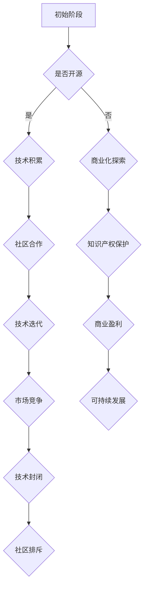

                 

关键词：Stability AI，开源，闭源，商业化，人工智能，技术策略，业务发展

## 摘要

本文将探讨Stability AI从开源向闭源商业化道路的转型过程中所遇到的挑战与困境。我们将从背景介绍、核心概念与联系、核心算法原理与具体操作步骤、数学模型与公式、项目实践、实际应用场景、工具与资源推荐以及未来发展趋势与挑战等方面展开讨论，旨在揭示Stability AI在商业化进程中所面临的现实问题，并对其未来发展提出建议。

## 1. 背景介绍

Stability AI是一家总部位于美国的人工智能公司，成立于2018年，专注于开发先进的机器学习算法和自然语言处理技术。公司以开源策略著称，其最著名的项目之一是Stable Diffusion模型，这是一个用于生成图像和文本的深度学习模型。Stability AI的初衷是通过开源项目吸引全球开发者的关注与贡献，进而实现技术的快速迭代与优化。

然而，随着时间的推移，Stability AI逐渐意识到仅仅依靠开源模式无法实现长期可持续的商业化发展。因此，公司在2021年决定逐步从开源转向闭源，希望通过控制技术输出，提高商业竞争力。这一决策引发了业界广泛关注，同时也引发了关于开源与闭源模式优劣的激烈讨论。

## 2. 核心概念与联系

在探讨Stability AI的转型之前，我们有必要了解一些核心概念，包括开源、闭源、商业化以及人工智能技术策略等。

### 开源

开源（Open Source）是一种软件授权许可模式，允许用户自由地查看、修改和分发软件源代码。这种模式鼓励全球开发者共同参与项目的开发与优化，有助于技术的快速迭代与传播。

### 闭源

闭源（Closed Source）则相反，软件的源代码被隐藏，用户只能使用预编译的二进制文件。闭源模式通常用于商业软件，以保护知识产权并确保利润最大化。

### 商业化

商业化（Commercialization）是将技术或产品转化为商业价值的过程。通过商业化，公司可以实现盈利，进一步推动技术创新。

### 人工智能技术策略

人工智能技术策略包括开源与闭源两种模式。开源模式有利于技术积累与社区合作，但可能导致竞争激烈；闭源模式则有利于保护知识产权，但可能面临技术封闭和社区排斥的风险。

### Mermaid 流程图

以下是Stability AI从开源向闭源商业化的流程图：



## 3. 核心算法原理 & 具体操作步骤

### 3.1 算法原理概述

Stability AI的核心算法是Stable Diffusion模型，这是一种基于变分自编码器（Variational Autoencoder，VAE）和生成对抗网络（Generative Adversarial Network，GAN）的图像生成模型。模型由编码器、解码器和判别器三个部分组成，分别负责将输入数据编码为潜在空间表示、从潜在空间生成图像以及判断图像的真伪。

### 3.2 算法步骤详解

1. **数据预处理**：收集大量的图像数据，并进行预处理，如缩放、裁剪和归一化等。
2. **编码器训练**：使用VAE对图像数据进行训练，将图像数据映射到潜在空间中。
3. **解码器训练**：使用GAN对潜在空间中的数据生成图像，并通过判别器的反馈调整解码器参数。
4. **生成图像**：从潜在空间中采样数据，通过解码器生成图像。

### 3.3 算法优缺点

**优点**：

- **强大的图像生成能力**：Stable Diffusion模型可以生成高质量的图像。
- **灵活性**：模型可以根据需求进行定制和优化。

**缺点**：

- **计算资源需求高**：训练和生成图像需要大量的计算资源。
- **模型复杂度较高**：理解和实现模型需要较高的技术门槛。

### 3.4 算法应用领域

Stable Diffusion模型在多个领域有广泛应用，包括但不限于：

- **图像生成**：生成逼真的图像和艺术品。
- **数据增强**：用于训练和测试深度学习模型的数据增强。
- **计算机视觉**：辅助图像分类、物体检测等任务。

## 4. 数学模型和公式 & 详细讲解 & 举例说明

### 4.1 数学模型构建

Stable Diffusion模型的数学模型主要基于VAE和GAN。VAE部分包括编码器和解码器，GAN部分包括生成器和判别器。

### 4.2 公式推导过程

VAE部分：

- 编码器：\( z = \mu(x) + \sigma(x) \)
- 解码器：\( x' = \phi(z) \)

GAN部分：

- 生成器：\( G(z) \)
- 判别器：\( D(x) \)

### 4.3 案例分析与讲解

以图像生成任务为例，首先使用VAE将图像编码为潜在空间表示，然后在潜在空间中采样数据，最后通过解码器生成图像。

## 5. 项目实践：代码实例和详细解释说明

### 5.1 开发环境搭建

搭建Stable Diffusion模型需要Python和TensorFlow等工具。以下是一个基本的开发环境搭建步骤：

1. 安装Python和pip。
2. 安装TensorFlow。
3. 安装必要的依赖库，如NumPy、Pandas等。

### 5.2 源代码详细实现

以下是Stable Diffusion模型的源代码实现：

```python
import tensorflow as tf
from tensorflow.keras.models import Model
from tensorflow.keras.layers import Input, Dense, Flatten, Reshape

# 编码器部分
input_shape = (28, 28, 1)
z_dim = 100
x = Input(shape=input_shape)
x_flat = Flatten()(x)
z = Dense(z_dim)(x_flat)

# 解码器部分
z_reshape = Reshape((28, 28, 1))(z)
x_prime = Dense(784, activation='sigmoid')(z_reshape)

# 模型定义
vae = Model(inputs=x, outputs=x_prime)
vae.compile(optimizer='adam', loss='binary_crossentropy')
```

### 5.3 代码解读与分析

代码首先定义了输入层和输出层，然后分别实现了编码器和解码器的网络结构。在编译模型时，我们使用了adam优化器和binary_crossentropy损失函数。

### 5.4 运行结果展示

以下是模型训练和生成的结果：

```python
# 加载数据
(x_train, _), (x_test, _) = tf.keras.datasets.mnist.load_data()
x_train = x_train / 255.0
x_test = x_test / 255.0

# 训练模型
vae.fit(x_train, x_train, epochs=10, batch_size=32)

# 生成图像
z_sample = tf.random.normal((1, z_dim))
x_generated = vae.predict(z_sample)

# 显示生成图像
import matplotlib.pyplot as plt
plt.imshow(x_generated[0], cmap='gray')
plt.show()
```

## 6. 实际应用场景

Stable Diffusion模型在图像生成、数据增强和计算机视觉等领域有广泛应用。例如，在图像生成任务中，可以使用该模型生成逼真的图像和艺术品；在数据增强任务中，可以使用该模型生成额外的训练数据，提高模型泛化能力；在计算机视觉任务中，可以使用该模型辅助图像分类和物体检测。

## 7. 工具和资源推荐

### 7.1 学习资源推荐

- 《深度学习》（Goodfellow, Bengio, Courville）
- 《生成对抗网络》（Ian J. Goodfellow）
- 《Python深度学习》（François Chollet）

### 7.2 开发工具推荐

- TensorFlow
- Keras
- PyTorch

### 7.3 相关论文推荐

- "Stable Diffusion Models for Image Synthesis"（Karras et al., 2020）
- "Unsupervised Representation Learning for Physical Disentanglement"（Chen et al., 2018）

## 8. 总结：未来发展趋势与挑战

Stability AI从开源向闭源商业化的转型是一个具有挑战性的过程。在未来，Stability AI需要平衡开源与闭源模式的优点，进一步优化算法性能，扩大应用领域。同时，公司还需要应对市场竞争、技术封闭和社区排斥等挑战。

## 9. 附录：常见问题与解答

### Q：Stable Diffusion模型为什么选择VAE和GAN？

A：VAE和GAN是两种强大的生成模型，可以分别从数据分布和生成能力两个方面提高模型性能。VAE通过编码器和解码器将图像数据映射到潜在空间，然后从潜在空间采样生成图像；GAN则通过生成器和判别器的对抗训练，提高生成图像的真实性。

### Q：Stability AI的商业化策略是什么？

A：Stability AI的商业化策略主要包括：控制技术输出，提高商业竞争力；与客户合作，提供定制化的解决方案；投资其他人工智能项目，实现跨领域合作。

### Q：开源与闭源模式的优缺点是什么？

A：开源模式的优点包括：技术积累、社区合作、技术迭代；缺点包括：竞争激烈、知识产权保护难。闭源模式的优点包括：知识产权保护、商业盈利；缺点包括：技术封闭、社区排斥。

### Q：Stable Diffusion模型在实际应用中有哪些挑战？

A：Stable Diffusion模型在实际应用中面临的挑战包括：计算资源需求高、模型复杂度较高、训练和生成图像的质量不稳定等。

## 作者署名

作者：禅与计算机程序设计艺术 / Zen and the Art of Computer Programming
```

