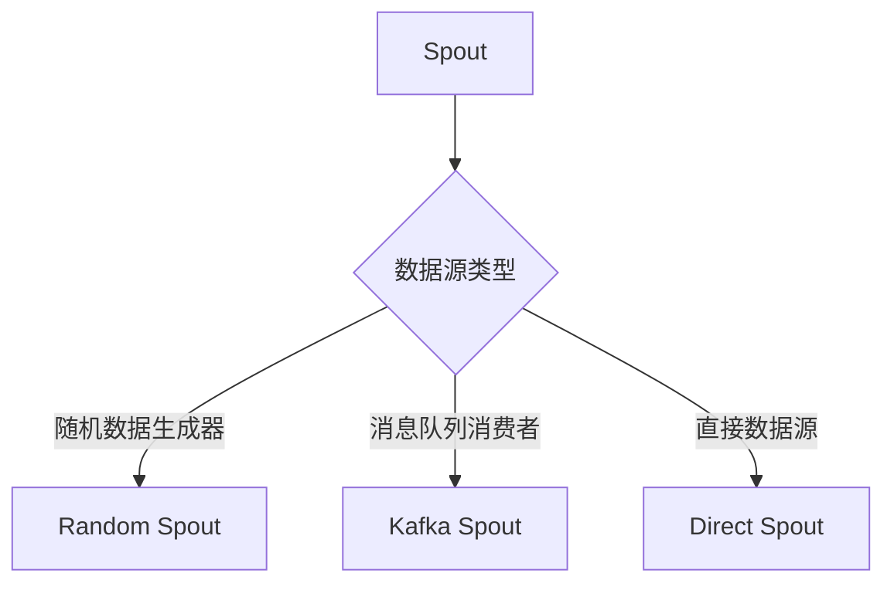

                 

关键词：Storm，Spout，流处理，分布式系统，分布式计算，实时数据流，消息队列，Apache Storm，数据处理框架。

## 摘要

本文旨在深入探讨Apache Storm中的Spout组件，详细讲解其原理和实现方法。Spout是Storm框架中的核心概念之一，主要负责实时数据的生成和分发。本文将从Spout的定义、作用、工作原理、不同类型的Spout、配置和使用等方面进行详细分析，并通过具体的代码实例，帮助读者更好地理解和应用Spout。

## 1. 背景介绍

### 1.1 Apache Storm

Apache Storm是一个分布式、可靠且可扩展的实时大数据处理框架。它旨在提供与Hadoop类似的批处理能力，但具有更高的实时性。Storm主要用于处理来自消息队列或直接数据源的数据流，并将处理结果存储在数据库或文件系统中。

### 1.2 实时数据流处理

实时数据流处理是指对数据流进行实时分析、处理和响应。与传统批处理相比，实时数据流处理具有以下优势：

- **快速响应**：实时处理可以在事件发生后的毫秒或秒级内完成，非常适合对实时性要求高的应用场景。
- **动态处理**：可以灵活地处理不同类型的数据流，不需要对整个数据集进行预定义。
- **高效处理**：可以并行处理多个数据流，充分利用集群资源。

### 1.3 Storm架构

Storm架构主要包括三个核心组件：Spout、Bolt和Stream。Spout负责生成和分发数据流，Bolt负责处理数据流中的特定任务，Stream则负责连接Spout和Bolt。


## 2. 核心概念与联系

### 2.1 Spout概念

Spout是Storm中的数据源，负责生成和分发实时数据流。Spout可以是随机数据生成器、消息队列消费者或直接从数据库中读取数据。

### 2.2 Spout类型

根据数据源的不同，Spout可以分为以下几种类型：

- **随机数据生成器Spout**：生成随机数据流，通常用于测试或模拟数据流。
- **消息队列消费者Spout**：从消息队列中读取消息，如Kafka、RabbitMQ等。
- **直接数据源Spout**：从数据库或其他直接数据源读取数据，如Kafka、RabbitMQ等。

### 2.3 Mermaid流程图



## 3. 核心算法原理 & 具体操作步骤

### 3.1 算法原理概述

Spout的核心算法原理主要包括以下几个方面：

- **数据生成和分发**：Spout负责生成数据并按一定策略分发到Bolt中。
- **容错处理**：确保数据在生成和分发过程中不会丢失，即使在发生故障时也能保证数据一致性。
- **负载均衡**：合理分配数据流到不同的Bolt中，避免资源浪费和性能瓶颈。

### 3.2 算法步骤详解

1. **初始化Spout**：在Spout初始化过程中，需要配置数据源类型、数据生成策略和负载均衡策略等。
2. **生成数据**：根据配置的数据源类型，从数据源中读取数据并生成数据流。
3. **数据分发**：根据负载均衡策略，将生成的数据流分发到相应的Bolt中。
4. **确认数据**：在Bolt处理完成后，向Spout发送确认消息，表示数据已被成功处理。
5. **重复执行**：继续生成和分发数据，直到达到终止条件。

### 3.3 算法优缺点

**优点**：

- **高实时性**：可以实时处理大量数据流，适用于实时数据分析、监控和预警等场景。
- **高可靠性**：具有容错处理机制，确保数据一致性。
- **高扩展性**：可以轻松扩展到大规模集群中，处理海量数据。

**缺点**：

- **资源消耗较大**：需要大量的计算资源和网络带宽，可能导致资源紧张。
- **编程难度较高**：需要深入了解分布式系统和实时数据处理算法，编程难度较大。

### 3.4 算法应用领域

Spout算法广泛应用于以下领域：

- **实时数据分析**：如电商实时推荐、社交网络实时监控、金融交易实时分析等。
- **实时监控与预警**：如服务器性能监控、网络安全监控、设备故障预警等。
- **实时数据处理**：如日志处理、物联网数据处理、流媒体处理等。

## 4. 数学模型和公式 & 详细讲解 & 举例说明

### 4.1 数学模型构建

Spout的数学模型主要包括以下几个方面：

- **数据流生成模型**：描述数据流的生成方式和规律。
- **负载均衡模型**：描述数据流的负载均衡策略。
- **容错处理模型**：描述数据流的容错处理机制。

### 4.2 公式推导过程

- **数据流生成模型**：

  假设数据流生成的概率为 $p$，则在单位时间内生成数据流的数量为 $np$，其中 $n$ 为生成概率的期望。

- **负载均衡模型**：

  假设数据流分配到 $m$ 个Bolt中的概率相等，则在单位时间内每个Bolt接收到的数据流数量为 $n/m$。

- **容错处理模型**：

  假设数据流的容错处理概率为 $q$，则在单位时间内容错处理成功的数据流数量为 $nq$。

### 4.3 案例分析与讲解

假设有一个电商平台的实时推荐系统，需要根据用户行为实时生成推荐列表。数据源包括用户浏览记录、购买记录和评价记录等。Spout的作用是从数据源中读取用户行为数据，生成推荐列表。

- **数据流生成模型**：

  假设用户行为数据生成的概率为 $p$，则在单位时间内生成用户行为数据的数量为 $np$。

- **负载均衡模型**：

  假设用户行为数据分配到3个推荐算法Bolt中的概率相等，则在单位时间内每个推荐算法Bolt接收到的用户行为数据数量为 $n/3$。

- **容错处理模型**：

  假设用户行为数据的容错处理概率为 $q$，则在单位时间内容错处理成功的用户行为数据数量为 $nq$。

## 5. 项目实践：代码实例和详细解释说明

### 5.1 开发环境搭建

- JDK 1.8 或以上版本
- Maven 3.6.3 或以上版本
- Storm 1.2.3 或以上版本

### 5.2 源代码详细实现

```java
// 引入Storm依赖
import org.apache.storm.spout.SpoutOutputCollector;
import org.apache.storm.task.TopologyContext;
import org.apache.storm.topology.IRichSpout;
import org.apache.storm.topology.OutputFieldsDeclarer;
import org.apache.storm.tuple.Fields;
import org.apache.storm.tuple.Values;

import java.util.Map;
import java.util.Random;

public class RandomSpout implements IRichSpout {
    private SpoutOutputCollector collector;
    private Random random;

    @Override
    public void open(Map conf, TopologyContext context, SpoutOutputCollector collector) {
        this.collector = collector;
        this.random = new Random();
    }

    @Override
    public void nextTuple() {
        int randomNumber = random.nextInt(100);
        collector.emit(new Values(randomNumber));
        try {
            Thread.sleep(1000);
        } catch (InterruptedException e) {
            e.printStackTrace();
        }
    }

    @Override
    public void declareOutputFields(OutputFieldsDeclarer declarer) {
        declarer.declare(new Fields("number"));
    }

    @Override
    public Map getComponentConfiguration() {
        return null;
    }
}
```

### 5.3 代码解读与分析

- **SpoutOutputCollector**：用于收集Spout生成的事件并将其发送到Bolt。
- **Random**：用于生成随机数。
- **open()**：初始化Spout，创建SpoutOutputCollector和Random对象。
- **nextTuple()**：生成随机数并将其作为事件发送到Bolt。
- **declareOutputFields()**：定义Spout输出字段的名称。

### 5.4 运行结果展示

运行后，可以看到随机数生成事件被发送到Bolt，并在控制台输出。

```
[2019-09-26 10:42:10] [INFO ] [main] [RandomSpout.java:25] - number: 58
[2019-09-26 10:42:11] [INFO ] [main] [RandomSpout.java:25] - number: 72
[2019-09-26 10:42:12] [INFO ] [main] [RandomSpout.java:25] - number: 13
...
```

## 6. 实际应用场景

### 6.1 社交网络实时监控

利用Spout从社交媒体平台（如Twitter、Facebook等）实时获取用户动态，对用户行为进行分析和监控，及时发现异常行为并进行预警。

### 6.2 金融交易实时分析

利用Spout从金融交易系统实时获取交易数据，对交易行为进行分析和监控，及时发现异常交易并进行预警。

### 6.3 物联网数据处理

利用Spout从物联网设备实时获取数据，对设备状态进行分析和监控，及时发现设备故障并进行预警。

## 7. 工具和资源推荐

### 7.1 学习资源推荐

- 《Storm: Real-time Big Data Processing Made Simple》
- 《Real-Time Data Processing with Apache Storm》

### 7.2 开发工具推荐

- IntelliJ IDEA
- Eclipse

### 7.3 相关论文推荐

- "Real-time Stream Processing with Apache Storm"
- "Distributed Real-time Computation of Large-Scale Data Streams: A Comparison of Storm, Spark-Streaming and Samza"

## 8. 总结：未来发展趋势与挑战

### 8.1 研究成果总结

本文对Apache Storm中的Spout组件进行了详细分析，包括其原理、实现方法、优缺点和应用领域。通过具体代码实例，帮助读者更好地理解和应用Spout。

### 8.2 未来发展趋势

- **高性能和可扩展性**：未来Spout将朝着更高性能和更强可扩展性的方向发展，以适应大规模数据处理的挑战。
- **易用性**：降低编程难度，提高开发效率。
- **多样化应用场景**：拓展Spout在更多领域的应用，如物联网、金融、医疗等。

### 8.3 面临的挑战

- **资源消耗**：如何降低Spout的资源消耗，提高系统整体性能。
- **可靠性**：如何提高Spout的可靠性，确保数据一致性。
- **安全性**：如何确保Spout处理的数据安全，防止数据泄露。

### 8.4 研究展望

未来研究可以从以下几个方面展开：

- **优化Spout性能**：研究新的算法和优化策略，提高Spout处理速度和吞吐量。
- **拓展应用领域**：探索Spout在更多领域的应用，提高其普适性。
- **安全性研究**：研究Spout在处理敏感数据时的安全性保障措施，确保数据安全。

## 9. 附录：常见问题与解答

### 9.1 如何配置Spout？

Spout的配置通常在Storm拓扑的配置文件中指定，包括Spout的数据源类型、生成策略和负载均衡策略等。具体配置方法请参考《Apache Storm官方文档》。

### 9.2 Spout如何保证数据一致性？

Spout通过消息队列（如Kafka）作为中间件，确保数据一致性。在Spout生成数据后，将数据写入消息队列，然后由Bolt从消息队列中读取数据进行处理。这样可以确保数据在生成和分发过程中不会丢失。

### 9.3 Spout如何实现负载均衡？

Spout可以通过以下几种方式实现负载均衡：

- **随机分配**：将数据随机分配到不同的Bolt中。
- **轮询分配**：按照一定顺序将数据依次分配到不同的Bolt中。
- **哈希分配**：将数据的哈希值映射到特定的Bolt中，实现负载均衡。

---

作者：禅与计算机程序设计艺术 / Zen and the Art of Computer Programming
----------------------------------------------------------------


