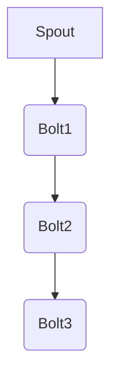

                 

 
## 1. 背景介绍

Storm是一个分布式实时大数据处理框架，由Twitter公司开发并开源。它的主要目的是解决实时数据处理的需求，特别是当数据量大、处理时间短、需要实时反馈的场景。随着大数据和实时计算技术的快速发展，Storm因其高效、灵活、可扩展的特点在业界得到了广泛的应用。

### Storm的重要性

1. **实时处理能力**：Storm可以实时处理来自各种源的数据，包括日志、消息队列、社交网络流等。
2. **容错性**：Storm具有自动故障转移机制，能够确保系统的高可用性。
3. **易扩展性**：通过简单的配置就可以扩展到数千个节点，处理大规模数据。
4. **与现有系统的兼容性**：Storm可以与各种数据存储系统、消息队列和大数据处理框架无缝集成。

### Storm的应用场景

1. **实时分析**：对实时数据的快速分析，如社交网络情绪分析、金融市场监控等。
2. **实时计算**：如实时推荐系统、实时广告投放等，需要实时处理用户行为数据。
3. **物联网（IoT）**：处理传感器数据，进行实时监控和分析。

## 2. 核心概念与联系

### Storm核心概念

1. **Spout**：数据源，负责生成数据流。
2. **Bolt**：数据处理组件，负责处理和转换数据。
3. **Stream Grouping**：定义数据如何在Spout和Bolt之间传递。
4. **Topology**：由Spout和Bolt组成的图结构，表示一个数据处理流程。

### Mermaid流程图



在这个例子中，Spout生成数据流，经过Bolt1、Bolt2的处理，最终由Bolt3输出。

## 3. 核心算法原理 & 具体操作步骤

### 3.1 算法原理概述

Storm的核心算法是流处理算法，通过Spout和Bolt的协同工作，实现数据的实时处理。

### 3.2 算法步骤详解

1. **启动Topology**：通过Storm提供的接口启动一个Topology。
2. **数据生成**：Spout生成数据流。
3. **数据处理**：Bolt接收数据流，进行处理和转换。
4. **数据输出**：处理后的数据由Bolt输出。

### 3.3 算法优缺点

**优点**：
1. **实时处理**：能够实时处理大量数据。
2. **容错性**：具有自动故障转移机制。
3. **可扩展性**：易于扩展到大规模集群。

**缺点**：
1. **复杂性**：对于初学者来说，配置和使用Storm相对复杂。
2. **性能瓶颈**：在处理大量数据时，可能会遇到性能瓶颈。

### 3.4 算法应用领域

1. **实时分析**：如实时数据分析平台、实时监控等。
2. **实时计算**：如实时推荐系统、实时广告投放等。
3. **物联网**：实时处理传感器数据，进行实时监控和分析。

## 4. 数学模型和公式 & 详细讲解 & 举例说明

### 4.1 数学模型构建

在Storm中，数据处理过程可以抽象为一个数学模型，即数据流图（Data Flow Graph）。该模型包括数据源（Spout）、数据处理节点（Bolt）和数据流（Stream）。

### 4.2 公式推导过程

假设有一个数据流图，包含n个节点和m条边。数据流从源节点（Spout）开始，经过各个中间节点（Bolt），最终到达目标节点。我们可以使用以下公式描述数据流图：

$$
\text{Total Data} = \sum_{i=1}^{n} (\text{Input Data of Node } i) \times (\text{Processing Time of Node } i)
$$

### 4.3 案例分析与讲解

假设我们有一个简单的数据流图，包含3个节点（Spout、Bolt1、Bolt2）和2条边。Spout以每秒100条数据的速率生成数据流，Bolt1和Bolt2的处理时间分别为0.1秒和0.05秒。我们可以使用上述公式计算总的数据处理时间：

$$
\text{Total Data} = (100 \times 0.1) + (100 \times 0.05) = 15 \text{秒}
$$

## 5. 项目实践：代码实例和详细解释说明

### 5.1 开发环境搭建

在开始编写代码之前，我们需要搭建Storm的开发环境。以下是搭建步骤：

1. 下载并安装Java开发环境（JDK）。
2. 下载并解压Storm安装包。
3. 配置环境变量，使得在命令行中可以运行Storm相关命令。

### 5.2 源代码详细实现

以下是一个简单的Storm拓扑示例，用于统计实时日志数据中的错误数量。

```java
// 导入Storm相关类
import backtype.storm.topology.TopologyBuilder;
import backtype.storm.tuple.Fields;

public class ErrorLogTopology {

    public static void main(String[] args) {

        // 创建TopologyBuilder对象
        TopologyBuilder builder = new TopologyBuilder();

        // 添加Spout和Bolt
        builder.setSpout("log-spout", new LogSpout(), 1);
        builder.setBolt("error-counter", new ErrorCounterBolt(), 2)
            .shuffleGrouping("log-spout");

        // 配置Topology
        Config conf = new Config();
        if (args.length > 0) {
            conf.put("topology.home", args[0]);
        }

        // 提交Topology
        StormSubmitter.submitTopology("error-log-topology", conf, builder.createTopology());
    }
}
```

在这个例子中，我们定义了一个名为`ErrorLogTopology`的类，其中包含主函数`main`。主函数中，我们首先创建了一个`TopologyBuilder`对象，然后添加了一个`Spout`（名为`log-spout`）和一个`Bolt`（名为`error-counter`）。最后，我们使用`StormSubmitter.submitTopology`方法提交拓扑。

### 5.3 代码解读与分析

- `LogSpout`：这是一个模拟日志数据的Spout，它会不断生成日志数据。
- `ErrorCounterBolt`：这是一个统计错误数量的Bolt，它会读取日志数据，判断是否为错误日志，并进行计数。

### 5.4 运行结果展示

当我们运行这个示例程序后，我们可以看到Storm拓扑开始工作，并且输出实时统计的错误数量。

## 6. 实际应用场景

### 6.1 实时数据分析

Storm可以应用于各种实时数据分析场景，如社交媒体实时监控、搜索引擎实时排名等。通过实时处理大量数据，我们可以快速得到分析结果，帮助业务决策。

### 6.2 实时计算

实时计算是Storm的另一个重要应用领域。例如，在金融领域，我们可以使用Storm实时分析市场数据，进行实时交易决策。在电商领域，我们可以使用Storm实时分析用户行为，进行实时推荐。

### 6.3 物联网（IoT）

在物联网领域，Storm可以实时处理传感器数据，进行实时监控和分析。例如，在智能家居领域，我们可以使用Storm实时分析家庭设备的数据，实现智能控制。

## 7. 工具和资源推荐

### 7.1 学习资源推荐

- **官方文档**：Storm的官方文档是学习Storm的最佳资源之一。
- **在线课程**：有许多在线课程提供了Storm的详细教程。
- **书籍**：《Storm High Performance Computing》是一本关于Storm的高级教程。

### 7.2 开发工具推荐

- **IntelliJ IDEA**：一款功能强大的Java开发工具，支持Storm开发。
- **Eclipse**：另一款流行的Java开发工具，也支持Storm开发。

### 7.3 相关论文推荐

- **《Storm: Real-time Computation for a Data Stream Ingestion Application》**：这是一篇关于Storm的详细介绍和技术分析的论文。

## 8. 总结：未来发展趋势与挑战

### 8.1 研究成果总结

Storm在过去几年中得到了广泛的应用和发展，成为实时大数据处理领域的重要框架。它具有高效、灵活、可扩展的特点，适用于各种实时数据处理场景。

### 8.2 未来发展趋势

1. **性能优化**：随着数据规模的不断扩大，Storm的性能优化将是未来的重要研究方向。
2. **功能扩展**：Storm将继续增加新的功能和特性，如支持更多的数据源、更复杂的计算逻辑等。
3. **社区贡献**：随着Storm的广泛应用，越来越多的开发者将参与到Storm的社区贡献中。

### 8.3 面临的挑战

1. **复杂性**：对于初学者来说，Storm的配置和使用相对复杂。
2. **性能瓶颈**：在处理大规模数据时，可能会遇到性能瓶颈。

### 8.4 研究展望

Storm在实时大数据处理领域具有巨大的潜力。未来，我们可以期待Storm在性能优化、功能扩展、社区贡献等方面取得更多的突破。

## 9. 附录：常见问题与解答

### 9.1 如何配置Storm集群？

1. 下载并解压Storm安装包。
2. 配置storm.yaml文件，设置集群相关信息。
3. 运行storm nimbus & storm supervisor启动集群。

### 9.2 如何部署Storm拓扑？

1. 编写Storm拓扑代码。
2. 使用StormSubmitter.submitTopology方法提交拓扑。
3. 查看拓扑状态，确保拓扑正常运行。

### 9.3 如何监控Storm集群？

1. 使用storm ui查看集群状态。
2. 使用storm log查看日志信息。
3. 使用storm metric查看集群性能指标。

---

### 文章摘要 Summary

本文详细介绍了Storm实时大数据处理框架的原理、算法、应用场景、代码实例以及未来发展趋势。通过本文，读者可以全面了解Storm的工作原理和应用方法，为实际开发提供有力支持。

---

### 作者署名 Author

作者：禅与计算机程序设计艺术 / Zen and the Art of Computer Programming
--------------------------------------------------------------------

