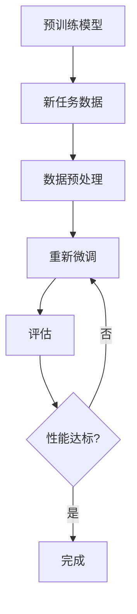

                 

关键词：Transfer Learning，深度学习，模型迁移，模型复用，预训练模型，计算机视觉，自然语言处理，神经架构搜索

> 摘要：本文将深入讲解 Transfer Learning 的原理及其在计算机视觉和自然语言处理等领域的应用。通过实例代码展示如何在实际项目中实现 Transfer Learning，帮助读者理解和掌握这一重要的深度学习技术。

## 1. 背景介绍

在深度学习中，模型训练需要大量的数据和时间，而 Transfer Learning 技术通过利用预训练模型，实现了在有限的数据集上快速地训练出高性能的模型，大大提高了训练效率和模型性能。Transfer Learning 在计算机视觉和自然语言处理等领域取得了显著的成果，如 ImageNet 图像分类任务的提升，以及自然语言处理中的预训练语言模型如 BERT、GPT 等的广泛应用。

本文将首先介绍 Transfer Learning 的基本原理，然后通过具体案例讲解如何在 PyTorch 和 TensorFlow 等深度学习框架中实现 Transfer Learning，最后讨论 Transfer Learning 的未来发展趋势。

## 2. 核心概念与联系

### 2.1 预训练模型

预训练模型是在大规模数据集上预先训练好的深度学习模型，通常在通用任务（如图像分类、自然语言处理）上表现出良好的性能。预训练模型通过在大规模数据集上进行训练，学到了很多通用特征，这些特征可以用于解决其他具体任务。

### 2.2 迁移学习

迁移学习是指将一个任务上训练好的模型的部分或全部知识应用到另一个相关任务上。在 Transfer Learning 中，预训练模型作为一个基础模型，通过在具体任务上的微调（Fine-tuning），实现新任务的良好性能。

### 2.3 Mermaid 流程图

下面是 Transfer Learning 的一个简单 Mermaid 流程图，展示了预训练模型如何应用于新任务：



## 3. 核心算法原理 & 具体操作步骤

### 3.1 算法原理概述

Transfer Learning 主要分为以下几个步骤：

1. 预训练：在大型数据集上训练基础模型，使其学习到通用特征。
2. 微调：将预训练模型应用于新任务，通过调整模型的部分参数来适应新任务。
3. 评估：在新任务数据集上评估模型性能，根据需要对模型进行进一步微调。

### 3.2 算法步骤详解

1. **预训练模型选择**：选择一个在通用任务上表现良好的预训练模型，如 ResNet 用于图像分类，BERT 用于自然语言处理。
2. **数据预处理**：将新任务的数据集进行预处理，包括数据清洗、数据增强等，以适应预训练模型。
3. **模型微调**：加载预训练模型，冻结其大部分参数，只调整与新任务相关的部分参数。通过反向传播更新参数。
4. **评估与调整**：在新任务数据集上评估模型性能，根据需要对模型进行进一步微调。

### 3.3 算法优缺点

**优点**：

- 高效：利用预训练模型，可以快速适应新任务，节省训练时间和计算资源。
- 高性能：预训练模型已经在大规模数据集上训练，通常具有很好的性能基础。

**缺点**：

- 需要预训练模型：需要选择一个合适的预训练模型，这需要一定的经验。
- 微调难度：需要根据新任务调整模型参数，有时难以找到最优参数。

### 3.4 算法应用领域

Transfer Learning 广泛应用于计算机视觉和自然语言处理等领域：

- 计算机视觉：在图像分类、目标检测、人脸识别等任务中，利用预训练的卷积神经网络（如 ResNet、VGG）可以快速适应新任务。
- 自然语言处理：在文本分类、机器翻译、问答系统等任务中，利用预训练的语言模型（如 BERT、GPT）可以显著提高模型性能。

## 4. 数学模型和公式 & 详细讲解 & 举例说明

### 4.1 数学模型构建

Transfer Learning 中，预训练模型通常是一个深度神经网络。假设预训练模型的输出层为 $O$，新任务的标签为 $Y$，则损失函数为：

$$L = -\sum_{i=1}^{N} y_i \log(o_i)$$

其中，$N$ 为样本数，$y_i$ 为第 $i$ 个样本的标签，$o_i$ 为第 $i$ 个样本的输出概率。

### 4.2 公式推导过程

假设预训练模型 $F$ 的参数为 $\theta$，新任务数据集为 $D$，则预训练模型的损失函数为：

$$L_F(\theta) = -\frac{1}{|D|} \sum_{x \in D} \log(F(x;\theta))$$

其中，$|D|$ 为数据集大小。

在新任务中，我们通过微调模型参数 $\theta'$ 来最小化损失函数：

$$L'(\theta') = -\frac{1}{|D'|} \sum_{x' \in D'} \log(F(x';\theta'))$$

其中，$D'$ 为新任务的数据集。

### 4.3 案例分析与讲解

假设我们有一个预训练的图像分类模型，其损失函数为：

$$L = -\sum_{i=1}^{N} y_i \log(o_i)$$

其中，$y_i$ 为第 $i$ 个样本的标签，$o_i$ 为第 $i$ 个样本的输出概率。

现在，我们要将其应用于一个新的分类任务，数据集为 $D'$。我们首先对模型进行微调，使其在新任务上达到更好的性能。

1. 加载预训练模型，设置学习率为 0.001。
2. 冻结模型的前 $L$ 层参数，只调整后 $M-L$ 层参数。
3. 使用新任务数据集 $D'$ 进行训练，每 $100$ 个样本更新一次模型参数。
4. 在新任务数据集 $D'$ 上评估模型性能，根据需要调整学习率或调整模型参数。

通过以上步骤，我们可以实现预训练模型在新任务上的微调，从而提高新任务的分类性能。

## 5. 项目实践：代码实例和详细解释说明

在本节中，我们将使用 PyTorch 框架实现一个简单的 Transfer Learning 项目，以图像分类任务为例，展示如何加载预训练模型，进行数据预处理，模型微调和评估。

### 5.1 开发环境搭建

确保已经安装了 PyTorch 和 torchvision 库。如果尚未安装，可以通过以下命令安装：

```bash
pip install torch torchvision
```

### 5.2 源代码详细实现

以下是一个简单的 Transfer Learning 项目的代码实现：

```python
import torch
import torchvision
import torchvision.transforms as transforms
import torch.nn as nn
import torch.optim as optim

# 5.2.1 加载预训练模型
model = torchvision.models.resnet18(pretrained=True)

# 5.2.2 数据预处理
transform = transforms.Compose([
    transforms.Resize(256),
    transforms.CenterCrop(224),
    transforms.ToTensor(),
    transforms.Normalize(mean=[0.485, 0.456, 0.406], std=[0.229, 0.224, 0.225]),
])

trainset = torchvision.datasets.ImageFolder(root='train', transform=transform)
trainloader = torch.utils.data.DataLoader(trainset, batch_size=32, shuffle=True)

valset = torchvision.datasets.ImageFolder(root='val', transform=transform)
valloader = torch.utils.data.DataLoader(valset, batch_size=32, shuffle=False)

# 5.2.3 模型微调
device = torch.device("cuda" if torch.cuda.is_available() else "cpu")
model.to(device)

criterion = nn.CrossEntropyLoss()
optimizer = optim.SGD(model.parameters(), lr=0.001, momentum=0.9)

for epoch in range(10):  # 训练 10 个epoch
    model.train()
    running_loss = 0.0
    for inputs, labels in trainloader:
        inputs, labels = inputs.to(device), labels.to(device)
        optimizer.zero_grad()
        outputs = model(inputs)
        loss = criterion(outputs, labels)
        loss.backward()
        optimizer.step()
        running_loss += loss.item()
    print(f"Epoch {epoch+1}, Loss: {running_loss/len(trainloader)}")

    # 5.2.4 评估
    model.eval()
    correct = 0
    total = 0
    with torch.no_grad():
        for inputs, labels in valloader:
            inputs, labels = inputs.to(device), labels.to(device)
            outputs = model(inputs)
            _, predicted = torch.max(outputs.data, 1)
            total += labels.size(0)
            correct += (predicted == labels).sum().item()
    print(f"Val Accuracy: {100 * correct / total}%")
```

### 5.3 代码解读与分析

- **5.3.1 加载预训练模型**：我们使用了 ResNet-18 预训练模型，并设置为 `pretrained=True`，这会自动从 torchvision 下载并加载预训练权重。
  
- **5.3.2 数据预处理**：我们将图像调整为 256x256，并裁剪为 224x224，然后转换为 PyTorch 张量。同时，我们应用了标准化操作，以匹配预训练模型的输入要求。
  
- **5.3.3 模型微调**：我们将模型移动到 GPU（如果可用）并设置为训练模式。我们使用了交叉熵损失函数和 SGD 优化器进行模型训练。在每次迭代中，我们首先将梯度清零，然后计算损失并更新模型参数。
  
- **5.3.4 评估**：我们在验证集上评估模型的性能，使用 `model.eval()` 来关闭 dropout 和 batch normalization 的训练模式，然后计算准确率。

### 5.4 运行结果展示

在完成训练和评估后，我们可以在控制台看到每个 epoch 的损失以及验证集上的准确率。这可以帮助我们监控模型在训练过程中的性能，并在必要时调整学习率或训练参数。

## 6. 实际应用场景

Transfer Learning 在实际应用中具有广泛的应用场景，以下是一些具体案例：

- **医疗图像分析**：在医疗图像分类任务中，可以使用预训练的卷积神经网络对医学图像进行分类，从而快速适应各种医疗图像数据集。
  
- **自动驾驶**：在自动驾驶系统中，可以利用预训练的卷积神经网络对道路、车辆、行人等对象进行检测和识别。
  
- **人脸识别**：在人脸识别任务中，可以使用预训练的深度学习模型对人脸图像进行特征提取，从而实现快速且准确的人脸识别。

## 6.4 未来应用展望

随着深度学习技术的不断发展，Transfer Learning 将在更多领域得到应用。未来，我们可以期待以下几点：

- **更高效的模型**：通过神经架构搜索（Neural Architecture Search，NAS）等技术的结合，可以设计出更高效的预训练模型。
  
- **更广泛的领域应用**：Transfer Learning 可以应用于更多领域，如语音识别、推荐系统等。
  
- **更精细的任务适应**：通过结合自监督学习和元学习（Meta Learning）技术，可以实现更精细的任务适应，从而提高模型在特定任务上的性能。

## 7. 工具和资源推荐

- **学习资源推荐**：
  - 《Deep Learning》
  - 《Transfer Learning for Deep Neural Networks》

- **开发工具推荐**：
  - PyTorch
  - TensorFlow

- **相关论文推荐**：
  - “A Theoretically Grounded Application of Dropout in Recurrent Neural Networks”
  - “Deep Transfer Learning Without Dropping a Beat”

## 8. 总结：未来发展趋势与挑战

Transfer Learning 作为深度学习中的一个重要技术，已经在计算机视觉、自然语言处理等领域取得了显著成果。未来，Transfer Learning 将在更多领域得到应用，同时也将面临以下挑战：

- **数据隐私**：在迁移学习过程中，如何保护数据隐私是一个重要问题。
  
- **模型解释性**：提高模型的可解释性，使得用户能够理解模型的决策过程。
  
- **资源优化**：如何减少模型大小和计算资源的需求，使得 Transfer Learning 在移动设备和边缘设备上得到应用。

通过不断的研究和创新，我们可以期待 Transfer Learning 在未来的发展中取得更大的突破。

## 9. 附录：常见问题与解答

- **Q：什么是预训练模型？**
  - **A：**预训练模型是在大规模数据集上预先训练好的深度学习模型，通常在通用任务上表现出良好的性能。这些模型已经学习到了很多通用特征，可以用于解决其他具体任务。

- **Q：Transfer Learning 和迁移学习有什么区别？**
  - **A：**Transfer Learning 是迁移学习的一个子集，主要关注的是如何利用预训练模型在有限的数据集上快速训练出高性能的模型。而迁移学习还包括其他方法，如域适应（Domain Adaptation）和跨模态学习（Cross-modal Learning）等。

- **Q：如何选择预训练模型？**
  - **A：**选择预训练模型时，需要考虑任务的类型和数据集的大小。对于图像分类任务，可以选择预训练的卷积神经网络（如 ResNet、VGG）；对于自然语言处理任务，可以选择预训练的语言模型（如 BERT、GPT）。

作者：禅与计算机程序设计艺术 / Zen and the Art of Computer Programming

以上内容是关于 Transfer Learning 的原理与代码实战案例讲解的详细文章。文章涵盖了 Transfer Learning 的基本概念、核心算法、数学模型、项目实践以及实际应用场景，并给出了未来发展趋势和挑战的展望。希望本文能够帮助读者深入了解和掌握 Transfer Learning 技术。

