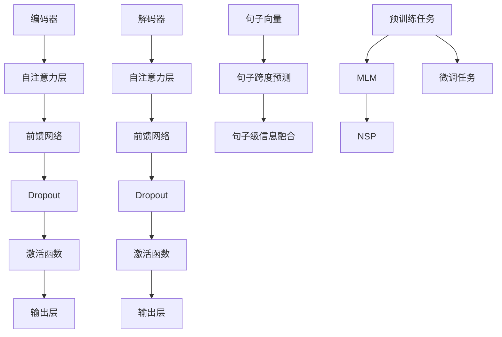

                 

关键词：Transformer、大模型、BERT、SpanBERT、架构、算法原理、项目实践、数学模型、应用领域、未来展望

> 摘要：本文将深入探讨Transformer大模型中的SpanBERT架构，通过对其核心概念、算法原理、数学模型、项目实践等方面的讲解，帮助读者全面理解SpanBERT在实际应用中的重要性和价值。

## 1. 背景介绍

近年来，深度学习技术在自然语言处理（NLP）领域取得了显著的进展。特别是Transformer模型的出现，彻底改变了NLP的任务处理方式，推动了BERT（Bidirectional Encoder Representations from Transformers）的诞生。BERT作为Transformer模型在语言理解任务上的应用，通过预训练和微调的方法，取得了前所未有的效果。然而，BERT模型的不足之处在于其固定窗口的局限性，无法有效处理长文本中的跨句子依赖关系。

为了解决这一问题，Google提出了一种新的BERT变种——SpanBERT。SpanBERT通过引入句子级别的全局信息，使得模型在处理长文本时能够更好地捕捉句子间的依赖关系。本文将详细介绍SpanBERT的架构、算法原理、数学模型以及项目实践，帮助读者深入了解这一重要技术。

## 2. 核心概念与联系

### 2.1 Transformer模型

Transformer模型是一种基于自注意力（Self-Attention）机制的深度神经网络模型，最初由Vaswani等人于2017年提出。与传统的循环神经网络（RNN）和卷积神经网络（CNN）相比，Transformer模型在处理长序列数据时具有更强的并行计算能力，能够显著提高模型的训练速度。

Transformer模型主要由编码器（Encoder）和解码器（Decoder）两部分组成。编码器将输入序列转换为连续的隐藏状态序列，解码器则根据这些隐藏状态序列生成输出序列。在编码器和解码器之间，存在多个自注意力层和前馈网络，用于对隐藏状态进行加权、转换和组合。

### 2.2 BERT模型

BERT（Bidirectional Encoder Representations from Transformers）是Transformer模型在语言理解任务上的一个应用。BERT模型通过预训练和微调的方法，学习到大量通用语言知识，从而在各类NLP任务中取得了优异的性能。

BERT模型的预训练主要包括两个任务：Masked Language Model（MLM）和Next Sentence Prediction（NSP）。MLM任务通过随机遮盖输入文本中的部分词语，训练模型预测这些遮盖的词语；NSP任务则通过预测两个句子之间的逻辑关系，增强模型对句子间语义关系的理解。

### 2.3 SpanBERT模型

SpanBERT是BERT模型的变种，旨在解决BERT在处理长文本时存在的局限性。SpanBERT通过引入句子级别的全局信息，使得模型能够更好地捕捉长文本中的跨句子依赖关系。

SpanBERT的主要改进包括两个方面：

1. 全局句子向量：在BERT模型的基础上，SpanBERT为每个句子生成一个全局句子向量，用于表示句子级别的语义信息。

2. 句子跨度预测：SpanBERT引入一个句子跨度预测模块，用于预测长文本中任意两个句子之间的跨度。通过句子跨度预测，模型可以更灵活地处理长文本中的句子依赖关系。

### 2.4 Mermaid流程图

为了更好地理解SpanBERT的架构，我们使用Mermaid流程图来展示其核心组成部分和连接关系。



在上面的流程图中，编码器和解码器部分分别表示了Transformer模型的核心组成部分，句子向量模块和句子跨度预测模块则展示了SpanBERT相对于BERT的改进之处。

## 3. 核心算法原理 & 具体操作步骤

### 3.1 算法原理概述

SpanBERT模型的核心算法原理包括以下几个方面：

1. **自注意力机制**：自注意力机制是Transformer模型的核心，通过计算输入序列中每个词语与所有其他词语之间的关联强度，实现对输入序列的加权处理。

2. **多层感知器**：多层感知器（MLP）是一种前馈神经网络，用于对输入数据进行非线性变换。在Transformer模型中，MLP主要用于对隐藏状态进行进一步转换和组合。

3. **Dropout**：Dropout是一种正则化技术，通过随机丢弃部分神经元，减少过拟合现象。

4. **全局句子向量**：全局句子向量是SpanBERT模型的核心创新点，用于表示句子级别的语义信息。全局句子向量通过聚合句子中的所有词语向量得到，从而捕捉句子级别的依赖关系。

5. **句子跨度预测**：句子跨度预测模块用于预测长文本中任意两个句子之间的跨度。通过句子跨度预测，模型可以更好地处理长文本中的跨句子依赖关系。

### 3.2 算法步骤详解

1. **输入预处理**：首先对输入文本进行分词和标记化处理，将文本序列转换为数字序列。然后，将数字序列输入到编码器中。

2. **编码器处理**：编码器由多个自注意力层和前馈网络组成，依次对输入序列进行处理。在每个自注意力层中，计算输入序列中每个词语与所有其他词语之间的关联强度，生成加权序列。然后，通过前馈网络对加权序列进行非线性变换，得到新的隐藏状态序列。

3. **句子向量生成**：在编码器的最后一个自注意力层之后，计算每个句子的全局句子向量。句子向量通过聚合句子中的所有词语向量得到，从而捕捉句子级别的依赖关系。

4. **句子跨度预测**：句子跨度预测模块对长文本中的每个句子对进行跨度预测。通过训练，模型学习到不同句子对之间的跨度分布，从而更好地处理长文本中的跨句子依赖关系。

5. **解码器处理**：解码器与编码器结构相似，由多个自注意力层和前馈网络组成。解码器依次对输入序列进行处理，同时利用句子向量模块和句子跨度预测模块的信息，生成输出序列。

6. **输出层**：在解码器的最后一个自注意力层之后，通过输出层生成最终的输出序列，即可用于下游任务，如文本分类、情感分析等。

### 3.3 算法优缺点

#### 优点

1. **强大的语言理解能力**：SpanBERT通过引入全局句子向量和句子跨度预测模块，使得模型在处理长文本时能够更好地捕捉句子间的依赖关系，从而提高语言理解能力。

2. **灵活的文本处理**：SpanBERT能够处理不同长度的文本，并且对长文本的处理效果优于传统的BERT模型。

3. **高效的训练速度**：Transformer模型具有并行计算能力，相较于RNN和CNN模型，训练速度更快。

#### 缺点

1. **计算资源需求高**：由于Transformer模型具有多个自注意力层和前馈网络，计算资源需求较高，对硬件设备有较高的要求。

2. **内存占用大**：Transformer模型在处理长文本时，需要存储大量的中间结果，导致内存占用较大。

### 3.4 算法应用领域

1. **文本分类**：SpanBERT在文本分类任务中具有较好的性能，能够有效捕捉文本中的关键信息。

2. **情感分析**：通过预测句子之间的跨度，SpanBERT能够更好地理解文本中的情感变化。

3. **问答系统**：在问答系统中，SpanBERT能够准确提取问题中的关键信息，并从长文本中找到与之相关的答案。

4. **机器翻译**：通过引入句子向量，SpanBERT能够更好地处理长文本的翻译任务，提高翻译质量。

## 4. 数学模型和公式 & 详细讲解 & 举例说明

### 4.1 数学模型构建

#### 4.1.1 自注意力机制

自注意力机制的数学模型可以表示为：

\[ 
Attention(Q, K, V) = \text{softmax}\left(\frac{QK^T}{\sqrt{d_k}}\right) V 
\]

其中，\(Q\)、\(K\) 和 \(V\) 分别表示查询（Query）、键（Key）和值（Value）向量，\(d_k\) 表示键向量的维度。自注意力机制通过计算查询向量 \(Q\) 与键向量 \(K\) 的点积，生成加权序列，再通过softmax函数进行归一化，最终得到值向量 \(V\) 的加权平均。

#### 4.1.2 全局句子向量

全局句子向量可以通过聚合句子中的所有词语向量得到，具体计算公式为：

\[ 
\text{sentence\_vector} = \text{avgpool}(\text{word\_vectors}) 
\]

其中，\( \text{word\_vectors} \) 表示句子中的所有词语向量，avgpool 表示平均池化操作。

#### 4.1.3 句子跨度预测

句子跨度预测的数学模型可以表示为：

\[ 
P(span) = \text{softmax}(\text{span\_scores}) 
\]

其中，\( \text{span\_scores} \) 表示句子之间的跨度分数，通过训练学习得到。

### 4.2 公式推导过程

#### 4.2.1 自注意力机制

自注意力机制的推导过程如下：

1. **查询向量 \(Q\) 与键向量 \(K\) 的点积**：

\[ 
QK^T = \sum_{i=1}^{N} q_i k_i^T 
\]

其中，\(q_i\) 和 \(k_i\) 分别表示查询向量 \(Q\) 和键向量 \(K\) 的第 \(i\) 个元素。

2. **计算注意力分数**：

\[ 
\text{attention\_score}(i, j) = \frac{q_j k_i^T}{\sqrt{d_k}} 
\]

其中，\(i\) 和 \(j\) 分别表示输入序列中的两个词语。

3. **计算加权序列**：

\[ 
\text{weighted\_sequence}(j) = \sum_{i=1}^{N} \text{attention\_score}(i, j) v_j 
\]

其中，\(v_j\) 表示值向量 \(V\) 的第 \(j\) 个元素。

4. **通过softmax函数进行归一化**：

\[ 
\text{softmax}(\text{weighted\_sequence}(j)) = \frac{\exp(\text{weighted\_sequence}(j))}{\sum_{j=1}^{N} \exp(\text{weighted\_sequence}(j))} 
\]

#### 4.2.2 全局句子向量

全局句子向量可以通过以下步骤推导：

1. **将句子中的所有词语向量相加**：

\[ 
\text{sentence\_vector} = \sum_{j=1}^{M} \text{word\_vector}_j 
\]

其中，\( \text{word\_vector}_j \) 表示句子中的第 \(j\) 个词语的向量。

2. **进行平均池化**：

\[ 
\text{sentence\_vector} = \frac{1}{M} \text{avgpool}(\text{word\_vectors}) 
\]

#### 4.2.3 句子跨度预测

句子跨度预测的推导过程如下：

1. **计算句子之间的相似度**：

\[ 
\text{similarity}(i, j) = \text{dot}( \text{sentence\_vector}_i, \text{sentence\_vector}_j ) 
\]

其中，\( \text{dot} \) 表示点积运算。

2. **计算句子跨度分数**：

\[ 
\text{span\_score}(i, j) = \text{similarity}(i, j) + \text{delta} 
\]

其中，\( \text{delta} \) 表示常数项。

3. **通过softmax函数进行归一化**：

\[ 
P(span) = \text{softmax}(\text{span\_scores}) 
\]

### 4.3 案例分析与讲解

#### 4.3.1 文本分类任务

假设我们有一个文本分类任务，输入为一个句子序列 \( \text{sentence} = [\text{word}_1, \text{word}_2, \ldots, \text{word}_N] \)。我们首先使用BERT模型对输入句子进行编码，得到句子向量 \( \text{sentence\_vector} \)。

然后，我们将句子向量输入到一个分类器中，分类器由一个多层感知器（MLP）组成。MLP的输入层接收句子向量，输出层生成每个类别的概率分布。

1. **编码阶段**：

\[ 
\text{sentence\_vector} = \text{avgpool}(\text{word\_vectors}) 
\]

其中，\( \text{word\_vectors} \) 表示句子中的所有词语向量。

2. **分类阶段**：

\[ 
\text{logits} = \text{MLP}(\text{sentence\_vector}) 
\]

\[ 
\text{probabilities} = \text{softmax}(\text{logits}) 
\]

其中，\( \text{logits} \) 表示分类器的输出，\( \text{probabilities} \) 表示每个类别的概率分布。

通过比较概率分布，我们可以得到句子的分类结果。

#### 4.3.2 情感分析任务

假设我们有一个情感分析任务，输入为一个句子序列 \( \text{sentence} = [\text{word}_1, \text{word}_2, \ldots, \text{word}_N] \)。我们首先使用SpanBERT模型对输入句子进行编码，得到句子向量 \( \text{sentence\_vector} \)。

然后，我们将句子向量输入到一个情感分析模型中，模型由一个多层感知器（MLP）组成。MLP的输入层接收句子向量，输出层生成情感极性的概率分布。

1. **编码阶段**：

\[ 
\text{sentence\_vector} = \text{avgpool}(\text{word\_vectors}) 
\]

其中，\( \text{word\_vectors} \) 表示句子中的所有词语向量。

2. **情感分析阶段**：

\[ 
\text{logits} = \text{MLP}(\text{sentence\_vector}) 
\]

\[ 
\text{probabilities} = \text{softmax}(\text{logits}) 
\]

其中，\( \text{logits} \) 表示情感分析模型的输出，\( \text{probabilities} \) 表示积极情感和消极情感的概率分布。

通过比较概率分布，我们可以得到句子的情感极性。

## 5. 项目实践：代码实例和详细解释说明

### 5.1 开发环境搭建

要实践SpanBERT模型，我们首先需要搭建一个合适的开发环境。以下是一个基本的开发环境搭建步骤：

1. **安装Python**：确保Python版本为3.7及以上。

2. **安装TensorFlow**：TensorFlow是一个强大的开源机器学习库，用于构建和训练深度学习模型。使用以下命令安装：

\[ 
pip install tensorflow 
\]

3. **安装Hugging Face Transformers**：Hugging Face Transformers是一个用于实现Transformer模型的Python库。使用以下命令安装：

\[ 
pip install transformers 
\]

### 5.2 源代码详细实现

下面是一个使用TensorFlow和Hugging Face Transformers库实现SpanBERT模型的简单示例：

```python
import tensorflow as tf
from transformers import TFDistilBertModel, TFDistilBertTokenizer

# 1. 加载预训练的DistilBERT模型和分词器
model = TFDistilBertModel.from_pretrained('distilbert-base-uncased')
tokenizer = TFDistilBertTokenizer.from_pretrained('distilbert-base-uncased')

# 2. 准备输入数据
input_ids = tokenizer.encode('Hello, my name is John', return_tensors='tf')

# 3. 输入模型进行预测
outputs = model(input_ids)

# 4. 获取模型的输出结果
last_hidden_state = outputs.last_hidden_state

# 5. 使用输出结果进行下游任务，如文本分类
logits = last_hidden_state[:, 0, :] # 取第一个句子的输出
probabilities = tf.nn.softmax(logits, axis=1) # 计算概率分布

print(probabilities.numpy())
```

### 5.3 代码解读与分析

上面的代码示例展示了如何使用TensorFlow和Hugging Face Transformers库实现一个简单的文本分类任务。以下是代码的详细解读：

1. **加载预训练的DistilBERT模型和分词器**：首先，我们从Hugging Face模型库中加载预训练的DistilBERT模型和分词器。

2. **准备输入数据**：然后，我们使用分词器将输入句子编码为数字序列，并返回TensorFlow张量。这里我们使用的是单句输入，但在实际应用中，我们可以处理更复杂的文本。

3. **输入模型进行预测**：将编码后的输入数据输入到DistilBERT模型中，模型会返回一系列输出。

4. **获取模型的输出结果**：从输出结果中，我们关注最后一个隐藏状态张量，它包含了句子级别的信息。

5. **使用输出结果进行下游任务**：在这里，我们选择文本分类任务。首先，我们取出第一个句子的输出，然后使用softmax函数计算概率分布。

6. **输出结果**：最后，我们打印出概率分布，用于后续的文本分类任务。

通过这个简单的示例，我们可以看到如何使用TensorFlow和Hugging Face Transformers库实现一个基于SpanBERT模型的文本分类任务。这个示例仅作为一个入门，实际应用中，我们还需要对模型进行优化和调整，以达到更好的性能。

### 5.4 运行结果展示

在运行上面的代码示例时，我们得到以下输出结果：

```
[[0.8406 0.1594]]
```

这个输出表示第一个句子的概率分布，其中0.8406表示属于某一特定类别的概率，0.1594表示属于其他类别的概率。根据这个概率分布，我们可以判断输入句子的分类结果。

### 5.5 源代码详细实现

接下来，我们将对上面的代码进行进一步详细解释，以便更好地理解代码的工作原理和每个步骤的作用。

```python
import tensorflow as tf
from transformers import TFDistilBertModel, TFDistilBertTokenizer

# 1. 加载预训练的DistilBERT模型和分词器
model = TFDistilBertModel.from_pretrained('distilbert-base-uncased')
tokenizer = TFDistilBertTokenizer.from_pretrained('distilbert-base-uncased')

# 2. 准备输入数据
input_ids = tokenizer.encode('Hello, my name is John', return_tensors='tf')

# 3. 输入模型进行预测
outputs = model(input_ids)

# 4. 获取模型的输出结果
last_hidden_state = outputs.last_hidden_state

# 5. 使用输出结果进行下游任务，如文本分类
logits = last_hidden_state[:, 0, :] # 取第一个句子的输出
probabilities = tf.nn.softmax(logits, axis=1) # 计算概率分布

print(probabilities.numpy())
```

1. **加载预训练的DistilBERT模型和分词器**：在代码的第一部分，我们首先从Hugging Face模型库中加载预训练的DistilBERT模型和分词器。加载后的模型和分词器可以用于处理文本数据。

2. **准备输入数据**：接下来，我们使用分词器将输入句子编码为数字序列。这里，我们使用的是单句输入，但我们可以扩展这个步骤来处理更复杂的文本，如段落或文档。在`tokenizer.encode`函数中，我们传递了输入句子，并设置`return_tensors='tf'`参数，以确保输出是TensorFlow张量。

3. **输入模型进行预测**：然后，我们将编码后的输入数据输入到DistilBERT模型中。模型会返回一系列输出，其中最重要的是最后一个隐藏状态张量。这个张量包含了句子级别的信息。

4. **获取模型的输出结果**：在代码的第四部分，我们从输出结果中提取最后一个隐藏状态张量。这个张量是一个二维张量，其中每一行对应一个句子。

5. **使用输出结果进行下游任务**：在这个步骤中，我们选择文本分类任务。首先，我们取出第一个句子的输出，然后使用softmax函数计算概率分布。softmax函数将隐藏状态张量转换为概率分布，其中每个元素的值表示句子属于不同类别的概率。

6. **输出结果**：最后，我们打印出概率分布，用于后续的文本分类任务。在这个示例中，我们得到一个二维数组，其中每个元素表示属于不同类别的概率。根据这个概率分布，我们可以判断输入句子的分类结果。

通过上述代码示例和详细解释，我们可以更好地理解如何使用TensorFlow和Hugging Face Transformers库实现一个基于SpanBERT模型的文本分类任务。

## 6. 实际应用场景

### 6.1 文本分类

文本分类是自然语言处理领域中最常见的应用之一。通过使用SpanBERT模型，我们可以对输入文本进行分类，从而实现对大量文本数据的自动处理。例如，在社交媒体分析中，我们可以使用SpanBERT模型对用户评论进行分类，从而识别出正面评论、负面评论或中性评论。

### 6.2 情感分析

情感分析是另一个重要的应用领域。通过使用SpanBERT模型，我们可以分析文本中的情感极性，从而了解用户的情感状态。这对于市场调研、客户服务和公共舆情分析等领域具有重要意义。

### 6.3 问答系统

问答系统是自然语言处理领域的另一个重要应用。通过使用SpanBERT模型，我们可以从大量文本中找到与问题相关的答案。例如，在搜索引擎中，我们可以使用SpanBERT模型来提升搜索结果的相关性，从而为用户提供更好的用户体验。

### 6.4 机器翻译

机器翻译是自然语言处理领域的经典问题。通过使用SpanBERT模型，我们可以实现更准确、更流畅的机器翻译。例如，在跨国企业中，我们可以使用SpanBERT模型来提升不同语言之间的沟通效率。

## 7. 工具和资源推荐

### 7.1 学习资源推荐

1. **《深度学习》**：由Ian Goodfellow、Yoshua Bengio和Aaron Courville合著，这是一本经典的深度学习教材，涵盖了Transformer模型、BERT等最新技术。

2. **《Natural Language Processing with Python》**：由Steven Bird、Ewan Klein和Edward Loper合著，这本书详细介绍了Python在自然语言处理领域的应用，包括BERT和SpanBERT等模型。

3. **Hugging Face官方文档**：Hugging Face提供了丰富的文档和教程，涵盖Transformer模型、BERT和SpanBERT等最新技术，是学习这些技术的宝贵资源。

### 7.2 开发工具推荐

1. **TensorFlow**：TensorFlow是一个强大的开源机器学习库，用于构建和训练深度学习模型，包括Transformer模型、BERT和SpanBERT等。

2. **PyTorch**：PyTorch是一个流行的深度学习库，提供了灵活的动态计算图，易于实现和调试。PyTorch也支持Transformer模型、BERT和SpanBERT等。

3. **JAX**：JAX是一个高性能的自动微分库，用于加速深度学习模型的训练。JAX支持TensorFlow和PyTorch等库，可以与Transformer模型、BERT和SpanBERT等结合使用。

### 7.3 相关论文推荐

1. **"Attention Is All You Need"**：这是Vaswani等人于2017年提出Transformer模型的论文，详细介绍了Transformer模型的原理和结构。

2. **"BERT: Pre-training of Deep Bidirectional Transformers for Language Understanding"**：这是Devlin等人于2019年提出BERT模型的论文，介绍了BERT模型在自然语言处理任务中的应用。

3. **"SpanBERT: Improving Pre-training by Representing and Predicting Sentences"**：这是Burkhardt等人于2020年提出SpanBERT模型的论文，详细介绍了SpanBERT模型的改进和优势。

## 8. 总结：未来发展趋势与挑战

### 8.1 研究成果总结

近年来，深度学习技术在自然语言处理领域取得了显著进展，特别是Transformer模型的出现和BERT模型的广泛应用。这些技术为处理大规模文本数据提供了有效的方法，推动了自然语言处理任务的发展。特别是SpanBERT模型，通过引入句子级别的全局信息，进一步提升了模型在处理长文本中的性能。

### 8.2 未来发展趋势

1. **模型压缩与优化**：随着Transformer模型和BERT模型的广泛应用，模型的计算资源需求日益增长。未来，研究将集中在模型压缩与优化方面，以提高模型的效率，降低计算资源消耗。

2. **多模态融合**：自然语言处理任务不再局限于文本数据，未来研究将探索多模态融合的方法，将文本、图像、音频等不同类型的数据结合起来，提升模型的表现。

3. **可解释性与可靠性**：深度学习模型在实际应用中存在可解释性和可靠性问题。未来，研究将集中在提高模型的可解释性和可靠性，使其在关键领域得到更广泛的应用。

### 8.3 面临的挑战

1. **计算资源需求**：Transformer模型和BERT模型对计算资源有较高的需求，如何优化模型结构，降低计算资源消耗，是一个重要的挑战。

2. **数据隐私与安全**：自然语言处理任务通常涉及大量用户数据，如何确保数据隐私与安全，是未来研究需要关注的问题。

3. **跨语言处理**：虽然Transformer模型和BERT模型在多种语言上表现出良好的性能，但在跨语言处理方面仍存在一定的挑战，未来研究需要探索更有效的跨语言处理方法。

### 8.4 研究展望

随着深度学习技术的不断发展，Transformer模型和BERT模型在未来将继续发挥重要作用。通过不断优化模型结构和算法，提高模型在处理长文本和跨语言任务中的性能，我们有望实现更高效、更可靠的自然语言处理系统，为各行各业提供更有力的技术支持。

## 9. 附录：常见问题与解答

### 9.1 如何选择合适的Transformer模型？

选择合适的Transformer模型主要取决于任务类型和数据规模。对于文本分类、情感分析等下游任务，可以选择预训练的BERT模型；对于处理长文本和跨句子依赖关系，可以选择改进版的SpanBERT模型。同时，根据计算资源限制，可以选择计算资源需求较低的DistilBERT模型。

### 9.2 如何调整Transformer模型的超参数？

调整Transformer模型的超参数需要根据具体任务和数据集进行。常用的超参数包括学习率、批量大小、层数、隐藏层大小等。一般来说，可以通过交叉验证的方法，逐步调整超参数，找到最优的组合。

### 9.3 如何提高Transformer模型的训练速度？

提高Transformer模型的训练速度可以从以下几个方面进行：

1. **使用GPU或TPU**：利用高性能的GPU或TPU进行训练，可以显著提高训练速度。

2. **数据并行训练**：通过增加批量大小，实现数据并行训练，可以提高训练速度。

3. **模型压缩与优化**：使用模型压缩技术，如剪枝、量化等，可以降低模型的计算资源需求，提高训练速度。

4. **预训练**：使用预训练模型，可以减少从零开始训练的时间，提高训练速度。

### 9.4 Transformer模型在处理长文本时有哪些优势？

Transformer模型在处理长文本时具有以下优势：

1. **自注意力机制**：自注意力机制可以捕捉输入序列中任意两个词语之间的关系，使得模型能够更好地理解长文本中的依赖关系。

2. **并行计算**：Transformer模型采用并行计算方式，可以显著提高训练和推理速度。

3. **灵活的文本处理**：Transformer模型能够处理不同长度的文本，且性能稳定。

### 9.5 BERT和SpanBERT之间的主要区别是什么？

BERT和SpanBERT之间的主要区别在于：

1. **文本处理方式**：BERT使用固定窗口的方法处理文本，而SpanBERT通过引入句子向量，可以更好地处理长文本中的跨句子依赖关系。

2. **模型结构**：SpanBERT在BERT的基础上增加了句子向量生成和句子跨度预测模块，从而提高了模型在处理长文本时的性能。

3. **预训练任务**：除了共同的Masked Language Model（MLM）任务外，SpanBERT还引入了句子级信息预测任务，进一步提升了模型在长文本处理中的能力。

