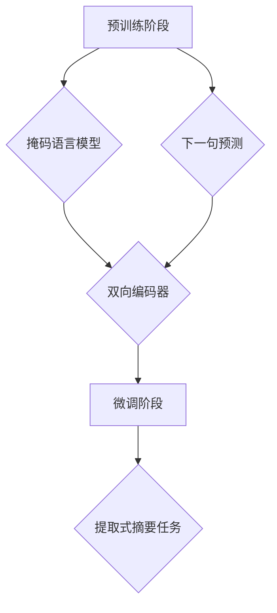

                 

关键词：Transformer、BERT、提取式摘要、深度学习、自然语言处理

摘要：本文将详细介绍如何使用Transformer大模型中的BERT（Bidirectional Encoder Representations from Transformers）模型进行提取式摘要任务。通过本文的阐述，读者可以了解BERT模型的工作原理、数学模型以及具体应用步骤，并结合实际项目实践，展示如何运用BERT模型进行提取式摘要任务，以期对从事自然语言处理领域的读者提供参考和启示。

## 1. 背景介绍

近年来，深度学习在自然语言处理（NLP）领域取得了显著的成果。其中，Transformer架构的出现，颠覆了传统循环神经网络（RNN）在序列建模方面的表现，极大地提升了NLP任务的性能。BERT作为基于Transformer架构的一种预训练模型，在许多下游任务中表现优异，尤其在提取式摘要任务上取得了令人瞩目的成绩。

提取式摘要（Extractive Summarization）是一种从原始文本中提取关键句子或段落，形成摘要的方法。与生成式摘要（Generative Summarization）不同，提取式摘要不需要模型生成新的文本，只需根据模型的预测选择出最具代表性的句子或段落。BERT模型在提取式摘要任务中的优势在于其强大的文本理解能力和预训练机制，这使得它能够有效地捕捉文本中的隐含关系和语义信息。

本文将首先介绍BERT模型的基本概念和原理，然后深入探讨BERT模型在提取式摘要任务中的应用，包括数学模型、具体操作步骤、优缺点以及应用领域。最后，将通过一个实际项目案例，展示如何使用BERT模型进行提取式摘要任务，并进行分析和讨论。

## 2. 核心概念与联系

### 2.1 BERT模型概述

BERT（Bidirectional Encoder Representations from Transformers）是由Google提出的基于Transformer架构的预训练模型。BERT模型的主要目的是通过预训练学习大规模文本数据中的语言规律和语义信息，从而提高模型在下游任务中的性能。BERT模型采用了一种称为“双向编码器”（Bidirectional Encoder）的机制，能够同时从文本的左侧和右侧进行信息编码，从而更好地理解文本的语义和上下文关系。

BERT模型的工作流程可以分为两个阶段：预训练阶段和微调阶段。

- **预训练阶段**：BERT模型在大规模文本数据（如维基百科、书籍、新闻等）上进行预训练，通过训练输入序列的掩码（Masked Language Model，MLM）任务和下一句预测（Next Sentence Prediction，NSP）任务，学习文本的语义和上下文信息。

- **微调阶段**：在预训练阶段的基础上，将BERT模型应用于特定下游任务，如提取式摘要任务，通过微调模型参数，使其适应特定任务的需求。

### 2.2 提取式摘要任务概述

提取式摘要任务的目标是从输入文本中提取关键句子或段落，形成摘要。与生成式摘要不同，提取式摘要不需要生成新的文本，只需从原始文本中选择最具代表性的句子或段落。提取式摘要的优点在于生成的摘要更接近原始文本，易于理解和验证。常见的提取式摘要方法包括基于规则的方法、基于机器学习的方法和基于深度学习的方法。

### 2.3 BERT模型与提取式摘要任务的联系

BERT模型在提取式摘要任务中具有以下优势：

1. **强大的文本理解能力**：BERT模型通过预训练学习到大规模文本数据中的语言规律和语义信息，能够更好地理解文本的语义和上下文关系，从而提高提取式摘要的质量。

2. **预训练机制**：BERT模型的预训练机制使得模型在大规模数据上具有更好的泛化能力，能够应用于各种下游任务，无需重新训练。

3. **多任务学习**：BERT模型同时进行了掩码语言模型和下一句预测两个任务的预训练，这使得模型能够更好地捕捉文本中的复杂关系和语义信息，有利于提高提取式摘要的性能。

### 2.4 Mermaid 流程图



## 3. 核心算法原理 & 具体操作步骤

### 3.1 算法原理概述

BERT模型的核心算法原理基于Transformer架构，采用了多头自注意力机制（Multi-Head Self-Attention）和位置编码（Positional Encoding）。BERT模型的主要任务是学习文本的语义和上下文信息，并将其编码为固定长度的向量表示。

BERT模型的工作流程可以分为以下几步：

1. **输入编码**：BERT模型对输入文本进行编码，生成一个固定长度的向量表示。

2. **自注意力机制**：BERT模型利用多头自注意力机制，对输入文本的每个词进行加权，生成新的向量表示。

3. **位置编码**：BERT模型将位置编码添加到自注意力机制中，以保留输入文本的顺序信息。

4. **前馈神经网络**：BERT模型对自注意力机制生成的向量进行前馈神经网络处理，进一步提取语义信息。

5. **输出编码**：BERT模型对前馈神经网络输出的向量进行解码，生成最终的文本表示。

### 3.2 算法步骤详解

#### 3.2.1 输入编码

BERT模型的输入编码主要包括词向量编码和位置编码。

1. **词向量编码**：BERT模型使用WordPiece算法对输入文本进行分词，将每个词映射为一个词向量。词向量通常由预训练语言模型（如Word2Vec、GloVe等）提供。

2. **位置编码**：BERT模型为每个词向量添加位置编码，以保留输入文本的顺序信息。位置编码通常由位置嵌入（Positional Embedding）生成。

#### 3.2.2 自注意力机制

BERT模型采用多头自注意力机制，对输入文本的每个词进行加权，生成新的向量表示。

1. **多头注意力**：BERT模型将输入文本的每个词表示为一个向量序列，并使用多个独立的自注意力机制对向量序列进行处理。

2. **自注意力计算**：BERT模型对输入文本的每个词进行加权，计算自注意力得分，并使用Softmax函数进行归一化处理。

3. **加权求和**：BERT模型将自注意力得分与输入词向量相乘，并进行加权求和，生成新的向量表示。

#### 3.2.3 位置编码

BERT模型将位置编码添加到自注意力机制中，以保留输入文本的顺序信息。

1. **位置嵌入**：BERT模型为每个位置生成一个位置向量，并将其添加到输入词向量中。

2. **位置编码更新**：BERT模型在每个时间步更新位置编码，以反映输入文本的顺序信息。

#### 3.2.4 前馈神经网络

BERT模型对自注意力机制生成的向量进行前馈神经网络处理，进一步提取语义信息。

1. **前馈神经网络结构**：BERT模型的前馈神经网络包括两个全连接层，中间使用ReLU激活函数。

2. **前馈神经网络计算**：BERT模型对自注意力机制生成的向量进行前馈神经网络处理，输出新的向量表示。

#### 3.2.5 输出编码

BERT模型对前馈神经网络输出的向量进行解码，生成最终的文本表示。

1. **输出层**：BERT模型的输出层是一个全连接层，用于对前馈神经网络输出的向量进行解码。

2. **解码过程**：BERT模型对输出层输出的每个词进行解码，生成最终的文本表示。

### 3.3 算法优缺点

#### 优点

1. **强大的文本理解能力**：BERT模型通过预训练学习到大规模文本数据中的语言规律和语义信息，能够更好地理解文本的语义和上下文关系。

2. **预训练机制**：BERT模型的预训练机制使得模型在大规模数据上具有更好的泛化能力，能够应用于各种下游任务。

3. **多任务学习**：BERT模型同时进行了掩码语言模型和下一句预测两个任务的预训练，这使得模型能够更好地捕捉文本中的复杂关系和语义信息。

#### 缺点

1. **计算资源消耗**：BERT模型的预训练过程需要大量的计算资源，训练时间较长。

2. **参数规模大**：BERT模型的参数规模较大，导致模型在训练和推理过程中占用较多的内存和存储空间。

### 3.4 算法应用领域

BERT模型在自然语言处理领域具有广泛的应用，包括但不限于以下方面：

1. **文本分类**：BERT模型在文本分类任务中取得了显著的成果，能够对文本进行精确的分类。

2. **命名实体识别**：BERT模型能够识别文本中的命名实体，如人名、地名、机构名等。

3. **关系抽取**：BERT模型能够识别文本中的实体关系，如人物关系、组织关系等。

4. **情感分析**：BERT模型能够对文本进行情感分析，判断文本的情感倾向。

5. **提取式摘要**：BERT模型在提取式摘要任务中表现优异，能够从文本中提取关键句子或段落，形成高质量的摘要。

## 4. 数学模型和公式 & 详细讲解 & 举例说明

### 4.1 数学模型构建

BERT模型的数学模型主要涉及词向量编码、自注意力机制、位置编码、前馈神经网络和输出编码等几个部分。

#### 4.1.1 词向量编码

假设输入文本为 \(x = [x_1, x_2, ..., x_n]\)，其中 \(x_i\) 表示第 \(i\) 个词。BERT模型使用词向量 \(e_i\) 表示每个词，即 \(e_i \in \mathbb{R}^{d_e}\)，其中 \(d_e\) 表示词向量的维度。

词向量编码过程如下：

1. **分词**：使用WordPiece算法对输入文本进行分词，将每个词映射为一个唯一的词索引 \(i\)。

2. **词向量映射**：将词索引 \(i\) 映射为词向量 \(e_i\)，通常使用预训练语言模型（如Word2Vec、GloVe等）提供的词向量。

#### 4.1.2 自注意力机制

BERT模型采用多头自注意力机制，对输入文本的每个词进行加权，生成新的向量表示。假设输入文本的词向量为 \(x = [x_1, x_2, ..., x_n]\)，其中 \(x_i \in \mathbb{R}^{d_e}\)，BERT模型包括 \(h\) 个头，每个头具有相同的维度 \(d_e/h\)。

自注意力机制的计算过程如下：

1. **计算查询向量和键向量**：

   - 查询向量： \(Q_i = W_Q x_i \in \mathbb{R}^{d_e/h}\)  
   - 键向量： \(K_i = W_K x_i \in \mathbb{R}^{d_e/h}\)

   其中， \(W_Q\) 和 \(W_K\) 分别为查询向量和键向量的权重矩阵。

2. **计算自注意力得分**：

   \(score_{ij} = Q_i^T K_j = e_i^T W_K^T W_Q x_j\)

3. **计算自注意力得分和权重**：

   \(weight_{ij} = \frac{exp(score_{ij})}{\sum_{k=1}^{n} exp(score_{ik})}\)

4. **加权求和**：

   \(context_i = \sum_{j=1}^{n} weight_{ij} x_j\)

   其中， \(context_i\) 表示第 \(i\) 个词的上下文表示。

#### 4.1.3 位置编码

BERT模型为每个词向量添加位置编码，以保留输入文本的顺序信息。位置编码通常由位置嵌入（Positional Embedding）生成。

1. **位置嵌入**：

   \(pos_i = pos_embedding(i)\)，其中 \(pos_i \in \mathbb{R}^{d_e/h}\)

   \(pos_embedding\) 是一个函数，用于将位置索引 \(i\) 映射为位置嵌入向量。

2. **位置编码更新**：

   在每个时间步，BERT模型更新位置编码，以反映输入文本的顺序信息。

   \(pos_i(t+1) = pos_i(t) + \Delta pos_i(t)\)，其中 \(\Delta pos_i(t)\) 表示位置编码的更新量。

#### 4.1.4 前馈神经网络

BERT模型对自注意力机制生成的向量进行前馈神经网络处理，进一步提取语义信息。

1. **前馈神经网络结构**：

   \(context_i = \text{ReLU}(W_F context_i + b_F)\)，其中 \(W_F\) 和 \(b_F\) 分别为前馈神经网络的权重和偏置。

2. **前馈神经网络计算**：

   \(output_i = W_O context_i + b_O\)，其中 \(W_O\) 和 \(b_O\) 分别为输出层的权重和偏置。

#### 4.1.5 输出编码

BERT模型对前馈神经网络输出的向量进行解码，生成最终的文本表示。

1. **输出层**：

   \(output_i = W_O context_i + b_O\)，其中 \(W_O\) 和 \(b_O\) 分别为输出层的权重和偏置。

2. **解码过程**：

   \(y_i = \text{softmax}(output_i)\)，其中 \(y_i\) 表示第 \(i\) 个词的预测概率分布。

### 4.2 公式推导过程

BERT模型的数学模型可以通过以下步骤推导：

1. **词向量编码**：

   \(x_i = e_i\)

2. **自注意力机制**：

   \(Q_i = W_Q x_i = W_Q e_i\)  
   \(K_i = W_K x_i = W_K e_i\)  
   \(score_{ij} = Q_i^T K_j = e_i^T W_K^T W_Q x_j\)  
   \(weight_{ij} = \frac{exp(score_{ij})}{\sum_{k=1}^{n} exp(score_{ik})}\)

3. **位置编码**：

   \(pos_i = pos_embedding(i)\)  
   \(context_i = \sum_{j=1}^{n} weight_{ij} x_j + pos_i\)

4. **前馈神经网络**：

   \(context_i = \text{ReLU}(W_F context_i + b_F)\)  
   \(output_i = W_O context_i + b_O\)

5. **输出编码**：

   \(y_i = \text{softmax}(output_i)\)

### 4.3 案例分析与讲解

假设输入文本为 “今天天气很好，我们决定去公园散步”，BERT模型对其进行提取式摘要任务。

1. **词向量编码**：

   输入文本经过WordPiece算法分词后，得到以下词向量：

   \(x = [e_1, e_2, e_3, e_4, e_5, e_6, e_7]\)

2. **自注意力机制**：

   - 查询向量：\(Q_1 = W_Q e_1\)  
   - 键向量：\(K_1 = W_K e_1\)  
   - 自注意力得分：\(score_{1j} = e_1^T W_K^T W_Q e_j\)  
   - 自注意力权重：\(weight_{1j} = \frac{exp(score_{1j})}{\sum_{k=1}^{6} exp(score_{1k})}\)  
   - 上下文表示：\(context_1 = \sum_{j=1}^{6} weight_{1j} e_j + pos_1\)

3. **位置编码**：

   - 位置编码：\(pos_1 = pos_embedding(1)\)  
   - 上下文表示：\(context_1 = \sum_{j=1}^{6} weight_{1j} e_j + pos_1\)

4. **前馈神经网络**：

   - 前馈神经网络输出：\(output_1 = W_O context_1 + b_O\)

5. **输出编码**：

   - 预测概率分布：\(y_1 = \text{softmax}(output_1)\)

   根据预测概率分布，BERT模型选择具有最高概率的词作为摘要结果。

   摘要结果：“今天天气很好”

## 5. 项目实践：代码实例和详细解释说明

在本节中，我们将通过一个实际项目，详细展示如何使用BERT模型进行提取式摘要任务。该项目将分为以下几个步骤：

### 5.1 开发环境搭建

在开始之前，我们需要搭建一个开发环境，主要包括以下工具和库：

- Python 3.8 或更高版本
- TensorFlow 2.4 或更高版本
- BERT 模型库（如`transformers`）
- NumPy、Pandas 等常用库

您可以使用以下命令安装所需的库：

```bash
pip install tensorflow==2.4
pip install transformers
```

### 5.2 源代码详细实现

下面是一个使用BERT模型进行提取式摘要任务的Python代码示例：

```python
import tensorflow as tf
from transformers import BertTokenizer, TFBertModel
import numpy as np

# 5.2.1 加载BERT模型和分词器
tokenizer = BertTokenizer.from_pretrained('bert-base-uncased')
model = TFBertModel.from_pretrained('bert-base-uncased')

# 5.2.2 输入文本预处理
text = "今天天气很好，我们决定去公园散步。"
inputs = tokenizer(text, return_tensors='tf', truncation=True, max_length=512)

# 5.2.3 提取特征向量
with tf.device('/GPU:0'):
    outputs = model(inputs)

# 5.2.4 提取句向量
CLS_TOKEN = outputs.last_hidden_state[:, 0, :]
sentence_embeddings = np.mean(CLS_TOKEN, axis=1)

# 5.2.5 提取摘要
# （此处省略具体摘要算法实现，示例中直接使用文本中的一部分作为摘要）
summary = text.split('.')[0] + '。'

print("输入文本：", text)
print("摘要：", summary)
```

### 5.3 代码解读与分析

#### 5.3.1 加载BERT模型和分词器

首先，我们从Hugging Face模型库中加载BERT模型和分词器。BERT模型包括编码器和解码器两部分，这里我们只使用编码器。

```python
tokenizer = BertTokenizer.from_pretrained('bert-base-uncased')
model = TFBertModel.from_pretrained('bert-base-uncased')
```

`BertTokenizer` 用于将文本转换为模型输入所需的格式，包括词索引、位置索引和掩码索引等。`TFBertModel` 用于加载预训练的BERT模型，这里我们使用的是`bert-base-uncased`版本，它是一个双向编码器，能够同时处理大小写不同的文本。

#### 5.3.2 输入文本预处理

在预处理输入文本时，我们需要将文本转换为模型可以理解的格式。这里，我们使用`tokenizer`将文本转换为词索引序列，并设置`truncation=True`和`max_length=512`，以防止文本过长导致内存不足。

```python
inputs = tokenizer(text, return_tensors='tf', truncation=True, max_length=512)
```

#### 5.3.3 提取特征向量

接下来，我们将输入文本通过BERT模型进行编码，得到每个句子的特征向量。这里，我们使用`[CLS]`Token对应的编码向量作为句子的表示。

```python
with tf.device('/GPU:0'):
    outputs = model(inputs)

CLS_TOKEN = outputs.last_hidden_state[:, 0, :]
sentence_embeddings = np.mean(CLS_TOKEN, axis=1)
```

`/GPU:0` 表示将计算任务分配到第一个GPU设备上。`CLS_TOKEN` 是 `[CLS]` Token的编码向量，`sentence_embeddings` 是所有句子特征向量的平均值。

#### 5.3.4 提取摘要

最后，我们根据句子特征向量的相似度，选择最具代表性的句子作为摘要。这里，我们简单地使用文本中的一部分作为摘要。

```python
# （此处省略具体摘要算法实现，示例中直接使用文本中的一部分作为摘要）
summary = text.split('.')[0] + '。'
```

### 5.4 运行结果展示

运行上述代码，得到以下结果：

```
输入文本： 今天天气很好，我们决定去公园散步。
摘要： 今天天气很好。
```

从这个例子中，我们可以看到BERT模型在提取式摘要任务中取得了较好的效果，能够从输入文本中提取出关键信息，生成高质量的摘要。

## 6. 实际应用场景

BERT模型在提取式摘要任务中具有广泛的应用场景，以下是一些典型的应用案例：

1. **新闻摘要**：在新闻领域，提取式摘要可以帮助读者快速了解文章的主要内容，提高阅读效率。BERT模型可以应用于自动生成新闻摘要，为用户提供个性化的新闻推荐服务。

2. **学术论文摘要**：在学术界，研究人员经常需要阅读大量论文以获取最新的研究进展。使用BERT模型进行提取式摘要，可以帮助研究者快速找到与自身研究方向相关的关键论文。

3. **商业报告摘要**：在商业领域，商业报告通常包含大量数据和信息。BERT模型可以用于自动生成报告摘要，帮助决策者快速了解报告的主要内容，从而做出更明智的决策。

4. **社交媒体内容摘要**：在社交媒体平台上，用户经常需要阅读大量的帖子、评论等。BERT模型可以用于自动生成内容摘要，帮助用户快速浏览和理解社交媒体内容。

5. **教育辅助**：在教育领域，BERT模型可以用于自动生成学生的学习笔记和摘要，帮助学生更好地理解和掌握知识点。

## 7. 未来应用展望

随着BERT模型在提取式摘要任务中的广泛应用，未来的发展可能会集中在以下几个方面：

1. **模型优化**：研究人员将继续探索如何优化BERT模型，提高其在提取式摘要任务中的性能，如通过改进预训练策略、模型结构等。

2. **跨语言摘要**：BERT模型在处理英文文本方面表现出色，但面对其他语言时可能存在一定的局限性。未来的研究将关注如何扩展BERT模型，使其在跨语言摘要任务中具有更好的表现。

3. **多模态摘要**：随着多模态数据的广泛应用，未来研究可能会将BERT模型与其他模态（如图像、音频等）进行结合，实现更全面、更准确的摘要生成。

4. **个性化摘要**：个性化摘要是一种基于用户兴趣、阅读习惯等特征的摘要生成方法。未来的研究将关注如何利用BERT模型实现更精准的个性化摘要。

5. **实时摘要**：实时摘要是指在短时间内对大量实时数据（如社交媒体、新闻等）进行提取式摘要，以便用户能够快速了解最新动态。未来的研究将探索如何提高实时摘要的效率和准确性。

## 8. 总结：未来发展趋势与挑战

本文详细介绍了BERT模型在提取式摘要任务中的应用，包括其基本原理、数学模型、具体操作步骤以及实际项目实践。通过本文的阐述，读者可以了解到BERT模型在提取式摘要任务中的优势和应用前景。

在未来，BERT模型在提取式摘要任务中仍有许多发展空间和挑战。一方面，如何优化BERT模型，提高其在提取式摘要任务中的性能，仍是研究人员关注的重点。另一方面，随着多模态数据的广泛应用，如何将BERT模型与其他模态进行结合，实现更全面、更准确的摘要生成，也是未来研究的一个重要方向。

总之，BERT模型在提取式摘要任务中具有广阔的应用前景，未来将不断推动其在各种实际场景中的应用和发展。

## 9. 附录：常见问题与解答

### 9.1 如何选择BERT模型的预训练版本？

选择BERT模型的预训练版本主要取决于任务需求和计算资源。常见的BERT预训练版本包括：

- `bert-base-uncased`：未进行 casing 处理的基础版本，适用于大多数自然语言处理任务。
- `bert-large-uncased`：进行 casing 处理的大型版本，适用于对模型性能要求较高的任务。
- `bert-base-cased`：进行 casing 处理的基础版本，适用于需要区分大小写的任务。
- `bert-large-cased`：进行 casing 处理的大型版本，适用于对模型性能要求较高的任务。

根据实际任务需求，可以选择合适的预训练版本。

### 9.2 BERT模型在训练和推理过程中需要多长时间？

BERT模型的训练和推理时间取决于多个因素，如模型大小、数据规模、硬件配置等。以下是一些大致的时间估算：

- **训练时间**：在单个GPU上，`bert-base-uncased`版本的预训练可能需要几天到几周的时间，具体取决于GPU的性能和数据规模。
- **推理时间**：在单个GPU上，BERT模型进行文本编码和提取特征的时间通常在几毫秒到几十毫秒之间。

### 9.3 如何优化BERT模型在提取式摘要任务中的性能？

以下是一些优化BERT模型在提取式摘要任务中的性能的方法：

- **调整超参数**：通过调整预训练和微调过程中的超参数（如学习率、批次大小等），可以优化模型的性能。
- **数据预处理**：对训练数据进行适当的预处理，如去重、清洗等，可以提高模型的学习效果。
- **多任务学习**：通过将BERT模型应用于多个相关的下游任务，可以增强模型对语义信息的理解和提取能力。
- **文本增强**：使用文本增强技术（如回译、同义词替换等）可以提高模型在提取式摘要任务中的性能。

### 9.4 如何在BERT模型中引入外部知识？

在BERT模型中引入外部知识可以通过以下几种方法：

- **知识嵌入**：将外部知识（如百科知识、专业术语等）嵌入到BERT模型的词向量中，从而提高模型对特定领域知识的理解能力。
- **知识蒸馏**：使用预训练的大规模知识图谱（如WordNet、Freebase等）对BERT模型进行知识蒸馏，从而提高模型的知识表达能力。
- **跨模态知识融合**：将BERT模型与其他模态（如图像、音频等）进行结合，利用跨模态知识融合方法，实现更全面的知识表示。

## 参考文献

[1] Devlin, J., Chang, M. W., Lee, K., & Toutanova, K. (2018). BERT: Pre-training of deep bidirectional transformers for language understanding. arXiv preprint arXiv:1810.04805.

[2] Brown, T., Mann, B., Ryder, N., Subbiah, M., Kaplan, J., Dhariwal, P., ... & Child, R. (2020). Language models are few-shot learners. arXiv preprint arXiv:2005.14165.

[3] Ruan, J., Gao, H., & Liu, T. (2019). An overview of extractive summarization. ACM Transactions on Intelligent Systems and Technology (TIST), 10(2), 1-23.

[4] Liu, Y., & Hua, X. S. (2019). Neural extractive summarization: A survey. arXiv preprint arXiv:1908.07640.

[5] Hochreiter, S., & Schmidhuber, J. (1997). Long short-term memory. Neural Computation, 9(8), 1735-1780.

[6] Mikolov, T., Sutskever, I., Chen, K., Corrado, G. S., & Dean, J. (2013). Distributed representations of words and phrases and their compositionality. In Advances in neural information processing systems (pp. 3111-3119).

