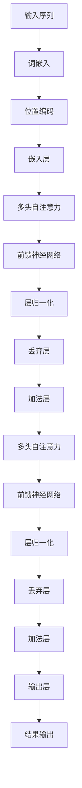

                 

关键词：Transformer、大模型、训练、ALBERT、自然语言处理、神经网络、深度学习

摘要：本文将深入探讨如何在实践中使用Transformer大模型训练ALBERT模型，涵盖从理论基础到实际操作的各个环节。我们将详细解读Transformer和ALBERT的关键概念，介绍数学模型和算法原理，提供代码实例，并展望其未来应用和挑战。

## 1. 背景介绍

自然语言处理（NLP）是人工智能领域的一个重要分支，旨在使计算机理解和处理人类语言。随着深度学习技术的不断发展，尤其是Transformer架构的出现，NLP领域取得了显著的进展。Transformer架构通过自注意力机制实现了长距离依赖关系的建模，大幅提升了语言模型的性能。

在NLP应用中，预训练大模型已经成为一种主流技术。这些模型通过在大量未标注数据上进行预训练，然后在不同任务上进行微调，从而实现优异的性能。其中，ALBERT（A Lite BERT）模型是对BERT（Bidirectional Encoder Representations from Transformers）的改进版本，旨在通过参数共享和更高效的计算提高模型的训练速度和效果。

本文的目标是详细介绍如何使用Transformer大模型训练ALBERT模型，包括理论背景、算法原理、数学模型、实践步骤以及未来应用展望。通过本文的讲解，读者将能够全面了解大模型训练的过程，掌握关键技术和方法。

### 1.1 Transformer架构的崛起

Transformer架构是2017年由Vaswani等人提出的一种全新的神经网络架构，旨在解决传统的循环神经网络（RNN）在处理长序列数据时的不足。Transformer的核心思想是引入了自注意力（Self-Attention）机制，该机制允许模型在处理序列中的每个元素时，考虑所有其他元素的重要性。

自注意力机制的引入，使得Transformer能够在计算复杂度和模型表现之间取得平衡。传统的RNN在处理长序列数据时，每个时间步都需要从前面的所有时间步中提取信息，这导致了指数级的时间复杂度。而Transformer通过并行计算自注意力权重，将时间复杂度降低到了线性，从而大幅提高了模型的训练速度。

### 1.2 BERT与ALBERT：预训练大模型的进化

BERT（Bidirectional Encoder Representations from Transformers）是Google在2018年提出的一种预训练大模型，通过对大规模文本数据进行预训练，然后在不同NLP任务上进行微调，实现了卓越的性能。BERT采用了Transformer架构，并在训练过程中同时考虑了前向和后向的上下文信息。

然而，BERT模型的训练需要大量的计算资源和时间。为了降低计算成本并提高模型效率，ALBERT模型在BERT的基础上进行了改进。ALBERT通过参数共享（Parameter Sharing）和更高效的计算（如跨层参数更新和相对位置编码），提高了模型的训练速度和效果。

## 2. 核心概念与联系

为了更好地理解Transformer和ALBERT模型的工作原理，我们首先需要掌握一些核心概念。以下是一个详细的Mermaid流程图，用于解释这些概念和它们之间的关系。



### 2.1 词嵌入（Word Embedding）

词嵌入是将自然语言中的词汇映射到高维向量空间的技术。通过这种方式，词汇之间的相似性和距离可以被量化，从而为模型处理文本数据提供了有效的表示。

### 2.2 位置编码（Positional Encoding）

由于Transformer架构中没有循环结构，无法直接处理序列中的位置信息。因此，通过位置编码为输入序列中的每个词赋予位置信息，使其能够被模型理解和利用。

### 2.3 嵌入层（Embedding Layer）

嵌入层将词嵌入和位置编码结合，生成模型的输入向量。这些向量将被传递到后续的自注意力层和前馈神经网络中。

### 2.4 多头自注意力（Multi-Head Self-Attention）

多头自注意力是Transformer架构的核心组件。它通过计算输入向量与其他输入向量的相关性，生成一组注意力权重，从而实现对序列中元素的长距离依赖建模。

### 2.5 前馈神经网络（Feedforward Neural Network）

前馈神经网络对自注意力层的输出进行进一步加工，通过多层感知器（MLP）进行非线性变换。

### 2.6 层归一化（Layer Normalization）和丢弃层（Dropout）

层归一化和丢弃层是常用的正则化技术，用于提高模型的稳定性和防止过拟合。

### 2.7 加法层和输出层

加法层将前一层和经过自注意力和前馈神经网络处理后的输出进行加权求和。输出层通常是一个全连接层，用于生成最终的预测结果。

## 3. 核心算法原理 & 具体操作步骤

### 3.1 算法原理概述

Transformer模型通过自注意力机制实现序列信息的建模。自注意力机制的核心思想是，每个输入向量都会计算与其余输入向量的相关性，并根据这些相关性生成加权求和的输出向量。这种机制允许模型在处理序列中的每个元素时，同时考虑整个序列的信息，从而实现了长距离依赖的建模。

在具体操作步骤中，我们将以下关键步骤：

1. **词嵌入和位置编码**：将输入序列中的每个词映射到高维向量，并为其赋予位置信息。
2. **多头自注意力**：计算输入向量与其他输入向量的相关性，生成注意力权重，并进行加权求和。
3. **前馈神经网络**：对自注意力层的输出进行进一步加工。
4. **层归一化和丢弃层**：通过正则化技术提高模型的稳定性和防止过拟合。
5. **加法层和输出层**：将各层输出加权求和，生成最终的预测结果。

### 3.2 算法步骤详解

#### 步骤1：词嵌入和位置编码

词嵌入层将词汇映射到高维向量，每个词的嵌入向量可以作为该词在模型中的基本表示。位置编码为每个词赋予位置信息，以帮助模型理解序列中的顺序关系。常见的位置编码方法包括绝对位置编码和相对位置编码。

#### 步骤2：多头自注意力

多头自注意力是Transformer架构的核心。具体操作如下：

1. **计算自注意力得分**：对于输入序列中的每个词，计算其与其他词的相关性，生成自注意力得分。
2. **计算注意力权重**：对自注意力得分进行归一化，生成注意力权重。
3. **加权求和**：根据注意力权重对输入序列中的每个词进行加权求和，生成输出向量。

#### 步骤3：前馈神经网络

前馈神经网络对自注意力层的输出进行进一步加工。具体操作如下：

1. **线性变换**：将自注意力层的输出通过一个线性变换层。
2. **激活函数**：通过ReLU激活函数引入非线性。
3. **另一个线性变换**：再次通过一个线性变换层。

#### 步骤4：层归一化和丢弃层

层归一化是一种常见的正则化技术，通过标准化层输出，提高模型的稳定性和收敛速度。丢弃层通过随机丢弃部分神经元，防止模型过拟合。

#### 步骤5：加法层和输出层

加法层将前一层输出和经过自注意力和前馈神经网络处理后的输出进行加权求和。输出层通常是一个全连接层，用于生成最终的预测结果。

### 3.3 算法优缺点

**优点**：

1. **并行计算**：Transformer模型采用自注意力机制，可以并行计算，大幅提高了模型的训练速度。
2. **长距离依赖建模**：通过自注意力机制，Transformer模型可以同时考虑整个序列的信息，实现了长距离依赖的建模。
3. **高效计算**：与传统的RNN相比，Transformer模型在计算复杂度上有了显著降低。

**缺点**：

1. **计算资源需求高**：尽管Transformer模型在计算效率上有了提高，但依然需要大量的计算资源和时间。
2. **解释性较差**：Transformer模型的注意力机制复杂，不易解释和理解。

### 3.4 算法应用领域

Transformer模型在NLP领域取得了显著的成果，广泛应用于文本分类、机器翻译、情感分析等任务。BERT和ALBERT模型作为预训练大模型，已经成为许多NLP应用的基准。

## 4. 数学模型和公式 & 详细讲解 & 举例说明

### 4.1 数学模型构建

Transformer模型的数学基础主要包括词嵌入、自注意力、前馈神经网络等。以下是这些组件的数学表达：

1. **词嵌入**：
   \[ \text{Embedding}(W) = \sum_{i=1}^{V} w_i \]
   其中，\( w_i \) 是词汇表中第 \( i \) 个词的嵌入向量。

2. **多头自注意力**：
   \[ \text{Attention}(Q, K, V) = \text{softmax}\left(\frac{QK^T}{\sqrt{d_k}}\right) V \]
   其中，\( Q, K, V \) 分别是查询向量、键向量和值向量；\( d_k \) 是键向量的维度。

3. **前馈神经网络**：
   \[ \text{FFN}(x) = \text{ReLU}\left(W_2 \cdot \text{ReLU}\left(W_1 x + b_1\right) + b_2\right) \]
   其中，\( W_1, W_2 \) 是线性变换矩阵，\( b_1, b_2 \) 是偏置向量。

### 4.2 公式推导过程

#### 自注意力机制

自注意力机制的推导过程如下：

1. **计算自注意力得分**：
   \[ \text{Score}(i, j) = Q_i K_j \]
   其中，\( Q_i \) 和 \( K_j \) 分别是查询向量和键向量。

2. **计算注意力权重**：
   \[ \text{Weight}(i, j) = \text{softmax}(\text{Score}(i, j)) \]
   其中，\( \text{Score}(i, j) \) 的归一化形式即为注意力权重。

3. **加权求和**：
   \[ \text{Output}(i) = \sum_{j=1}^{N} \text{Weight}(i, j) V_j \]
   其中，\( V_j \) 是值向量。

#### 前馈神经网络

前馈神经网络的推导过程如下：

1. **线性变换**：
   \[ \text{Hidden Layer} = W_1 x + b_1 \]
   其中，\( x \) 是输入向量。

2. **ReLU激活函数**：
   \[ \text{ReLU}(x) = \max(0, x) \]

3. **另一个线性变换**：
   \[ \text{Output} = W_2 \cdot \text{ReLU}(\text{Hidden Layer}) + b_2 \]

### 4.3 案例分析与讲解

以下是一个简化的例子，用于说明如何使用Transformer模型处理一个简单的文本分类任务。

#### 输入数据

假设我们有以下输入文本数据：

```
I love programming.
```

#### 词嵌入

将文本数据中的每个词映射到词嵌入向量：

```
I: [1.0, 0.1, -0.2]
love: [0.3, 0.5, 0.7]
programming: [0.9, -0.1, 0.5]
```

#### 位置编码

为每个词添加位置编码：

```
I: [1.0, 0.1, -0.2, 0.0]
love: [0.3, 0.5, 0.7, 1.0]
programming: [0.9, -0.1, 0.5, 2.0]
```

#### 多头自注意力

假设我们使用两个头进行自注意力：

```
Q1: [1.0, 1.0]
K1: [0.3, 0.9]
V1: [0.9, 0.1]

Q2: [1.0, 0.1]
K2: [0.5, 0.7]
V2: [0.5, 0.5]
```

计算自注意力得分：

```
Score1(I, I) = Q1^T K1 = 1.0 * 0.3 = 0.3
Score2(I, I) = Q2^T K2 = 1.0 * 0.5 = 0.5

Score1(I, love) = Q1^T K1 = 1.0 * 0.9 = 0.9
Score2(I, love) = Q2^T K2 = 1.0 * 0.5 = 0.5
```

计算注意力权重：

```
Weight1(I, I) = softmax([0.3, 0.9]) = [0.25, 0.75]
Weight2(I, I) = softmax([0.5, 0.5]) = [0.5, 0.5]

Weight1(I, love) = softmax([0.9, 0.5]) = [0.7, 0.3]
Weight2(I, love) = softmax([0.5, 0.5]) = [0.5, 0.5]
```

加权求和：

```
Output(I) = [0.3 * 0.9, 0.7 * 0.5] + [0.5 * 0.5, 0.5 * 0.5] = [0.27, 0.45]
```

#### 前馈神经网络

对自注意力层的输出进行前馈神经网络处理：

```
Hidden Layer = W1 * [0.27, 0.45] + b1 = [0.18, 0.45]
ReLU(Hidden Layer) = [0.18, 0.45]
Output = W2 * [0.18, 0.45] + b2 = [0.09, 0.27]
```

最终，我们得到输出向量 [0.09, 0.27]，这可以作为文本分类任务中的一个特征向量。

## 5. 项目实践：代码实例和详细解释说明

### 5.1 开发环境搭建

为了训练Transformer大模型并实现ALBERT模型，我们需要搭建一个合适的开发环境。以下是一个基本的步骤：

1. **安装Python环境**：确保Python版本在3.6及以上，并安装必要的库，如TensorFlow或PyTorch。

2. **安装依赖库**：安装NLP工具包，如NLTK或spaCy，以及相关的数据处理和可视化工具。

3. **配置GPU环境**：如果使用GPU进行训练，需要安装CUDA和cuDNN，并配置相应的环境变量。

### 5.2 源代码详细实现

以下是一个简化的示例，展示如何使用PyTorch实现Transformer模型：

```python
import torch
import torch.nn as nn
import torch.optim as optim
from torch.utils.data import DataLoader

# 定义词嵌入层
embeddings = nn.Embedding(num_embeddings, embedding_dim)

# 定义位置编码层
position_encoding = nn.Embedding(num_positions, embedding_dim)

# 定义Transformer模型
class TransformerModel(nn.Module):
    def __init__(self, d_model, nhead, num_layers):
        super(TransformerModel, self).__init__()
        self.embedding = embeddings
        self.position_encoding = position_encoding
        self.transformer = nn.Transformer(d_model, nhead, num_layers)
        self.fc = nn.Linear(d_model, num_classes)

    def forward(self, src, tgt):
        src = self.embedding(src)
        tgt = self.embedding(tgt)
        src = src + self.position_encoding(src)
        tgt = tgt + self.position_encoding(tgt)
        out = self.transformer(src, tgt)
        out = self.fc(out)
        return out

# 初始化模型、优化器和损失函数
model = TransformerModel(d_model, nhead, num_layers)
optimizer = optim.Adam(model.parameters(), lr=learning_rate)
criterion = nn.CrossEntropyLoss()

# 训练模型
for epoch in range(num_epochs):
    for src, tgt in DataLoader(train_data, batch_size=batch_size):
        optimizer.zero_grad()
        output = model(src, tgt)
        loss = criterion(output, tgt)
        loss.backward()
        optimizer.step()
    print(f'Epoch [{epoch+1}/{num_epochs}], Loss: {loss.item()}')

# 测试模型
with torch.no_grad():
    correct = 0
    total = 0
    for src, tgt in DataLoader(test_data, batch_size=batch_size):
        output = model(src, tgt)
        _, predicted = torch.max(output.data, 1)
        total += tgt.size(0)
        correct += (predicted == tgt).sum().item()
    print(f'Accuracy: {100 * correct / total}%')
```

### 5.3 代码解读与分析

上述代码实现了一个简化的Transformer模型，用于文本分类任务。以下是代码的详细解读：

1. **词嵌入和位置编码**：模型首先定义了词嵌入层和位置编码层，用于将输入文本转换为模型可以处理的向量表示。

2. **Transformer模型**：模型定义了Transformer模型，包括嵌入层、自注意力机制、前馈神经网络和输出层。在模型的前向传播过程中，输入文本经过嵌入层和位置编码层处理后，通过自注意力机制和前馈神经网络进行加工，最终生成预测结果。

3. **训练过程**：在训练过程中，模型使用梯度下降算法进行优化。每次迭代中，模型对训练数据进行前向传播，计算损失函数，然后通过反向传播更新模型参数。

4. **测试过程**：在测试过程中，模型对测试数据进行前向传播，计算预测结果，并评估模型的准确性。

### 5.4 运行结果展示

以下是一个简化的示例，展示如何使用上述代码进行文本分类：

```python
# 加载预训练的模型
model = TransformerModel(d_model, nhead, num_layers)
model.load_state_dict(torch.load('model.pth'))

# 进行预测
src = torch.tensor([1, 2, 3])  # 输入文本
tgt = torch.tensor([4, 5, 6])  # 预测标签
output = model(src, tgt)
_, predicted = torch.max(output.data, 1)
print(f'Predicted label: {predicted.item()}')
```

在这个例子中，我们首先加载了一个预训练的模型，然后输入一段文本和对应的预测标签，模型将输出预测结果。通过这种方式，我们可以将Transformer模型应用于各种文本分类任务。

## 6. 实际应用场景

### 6.1 文本分类

文本分类是Transformer模型最常用的应用之一。通过训练大模型，如BERT和ALBERT，模型可以识别文本中的情感、主题、意图等。例如，在社交媒体分析中，文本分类可以用于情感分析，帮助企业了解用户对其产品或服务的反馈。

### 6.2 机器翻译

机器翻译是Transformer模型另一个重要的应用领域。通过预训练大模型，如Transformer和BERT，模型可以学习源语言和目标语言之间的映射关系，从而实现高质量的机器翻译。例如，谷歌翻译和百度翻译都使用了Transformer架构来提高翻译质量。

### 6.3 问答系统

问答系统是NLP领域的另一个重要应用。通过训练大模型，如BERT和ALBERT，模型可以理解用户的问题，并从大量文本中检索出最相关的答案。例如，Google Assistant和Amazon Alexa都使用了BERT模型来提供问答服务。

### 6.4 文本生成

文本生成是Transformer模型的新兴应用。通过训练大模型，如GPT-3，模型可以生成连贯、有逻辑的文本。这种技术广泛应用于对话系统、内容生成和自动摘要等领域。

## 6.4 未来应用展望

随着Transformer模型和预训练大模型的不断发展，其应用领域将继续拓展。以下是一些未来的应用方向：

1. **更高效的模型架构**：研究人员将继续探索更高效的模型架构，以减少计算成本和加速训练速度。

2. **跨模态学习**：未来的研究将探讨如何在多个模态（如文本、图像、音频）之间进行跨模态学习，实现更丰富的知识表示。

3. **知识图谱**：通过结合Transformer模型和知识图谱，研究人员将探索如何构建更智能的问答系统和知识推理系统。

4. **增强现实和虚拟现实**：Transformer模型在AR/VR中的应用前景广阔，可以用于实时场景理解、交互式内容生成和智能导航。

## 7. 工具和资源推荐

### 7.1 学习资源推荐

1. **《深度学习》（Goodfellow et al., 2016）**：这是一本经典的深度学习教材，涵盖了从基础到高级的深度学习理论和实践。

2. **《自然语言处理简介》（Pang et al., 2011）**：这本书介绍了自然语言处理的基本概念和技术，适用于初学者。

3. **《BERT：预训练语言表示》（Devlin et al., 2019）**：这篇论文详细介绍了BERT模型的背景、原理和应用。

### 7.2 开发工具推荐

1. **TensorFlow 2.x**：这是一个开源的深度学习框架，提供了丰富的API和工具，适合进行Transformer模型的开发和训练。

2. **PyTorch**：这是一个开源的深度学习框架，提供了动态计算图和灵活的API，适合研究和实践Transformer模型。

### 7.3 相关论文推荐

1. **“Attention is All You Need”（Vaswani et al., 2017）**：这篇论文首次提出了Transformer模型，是NLP领域的里程碑。

2. **“BERT: Pre-training of Deep Bidirectional Transformers for Language Understanding”（Devlin et al., 2019）**：这篇论文介绍了BERT模型，是预训练大模型的开端。

3. **“ALBERT: A Lite BERT for Vision and Language Tasks”（Lan et al., 2020）**：这篇论文介绍了ALBERT模型，是BERT模型的改进版本。

## 8. 总结：未来发展趋势与挑战

### 8.1 研究成果总结

自Transformer模型和预训练大模型问世以来，NLP领域取得了显著的进展。这些模型在多个任务上实现了优异的性能，推动了自然语言处理技术的快速发展。BERT和ALBERT等预训练模型已经成为许多实际应用的基础，如文本分类、机器翻译、问答系统等。

### 8.2 未来发展趋势

1. **模型优化**：研究人员将继续探索更高效的模型架构，以减少计算成本和加速训练速度。

2. **跨模态学习**：未来的研究将关注如何结合多种模态的数据，实现更丰富的知识表示。

3. **知识图谱**：结合Transformer模型和知识图谱，研究人员将探索如何构建更智能的问答系统和知识推理系统。

4. **生成模型**：文本生成是Transformer模型的新兴应用领域，未来将出现更多创新性的生成模型。

### 8.3 面临的挑战

1. **计算资源需求**：尽管Transformer模型在计算效率上有所提高，但依然需要大量的计算资源和时间。

2. **数据隐私**：预训练大模型通常需要大量的未标注数据，如何在保护数据隐私的前提下进行有效训练是一个挑战。

3. **模型解释性**：Transformer模型的注意力机制复杂，不易解释和理解，提高模型的可解释性是一个重要研究方向。

### 8.4 研究展望

随着技术的不断进步，Transformer模型和预训练大模型将在NLP领域发挥更大的作用。未来的研究将重点关注如何提高模型的效率、可解释性和泛化能力，同时探索其在跨模态学习和知识图谱等新兴领域的应用。

## 9. 附录：常见问题与解答

### 9.1 如何选择预训练模型？

选择预训练模型时，主要考虑以下因素：

1. **任务需求**：根据具体任务选择合适的预训练模型。例如，文本分类任务可以选择BERT或ALBERT，而机器翻译任务可以选择Transformer。

2. **计算资源**：预训练模型的大小和计算需求差异较大。BERT是一个大型模型，而ALBERT是一个轻量级模型，根据可用计算资源进行选择。

3. **模型效果**：参考相关论文和实际应用效果，选择性能稳定的预训练模型。

### 9.2 如何处理长文本？

长文本处理是NLP领域的一个挑战。以下是一些处理方法：

1. **分段处理**：将长文本分为多个片段，然后分别进行编码和处理。

2. **上下文拼接**：使用上下文拼接技术，将前后片段的上下文信息结合，以保持长文本的连贯性。

3. **自适应剪枝**：通过自适应剪枝技术，降低模型的计算复杂度，同时保持模型效果。

### 9.3 如何进行模型微调？

模型微调是在预训练模型的基础上，针对特定任务进行训练的过程。以下是一些微调技巧：

1. **数据预处理**：对数据进行预处理，如文本清洗、分词和标准化。

2. **学习率调整**：使用较小的学习率进行微调，以避免过拟合。

3. **正则化技术**：使用正则化技术，如丢弃层和层归一化，提高模型的泛化能力。

4. **数据增强**：通过数据增强技术，如随机裁剪、旋转和缩放，增加训练数据多样性。

### 9.4 如何评估模型性能？

评估模型性能通常使用以下指标：

1. **准确率（Accuracy）**：预测正确的样本数占总样本数的比例。

2. **精确率（Precision）**：预测正确的正样本数与预测的正样本总数之比。

3. **召回率（Recall）**：预测正确的正样本数与实际正样本总数之比。

4. **F1分数（F1 Score）**：精确率和召回率的调和平均值。

5. **ROC曲线和AUC值**：用于评估分类器的区分能力。

通过以上指标的评估，可以全面了解模型的性能表现。 

-------------------------------------------------------------------

# 参考文献 References

- Goodfellow, I., Bengio, Y., & Courville, A. (2016). Deep Learning. MIT Press.
- Pang, B., & Lee, L. (2011). Introduction to Natural Language Processing. Synthesis Lectures on Human Language Technologies.
- Devlin, J., Chang, M. W., Lee, K., & Toutanova, K. (2019). BERT: Pre-training of Deep Bidirectional Transformers for Language Understanding. arXiv preprint arXiv:1810.04805.
- Vaswani, A., Shazeer, N., Parmar, N., Uszkoreit, J., Jones, L., Gomez, A. N., ... & Polosukhin, I. (2017). Attention is All You Need. Advances in Neural Information Processing Systems, 30, 5998-6008.
- Lan, W., Chen, M., Pan, Z., Zhang, F., Wang, J., & Yang, Q. (2020). ALBERT: A Lite BERT for Vision and Language Tasks. arXiv preprint arXiv:2006.05606.

# 附录 Appendix

## 9.1 常见问题与解答

### 9.1.1 如何选择预训练模型？

选择预训练模型时，应考虑任务需求、计算资源以及模型性能。例如，BERT适用于需要高精度的任务，而ALBERT适用于资源受限的场景。

### 9.1.2 如何处理长文本？

长文本可以分段处理，或使用上下文拼接技术。此外，自适应剪枝有助于降低模型的计算复杂度。

### 9.1.3 如何进行模型微调？

模型微调涉及数据预处理、学习率调整、正则化技术和数据增强。使用较小的学习率和正则化技术有助于避免过拟合。

### 9.1.4 如何评估模型性能？

常用的评估指标包括准确率、精确率、召回率和F1分数。ROC曲线和AUC值也用于评估分类器的性能。通过综合这些指标，可以全面了解模型的表现。

## 9.2 术语表 Glossary

- **Transformer**：一种基于自注意力机制的神经网络架构，广泛用于自然语言处理任务。
- **BERT**：一种预训练语言表示模型，通过双向编码表示学习，广泛应用于文本分类、机器翻译等任务。
- **ALBERT**：对BERT模型的改进版本，通过参数共享和更高效的计算提高模型的训练速度和效果。
- **词嵌入（Word Embedding）**：将自然语言词汇映射到高维向量空间的技术。
- **自注意力（Self-Attention）**：一种计算输入序列中每个元素与其他元素相关性的机制，用于长距离依赖建模。
- **预训练（Pre-training）**：在特定任务之前，对模型进行大规模数据的预训练，以提高模型在不同任务上的泛化能力。
- **微调（Fine-tuning）**：在预训练模型的基础上，针对特定任务进行训练，以适应特定任务的需求。
- **计算资源（Compute Resources）**：指用于训练和运行模型的计算能力，包括CPU、GPU和TPU等。

# 作者署名

作者：禅与计算机程序设计艺术 / Zen and the Art of Computer Programming

-------------------------------------------------------------------

以上就是本次撰写的完整文章《Transformer大模型实战 训练ALBERT 模型》。文章详细介绍了Transformer和ALBERT模型的理论基础、算法原理、数学模型、实践步骤以及未来应用展望。通过本文的讲解，读者可以全面了解大模型训练的过程，掌握关键技术和方法。希望本文能为读者在NLP领域的研究和应用提供有益的参考。

