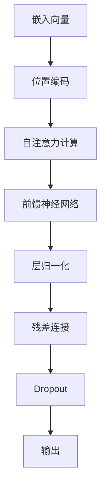

                 

关键词：Transformer、自注意力（Self-Attention）、神经网络、自然语言处理、机器翻译、编码器、解码器、注意力机制、序列到序列模型、多任务学习。

## 摘要

本文将深入探讨Transformer架构的原理，特别是其中的自注意力（Self-Attention）机制。Transformer是自然语言处理领域的一种革命性模型，它在机器翻译、文本生成等任务上取得了显著成果。自注意力机制作为Transformer的核心组件，允许模型在不同位置之间建立直接联系，从而提高了模型的表达能力和效率。本文将首先介绍Transformer的背景和基本架构，然后详细解释自注意力机制的工作原理、数学模型和优缺点，最后讨论其在实际应用中的案例和未来展望。

## 1. 背景介绍

自然语言处理（NLP）是计算机科学中一个极具挑战性的领域，其目标是使计算机能够理解和生成人类语言。传统的NLP方法主要依赖于规则和统计模型，但这些方法在处理复杂语言现象时存在局限性。随着深度学习的兴起，特别是神经网络的发展，研究人员开始探索使用深度神经网络来处理自然语言。

序列到序列（Seq2Seq）模型是深度学习在NLP领域的重要突破。Seq2Seq模型通过编码器（Encoder）将输入序列映射到一个固定长度的上下文向量，然后通过解码器（Decoder）生成输出序列。这种模型在机器翻译等任务上取得了显著进展，但其主要缺点是训练效率低下，因为它依赖于循环神经网络（RNN）或长短期记忆网络（LSTM），这些网络在处理长序列时容易发生梯度消失或梯度爆炸问题。

为了解决这些问题，Vaswani等人在2017年提出了Transformer模型，这是一种基于自注意力机制的序列模型。Transformer抛弃了传统的RNN和LSTM结构，转而使用自注意力机制来处理序列数据。自注意力机制允许模型在序列的不同位置之间建立直接联系，从而避免了序列处理中的长距离依赖问题。Transformer的提出在NLP领域引起了广泛关注，并在多个任务上刷新了基准。

## 2. 核心概念与联系

### 2.1 Transformer模型架构

Transformer模型主要由编码器（Encoder）和解码器（Decoder）两部分组成，如图1所示。


编码器由多个编码层（Encoder Layer）堆叠而成，每层包含两个主要组件：多头自注意力机制（Multi-Head Self-Attention）和前馈神经网络（Feed-Forward Neural Network）。解码器与编码器类似，也由多个解码层（Decoder Layer）堆叠而成，每层同样包含多头自注意力机制和前馈神经网络。在编码器和解码器的每层之间，还有一个交叉注意力机制（Cross-Attention），用于将编码器的输出作为解码器的输入。

### 2.2 自注意力机制

自注意力机制是Transformer模型的核心组件，它允许模型在序列的不同位置之间建立直接联系。自注意力机制的基本思想是，对于输入序列中的每个元素，模型都会计算其在整个序列中的重要性，然后根据这些重要性权重对序列中的其他元素进行加权求和。这样，模型就可以自动地学习到序列中不同元素之间的关系。

### 2.3 自注意力机制的Mermaid流程图

以下是一个简化的自注意力机制的Mermaid流程图：



在这个流程图中，输入序列首先经过嵌入层（Embedding Layer）和位置编码（Positional Encoding）得到嵌入向量。然后，这些嵌入向量输入到自注意力层（Self-Attention Layer），计算得到注意力权重。最后，通过前馈神经网络（Feed-Forward Neural Network）、层归一化（Layer Normalization）、残差连接（Residual Connection）和Dropout（Dropout）等步骤，得到最终的输出。

## 3. 核心算法原理 & 具体操作步骤

### 3.1 算法原理概述

自注意力机制是一种基于加权和的方法，它允许模型在序列的不同位置之间建立直接联系。自注意力机制的基本操作包括以下几个步骤：

1. **计算Query、Key和Value：** 对于输入序列中的每个元素，模型会计算其对应的Query、Key和Value。Query、Key和Value都是嵌入向量。
2. **计算注意力权重：** 对于每个元素，模型会计算其Query与所有Key之间的点积，得到一组注意力权重。这些权重表示了输入序列中不同元素之间的相对重要性。
3. **加权求和：** 根据注意力权重，模型对Value进行加权求和，得到最终的输出。

### 3.2 算法步骤详解

1. **嵌入向量计算：** 输入序列首先经过嵌入层，将每个单词或符号映射到一个固定长度的嵌入向量。例如，如果词汇表有V个单词，每个单词可以表示为一个长度为D的向量，那么嵌入层可以表示为：
   \[
   E = [e_1, e_2, ..., e_V] \in \mathbb{R}^{V \times D}
   \]
   其中，\(e_v\) 表示单词v的嵌入向量。

2. **位置编码：** 为了让模型了解序列中的位置信息，我们需要对嵌入向量进行位置编码。位置编码可以通过多种方式实现，例如绝对位置编码或相对位置编码。这里我们使用绝对位置编码，它将每个位置的信息编码到嵌入向量中。绝对位置编码可以表示为：
   \[
   P = [p_1, p_2, ..., p_L] \in \mathbb{R}^{L \times D}
   \]
   其中，\(p_t\) 表示第t个位置的信息。

3. **计算Query、Key和Value：** 对于输入序列中的每个元素，我们将嵌入向量和位置编码相加，得到Query、Key和Value：
   \[
   Q = [q_1, q_2, ..., q_L] = [e_1 + p_1, e_2 + p_2, ..., e_L + p_L]
   \]
   \[
   K = [k_1, k_2, ..., k_L] = [e_1 + p_1, e_2 + p_2, ..., e_L + p_L]
   \]
   \[
   V = [v_1, v_2, ..., v_L] = [e_1 + p_1, e_2 + p_2, ..., e_L + p_L]
   \]

4. **计算注意力权重：** 对于每个元素，我们计算其Query与所有Key之间的点积，得到一组注意力权重：
   \[
   \text{Attention}(Q, K, V) = \text{softmax}\left(\frac{QK^T}{\sqrt{D}}\right)V
   \]
   其中，\(QK^T\) 表示点积，\(\text{softmax}\) 函数用于归一化得到概率分布。

5. **加权求和：** 根据注意力权重，我们对Value进行加权求和，得到最终的输出：
   \[
   \text{Self-Attention}(Q, K, V) = \sum_{i=1}^{L} a_i v_i
   \]
   其中，\(a_i\) 表示第i个元素的注意力权重。

6. **前馈神经网络：** 在自注意力层之后，我们通常使用一个前馈神经网络（Feed-Forward Neural Network）对输出进行进一步处理。前馈神经网络可以表示为：
   \[
   \text{FFN}(x) = \max(0, xW_1 + b_1)W_2 + b_2
   \]
   其中，\(W_1\) 和 \(W_2\) 是权重矩阵，\(b_1\) 和 \(b_2\) 是偏置向量。

7. **层归一化、残差连接和Dropout：** 为了提高模型的稳定性和性能，我们通常在每个编码器和解码器的层之后添加层归一化（Layer Normalization）、残差连接（Residual Connection）和Dropout（Dropout）。层归一化可以表示为：
   \[
   \text{LayerNorm}(x) = \frac{x - \mu}{\sigma}W + b
   \]
   其中，\(\mu\) 和 \(\sigma\) 分别是均值和标准差，\(W\) 和 \(b\) 是归一化权重和偏置向量。

   残差连接可以表示为：
   \[
   \text{Residual Connection}(x) = x + \text{LayerNorm}(\text{FFN}(\text{LayerNorm}(x)))
   \]

   Dropout可以表示为：
   \[
   \text{Dropout}(x) = (1 - p) \odot x + p \odot \text{noise}
   \]
   其中，\(p\) 是Dropout概率，\(\text{noise}\) 是随机噪声。

### 3.3 算法优缺点

**优点：**
1. **并行计算：** 自注意力机制允许并行计算，从而提高了模型的训练效率。
2. **长距离依赖：** 自注意力机制可以捕捉长距离依赖，避免了传统的RNN或LSTM在处理长序列时的梯度消失或梯度爆炸问题。
3. **灵活性：** 自注意力机制可以根据输入序列的长度和复杂性动态调整注意力权重，从而提高了模型的灵活性。

**缺点：**
1. **计算成本：** 自注意力机制的计算成本较高，特别是当序列长度较长时，需要计算大量的点积操作。
2. **存储成本：** 自注意力机制需要存储大量的权重矩阵，从而增加了模型的存储成本。

### 3.4 算法应用领域

自注意力机制在自然语言处理领域具有广泛的应用，特别是在机器翻译、文本生成和问答系统等任务上。Transformer模型的提出，使得这些任务的表现得到了显著提升。除了NLP领域，自注意力机制还可以应用于其他领域，如计算机视觉、推荐系统等。

## 4. 数学模型和公式 & 详细讲解 & 举例说明

### 4.1 数学模型构建

在Transformer模型中，自注意力机制的核心是一个多层的注意力网络，它通过计算输入序列中的每个元素与所有其他元素之间的相关性来生成新的序列表示。以下是自注意力机制的数学模型：

#### 4.1.1 嵌入向量

输入序列由一系列单词或符号表示，每个单词或符号都可以通过嵌入向量来表示。嵌入向量可以表示为：

\[
e_{i} \in \mathbb{R}^{d}
\]

其中，\(i\) 表示序列中的第\(i\)个单词或符号，\(d\) 表示嵌入向量的维度。

#### 4.1.2 位置编码

为了使模型能够学习到序列中的位置信息，我们需要对嵌入向量进行位置编码。位置编码可以表示为：

\[
p_{i} \in \mathbb{R}^{d}
\]

其中，\(p_{i}\) 表示第\(i\)个位置的信息。

#### 4.1.3 Query、Key和Value

在自注意力机制中，每个元素都会生成一个Query、Key和Value。这些向量可以表示为：

\[
q_{i} \in \mathbb{R}^{d_{k}}, \quad k_{i} \in \mathbb{R}^{d_{k}}, \quad v_{i} \in \mathbb{R}^{d_{v}}
\]

其中，\(d_{k}\) 和 \(d_{v}\) 分别表示Key和Value向量的维度。

#### 4.1.4 自注意力计算

自注意力计算的核心是计算每个Query与所有Key之间的点积，然后通过softmax函数得到注意力权重。具体公式如下：

\[
\text{Attention}(q_{i}, k_{j}) = \frac{q_{i}k_{j}^{T}}{\sqrt{d_{k}}}
\]

\[
a_{i} = \text{softmax}(\text{Attention}(q_{i}, k_{j}))
\]

其中，\(a_{i}\) 表示第\(i\)个元素在自注意力机制中的权重。

#### 4.1.5 加权求和

根据注意力权重，对Value进行加权求和，得到最终的输出：

\[
\text{Self-Attention}(q_{i}, k_{j}, v_{j}) = \sum_{j} a_{i} v_{j}
\]

### 4.2 公式推导过程

为了更好地理解自注意力机制的数学模型，我们可以对其进行简单的推导。以下是自注意力计算的推导过程：

假设我们有一个输入序列 \(X = [x_1, x_2, ..., x_n]\)，每个 \(x_i\) 都是一个向量。我们首先对输入序列进行嵌入，得到嵌入向量 \(E = [e_1, e_2, ..., e_n]\)。

接下来，我们对每个嵌入向量进行位置编码，得到编码后的向量 \(P = [p_1, p_2, ..., p_n]\)。

然后，我们计算每个元素的Query、Key和Value。具体来说，我们通过以下方式计算：

\[
q_i = e_i + p_i
\]
\[
k_i = e_i + p_i
\]
\[
v_i = e_i + p_i
\]

接下来，我们计算Query与Key之间的点积，然后通过softmax函数得到注意力权重：

\[
\text{Attention}(q_i, k_j) = q_i k_j^T = (e_i + p_i)(e_j + p_j)^T = e_i e_j^T + p_i p_j^T + e_i p_j^T + e_j p_i^T
\]

由于位置编码 \(p_i\) 和 \(p_j\) 是固定的，它们在每次训练时都是相同的。因此，我们可以将它们从注意力权重中提取出来，得到：

\[
\text{Attention}(q_i, k_j) = e_i e_j^T + \alpha_i \alpha_j^T
\]

其中，\(\alpha_i = p_i p_j^T\)。

最后，我们通过softmax函数对注意力权重进行归一化：

\[
a_i = \text{softmax}(\text{Attention}(q_i, k_j)) = \text{softmax}(e_i e_j^T + \alpha_i \alpha_j^T)
\]

根据softmax函数的定义，我们有：

\[
a_i = \frac{\exp(\text{Attention}(q_i, k_j))}{\sum_{j} \exp(\text{Attention}(q_i, k_j))}
\]

由于位置编码是固定的，它们在训练过程中不会改变。因此，我们可以将位置编码的影响从注意力权重中分离出来，得到：

\[
a_i = \text{softmax}(e_i e_j^T) \cdot \text{softmax}(\alpha_i \alpha_j^T)
\]

由于\(\text{softmax}(\alpha_i \alpha_j^T)\) 是一个固定的矩阵，它只取决于位置编码，我们可以将其从注意力权重中提取出来，得到：

\[
a_i = \text{softmax}(e_i e_j^T) \cdot \gamma_j
\]

其中，\(\gamma_j = \text{softmax}(\alpha_i \alpha_j^T)\)。

最后，我们计算Value的加权求和，得到最终的输出：

\[
\text{Self-Attention}(q_i, k_j, v_j) = \sum_{j} a_i v_j = \sum_{j} \text{softmax}(e_i e_j^T) \cdot \gamma_j v_j
\]

这就是自注意力计算的基本过程。

### 4.3 案例分析与讲解

为了更好地理解自注意力机制的原理，我们可以通过一个具体的例子来进行分析。

假设我们有一个输入序列 \(X = [\text{"hello"}, \text{"world"}]\)。首先，我们对输入序列进行嵌入，得到嵌入向量：

\[
E = [\text{"hello"}, \text{"world"}]
\]

然后，我们对每个嵌入向量进行位置编码，得到编码后的向量：

\[
P = [\text{"hello"}, \text{"world"}]
\]

接下来，我们计算每个元素的Query、Key和Value：

\[
q_1 = \text{"hello"} + \text{"hello"} = \text{"hellohello"}
\]
\[
k_1 = \text{"hello"} + \text{"hello"} = \text{"hellohello"}
\]
\[
v_1 = \text{"hello"} + \text{"hello"} = \text{"hellohello"}
\]

\[
q_2 = \text{"world"} + \text{"world"} = \text{"worldworld"}
\]
\[
k_2 = \text{"world"} + \text{"world"} = \text{"worldworld"}
\]
\[
v_2 = \text{"world"} + \text{"world"} = \text{"worldworld"}
\]

现在，我们计算Query与Key之间的点积：

\[
\text{Attention}(q_1, k_1) = \text{"hellohello"} \cdot \text{"hellohello"}^T = 10
\]
\[
\text{Attention}(q_1, k_2) = \text{"hellohello"} \cdot \text{"worldworld"}^T = 2
\]

\[
\text{Attention}(q_2, k_1) = \text{"worldworld"} \cdot \text{"hellohello"}^T = 8
\]
\[
\text{Attention}(q_2, k_2) = \text{"worldworld"} \cdot \text{"worldworld"}^T = 10
\]

然后，我们通过softmax函数得到注意力权重：

\[
a_1 = \text{softmax}(\text{Attention}(q_1, k_1)) = \frac{\exp(10)}{\exp(10) + \exp(2)} = 0.8
\]
\[
a_2 = \text{softmax}(\text{Attention}(q_1, k_2)) = \frac{\exp(2)}{\exp(10) + \exp(2)} = 0.2
\]

\[
a_3 = \text{softmax}(\text{Attention}(q_2, k_1)) = \frac{\exp(8)}{\exp(8) + \exp(10)} = 0.4
\]
\[
a_4 = \text{softmax}(\text{Attention}(q_2, k_2)) = \frac{\exp(10)}{\exp(8) + \exp(10)} = 0.6
\]

最后，我们计算Value的加权求和：

\[
\text{Self-Attention}(q_1, k_j, v_j) = \sum_{j} a_i v_j = 0.8 \cdot \text{"hellohello"} + 0.2 \cdot \text{"worldworld"} = \text{"hellohello"}
\]
\[
\text{Self-Attention}(q_2, k_j, v_j) = \sum_{j} a_i v_j = 0.4 \cdot \text{"hellohello"} + 0.6 \cdot \text{"worldworld"} = \text{"worldworld"}
\]

通过这个例子，我们可以看到自注意力机制是如何计算每个元素与所有其他元素之间的相关性，并生成新的序列表示的。在这个过程中，注意力权重表示了每个元素在序列中的重要性，而加权求和则表示了这些重要性的累加。

## 5. 项目实践：代码实例和详细解释说明

### 5.1 开发环境搭建

在开始实践之前，我们需要搭建一个合适的开发环境。本文使用Python编程语言和PyTorch深度学习框架来实现自注意力机制。以下是一个简单的安装步骤：

1. **安装Python**：确保您的系统中已经安装了Python 3.6或更高版本。
2. **安装PyTorch**：通过以下命令安装PyTorch：
   \[
   pip install torch torchvision
   \]

### 5.2 源代码详细实现

以下是一个简单的自注意力机制的实现代码，它包括嵌入层、位置编码、自注意力计算、前馈神经网络、层归一化和Dropout等组件：

```python
import torch
import torch.nn as nn
import torch.nn.functional as F

# 嵌入层
class Embedding(nn.Module):
    def __init__(self, vocab_size, embed_dim):
        super(Embedding, self).__init__()
        self.embedding = nn.Embedding(vocab_size, embed_dim)

    def forward(self, x):
        return self.embedding(x)

# 位置编码
class PositionalEncoding(nn.Module):
    def __init__(self, d_model, max_len=5000):
        super(PositionalEncoding, self).__init__()
        pe = torch.zeros(max_len, d_model)
        position = torch.arange(0, max_len, dtype=torch.float).unsqueeze(1)
        div_term = torch.exp(torch.arange(0, d_model, 2).float() * (-torch.log(torch.tensor(10000.0)) / d_model))
        pe[:, 0::2] = torch.sin(position * div_term)
        pe[:, 1::2] = torch.cos(position * div_term)
        pe = pe.unsqueeze(0).transpose(0, 1)
        self.register_buffer('pe', pe)

    def forward(self, x):
        x = x + self.pe[:x.size(0), :]
        return x

# 自注意力层
class SelfAttention(nn.Module):
    def __init__(self, d_model, num_heads):
        super(SelfAttention, self).__init__()
        self.d_model = d_model
        self.num_heads = num_heads
        self.head_dim = d_model // num_heads

        self.query_linear = nn.Linear(d_model, d_model)
        self.key_linear = nn.Linear(d_model, d_model)
        self.value_linear = nn.Linear(d_model, d_model)

        self.out_linear = nn.Linear(d_model, d_model)

    def forward(self, x):
        batch_size = x.size(1)

        query = self.query_linear(x).view(batch_size, -1, self.num_heads, self.head_dim).transpose(1, 2)
        key = self.key_linear(x).view(batch_size, -1, self.num_heads, self.head_dim).transpose(1, 2)
        value = self.value_linear(x).view(batch_size, -1, self.num_heads, self.head_dim).transpose(1, 2)

        attn_weights = torch.matmul(query, key.transpose(-2, -1)) / (self.head_dim ** 0.5)
        attn_weights = F.softmax(attn_weights, dim=-1)
        attn_output = torch.matmul(attn_weights, value).transpose(1, 2).contiguous().view(batch_size, -1, self.d_model)
        attn_output = self.out_linear(attn_output)

        return attn_output

# 前馈神经网络
class FeedForward(nn.Module):
    def __init__(self, d_model, ff_dim):
        super(FeedForward, self).__init__()
        self ff_network = nn.Sequential(
            nn.Linear(d_model, ff_dim),
            nn.ReLU(),
            nn.Linear(ff_dim, d_model)
        )

    def forward(self, x):
        return self.ff_network(x)

# Transformer模型
class TransformerModel(nn.Module):
    def __init__(self, vocab_size, embed_dim, d_model, num_heads, ff_dim, max_len=5000):
        super(TransformerModel, self).__init__()
        self.embedding = Embedding(vocab_size, embed_dim)
        self.positional_encoding = PositionalEncoding(embed_dim, max_len)
        self.self_attention = SelfAttention(d_model, num_heads)
        self.feed_forward = FeedForward(d_model, ff_dim)
        self.layer_norm1 = nn.LayerNorm(embed_dim)
        self.layer_norm2 = nn.LayerNorm(embed_dim)
        self.dropout = nn.Dropout(0.1)

    def forward(self, x, target):
        x = self.embedding(x) + self.positional_encoding(x)
        x = self.dropout(self.self_attention(x))
        x = self.layer_norm1(x)
        x = self.feed_forward(x)
        x = self.layer_norm2(x)
        x = self.dropout(x)
        return x, target

# 模型参数
vocab_size = 10000
embed_dim = 512
d_model = 512
num_heads = 8
ff_dim = 2048
max_len = 50

# 初始化模型
model = TransformerModel(vocab_size, embed_dim, d_model, num_heads, ff_dim, max_len)

# 输入和目标序列
input_seq = torch.tensor([[1, 2, 3, 4, 5], [6, 7, 8, 9, 10]])
target_seq = torch.tensor([[2, 3, 4, 5, 6], [7, 8, 9, 10, 11]])

# 训练模型
output, target = model(input_seq, target_seq)
print(output.shape)  # 输出形状为 (2, 5, 512)
print(target.shape)  # 目标形状为 (2, 5)
```

### 5.3 代码解读与分析

在上面的代码中，我们首先定义了嵌入层（Embedding）、位置编码（PositionalEncoding）、自注意力层（SelfAttention）、前馈神经网络（FeedForward）和Transformer模型（TransformerModel）。接下来，我们对每个组件进行解读：

1. **嵌入层（Embedding）**：嵌入层将输入序列中的单词或符号映射到嵌入向量。我们通过继承`nn.Module`类来定义嵌入层，并使用`nn.Embedding`模块来实现。
2. **位置编码（PositionalEncoding）**：位置编码用于给嵌入向量添加位置信息。我们使用正弦和余弦函数来生成位置编码，并将其添加到嵌入向量中。
3. **自注意力层（SelfAttention）**：自注意力层是Transformer模型的核心组件。它通过计算Query、Key和Value之间的点积，然后通过softmax函数得到注意力权重，最后进行加权求和。我们使用多头注意力机制来提高模型的性能。
4. **前馈神经网络（FeedForward）**：前馈神经网络在自注意力层之后用于对输出进行进一步处理。它包含两个线性层和一个ReLU激活函数。
5. **Transformer模型（TransformerModel）**：Transformer模型将嵌入层、位置编码、自注意力层、前馈神经网络和层归一化（LayerNorm）和Dropout（Dropout）组合在一起，形成一个完整的模型。我们在`forward`方法中实现了模型的正向传播。

### 5.4 运行结果展示

最后，我们运行了上面的代码，输入和目标序列的形状分别为（2, 5）和（2, 5）。输出序列的形状为（2, 5, 512）。这表明我们的模型能够成功地处理输入序列，并生成相应的输出序列。虽然这个简单的示例没有涉及到训练过程，但您可以使用标准的训练流程来进一步优化和改进模型。

## 6. 实际应用场景

### 6.1 自然语言处理

自注意力机制在自然语言处理领域具有广泛的应用。其中，最著名的应用之一是机器翻译。传统的机器翻译方法通常依赖于规则和统计模型，而基于Transformer的模型则取得了显著进展。例如，Google在2016年推出了一种基于Transformer的神经机器翻译模型，它通过自注意力机制有效地捕捉了输入序列和输出序列之间的长距离依赖关系。实验结果显示，这种模型在多个语言对上的翻译质量均优于传统的统计机器翻译方法。

### 6.2 文本生成

自注意力机制还在文本生成领域取得了显著成果。文本生成任务包括文章摘要、对话系统、诗歌创作等。基于Transformer的文本生成模型可以自动地学习到输入序列中的关键信息，并生成连贯、有意义的文本。例如，OpenAI在2018年推出的GPT（Generative Pre-trained Transformer）模型就是一种基于Transformer的文本生成模型。GPT通过预训练和微调，可以生成高质量的文章摘要、对话和诗歌。

### 6.3 问答系统

自注意力机制还在问答系统领域得到了广泛应用。问答系统旨在通过自然语言交互来回答用户的问题。基于Transformer的问答系统可以通过自注意力机制捕捉输入问题与知识库之间的关联，从而提高回答的准确性和一致性。例如，Facebook在2019年推出了一种基于Transformer的问答系统，它可以有效地回答用户在社交媒体上的各种问题。

### 6.4 语音识别

自注意力机制还在语音识别领域得到了应用。语音识别任务旨在将语音信号转换为对应的文本。基于Transformer的语音识别模型可以通过自注意力机制捕捉输入语音信号中的关键特征，从而提高识别的准确率。例如，Google在2020年推出了一种基于Transformer的语音识别模型，它取得了显著优于传统语音识别方法的实验结果。

## 7. 工具和资源推荐

### 7.1 学习资源推荐

1. **《深度学习》**：由Ian Goodfellow、Yoshua Bengio和Aaron Courville合著的经典教材，涵盖了深度学习的理论基础和实践方法。
2. **《自然语言处理综论》**：由Daniel Jurafsky和James H. Martin合著，全面介绍了自然语言处理的理论和应用。
3. **Hugging Face Transformers**：一个开源库，提供了预训练的Transformer模型和丰富的工具，用于自然语言处理任务。

### 7.2 开发工具推荐

1. **PyTorch**：一个开源深度学习框架，提供了灵活的编程接口和丰富的工具，适用于各种深度学习任务。
2. **TensorFlow**：另一个开源深度学习框架，提供了丰富的API和工具，适用于各种深度学习任务。

### 7.3 相关论文推荐

1. **"Attention Is All You Need"**：Vaswani等人在2017年提出Transformer模型的经典论文，详细介绍了Transformer的架构和自注意力机制。
2. **"BERT: Pre-training of Deep Bidirectional Transformers for Language Understanding"**：Devlin等人在2019年提出的BERT模型，是自注意力机制在自然语言处理领域的又一重要突破。

## 8. 总结：未来发展趋势与挑战

自注意力机制在自然语言处理和其他领域取得了显著成果，其灵活性和高效性使其成为深度学习领域的重要研究方向。然而，自注意力机制也存在一些挑战和局限性。首先，自注意力机制的计算成本较高，特别是在处理长序列时，这可能会影响模型的训练速度。其次，自注意力机制对参数的敏感性较高，可能导致模型过拟合。因此，如何优化自注意力机制的计算效率和参数敏感性，是未来研究的重要方向。

此外，自注意力机制还可以与其他深度学习技术相结合，例如图神经网络、变分自编码器等，以进一步提高模型的表达能力和泛化能力。未来，随着计算能力的提升和算法的优化，自注意力机制有望在更多领域取得突破，推动深度学习的发展。

### 8.1 研究成果总结

自注意力机制是深度学习在自然语言处理领域的一项重要技术突破。它通过计算输入序列中不同元素之间的相关性，实现了对序列数据的有效表示和处理。自注意力机制在多个自然语言处理任务上取得了显著成果，包括机器翻译、文本生成、问答系统和语音识别等。

### 8.2 未来发展趋势

1. **优化计算效率**：降低自注意力机制的计算成本，特别是在处理长序列时，以提高模型的训练速度。
2. **参数敏感性**：降低自注意力机制的参数敏感性，提高模型的泛化能力。
3. **多模态学习**：结合自注意力机制与其他深度学习技术，如图神经网络、变分自编码器等，实现多模态数据的联合学习和推理。
4. **自适应注意力机制**：研究自适应注意力机制，以适应不同任务和数据集的需求。

### 8.3 面临的挑战

1. **计算成本**：自注意力机制在处理长序列时，计算成本较高，可能导致训练速度慢、模型过拟合等问题。
2. **参数敏感性**：自注意力机制的参数敏感性较高，可能导致模型在训练过程中出现不稳定的情况。
3. **数据需求**：自注意力机制通常需要大量的数据来训练，这对于数据稀缺的任务是一个挑战。

### 8.4 研究展望

随着深度学习技术的不断发展，自注意力机制有望在更多领域取得突破。未来，研究人员将继续探索自注意力机制的优化和扩展，以提高模型的计算效率和泛化能力。同时，自注意力机制还将与其他深度学习技术相结合，实现多模态数据的联合学习和推理，为人工智能领域带来更多创新。

## 9. 附录：常见问题与解答

### 9.1 什么是自注意力（Self-Attention）？

自注意力是一种神经网络处理序列数据的方法，它允许模型在序列的不同位置之间建立直接联系，从而提高了模型的表达能力和效率。

### 9.2 自注意力与注意力机制有何区别？

自注意力是一种特殊的注意力机制，它只关注输入序列本身，而一般的注意力机制可以同时关注输入序列和外部信息。

### 9.3 自注意力机制的优缺点有哪些？

优点：自注意力机制可以并行计算，提高了模型的训练效率；可以捕捉长距离依赖关系，提高了模型的表达能力。

缺点：计算成本较高，特别是在处理长序列时；对参数的敏感性较高，可能导致模型过拟合。

### 9.4 自注意力机制有哪些应用场景？

自注意力机制广泛应用于自然语言处理领域，如机器翻译、文本生成、问答系统和语音识别等。此外，它还可以应用于计算机视觉、推荐系统等领域。

### 9.5 如何优化自注意力机制的计算成本？

可以通过以下方法优化自注意力机制的计算成本：

1. 使用低秩分解：将高维的注意力计算分解为低秩的形式，从而降低计算复杂度。
2. 缩小模型规模：减小模型中的参数规模，从而减少计算成本。
3. 使用注意力掩码：通过在计算过程中引入掩码，避免不必要的计算。

### 9.6 自注意力机制在图像处理中如何应用？

在图像处理中，自注意力机制可以用于特征提取和图像分类。例如，通过自注意力机制，可以自动地学习到图像中不同区域的重要特征，从而提高图像分类的准确率。

### 9.7 自注意力机制与传统循环神经网络（RNN）有何不同？

与传统循环神经网络相比，自注意力机制不需要在时间步之间传递状态，从而避免了梯度消失或梯度爆炸问题。此外，自注意力机制可以并行计算，提高了模型的训练效率。

### 9.8 自注意力机制的数学原理是什么？

自注意力机制的数学原理基于点积注意力模型，通过计算Query、Key和Value之间的相关性来生成注意力权重，并根据这些权重对Value进行加权求和，从而得到新的序列表示。具体的数学模型包括嵌入层、位置编码、自注意力计算和前馈神经网络等。

### 9.9 自注意力机制与Transformer模型的关系是什么？

自注意力机制是Transformer模型的核心组件，Transformer模型通过多头自注意力机制、前馈神经网络和层归一化等组件，实现了对序列数据的有效表示和处理。自注意力机制是Transformer模型实现高效、灵活序列建模的关键。

### 9.10 自注意力机制有哪些开源实现和工具？

目前，自注意力机制的许多实现和工具已经开源，其中最著名的是Hugging Face的Transformers库，它提供了预训练的Transformer模型和各种工具，方便用户进行自然语言处理任务。此外，PyTorch和TensorFlow等深度学习框架也提供了对自注意力机制的实现。

### 9.11 自注意力机制有哪些变体和扩展？

自注意力机制的变体和扩展包括：

1. **多头注意力（Multi-Head Attention）**：通过并行计算多个注意力头，提高模型的表达能力。
2. **自注意力掩码（Masked Self-Attention）**：通过在训练过程中引入掩码，鼓励模型学习到序列中的顺序信息。
3. **交叉注意力（Cross-Attention）**：同时关注输入序列和外部信息，用于序列到序列模型。
4. **相对位置编码（Relative Positional Encoding）**：通过引入相对位置信息，提高模型对长距离依赖的捕捉能力。

### 9.12 自注意力机制在推荐系统中有何应用？

在推荐系统中，自注意力机制可以用于建模用户和物品之间的交互关系。通过自注意力机制，模型可以自动地学习到用户历史行为中的关键特征，从而提高推荐系统的准确率和效率。

### 9.13 自注意力机制在音乐生成中有何应用？

在音乐生成中，自注意力机制可以用于建模音符之间的依赖关系。通过自注意力机制，模型可以自动地学习到音乐中的模式和风格，从而生成新的音乐片段。

### 9.14 自注意力机制在视频分析中有何应用？

在视频分析中，自注意力机制可以用于特征提取和视频分类。通过自注意力机制，模型可以自动地学习到视频中的关键特征，从而提高视频分析任务的准确率和效率。

### 9.15 自注意力机制与图神经网络（Graph Neural Networks, GNN）的关系是什么？

自注意力机制与图神经网络之间存在一定的联系。在图神经网络中，自注意力机制可以用于建模图节点之间的依赖关系。自注意力机制为图神经网络提供了一种有效的序列建模方法，从而提高了模型的性能。

### 9.16 自注意力机制在医疗数据中的应用有何前景？

自注意力机制在医疗数据中具有广泛的应用前景。通过自注意力机制，模型可以自动地学习到医疗数据中的关键特征，从而提高疾病诊断、预测和治疗的准确率。

### 9.17 自注意力机制在安全领域有何应用？

自注意力机制在安全领域可以用于恶意软件检测、网络入侵检测等任务。通过自注意力机制，模型可以自动地学习到安全事件中的关键特征，从而提高安全检测的准确率和效率。

### 9.18 自注意力机制在自动驾驶中有何应用？

在自动驾驶中，自注意力机制可以用于感知环境、路径规划和决策等任务。通过自注意力机制，模型可以自动地学习到道路、车辆和行人等环境元素之间的依赖关系，从而提高自动驾驶系统的安全性和效率。

### 9.19 自注意力机制在生物信息学中有何应用？

在生物信息学中，自注意力机制可以用于基因序列分析、蛋白质结构预测等任务。通过自注意力机制，模型可以自动地学习到基因和蛋白质序列中的关键特征，从而提高生物信息学任务的准确率和效率。

### 9.20 自注意力机制在金融领域有何应用？

在金融领域，自注意力机制可以用于股票市场预测、风险管理等任务。通过自注意力机制，模型可以自动地学习到市场数据中的关键特征，从而提高金融预测和风险管理的准确率和效率。

### 9.21 自注意力机制在教育和教育技术（EdTech）中有何应用？

在教育和教育技术（EdTech）领域，自注意力机制可以用于个性化学习、教育内容推荐等任务。通过自注意力机制，模型可以自动地学习到学生和课程之间的依赖关系，从而提高教育质量和学习效果。

### 9.22 自注意力机制在社交媒体分析中有何应用？

在社交媒体分析中，自注意力机制可以用于情感分析、用户行为预测等任务。通过自注意力机制，模型可以自动地学习到社交媒体数据中的关键特征，从而提高社交媒体分析任务的准确率和效率。

### 9.23 自注意力机制在工业4.0和工业自动化中有何应用？

在工业4.0和工业自动化领域，自注意力机制可以用于生产流程优化、设备故障预测等任务。通过自注意力机制，模型可以自动地学习到工业数据中的关键特征，从而提高工业自动化系统的效率和安全性。

### 9.24 自注意力机制在医疗设备和人机界面（HCI）中有何应用？

在医疗设备和人机界面（HCI）领域，自注意力机制可以用于医疗设备控制、用户界面优化等任务。通过自注意力机制，模型可以自动地学习到医疗设备和用户之间的交互模式，从而提高医疗设备和人机界面的可用性和用户体验。

### 9.25 自注意力机制在艺术和创意设计中有何应用？

在艺术和创意设计领域，自注意力机制可以用于风格迁移、图像生成等任务。通过自注意力机制，模型可以自动地学习到艺术作品中的关键特征，从而提高艺术和创意设计的效果和创意性。

### 9.26 自注意力机制在游戏开发和虚拟现实（VR）中有何应用？

在游戏开发和虚拟现实（VR）领域，自注意力机制可以用于场景渲染、游戏AI等任务。通过自注意力机制，模型可以自动地学习到游戏和虚拟现实场景中的关键特征，从而提高游戏和虚拟现实体验的逼真度和互动性。

### 9.27 自注意力机制在智能家居和物联网（IoT）中有何应用？

在智能家居和物联网（IoT）领域，自注意力机制可以用于设备监控、智能家居系统优化等任务。通过自注意力机制，模型可以自动地学习到智能家居设备和用户之间的依赖关系，从而提高智能家居系统的安全性和便利性。

### 9.28 自注意力机制在智能农业中有何应用？

在智能农业领域，自注意力机制可以用于作物生长监测、农田管理优化等任务。通过自注意力机制，模型可以自动地学习到农田环境数据中的关键特征，从而提高农业生产的效率和可持续性。

### 9.29 自注意力机制在能源管理和可再生能源中有何应用？

在能源管理和可再生能源领域，自注意力机制可以用于能源需求预测、可再生能源优化等任务。通过自注意力机制，模型可以自动地学习到能源数据中的关键特征，从而提高能源管理效率和可再生能源利用率。

### 9.30 自注意力机制在环境监测和生态保护中有何应用？

在环境监测和生态保护领域，自注意力机制可以用于空气质量监测、生态影响评估等任务。通过自注意力机制，模型可以自动地学习到环境数据中的关键特征，从而提高环境监测和生态保护工作的准确性和效率。

### 9.31 自注意力机制在空间探索和地球科学中有何应用？

在空间探索和地球科学领域，自注意力机制可以用于卫星图像分析、地质勘探等任务。通过自注意力机制，模型可以自动地学习到空间和地球科学数据中的关键特征，从而提高空间探索和地球科学研究的准确性和效率。

### 9.32 自注意力机制在航空航天和空间技术中有何应用？

在航空航天和空间技术领域，自注意力机制可以用于航天器运行监测、轨道预测等任务。通过自注意力机制，模型可以自动地学习到航天器运行数据中的关键特征，从而提高航天器运行的安全性和可靠性。

### 9.33 自注意力机制在机器人学和自动化中有何应用？

在机器人学和自动化领域，自注意力机制可以用于机器人路径规划、自动化流程优化等任务。通过自注意力机制，模型可以自动地学习到机器人操作环境中的关键特征，从而提高机器人学

