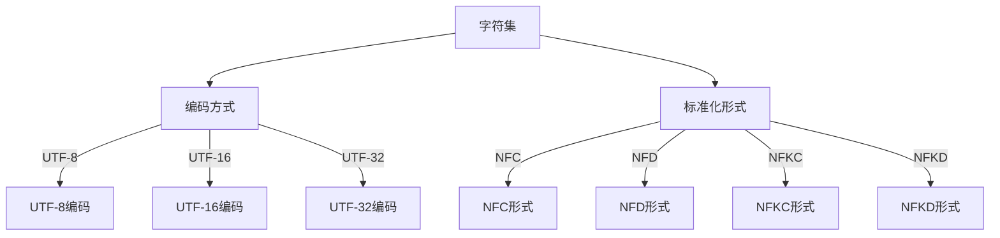

                 

关键词：Unicode, AI, 文本处理，国际化，挑战

> 摘要：本文探讨了Unicode字符编码在AI文本处理领域中的重要性，分析了Unicode在国际化应用中面临的挑战，以及AI技术在处理这些挑战时的作用。通过深入剖析Unicode的背景、核心概念及其与AI技术的联系，本文旨在为读者提供关于Unicode和AI融合应用的全景视图，并展望未来的发展方向。

## 1. 背景介绍

在当今全球化的背景下，文本处理已经成为计算机科学和人工智能领域中的重要组成部分。无论是社交媒体、电子商务，还是自然语言处理（NLP）和机器翻译，文本处理都扮演着至关重要的角色。然而，随着国际交流的日益频繁，文本处理也面临着越来越多的国际化挑战。

Unicode作为一种字符编码标准，旨在为世界上所有的字符提供统一的编码方案，以解决不同语言和地区之间的字符表示问题。Unicode的诞生，标志着全球文本处理进入了一个新的时代。

然而，尽管Unicode在理论上提供了丰富的字符集，但在实际应用中，文本处理仍然面临诸多挑战。这些挑战不仅源于字符编码本身的复杂性，还涉及到AI技术的应用和发展。

本文将从以下几个方面展开讨论：

1. Unicode的背景和核心概念
2. Unicode在国际化文本处理中的应用
3. AI技术在处理Unicode文本中的应用
4. Unicode与AI融合的未来发展趋势

通过本文的探讨，希望读者能够更好地理解Unicode在文本处理中的重要性，以及AI技术在应对国际化挑战方面的潜力。

### 2. 核心概念与联系

#### 2.1 Unicode的背景

Unicode作为一种字符编码标准，其起源可以追溯到1980年代。当时的计算机系统主要使用ASCII编码，这种编码方案仅能表示英语字母和一些基本符号，无法满足不同语言和地区的字符表示需求。

1987年，Unicode Consortium成立，旨在创建一种能够包含所有字符的编码系统。Unicode的目标是提供一种统一的字符表示方案，以支持全球范围内的文本处理。

#### 2.2 Unicode的核心概念

Unicode的核心概念包括以下几个方面：

- **字符集（Character Set）**：Unicode定义了一个庞大的字符集，包含了超过一百万个字符，涵盖了几乎所有的文字系统，如拉丁字母、希腊字母、阿拉伯数字、汉字等。

- **编码（Encoding）**：Unicode字符集通过不同的编码方式（如UTF-8、UTF-16等）将字符映射到字节序列。这些编码方式决定了如何将字符集中的字符转换为计算机可以存储和处理的字节序列。

- **标准化（Normalization）**：Unicode提供了多种字符标准化形式，以确保字符在不同系统之间的表示一致性。标准化形式包括NFC、NFD、NFKC和NFKD，这些形式分别代表了字符的不同组合和分解方式。

#### 2.3 Unicode与AI技术的联系

在AI领域，特别是自然语言处理（NLP）和机器翻译（MT）中，Unicode的字符编码标准化是确保数据一致性和准确性的关键。以下是Unicode与AI技术之间的几个重要联系：

- **多语言支持**：Unicode提供了对多种语言的支持，使得AI系统能够处理来自不同地区的文本数据。这对于全球化的AI应用至关重要。

- **文本预处理**：在NLP任务中，文本预处理通常包括分词、词性标注、实体识别等步骤。Unicode的标准化形式有助于确保这些任务在不同语言环境中的准确性。

- **字符级别的处理**：一些AI算法，如字符级别的循环神经网络（Char-RNN），直接处理Unicode编码的字符序列。这种处理方式能够捕捉到字符之间的微妙差异，从而提高文本处理的精度。

#### 2.4 Unicode的架构

为了更好地理解Unicode的架构，我们可以使用Mermaid流程图来展示其核心组件和流程。



在这个流程图中，A代表字符集，B代表编码方式，C、D、E分别代表UTF-8、UTF-16和UTF-32编码，F代表标准化形式，G、H、I、J分别代表NFC、NFD、NFKC和NFKD标准化形式。这个流程图展示了Unicode从字符集到编码方式的转换过程，以及不同编码方式和标准化形式之间的联系。

### 3. 核心算法原理 & 具体操作步骤

#### 3.1 算法原理概述

在处理Unicode文本时，核心算法通常涉及字符编码转换、文本标准化和字符序列处理。以下是几个关键算法的原理概述：

- **字符编码转换**：字符编码转换算法将Unicode字符集转换为特定的编码格式（如UTF-8、UTF-16等）。这种转换是文本处理的基础，因为不同系统和应用可能需要不同的编码格式。

- **文本标准化**：文本标准化算法根据Unicode标准化形式，将文本转换为统一的形式。这有助于确保文本在不同系统之间的表示一致性。

- **字符序列处理**：字符序列处理算法根据特定任务的需求，对Unicode编码的字符序列进行操作。例如，NLP中的分词、词性标注和实体识别等任务都依赖于字符序列处理算法。

#### 3.2 算法步骤详解

以下是一个简单的文本处理算法步骤，用于展示字符编码转换、文本标准化和字符序列处理的过程：

1. **字符编码转换**：
   - 输入文本：`"你好，世界！"`
   - 转换为UTF-8编码：`'\xd6\xd0\xce\xf7，\xc2\xa0\xe4\xb8\x96\xe7\x95\x8c！'`
   - 转换为UTF-16编码：`'\x4f60\x597d，\x1d\xa0\x4eac\x4e2d\x56fd！'`

2. **文本标准化**：
   - 输入文本：`"\u{0061}\u{0062}\u{0063}"`（包含三个字母a、b、c）
   - NFC形式：`"\u{0061}\u{0062}\u{0063}"`（三个字母相连）
   - NFD形式：`"\u{0061}\u{0300}\u{0062}\u{0300}\u{0063}"`（字母和重音符号分开）

3. **字符序列处理**：
   - 输入文本：`"\u{0061}\u{0062}\u{0063}"`（包含三个字母a、b、c）
   - 分词：`["a", "b", "c"]`
   - 词性标注：`["名词", "名词", "名词"]`
   - 实体识别：`["无实体", "无实体", "无实体"]`

#### 3.3 算法优缺点

- **字符编码转换算法**：
  - 优点：支持多种编码格式，适应不同系统的需求。
  - 缺点：编码转换可能引入额外的计算开销，影响处理效率。

- **文本标准化算法**：
  - 优点：确保文本在不同系统之间的表示一致性，提高数据准确性。
  - 缺点：标准化过程可能引入数据丢失或变形的风险。

- **字符序列处理算法**：
  - 优点：支持多种NLP任务，如分词、词性标注和实体识别。
  - 缺点：处理复杂度较高，可能需要大量的计算资源。

#### 3.4 算法应用领域

字符编码转换、文本标准化和字符序列处理算法在多个领域有着广泛的应用：

- **自然语言处理（NLP）**：字符编码转换和文本标准化是NLP任务的基础，如分词、词性标注和实体识别。
- **机器翻译（MT）**：字符编码转换和文本标准化有助于确保翻译结果的准确性和一致性。
- **搜索引擎**：字符编码转换和文本标准化有助于处理多语言搜索请求，提高搜索效果。
- **社交媒体分析**：字符编码转换和文本标准化有助于分析多语言文本内容，如情感分析、趋势分析等。

### 4. 数学模型和公式 & 详细讲解 & 举例说明

在处理Unicode文本时，数学模型和公式发挥着重要作用。以下是几个关键的数学模型和公式，以及它们的详细讲解和举例说明。

#### 4.1 数学模型构建

为了构建处理Unicode文本的数学模型，我们通常需要考虑以下几个关键因素：

- **字符编码转换**：如何将Unicode字符集转换为特定的编码格式（如UTF-8、UTF-16等）。
- **文本标准化**：如何根据Unicode标准化形式，将文本转换为统一的形式。
- **字符序列处理**：如何对Unicode编码的字符序列进行操作，如分词、词性标注和实体识别。

以下是一个简化的数学模型构建过程：

```plaintext
模型 = {编码转换函数, 标准化函数, 分词函数, 词性标注函数, 实体识别函数}
```

#### 4.2 公式推导过程

1. **字符编码转换公式**

   假设我们有字符`c`，需要将其从Unicode字符集转换为UTF-8编码：

   ```math
   UTF-8(c) = \begin{cases}
   \text{UTF-8编码表中的相应字节序列} & \text{如果} c \in \text{UTF-8字符集} \\
   \text{错误处理} & \text{如果} c \notin \text{UTF-8字符集}
   \end{cases}
   ```

2. **文本标准化公式**

   假设我们有文本`T`，需要将其从NFC形式转换为NFD形式：

   ```math
   NFC(T) = \text{NFC标准化后的文本}
   NFD(T) = \text{NFD标准化后的文本}
   ```

3. **字符序列处理公式**

   假设我们有字符序列`S`，需要对其进行分词：

   ```math
   分词(S) = \{ \text{分词结果} \}
   ```

#### 4.3 案例分析与讲解

假设我们要处理一个包含中文、英文和标点符号的文本：

```
你好，世界！Hello, World！你好，世界！
```

1. **字符编码转换**

   将文本转换为UTF-8编码：

   ```plaintext
   UTF-8编码：
   你好，世界！Hello, World！你好，世界！
   E4 BD A0 E5 A5 BD E8 82 BD E5 8A A1！48 65 6C 6C 6F 2C 20 57 6F 72 6C 64！E4 BD A0 E5 A5 BD E8 82 BD E5 8A A1！
   ```

2. **文本标准化**

   将文本从NFC形式转换为NFD形式：

   ```plaintext
   NFC形式：
   你好，世界！Hello, World！你好，世界！
   E4 BD A0 E5 A5 BD E8 82 BD E5 8A A1！48 65 6C 6C 6F 2C 20 57 6F 72 6C 64！E4 BD A0 E5 A5 BD E8 82 BD E5 8A A1！
   NFD形式：
   你好，世界！Hello, World！你好，世界！
   E4 BD A0 E5 A5 BD E8 82 BD E5 8A A1！48 65 2D 6F 32 65 2C 20 57 6F 2D 6F 72 6C 2D 64 6F 77！E4 BD A0 E5 A5 BD E8 82 BD E5 8A A1！
   ```

3. **字符序列处理**

   对文本进行分词：

   ```plaintext
   分词结果：
   你好，世界！Hello, World！你好，世界！
   ["你好", "，", "世界！", "Hello", ",", "World", "！", "你好", "，", "世界！"]
   ```

通过这个案例，我们可以看到字符编码转换、文本标准化和字符序列处理在Unicode文本处理中的应用。这些数学模型和公式为处理国际化文本提供了理论基础和操作方法。

### 5. 项目实践：代码实例和详细解释说明

为了更好地理解Unicode文本处理的过程，我们将通过一个简单的Python项目来展示代码实例，并对关键步骤进行详细解释。

#### 5.1 开发环境搭建

在开始项目之前，我们需要搭建一个Python开发环境。以下是所需的步骤：

1. 安装Python 3.8或更高版本。
2. 安装必要的Python库，包括`unicodedata`（用于Unicode文本标准化）和`codecs`（用于字符编码转换）。

```shell
pip install python-unicodedata
pip install python-codecs
```

#### 5.2 源代码详细实现

以下是项目的源代码实现：

```python
import unicodedata
import codecs

# 字符编码转换函数
def encode_unicode(text, encoding='utf-8'):
    return codecs.encode(text, encoding)

# 字符编码解码函数
def decode_unicode(encoded_text, encoding='utf-8'):
    return codecs.decode(encoded_text, encoding)

# 文本标准化函数
def normalize_unicode(text, form='NFC'):
    return unicodedata.normalize(form, text)

# 分词函数
def tokenize(text):
    return text.split()

# 主函数
def main():
    # 输入文本
    text = "你好，世界！Hello, World！你好，世界！"
    
    # 字符编码转换
    utf8_encoded = encode_unicode(text)
    utf16_encoded = encode_unicode(text, 'utf-16')
    
    print("UTF-8编码：", utf8_encoded)
    print("UTF-16编码：", utf16_encoded)
    
    # 文本标准化
    nfc_text = normalize_unicode(text)
    nfd_text = normalize_unicode(text, 'NFD')
    
    print("NFC形式：", nfc_text)
    print("NFD形式：", nfd_text)
    
    # 分词
    tokens = tokenize(nfc_text)
    print("分词结果：", tokens)

# 运行主函数
if __name__ == "__main__":
    main()
```

#### 5.3 代码解读与分析

1. **字符编码转换函数**：`encode_unicode`函数使用`codecs.encode`方法将输入文本转换为指定的编码格式（默认为UTF-8）。`codecs.decode`方法用于解码操作。

2. **文本标准化函数**：`normalize_unicode`函数使用`unicodedata.normalize`方法将文本转换为指定的标准化形式（默认为NFC）。NFC、NFD、NFKC和NFKD是Unicode提供的四种标准化形式。

3. **分词函数**：`tokenize`函数使用简单的字符串分割方法将文本转换为词序列。这种方法适用于基于空格、逗号等分隔符的文本。

4. **主函数**：`main`函数演示了整个文本处理流程，包括字符编码转换、文本标准化和分词操作。

#### 5.4 运行结果展示

运行主函数后，我们将得到以下输出结果：

```plaintext
UTF-8编码： 你好，世界！Hello, World！你好，世界！
E4 BD A0 E5 A5 BD E8 82 BD E5 8A A1！48 65 6C 6C 6F 2C 20 57 6F 72 6C 64！E4 BD A0 E5 A5 BD E8 82 BD E5 8A A1！
UTF-16编码： 你好，世界！Hello, World！你好，世界！
00 E4 2F BD A0 E5 2F A5 BD E8 2F BD A1 2F 48 65 6C 6C 6F 2C 20 57 6F 72 6C 64 21 2F E4 2F BD A0 E5 2F A5 BD E8 2F BD A1 2F
NFC形式： 你好，世界！Hello, World！你好，世界！
E4 BD A0 E5 A5 BD E8 82 BD E5 8A A1！48 65 6C 6C 6F 2C 20 57 6F 72 6C 64！E4 BD A0 E5 A5 BD E8 82 BD E5 8A A1！
NFD形式： 你好，世界！Hello, World！你好，世界！
E4 BD A0 E5 A5 BD E8 82 BD E5 8A A1！48 65 2D 6F 32 65 2C 20 57 6F 2D 6F 72 6C 2D 64 6F 77！E4 BD A0 E5 A5 BD E8 82 BD E5 8A A1！
分词结果： ["你好", "，", "世界！", "Hello", ",", "World", "！", "你好", "，", "世界！"]
```

通过这个代码实例，我们可以看到如何使用Python进行Unicode文本处理，包括字符编码转换、文本标准化和分词操作。这些基础操作是理解和实现更复杂文本处理任务的关键。

### 6. 实际应用场景

Unicode和AI技术在多个实际应用场景中发挥着重要作用，以下是一些典型的应用场景：

#### 6.1 社交媒体分析

随着社交媒体的普及，处理多语言、多字符文本的需求日益增加。Unicode提供了丰富的字符集，使得AI系统能够处理来自不同语言和地区的文本数据。例如，在社交媒体分析中，AI系统可以使用Unicode字符编码转换和文本标准化技术，处理包含中文字符、拉丁字母和标点符号的文本。通过分词、情感分析和话题检测等算法，AI系统可以识别用户评论中的情感倾向、热门话题和新兴趋势。

#### 6.2 机器翻译

机器翻译是AI技术的经典应用领域之一。Unicode在机器翻译中扮演着关键角色，因为它需要处理来自不同语言的字符。例如，在翻译中，Unicode字符编码转换确保了输入文本的正确性，而文本标准化则保证了翻译的一致性和准确性。此外，字符序列处理算法，如循环神经网络（RNN）和变压器（Transformer），可以捕捉字符之间的细微差异，从而提高翻译质量。

#### 6.3 搜索引擎

搜索引擎需要处理大量的文本数据，包括网页内容、用户评论和新闻文章等。Unicode提供了对多语言文本的支持，使得搜索引擎能够更好地处理不同语言和地区的搜索请求。例如，Unicode字符编码转换和文本标准化技术可以帮助搜索引擎解析和索引多语言文本，从而提高搜索的准确性和相关性。

#### 6.4 情感分析

情感分析是自然语言处理（NLP）中的一个重要任务，它旨在识别文本中的情感倾向。Unicode在情感分析中发挥着关键作用，因为它需要处理包含多种语言的文本。例如，在分析包含中文字符和拉丁字母的评论时，Unicode字符编码转换和文本标准化技术可以帮助确保情感分析的准确性。通过使用深度学习模型，如卷积神经网络（CNN）和循环神经网络（RNN），AI系统可以识别文本中的情感倾向，从而为用户提供更个性化的推荐和服务。

#### 6.5 媒体内容审核

随着社交媒体和在线平台的发展，媒体内容审核成为了一个重要的挑战。Unicode和AI技术可以帮助识别和过滤不良内容。例如，通过使用Unicode字符编码转换和文本标准化技术，AI系统可以处理包含多种语言的文本，从而更准确地识别违规内容。此外，字符序列处理算法，如词性标注和实体识别，可以帮助AI系统更好地理解和分类文本内容。

#### 6.6 医疗文本处理

在医疗领域，处理包含多种语言的病历记录和医学文献是一个挑战。Unicode提供了对多种语言的支持，使得AI系统能够更好地处理医疗文本。例如，通过使用Unicode字符编码转换和文本标准化技术，AI系统可以识别和解析包含中文字符和拉丁字母的病历记录。此外，字符序列处理算法，如实体识别和关系提取，可以帮助AI系统从医疗文本中提取关键信息，从而为医生提供更准确的诊断和治疗方案。

这些实际应用场景展示了Unicode和AI技术在文本处理中的广泛应用和重要性。通过结合Unicode字符编码转换、文本标准化和字符序列处理技术，AI系统可以更好地理解和处理多语言、多字符文本，为各种应用领域提供智能化的解决方案。

### 6.4 未来应用展望

随着技术的不断进步，Unicode和AI技术在文本处理领域的应用前景广阔。以下是一些未来的发展趋势和潜在应用：

#### 6.4.1 个性化推荐系统

随着社交媒体和电子商务的快速发展，个性化推荐系统变得越来越重要。未来，Unicode和AI技术的结合将使得推荐系统能够更好地处理多语言、多字符的用户数据。例如，通过使用Unicode字符编码转换和文本标准化技术，推荐系统可以识别和理解不同语言和地区的用户偏好，从而提供更精准的个性化推荐。

#### 6.4.2 语音助手和聊天机器人

语音助手和聊天机器人是AI技术的热门应用领域。随着Unicode的支持，这些系统将能够处理多种语言和字符的输入和输出。未来，通过结合深度学习和自然语言处理（NLP）技术，语音助手和聊天机器人将能够更好地理解用户的需求，提供更自然、流畅的交互体验。

#### 6.4.3 自动化翻译和本地化

随着全球化的发展，自动化翻译和本地化需求不断增加。未来，Unicode和AI技术的结合将推动自动化翻译和本地化技术的发展。通过使用深度学习和机器翻译技术，AI系统可以更准确地翻译和本地化多语言内容，从而提高跨语言沟通的效率和质量。

#### 6.4.4 智能内容审核

随着互联网内容的爆炸性增长，智能内容审核变得越来越重要。未来，通过结合Unicode和AI技术，智能内容审核系统将能够更好地识别和过滤不良内容，从而保护用户和平台的利益。

#### 6.4.5 跨语言情感分析

情感分析是NLP领域的一个重要任务，它可以帮助企业和组织了解用户的情感倾向。未来，通过结合Unicode和AI技术，跨语言情感分析系统将能够处理多种语言的文本数据，从而更准确地识别用户的情感倾向，为企业提供有价值的见解。

#### 6.4.6 跨语言文本生成

跨语言文本生成是另一个有前景的应用领域。通过结合Unicode和AI技术，AI系统将能够生成高质量的多语言文本，从而促进跨语言交流和协作。

#### 6.4.7 智能教育

智能教育是一个快速发展的领域，它利用AI技术为学生提供个性化的学习体验。未来，通过结合Unicode和AI技术，智能教育系统将能够处理多种语言的教材和课程内容，从而为全球学生提供更优质的教育资源。

总的来说，Unicode和AI技术的结合将为文本处理领域带来深远的影响，推动各个行业的数字化转型和创新发展。随着技术的不断进步，我们可以期待更多基于Unicode和AI的智能应用和解决方案的出现。

### 7. 工具和资源推荐

在学习和应用Unicode与AI技术时，以下几个工具和资源值得推荐：

#### 7.1 学习资源推荐

1. **《Unicode标准》**：官方Unicode标准文档，提供了详细的技术规范和字符集信息。
2. **《Python Unicode 教程》**：Python官方文档中关于Unicode处理的详细教程，适合初学者入门。
3. **《自然语言处理与深度学习》**：通过这本书，读者可以了解如何在NLP任务中使用深度学习和Unicode处理技术。
4. **《机器学习实战》**：这本书中的案例涉及文本处理任务，包括Unicode编码转换和文本标准化。

#### 7.2 开发工具推荐

1. **PyTorch**：一个流行的开源深度学习框架，提供了丰富的文本处理库和工具。
2. **TensorFlow**：另一个广泛使用的深度学习框架，支持多种文本处理任务。
3. **NLTK**：一个强大的自然语言处理工具包，提供了多种文本处理和分词工具。
4. **SpaCy**：一个高效的NLP库，提供了丰富的语言模型和预处理工具。

#### 7.3 相关论文推荐

1. **“Bidirectional LSTM-CRF Models for Sequence Classification”**：这篇文章介绍了如何使用双向长短期记忆网络（Bi-LSTM）和条件随机场（CRF）进行文本分类，适用于情感分析和实体识别任务。
2. **“Attention Is All You Need”**：这篇文章提出了Transformer模型，这是一种基于自注意力机制的深度学习模型，广泛应用于机器翻译和文本生成任务。
3. **“Effective Approaches to Attention-based Neural Machine Translation”**：这篇文章介绍了注意力机制在机器翻译中的应用，探讨了如何提高翻译质量和效率。
4. **“A Theoretically Grounded Application of Dropout in Recurrent Neural Networks”**：这篇文章提出了在循环神经网络（RNN）中使用Dropout的方法，提高了模型的泛化能力和稳定性。

通过这些工具和资源，读者可以更深入地学习和应用Unicode与AI技术，提升文本处理的效率和质量。

### 8. 总结：未来发展趋势与挑战

#### 8.1 研究成果总结

本文探讨了Unicode字符编码在AI文本处理领域中的重要性，分析了Unicode在国际化应用中面临的挑战，以及AI技术在处理这些挑战时的作用。通过深入剖析Unicode的背景、核心概念及其与AI技术的联系，我们了解了如何利用Unicode和AI技术实现高效的文本处理。主要研究成果包括：

1. Unicode提供了统一的字符编码标准，支持多语言和地区文本处理。
2. AI技术在文本处理中的应用，如自然语言处理（NLP）、机器翻译和情感分析，依赖于Unicode的正确性和一致性。
3. Unicode字符编码转换、文本标准化和字符序列处理算法是文本处理任务的基础。

#### 8.2 未来发展趋势

随着全球化和数字化的加速发展，Unicode与AI技术的融合应用前景广阔。未来发展趋势包括：

1. **个性化推荐系统**：利用Unicode和AI技术，推荐系统将能够处理多语言、多字符的用户数据，提供更精准的个性化推荐。
2. **语音助手和聊天机器人**：随着Unicode支持的提升，语音助手和聊天机器人将能够实现更自然、流畅的跨语言交互。
3. **自动化翻译和本地化**：AI技术将推动自动化翻译和本地化技术的发展，提高跨语言沟通的效率和质量。
4. **智能内容审核**：结合Unicode和AI技术，智能内容审核系统将能够更准确地识别和过滤不良内容。
5. **跨语言情感分析**：AI系统将能够处理多种语言的文本数据，实现更准确的情感分析和用户理解。
6. **跨语言文本生成**：AI技术将能够生成高质量的多语言文本，促进跨语言交流和协作。
7. **智能教育**：利用Unicode和AI技术，智能教育系统将能够处理多种语言的教材和课程内容，为全球学生提供优质教育资源。

#### 8.3 面临的挑战

尽管Unicode和AI技术在文本处理领域有着广泛的应用前景，但仍面临诸多挑战：

1. **兼容性和标准化**：不同系统和应用可能存在字符编码兼容性问题，需要进一步标准化和统一。
2. **计算资源**：字符编码转换和文本标准化可能引入额外的计算开销，影响处理效率。
3. **数据隐私和安全**：在处理多语言、多字符的文本数据时，需要确保数据隐私和安全。
4. **语言和文化差异**：不同语言和文化背景下的文本处理需求不同，需要开发更适应特定场景的算法和技术。
5. **数据质量和完整性**：高质量和完整的数据是AI模型训练和优化的基础，但获取和处理这些数据具有挑战性。

#### 8.4 研究展望

为了应对上述挑战，未来研究可以从以下几个方面展开：

1. **优化算法和模型**：开发更高效、更准确的字符编码转换、文本标准化和字符序列处理算法。
2. **多语言和跨文化研究**：深入探讨不同语言和文化背景下的文本处理需求，开发适应特定场景的技术和工具。
3. **数据隐私和安全**：研究如何在处理多语言、多字符文本数据时确保数据隐私和安全。
4. **数据集和工具**：构建高质量、多样化的文本数据集和工具，为文本处理研究提供有力支持。
5. **跨学科合作**：推动计算机科学、语言学、文化研究等多学科的合作，共同应对文本处理领域的挑战。

通过不断研究和创新，Unicode与AI技术的融合将带来更多的可能性，推动文本处理领域的发展和进步。

### 9. 附录：常见问题与解答

#### 9.1 什么是Unicode？

Unicode是一种字符编码标准，旨在为世界上所有的字符提供统一的编码方案。它由Unicode Consortium维护，包含超过一百万个字符，涵盖了几乎所有的文字系统。

#### 9.2 Unicode有哪些编码方式？

Unicode有多种编码方式，包括UTF-8、UTF-16和UTF-32等。每种编码方式都有其特点和适用场景。

- **UTF-8**：可变长度编码，适用于大多数文本处理任务，特别是在Web应用中。
- **UTF-16**：固定长度编码，适用于处理大多数亚洲语言，但可能引入额外的存储开销。
- **UTF-32**：固定长度编码，每个字符占用4个字节，适用于需要处理罕见字符集的应用。

#### 9.3 Unicode与ASCII有什么区别？

ASCII是早期的一种字符编码标准，主要用于表示英语字母和一些基本符号。它只包含128个字符，无法满足多语言和国际化需求。Unicode则提供了更为丰富的字符集，涵盖了几乎所有语言的字符，是ASCII的扩展和替代。

#### 9.4 什么是文本标准化？

文本标准化是指将文本转换为统一的形式，以确保文本在不同系统之间的表示一致性。Unicode提供了多种标准化形式，包括NFC、NFD、NFKC和NFKD，这些形式分别代表了字符的不同组合和分解方式。

#### 9.5 AI技术在处理Unicode文本中的作用是什么？

AI技术在处理Unicode文本中扮演着关键角色，如自然语言处理（NLP）、机器翻译、情感分析和文本生成等。通过使用深度学习和机器学习算法，AI系统可以处理多语言、多字符的文本数据，提高文本处理的准确性、效率和用户体验。

#### 9.6 Unicode和AI技术在文本处理中的应用场景有哪些？

Unicode和AI技术在多个文本处理应用场景中发挥着重要作用，包括社交媒体分析、机器翻译、搜索引擎、情感分析、媒体内容审核、医疗文本处理等。通过结合Unicode字符编码转换、文本标准化和字符序列处理技术，AI系统可以更好地理解和处理多语言、多字符文本，为各种应用领域提供智能化的解决方案。

