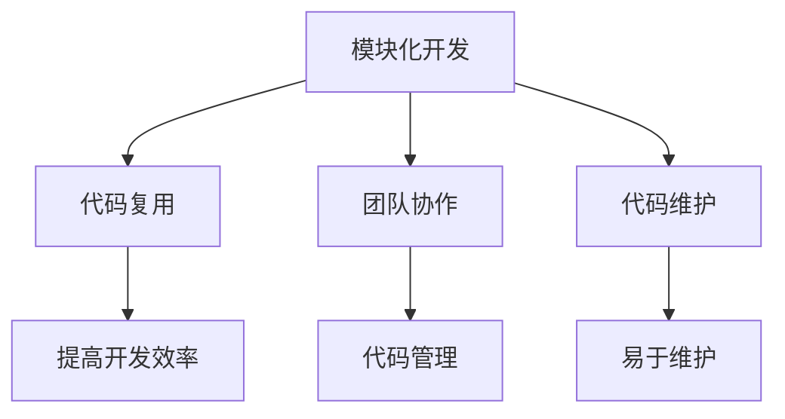
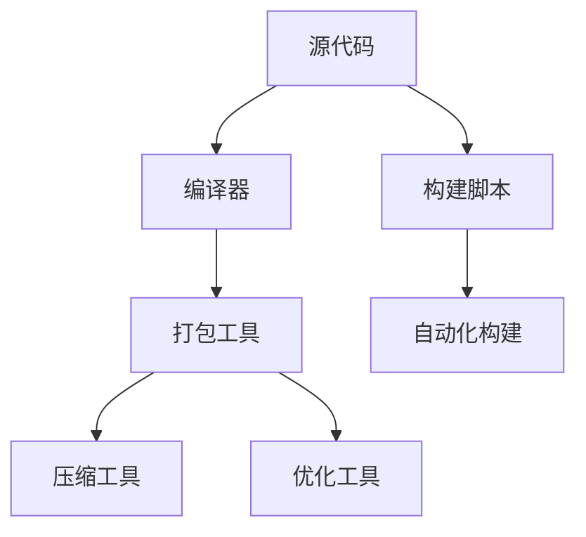
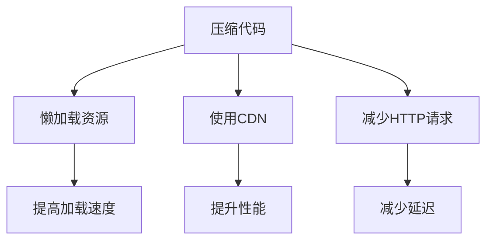

                 

在快速发展的互联网时代，Web前端开发已经成为了构建现代应用的关键技术之一。然而，随着项目的复杂度和规模的增长，如何高效地进行Web前端工程化变得至关重要。本文将探讨Web前端工程化的最佳实践，帮助开发者构建更高效、可维护和可扩展的Web应用。

## 关键词

- Web前端工程化
- 模块化
- 自动化构建
- 性能优化
- 构建工具

## 摘要

本文旨在为Web前端开发者提供一套系统的工程化实践指南，包括模块化开发、自动化构建工具的选用、代码性能优化策略等。通过这些实践，开发者可以提升开发效率，确保代码质量和项目的可持续性。

### 1. 背景介绍

Web前端工程化的概念起源于软件工程的领域，其核心目标是通过系统化和规范化的方法来提升软件开发的效率和质量。在Web前端领域，随着JavaScript框架和库（如React、Vue、Angular）的流行，工程化需求愈发强烈。开发者面临的主要挑战包括：

- **模块化与代码复用**：随着应用规模的扩大，模块化成为解决代码重复和复用的有效手段。
- **自动化构建**：现代Web应用的构建过程复杂，需要自动化工具来简化流程。
- **性能优化**：前端性能对用户体验至关重要，开发者需要采取多种策略来优化加载速度和响应时间。
- **团队协作**：在大规模开发中，团队协作和代码管理变得尤为重要。

### 2. 核心概念与联系

#### 2.1 模块化开发

模块化开发是将代码按照功能或者组件拆分成多个模块的过程。这不仅有助于代码的复用和维护，还能提高团队协作的效率。



#### 2.2 自动化构建

自动化构建工具（如Webpack、Gulp）通过配置文件来自动化项目的构建过程，包括代码打包、压缩、优化等。



#### 2.3 性能优化

性能优化是提升用户体验的关键。常见的优化策略包括压缩代码、懒加载资源、使用CDN、减少HTTP请求等。



### 3. 核心算法原理 & 具体操作步骤

#### 3.1 算法原理概述

Web前端工程化的核心算法主要包括模块打包、代码分割、资源压缩和优化等。这些算法的实现依赖于构建工具和相应的插件。

#### 3.2 算法步骤详解

1. **配置构建工具**：根据项目需求选择合适的构建工具，并配置相关的插件和loader。
2. **编写模块化代码**：将代码按照功能或组件拆分成多个模块。
3. **自动化构建**：运行构建工具，生成打包后的代码和资源文件。
4. **代码压缩**：使用压缩工具（如UglifyJS、Terser）对代码进行压缩。
5. **性能优化**：使用懒加载、CDN、资源压缩等技术来优化加载速度和响应时间。

#### 3.3 算法优缺点

**优点**：

- 提高开发效率：模块化开发、自动化构建和性能优化可以显著提升开发速度。
- 易于维护：代码拆分成模块后，易于维护和更新。
- 提高性能：通过压缩代码和优化资源，可以提高应用的加载速度和响应时间。

**缺点**：

- 配置复杂：构建工具的配置相对复杂，需要一定的学习和调试。
- 性能瓶颈：在某些情况下，构建过程可能会成为性能瓶颈。

#### 3.4 算法应用领域

Web前端工程化的算法主要应用于Web应用的开发，特别是在需要高效开发和优化的场景，如电商、社交、媒体等领域。

### 4. 数学模型和公式 & 详细讲解 & 举例说明

#### 4.1 数学模型构建

在Web前端工程化中，常用的数学模型包括：

- **模块化开发模型**：模块之间的依赖关系可以用图来表示。
- **代码压缩模型**：通过算法优化代码结构，减少代码体积。

#### 4.2 公式推导过程

假设一个模块化开发中的模块关系可以用图$G(V,E)$表示，其中$V$为节点集合，表示各个模块；$E$为边集合，表示模块之间的依赖关系。

#### 4.3 案例分析与讲解

以一个简单的React应用为例，分析模块化开发和代码压缩的过程。

```javascript
// 模块1
export function module1() {
  // ...
}

// 模块2
export function module2() {
  // ...
}

// 模块3
export function module3() {
  // ...
}
```

通过Webpack配置，可以将这些模块打包成一个文件，同时使用UglifyJS进行代码压缩。

```javascript
const path = require('path');
const { resolve } = require('path');
const HtmlWebpackPlugin = require('html-webpack-plugin');

module.exports = {
  mode: 'production',
  entry: resolve(__dirname, 'src/index.js'),
  output: {
    filename: 'bundle.js',
    path: path.resolve(__dirname, 'dist'),
  },
  optimization: {
    minimize: true,
  },
  plugins: [
    new HtmlWebpackPlugin({
      template: './src/index.html',
    }),
  ],
};
```

### 5. 项目实践：代码实例和详细解释说明

#### 5.1 开发环境搭建

在本地搭建开发环境，安装Node.js和Webpack。

```bash
npm install webpack webpack-cli html-webpack-plugin --save-dev
```

#### 5.2 源代码详细实现

创建一个简单的React应用，包括三个模块。

```javascript
// src/index.js
import React from 'react';
import ReactDOM from 'react-dom';
import './index.css';

function App() {
  return (
    <div>
      <h1>Hello, Web前端工程化！</h1>
      <p>欢迎使用React。</p>
    </div>
  );
}

ReactDOM.render(<App />, document.getElementById('root'));
```

```css
/* src/index.css */
body {
  font-family: 'Arial', sans-serif;
}

h1 {
  color: #333;
}

p {
  color: #666;
}
```

#### 5.3 代码解读与分析

通过Webpack配置，将React组件和CSS文件打包成一个文件。

```javascript
// webpack.config.js
const path = require('path');
const HtmlWebpackPlugin = require('html-webpack-plugin');

module.exports = {
  mode: 'production',
  entry: './src/index.js',
  output: {
    filename: 'bundle.js',
    path: path.resolve(__dirname, 'dist'),
  },
  plugins: [
    new HtmlWebpackPlugin({
      template: './src/index.html',
    }),
  ],
};
```

#### 5.4 运行结果展示

运行Webpack构建命令后，生成的`dist`文件夹中的`index.html`文件。

```html
<!DOCTYPE html>
<html lang="en">
  <head>
    <meta charset="UTF-8" />
    <meta name="viewport" content="width=device-width, initial-scale=1.0" />
    <title>Web前端工程化实践</title>
  </head>
  <body>
    <div id="root"></div>
    <script src="bundle.js"></script>
  </body>
</html>
```

### 6. 实际应用场景

Web前端工程化在多种实际应用场景中发挥了重要作用，如电商平台的搭建、社交媒体的优化、移动应用的扩展等。以下是一些应用实例：

- **电商平台**：通过模块化和自动化构建，可以快速迭代和更新产品页面，提升用户购物体验。
- **社交媒体**：利用工程化实践，优化页面性能，提高用户浏览速度和互动体验。
- **移动应用**：通过工程化，实现多平台兼容和快速开发，提升应用质量和用户体验。

### 7. 未来应用展望

未来，Web前端工程化将在以下几个方面得到进一步发展：

- **新技术的应用**：随着前端技术的发展，如WebAssembly、服务端渲染等，工程化实践将更加丰富和多样。
- **智能化与自动化**：构建工具和流程将进一步智能化和自动化，减少人为干预，提高开发效率。
- **跨平台开发**：工程化实践将扩展到更多平台，如移动端、桌面端等，实现一站式开发。

### 8. 工具和资源推荐

为了更好地实践Web前端工程化，以下是一些推荐的工具和资源：

- **学习资源**：《现代前端工程化》、《Webpack实战》等书籍。
- **开发工具**：Webpack、Gulp、Babel等。
- **相关论文**：前端工程化相关的论文和研究报告。

### 9. 总结：未来发展趋势与挑战

未来，Web前端工程化将朝着更加智能化、自动化和跨平台的方向发展。然而，这同时也带来了新的挑战，如构建性能优化、安全性和兼容性等。开发者需要不断学习和实践，以应对这些挑战。

### 10. 附录：常见问题与解答

- **Q：什么是Webpack？**
  **A：Webpack是一个模块打包工具，用于将多个模块打包成一个或多个文件，便于部署和优化。**

- **Q：如何优化Webpack构建速度？**
  **A：可以通过优化配置、使用缓存、减少不必要的插件等方式来提高Webpack的构建速度。**

- **Q：什么是模块化开发？**
  **A：模块化开发是将代码按照功能或组件拆分成多个模块，便于管理和复用。**

- **Q：如何进行代码压缩？**
  **A：可以使用如UglifyJS、Terser等工具对代码进行压缩，减少文件体积。**

---

作者：禅与计算机程序设计艺术 / Zen and the Art of Computer Programming
----------------------------------------------------------------

以上是完整的文章正文部分，接下来将根据文章结构模板的要求，撰写文章的摘要、关键词和目录部分。
----------------------------------------------------------------
# Web前端工程化最佳实践

## 摘要

本文探讨了Web前端工程化的最佳实践，包括模块化开发、自动化构建工具的使用、代码性能优化策略等。通过这些实践，开发者可以提升开发效率，确保代码质量和项目的可持续性。本文还介绍了相关工具和资源，以帮助读者更好地理解和应用这些实践。

## 关键词

- Web前端工程化
- 模块化
- 自动化构建
- 性能优化
- 构建工具

## 目录

1. **背景介绍**
   - Web前端工程化的意义
   - 开发者面临的主要挑战

2. **核心概念与联系**
   - 模块化开发
   - 自动化构建
   - 性能优化

3. **核心算法原理 & 具体操作步骤**
   - 算法原理概述
   - 算法步骤详解
   - 算法优缺点
   - 算法应用领域

4. **数学模型和公式 & 详细讲解 & 举例说明**
   - 数学模型构建
   - 公式推导过程
   - 案例分析与讲解

5. **项目实践：代码实例和详细解释说明**
   - 开发环境搭建
   - 源代码详细实现
   - 代码解读与分析
   - 运行结果展示

6. **实际应用场景**
   - 电商平台的搭建
   - 社交媒体的优化
   - 移动应用的扩展

7. **未来应用展望**
   - 新技术的应用
   - 智能化与自动化
   - 跨平台开发

8. **工具和资源推荐**
   - 学习资源推荐
   - 开发工具推荐
   - 相关论文推荐

9. **总结：未来发展趋势与挑战**
   - 研究成果总结
   - 未来发展趋势
   - 面临的挑战
   - 研究展望

10. **附录：常见问题与解答**

---

以上是文章的摘要、关键词和目录部分，接下来将根据目录结构撰写文章的具体内容。

