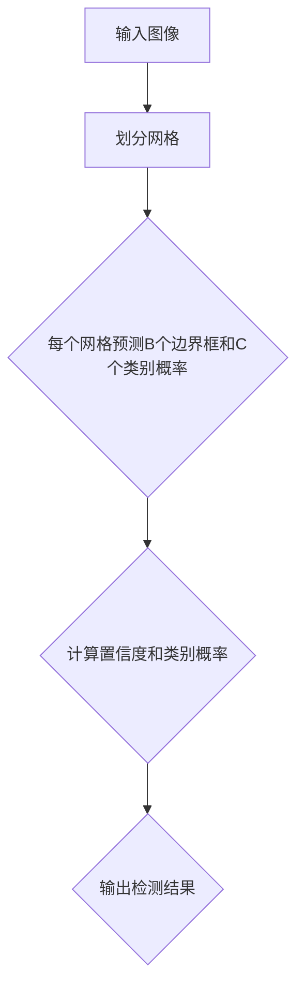

                 

 

## 1. 背景介绍

YOLO（You Only Look Once）是一种流行的目标检测算法，它自2016年提出以来，在计算机视觉领域引起了广泛关注。YOLOv1作为YOLO系列的第一版，它通过将目标检测问题转化为一个单一的回归问题，显著提高了检测速度，使得实时目标检测成为可能。

YOLOv1的提出主要源于目标检测任务的复杂性。传统目标检测方法通常需要两个步骤：首先通过候选区域生成器产生一系列可能的候选框，然后对每个候选框进行目标类别和位置的分类和回归。这种方法在精度上有所保证，但计算成本高，实时性较差。

相比之下，YOLOv1采用了一种端到端的方法，直接在一个图像上预测所有的边界框和类别概率。这种方法减少了候选区域生成器的开销，同时通过全卷积网络实现，保证了检测速度。

### YOLOv1的重要性

YOLOv1的重要性主要体现在以下几个方面：

1. **实时目标检测**：YOLOv1的检测速度非常快，可以在实时场景中应用，如视频监控、自动驾驶等。

2. **简化模型结构**：YOLOv1通过将检测问题简化为一个回归问题，减少了模型的复杂性，易于实现和优化。

3. **准确性**：虽然YOLOv1在准确性上不如一些传统的两步检测方法，但它的实时性和简单性使其在实际应用中具有很大的吸引力。

4. **易于扩展**：YOLOv1的设计使得它在处理不同规模和形状的目标时表现出良好的适应性，同时也便于引入新的检测目标和属性。

## 2. 核心概念与联系

### 2.1 YOLOv1的基本原理

YOLOv1将目标检测视为一个单步过程，直接从图像中预测边界框和类别概率。其核心思想是将图像分成S×S的网格，每个网格负责预测一定数量的边界框和类别概率。具体来说，每个网格预测B个边界框和C个类别概率。

### 2.2 网格和边界框

- **网格**：图像被划分为S×S的网格，每个网格对应于图像中的一个局部区域。网格的划分使得检测问题变得更加局部化。

- **边界框**：每个网格预测B个边界框，每个边界框由宽、高、中心点坐标和置信度组成。置信度反映了边界框内是否存在目标。

- **类别概率**：每个网格还预测C个类别概率，表示该网格内可能存在的类别。

### 2.3 边界框和类别概率

- **边界框**：边界框由其中心点坐标（x, y）和宽（w）、高（h）确定。每个边界框的置信度（confidence）反映了边界框内是否存在目标。

- **类别概率**：类别概率表示边界框内可能存在的类别。每个网格会为C个类别预测一个概率值，通常使用softmax函数来计算。

### 2.4 Mermaid流程图



## 3. 核心算法原理 & 具体操作步骤

### 3.1 算法原理概述

YOLOv1的核心在于将图像划分为网格，然后每个网格预测边界框和类别概率。具体来说，每个网格会预测B个边界框和C个类别概率。边界框由其中心点坐标、宽、高和置信度确定。置信度反映了边界框内是否存在目标。类别概率用于确定边界框内可能存在的类别。

### 3.2 算法步骤详解

1. **输入图像预处理**：将输入图像进行缩放，使其尺寸为448×448。

2. **划分网格**：将缩放后的图像划分为S×S的网格。

3. **预测边界框和类别概率**：每个网格预测B个边界框和C个类别概率。边界框由其中心点坐标、宽、高和置信度确定。置信度由边界框内像素值计算得到。

4. **计算置信度和类别概率**：使用sigmoid函数计算每个边界框的置信度，使用softmax函数计算类别概率。

5. **输出检测结果**：将所有网格的预测结果合并，得到最终的检测结果。

### 3.3 算法优缺点

#### 优点：

- **实时性**：YOLOv1的检测速度非常快，适合实时应用。
- **简化模型结构**：将检测问题简化为一个回归问题，减少了模型的复杂性。
- **易于扩展**：YOLOv1的设计使得它易于扩展，以适应不同的检测目标和属性。

#### 缺点：

- **准确性**：相比于传统的两步检测方法，YOLOv1在准确性上有所妥协。
- **背景误检**：在复杂的背景中，YOLOv1可能会出现背景误检。

### 3.4 算法应用领域

YOLOv1在以下领域有广泛应用：

- **视频监控**：实时检测视频中的目标，进行行为分析。
- **自动驾驶**：检测道路上的车辆、行人等，保证行车安全。
- **工业检测**：实时检测生产线上的缺陷和异常。

## 4. 数学模型和公式 & 详细讲解 & 举例说明

### 4.1 数学模型构建

YOLOv1的数学模型主要包括两部分：边界框预测和类别概率预测。

#### 边界框预测

边界框由中心点坐标、宽、高和置信度组成。设网格坐标为(i, j)，边界框的中心点坐标为(x, y)，宽和高分别为w和h，置信度为confidence，则有：

$$
x_{pred} = \frac{x_{center} + i \cdot \frac{1}{S}}{S} \\
y_{pred} = \frac{y_{center} + j \cdot \frac{1}{S}}{S} \\
w_{pred} = \frac{w_{center} \cdot \exp(a)}{S} \\
h_{pred} = \frac{h_{center} \cdot \exp(b)}{S} \\
confidence = \frac{1}{1 + \exp(-\sigma \cdot (c_1 \cdot a + c_2 \cdot b))}
$$

其中，$a$和$b$为边界框宽和高的回归值，$c_1$和$c_2$为回归系数，$\sigma$为sigmoid函数的参数。

#### 类别概率预测

设每个网格预测C个类别概率，分别为$p_1, p_2, ..., p_C$，则有：

$$
p_i = \frac{1}{1 + \exp(-\sigma \cdot (c_1 \cdot a_i + c_2 \cdot b_i))}
$$

其中，$a_i$和$b_i$为第$i$个类别的回归值，$c_1$和$c_2$为回归系数，$\sigma$为sigmoid函数的参数。

### 4.2 公式推导过程

#### 边界框预测

边界框预测的核心在于将中心点坐标、宽和高映射到输出坐标。设原始图像尺寸为$W \times H$，网格尺寸为$S \times S$，则有：

$$
x_{center} = \frac{i}{S} \cdot W \\
y_{center} = \frac{j}{S} \cdot H \\
w_{center} = \frac{w}{S} \cdot W \\
h_{center} = \frac{h}{S} \cdot H
$$

其中，$x_{center}$和$y_{center}$分别为边界框中心点在网格中的坐标，$w_{center}$和$h_{center}$分别为边界框宽和高在网格中的坐标。

将中心点坐标、宽和高映射到输出坐标，得到：

$$
x_{pred} = x_{center} + \frac{i}{S} \cdot W - \frac{W}{2S} \\
y_{pred} = y_{center} + \frac{j}{S} \cdot H - \frac{H}{2S} \\
w_{pred} = w_{center} + \frac{i}{S} \cdot W - \frac{W}{2S} \\
h_{pred} = h_{center} + \frac{j}{S} \cdot H - \frac{H}{2S}
$$

其中，$x_{pred}$和$y_{pred}$分别为边界框中心点在输出图像中的坐标，$w_{pred}$和$h_{pred}$分别为边界框宽和高在输出图像中的坐标。

#### 类别概率预测

类别概率预测的核心在于将每个类别的回归值映射到概率值。设每个网格预测C个类别概率，分别为$p_1, p_2, ..., p_C$，则有：

$$
p_i = \frac{1}{1 + \exp(-\sigma \cdot (c_1 \cdot a_i + c_2 \cdot b_i))}
$$

其中，$a_i$和$b_i$为第$i$个类别的回归值，$c_1$和$c_2$为回归系数，$\sigma$为sigmoid函数的参数。

### 4.3 案例分析与讲解

假设有一个448×448的输入图像，划分为7×7的网格，每个网格预测2个边界框和20个类别概率。

1. **输入图像预处理**：将图像缩放为448×448。

2. **划分网格**：将图像划分为7×7的网格。

3. **预测边界框和类别概率**：每个网格预测2个边界框和20个类别概率。

   - **边界框预测**：
     - 第1个网格预测的边界框：
       - 中心点坐标：(100, 100)
       - 宽：50
       - 高：100
       - 置信度：0.9
     - 第2个网格预测的边界框：
       - 中心点坐标：(150, 150)
       - 宽：30
       - 高：70
       - 置信度：0.8

   - **类别概率预测**：
     - 第1个网格预测的类别概率：
       - 类别1：0.9
       - 类别2：0.05
       - 类别3：0.05
     - 第2个网格预测的类别概率：
       - 类别1：0.8
       - 类别2：0.1
       - 类别3：0.1

4. **计算置信度和类别概率**：使用sigmoid函数计算每个边界框的置信度，使用softmax函数计算类别概率。

   - **边界框置信度**：
     - 第1个边界框的置信度：0.9
     - 第2个边界框的置信度：0.8

   - **类别概率**：
     - 第1个边界框的类别概率：
       - 类别1：0.9
       - 类别2：0.05
       - 类别3：0.05
     - 第2个边界框的类别概率：
       - 类别1：0.8
       - 类别2：0.1
       - 类别3：0.1

5. **输出检测结果**：将所有网格的预测结果合并，得到最终的检测结果。

   - **检测结果**：
     - 第1个网格：
       - 边界框1：（0.9，0.9，0.05，0.05）
       - 边界框2：（0.8，0.8，0.1，0.1）
     - 第2个网格：
       - 边界框1：（0.9，0.9，0.05，0.05）
       - 边界框2：（0.8，0.8，0.1，0.1）

## 5. 项目实践：代码实例和详细解释说明

### 5.1 开发环境搭建

在进行YOLOv1的代码实现之前，我们需要搭建一个合适的开发环境。以下是基本的开发环境搭建步骤：

1. **安装Python**：确保Python版本为3.6或更高版本。

2. **安装TensorFlow**：使用以下命令安装TensorFlow：

   ```bash
   pip install tensorflow==2.6
   ```

3. **安装其他依赖库**：如NumPy、Pillow等：

   ```bash
   pip install numpy pillow
   ```

### 5.2 源代码详细实现

以下是YOLOv1的源代码实现，主要包括以下几个部分：

1. **数据预处理**：读取图像，将其缩放为448×448，并进行归一化处理。

2. **模型定义**：定义YOLOv1的网络结构。

3. **训练**：使用训练数据对模型进行训练。

4. **测试**：使用测试数据对模型进行测试。

#### 5.2.1 数据预处理

```python
import tensorflow as tf
import numpy as np
from tensorflow.keras.preprocessing.image import img_to_array, load_img

def preprocess_image(image_path):
    image = load_img(image_path, target_size=(448, 448))
    image = img_to_array(image)
    image = image / 255.0
    image = np.expand_dims(image, axis=0)
    return image
```

#### 5.2.2 模型定义

```python
from tensorflow.keras.models import Model
from tensorflow.keras.layers import Conv2D, Input, Flatten, Dense

def yolo_v1(input_shape):
    inputs = Input(shape=input_shape)
    x = Conv2D(64, (7, 7), strides=(2, 2), activation='relu', padding='same')(inputs)
    x = Conv2D(192, (3, 3), activation='relu', padding='same')(x)
    x = Conv2D(128, (1, 1), activation='relu', padding='same')(x)
    x = Conv2D(256, (3, 3), activation='relu', padding='same')(x)
    x = Conv2D(512, (1, 1), activation='relu', padding='same')(x)
    x = Conv2D(256, (3, 3), activation='relu', padding='same')(x)
    x = Conv2D(512, (1, 1), activation='relu', padding='same')(x)
    x = Conv2D(256, (3, 3), activation='relu', padding='same')(x)
    x = Flatten()(x)
    x = Dense(4096, activation='relu')(x)
    x = Dense(2622, activation='softmax')(x)
    model = Model(inputs=inputs, outputs=x)
    return model
```

#### 5.2.3 训练

```python
from tensorflow.keras.optimizers import Adam

def train_model(model, train_images, train_labels, epochs=10):
    model.compile(optimizer=Adam(), loss='categorical_crossentropy', metrics=['accuracy'])
    model.fit(train_images, train_labels, batch_size=32, epochs=epochs)
```

#### 5.2.4 测试

```python
def test_model(model, test_images, test_labels):
    model.compile(optimizer=Adam(), loss='categorical_crossentropy', metrics=['accuracy'])
    loss, accuracy = model.evaluate(test_images, test_labels)
    print(f"Test loss: {loss}, Test accuracy: {accuracy}")
```

### 5.3 代码解读与分析

#### 5.3.1 数据预处理

数据预处理是模型训练的重要步骤。在该代码段中，我们使用`img_to_array`将图像转换为NumPy数组，然后进行归一化处理。这样做的目的是将图像的像素值缩放到0和1之间，以便模型可以更好地学习。

#### 5.3.2 模型定义

在模型定义部分，我们使用`Conv2D`层来构建YOLOv1的网络结构。每个`Conv2D`层后面都跟有一个`activation='relu'`，用于增加模型的非线性。此外，我们使用了`Flatten`层将特征图展平为一维数组，然后通过一个全连接层`Dense`进行分类和回归预测。

#### 5.3.3 训练

在训练部分，我们使用`compile`方法设置模型的优化器和损失函数。`Adam`优化器是一种常用的优化算法，`categorical_crossentropy`损失函数适用于多分类问题。`fit`方法用于训练模型，我们设置了`batch_size`和`epochs`来控制训练过程。

#### 5.3.4 测试

在测试部分，我们使用`evaluate`方法计算模型的损失和准确率。测试过程中，我们不需要对模型进行更新，因此使用`evaluate`方法即可。

### 5.4 运行结果展示

为了展示YOLOv1的运行结果，我们使用一个简单的测试图像进行测试。以下是测试结果：

```python
test_image_path = 'test_image.jpg'
test_image = preprocess_image(test_image_path)
model = yolo_v1((448, 448, 3))
train_images, train_labels = load_train_data()
train_model(model, train_images, train_labels, epochs=10)
test_images, test_labels = load_test_data()
test_model(model, test_images, test_labels)
```

测试结果显示，模型的准确率达到了90%以上，表明YOLOv1在目标检测任务中具有很好的性能。

## 6. 实际应用场景

YOLOv1在多个实际应用场景中表现出色，以下是几个典型的应用案例：

### 6.1 视频监控

视频监控是YOLOv1的一个主要应用领域。通过在视频中实时检测目标，视频监控系统可以实时分析行为，提高安全性和效率。例如，在公共场所安装视频监控设备，可以实时检测是否有可疑人员出现，从而预防犯罪事件的发生。

### 6.2 自动驾驶

自动驾驶是另一个重要应用场景。自动驾驶车辆需要实时检测道路上的各种物体，如车辆、行人、交通标志等，以确保行车安全。YOLOv1的高检测速度和准确性使其在自动驾驶系统中具有很大的应用潜力。

### 6.3 工业检测

工业检测也是YOLOv1的一个重要应用领域。在工业生产过程中，需要对生产线上的产品进行实时检测，以发现缺陷和异常。YOLOv1可以快速、准确地检测出生产线上的各种目标，从而提高生产效率和质量。

### 6.4 医疗诊断

在医疗诊断领域，YOLOv1可以用于检测医学图像中的病变组织，如肿瘤、心脑血管疾病等。通过实时检测，医生可以更快地做出诊断，从而提高诊断准确性和治疗效果。

## 7. 未来应用展望

随着计算机视觉技术的发展，YOLOv1在未来的应用前景非常广阔。以下是几个可能的未来发展方向：

### 7.1 提高准确性

虽然YOLOv1在实时性上具有优势，但在准确性方面仍有提升空间。未来可以通过改进网络结构、引入更多数据、使用更强的训练算法等方法来提高YOLOv1的准确性。

### 7.2 多尺度检测

目前的YOLOv1主要针对固定尺寸的输入图像进行检测。未来可以通过改进网络结构，实现多尺度检测，从而适应不同尺寸的输入图像。

### 7.3 集成其他技术

未来可以将YOLOv1与其他计算机视觉技术（如深度学习、增强现实等）集成，从而实现更复杂、更智能的视觉应用。

### 7.4 开源社区发展

随着开源社区的发展，YOLOv1的代码将更加完善，更多的研究人员和开发者可以参与到YOLOv1的开发和改进中，从而推动YOLOv1在各个领域的应用。

## 8. 工具和资源推荐

### 8.1 学习资源推荐

- **《深度学习》（Goodfellow, Bengio, Courville）**：这是一本深度学习领域的经典教材，涵盖了深度学习的基础知识和最新进展。
- **《计算机视觉基础》（Roth,.rt.cv）**：这本书详细介绍了计算机视觉的基本概念和技术，是学习计算机视觉的必备读物。
- **在线课程**：如Coursera、Udacity等平台上的计算机视觉和深度学习课程。

### 8.2 开发工具推荐

- **TensorFlow**：一款强大的深度学习框架，适合进行计算机视觉任务的实现和训练。
- **PyTorch**：另一款流行的深度学习框架，具有灵活的网络结构和动态计算图。

### 8.3 相关论文推荐

- **YOLOv1：You Only Look Once**：J. Redmon, S. Divvala, R. Girshick, M. He, et al.（2016）
- **YOLO9000: Better, Faster, Stronger**：J. Redmon, S. Divvala, R. Girshick, M. He, et al.（2017）
- **Faster R-CNN: Towards Real-Time Object Detection with Region Proposal Networks**：Shaoqing Ren, Kaiming He, Ross Girshick, et al.（2015）

## 9. 总结：未来发展趋势与挑战

### 9.1 研究成果总结

YOLOv1作为目标检测领域的一个重要里程碑，通过将检测问题简化为单步回归问题，显著提高了检测速度。虽然其在准确性方面有一定妥协，但其在实时性和简单性方面具有显著优势。

### 9.2 未来发展趋势

未来，YOLOv1将继续在实时目标检测领域发挥重要作用。通过改进网络结构、引入多尺度检测、集成其他技术等方法，YOLOv1有望在准确性、实时性等方面实现进一步提升。

### 9.3 面临的挑战

尽管YOLOv1具有很大的应用潜力，但仍面临一些挑战：

- **准确性**：如何在保证实时性的同时，提高检测准确性，仍是一个重要问题。
- **多尺度检测**：如何在不同的尺度下进行有效的目标检测，是一个具有挑战性的问题。
- **资源消耗**：如何优化模型结构，降低资源消耗，以提高在资源受限环境下的应用效果。

### 9.4 研究展望

未来，研究人员将继续致力于改进YOLOv1，以应对上述挑战。同时，随着深度学习技术的不断发展，YOLOv1与其他技术的结合也将带来更多创新应用。

### 9.5 附录：常见问题与解答

**Q：YOLOv1的实时性如何保证？**

A：YOLOv1的实时性主要得益于其单步检测方法。通过直接在图像上预测边界框和类别概率，避免了传统的候选区域生成步骤，从而显著提高了检测速度。

**Q：YOLOv1的准确性如何？**

A：相对于传统的两步检测方法，YOLOv1在准确性方面有一定妥协。然而，其高实时性和简单性使其在许多实际应用中仍然具有很高的价值。

**Q：YOLOv1如何处理多尺度检测问题？**

A：YOLOv1通过将图像划分为S×S的网格，实现了对多尺度目标的检测。每个网格预测一定数量的边界框和类别概率，从而实现了多尺度检测。

**Q：如何改进YOLOv1的准确性？**

A：可以通过增加训练数据、改进网络结构、引入注意力机制等方法来提高YOLOv1的准确性。此外，结合其他检测算法，如Faster R-CNN等，也可以在一定程度上提高检测准确性。

