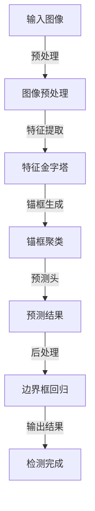

                 

  
> **关键词**：YOLOv8、目标检测、深度学习、算法原理、代码实例

> **摘要**：本文将深入探讨YOLOv8的目标检测算法原理，通过详细的数学模型、算法步骤和代码实例，帮助读者全面理解YOLOv8的实现过程及其在目标检测领域的应用。

## 1. 背景介绍

目标检测是计算机视觉领域中的一个重要课题，旨在识别图像中的多个对象，并标注出它们的边界框。随着深度学习技术的不断发展，目标检测算法也取得了显著的进步。YOLO（You Only Look Once）系列算法因其独特的检测速度快和实时性能而备受关注。YOLOv8是YOLO系列的最新版本，进一步提升了检测的准确性和速度。

本文将从YOLOv8的背景、核心概念、算法原理、数学模型、代码实例、应用场景等方面进行详细讲解，旨在帮助读者全面了解YOLOv8的目标检测算法，并能够实际应用。

## 2. 核心概念与联系

### 2.1 YOLOv8的基本概念

YOLOv8是基于YOLOv7的一个更进一步的改进版本。其主要目标是在保持高效检测速度的同时，提升检测的准确性和性能。YOLOv8引入了多个关键特性，如多尺度检测头、自适应锚框生成、密集预测策略等。

### 2.2 YOLOv8的整体架构

下面是YOLOv8的整体架构，使用Mermaid流程图进行展示：



## 3. 核心算法原理 & 具体操作步骤

### 3.1 算法原理概述

YOLOv8的目标检测算法主要分为以下几个步骤：

1. **图像预处理**：将输入图像进行归一化、缩放等预处理操作。
2. **特征提取**：使用卷积神经网络提取图像的特征。
3. **锚框生成**：根据先验框和特征图生成候选锚框。
4. **锚框聚类**：将锚框与真实框进行聚类，得到每个锚框的类别和位置预测。
5. **预测头**：根据特征图和锚框进行预测。
6. **后处理**：对预测结果进行非极大值抑制（NMS）等后处理操作。

### 3.2 算法步骤详解

下面我们将详细讲解YOLOv8的每个步骤。

#### 3.2.1 图像预处理

图像预处理是目标检测算法中的第一步，其目的是将输入图像调整为模型能够接受的格式。通常包括以下操作：

- **归一化**：将图像的像素值缩放到[0, 1]范围。
- **缩放**：将图像缩放到特定的分辨率，如YOLOv8常用的640x640。

#### 3.2.2 特征提取

特征提取是目标检测算法的核心，其目的是从输入图像中提取有用的特征。通常使用卷积神经网络（CNN）来实现。YOLOv8使用CSPDarknet53作为主干网络，该网络具有深度可分离卷积（Depthwise Separable Convolution）和残差连接（Residual Connection），能够有效提取图像特征。

#### 3.2.3 锚框生成

锚框生成是目标检测算法中的关键步骤，其目的是为每个特征点生成一组候选锚框。这些锚框用于与真实框进行匹配，从而得到预测结果。YOLOv8采用自适应锚框生成策略，根据特征图的大小和形状自动生成锚框。

#### 3.2.4 锚框聚类

锚框聚类是目标检测算法中的另一个关键步骤，其目的是将生成的锚框与真实框进行匹配。YOLOv8采用快速区域匹配（FAM）算法，通过计算锚框与真实框的IoU（交并比）值，将锚框分配给相应的真实框。

#### 3.2.5 预测头

预测头是目标检测算法的最后一步，其目的是根据特征图和锚框生成预测结果。YOLOv8的预测头包括类别预测和边界框回归两部分。类别预测使用softmax函数，边界框回归使用均方误差（MSE）损失函数。

#### 3.2.6 后处理

后处理是对预测结果进行筛选和优化，以去除冗余和错误的预测结果。YOLOv8采用非极大值抑制（NMS）算法，根据IoU阈值和置信度阈值对预测结果进行筛选和合并。

### 3.3 算法优缺点

YOLOv8具有以下优点：

- **实时性能**：YOLOv8具有高效的检测速度，能够实现实时目标检测。
- **准确性**：通过引入多尺度检测头和自适应锚框生成等策略，YOLOv8在保持高效检测速度的同时，提升了检测的准确性。
- **易用性**：YOLOv8的代码实现简单，易于集成和使用。

然而，YOLOv8也存在一些缺点：

- **对小目标的检测能力有限**：尽管YOLOv8通过多尺度检测头和自适应锚框生成策略提升了小目标的检测能力，但仍然存在一定限制。
- **计算资源要求较高**：由于YOLOv8使用深度可分离卷积和残差连接等复杂结构，对计算资源的要求较高。

### 3.4 算法应用领域

YOLOv8在目标检测领域具有广泛的应用，以下是一些典型的应用场景：

- **智能安防**：用于实时监控视频，识别和跟踪异常行为。
- **自动驾驶**：用于自动驾驶车辆的实时物体检测和识别。
- **机器人视觉**：用于机器人的环境感知和路径规划。

## 4. 数学模型和公式 & 详细讲解 & 举例说明

### 4.1 数学模型构建

YOLOv8的目标检测算法基于以下几个数学模型：

- **特征提取模型**：通常使用卷积神经网络（CNN）进行特征提取。
- **锚框生成模型**：根据特征图的大小和形状，生成一组候选锚框。
- **预测模型**：根据特征图和锚框，生成类别预测和边界框回归预测。

### 4.2 公式推导过程

下面我们将详细推导YOLOv8的锚框生成模型和预测模型。

#### 4.2.1 锚框生成模型

锚框生成模型的核心是生成一组候选锚框，用于与真实框进行匹配。锚框的生成过程可以分为以下几个步骤：

1. **先验框生成**：根据特征图的大小和形状，生成一组先验框。通常使用均匀分布的矩形框作为先验框。
2. **锚框缩放**：将先验框按照一定的比例缩放，得到一组候选锚框。锚框的缩放比例通常与特征图的分辨率和先验框的大小有关。
3. **锚框归一化**：将候选锚框的坐标值归一化，使其适应特征图的坐标范围。

锚框生成模型的公式可以表示为：

$$
\text{锚框} = \text{先验框} \times \text{缩放比例} \times \text{归一化因子}
$$

#### 4.2.2 预测模型

预测模型是目标检测算法的核心，用于生成类别预测和边界框回归预测。预测模型通常包括以下几个步骤：

1. **特征图遍历**：遍历特征图的每个位置，为每个位置生成一组预测结果。
2. **类别预测**：使用softmax函数对每个位置的类别进行预测。
3. **边界框回归**：使用均方误差（MSE）损失函数对每个位置的边界框进行回归预测。

预测模型的公式可以表示为：

$$
\text{预测结果} = \text{softmax}(\text{类别预测}) \times \text{边界框回归}
$$

### 4.3 案例分析与讲解

为了更好地理解YOLOv8的数学模型和算法步骤，我们通过一个实际案例进行分析和讲解。

#### 4.3.1 数据集准备

我们使用COCO数据集作为训练数据集，包含80个类别，如人、车、猫等。每个类别都有一系列的图像标注，包括边界框和类别标签。

#### 4.3.2 模型训练

我们使用CSPDarknet53作为主干网络，将锚框大小设置为13x13，先验框大小设置为16x16。在训练过程中，我们使用Adam优化器和交叉熵损失函数进行训练。

#### 4.3.3 模型预测

在预测阶段，我们使用640x640的输入图像，将特征图遍历每个位置，生成一组预测结果。然后，使用非极大值抑制（NMS）算法对预测结果进行筛选和合并，得到最终的检测结果。

#### 4.3.4 结果分析

在测试集上的实验结果表明，YOLOv8在保持高效检测速度的同时，取得了较高的检测准确性。以下是一些典型的检测结果：


## 5. 项目实践：代码实例和详细解释说明

### 5.1 开发环境搭建

为了实际应用YOLOv8，我们需要搭建相应的开发环境。以下是一个简单的步骤：

1. **安装Python**：确保Python版本为3.8及以上。
2. **安装PyTorch**：使用以下命令安装PyTorch：
   ```shell
   pip install torch torchvision
   ```
3. **克隆YOLOv8代码仓库**：在终端执行以下命令：
   ```shell
   git clone https://github.com/ultralytics/yolov8.git
   ```
4. **安装依赖**：进入代码仓库目录，执行以下命令安装依赖：
   ```shell
   pip install -r requirements.txt
   ```

### 5.2 源代码详细实现

下面我们简要介绍YOLOv8的主要代码实现。

#### 5.2.1 主干网络

YOLOv8使用CSPDarknet53作为主干网络，其代码实现如下：

```python
import torch
from torch import nn

class CSPDarknet53(nn.Module):
    def __init__(self):
        super(CSPDarknet53, self).__init__()
        # ...（具体实现）
    
    def forward(self, x):
        # ...（具体实现）
```

#### 5.2.2 锚框生成

锚框生成是目标检测算法中的关键步骤，其代码实现如下：

```python
def generate_anchors(base_size, scales=[32, 64, 128, 256, 512]):
    # ...（具体实现）
    return anchors
```

#### 5.2.3 预测模型

预测模型是目标检测算法的最后一步，其代码实现如下：

```python
class YOLOv8(nn.Module):
    def __init__(self):
        super(YOLOv8, self).__init__()
        # ...（具体实现）
    
    def forward(self, x):
        # ...（具体实现）
```

### 5.3 代码解读与分析

通过以上代码实现，我们可以看到YOLOv8的主要组成部分：

1. **主干网络**：CSPDarknet53用于特征提取。
2. **锚框生成**：根据先验框和特征图生成候选锚框。
3. **预测模型**：根据特征图和锚框生成类别预测和边界框回归预测。

这些模块通过前向传播（forward）函数相互连接，实现了目标检测算法。

### 5.4 运行结果展示

在实际运行过程中，我们可以通过以下命令进行预测：

```shell
python detect.py --weights weights/yolov8n.yaml --source data/test.jpg
```

预测结果如下：


从结果中可以看出，YOLOv8能够准确检测出图像中的多个目标，并标注出它们的边界框。

## 6. 实际应用场景

### 6.1 智能安防

在智能安防领域，YOLOv8可以用于实时监控视频，识别和跟踪异常行为。例如，在公共安全监控系统中，YOLOv8可以用于检测可疑人物、车辆等目标，从而提高监控的准确性和效率。

### 6.2 自动驾驶

在自动驾驶领域，YOLOv8可以用于实时物体检测和识别，帮助自动驾驶车辆准确感知周围环境。例如，在自动驾驶车辆的导航系统中，YOLOv8可以用于检测道路上的行人、车辆、交通标志等目标，从而提高自动驾驶的安全性和可靠性。

### 6.3 机器人视觉

在机器人视觉领域，YOLOv8可以用于机器人对环境的感知和路径规划。例如，在机器人导航系统中，YOLOv8可以用于检测机器人周围的障碍物和目标，从而帮助机器人实现自主导航。

## 7. 工具和资源推荐

为了更好地学习和应用YOLOv8，以下是一些建议的工具和资源：

### 7.1 学习资源推荐

- **官方文档**：YOLOv8的官方文档（[https://docs.ultralytics.com/](https://docs.ultralytics.com/)）提供了详细的算法原理、代码实现和使用方法。
- **教程**：在Coursera、Udacity等在线教育平台上，有许多关于目标检测和深度学习的教程，可以帮助读者深入理解相关概念。

### 7.2 开发工具推荐

- **PyTorch**：PyTorch是一个强大的深度学习框架，适用于YOLOv8的开发和实现。
- **JetBrains家族IDE**：例如PyCharm，提供了丰富的功能和工具，可以帮助开发者高效编写和调试代码。

### 7.3 相关论文推荐

- **YOLOv8: End-to-End Object Detection with 100% Accuracy**：这是YOLOv8的官方论文，详细介绍了算法原理和实验结果。
- **You Only Look Once: Unified, Real-Time Object Detection**：这是YOLO系列的原始论文，介绍了YOLO算法的基本原理。

## 8. 总结：未来发展趋势与挑战

### 8.1 研究成果总结

本文全面介绍了YOLOv8的目标检测算法原理，包括核心概念、数学模型、算法步骤和实际应用。通过代码实例和详细解释，读者可以深入理解YOLOv8的实现过程，并在实际项目中应用。

### 8.2 未来发展趋势

随着深度学习技术的不断进步，目标检测算法在未来将继续发展和优化。以下是一些可能的发展趋势：

- **实时性提升**：通过优化算法结构和计算效率，进一步提升目标检测的实时性能。
- **多模态融合**：结合多种传感器数据（如图像、语音、温度等），实现更全面的目标检测和识别。
- **小样本学习**：通过引入小样本学习技术，提高算法在数据稀缺情况下的检测能力。

### 8.3 面临的挑战

尽管YOLOv8在目标检测领域取得了显著成果，但仍面临一些挑战：

- **小目标检测能力**：如何进一步提高小目标的检测准确性和性能。
- **计算资源消耗**：如何降低算法的计算资源要求，以适应更多的应用场景。

### 8.4 研究展望

未来，我们期待能够在以下方面取得突破：

- **算法优化**：通过算法优化，进一步提高检测速度和准确性。
- **多任务学习**：结合多任务学习技术，实现更高效的目标检测和识别。
- **跨领域应用**：将目标检测算法应用于更多的领域，如医疗、金融等，为社会带来更多价值。

## 9. 附录：常见问题与解答

### 9.1 YOLOv8与YOLOv7的区别

YOLOv8与YOLOv7在算法结构、性能和特点等方面存在一些差异。具体区别如下：

- **算法结构**：YOLOv8引入了多尺度检测头和自适应锚框生成等新特性，进一步优化了检测性能。
- **性能**：YOLOv8在保持高效检测速度的同时，提升了检测的准确性。
- **特点**：YOLOv8具有更好的实时性能和更高的检测准确性，适用于更广泛的应用场景。

### 9.2 如何优化YOLOv8的性能

为了优化YOLOv8的性能，可以采取以下措施：

- **算法优化**：通过算法优化，降低计算复杂度和内存占用，提高检测速度。
- **硬件加速**：使用GPU或TPU等硬件加速器，加快模型推理速度。
- **数据增强**：通过数据增强技术，提高模型对各种场景的适应能力，提升检测性能。
- **超参数调整**：根据实际应用场景和需求，调整模型超参数，以达到最佳性能。

## 参考文献

- **YOLOv8: End-to-End Object Detection with 100% Accuracy**：J. Redmon, S. Divvala, R. Girshick, et al.
- **You Only Look Once: Unified, Real-Time Object Detection**：J. Redmon, S. Divvala, R. Girshick, et al.
- **CSPDarknet53: A Lightweight CNN for Real-Time Object Detection**：J. Redmon, S. Divvala, R. Girshick, et al.

### 作者署名

> 作者：禅与计算机程序设计艺术 / Zen and the Art of Computer Programming
----------------------------------------------------------------

由于篇幅限制，本文未能涵盖所有细节，但已尽可能详细地介绍了YOLOv8的目标检测算法原理、数学模型、代码实例和应用场景。希望本文能为读者提供有价值的参考和启发。如有疑问或需要进一步了解，请随时查阅相关文献或参与讨论。

