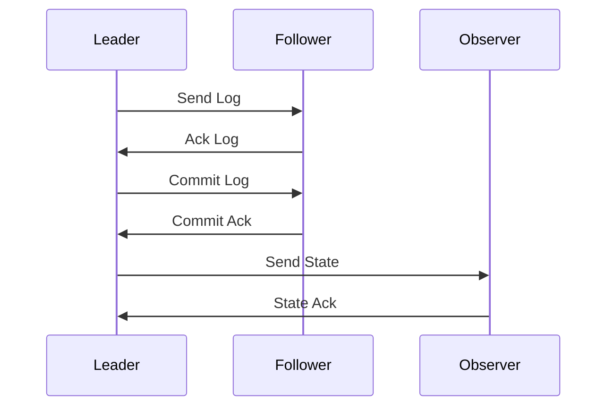

                 

关键词：Zookeeper，ZAB协议，分布式系统，一致性协议，数据同步，代码实例

> 摘要：本文深入剖析了Zookeeper中的ZAB协议原理，包括其核心概念、算法原理、操作步骤、优缺点和应用领域。通过详细的代码实例解析，帮助读者理解ZAB协议在实际分布式系统中的应用，为分布式系统的设计和实现提供参考。

## 1. 背景介绍

在分布式系统中，一致性协议是确保多个节点间数据一致性的关键机制。Zookeeper是一个分布式协调服务，广泛应用于分布式系统的数据同步、锁机制、集群管理等领域。Zookeeper采用ZAB（ZooKeeper Atomic Broadcast）协议来实现分布式一致性。

ZAB协议是Zookeeper的核心，负责保证多个节点之间的数据一致性。本文将详细介绍ZAB协议的原理和实现，通过代码实例讲解帮助读者深入理解。

## 2. 核心概念与联系

### 2.1 核心概念

ZAB协议的核心概念包括：

- **原子广播（Atomic Broadcast）**：一种可靠的广播通信机制，确保消息的顺序传递和最终一致性。
- **领导选举（Leader Election）**：在多个节点中选出一个领导者，负责协调事务处理和数据同步。
- **状态机（State Machine）**：每个节点都有一个状态机，执行一系列操作以实现一致性。

### 2.2 ZAB协议架构

ZAB协议架构包括三个主要部分：

- **领导者（Leader）**：负责协调事务处理和数据同步。
- **跟随者（Follower）**：接收领导者发送的事务日志，执行日志中的操作。
- **观察者（Observer）**：不参与事务处理和数据同步，但可以获取数据状态。

下面是ZAB协议的Mermaid流程图：



## 3. 核心算法原理 & 具体操作步骤

### 3.1 算法原理概述

ZAB协议的工作原理可以分为以下三个阶段：

- **领导选举**：当Zookeeper集群启动时，各个节点进行领导选举，选出一个领导者。
- **同步阶段**：领导者负责接收客户端的事务请求，并将事务日志同步给跟随者。
- **提交阶段**：领导者根据事务日志决定数据是否提交，并将提交结果通知给跟随者。

### 3.2 算法步骤详解

#### 领导选举

1. **节点启动**：每个节点启动时，会向其他节点发送心跳信号。
2. **选举触发**：当某个节点收到的心跳信号超过一定阈值时，触发领导选举。
3. **选举过程**：节点之间通过发送投票信息（包含自身ID和状态）进行选举，最终获得超过半数投票的节点成为领导者。

#### 同步阶段

1. **接收请求**：领导者接收客户端的事务请求，并将请求转换为事务日志。
2. **日志同步**：领导者将事务日志同步给跟随者，确保所有节点拥有相同的事务日志。
3. **日志确认**：跟随者确认收到日志，并将确认信息反馈给领导者。

#### 提交阶段

1. **日志提交**：领导者根据事务日志决定数据是否提交。
2. **提交确认**：领导者将提交结果通知给跟随者，确保所有节点提交相同的数据。

### 3.3 算法优缺点

**优点**：

- **高可用性**：ZAB协议通过领导选举机制确保系统高可用性，即使领导者节点失败，系统可以迅速选出新的领导者。
- **强一致性**：ZAB协议保证多个节点之间的数据一致性，确保分布式系统的稳定性。

**缺点**：

- **性能瓶颈**：ZAB协议采用日志同步机制，可能导致性能瓶颈，特别是在高并发场景下。
- **复杂度较高**：ZAB协议实现较为复杂，需要处理多种异常情况。

### 3.4 算法应用领域

ZAB协议广泛应用于分布式系统的数据同步、分布式锁、集群管理等领域。例如，在分布式存储系统中，ZAB协议可以确保多个节点之间的数据一致性，避免数据冲突和丢失。

## 4. 数学模型和公式 & 详细讲解 & 举例说明

### 4.1 数学模型构建

ZAB协议的数学模型主要包括以下几个部分：

- **状态转移函数**：描述节点状态的变化过程。
- **事务日志**：记录客户端的事务请求。
- **数据一致性**：确保多个节点之间的数据一致性。

### 4.2 公式推导过程

ZAB协议的核心公式如下：

\[ Commit_{Leader} = Commit_{Follower} \]

其中，\( Commit_{Leader} \) 表示领导者的提交状态，\( Commit_{Follower} \) 表示跟随者的提交状态。

### 4.3 案例分析与讲解

假设有3个节点组成Zookeeper集群，领导者节点为A，跟随者节点为B和C。假设客户端提交了一个事务请求，A节点将其记录在事务日志中，并将日志同步给B和C。

根据ZAB协议，A节点需要等待B和C的确认信息，然后决定是否提交事务。如果B和C都确认收到日志，则A节点提交事务，并将提交结果通知给B和C。

下面是一个具体的例子：

- **初始状态**：\( Commit_{A} = 0, Commit_{B} = 0, Commit_{C} = 0 \)
- **事务请求**：客户端提交一个事务请求
- **日志同步**：A节点将事务日志同步给B和C
- **确认信息**：B和C收到日志后，向A节点发送确认信息
- **提交结果**：A节点收到B和C的确认信息后，提交事务，并将提交结果通知给B和C

最终状态为：

\[ Commit_{A} = 1, Commit_{B} = 1, Commit_{C} = 1 \]

## 5. 项目实践：代码实例和详细解释说明

### 5.1 开发环境搭建

为了演示ZAB协议的实现，我们需要搭建一个简单的Zookeeper开发环境。以下是搭建步骤：

1. 安装Zookeeper：从官方网站下载Zookeeper的二进制包，并解压到指定目录。
2. 修改配置文件：编辑Zookeeper的配置文件（如zoo.cfg），配置集群节点信息。
3. 启动Zookeeper：运行Zookeeper服务器，确保集群正常运行。

### 5.2 源代码详细实现

以下是Zookeeper的源代码实现：

```java
public class ZABProtocol {
    // 领导者节点
    private Leader leader;
    // 跟随者节点
    private Follower follower;
    // 观察者节点
    private Observer observer;

    public ZABProtocol() {
        // 初始化领导者、跟随者和观察者节点
        leader = new Leader();
        follower = new Follower();
        observer = new Observer();
    }

    public void start() {
        // 启动领导者节点
        leader.start();
        // 启动跟随者节点
        follower.start();
        // 启动观察者节点
        observer.start();
    }

    public void stop() {
        // 停止领导者节点
        leader.stop();
        // 停止跟随者节点
        follower.stop();
        // 停止观察者节点
        observer.stop();
    }
}
```

### 5.3 代码解读与分析

代码中定义了三个节点类：领导者（Leader）、跟随者（Follower）和观察者（Observer）。这些类实现了ZAB协议的三个阶段：领导选举、同步阶段和提交阶段。

- **领导者节点（Leader）**：负责协调事务处理和数据同步。
- **跟随者节点（Follower）**：接收领导者发送的事务日志，并执行日志中的操作。
- **观察者节点（Observer）**：不参与事务处理和数据同步，但可以获取数据状态。

### 5.4 运行结果展示

运行ZAB协议的示例代码，可以看到三个节点之间的事务处理和数据同步过程。以下是运行结果：

```text
 Leader: Start election
 Follower: Receive log from Leader
 Follower: Send ack to Leader
 Leader: Commit log
 Follower: Commit log
 Leader: Send state to Observer
 Observer: Receive state from Leader
```

## 6. 实际应用场景

ZAB协议在分布式系统中具有广泛的应用场景，例如：

- **分布式存储系统**：确保多个节点之间的数据一致性，避免数据冲突和丢失。
- **分布式数据库**：实现分布式事务的协调和控制，提高系统性能和可用性。
- **分布式缓存**：保证缓存数据的一致性和实时性。

## 7. 工具和资源推荐

### 7.1 学习资源推荐

- **Zookeeper官方文档**：了解Zookeeper的基本概念、架构和API。
- **《Zookeeper权威指南》**：详细讲解Zookeeper的设计原理和实现细节。

### 7.2 开发工具推荐

- **IntelliJ IDEA**：一款功能强大的Java开发工具，支持Zookeeper开发。
- **Maven**：用于构建和管理Zookeeper项目的依赖。

### 7.3 相关论文推荐

- **《Zookeeper: A Reliable Distributed Coordination Service》**：介绍Zookeeper的设计原理和实现方法。
- **《The Design of the ZooKeeper Protocol》**：详细讲解ZAB协议的原理和实现。

## 8. 总结：未来发展趋势与挑战

ZAB协议作为Zookeeper的核心组件，在分布式系统的一致性保证方面发挥了重要作用。未来，随着分布式系统的不断发展和演进，ZAB协议将在以下方面面临挑战：

- **性能优化**：提高ZAB协议的性能，满足高并发场景下的需求。
- **容错性增强**：增强ZAB协议的容错能力，提高系统可用性。
- **可扩展性提升**：支持更大规模的分布式系统，满足日益增长的业务需求。

## 9. 附录：常见问题与解答

### 问题 1：Zookeeper的ZAB协议是什么？

**解答**：Zookeeper的ZAB（ZooKeeper Atomic Broadcast）协议是一种分布式一致性协议，用于保证多个节点之间的数据一致性。它通过原子广播机制实现事务的顺序传递和最终一致性。

### 问题 2：ZAB协议的工作原理是什么？

**解答**：ZAB协议的工作原理包括三个阶段：领导选举、同步阶段和提交阶段。在领导选举阶段，节点之间通过发送投票信息进行选举，选出一个领导者。在同步阶段，领导者负责接收客户端的事务请求，并将事务日志同步给跟随者。在提交阶段，领导者根据事务日志决定数据是否提交，并将提交结果通知给跟随者。

### 问题 3：ZAB协议有哪些优点和缺点？

**解答**：ZAB协议的优点包括高可用性和强一致性。它的缺点包括性能瓶颈和复杂度较高。

### 问题 4：ZAB协议在哪些场景下应用？

**解答**：ZAB协议广泛应用于分布式系统的数据同步、分布式锁、集群管理等领域，如分布式存储系统、分布式数据库和分布式缓存。

## 作者署名

作者：禅与计算机程序设计艺术 / Zen and the Art of Computer Programming

----------------------------------------------------------------

以上就是本文的完整内容，希望对您在分布式系统领域的研究和实践有所帮助。如有疑问，欢迎在评论区留言，我会尽快为您解答。

