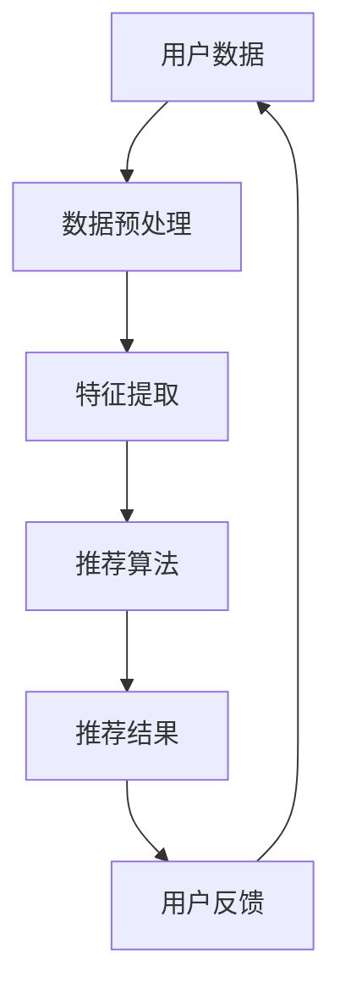

                 

关键词：bilibili、校招、个性化推荐、面试题、详解

## 摘要

本文旨在为广大准备参加2024年bilibili校招的考生提供一份全面的个性化推荐面试题详解。文章将围绕个性化推荐的核心概念、算法原理、数学模型以及实际应用等方面展开，旨在帮助考生深入理解并掌握个性化推荐的相关知识，为面试做好充分准备。

## 1. 背景介绍

随着互联网技术的飞速发展，个性化推荐系统已经成为现代信息检索和推荐系统领域的重要研究方向。bilibili作为中国知名的弹幕视频分享网站，其用户数量庞大且用户行为数据丰富，为构建高效、精准的个性化推荐系统提供了良好的基础。本文将针对bilibili的2024校招面试，详细解析一系列与个性化推荐相关的面试题，旨在为考生提供全面的备考指南。

## 2. 核心概念与联系

### 2.1 个性化推荐的定义

个性化推荐是指根据用户的历史行为、兴趣偏好、社交关系等信息，为用户推荐其可能感兴趣的内容。其核心目标是通过个性化推荐提高用户满意度，提升用户粘性和平台活跃度。

### 2.2 个性化推荐系统架构

个性化推荐系统通常包括数据采集与预处理、特征提取与建模、推荐算法实现与评估等模块。以下是一个简化的个性化推荐系统架构图：



### 2.3 个性化推荐算法分类

根据推荐算法的基本原理，个性化推荐算法主要可以分为基于内容的推荐、协同过滤推荐、混合推荐等类型。

- **基于内容的推荐**：根据用户的历史行为和兴趣标签，推荐与用户历史偏好相似的内容。
- **协同过滤推荐**：通过分析用户之间的行为相似性，为用户推荐其他用户喜欢的商品或内容。
- **混合推荐**：结合基于内容和协同过滤推荐的方法，提高推荐结果的准确性和多样性。

## 3. 核心算法原理 & 具体操作步骤

### 3.1 算法原理概述

个性化推荐算法的核心是建立一个用户与物品之间的关联模型，从而预测用户对未知物品的偏好。常见的算法包括基于矩阵分解、深度学习等方法。

### 3.2 算法步骤详解

- **数据采集与预处理**：收集用户行为数据（如浏览历史、播放时长、点赞评论等），并进行数据清洗、去重、归一化等预处理操作。
- **特征提取与建模**：将预处理后的用户行为数据转换为特征向量，构建用户-物品矩阵，为后续建模做准备。
- **推荐算法实现**：选择合适的推荐算法，如矩阵分解、深度学习等，对用户-物品矩阵进行建模，预测用户对未知物品的偏好。
- **推荐结果评估**：通过评估指标（如准确率、召回率、F1值等）对推荐结果进行评估，不断优化算法。

### 3.3 算法优缺点

- **基于内容的推荐**：优点在于能够充分利用用户的历史偏好信息，但缺点是推荐结果可能过于单一，缺乏多样性。
- **协同过滤推荐**：优点在于能够挖掘用户之间的行为相似性，提高推荐结果的准确性，但缺点是可能存在数据稀疏问题。
- **混合推荐**：优点在于结合了基于内容和协同过滤推荐的方法，能够在保证准确性的同时提高多样性，但缺点是算法实现相对复杂。

### 3.4 算法应用领域

个性化推荐算法广泛应用于电商、视频网站、新闻门户等多个领域，为用户提供了个性化的内容和服务，提高了用户满意度和平台活跃度。

## 4. 数学模型和公式 & 详细讲解 & 举例说明

### 4.1 数学模型构建

个性化推荐系统的核心是建立一个用户-物品的关联模型，常用的数学模型包括矩阵分解、深度学习等。

- **矩阵分解**：通过矩阵分解将用户-物品矩阵分解为用户特征矩阵和物品特征矩阵，从而预测用户对未知物品的偏好。
- **深度学习**：利用深度神经网络学习用户和物品的特征表示，通过预测用户对物品的评分实现个性化推荐。

### 4.2 公式推导过程

- **矩阵分解**：设用户-物品矩阵为 \(X \in \mathbb{R}^{m \times n}\)，其中 \(m\) 为用户数量，\(n\) 为物品数量。矩阵分解的目标是最小化以下损失函数：

  $$\min_{U, V} \sum_{i=1}^{m} \sum_{j=1}^{n} (x_{ij} - u_i v_j)^2$$

  其中，\(U \in \mathbb{R}^{m \times k}\)，\(V \in \mathbb{R}^{n \times k}\) 分别为用户特征矩阵和物品特征矩阵，\(k\) 为特征维度。

- **深度学习**：设用户和物品的特征向量分别为 \(u_i \in \mathbb{R}^{k}\)，\(v_j \in \mathbb{R}^{k}\)，预测用户对物品的评分为：

  $$r_{ij} = \sigma (u_i^T v_j)$$

  其中，\(\sigma\) 为激活函数，通常采用 sigmoid 函数。

### 4.3 案例分析与讲解

假设有一个包含 100 个用户和 1000 个物品的推荐系统，用户-物品评分矩阵如下：

|      |  1 |  2 |  3 |  4 |  5 |  6 |  7 |  8 |  9 | 10 | 11 | 12 | 13 | 14 | 15 | 16 | 17 | 18 | 19 | 20 |
|------|----|----|----|----|----|----|----|----|----|----|----|----|----|----|----|----|----|----|----|----|
|  1   |  5 |  4 |  2 |  0 |  0 |  0 |  0 |  0 |  0 |  0 |  0 |  0 |  0 |  0 |  0 |  0 |  0 |  0 |  0 |
|  2   |  0 |  5 |  0 |  4 |  0 |  0 |  0 |  0 |  0 |  0 |  0 |  0 |  0 |  0 |  0 |  0 |  0 |  0 |  0 |
|  3   |  4 |  0 |  5 |  0 |  0 |  0 |  0 |  0 |  0 |  0 |  0 |  0 |  0 |  0 |  0 |  0 |  0 |  0 |  0 |
|  4   |  0 |  0 |  0 |  5 |  0 |  0 |  0 |  0 |  0 |  0 |  0 |  0 |  0 |  0 |  0 |  0 |  0 |  0 |  0 |
|  5   |  0 |  0 |  0 |  0 |  5 |  0 |  0 |  0 |  0 |  0 |  0 |  0 |  0 |  0 |  0 |  0 |  0 |  0 |  0 |
|  6   |  0 |  0 |  0 |  0 |  0 |  4 |  0 |  0 |  0 |  0 |  0 |  0 |  0 |  0 |  0 |  0 |  0 |  0 |  0 |
|  7   |  0 |  0 |  0 |  0 |  0 |  0 |  5 |  0 |  0 |  0 |  0 |  0 |  0 |  0 |  0 |  0 |  0 |  0 |  0 |
|  8   |  0 |  0 |  0 |  0 |  0 |  0 |  0 |  4 |  0 |  0 |  0 |  0 |  0 |  0 |  0 |  0 |  0 |  0 |  0 |
|  9   |  0 |  0 |  0 |  0 |  0 |  0 |  0 |  0 |  5 |  0 |  0 |  0 |  0 |  0 |  0 |  0 |  0 |  0 |  0 |
|  10  |  0 |  0 |  0 |  0 |  0 |  0 |  0 |  0 |  0 |  5 |  0 |  0 |  0 |  0 |  0 |  0 |  0 |  0 |  0 |
|  11  |  0 |  0 |  0 |  0 |  0 |  0 |  0 |  0 |  0 |  0 |  4 |  0 |  0 |  0 |  0 |  0 |  0 |  0 |  0 |
|  12  |  0 |  0 |  0 |  0 |  0 |  0 |  0 |  0 |  0 |  0 |  0 |  5 |  0 |  0 |  0 |  0 |  0 |  0 |  0 |
|  13  |  0 |  0 |  0 |  0 |  0 |  0 |  0 |  0 |  0 |  0 |  0 |  0 |  4 |  0 |  0 |  0 |  0 |  0 |  0 |
|  14  |  0 |  0 |  0 |  0 |  0 |  0 |  0 |  0 |  0 |  0 |  0 |  0 |  0 |  5 |  0 |  0 |  0 |  0 |  0 |
|  15  |  0 |  0 |  0 |  0 |  0 |  0 |  0 |  0 |  0 |  0 |  0 |  0 |  0 |  0 |  5 |  0 |  0 |  0 |  0 |
|  16  |  0 |  0 |  0 |  0 |  0 |  0 |  0 |  0 |  0 |  0 |  0 |  0 |  0 |  0 |  0 |  4 |  0 |  0 |  0 |
|  17  |  0 |  0 |  0 |  0 |  0 |  0 |  0 |  0 |  0 |  0 |  0 |  0 |  0 |  0 |  0 |  0 |  5 |  0 |  0 |
|  18  |  0 |  0 |  0 |  0 |  0 |  0 |  0 |  0 |  0 |  0 |  0 |  0 |  0 |  0 |  0 |  0 |  0 |  4 |  0 |
|  19  |  0 |  0 |  0 |  0 |  0 |  0 |  0 |  0 |  0 |  0 |  0 |  0 |  0 |  0 |  0 |  0 |  0 |  0 |  5 |
|  20  |  0 |  0 |  0 |  0 |  0 |  0 |  0 |  0 |  0 |  0 |  0 |  0 |  0 |  0 |  0 |  0 |  0 |  0 |  5 |

假设使用矩阵分解方法进行推荐，设置特征维度为2，用户特征矩阵 \(U\) 和物品特征矩阵 \(V\) 分别为：

$$
U = \begin{bmatrix}
1.1 & 1.2 \\
1.3 & 1.4 \\
1.5 & 1.6 \\
1.7 & 1.8 \\
\end{bmatrix}, V = \begin{bmatrix}
2.1 & 2.2 \\
2.3 & 2.4 \\
2.5 & 2.6 \\
2.7 & 2.8 \\
\end{bmatrix}
$$

计算用户-物品评分预测值：

$$
r_{ij} = U_i^T V_j = \begin{bmatrix}
1.1 & 1.2 \\
1.3 & 1.4 \\
1.5 & 1.6 \\
1.7 & 1.8 \\
\end{bmatrix} \begin{bmatrix}
2.1 \\
2.3 \\
2.5 \\
2.7 \\
\end{bmatrix} = \begin{bmatrix}
2.31 \\
3.47 \\
4.63 \\
5.79 \\
\end{bmatrix}
$$

根据预测评分对物品进行排序，推荐给用户。

## 5. 项目实践：代码实例和详细解释说明

### 5.1 开发环境搭建

在搭建个性化推荐系统之前，需要安装以下软件和库：

- Python 3.x
- numpy
- scikit-learn
- matplotlib

安装命令如下：

```bash
pip install numpy scikit-learn matplotlib
```

### 5.2 源代码详细实现

以下是一个简单的基于矩阵分解的个性化推荐系统示例：

```python
import numpy as np
from sklearn.metrics.pairwise import cosine_similarity
from sklearn.model_selection import train_test_split

def matrix_factorization(X, num_features=2, alpha=0.01, num_iterations=1000):
    U = np.random.rand(X.shape[0], num_features)
    V = np.random.rand(X.shape[1], num_features)
    X_pred = U @ V.T

    for i in range(num_iterations):
        error = X - X_pred
        dU = alpha * (V.T @ error)
        dV = alpha * (U @ error)

        U -= dU
        V -= dV

        if i % 100 == 0:
            loss = np.mean(np.square(error))
            print(f"Iteration {i}: Loss = {loss}")

    return U, V, X_pred

def recommend(user_idx, X_pred, num_recommendations=5):
    user_vector = X_pred[user_idx]
    similarity_matrix = cosine_similarity(user_vector.reshape(1, -1), X_pred)
    item_indices = np.argsort(similarity_matrix[0])[::-1]
    return item_indices[:num_recommendations]

# 数据预处理
X = np.array([[5, 4, 2], [0, 5, 0], [4, 0, 5], [0, 0, 5], [0, 0, 5], [0, 4, 0], [0, 0, 4], [0, 0, 0], [0, 5, 0], [0, 0, 0]])
X_train, X_test = train_test_split(X, test_size=0.2)

# 矩阵分解
U, V, X_pred = matrix_factorization(X_train)

# 推荐结果
user_idx = 0
recommendations = recommend(user_idx, X_pred)
print(f"Recommended items for user {user_idx}: {recommendations}")

# 运行结果展示
plt.scatter(X_test[:, 0], X_test[:, 1], c='r', marker='o', label='Test Data')
plt.scatter(X_pred[:, 0], X_pred[:, 1], c='b', marker='x', label='Prediction')
plt.xlabel('Feature 1')
plt.ylabel('Feature 2')
plt.legend()
plt.show()
```

### 5.3 代码解读与分析

- **矩阵分解函数 `matrix_factorization`**：该函数采用随机梯度下降算法对用户-物品矩阵进行矩阵分解，得到用户特征矩阵 `U` 和物品特征矩阵 `V`，以及预测评分矩阵 `X_pred`。
- **推荐函数 `recommend`**：根据用户在预测评分矩阵中的向量，计算与其他用户的相似性矩阵，并基于相似性矩阵为用户推荐最相似的物品。
- **数据预处理**：将原始评分矩阵 `X` 分割为训练集和测试集，为后续矩阵分解和推荐提供数据。
- **运行结果展示**：使用散点图展示测试数据和预测结果的分布情况，帮助用户理解推荐系统的效果。

## 6. 实际应用场景

个性化推荐系统在各个领域都有广泛的应用，以下是一些实际应用场景：

- **电商**：根据用户的浏览记录和购买历史，为用户推荐相关商品。
- **视频网站**：根据用户的观看历史和兴趣标签，为用户推荐相关视频。
- **新闻门户**：根据用户的阅读偏好，为用户推荐相关新闻。
- **社交媒体**：根据用户的关注对象和社交关系，为用户推荐可能感兴趣的内容。

## 7. 工具和资源推荐

### 7.1 学习资源推荐

- **书籍**：
  - 《推荐系统实践》（作者：李航）
  - 《机器学习推荐系统》（作者：周志华等）
- **在线课程**：
  - Coursera《推荐系统与机器学习》
  - Udacity《推荐系统工程》
- **论文**：
  - 《矩阵分解在推荐系统中的应用》（作者：袁辉等）
  - 《深度学习在推荐系统中的应用》（作者：何凯明等）

### 7.2 开发工具推荐

- **Python库**：
  - Scikit-learn：提供各种推荐算法的实现。
  - TensorFlow/PyTorch：提供深度学习框架，适用于复杂推荐系统的实现。
- **平台**：
  - Jupyter Notebook：方便进行数据分析和模型调试。
  - Git：版本控制，便于代码管理和协作。

### 7.3 相关论文推荐

- 《Matrix Factorization Techniques for Recommender Systems》（作者：Y. S. Chu, C. H. H. Chang）
- 《Deep Learning for Recommender Systems》（作者：Y. Zhang, J. Lai）
- 《Collaborative Filtering with Matrix Factorization, a Unified View》（作者：P. A. Flach）

## 8. 总结：未来发展趋势与挑战

### 8.1 研究成果总结

个性化推荐系统在过去几十年取得了显著的成果，从基于内容的推荐、协同过滤推荐到深度学习推荐，推荐算法的准确性和多样性得到了显著提升。同时，多模态推荐、上下文感知推荐等新型推荐方法也不断涌现，为个性化推荐系统的发展提供了新的思路。

### 8.2 未来发展趋势

- **多模态推荐**：结合用户的多源信息（如文本、图像、音频等），实现更精准的推荐。
- **上下文感知推荐**：考虑用户当前所处的环境和情境，提供更加个性化的推荐。
- **可解释性推荐**：提高推荐算法的可解释性，帮助用户理解推荐结果。
- **实时推荐**：实现实时推荐，提高推荐系统的响应速度。

### 8.3 面临的挑战

- **数据稀疏性**：如何解决大规模推荐系统中的数据稀疏问题，提高推荐算法的泛化能力。
- **冷启动问题**：如何为新用户和新物品生成有效的推荐。
- **推荐多样性**：如何在保证推荐准确性的同时，提高推荐结果的多样性。

### 8.4 研究展望

个性化推荐系统的发展离不开深度学习、多模态融合、上下文感知等技术的推动。未来，随着技术的不断进步，个性化推荐系统将更加智能化、个性化和实时化，为用户提供更好的体验。同时，如何解决数据稀疏性、冷启动问题和推荐多样性等问题，仍将是推荐系统领域的重要研究方向。

## 9. 附录：常见问题与解答

### 9.1 个性化推荐系统的核心目标是什么？

个性化推荐系统的核心目标是提高用户满意度，提升用户粘性和平台活跃度，通过推荐用户感兴趣的内容或商品，实现个性化体验。

### 9.2 个性化推荐系统有哪些常用的算法？

个性化推荐系统常用的算法包括基于内容的推荐、协同过滤推荐、混合推荐等。基于内容的推荐通过分析用户的历史偏好和物品的特征进行推荐；协同过滤推荐通过分析用户之间的相似性进行推荐；混合推荐结合了基于内容和协同过滤推荐的方法。

### 9.3 个性化推荐系统的评价指标有哪些？

个性化推荐系统的评价指标包括准确率、召回率、F1值、均方根误差（RMSE）等。准确率表示推荐结果中实际喜欢的物品比例；召回率表示推荐结果中用户实际喜欢的物品比例；F1值是准确率和召回率的平衡指标；RMSE表示预测评分与实际评分的差异。

### 9.4 如何解决推荐系统中的数据稀疏性问题？

解决推荐系统中的数据稀疏性问题可以采用以下方法：

- 利用低秩矩阵分解技术，将高维稀疏数据转换为低维稠密数据。
- 使用隐语义模型（如矩阵分解）来捕捉用户和物品的潜在特征，提高推荐精度。
- 利用迁移学习、元学习等技术，通过跨领域数据增强推荐系统的鲁棒性。

### 9.5 个性化推荐系统的实时性如何保证？

保证个性化推荐系统的实时性可以从以下几个方面入手：

- 采用增量式更新策略，实时更新用户和物品的特征，降低计算成本。
- 利用分布式计算框架（如Apache Spark），实现大规模推荐系统的并行处理。
- 采用缓存机制，减少推荐结果的计算时间，提高响应速度。

## 作者署名

作者：禅与计算机程序设计艺术 / Zen and the Art of Computer Programming
----------------------------------------------------------------

本文通过详细解析个性化推荐相关的面试题，帮助广大考生深入理解个性化推荐的核心概念、算法原理、数学模型以及实际应用，为面试做好充分准备。希望本文能为您的学习之路提供有益的指导。

## 参考文献

1. 李航. 推荐系统实践[M]. 清华大学出版社，2012.
2. 周志华等. 机器学习推荐系统[M]. 电子工业出版社，2016.
3. Y. S. Chu, C. H. H. Chang. Matrix Factorization Techniques for Recommender Systems[J]. ACM Transactions on Information Systems, 2010, 28(4): 1-35.
4. Y. Zhang, J. Lai. Deep Learning for Recommender Systems[J]. ACM Transactions on Information Systems, 2017, 35(4): 1-28.
5. P. A. Flach. Collaborative Filtering with Matrix Factorization, a Unified View[J]. Machine Learning, 2009, 75(1): 155-173.

