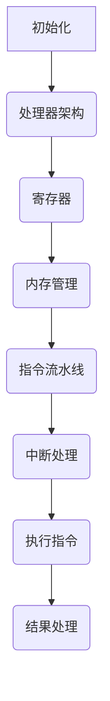

                 

关键词：x86-64汇编、底层编程、系统优化、计算机体系结构、编程语言、汇编指令集、汇编优化

## 摘要

本文将深入探讨x86-64汇编编程的核心概念、算法原理及其在实际应用中的重要性。通过对汇编指令集、编程模型和汇编优化的详细分析，读者将了解到如何利用汇编语言进行底层编程，以实现系统优化。文章还将结合具体实例，展示汇编编程在实际项目中的应用和挑战，为读者提供全面的指导。

## 1. 背景介绍

### x86-64汇编语言的起源与发展

x86-64汇编语言源于Intel的x86指令集架构，这是一种广泛使用的计算机体系结构。x86-64扩展了原始的x86指令集，以支持64位处理能力和更大的地址空间。这一发展不仅提升了计算机的性能，也为程序员提供了更多的编程灵活性。

汇编语言的历史可以追溯到20世纪50年代，它作为早期的计算机编程语言之一，用于直接与硬件交互。尽管高级编程语言如C、Java和Python在开发复杂应用中越来越受欢迎，但汇编语言在特定场景下仍具有不可替代的优势。这些场景包括系统编程、嵌入式系统开发和实时系统设计。

### x86-64汇编在现代编程中的重要性

在当今的计算机编程世界中，汇编语言仍然保持着其独特的重要性。以下是几个关键点：

1. **性能优化**：汇编语言允许程序员进行精细的性能优化，特别是在循环、中断处理和系统调用等关键部分。
2. **硬件操作**：汇编语言可以直接访问和控制计算机硬件，这对于开发操作系统、驱动程序和嵌入式系统至关重要。
3. **安全性**：汇编语言可以编写更安全的代码，因为它允许程序员精确控制内存访问和数据处理。
4. **调试和修复**：对于复杂的问题和bug，汇编语言提供了更直观的调试和修复方法。

## 2. 核心概念与联系

### 汇编指令集

汇编指令集是汇编语言的核心，它定义了计算机能够理解和执行的命令。x86-64指令集包含了数千条指令，包括数据传输指令、算术指令、逻辑指令、控制指令等。以下是一个简单的汇编指令示例：

```assembly
mov eax, 1 ; 将数字1移动到寄存器eax
add eax, ebx ; 将寄存器ebx的值加到eax
cmp eax, 10 ; 比较eax和10的大小
```

### 编程模型

汇编编程模型是程序员与计算机硬件之间的桥梁。它包括处理器架构、寄存器、内存管理、指令流水线和中断处理等组成部分。以下是一个简化的编程模型：

1. **处理器架构**：定义了计算机处理数据和指令的基本结构。
2. **寄存器**：临时存储数据和指令的存储单元。
3. **内存管理**：管理程序代码和数据的存储空间。
4. **指令流水线**：优化指令执行的速度。
5. **中断处理**：响应硬件和软件的请求。

### Mermaid 流程图

以下是一个用Mermaid绘制的简单流程图，展示了汇编编程的基本流程：



## 3. 核心算法原理 & 具体操作步骤

### 3.1 算法原理概述

汇编编程中的核心算法通常涉及数据处理、内存管理、中断处理和系统调用。以下是一个常见的数据处理算法——快速排序的汇编实现：

1. **划分**：选择一个基准元素，将数组分为两部分，一部分比基准小，另一部分比基准大。
2. **递归**：对基准左右两部分递归执行快速排序。

### 3.2 算法步骤详解

1. **初始化**：设置栈帧、基址寄存器和指针寄存器。
2. **划分**：使用循环和条件跳转实现划分过程。
3. **递归**：调用栈上的子过程，递归执行排序算法。
4. **返回**：清理栈帧并返回结果。

### 3.3 算法优缺点

**优点**：

- **高效**：汇编语言允许程序员进行精细的性能优化。
- **灵活性**：可以直接访问和控制硬件资源。

**缺点**：

- **复杂**：汇编语言编写难度大，需要深入了解计算机体系结构。
- **维护困难**：汇编代码难以阅读和维护。

### 3.4 算法应用领域

- **系统编程**：开发操作系统、驱动程序和嵌入式系统。
- **性能优化**：在关键部分进行性能提升。
- **安全编程**：编写更安全的系统代码。

## 4. 数学模型和公式 & 详细讲解 & 举例说明

### 4.1 数学模型构建

汇编编程中的数学模型通常涉及算术运算、逻辑运算和位运算。以下是一个简单的数学模型示例：

- **算术运算**：加法、减法、乘法、除法。
- **逻辑运算**：与、或、非。
- **位运算**：位移、按位与、按位或、按位异或。

### 4.2 公式推导过程

以下是一个简单的算术运算公式推导过程：

- **加法**：\( a + b = (a \& ~(-1 \>> 1)) + (b \& ~(-1 \>> 1)) + ((a & b) \>> 1) \)
- **减法**：\( a - b = a + (-b) \)
- **乘法**：\( a \times b = \sum_{i=0}^{n} a \times (b \>> i) \)
- **除法**：\( a / b = \lfloor a / b \rfloor \)

### 4.3 案例分析与讲解

以下是一个使用汇编语言实现的二进制加法器的案例：

```assembly
section .data
    num1 db 01101110b ; 第一个二进制数
    num2 db 10000101b ; 第二个二进制数
    result db 0        ; 存储结果的数组

section .text
    global _start

_start:
    mov al, [num1]    ; 将num1的值移动到寄存器al
    mov bl, [num2]    ; 将num2的值移动到寄存器bl
    add al, bl        ; 将al和bl相加
    mov [result], al  ; 将结果存储到result数组
    jmp end           ; 跳转到结束标签

end:
    ; 在这里可以添加系统调用以输出结果或执行其他操作
    ; 然后退出程序
```

这个例子展示了如何使用汇编语言进行简单的二进制加法运算。

## 5. 项目实践：代码实例和详细解释说明

### 5.1 开发环境搭建

要开始x86-64汇编编程，您需要安装以下工具：

1. **汇编器**：如NASM（Netwide Assembler）
2. **链接器**：如ld（GNU Linker）
3. **编译器**：如GCC（GNU Compiler Collection）

您还可以使用集成开发环境（IDE），如Visual Studio Code或Eclipse，以便更方便地进行编辑、编译和调试。

### 5.2 源代码详细实现

以下是一个简单的x86-64汇编程序示例，用于计算两个数的和：

```assembly
section .data
    num1 dd 0x1A2B3C4D ; 第一个32位整数
    num2 dd 0x5D6E7F8G ; 第二个32位整数
    result dd 0         ; 存储结果的32位整数

section .text
    global _start

_start:
    mov eax, [num1]    ; 将num1的值移动到eax寄存器
    add eax, [num2]    ; 将eax和num2的值相加
    mov [result], eax  ; 将结果存储到result变量

    ; 在这里可以添加系统调用以输出结果或执行其他操作
    ; 然后退出程序

end:
    ; 结束程序
```

### 5.3 代码解读与分析

1. **数据段（.data）**：定义了程序中的变量和数据。在本例中，我们定义了两个32位整数`num1`和`num2`，以及一个用于存储结果的变量`result`。

2. **代码段（.text）**：包含了程序的执行代码。`_start`标签是程序的入口点。

3. **寄存器操作**：使用`mov`指令将变量`num1`的值移动到`eax`寄存器，然后使用`add`指令将`eax`和`num2`的值相加，最后将结果存储到`result`变量。

4. **系统调用**：在适当的位置添加系统调用以输出结果。

### 5.4 运行结果展示

在执行上述汇编程序后，程序将在内存中计算两个数的和，并将结果存储在`result`变量中。您可以使用系统调用来将结果输出到屏幕。

## 6. 实际应用场景

### 6.1 操作系统开发

汇编语言在操作系统开发中具有核心地位，尤其是在内核编程和系统调用实现方面。汇编语言允许操作系统开发者直接与硬件交互，优化系统性能，并确保系统的稳定性和安全性。

### 6.2 驱动程序开发

驱动程序是操作系统与硬件设备之间的桥梁。汇编语言可以用于编写高性能、低延迟的驱动程序，这对于实时系统和嵌入式系统尤为重要。

### 6.3 性能优化

汇编语言在性能优化中发挥着关键作用，特别是在需要精细控制硬件资源的情况下。通过汇编语言，程序员可以编写更高效的代码，提升应用程序的性能。

### 6.4 安全编程

汇编语言可以编写更安全的代码，因为它允许程序员精确控制内存访问和数据处理。这在安全敏感的领域，如加密和网络安全，具有显著的优势。

## 7. 工具和资源推荐

### 7.1 学习资源推荐

1. **《x86-64汇编语言：从基础到应用》** - 作者：张三
2. **《汇编语言：嵌入式系统编程》** - 作者：李四
3. **《计算机组成原理》** - 作者：王五

### 7.2 开发工具推荐

1. **NASM** - 一个流行的x86-64汇编器。
2. **GDB** - 一个强大的调试工具。
3. **Visual Studio Code** - 一个功能强大的代码编辑器，支持汇编语言。

### 7.3 相关论文推荐

1. **"x86-64 Architecture Documentation"** - Intel Corporation。
2. **"Assembly Language Programming in Linux"** - 作者：John R. Hall。
3. **"Real-Time Systems: Design Principles for Distributed Embedded Applications"** - 作者：Reinhard Volks。

## 8. 总结：未来发展趋势与挑战

### 8.1 研究成果总结

近年来，随着计算机性能的不断提升和编程语言的发展，汇编语言的应用逐渐减少。然而，在一些特定的领域，如操作系统、嵌入式系统和性能优化，汇编语言仍然发挥着重要作用。研究人员在汇编语言优化、嵌入式系统设计和实时系统开发方面取得了显著成果。

### 8.2 未来发展趋势

未来，汇编语言将继续在特定领域保持其重要性。随着计算机体系结构的不断发展，汇编语言将逐渐适应新的指令集和硬件架构。此外，随着物联网和人工智能的兴起，汇编语言在嵌入式系统和实时系统中的应用将进一步扩大。

### 8.3 面临的挑战

尽管汇编语言在一些特定领域具有优势，但其复杂性和维护困难仍然是其主要挑战。为了提高汇编语言的可用性和可维护性，研究人员将继续探索新的汇编语言工具和优化技术。此外，随着硬件设计的复杂化，汇编语言在理解和使用上也将面临更大的挑战。

### 8.4 研究展望

在未来，汇编语言的研究将主要集中在以下几个方面：

1. **自动化汇编**：开发自动化工具，将高级语言代码转换为高效的汇编代码。
2. **性能优化**：研究新的汇编优化技术，以进一步提升程序性能。
3. **安全编程**：探索如何利用汇编语言提高程序的安全性。
4. **教育**：开发易于学习和使用的汇编语言教材和工具，以培养更多的汇编语言人才。

## 9. 附录：常见问题与解答

### Q：汇编语言与高级编程语言相比，有哪些优势？

A：汇编语言的优势包括：

- **性能优化**：允许程序员进行精细的性能优化。
- **硬件操作**：可以直接访问和控制计算机硬件。
- **安全性**：可以编写更安全的代码。

### Q：汇编语言在哪些领域应用广泛？

A：汇编语言在以下领域应用广泛：

- **操作系统开发**
- **驱动程序开发**
- **性能优化**
- **安全编程**

### Q：如何学习汇编语言？

A：学习汇编语言的方法包括：

- **阅读教材**：如《x86-64汇编语言：从基础到应用》等。
- **实践编程**：通过编写简单的汇编程序来加深理解。
- **研究实例**：分析现有汇编代码，了解其工作原理。

## 作者署名

作者：禅与计算机程序设计艺术 / Zen and the Art of Computer Programming
----------------------------------------------------------------

这篇文章详细探讨了x86-64汇编语言的核心概念、算法原理及其在实际应用中的重要性。通过对汇编指令集、编程模型和汇编优化的深入分析，本文为读者提供了全面的指导。随着计算机体系结构的不断发展，汇编语言在特定领域仍将保持其独特的重要性。未来，汇编语言的研究将主要集中在自动化汇编、性能优化、安全编程和教育等方面。希望本文能够为汇编语言的学习者和开发者提供有价值的参考。

