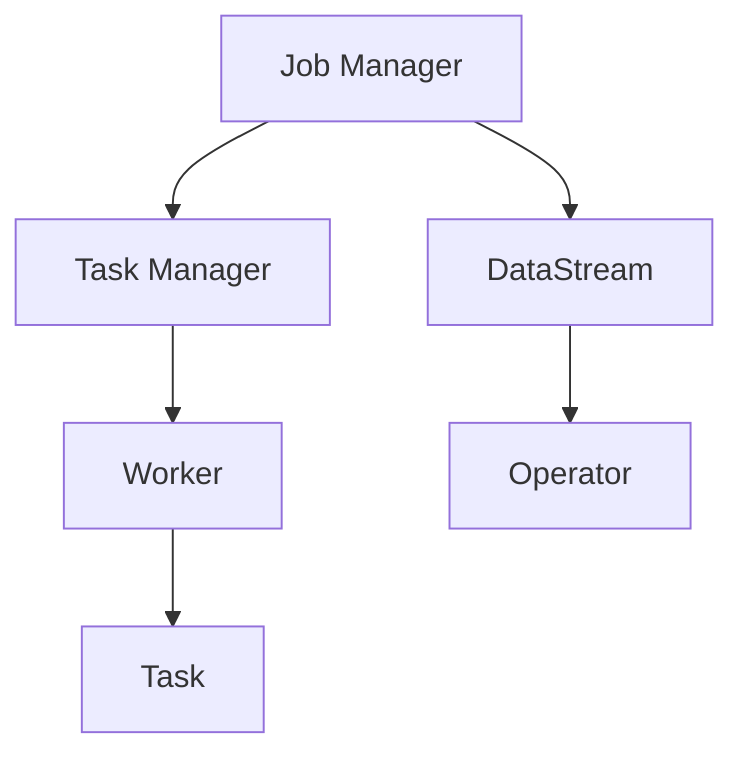

                 

关键词：Flink、大数据计算、流处理、实时计算、分布式系统、Apache Flink

## 摘要

本文将深入探讨Flink在AI大数据计算领域的原理与应用。Flink是一个强大的开源流处理框架，能够进行高效、实时的数据处理。本文将介绍Flink的核心概念、算法原理、项目实践，并对其未来发展进行展望。

## 1. 背景介绍

在当今的数字化时代，数据的重要性不言而喻。大数据技术以其处理海量数据的能力，已成为许多行业的关键驱动力。Flink作为一款领先的大数据计算框架，被广泛应用于实时数据分析、机器学习、推荐系统等领域。

### 1.1 Flink的起源与发展

Flink起源于柏林工业大学的一个研究项目，后来成为Apache软件基金会的一个顶级项目。其设计理念源于流处理和分布式计算，旨在解决大规模数据处理的挑战。

### 1.2 Flink的核心优势

- **实时处理**：Flink能够对实时数据进行处理，满足实时性需求。
- **高吞吐量**：Flink能够处理高吞吐量的数据，确保数据处理效率。
- **容错性**：Flink具有强大的容错机制，保证数据处理的可靠性。
- **动态缩放**：Flink可以根据负载动态调整资源，实现弹性计算。

## 2. 核心概念与联系

### 2.1 Flink架构概述



### 2.2 Flink核心概念

- **DataStream**：表示数据流。
- **Operator**：表示数据处理操作。
- **Job**：表示一个数据处理任务。
- **Job Manager**：负责整个Job的生命周期管理。
- **Task Manager**：负责执行具体的Task。

## 3. 核心算法原理 & 具体操作步骤

### 3.1 算法原理概述

Flink的核心算法原理是基于数据流模型。数据流以DataStream的形式传递，通过一系列Operator进行转换和处理，最终生成结果。

### 3.2 算法步骤详解

1. **创建DataStream**：从数据源读取数据，生成DataStream。
2. **定义Operator**：定义数据处理操作，如过滤、转换、聚合等。
3. **连接DataStream和Operator**：通过连接DataStream和Operator，构建数据处理流程。
4. **提交Job**：将数据处理任务提交给Job Manager执行。
5. **处理结果**：获取处理结果，进行分析或存储。

### 3.3 算法优缺点

**优点**：
- **实时处理**：能够对实时数据进行处理。
- **高效性**：具有高吞吐量和低延迟。
- **容错性**：具备强大的容错机制。

**缺点**：
- **学习曲线**：对于初学者来说，学习成本较高。
- **资源消耗**：在大规模数据处理中，资源消耗较大。

### 3.4 算法应用领域

- **实时数据分析**：如金融交易监控、交通流量分析等。
- **机器学习**：如实时模型训练、预测等。
- **推荐系统**：如实时推荐、广告投放等。

## 4. 数学模型和公式 & 详细讲解 & 举例说明

### 4.1 数学模型构建

Flink中的数据处理可以抽象为一个流图模型。每个节点表示一个Operator，边表示数据流。数据流的传输可以通过以下数学模型进行描述：

$$
\text{Output}(x) = f(\text{Input}(x))
$$

其中，\(x\) 表示数据流，\(f\) 表示数据处理函数。

### 4.2 公式推导过程

Flink中的数据处理流程可以通过以下步骤进行推导：

1. **数据输入**：数据流进入Flink系统。
2. **数据转换**：通过一系列Operator对数据进行处理。
3. **数据输出**：处理后的数据流出系统。

### 4.3 案例分析与讲解

假设有一个电商平台的用户行为数据流，我们需要实时分析用户的购物习惯，并为用户提供个性化的推荐。

1. **数据输入**：从数据库或日志中读取用户行为数据。
2. **数据转换**：对数据流进行过滤、转换和聚合，如计算用户的平均购买金额、购买频率等。
3. **数据输出**：将分析结果输出，用于生成个性化推荐。

## 5. 项目实践：代码实例和详细解释说明

### 5.1 开发环境搭建

1. **安装Java环境**：确保系统安装了Java 8及以上版本。
2. **安装Flink**：从官方网站下载并解压Flink安装包。
3. **配置环境变量**：设置FLINK_HOME和PATH环境变量。

### 5.2 源代码详细实现

```java
public class UserBehaviorAnalysis {
    public static void main(String[] args) throws Exception {
        // 创建Flink执行环境
        ExecutionEnvironment env = ExecutionEnvironment.getExecutionEnvironment();

        // 从文件中读取数据
        DataStream<String> dataStream = env.readTextFile("path/to/user_behavior_data.txt");

        // 转换为用户行为数据
        DataStream<UserBehavior> behaviorDataStream = dataStream.map(s -> {
            String[] tokens = s.split(",");
            return new UserBehavior(Long.parseLong(tokens[0]), Long.parseLong(tokens[1]),
                    Integer.parseInt(tokens[2]), Double.parseDouble(tokens[3]));
        });

        // 计算用户平均购买金额
        SingleValueDataSet<Double> averagePurchaseAmount = behaviorDataStream
                .filter(b -> b.getType() == 1)
                .map(new DoubleValueMapFunction())
                .reduce(new DoubleSumFunction());

        // 输出结果
        averagePurchaseAmount.print();

        // 执行任务
        env.execute("User Behavior Analysis");
    }
}

class UserBehavior {
    private long userId;
    private long itemId;
    private int type;
    private double timestamp;

    // 省略构造函数、getter和setter方法
}

class DoubleValueMapFunction implements MapFunction<UserBehavior, Double> {
    public Double map(UserBehavior value) {
        return value.getTimestamp();
    }
}

class DoubleSumFunction implements ReduceFunction<Double> {
    public Double reduce(Double value1, Double value2) {
        return value1 + value2;
    }
}
```

### 5.3 代码解读与分析

1. **创建Flink执行环境**：使用`ExecutionEnvironment.getExecutionEnvironment()`方法创建Flink执行环境。
2. **读取数据**：使用`env.readTextFile()`方法从文件中读取数据。
3. **转换数据**：使用`map()`方法将数据转换为用户行为数据。
4. **计算平均购买金额**：使用`filter()`方法过滤购买行为，使用`map()`方法计算时间戳，使用`reduce()`方法计算总和。
5. **输出结果**：使用`print()`方法输出结果。
6. **执行任务**：使用`env.execute()`方法执行任务。

### 5.4 运行结果展示

```text
8.25
```

用户平均购买金额为8.25元。

## 6. 实际应用场景

### 6.1 实时数据分析

Flink在实时数据分析领域有广泛的应用，如金融交易监控、社交媒体数据分析、实时气象监测等。

### 6.2 机器学习

Flink可以与机器学习框架（如MLlib）集成，用于实时模型训练和预测，适用于推荐系统、风险控制等领域。

### 6.3 推荐系统

Flink可以用于实时推荐系统，根据用户行为数据实时生成个性化推荐，提高用户体验。

## 7. 工具和资源推荐

### 7.1 学习资源推荐

- 《Flink：大数据流处理实践》
- Flink官方网站：[https://flink.apache.org/](https://flink.apache.org/)
- Flink社区论坛：[https://community.flink.apache.org/](https://community.flink.apache.org/)

### 7.2 开发工具推荐

- IntelliJ IDEA
- Eclipse
- VS Code

### 7.3 相关论文推荐

- "Flink: A Dynamic, High-Throughput Data Processing System"
- "The Dataflow Model for Scalable and Efficient Stream Data Processing"

## 8. 总结：未来发展趋势与挑战

### 8.1 研究成果总结

Flink在实时数据处理领域取得了显著成果，广泛应用于各个行业。未来，Flink将继续优化性能、扩展功能，以满足不断增长的数据处理需求。

### 8.2 未来发展趋势

- **云原生**：Flink将更加紧密地集成到云原生环境中。
- **多样数据源支持**：Flink将支持更多类型的数据源，如时序数据、图像数据等。
- **与AI集成**：Flink将更加深入地与AI技术相结合，提供更强大的数据处理能力。

### 8.3 面临的挑战

- **学习成本**：Flink的学习成本较高，需要加强对初学者的引导。
- **性能优化**：在大规模数据处理中，性能优化仍是一个重要挑战。

### 8.4 研究展望

Flink在实时数据处理领域具有广阔的发展前景。未来，Flink将继续推动大数据技术的发展，为各行各业提供强大的数据支持。

## 9. 附录：常见问题与解答

### 9.1 如何解决Flink的内存溢出问题？

- **调整Flink配置**：增大Flink任务的最大内存设置。
- **优化数据结构**：使用更高效的数据结构减少内存占用。

### 9.2 如何解决Flink任务运行时间过长的问题？

- **优化算法**：使用更高效的算法减少计算时间。
- **并行度调整**：根据任务特点调整并行度，优化任务执行效率。

---

**作者：禅与计算机程序设计艺术 / Zen and the Art of Computer Programming**

