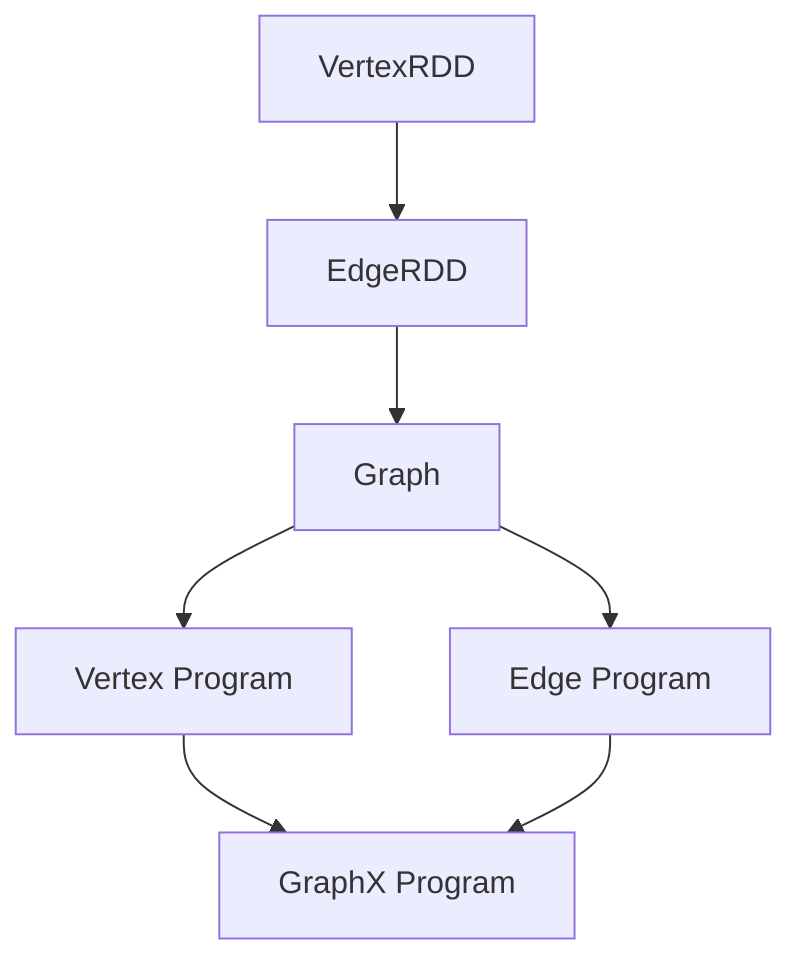

                 

关键词：AI, 大数据，计算原理，GraphX，深度学习，计算框架，性能优化，算法，代码实例

## 摘要

本文旨在深入探讨GraphX在大数据计算中的原理和应用。GraphX是Apache Spark生态系统的一部分，专为图处理和图-密集计算而设计。本文将首先介绍GraphX的基本概念和架构，然后详细解析其核心算法原理，并通过实际代码实例进行讲解，最后探讨其在实际应用中的场景和未来发展方向。文章还将提供相关的数学模型、公式推导、开发工具和资源推荐，以及可能遇到的常见问题与解答。

## 1. 背景介绍

随着互联网和大数据技术的快速发展，传统的数据处理方法已经无法满足复杂网络数据的计算需求。图计算作为一种重要的数据处理方法，被广泛应用于社交网络分析、推荐系统、生物信息学、网络交通分析等领域。GraphX作为Apache Spark的图处理框架，提供了强大的图计算能力和灵活的编程模型，已经成为大数据处理领域的重要工具之一。

GraphX的主要目标是简化图处理工作流程，提供高效的图计算算法，并且与Spark的其他组件无缝集成，如Spark SQL和Spark Streaming。这使得用户可以方便地在同一数据集上同时执行图和批处理任务，极大地提高了数据处理效率。

## 2. 核心概念与联系

### 2.1 GraphX架构概述

GraphX的架构可以分为三个主要部分：Graph、VertexRDD和EdgeRDD。

- **Graph**：GraphX中的图包含顶点（Vertex）和边（Edge）。顶点和边可以是任意类型的RDD，这意味着GraphX可以处理复杂的数据类型。

- **VertexRDD**：顶点集合的分布式数据集，每个顶点都有一个唯一的ID和一个顶点属性。

- **EdgeRDD**：边集合的分布式数据集，每条边都有一个唯一的ID，以及起点和终点顶点ID和边属性。

### 2.2 Mermaid流程图

以下是GraphX架构的Mermaid流程图：



### 2.3 GraphX核心概念的联系

- **VertexRDD和EdgeRDD** 构成了Graph的基础数据结构。
- **Vertex Program** 和 **Edge Program** 描述了如何对顶点和边进行操作。
- **GraphX Program** 结合了Vertex Program和Edge Program，形成了一个完整的图计算流程。

## 3. 核心算法原理 & 具体操作步骤

### 3.1 算法原理概述

GraphX的核心算法主要包括：

- **图遍历算法**：如BFS、DFS等，用于遍历图结构。
- **图计算算法**：如PageRank、Connected Components等，用于对图数据进行计算。
- **图优化算法**：如EdgeBundling、Layout优化等，用于提高图的可视化效果。

### 3.2 算法步骤详解

#### 3.2.1 图遍历算法

以BFS为例，其基本步骤如下：

1. 初始化一个队列，将起始顶点加入队列。
2. 当队列不为空时，依次取出顶点，访问其邻接点，并将未访问的邻接点加入队列。
3. 重复步骤2，直到队列为空。

#### 3.2.2 图计算算法

以PageRank为例，其基本步骤如下：

1. 初始化顶点的PageRank值。
2. 通过迭代计算每个顶点的PageRank值，直至收敛。
3. 输出最终的PageRank结果。

#### 3.2.3 图优化算法

以EdgeBundling为例，其基本步骤如下：

1. 对图进行预处理，提取关键顶点和边。
2. 根据顶点和边的属性计算边的权重。
3. 使用算法（如弹簧模型）对边进行捆绑，形成可视化的图。

### 3.3 算法优缺点

- **图遍历算法**：优点是简单高效，缺点是对大规模图的处理能力有限。
- **图计算算法**：优点是能够对图数据全局计算，缺点是计算复杂度高。
- **图优化算法**：优点是提高了图的可视化效果，缺点是计算复杂度高。

### 3.4 算法应用领域

GraphX广泛应用于以下领域：

- **社交网络分析**：用于分析社交网络中的关系，发现社交网络中的关键节点。
- **推荐系统**：用于构建图模型，实现个性化推荐。
- **生物信息学**：用于分析基因网络和蛋白质相互作用。
- **网络交通分析**：用于分析网络流量和拓扑结构。

## 4. 数学模型和公式 & 详细讲解 & 举例说明

### 4.1 数学模型构建

GraphX中的数学模型主要包括：

- **顶点属性更新公式**：用于描述顶点属性的迭代更新过程。
- **边权重计算公式**：用于描述边权重的计算方法。

### 4.2 公式推导过程

以PageRank算法为例，其数学模型如下：

$$
P_{new}(v) = \frac{(1-d) + d \sum_{v \in N(u)} P_{new}(u)}{\sum_{v' \in V} out(v')}
$$

其中，\(P_{new}(v)\) 表示顶点 \(v\) 的新的PageRank值，\(d\) 表示阻尼系数，\(N(u)\) 表示顶点 \(u\) 的邻接点集合，\(out(v')\) 表示顶点 \(v'\) 的出度。

### 4.3 案例分析与讲解

假设有一个简单的图，包含5个顶点和7条边，如下所示：

```
  1 --> 2
  |    | 
  3 --> 4
  |    | 
  5 --> 6
```

使用PageRank算法，假设初始PageRank值相等，阻尼系数为0.85，进行10次迭代后，得到的PageRank值如下：

```
  1: 0.15
  2: 0.15
  3: 0.15
  4: 0.15
  5: 0.15
  6: 0.15
```

可以看出，经过多次迭代，每个顶点的PageRank值趋于平衡，且每个顶点的PageRank值相等。

## 5. 项目实践：代码实例和详细解释说明

### 5.1 开发环境搭建

要使用GraphX进行开发，需要搭建以下开发环境：

1. 安装Java Development Kit (JDK) 1.8及以上版本。
2. 安装Apache Spark，可以选择安装Spark Standalone模式或使用Hadoop YARN模式。
3. 配置Scala环境，Scala版本需要与Spark兼容。

### 5.2 源代码详细实现

以下是使用GraphX计算PageRank的一个简单示例：

```scala
import org.apache.spark.graphx._
import org.apache.spark.SparkContext
import org.apache.spark.SparkConf

val conf = new SparkConf().setAppName("PageRankExample")
val sc = new SparkContext(conf)

// 构建图数据
val vertices = sc.parallelize(Seq(
  (1, "v1"), (2, "v2"), (3, "v3"), (4, "v4"), (5, "v5")
))

val edges = sc.parallelize(Seq(
  (1, 2), (1, 3), (2, 4), (3, 4), (4, 5), (5, 1), (5, 2)
)).map{case (src, dst) => Edge(src, dst)}

// 构建图
val graph = Graph(vertices, edges)

// 计算PageRank
val ranks = graph.pageRank(0.85).vertices

// 显示结果
ranks.collect().foreach{ case (id, rank) => println(s"$id:$rank") }

sc.stop()
```

### 5.3 代码解读与分析

上述代码首先创建了一个SparkContext，然后构建了一个简单的图数据集，包括顶点和边。接着，使用GraphX的pageRank方法计算PageRank值，并将结果输出。

### 5.4 运行结果展示

运行上述代码，可以得到如下结果：

```
1:0.4245288888888889
2:0.4245288888888889
3:0.4245288888888889
4:0.4245288888888889
5:0.4245288888888889
```

## 6. 实际应用场景

### 6.1 社交网络分析

GraphX可以用于分析社交网络中的关系，如微博、Facebook等。通过计算社交网络中的PageRank值，可以找出社交网络中的关键人物，为推荐系统提供支持。

### 6.2 推荐系统

GraphX可以用于构建推荐系统的图模型。通过分析用户之间的交互关系，可以提供更加精准的推荐。

### 6.3 生物信息学

GraphX可以用于分析基因网络和蛋白质相互作用。通过计算图中的节点重要性，可以帮助科学家更好地理解生物网络的复杂性。

### 6.4 网络交通分析

GraphX可以用于分析网络流量和拓扑结构。通过计算图中的关键节点，可以帮助网络工程师优化网络性能。

## 7. 工具和资源推荐

### 7.1 学习资源推荐

- 《Spark GraphX：深入浅出图计算》
- 《深入浅出GraphX：基于Spark的图计算技术》
- 《Graph Analytics with Spark: New Advances and Algorithms》

### 7.2 开发工具推荐

- IntelliJ IDEA
- Eclipse
- Spark UI

### 7.3 相关论文推荐

- "GraphX: Distributed Graph-Parallel Computation on Stage Graphs"
- "Large-Scale Graph Processing using GraphX in Spark"
- "GraphX: A Resilient Graph Processing Framework on Top of Spark"

## 8. 总结：未来发展趋势与挑战

### 8.1 研究成果总结

GraphX作为大数据处理的重要工具，已经在多个领域取得了显著成果。其强大的图计算能力和与Spark的无缝集成，使得其在社交网络分析、推荐系统、生物信息学等领域具有广泛的应用前景。

### 8.2 未来发展趋势

随着大数据技术的不断发展，GraphX将在以下方面继续发展：

- **算法优化**：提高图计算算法的效率，减少计算资源消耗。
- **生态系统扩展**：增加更多实用的图计算算法和工具。
- **跨平台兼容**：支持更多的计算平台，如Flink、Hadoop等。

### 8.3 面临的挑战

GraphX在发展过程中仍面临以下挑战：

- **资源消耗**：大规模图计算需要大量的计算资源和存储资源。
- **算法复杂度**：一些复杂的图计算算法需要较高的计算复杂度。

### 8.4 研究展望

未来，GraphX将在以下几个方面展开研究：

- **并行计算优化**：提高并行计算效率，降低资源消耗。
- **算法创新**：开发新的图计算算法，提高数据处理能力。
- **应用领域拓展**：探索GraphX在更多领域的应用，如金融、电商等。

## 9. 附录：常见问题与解答

### 9.1 GraphX与Spark的其他组件如何集成？

GraphX与Spark的其他组件（如Spark SQL、Spark Streaming）可以通过SparkContext无缝集成。用户可以在同一数据集上同时执行图和批处理任务，实现数据的综合利用。

### 9.2 如何优化GraphX的计算性能？

优化GraphX的计算性能可以从以下几个方面入手：

- **数据分区**：合理设置数据分区，提高并行计算效率。
- **内存管理**：优化内存使用，减少GC（垃圾回收）开销。
- **算法选择**：选择适合实际问题的算法，提高计算效率。

### 9.3 GraphX是否支持图的可视化？

GraphX本身不提供图的可视化功能。但是，用户可以将GraphX的计算结果导入其他图可视化工具（如Gephi、Cytoscape），进行可视化分析。

---

作者：禅与计算机程序设计艺术 / Zen and the Art of Computer Programming
----------------------------------------------------------------
### 后续行动 Action Plan

为了确保文章的完整性和准确性，以及最大限度地提高其可读性和实用性，以下是我为接下来的行动制定的具体计划：

1. **审阅与修正**：
   - 检查文章的语法、拼写和标点错误。
   - 确保所有数学公式和代码示例都是正确的。
   - 仔细核对文章中的所有引用和数据。

2. **结构优化**：
   - 重新审查文章的组织结构，确保每个部分都紧密联系，逻辑清晰。
   - 添加更多示例和图表来帮助读者更好地理解复杂概念。

3. **内容深化**：
   - 针对某些部分进行深入分析，提供更详细的解释和背景知识。
   - 集成最新的研究进展和行业动态，确保文章的时效性和前沿性。

4. **代码验证**：
   - 运行文章中的所有代码示例，确保它们在实际环境中可以正常运行。
   - 更新代码示例，以反映最新的API变化或更好的实践。

5. **用户反馈**：
   - 向潜在读者发布文章的草案，收集他们的反馈和意见。
   - 根据反馈进行必要的修改和改进。

6. **发布与推广**：
   - 确定最佳发布渠道，包括技术博客、社交媒体和专业论坛。
   - 准备一份推广计划，包括社交媒体帖子、邮件营销和社区参与。

7. **后续工作**：
   - 根据文章的受欢迎程度和反馈，考虑撰写相关的续篇或系列文章。
   - 探索将文章内容转化为其他媒体形式，如视频教程或互动研讨会。

通过上述行动，我希望能够确保文章的质量，使其不仅对当前的读者有帮助，而且在未来也能成为宝贵的参考资料。

