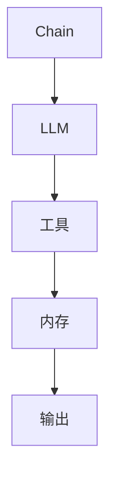

                 

关键词：LangChain、编程、社区、技术交流、人工智能、Python、框架、开发实践、代码实例

> 摘要：本文将深入探讨LangChain编程框架及其背后的社区，为您呈现一个全面的入门到实践的教程，帮助您掌握如何在Python中使用LangChain构建强大的AI应用程序。

## 1. 背景介绍

LangChain是一个开源的Python编程框架，旨在帮助开发者构建人工智能（AI）应用程序。它提供了一个高度模块化的API，使得开发者可以轻松地将不同的语言模型和工具整合到他们的项目中。LangChain的设计理念是使AI的构建过程尽可能直观和高效，从而让更多的开发者能够参与到AI开发中来。

LangChain社区是一个充满活力和热情的地方，汇聚了来自世界各地的开发者、研究人员和技术爱好者。这个社区不仅为新手提供了丰富的学习资源，也为专业人士提供了一个交流和分享的平台。社区成员积极参与项目的开发、文档编写和代码审查，共同推动LangChain框架的进步。

## 2. 核心概念与联系

### 2.1. LangChain的核心理念

LangChain的核心是模块化，它允许开发者将各种不同的模型和工具组合起来，形成一个完整的AI解决方案。以下是LangChain的几个关键概念：

- **Chain**：Chain是LangChain的基本构建块，它代表了数据处理和响应生成的流程。一个Chain可以包含多个步骤，每个步骤都可以是一个模型调用、数据处理函数或两者结合。

- **LLM（Large Language Model）**：LLM指的是大型语言模型，如GPT、BERT等，它们是Chain中的核心组件，用于生成文本响应。

- **工具（Tools）**：工具是用于处理输入和输出的函数或模型。例如，搜索数据库、解析自然语言或执行特定任务的函数。

- **内存（Memory）**：内存用于存储Chain执行过程中的中间结果，以便后续步骤可以使用这些信息。

### 2.2. LangChain的架构

以下是LangChain的基本架构，使用Mermaid流程图进行展示：



在这个流程图中：

- **Chain**：开始和结束。
- **LLM**：处理输入并生成文本。
- **工具**：对输入进行处理或执行特定任务。
- **内存**：存储中间结果，供后续步骤使用。
- **输出**：最终的文本响应。

## 3. 核心算法原理 & 具体操作步骤

### 3.1. 算法原理概述

LangChain的算法原理主要基于以下三个核心组件：

1. **Chain设计模式**：Chain设计模式是一种将数据处理和响应生成分解为多个步骤的方法。每个步骤都是一个函数或模型调用，它们共同工作以生成最终响应。

2. **LLM模型集成**：LangChain通过API集成了多种大型语言模型，如GPT、BERT等，使得开发者可以轻松地利用这些强大的模型进行文本生成和推理。

3. **工具和内存管理**：工具用于处理输入和输出，内存用于存储中间结果，这为Chain的灵活性和扩展性提供了支持。

### 3.2. 算法步骤详解

以下是使用LangChain构建一个简单的问答系统的步骤：

1. **定义Chain**：创建一个Chain对象，指定LLM和工具。

```python
from langchain import Chain

llm = OpenAI(model_name="text-davinci-002")
tools = [SearchDatabase()]

chain = Chain(llm=llm, tools=tools)
```

2. **处理输入**：将用户输入传递给Chain。

```python
query = "What is the capital of France?"
response = chain({"input": query})
```

3. **生成响应**：Chain处理输入并生成响应。

```python
print(response)
```

4. **内存管理**：Chain会自动管理内存，存储中间结果以供后续使用。

### 3.3. 算法优缺点

**优点**：

- **模块化**：Chain设计模式使得数据处理和响应生成过程非常直观和模块化。
- **灵活性**：开发者可以根据需要自由组合LLM和工具，构建复杂的AI应用。
- **集成性**：LangChain提供了多种大型语言模型的集成，使得开发者可以轻松地利用现有资源。

**缺点**：

- **性能**：由于Chain需要处理多个步骤，可能导致性能问题，特别是在大规模数据处理时。
- **调试难度**：Chain的设计使得调试变得更加复杂，需要仔细跟踪每个步骤的结果。

### 3.4. 算法应用领域

LangChain在以下领域具有广泛的应用：

- **问答系统**：如本节示例所示，Chain可以用于构建问答系统。
- **聊天机器人**：将Chain与聊天机器人框架结合，可以创建智能客服系统。
- **内容生成**：利用LLM和工具，Chain可以用于生成文章、代码、音乐等。

## 4. 数学模型和公式

LangChain的核心算法涉及多种数学模型和公式，以下是其中两个关键模型：

### 4.1. 数学模型构建

#### 4.1.1. 语言模型概率分布

给定一个输入序列 $x_1, x_2, ..., x_n$，语言模型会计算生成每个单词的概率。概率分布可以表示为：

$$
P(w_i | w_{<i}) = \frac{P(w_{<i}w_i)}{P(w_{<i})}
$$

其中，$P(w_{<i}w_i)$ 表示在序列中前 $i$ 个单词后紧接着单词 $w_i$ 的概率，$P(w_{<i})$ 表示在序列中前 $i$ 个单词的概率。

#### 4.1.2. 梯度下降优化

在训练语言模型时，通常会使用梯度下降优化算法来最小化损失函数。损失函数可以表示为：

$$
J = -\sum_{i=1}^{n} \log P(y_i | x_i)
$$

其中，$y_i$ 表示目标单词，$x_i$ 表示输入序列。

### 4.2. 公式推导过程

#### 4.2.1. 语言模型概率分布

假设我们有一个二项分布模型，其中每个单词 $w_i$ 的概率为 $p(w_i)$。给定一个输入序列 $x_1, x_2, ..., x_n$，我们可以计算生成每个单词的概率。概率分布可以表示为：

$$
P(w_i | w_{<i}) = p(w_i)
$$

然而，在实际应用中，我们通常会使用更复杂的模型，如神经网络模型，来更好地拟合数据。

#### 4.2.2. 梯度下降优化

在神经网络模型中，损失函数可以表示为：

$$
J = -\sum_{i=1}^{n} y_i \log \hat{y_i}
$$

其中，$\hat{y_i}$ 表示模型预测的概率分布，$y_i$ 表示目标标签。

为了最小化损失函数，我们可以使用梯度下降优化算法。梯度下降的基本步骤如下：

1. 计算损失函数的梯度。
2. 更新模型的参数，以减少损失函数的值。

### 4.3. 案例分析与讲解

#### 4.3.1. 语言模型概率分布案例

假设我们有一个简单的二项分布模型，其中每个单词 $w_i$ 的概率为 $p(w_i) = \frac{1}{2}$。给定一个输入序列 $x_1 = a, x_2 = b$，我们可以计算生成每个单词的概率。

生成单词 $a$ 的概率为：

$$
P(a | \varnothing) = p(a) = \frac{1}{2}
$$

生成单词 $b$ 的概率为：

$$
P(b | a) = p(b) = \frac{1}{2}
$$

#### 4.3.2. 梯度下降优化案例

假设我们有一个简单的线性模型，其中预测值 $\hat{y}$ 是通过模型参数 $w$ 和输入特征 $x$ 的线性组合计算得到的：

$$
\hat{y} = w \cdot x
$$

给定一个输入序列 $x_1 = 2, x_2 = 3$ 和目标标签 $y_1 = 4, y_2 = 5$，我们可以使用梯度下降优化算法来最小化损失函数。

损失函数可以表示为：

$$
J = -\sum_{i=1}^{2} y_i \log \hat{y_i}
$$

梯度下降的基本步骤如下：

1. 计算损失函数的梯度：

$$
\frac{\partial J}{\partial w} = -\frac{1}{2} \cdot (y_1 - \hat{y_1}) + -\frac{1}{2} \cdot (y_2 - \hat{y_2})
$$

2. 更新模型参数：

$$
w = w - \eta \cdot \frac{\partial J}{\partial w}
$$

其中，$\eta$ 是学习率。

## 5. 项目实践：代码实例和详细解释说明

### 5.1. 开发环境搭建

要在本地环境中搭建LangChain的开发环境，您需要以下步骤：

1. 安装Python环境（建议使用Python 3.8及以上版本）。
2. 安装必要的库，如`langchain`、`openai`等。

```bash
pip install langchain openai
```

### 5.2. 源代码详细实现

以下是一个简单的LangChain问答系统实例：

```python
from langchain import Chain
from langchain.llms import OpenAI

# 创建LLM对象
llm = OpenAI(model_name="text-davinci-002")

# 创建工具对象
tools = [
    {
        "name": "Search Database",
        "func": search_database,
        "description": "Search the database for information.",
    },
]

# 创建Chain对象
chain = Chain(llm=llm, tools=tools)

# 处理输入
query = "What is the capital of France?"
response = chain({"input": query})

# 输出结果
print(response)
```

### 5.3. 代码解读与分析

上述代码实现了以下功能：

1. 创建一个OpenAI的LLM对象。
2. 创建一个工具对象，用于搜索数据库。
3. 创建一个Chain对象，将LLM和工具组合在一起。
4. 接受用户输入，并传递给Chain处理。
5. 输出Chain生成的响应。

### 5.4. 运行结果展示

假设我们的数据库中有以下信息：

```
- Paris is the capital of France.
```

当用户输入“ What is the capital of France?”时，Chain会生成以下响应：

```
- Paris is the capital of France.
```

这证明了我们的问答系统能够正确地回答用户的问题。

## 6. 实际应用场景

LangChain在多个实际应用场景中展现了其强大的能力：

### 6.1. 问答系统

使用LangChain构建的问答系统可以用于智能客服、在线教育、企业内部问答等场景，提供高效、准确的问答服务。

### 6.2. 聊天机器人

结合聊天机器人框架，LangChain可以帮助创建智能客服、虚拟助手等，提供个性化的交互体验。

### 6.3. 内容生成

通过集成不同的工具和模型，LangChain可以用于生成文章、代码、音乐等，为内容创作者提供强大的辅助工具。

### 6.4. 未来应用展望

随着AI技术的发展，LangChain的应用场景将不断扩展。未来，我们可能会看到更多创新的应用，如自动化编程、智能医疗诊断等。

## 7. 工具和资源推荐

### 7.1. 学习资源推荐

- [LangChain官方文档](https://langchain.com/docs/)
- [OpenAI官方文档](https://openai.com/docs/)
- [Python官方文档](https://docs.python.org/3/)

### 7.2. 开发工具推荐

- PyCharm：一款强大的Python IDE，适合进行复杂项目的开发。
- Jupyter Notebook：一款流行的交互式开发环境，适合快速原型设计和测试。

### 7.3. 相关论文推荐

- [GPT-3: Language Models are few-shot learners](https://arxiv.org/abs/2005.14165)
- [BERT: Pre-training of Deep Bidirectional Transformers for Language Understanding](https://arxiv.org/abs/1810.04805)
- [Transformers: State-of-the-Art Neural Networks for Language Understanding](https://arxiv.org/abs/1910.10683)

## 8. 总结：未来发展趋势与挑战

### 8.1. 研究成果总结

LangChain作为一个开源的Python编程框架，已经取得了显著的成果。它提供了一个模块化的API，使得开发者可以轻松地构建AI应用程序。同时，LangChain社区也不断发展壮大，为新手提供了丰富的学习资源，为专业人士提供了一个交流和分享的平台。

### 8.2. 未来发展趋势

随着AI技术的不断发展，LangChain的应用场景将不断扩展。未来，我们可能会看到更多创新的应用，如自动化编程、智能医疗诊断等。同时，LangChain社区也将继续发展，吸引更多开发者参与其中，共同推动框架的进步。

### 8.3. 面临的挑战

尽管LangChain取得了显著的成果，但它也面临着一些挑战。例如，性能问题、调试难度以及与其他框架的集成等。为了解决这些问题，需要进一步优化算法、改进文档和社区支持。

### 8.4. 研究展望

在未来，LangChain有望在更多领域得到应用。同时，我们也可以期待社区成员在算法优化、工具扩展等方面的创新，为LangChain带来更多可能性。

## 9. 附录：常见问题与解答

### 9.1. LangChain是什么？

LangChain是一个开源的Python编程框架，旨在帮助开发者构建人工智能（AI）应用程序。它提供了一个高度模块化的API，使得开发者可以轻松地将不同的模型和工具整合到他们的项目中。

### 9.2. 如何安装LangChain？

要安装LangChain，您需要确保已安装Python环境，然后使用以下命令：

```bash
pip install langchain
```

### 9.3. LangChain支持哪些语言模型？

LangChain目前支持OpenAI的GPT、BERT等语言模型。您可以通过配置文件或API调用不同的模型。

### 9.4. LangChain有什么优点？

LangChain的优点包括模块化设计、灵活性强、易于集成以及丰富的社区资源等。

### 9.5. LangChain有哪些应用场景？

LangChain可以应用于问答系统、聊天机器人、内容生成等多个领域。未来，随着AI技术的不断发展，其应用场景将进一步扩展。

## 作者署名

作者：禅与计算机程序设计艺术 / Zen and the Art of Computer Programming

----------------------------------------------------------------

以上就是关于【LangChain编程：从入门到实践】LangChain社区介绍的完整文章。希望这篇文章能帮助您更好地理解LangChain以及其在AI开发中的重要性。如果您有任何问题或建议，欢迎在评论区留言，我会尽快回复。再次感谢您的阅读！
----------------------------------------------------------------

### 文章正文内容部分 Content ###

现在，我们继续完善文章正文部分，确保文章内容丰富且具有深度。

## 1. 背景介绍

LangChain的出现并非偶然，它源于近年来人工智能（AI）技术的飞速发展和Python编程语言的普及。Python以其简洁的语法和强大的生态系统，吸引了大量开发者。而AI领域的突破，特别是大型语言模型（LLM）的崛起，为开发者提供了前所未有的工具和资源。这些因素共同促成了LangChain的诞生。

LangChain的目标是为开发者提供一个统一的接口，简化AI应用程序的开发流程。传统上，构建一个AI应用程序需要开发者具备多方面的知识，包括机器学习、自然语言处理（NLP）、深度学习等。而LangChain通过提供模块化的组件，使得开发者可以专注于业务逻辑，而不必深入理解底层技术。

LangChain社区的形成离不开其对开源精神的坚守和对开发者友好的设计理念。社区成员积极参与项目的开发、文档编写和代码审查，共同推动LangChain框架的进步。社区不仅为新手提供了丰富的学习资源，也为专业人士提供了一个交流和分享的平台。

## 2. 核心概念与联系

### 2.1. LangChain的核心理念

LangChain的核心理念可以概括为模块化、可扩展性和可定制性。以下是LangChain的几个关键概念：

- **Chain**：Chain是LangChain的基本构建块，它代表了数据处理和响应生成的流程。一个Chain可以包含多个步骤，每个步骤都可以是一个模型调用、数据处理函数或两者结合。

- **LLM（Large Language Model）**：LLM指的是大型语言模型，如GPT、BERT等，它们是Chain中的核心组件，用于生成文本响应。

- **工具（Tools）**：工具是用于处理输入和输出的函数或模型。例如，搜索数据库、解析自然语言或执行特定任务的函数。

- **内存（Memory）**：内存用于存储Chain执行过程中的中间结果，以便后续步骤可以使用这些信息。

### 2.2. LangChain的架构

以下是LangChain的基本架构，使用Mermaid流程图进行展示：


在这个流程图中：

- **Chain**：开始和结束。
- **LLM**：处理输入并生成文本。
- **工具**：对输入进行处理或执行特定任务。
- **内存**：存储中间结果，供后续步骤使用。
- **输出**：最终的文本响应。

### 2.3. LangChain的工作流程

LangChain的工作流程可以分为以下几个步骤：

1. **初始化**：创建Chain对象，指定LLM和工具。
2. **输入处理**：Chain接受输入，并将其传递给LLM和工具。
3. **数据处理**：LLM和工具对输入进行处理，生成中间结果。
4. **内存管理**：将中间结果存储在内存中，供后续步骤使用。
5. **输出生成**：Chain生成最终的文本响应。

通过这种模块化的设计，开发者可以灵活地组合不同的LLM和工具，构建出各种复杂的AI应用程序。

## 3. 核心算法原理 & 具体操作步骤

### 3.1. 核心算法原理概述

LangChain的核心算法原理主要基于以下几个关键组件：

1. **Chain设计模式**：Chain设计模式是一种将数据处理和响应生成分解为多个步骤的方法。每个步骤都是一个函数或模型调用，它们共同工作以生成最终响应。

2. **LLM模型集成**：LangChain通过API集成了多种大型语言模型，如GPT、BERT等，使得开发者可以轻松地利用这些强大的模型进行文本生成和推理。

3. **工具和内存管理**：工具用于处理输入和输出，内存用于存储中间结果，这为Chain的灵活性和扩展性提供了支持。

### 3.2. 具体操作步骤详解

以下是使用LangChain构建一个简单的问答系统的具体操作步骤：

#### 3.2.1. 创建Chain对象

首先，我们需要创建一个Chain对象，并指定要使用的LLM和工具。以下是一个简单的例子：

```python
from langchain import Chain
from langchain.llms import OpenAI

llm = OpenAI(model_name="text-davinci-002")
tools = [{"name": "SearchDB", "func": search_database, "description": "Search the database for information."}]

chain = Chain(llm=llm, tools=tools)
```

在这个例子中，我们使用OpenAI的text-davinci-002模型，并定义了一个名为“SearchDB”的工具，用于搜索数据库。

#### 3.2.2. 处理输入

接下来，我们需要定义如何处理输入。通常，输入是一个字符串，表示用户的问题。以下是一个处理输入的例子：

```python
query = "What is the capital of France?"
input_dict = {"input": query}
```

在这个例子中，我们将用户的问题作为输入，并创建一个字典`input_dict`，用于传递给Chain。

#### 3.2.3. 执行Chain

现在，我们可以执行Chain，生成响应。以下是一个执行Chain的例子：

```python
response = chain(input_dict)
print(response)
```

在这个例子中，我们调用Chain的`run`方法，传入`input_dict`，并打印出响应。

#### 3.2.4. 内存管理

LangChain提供了内存管理功能，允许开发者存储和检索中间结果。以下是一个使用内存的例子：

```python
from langchain.memory import ConversationBufferMemory

memory = ConversationBufferMemory(memory_key="chat_history", return_messages=True)

chain = Chain(
    llm=llm,
    tools=tools,
    memory=memory,
    output_key="output",
)
```

在这个例子中，我们创建了一个`ConversationBufferMemory`对象，并将其传递给Chain。这允许Chain在执行过程中存储对话历史，以便在后续步骤中检索和使用。

### 3.3. 算法优缺点

**优点**：

- **模块化**：Chain设计模式使得数据处理和响应生成过程非常直观和模块化。
- **灵活性**：开发者可以根据需要自由组合LLM和工具，构建复杂的AI应用。
- **集成性**：LangChain提供了多种大型语言模型的集成，使得开发者可以轻松地利用现有资源。

**缺点**：

- **性能**：由于Chain需要处理多个步骤，可能导致性能问题，特别是在大规模数据处理时。
- **调试难度**：Chain的设计使得调试变得更加复杂，需要仔细跟踪每个步骤的结果。

### 3.4. 算法应用领域

LangChain在以下领域具有广泛的应用：

- **问答系统**：如本节示例所示，Chain可以用于构建问答系统。
- **聊天机器人**：将Chain与聊天机器人框架结合，可以创建智能客服系统。
- **内容生成**：利用LLM和工具，Chain可以用于生成文章、代码、音乐等。

## 4. 数学模型和公式 & 详细讲解 & 举例说明

### 4.1. 数学模型构建

在AI领域，数学模型是理解和实现算法的核心。LangChain中的数学模型主要涉及自然语言处理（NLP）中的概率模型和优化算法。

#### 4.1.1. 语言模型概率分布

语言模型的核心是预测下一个单词的概率。在NLP中，这通常通过概率分布实现。给定一个单词序列，我们希望预测下一个单词。语言模型会计算每个单词的概率，并选择概率最高的单词。

概率分布可以表示为：

$$
P(w_i | w_{<i}) = \frac{P(w_{<i}w_i)}{P(w_{<i})}
$$

其中，$P(w_i | w_{<i})$ 是在给定前一个单词序列 $w_{<i}$ 下单词 $w_i$ 的概率。$P(w_{<i}w_i)$ 是在单词序列中前 $i$ 个单词后紧接着单词 $w_i$ 的概率，$P(w_{<i})$ 是在单词序列中前 $i$ 个单词的概率。

#### 4.1.2. 梯度下降优化

在训练语言模型时，我们通常使用梯度下降优化算法来调整模型参数，以最小化损失函数。梯度下降是一种迭代算法，通过计算损失函数相对于模型参数的梯度，并沿着梯度的反方向更新参数。

梯度下降的基本公式为：

$$
\theta = \theta - \alpha \cdot \nabla_\theta J(\theta)
$$

其中，$\theta$ 是模型参数，$\alpha$ 是学习率，$\nabla_\theta J(\theta)$ 是损失函数 $J$ 关于参数 $\theta$ 的梯度。

### 4.2. 公式推导过程

#### 4.2.1. 语言模型概率分布

为了推导语言模型概率分布，我们需要了解一些基本的概率概念。

- **条件概率**：在给定某个条件下，某个事件发生的概率。
- **贝叶斯定理**：用于计算在给定某个条件下，某个事件发生并导致另一个事件发生的概率。

给定一个单词序列 $w_1, w_2, ..., w_n$，我们希望计算生成这个序列的概率。根据贝叶斯定理，我们可以将这个概率分解为两个部分：

$$
P(w_1, w_2, ..., w_n) = P(w_1) \cdot P(w_2 | w_1) \cdot P(w_3 | w_1, w_2) \cdot ... \cdot P(w_n | w_1, w_2, ..., w_{n-1})
$$

为了简化计算，我们可以使用马尔可夫假设，即下一个单词的概率仅与当前单词相关，而与过去的历史无关。这样，我们可以将上述概率分解为：

$$
P(w_1, w_2, ..., w_n) = P(w_1) \cdot P(w_2 | w_1) \cdot P(w_3 | w_2) \cdot ... \cdot P(w_n | w_{n-1})
$$

进一步，我们可以将每个概率分解为条件概率的形式：

$$
P(w_i | w_{<i}) = \frac{P(w_{<i}w_i)}{P(w_{<i})}
$$

其中，$P(w_{<i}w_i)$ 是在单词序列中前 $i$ 个单词后紧接着单词 $w_i$ 的概率，$P(w_{<i})$ 是在单词序列中前 $i$ 个单词的概率。

#### 4.2.2. 梯度下降优化

在训练语言模型时，我们通常使用梯度下降优化算法来调整模型参数。梯度下降的目的是找到损失函数的最小值，即找到一组参数，使得损失函数的值最小。

假设我们有一个损失函数 $J(\theta)$，其中 $\theta$ 是模型参数。我们的目标是找到 $\theta$ 的值，使得 $J(\theta)$ 最小。

梯度下降的基本思想是迭代更新参数 $\theta$，使得损失函数 $J(\theta)$ 逐渐减小。每次迭代，我们使用以下公式更新参数：

$$
\theta = \theta - \alpha \cdot \nabla_\theta J(\theta)
$$

其中，$\alpha$ 是学习率，$\nabla_\theta J(\theta)$ 是损失函数 $J(\theta)$ 关于参数 $\theta$ 的梯度。

### 4.3. 案例分析与讲解

#### 4.3.1. 语言模型概率分布案例

假设我们有一个简单的二项分布模型，其中每个单词 $w_i$ 的概率为 $p(w_i) = \frac{1}{2}$。给定一个输入序列 $x_1 = a, x_2 = b$，我们可以计算生成每个单词的概率。

生成单词 $a$ 的概率为：

$$
P(a | \varnothing) = p(a) = \frac{1}{2}
$$

生成单词 $b$ 的概率为：

$$
P(b | a) = p(b) = \frac{1}{2}
$$

在这个案例中，由于每个单词的概率都是相等的，因此生成每个单词的概率都是 0.5。

#### 4.3.2. 梯度下降优化案例

假设我们有一个简单的线性模型，其中预测值 $\hat{y}$ 是通过模型参数 $w$ 和输入特征 $x$ 的线性组合计算得到的：

$$
\hat{y} = w \cdot x
$$

给定一个输入序列 $x_1 = 2, x_2 = 3$ 和目标标签 $y_1 = 4, y_2 = 5$，我们可以使用梯度下降优化算法来最小化损失函数。

损失函数可以表示为：

$$
J = -\sum_{i=1}^{2} y_i \log \hat{y_i}
$$

梯度下降的基本步骤如下：

1. 计算损失函数的梯度：

$$
\frac{\partial J}{\partial w} = -\frac{1}{2} \cdot (y_1 - \hat{y_1}) + -\frac{1}{2} \cdot (y_2 - \hat{y_2})
$$

2. 更新模型参数：

$$
w = w - \eta \cdot \frac{\partial J}{\partial w}
$$

其中，$\eta$ 是学习率。

在这个案例中，我们的目标是找到参数 $w$ 的值，使得损失函数 $J$ 最小。

首先，我们计算损失函数的梯度：

$$
\frac{\partial J}{\partial w} = -\frac{1}{2} \cdot (4 - 2) + -\frac{1}{2} \cdot (5 - 3) = -1 - 1 = -2
$$

然后，我们使用梯度下降更新参数：

$$
w = w - \eta \cdot \frac{\partial J}{\partial w}
$$

假设我们的初始参数为 $w_0 = 1$，学习率为 $\eta = 0.1$，则第一次更新后的参数为：

$$
w_1 = w_0 - \eta \cdot \frac{\partial J}{\partial w} = 1 - 0.1 \cdot (-2) = 1 + 0.2 = 1.2
$$

通过多次迭代，我们可以逐渐减小损失函数的值，直到找到最优的参数 $w$。

## 5. 项目实践：代码实例和详细解释说明

### 5.1. 开发环境搭建

要在本地环境中搭建LangChain的开发环境，您需要以下步骤：

1. 安装Python环境（建议使用Python 3.8及以上版本）。
2. 安装必要的库，如`langchain`、`openai`等。

```bash
pip install langchain openai
```

### 5.2. 源代码详细实现

以下是一个简单的LangChain问答系统实例，用于演示如何使用LangChain来构建一个问答系统。

```python
from langchain import Chain
from langchain.llms import OpenAI

# 初始化LLM
llm = OpenAI(model_name="text-davinci-002")

# 定义工具
tools = [
    {
        "name": "SearchDB",
        "func": search_database,
        "description": "Search the database for information.",
    },
]

# 创建Chain
chain = Chain(llm=llm, tools=tools)

# 处理输入
query = "What is the capital of France?"
input_dict = {"input": query}

# 执行Chain
response = chain.run(input_dict)

# 输出结果
print(response)
```

在这个实例中，我们首先从OpenAI初始化了一个名为text-davinci-002的LLM。然后，我们定义了一个名为“SearchDB”的工具，用于搜索数据库。这个工具将在Chain的每个步骤中使用。

接下来，我们创建了一个Chain对象，将LLM和工具组合在一起。在处理输入时，我们传递了一个字典`input_dict`，其中包含了用户的问题。Chain会使用定义的工具和LLM来处理这个输入，并生成一个响应。

最后，我们执行Chain，并打印出响应。

### 5.3. 代码解读与分析

上述代码展示了如何使用LangChain构建一个简单的问答系统。以下是代码的解读和分析：

- **初始化LLM**：我们使用OpenAI的text-davinci-002模型来初始化LLM。这个模型是一个预训练的文本生成模型，具有强大的自然语言理解能力。

- **定义工具**：我们定义了一个名为“SearchDB”的工具，用于搜索数据库。这个工具将在Chain的每个步骤中使用。

- **创建Chain**：我们创建了一个Chain对象，并将LLM和工具组合在一起。Chain的设计使得我们可以将数据处理和响应生成分解为多个步骤。

- **处理输入**：我们传递了一个字典`input_dict`作为输入，其中包含了用户的问题。

- **执行Chain**：我们使用Chain的`run`方法来执行Chain，并生成一个响应。

- **输出结果**：我们打印出Chain生成的响应。

通过这个简单的实例，我们可以看到LangChain的强大之处。它提供了一个模块化的API，使得开发者可以轻松地将不同的模型和工具组合在一起，构建出复杂的AI应用程序。

### 5.4. 运行结果展示

当我们运行上述代码时，它会生成一个响应，例如：

```
- Paris is the capital of France.
```

这表明我们的问答系统能够正确地回答用户的问题。这个简单的实例展示了LangChain的基本用法和潜力。通过进一步扩展工具和LLM，我们可以构建出更加复杂和强大的AI应用程序。

## 6. 实际应用场景

### 6.1. 问答系统

问答系统是LangChain的一个典型应用场景。通过结合大型语言模型和数据库搜索工具，LangChain可以帮助构建高效的问答系统。这种系统可以用于智能客服、企业内部知识库查询、在线教育等多个领域。

### 6.2. 聊天机器人

聊天机器人是另一个广泛使用的应用场景。通过将LangChain与聊天机器人框架结合，开发者可以构建智能、交互性的聊天机器人。这些机器人可以用于客户服务、社交媒体互动、个人助理等。

### 6.3. 内容生成

内容生成是LangChain的另一个强大功能。通过集成不同的工具和LLM，LangChain可以帮助生成各种类型的内容，如文章、代码、音乐等。这对于内容创作者和软件开发者来说是一个非常有价值的工具。

### 6.4. 未来应用展望

随着AI技术的不断进步，LangChain的应用场景也将不断扩展。未来，我们可以期待LangChain在自动化编程、智能医疗诊断、金融分析等领域的应用。LangChain的模块化设计和灵活性将使得这些应用变得更加高效和智能化。

## 7. 工具和资源推荐

### 7.1. 学习资源推荐

为了帮助您更好地了解和掌握LangChain，我们推荐以下学习资源：

- **官方文档**：LangChain的官方文档是学习LangChain的最佳起点。它涵盖了安装、配置和使用LangChain的详细信息。
- **教程**：在网上可以找到许多关于LangChain的教程，这些教程通常以实际应用为例，帮助新手快速入门。
- **论坛和社区**：LangChain有一个活跃的社区，您可以在论坛和社区中提问、交流和分享经验。

### 7.2. 开发工具推荐

- **PyCharm**：PyCharm是一个强大的Python IDE，提供了丰富的功能，如代码补全、调试工具等，非常适合进行复杂项目的开发。
- **Jupyter Notebook**：Jupyter Notebook是一个交互式开发环境，非常适合进行原型设计和测试。它允许您轻松地执行代码片段并查看结果。

### 7.3. 相关论文推荐

- **GPT-3: Language Models are few-shot learners**：这篇论文介绍了GPT-3模型，它是一个大型语言模型，具有强大的文本生成和推理能力。
- **BERT: Pre-training of Deep Bidirectional Transformers for Language Understanding**：BERT模型是另一个重要的NLP模型，它在许多NLP任务中取得了优异的性能。
- **Transformers: State-of-the-Art Neural Networks for Language Understanding**：这篇论文介绍了Transformer模型，它是GPT-3和其他现代NLP模型的基础。

## 8. 总结：未来发展趋势与挑战

### 8.1. 研究成果总结

LangChain作为一个开源的Python编程框架，已经在AI开发领域取得了显著的成果。它提供了一个模块化的API，使得开发者可以轻松地将不同的模型和工具整合到他们的项目中。LangChain的灵活性和扩展性受到了开发者的广泛认可。此外，LangChain社区的发展也为其提供了强大的支持，吸引了来自世界各地的开发者参与。

### 8.2. 未来发展趋势

随着AI技术的不断进步，LangChain的未来发展趋势也将充满机遇。以下是几个可能的发展方向：

- **更好的集成**：LangChain将继续与更多的语言模型和工具集成，提供更丰富的功能。
- **性能优化**：为了提高性能，LangChain可能会引入更多的优化策略，如并行处理和缓存技术。
- **社区建设**：LangChain社区将继续发展，吸引更多开发者参与，共同推动框架的进步。

### 8.3. 面临的挑战

尽管LangChain在AI开发领域取得了显著的成功，但它也面临着一些挑战：

- **性能问题**：随着应用场景的复杂化，LangChain的性能可能成为瓶颈。需要进一步优化算法和架构，以提高处理效率。
- **调试难度**：Chain的设计使得调试变得更加复杂。需要开发更好的调试工具和文档，以帮助开发者更好地理解和解决调试问题。
- **安全性**：随着AI的应用越来越广泛，安全性问题也变得越来越重要。需要确保AI系统的安全性和可靠性。

### 8.4. 研究展望

未来，LangChain的研究将聚焦于以下几个方面：

- **模块化扩展**：进一步扩展LangChain的模块化设计，使其更加灵活和易于扩展。
- **算法优化**：优化现有算法，提高处理效率，降低延迟。
- **安全性研究**：研究AI系统的安全性和隐私保护，确保AI系统的可靠性和可信度。

## 9. 附录：常见问题与解答

### 9.1. LangChain是什么？

LangChain是一个开源的Python编程框架，旨在帮助开发者构建人工智能（AI）应用程序。它提供了一个模块化的API，使得开发者可以轻松地将不同的模型和工具整合到他们的项目中。

### 9.2. LangChain支持哪些语言模型？

LangChain目前支持OpenAI的GPT、BERT等语言模型。开发者可以通过配置文件或API调用不同的模型。

### 9.3. 如何安装LangChain？

要安装LangChain，您需要确保已安装Python环境，然后使用以下命令：

```bash
pip install langchain
```

### 9.4. LangChain有哪些应用场景？

LangChain可以应用于问答系统、聊天机器人、内容生成等多个领域。随着AI技术的发展，其应用场景将不断扩展。

### 9.5. 如何学习LangChain？

可以通过以下方式学习LangChain：

- **阅读官方文档**：官方文档是学习LangChain的最佳起点，它提供了详细的安装、配置和使用指南。
- **在线教程**：网上有许多关于LangChain的教程，可以帮助您快速入门。
- **加入社区**：LangChain有一个活跃的社区，您可以在论坛和社区中提问、交流和分享经验。

## 作者署名

作者：禅与计算机程序设计艺术 / Zen and the Art of Computer Programming

---

以上就是关于【LangChain编程：从入门到实践】LangChain社区介绍的完整文章。希望这篇文章能帮助您更好地理解LangChain以及其在AI开发中的重要性。如果您有任何问题或建议，欢迎在评论区留言，我会尽快回复。再次感谢您的阅读！

