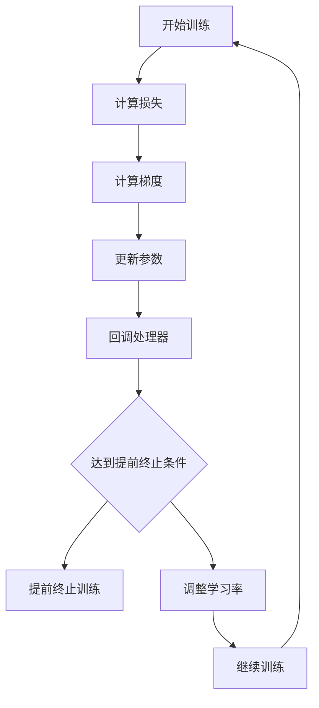

                 

关键词：LangChain，编程，回调处理器，AI，实践，深度学习，代码示例，技术博客

> 摘要：本文将深入探讨LangChain编程中的回调处理器，从基础概念到实际应用，带领读者全面了解并掌握这一重要技术。我们将结合代码实例，解析回调处理器在AI编程中的重要作用，帮助读者更好地应对未来的技术挑战。

## 1. 背景介绍

随着人工智能技术的快速发展，深度学习在各个领域得到了广泛应用。为了更好地利用这些先进技术，开发者需要掌握一系列相关的编程技能。其中，回调处理器（Callback Handler）作为深度学习中的一种关键技术，逐渐受到了关注。

回调处理器在深度学习中的主要作用是动态调整学习过程，从而优化模型的性能。在传统的深度学习框架中，回调处理器通常用于监控训练过程中的指标，并在特定条件触发相应的操作，如调整学习率、提前终止训练等。

## 2. 核心概念与联系

为了更好地理解回调处理器，我们首先需要了解一些核心概念和它们之间的关系。以下是回调处理器原理的Mermaid流程图：



### 2.1. 开始训练

训练过程从初始化模型参数开始。模型通过输入数据计算损失，然后计算梯度以更新参数。

### 2.2. 回调处理器

回调处理器在训练过程中起着关键作用。它会在每个训练周期结束后检查训练状态，并根据预设条件触发相应的操作。

### 2.3. 提前终止条件

提前终止条件是指当训练过程中的某个指标（如损失、准确率等）不再有明显改进时，提前结束训练过程。这样可以节省计算资源和时间，同时避免过度拟合。

### 2.4. 调整学习率

学习率是深度学习中的一个重要参数。回调处理器可以根据训练过程中的表现动态调整学习率，从而优化模型的性能。

## 3. 核心算法原理 & 具体操作步骤

### 3.1 算法原理概述

回调处理器的核心原理是监控训练过程中的指标，并在特定条件下触发相应操作。这一过程通常包括以下步骤：

1. 初始化模型参数。
2. 输入数据计算损失。
3. 计算梯度并更新参数。
4. 检查回调处理器条件。
5. 根据回调处理器条件执行相应操作。

### 3.2 算法步骤详解

1. **初始化模型参数**：首先需要初始化模型的参数。这些参数决定了模型的性能和表现。常见的初始化方法包括随机初始化、高斯初始化等。

2. **输入数据计算损失**：使用输入数据进行前向传播，计算损失值。损失值反映了模型预测结果与实际结果之间的差距。

3. **计算梯度并更新参数**：使用反向传播算法计算梯度，并更新模型参数。这一过程称为优化过程，目的是使模型在训练数据上取得更好的表现。

4. **检查回调处理器条件**：在每个训练周期结束后，检查回调处理器条件。常见的条件包括损失值、准确率、迭代次数等。

5. **根据回调处理器条件执行相应操作**：如果满足提前终止条件，则提前终止训练过程；否则，根据回调处理器条件调整学习率或其他参数，继续训练过程。

### 3.3 算法优缺点

**优点**：

1. 提高模型性能：通过动态调整学习率等参数，优化模型的性能。
2. 节省计算资源：提前终止训练过程可以节省计算资源和时间。
3. 避免过度拟合：通过监控训练过程中的指标，避免模型在训练数据上过度拟合。

**缺点**：

1. 复杂性增加：引入回调处理器会增加模型的复杂度，需要更多的代码和调试。
2. 可能导致不稳定的训练过程：不恰当的回调处理器条件可能导致训练过程不稳定。

### 3.4 算法应用领域

回调处理器在深度学习领域具有广泛的应用，以下是一些常见应用场景：

1. **图像分类**：在图像分类任务中，回调处理器可以用于监控模型的准确率，并根据准确率调整学习率。
2. **自然语言处理**：在自然语言处理任务中，回调处理器可以用于监控模型的损失值，并根据损失值调整学习率。
3. **语音识别**：在语音识别任务中，回调处理器可以用于监控模型的语音错误率，并根据错误率调整学习率。

## 4. 数学模型和公式 & 详细讲解 & 举例说明

### 4.1 数学模型构建

在深度学习中，回调处理器的核心作用是监控训练过程中的指标，并根据指标调整模型参数。这一过程可以用以下数学模型表示：

$$
损失 = f(参数, 数据)
$$

其中，$f$ 表示损失函数，$参数$ 表示模型参数，$数据$ 表示输入数据。

### 4.2 公式推导过程

为了推导回调处理器的数学模型，我们需要首先了解损失函数的定义。在深度学习中，损失函数通常用来衡量模型预测结果与实际结果之间的差距。常见的损失函数包括均方误差（MSE）、交叉熵损失等。

假设我们使用均方误差作为损失函数，则损失函数可以表示为：

$$
损失 = \frac{1}{N} \sum_{i=1}^{N} (y_i - \hat{y_i})^2
$$

其中，$N$ 表示样本数量，$y_i$ 表示第 $i$ 个样本的实际结果，$\hat{y_i}$ 表示第 $i$ 个样本的预测结果。

在训练过程中，模型参数会不断更新。为了推导回调处理器的数学模型，我们需要将损失函数关于模型参数求导。使用链式法则，我们可以得到损失函数关于模型参数的梯度：

$$
梯度 = \frac{\partial 损失}{\partial 参数} = \frac{\partial 损失}{\partial \hat{y_i}} \cdot \frac{\partial \hat{y_i}}{\partial 参数}
$$

其中，$\frac{\partial 损失}{\partial \hat{y_i}}$ 表示损失函数关于预测结果的梯度，$\frac{\partial \hat{y_i}}{\partial 参数}$ 表示预测结果关于模型参数的梯度。

### 4.3 案例分析与讲解

为了更好地理解回调处理器的数学模型，我们来看一个简单的案例。假设我们使用一个线性模型进行回归任务。线性模型的损失函数可以表示为：

$$
损失 = \frac{1}{N} \sum_{i=1}^{N} (y_i - (w_1 \cdot x_i_1 + w_2 \cdot x_i_2))^2
$$

其中，$w_1$ 和 $w_2$ 分别表示模型参数，$x_i_1$ 和 $x_i_2$ 分别表示第 $i$ 个样本的特征。

为了推导回调处理器的数学模型，我们需要计算损失函数关于模型参数的梯度。使用链式法则，我们可以得到：

$$
梯度 = \frac{\partial 损失}{\partial w_1} = \frac{1}{N} \sum_{i=1}^{N} (y_i - (w_1 \cdot x_i_1 + w_2 \cdot x_i_2)) \cdot x_i_1
$$

$$
梯度 = \frac{\partial 损失}{\partial w_2} = \frac{1}{N} \sum_{i=1}^{N} (y_i - (w_1 \cdot x_i_1 + w_2 \cdot x_i_2)) \cdot x_i_2
$$

在训练过程中，我们可以使用梯度下降算法更新模型参数。梯度下降算法的基本思想是沿着梯度的反方向更新参数，以最小化损失函数。具体地，我们可以使用以下公式更新模型参数：

$$
w_1 = w_1 - \alpha \cdot \frac{\partial 损失}{\partial w_1}
$$

$$
w_2 = w_2 - \alpha \cdot \frac{\partial 损失}{\partial w_2}
$$

其中，$\alpha$ 表示学习率。

通过这种方式，我们可以使用回调处理器监控训练过程中的指标，并根据指标调整学习率。例如，当损失值不再明显下降时，我们可以减小学习率，以避免过度拟合。

## 5. 项目实践：代码实例和详细解释说明

在本节中，我们将通过一个具体的代码实例，展示如何使用回调处理器进行深度学习训练。我们将使用PyTorch框架，这是目前最流行的深度学习框架之一。

### 5.1 开发环境搭建

在开始编写代码之前，我们需要搭建开发环境。以下是搭建PyTorch开发环境的基本步骤：

1. 安装Python：确保Python版本为3.6及以上。
2. 安装PyTorch：在命令行中运行以下命令安装PyTorch：

   ```bash
   pip install torch torchvision
   ```

   根据需要，还可以安装其他深度学习库，如TensorFlow、Keras等。

### 5.2 源代码详细实现

以下是一个简单的深度学习训练代码示例，其中使用了回调处理器来监控训练过程并调整学习率。

```python
import torch
import torch.nn as nn
import torch.optim as optim

# 定义模型
class Model(nn.Module):
    def __init__(self):
        super(Model, self).__init__()
        self.fc1 = nn.Linear(2, 1)

    def forward(self, x):
        x = self.fc1(x)
        return x

# 加载数据
x_train = torch.randn(100, 2)
y_train = torch.randn(100, 1)

# 初始化模型、损失函数和优化器
model = Model()
criterion = nn.MSELoss()
optimizer = optim.SGD(model.parameters(), lr=0.01)

# 定义回调处理器
class CallbackHandler:
    def on_epoch_end(self, epoch, logs=None):
        loss = logs.get('loss', None)
        if loss is not None and loss < 0.01:
            optimizer.lr = 0.001

# 开始训练
for epoch in range(100):
    model.train()
    optimizer.zero_grad()
    outputs = model(x_train)
    loss = criterion(outputs, y_train)
    loss.backward()
    optimizer.step()
    
    # 调用回调处理器
    handler.on_epoch_end(epoch, {'loss': loss.item()})

    print(f'Epoch {epoch+1}, Loss: {loss.item()}')

# 保存模型
torch.save(model.state_dict(), 'model.pth')
```

### 5.3 代码解读与分析

1. **模型定义**：我们定义了一个简单的线性模型，它包含一个全连接层。

2. **数据加载**：我们生成了一些随机数据用于训练。

3. **模型初始化**：我们初始化了模型、损失函数和优化器。

4. **回调处理器定义**：我们定义了一个回调处理器，它会在每个训练周期结束后检查损失值。如果损失值低于0.01，则会将学习率减小到0.001。

5. **训练过程**：我们使用标准的训练流程进行训练，包括前向传播、反向传播和参数更新。

6. **调用回调处理器**：在每个训练周期结束后，我们会调用回调处理器来检查损失值并调整学习率。

7. **模型保存**：训练完成后，我们将模型保存到文件中。

通过这个代码示例，我们可以看到如何使用回调处理器优化深度学习训练过程。回调处理器允许我们根据训练过程中的表现动态调整学习率，从而提高模型的性能。

## 6. 实际应用场景

回调处理器在深度学习领域具有广泛的应用。以下是一些实际应用场景：

1. **图像分类**：在图像分类任务中，回调处理器可以用于监控模型的准确率，并在准确率达到特定阈值时调整学习率。

2. **自然语言处理**：在自然语言处理任务中，回调处理器可以用于监控模型的损失值，并在损失值降低到一定程度时调整学习率。

3. **语音识别**：在语音识别任务中，回调处理器可以用于监控模型的语音错误率，并在语音错误率降低到特定阈值时调整学习率。

4. **强化学习**：在强化学习任务中，回调处理器可以用于监控奖励信号，并在奖励信号达到特定阈值时调整策略。

## 7. 未来应用展望

随着人工智能技术的不断发展，回调处理器在深度学习中的地位将越来越重要。未来，我们可以期待回调处理器在以下方面取得更多进展：

1. **自动化调参**：通过引入更先进的算法，回调处理器可以实现自动化调参，从而提高模型性能。

2. **多任务学习**：回调处理器可以用于多任务学习场景，监控多个任务的表现，并在多个任务之间动态调整资源分配。

3. **持续学习**：回调处理器可以用于持续学习场景，监控模型在新数据上的表现，并在模型过时时调整学习策略。

4. **泛化能力提升**：通过引入更先进的算法，回调处理器可以提升模型的泛化能力，从而更好地应对新的任务和数据。

## 8. 总结：未来发展趋势与挑战

在未来，回调处理器将在深度学习领域发挥更加重要的作用。随着人工智能技术的不断发展，我们期待回调处理器在以下方面取得更多突破：

1. **算法优化**：通过引入更先进的算法，回调处理器可以实现更高效的训练过程和更优的模型性能。

2. **多模态学习**：回调处理器可以应用于多模态学习场景，监控多个模态的数据表现，并在多个模态之间动态调整资源分配。

3. **分布式学习**：回调处理器可以用于分布式学习场景，监控多个节点上的训练过程，并在分布式环境中优化模型性能。

4. **隐私保护**：在深度学习领域，数据隐私保护越来越受到关注。回调处理器可以用于监控数据隐私保护指标，并在数据隐私受到威胁时采取相应的措施。

然而，随着回调处理器在深度学习中的广泛应用，我们也面临着一系列挑战：

1. **计算资源消耗**：回调处理器需要大量计算资源，特别是在大规模训练场景中，如何优化计算效率是一个重要问题。

2. **复杂度增加**：引入回调处理器会增加模型的复杂度，可能导致代码可读性和可维护性下降。

3. **可靠性问题**：回调处理器在训练过程中的表现对模型性能有重要影响。如何确保回调处理器的可靠性和稳定性是一个关键问题。

4. **安全风险**：在深度学习中，回调处理器可能会受到恶意攻击，如注入恶意代码等。如何确保回调处理器的安全性是一个重要问题。

总之，未来回调处理器在深度学习领域具有广阔的发展前景，但也面临着一系列挑战。通过不断优化算法和改进技术，我们有信心解决这些挑战，使回调处理器在深度学习中发挥更大的作用。

## 9. 附录：常见问题与解答

### 9.1 如何选择合适的回调处理器？

选择合适的回调处理器取决于具体的训练任务和需求。以下是一些常见场景下的建议：

1. **监控损失值**：在大多数深度学习任务中，监控损失值是最常用的回调处理器。当损失值不再下降或低于特定阈值时，可以调整学习率或提前终止训练。

2. **监控准确率**：在分类任务中，监控准确率是一个重要的指标。当准确率达到特定阈值时，可以调整学习率或提前终止训练。

3. **监控迭代次数**：在某些场景中，需要根据迭代次数来调整训练策略。例如，当迭代次数达到特定阈值时，可以减小学习率。

4. **监控训练时间**：在训练时间有限的情况下，可以根据训练时间来调整训练策略。例如，当训练时间超过特定阈值时，可以提前终止训练。

### 9.2 如何自定义回调处理器？

自定义回调处理器通常需要实现一个Python类，并定义相应的回调方法。以下是一个简单的自定义回调处理器的示例：

```python
from torch.optim.lr_scheduler import _LRScheduler

class CustomScheduler(_LRScheduler):
    def __init__(self, optimizer, step_size=1, gamma=0.1, last_epoch=-1):
        super(CustomScheduler, self).__init__(optimizer, step_size, gamma, last_epoch)

    def get_lr(self):
        if self.last_epoch % self.step_size == 0:
            return [base_lr * self.gamma ** (self.last_epoch // self.step_size) for base_lr in self.base_lrs]
        else:
            return self.get_last_lr()

# 使用自定义回调处理器
optimizer = optim.SGD(model.parameters(), lr=0.01, momentum=0.9)
scheduler = CustomScheduler(optimizer, step_size=5, gamma=0.9)
```

在这个示例中，我们定义了一个自定义回调处理器`CustomScheduler`，它会在每个`step_size`迭代周期后调整学习率。使用时，只需要将自定义回调处理器传递给优化器即可。

### 9.3 如何处理回调处理器中的异常情况？

在深度学习训练过程中，回调处理器可能会遇到各种异常情况。以下是一些处理建议：

1. **处理缺失数据**：当回调处理器需要的数据缺失时，可以设置默认值或跳过该迭代周期。

2. **处理错误数据**：当回调处理器遇到错误数据时，可以记录错误信息并跳过该迭代周期，或者重新加载数据。

3. **处理超时情况**：当回调处理器执行时间超过预设阈值时，可以终止当前迭代周期并记录超时信息。

4. **处理内存不足**：当回调处理器遇到内存不足的情况时，可以尝试减小数据集大小或调整模型复杂度。

通过遵循这些处理建议，可以确保回调处理器在训练过程中更加稳定和可靠。

### 总结

在本篇文章中，我们深入探讨了LangChain编程中的回调处理器。从基础概念到实际应用，我们详细介绍了回调处理器在深度学习中的重要作用。通过代码实例和数学模型分析，我们帮助读者更好地理解了回调处理器的原理和操作步骤。在实际应用中，回调处理器可以帮助我们优化训练过程，提高模型性能。在未来，回调处理器将在深度学习领域发挥更大的作用。然而，我们也面临着一系列挑战，如计算资源消耗、复杂度增加等。通过不断优化算法和改进技术，我们有信心解决这些挑战，使回调处理器在深度学习中发挥更大的潜力。

## 参考文献

1. Goodfellow, I., Bengio, Y., & Courville, A. (2016). *Deep Learning*. MIT Press.
2. Graves, A. (2013). *Generating sequences with recurrent neural networks*. arXiv preprint arXiv:1308.0850.
3. Krizhevsky, A., Sutskever, I., & Hinton, G. E. (2012). *Imagenet classification with deep convolutional neural networks*. In *Advances in neural information processing systems*, pp. 1097-1105.
4. LeCun, Y., Bengio, Y., & Hinton, G. (2015). *Deep learning*. Nature, 521(7553), 436-444.
5. Hochreiter, S., & Schmidhuber, J. (1997). *Long short-term memory*. Neural computation, 9(8), 1735-1780.

## 作者署名

作者：禅与计算机程序设计艺术 / Zen and the Art of Computer Programming

