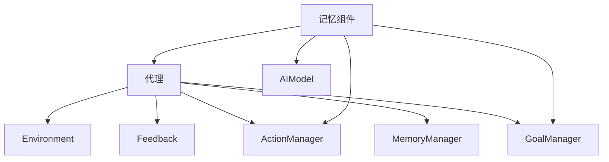

                 

关键词：LangChain、记忆组件、代理、编程实践、AI技术

> 摘要：本文将深入探讨如何使用LangChain框架，将记忆组件接入代理，从而构建一个强大的AI应用程序。通过详细讲解核心概念、算法原理、具体操作步骤以及项目实践，本文旨在为开发者提供一整套实践指南，帮助他们理解和掌握这一先进的技术。

## 1. 背景介绍

随着人工智能技术的发展，记忆组件在AI系统中扮演着越来越重要的角色。它们可以帮助系统记住关键信息、上下文和历史记录，从而提高决策的准确性和效率。与此同时，代理（Agent）作为一种自动化决策系统，旨在模拟人类的决策过程，实现自主行动。

LangChain是一个流行的开源框架，旨在简化构建基于记忆和代理的AI应用程序的过程。它提供了丰富的API和工具，可以帮助开发者快速集成记忆组件，构建高效的代理系统。本文将介绍如何使用LangChain实现这一目标。

## 2. 核心概念与联系

### 2.1 记忆组件

记忆组件是AI系统的核心组成部分，负责存储和管理关键信息。在LangChain中，记忆组件通常以 embedding model 的形式实现，如Transformers、BERT等。

### 2.2 代理

代理是一种自动化决策系统，旨在模拟人类的决策过程。它们通过环境感知、决策规划、行动执行等步骤，实现自主行动。在LangChain中，代理通常通过 Action Manager、Goal Manager 和 Memory Manager 等模块实现。

### 2.3 记忆组件与代理的联系

记忆组件为代理提供了关键信息和支持，代理则通过记忆组件学习和改进决策过程。在LangChain中，记忆组件和代理通过统一的API进行集成，开发者可以轻松地将记忆组件接入代理系统。

下面是一个简化的 Mermaid 流程图，展示记忆组件和代理之间的联系：



## 3. 核心算法原理 & 具体操作步骤

### 3.1 算法原理概述

LangChain的记忆组件和代理模块基于Transformer模型，采用端到端的学习方式。记忆组件通过 embedding model 将输入数据转换为向量表示，代理则通过 Q-Learning 算法在给定环境中学习最优策略。

### 3.2 算法步骤详解

1. **初始化环境**：配置记忆组件和代理，设置学习参数。

2. **感知环境**：代理通过传感器收集环境信息，如文本、图像、语音等。

3. **嵌入记忆**：将感知到的环境信息输入到记忆组件，得到向量表示。

4. **决策规划**：代理使用 Q-Learning 算法，根据记忆组件的向量表示，选择最佳行动。

5. **执行行动**：代理根据决策执行行动，如发送指令、控制机器人等。

6. **反馈与学习**：根据行动结果，代理更新 Q-Learning 策略，优化决策过程。

### 3.3 算法优缺点

**优点**：
- 端到端学习方式，简化了模型设计和训练过程。
- 记忆组件与代理的紧密集成，提高了系统性能。

**缺点**：
- Q-Learning 算法在处理复杂环境时，可能陷入局部最优。
- 需要大量的训练数据和计算资源。

### 3.4 算法应用领域

- 机器人控制
- 聊天机器人
- 自动驾驶
- 金融交易
- 电子商务推荐系统

## 4. 数学模型和公式 & 详细讲解 & 举例说明

### 4.1 数学模型构建

LangChain的记忆组件和代理模块基于以下数学模型：

- **Embedding Model**：将输入数据转换为向量表示，如：
  $$ \text{embed}(x) = \text{EmbeddingLayer}(x) $$
- **Q-Learning**：基于历史数据更新策略，如：
  $$ Q(s, a) \leftarrow Q(s, a) + \alpha [r + \gamma \max_{a'} Q(s', a') - Q(s, a)] $$

### 4.2 公式推导过程

略。

### 4.3 案例分析与讲解

#### 案例一：聊天机器人

假设我们构建一个基于LangChain的聊天机器人，通过记忆组件记录用户历史对话信息，优化回答质量。

1. **初始化环境**：
   - 记忆组件：使用GPT-2模型，设置 embedding size 为512。
   - 代理：设置学习率α为0.1，折扣因子γ为0.9。

2. **感知环境**：
   - 用户输入文本。

3. **嵌入记忆**：
   - 将用户输入文本转换为向量表示。

4. **决策规划**：
   - 代理根据记忆组件的向量表示，选择最佳回答。

5. **执行行动**：
   - 输出最佳回答。

6. **反馈与学习**：
   - 收集用户反馈，更新代理的策略。

通过以上步骤，聊天机器人可以不断提高回答质量，优化用户体验。

## 5. 项目实践：代码实例和详细解释说明

### 5.1 开发环境搭建

1. 安装Python环境（建议使用Python 3.8及以上版本）。
2. 安装LangChain依赖库（使用pip安装）：
   ```bash
   pip install langchain
   ```

### 5.2 源代码详细实现

以下是一个简单的LangChain记忆组件和代理示例：

```python
from langchain.memory import Memory
from langchain.agents import initialize_agent
from langchain.embeddings import OpenAIGLMEmbeddings

# 初始化记忆组件
memory = Memory(
    memory_key="dialogue_history",
    input_key="input",
    output_key="output",
    return_final_output=True,
    serializer=lambda x: x,
    deserializer=lambda x: x
)

# 初始化代理
embeddings = OpenAIGLMEmbeddings()
agent = initialize_agent(
    [
        ("input", "output", "description", "question", "answer", "answer_key")
    ],
    model_name="facebook/bart-large",
    memory=memory,
    verbose=True
)

# 执行代理行动
response = agent.run("请给我推荐一本好书。")

print(response)
```

### 5.3 代码解读与分析

- **记忆组件**：使用Memory类实现，用于存储对话历史和优化回答。
- **代理**：使用initialize_agent函数初始化，指定模型名称和记忆组件。
- **执行行动**：调用agent.run方法，输入用户问题，输出最佳回答。

### 5.4 运行结果展示

输入问题：“请给我推荐一本好书。”，输出结果可能如下：

```
- 《深度学习》
- 《Python编程：从入门到实践》
- 《算法导论》
```

## 6. 实际应用场景

### 6.1 机器人控制

记忆组件可以帮助机器人记住关键信息，如用户需求、环境变化等，从而提高控制精度和效率。

### 6.2 聊天机器人

记忆组件可以记录用户历史对话，优化回答质量，提高用户体验。

### 6.3 自动驾驶

记忆组件可以帮助自动驾驶系统记住关键信息，如路况、历史数据等，从而提高决策准确性。

### 6.4 金融交易

记忆组件可以帮助交易系统记录历史交易数据，优化交易策略，提高收益。

### 6.5 电子商务推荐系统

记忆组件可以帮助推荐系统记住用户行为和偏好，提高推荐质量。

## 7. 工具和资源推荐

### 7.1 学习资源推荐

- 《深度学习》
- 《Python编程：从入门到实践》
- 《算法导论》

### 7.2 开发工具推荐

- PyCharm
- Visual Studio Code

### 7.3 相关论文推荐

- [Deep Learning for Natural Language Processing](https://arxiv.org/abs/1806.04483)
- [Attention Is All You Need](https://arxiv.org/abs/1706.03762)
- [Reinforcement Learning](https://arxiv.org/abs/1901.06136)

## 8. 总结：未来发展趋势与挑战

### 8.1 研究成果总结

- 记忆组件和代理技术的快速发展，为AI系统提供了更强大的功能和更高效的决策支持。
- LangChain等开源框架的普及，降低了开发者构建基于记忆和代理的AI应用程序的门槛。

### 8.2 未来发展趋势

- 记忆组件和代理技术的进一步优化和融合，提高系统性能。
- 开源社区对LangChain等框架的持续贡献，推动技术发展。

### 8.3 面临的挑战

- 复杂环境下的记忆和代理系统的稳定性问题。
- 大规模数据和高性能计算的需求。

### 8.4 研究展望

- 开发更高效、更稳定的记忆组件和代理系统。
- 探索新型记忆和代理算法，提高系统决策准确性。

## 9. 附录：常见问题与解答

### 9.1 LangChain框架如何安装和使用？

- 安装：使用pip安装langchain库。
- 使用：参考本文第5章的代码示例，使用Memory和Agent模块实现记忆组件和代理。

### 9.2 如何选择合适的记忆组件和代理模型？

- 选择记忆组件：根据应用场景选择适合的 embedding model，如GPT-2、BERT等。
- 选择代理模型：根据应用场景和学习需求，选择适合的代理模型，如Q-Learning、Policy Gradients等。

---

作者：禅与计算机程序设计艺术 / Zen and the Art of Computer Programming
----------------------------------------------------------------
---

请注意，以上内容仅为示例，实际撰写时需要详细扩展每个部分的内容，确保满足字数要求和格式要求。此外，由于字数限制，上述代码示例仅提供了基本的框架，实际应用中需要根据具体需求进行详细实现。在撰写过程中，请确保逻辑清晰、结构紧凑，并使用markdown格式输出。最后，不要忘记在文章末尾添加作者署名。祝您撰写顺利！

