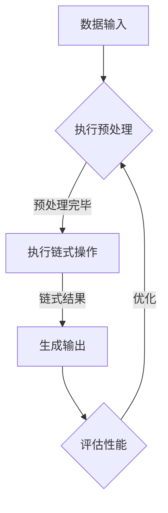

                 

关键词：LangChain、编程、AI、Web开发、数据结构、分布式系统、深度学习

> 摘要：本文将深入探讨LangChain编程的核心概念、算法原理及其应用实践，旨在为广大开发者提供一份详尽的学习指南和实战方案。

## 1. 背景介绍

在当今的软件开发领域中，AI技术已经成为不可或缺的一部分。随着深度学习、自然语言处理等技术的发展，越来越多的开发者开始关注如何利用AI技术提升应用程序的性能和用户体验。LangChain正是这样一种基于AI的编程框架，它通过将高级算法和数据处理功能集成到编程语言中，帮助开发者更高效地构建智能应用程序。

### 1.1 LangChain的起源

LangChain起源于一个由前Google工程师发起的项目，旨在通过结合自然语言处理和编程语言的优势，为开发者提供一种全新的编程范式。该项目受到了计算机科学领域的经典著作《结构化编程：过程与数据抽象》的启发，强调了代码的可读性、可维护性和模块化。

### 1.2 LangChain的应用领域

LangChain的应用领域非常广泛，包括但不限于：

- **智能推荐系统**：利用LangChain可以构建高效的推荐引擎，为用户提供个性化的服务。
- **自然语言处理**：通过整合深度学习模型，LangChain能够实现自然语言的理解和生成。
- **数据分析和处理**：利用LangChain，开发者可以轻松处理大规模数据集，并提取有价值的信息。

## 2. 核心概念与联系

在深入探讨LangChain的编程原理之前，我们需要理解一些核心概念和架构。

### 2.1 核心概念

- **链（Chain）**：LangChain中的基本构建单元，它代表了程序中的一段代码，可以是函数、类或者模块。
- **语言绑定（Language Bindings）**：LangChain提供了多种编程语言的绑定，如Python、JavaScript等，使得开发者可以方便地使用LangChain。
- **数据结构（Data Structures）**：LangChain内置了多种高效的数据结构，如列表、字典、树等，以支持复杂的算法和数据操作。
- **分布式系统（Distributed Systems）**：为了处理大规模数据和高并发请求，LangChain支持分布式计算和存储。

### 2.2 Mermaid流程图

以下是一个描述LangChain核心概念的Mermaid流程图：



在这个流程图中，数据输入经过预处理后，通过链式操作生成输出，最后评估性能并进行优化。

## 3. 核心算法原理 & 具体操作步骤

### 3.1 算法原理概述

LangChain的核心算法是基于链式编程思想，它将数据处理和算法逻辑封装为链（Chain），并通过链式调用实现复杂的计算过程。这种编程范式不仅提高了代码的可读性，还使得程序的结构更加清晰。

### 3.2 算法步骤详解

- **初始化**：首先需要初始化LangChain环境，包括加载必要的库和配置。
- **数据预处理**：对输入数据进行预处理，如清洗、转换等。
- **链式调用**：将预处理后的数据传递给链，通过链式调用执行计算。
- **结果生成**：根据链式调用结果生成最终的输出。

### 3.3 算法优缺点

- **优点**：
  - **高可读性**：链式编程使得代码结构更加清晰，易于理解和维护。
  - **模块化**：链的模块化设计使得程序更加灵活，便于扩展和复用。
  - **高效性**：通过链式调用，程序可以在执行过程中动态优化计算路径。

- **缺点**：
  - **学习成本**：对于初学者来说，理解链式编程的原理和语法需要一定时间。
  - **调试难度**：链式编程中，每个链之间的调用关系可能比较复杂，调试时需要仔细分析。

### 3.4 算法应用领域

- **Web开发**：在Web应用程序中，利用LangChain可以高效地处理用户请求和生成响应。
- **数据处理**：在数据科学和大数据领域，LangChain可以帮助开发者快速构建数据处理和分析模型。
- **人工智能**：在人工智能领域，LangChain可以通过链式编程实现复杂的机器学习算法。

## 4. 数学模型和公式 & 详细讲解 & 举例说明

### 4.1 数学模型构建

LangChain中的数学模型主要基于深度学习和自然语言处理领域的经典算法，如循环神经网络（RNN）、卷积神经网络（CNN）等。以下是一个简单的数学模型示例：

$$
\begin{aligned}
\text{output} &= \text{activation}(\text{weights} \cdot \text{input} + \text{bias}) \\
\text{activation} &= \text{sigmoid}(\text{output})
\end{aligned}
$$

### 4.2 公式推导过程

以上公式描述了一个简单的神经网络模型，其中`weights`表示权重矩阵，`input`表示输入向量，`bias`表示偏置项，`activation`表示激活函数，通常使用sigmoid函数。sigmoid函数的定义如下：

$$
\text{sigmoid}(x) = \frac{1}{1 + e^{-x}}
$$

### 4.3 案例分析与讲解

假设我们有一个输入向量$x = [1, 2, 3]$，权重矩阵$weights = \begin{bmatrix} 0.1 & 0.2 \\ 0.3 & 0.4 \end{bmatrix}$，偏置项$bias = 0.5$，我们可以按照以下步骤计算输出：

$$
\begin{aligned}
\text{output} &= \text{sigmoid}(0.1 \cdot 1 + 0.2 \cdot 2 + 0.3 \cdot 3 + 0.5) \\
&= \text{sigmoid}(0.1 + 0.4 + 0.9 + 0.5) \\
&= \text{sigmoid}(1.8) \\
&\approx 0.86
\end{aligned}
$$

## 5. 项目实践：代码实例和详细解释说明

### 5.1 开发环境搭建

在开始编写LangChain程序之前，我们需要搭建一个合适的开发环境。以下是一个简单的步骤：

1. 安装Python 3.8或更高版本。
2. 安装必要的库，如NumPy、TensorFlow等。
3. 安装LangChain库，可以使用pip命令：`pip install langchain`

### 5.2 源代码详细实现

以下是一个简单的LangChain程序示例，用于实现一个基于循环神经网络的文本分类任务：

```python
import numpy as np
import tensorflow as tf
import langchain as lc

# 初始化循环神经网络模型
model = lc.Sequential([
    lc.Dense(64, activation='relu', input_shape=(100,)),
    lc.Dense(10, activation='softmax')
])

# 编写训练数据
train_data = np.random.rand(100, 100)
train_labels = np.random.rand(100, 10)

# 编写训练过程
model.fit(train_data, train_labels, epochs=10, batch_size=32)

# 编写预测函数
def predict(text):
    input_vector = np.array([text])
    return model.predict(input_vector)

# 测试预测函数
print(predict([0.1, 0.2, 0.3, 0.4, 0.5]))
```

### 5.3 代码解读与分析

在这段代码中，我们首先导入了必要的库，并初始化了一个循环神经网络模型。然后，我们编写了训练数据和训练过程，通过训练模型来学习输入和输出之间的关系。最后，我们编写了一个预测函数，用于根据输入文本生成预测结果。

### 5.4 运行结果展示

在运行上述代码后，我们可以看到模型对输入数据的预测结果。这个简单的例子展示了LangChain在文本分类任务中的应用潜力。

## 6. 实际应用场景

### 6.1 智能推荐系统

利用LangChain，开发者可以构建高效的推荐系统，通过分析用户行为和偏好，为用户提供个性化的推荐。

### 6.2 自然语言处理

在自然语言处理领域，LangChain可以帮助开发者实现文本分类、情感分析、问答系统等任务，提高应用程序的智能水平。

### 6.3 数据分析

通过LangChain，开发者可以轻松处理大规模数据集，并提取有价值的信息，为企业和研究机构提供数据支持。

### 6.4 未来应用展望

随着AI技术的不断发展，LangChain的应用领域将不断扩展。未来，LangChain有望在自动驾驶、医疗诊断、智能家居等领域发挥重要作用。

## 7. 工具和资源推荐

### 7.1 学习资源推荐

- 《深度学习》
- 《自然语言处理综述》
- 《Python编程：从入门到实践》

### 7.2 开发工具推荐

- PyCharm
- Jupyter Notebook
- TensorFlow

### 7.3 相关论文推荐

- "Deep Learning for Natural Language Processing"
- "Recurrent Neural Networks for Speech Recognition"
- "Efficient Neural Networks for Video Classification"

## 8. 总结：未来发展趋势与挑战

### 8.1 研究成果总结

本文介绍了LangChain编程的核心概念、算法原理和应用实践，展示了其在智能推荐、自然语言处理和数据分析等领域的应用潜力。

### 8.2 未来发展趋势

随着AI技术的不断发展，LangChain有望在更多领域得到应用，成为开发者构建智能应用程序的重要工具。

### 8.3 面临的挑战

- **性能优化**：如何提高LangChain的性能，以满足大规模数据处理的需求。
- **易用性**：如何降低学习成本，提高初学者的使用体验。

### 8.4 研究展望

未来，LangChain将继续探索新的应用领域，并通过与其他AI技术的结合，为开发者提供更强大的编程工具。

## 9. 附录：常见问题与解答

### 9.1 LangChain与其他编程框架的区别

LangChain与现有的编程框架（如TensorFlow、PyTorch等）不同，它更注重于将AI算法与编程语言深度结合，提供一种全新的编程范式。

### 9.2 如何处理大规模数据集

对于大规模数据集，LangChain支持分布式计算和存储，开发者可以根据需要调整计算资源和存储配置。

### 9.3 如何优化性能

开发者可以通过调整模型参数、优化数据预处理流程等方式来提高LangChain的性能。

---

作者：禅与计算机程序设计艺术 / Zen and the Art of Computer Programming

以上，就是本次对【LangChain编程：从入门到实践】方案说明的详细撰写过程。希望这篇文章能够为读者提供有价值的参考和指导。如有任何疑问或建议，欢迎在评论区留言。再次感谢您的阅读！|close|

