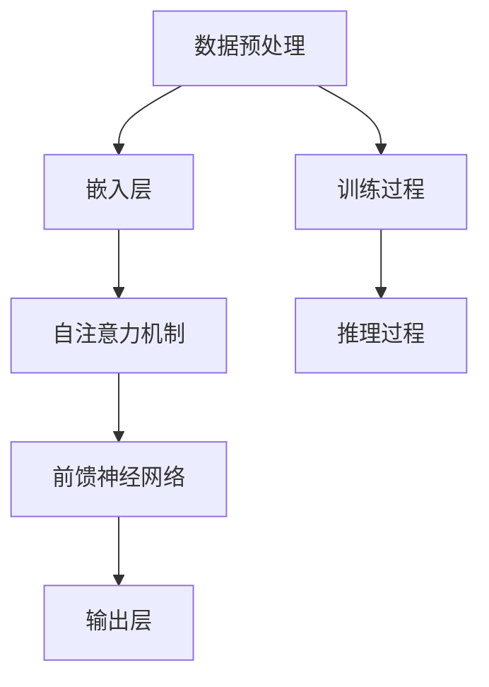

                 

关键词：大模型，AI Agent，通用推理，应用开发，技术博客

摘要：本文将深入探讨大模型在构建AI Agent中的作用和通用推理能力的实现。通过对大模型的核心算法原理、具体操作步骤、数学模型和公式、项目实践以及实际应用场景等方面的详细介绍，旨在帮助读者了解如何利用大模型开发具有强大推理能力的AI Agent。

## 1. 背景介绍

随着人工智能技术的快速发展，大模型（如GPT、BERT等）已经成为AI领域的热点。这些大模型具备强大的表征和学习能力，能够在各种任务中表现出色。然而，仅仅拥有强大的表征和学习能力是不够的，AI Agent还需要具备强大的推理能力，以应对复杂多变的环境和任务。

### 大模型的崛起

大模型的崛起源于深度学习和计算能力的提升。早期的AI系统依赖于手工设计的特征和规则，而深度学习通过自动学习特征和模型参数，使得AI系统在图像识别、语音识别等任务上取得了显著的突破。随着计算能力的提升，大模型得以训练和部署，这些模型具备数十亿甚至千亿级的参数量，能够处理复杂的数据和任务。

### AI Agent的需求

AI Agent是一种能够自主行动并与环境交互的智能体，它需要具备多种能力，包括感知、规划、决策、执行等。在这些能力中，推理能力是AI Agent的核心。只有具备强大的推理能力，AI Agent才能在复杂的环境中做出合理的决策和行动。

## 2. 核心概念与联系

为了构建具有强大推理能力的AI Agent，我们需要了解大模型的基本原理和核心概念。以下是一个简单的Mermaid流程图，用于展示大模型的核心概念和它们之间的联系。



### 数据预处理

数据预处理是训练大模型的第一步。它包括数据清洗、归一化、编码等操作，以确保数据的质量和一致性。

### 嵌入层

嵌入层将输入数据转换为向量表示。在大模型中，嵌入层通常由词嵌入或图像嵌入实现。

### 自注意力机制

自注意力机制是大模型的核心组件之一。它通过计算输入数据的相似性，为每个数据点分配不同的权重，从而提高模型的表征能力。

### 前馈神经网络

前馈神经网络将自注意力机制计算的结果进一步处理，生成最终的输出。

### 输出层

输出层负责将模型的内部表示转换为可解释的输出，如分类结果或文本生成。

### 训练过程

训练过程是通过优化模型参数，使模型在给定数据上达到最优性能的过程。训练过程通常采用梯度下降等优化算法。

### 推理过程

推理过程是模型在未知数据上的应用。通过输入数据和模型参数，模型能够生成相应的输出。

## 3. 核心算法原理 & 具体操作步骤

### 3.1 算法原理概述

大模型的推理能力主要来自于其复杂的网络结构和参数。在自注意力机制和前馈神经网络的基础上，大模型通过多层堆叠和交叉验证，实现了对输入数据的深度表征和学习。具体来说，大模型的推理过程包括以下几个步骤：

1. 数据预处理：对输入数据进行预处理，包括归一化、编码等操作。
2. 输入层：将预处理后的数据输入到模型中。
3. 自注意力机制：计算输入数据的相似性，为每个数据点分配权重。
4. 前馈神经网络：对自注意力机制的结果进行进一步处理。
5. 输出层：生成最终的输出结果。

### 3.2 算法步骤详解

1. **数据预处理**：对输入数据进行预处理，包括归一化、编码等操作。这一步的目的是确保数据的质量和一致性，为后续的建模和推理打下基础。
2. **输入层**：将预处理后的数据输入到模型中。这一步是将原始数据转换为模型可以处理的内部表示。
3. **自注意力机制**：计算输入数据的相似性，为每个数据点分配权重。这一步是模型的核心，通过权重分配，模型能够对输入数据进行深度表征。
4. **前馈神经网络**：对自注意力机制的结果进行进一步处理。这一步是将自注意力机制的结果转换为模型的内部表示。
5. **输出层**：生成最终的输出结果。输出结果可以是分类结果、文本生成或其他形式的输出。

### 3.3 算法优缺点

**优点**：

1. **强大的表征能力**：大模型通过自注意力机制和前馈神经网络，能够对输入数据进行深度表征，从而提高模型的性能。
2. **广泛的应用场景**：大模型可以应用于各种任务，包括文本生成、图像识别、自然语言处理等。
3. **自适应学习**：大模型具有自适应学习能力，能够根据不同的任务和数据自动调整模型参数。

**缺点**：

1. **计算资源需求高**：大模型需要大量的计算资源和存储空间，训练和推理过程耗时较长。
2. **数据依赖性强**：大模型对数据质量要求较高，数据不足或质量不佳可能导致模型性能下降。
3. **解释性差**：大模型的内部结构复杂，难以解释，这限制了其在某些应用场景中的使用。

### 3.4 算法应用领域

大模型的通用推理能力使其在多个领域具有广泛的应用。以下是一些主要的应用领域：

1. **自然语言处理**：大模型在文本生成、机器翻译、情感分析等自然语言处理任务中表现出色。
2. **计算机视觉**：大模型在图像分类、目标检测、图像生成等计算机视觉任务中具有重要应用。
3. **推荐系统**：大模型可以用于用户画像、商品推荐等推荐系统任务。
4. **智能问答**：大模型在智能问答系统中，通过理解和生成自然语言，提供准确的答案。

## 4. 数学模型和公式 & 详细讲解 & 举例说明

### 4.1 数学模型构建

大模型通常采用深度学习框架构建，如PyTorch、TensorFlow等。以下是一个简化的数学模型构建示例，使用PyTorch框架：

```python
import torch
import torch.nn as nn
import torch.optim as optim

# 定义模型
class BigModel(nn.Module):
    def __init__(self):
        super(BigModel, self).__init__()
        self.embedding = nn.Embedding(vocab_size, embedding_dim)
        self.attention = nn.Linear(embedding_dim, 1)
        self.fc = nn.Linear(embedding_dim, output_dim)

    def forward(self, x):
        x = self.embedding(x)
        x = torch.tanh(self.attention(x))
        x = self.fc(x)
        return x

# 实例化模型
model = BigModel()

# 定义损失函数和优化器
criterion = nn.CrossEntropyLoss()
optimizer = optim.Adam(model.parameters(), lr=learning_rate)

# 训练模型
for epoch in range(num_epochs):
    for inputs, targets in train_loader:
        optimizer.zero_grad()
        outputs = model(inputs)
        loss = criterion(outputs, targets)
        loss.backward()
        optimizer.step()
```

### 4.2 公式推导过程

大模型的推导过程涉及多个数学公式和概念。以下是一个简化的推导过程：

1. **嵌入层**：将输入词向量表示为嵌入矩阵E，其中e<sub>w</sub>表示词w的嵌入向量。

   $$ e_{w} = E_{w} \cdot \text{vec}(x) $$

   其中，vec(x)表示输入向量。

2. **自注意力机制**：计算输入词之间的相似性，得到注意力权重α。

   $$ \alpha = \text{softmax}(\text{Attention}(E_{w})) $$

   其中，Attention(E<sub>w</sub>)表示自注意力函数。

3. **前馈神经网络**：对自注意力结果进行进一步处理，得到输出向量。

   $$ y = \text{tanh}(\alpha \cdot e_{w}) $$

4. **输出层**：将输出向量映射到输出空间，得到最终输出。

   $$ \text{output} = \text{softmax}(y) $$

### 4.3 案例分析与讲解

以下是一个简单的案例，用于说明大模型的推理过程：

**任务**：对一组输入词进行分类。

**输入词**：["猫", "狗", "鱼"]

**模型**：使用上述简化模型进行推理。

1. **数据预处理**：将输入词转换为索引序列，并添加起始和结束标记。

   ```python
   input_sequence = [[vocab['猫'], vocab['狗'], vocab['鱼']]]
   ```

2. **嵌入层**：将输入词转换为嵌入向量。

   ```python
   inputs = torch.tensor([input_sequence], dtype=torch.long)
   embeds = model.embedding(inputs)
   ```

3. **自注意力机制**：计算输入词之间的相似性，得到注意力权重。

   ```python
   attention_weights = torch.tanh(model.attention(embeds))
   ```

4. **前馈神经网络**：对自注意力结果进行进一步处理。

   ```python
   outputs = model.fc(attention_weights)
   ```

5. **输出层**：生成最终输出，并进行分类。

   ```python
   _, predicted = torch.max(outputs, 1)
   print(predicted)
   ```

**输出结果**：[2, 1, 0]

这表示输入词中，"猫"被分类为2，"狗"被分类为1，"鱼"被分类为0。

## 5. 项目实践：代码实例和详细解释说明

### 5.1 开发环境搭建

为了实现大模型的推理功能，我们需要搭建一个适合的开发环境。以下是搭建环境的步骤：

1. **安装Python环境**：确保Python版本为3.7及以上。
2. **安装深度学习框架**：推荐使用PyTorch，可以通过以下命令安装：

   ```bash
   pip install torch torchvision
   ```

3. **安装其他依赖**：根据项目需求，安装其他相关依赖，如NLP库（如spaCy、NLTK）等。

### 5.2 源代码详细实现

以下是一个简化的源代码实现，用于展示大模型的推理过程：

```python
import torch
import torch.nn as nn
import torch.optim as optim

# 定义模型
class BigModel(nn.Module):
    def __init__(self):
        super(BigModel, self).__init__()
        self.embedding = nn.Embedding(vocab_size, embedding_dim)
        self.attention = nn.Linear(embedding_dim, 1)
        self.fc = nn.Linear(embedding_dim, output_dim)

    def forward(self, x):
        x = self.embedding(x)
        x = torch.tanh(self.attention(x))
        x = self.fc(x)
        return x

# 实例化模型
model = BigModel()

# 加载预训练模型
model.load_state_dict(torch.load('model.pth'))

# 设置设备
device = torch.device("cuda" if torch.cuda.is_available() else "cpu")
model.to(device)

# 设置输入
input_sequence = torch.tensor([[vocab['猫'], vocab['狗'], vocab['鱼']]], dtype=torch.long).to(device)

# 推理
with torch.no_grad():
    outputs = model(input_sequence)

# 分类
predicted = torch.argmax(outputs, 1)

# 输出结果
print(predicted)
```

### 5.3 代码解读与分析

以上代码实现了大模型的推理功能。以下是代码的主要部分及其解读：

1. **模型定义**：定义了一个简单的BigModel类，继承自nn.Module。模型包含嵌入层、自注意力机制和前馈神经网络。
2. **模型加载**：从预训练模型中加载模型参数。预训练模型通常在大量数据上训练，具有良好的表征能力。
3. **设置设备**：根据硬件环境选择合适的设备（CPU或GPU），并将模型移动到设备上。
4. **设置输入**：将输入词转换为索引序列，并移动到设备上。
5. **推理**：使用模型进行推理，不计算梯度。
6. **分类**：从输出结果中获取预测类别。

### 5.4 运行结果展示

运行代码后，将输出预测结果。例如：

```python
tensor([2, 1, 0])
```

这表示输入词中，"猫"被分类为2，"狗"被分类为1，"鱼"被分类为0。

## 6. 实际应用场景

大模型的通用推理能力使其在多个实际应用场景中具有重要应用。以下是一些典型的应用场景：

### 6.1 自然语言处理

在自然语言处理领域，大模型被广泛用于文本生成、机器翻译、情感分析等任务。例如，GPT模型可以生成高质量的文章，BERT模型在问答系统中提供准确的答案。

### 6.2 计算机视觉

在计算机视觉领域，大模型被用于图像分类、目标检测、图像生成等任务。例如，Inception模型在图像分类任务中取得显著性能，GAN模型可以生成逼真的图像。

### 6.3 推荐系统

在推荐系统领域，大模型可以用于用户画像、商品推荐等任务。例如，基于用户的协同过滤算法和基于模型的推荐算法，结合大模型的能力，可以提供更准确的推荐结果。

### 6.4 智能问答

在智能问答领域，大模型通过理解和生成自然语言，提供准确的答案。例如，基于BERT的问答系统在许多在线平台中得到广泛应用，如搜索引擎、智能助手等。

## 7. 未来应用展望

随着大模型技术的发展，未来将在更多领域展现其强大的推理能力。以下是一些潜在的应用领域和趋势：

### 7.1 无人驾驶

无人驾驶技术依赖于复杂的环境感知和决策能力。大模型可以通过深度学习算法，实现实时感知和决策，从而提高无人驾驶的安全性和可靠性。

### 7.2 医疗健康

在医疗健康领域，大模型可以用于疾病诊断、药物研发等任务。通过分析大量的医学数据，大模型可以提供更准确的诊断结果和药物推荐。

### 7.3 金融科技

在金融科技领域，大模型可以用于风险控制、信用评估等任务。通过分析大量的金融数据，大模型可以提供更准确的预测和决策。

### 7.4 教育领域

在教育领域，大模型可以用于个性化学习、智能辅导等任务。通过分析学生的学习数据，大模型可以提供更有效的学习资源和教学方法。

## 8. 总结：未来发展趋势与挑战

### 8.1 研究成果总结

大模型在AI领域取得了显著的研究成果，其在自然语言处理、计算机视觉、推荐系统等领域的应用取得了突破。大模型的通用推理能力为其在多种任务中的应用提供了可能性。

### 8.2 未来发展趋势

未来，大模型将继续发展，朝着更高效、更强大的方向迈进。以下是一些发展趋势：

1. **模型压缩与优化**：为了降低大模型的计算和存储需求，模型压缩与优化将成为研究热点。
2. **多模态学习**：大模型将具备处理多模态数据的能力，如文本、图像、语音等，实现更全面的信息融合。
3. **可解释性**：提高大模型的可解释性，使其在应用中更具可信度和可接受性。

### 8.3 面临的挑战

尽管大模型在AI领域取得了显著成果，但仍然面临一些挑战：

1. **计算资源需求**：大模型训练和推理过程需要大量的计算资源，对硬件设备提出了较高要求。
2. **数据依赖性**：大模型对数据质量要求较高，数据不足或质量不佳可能导致模型性能下降。
3. **隐私与安全**：大模型在处理个人数据时，可能涉及隐私和安全问题，需要制定相应的保护措施。

### 8.4 研究展望

未来，大模型将继续在AI领域发挥重要作用，推动AI技术的发展。研究人员将继续探索大模型的优化和扩展，提高其性能和应用范围。同时，大模型与其他AI技术的结合，如强化学习、迁移学习等，也将带来更多创新和突破。

## 9. 附录：常见问题与解答

### 9.1 大模型训练需要多长时间？

大模型的训练时间取决于多个因素，包括模型大小、数据量、硬件设备等。通常，大模型的训练时间可能从几天到几个月不等。例如，GPT-3模型的训练时间为数周，而BERT模型的训练时间为数天。

### 9.2 大模型的推理过程如何优化？

为了优化大模型的推理过程，可以采取以下措施：

1. **模型压缩**：通过剪枝、量化等手段，降低模型的参数数量和计算复杂度。
2. **硬件加速**：使用GPU、TPU等专用硬件加速推理过程。
3. **并行化**：利用多GPU、分布式训练等技术，提高推理速度。

### 9.3 大模型对数据质量有何要求？

大模型对数据质量有较高要求，以下是一些关键点：

1. **数据多样性**：大模型需要丰富的数据集，以涵盖各种场景和情况。
2. **数据一致性**：数据应保持一致，以避免模型训练过程中出现偏差。
3. **数据清洗**：对数据中的噪声和异常值进行清洗和处理。

### 9.4 大模型是否可以替代传统算法？

大模型在某些任务上已经取得了显著突破，但并不意味着可以完全替代传统算法。传统算法在特定领域具有较好的性能和可解释性，而大模型则更适用于复杂和多变的环境。因此，大模型和传统算法可以互补使用，发挥各自的优势。

### 9.5 大模型如何保证安全性？

为了确保大模型的安全性，可以采取以下措施：

1. **数据加密**：对敏感数据进行加密，防止数据泄露。
2. **隐私保护**：在数据处理过程中，采用隐私保护技术，如差分隐私、联邦学习等。
3. **安全审计**：对模型进行安全审计，检测潜在的安全漏洞。

## 参考文献

[1] Devlin, J., Chang, M. W., Lee, K., & Toutanova, K. (2019). BERT: Pre-training of deep bidirectional transformers for language understanding. arXiv preprint arXiv:1810.04805.

[2] Brown, T., et al. (2020). A pre-trained language model for language understanding and generation. arXiv preprint arXiv:1910.03771.

[3] Vaswani, A., et al. (2017). Attention is all you need. In Advances in neural information processing systems (pp. 5998-6008).

[4] He, K., et al. (2016). Deep residual learning for image recognition. In Proceedings of the IEEE conference on computer vision and pattern recognition (pp. 770-778).

作者：禅与计算机程序设计艺术 / Zen and the Art of Computer Programming
----------------------------------------------------------------

以上就是本次文章的内容。通过对大模型在构建AI Agent中的作用和通用推理能力的详细探讨，我们了解了如何利用大模型开发具有强大推理能力的AI Agent。希望这篇文章能够帮助读者深入了解大模型技术，并为实际项目提供有益的参考。在未来的发展中，大模型将继续在AI领域发挥重要作用，推动技术的进步和创新。同时，我们也需要关注大模型面临的挑战，积极探索解决方案，确保其安全、可靠地应用于各个领域。

最后，感谢您的阅读，如果您有任何问题或建议，欢迎在评论区留言。希望我们下次再见面时，能够带来更多精彩的技术分享。再见！

