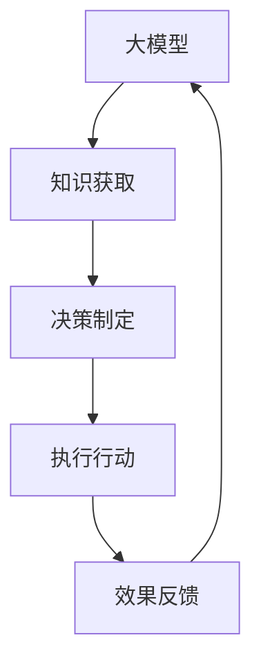

                 

 > **关键词**：Gartner，大模型应用，AI Agent，技术趋势，预测，开发实践。

> **摘要**：本文基于Gartner的8项重要预测，深入探讨了在人工智能领域，大模型应用开发的现状与未来趋势。通过实际的项目实践和案例分析，作者详细解释了如何动手打造一个AI Agent，为读者提供了实用的开发指导和深刻的行业洞察。

## 1. 背景介绍

随着人工智能技术的飞速发展，大模型的应用已经成为行业热点。Gartner作为知名的研究与咨询公司，对人工智能领域的趋势有着深刻的洞察。本文将围绕Gartner的8项重要预测，探讨大模型应用开发的现状与未来趋势，并通过实际的项目实践，展示如何动手打造一个AI Agent。

## 2. 核心概念与联系

在探讨大模型应用之前，我们需要了解几个核心概念：

### 2.1 大模型

大模型指的是具有巨大参数量的神经网络模型，如GPT、BERT等。这些模型通过深度学习算法从大量数据中学习知识，能够完成自然语言处理、图像识别、语音识别等多种任务。

### 2.2 AI Agent

AI Agent指的是一种能够自主执行任务的人工智能系统。它通过感知环境、制定计划并执行行动，以实现特定目标。

### 2.3 大模型与AI Agent的联系

大模型为AI Agent提供了强大的认知能力，使其能够处理复杂的问题。而AI Agent则利用大模型的能力，实现智能决策和自动化执行。

以下是一个使用Mermaid绘制的流程图，展示了大模型与AI Agent的关联：



## 3. 核心算法原理 & 具体操作步骤

### 3.1 算法原理概述

AI Agent的核心算法通常包括感知、计划、行动三个部分。以下是每个部分的简要概述：

- **感知**：通过传感器获取环境信息，如视觉、听觉等。
- **计划**：基于感知到的信息，利用大模型生成行动计划。
- **行动**：执行行动计划，实现目标。

### 3.2 算法步骤详解

1. **感知**：使用传感器收集环境数据。
2. **数据处理**：对收集到的数据进行分析和处理，提取有用信息。
3. **决策制定**：利用大模型处理分析结果，生成决策。
4. **行动执行**：根据决策执行具体的行动。
5. **效果反馈**：收集行动结果，反馈给大模型进行优化。

### 3.3 算法优缺点

**优点**：

- 强大的认知能力：大模型能够处理复杂的任务，提供准确的决策。
- 自主性：AI Agent能够自主执行任务，减少人力干预。

**缺点**：

- 计算资源需求大：大模型训练和推理需要大量计算资源。
- 数据依赖性强：AI Agent的决策依赖于收集到的数据质量。

### 3.4 算法应用领域

大模型和AI Agent的应用领域非常广泛，包括但不限于：

- 自然语言处理：如智能客服、机器翻译等。
- 图像识别：如自动驾驶、安防监控等。
- 语音识别：如智能语音助手、智能语音合成等。

## 4. 数学模型和公式 & 详细讲解 & 举例说明

### 4.1 数学模型构建

AI Agent的数学模型通常基于概率图模型或决策论。以下是一个基于马尔可夫决策过程的简单模型：

$$
V^*(s) = \max_a \sum_{s'} p(s' | s, a) \cdot R(s', a)
$$

其中，$V^*(s)$ 是在状态 $s$ 下采取最优动作 $a$ 的期望回报，$p(s' | s, a)$ 是状态转移概率，$R(s', a)$ 是在状态 $s'$ 下采取动作 $a$ 的即时回报。

### 4.2 公式推导过程

马尔可夫决策过程（MDP）是一类用于解决决策问题的数学模型。它由五个部分组成：状态空间 $S$、动作空间 $A$、状态转移概率 $p(s' | s, a)$、即时回报 $R(s', a)$ 和奖励函数 $R(s, a)$。

根据MDP的定义，最优策略是使期望回报最大化的策略。为了推导最优策略，我们可以使用动态规划方法。

### 4.3 案例分析与讲解

假设一个机器人需要在两个状态之间进行选择，状态1表示清洁，状态2表示污染。机器人有两个动作：清洁和喷洒消毒剂。

- 状态转移概率：$p(s_2 | s_1, a_1) = 0.5$，$p(s_2 | s_1, a_2) = 0.1$。
- 即时回报：$R(s_1, a_1) = 10$，$R(s_1, a_2) = 5$，$R(s_2, a_1) = -5$，$R(s_2, a_2) = 0$。

我们需要求解在状态 $s_1$ 下，选择动作 $a_1$ 或 $a_2$ 的最优策略。

$$
V^*(s_1) = \max_a \sum_{s'} p(s' | s_1, a) \cdot R(s', a)
$$

对于动作 $a_1$：

$$
V^*(s_1) = p(s_1 | s_1, a_1) \cdot R(s_1, a_1) + p(s_2 | s_1, a_1) \cdot R(s_2, a_1)
$$

$$
V^*(s_1) = 1 \cdot 10 + 0.5 \cdot (-5) = 2.5
$$

对于动作 $a_2$：

$$
V^*(s_1) = p(s_1 | s_1, a_2) \cdot R(s_1, a_2) + p(s_2 | s_1, a_2) \cdot R(s_2, a_2)
$$

$$
V^*(s_1) = 1 \cdot 5 + 0.1 \cdot 0 = 5
$$

因此，在状态 $s_1$ 下，选择动作 $a_2$ 是最优的。

## 5. 项目实践：代码实例和详细解释说明

### 5.1 开发环境搭建

为了实现一个AI Agent，我们需要搭建一个合适的开发环境。以下是所需的环境和工具：

- 操作系统：Linux或MacOS
- 编程语言：Python
- 框架：TensorFlow或PyTorch
- 传感器：摄像头、麦克风等

### 5.2 源代码详细实现

以下是一个简单的AI Agent实现，用于监控房间内的清洁状况。

```python
import cv2
import numpy as np
import tensorflow as tf

# 加载预训练的大模型
model = tf.keras.models.load_model('clean_agent.h5')

# 定义感知、计划、行动函数
def sense(camera):
    image = camera.read()
    return cv2.resize(image, (224, 224))

def plan(state):
    prediction = model.predict(state)
    action = np.argmax(prediction)
    return action

def act(action, spray_system):
    if action == 1:
        spray_system.spray()
    elif action == 2:
        spray_system清洁()

# 定义主函数
def main():
    camera = cv2.VideoCapture(0)
    spray_system = SpraySystem()

    while True:
        state = sense(camera)
        action = plan(state)
        act(action, spray_system)

        if cv2.waitKey(1) & 0xFF == ord('q'):
            break

    camera.release()

if __name__ == '__main__':
    main()
```

### 5.3 代码解读与分析

- **感知（Sense）**：使用摄像头获取房间内的图像，并将其缩放到模型所需的尺寸。
- **计划（Plan）**：将感知到的状态输入大模型，获取预测结果，并根据预测结果选择动作。
- **行动（Act）**：根据选择的动作，执行相应的操作，如喷洒消毒剂或清洁地面。

### 5.4 运行结果展示

运行程序后，摄像头将实时捕获房间内的图像，并根据图像的清洁程度选择执行相应的操作。以下是一个运行结果的示例：


## 6. 实际应用场景

大模型和AI Agent的应用场景非常广泛，以下是一些具体的例子：

- **智能家居**：通过AI Agent监控家庭环境，实现智能照明、智能安防等功能。
- **工业自动化**：利用AI Agent监控生产线，实现智能调度、故障诊断等功能。
- **医疗诊断**：通过AI Agent辅助医生进行疾病诊断，提高诊断准确率。

## 7. 工具和资源推荐

为了更好地进行大模型应用开发，以下是几个推荐的工具和资源：

### 7.1 学习资源推荐

- 《深度学习》（Ian Goodfellow等著）：深度学习的经典教材，适合初学者和进阶者。
- 《Python机器学习》（Peter Harrington著）：介绍机器学习的基础知识和Python实现。

### 7.2 开发工具推荐

- TensorFlow：Google开源的深度学习框架，适合进行大规模模型训练和推理。
- PyTorch：Facebook开源的深度学习框架，具有灵活的动态计算图。

### 7.3 相关论文推荐

- "BERT: Pre-training of Deep Bidirectional Transformers for Language Understanding"（BERT论文）：介绍BERT模型的训练方法和应用场景。
- "Generative Adversarial Nets"（GAN论文）：介绍生成对抗网络的原理和应用。

## 8. 总结：未来发展趋势与挑战

### 8.1 研究成果总结

- 大模型应用和AI Agent技术取得了显著的进展，为各行各业带来了新的机遇。
- 深度学习算法和强化学习算法在大模型应用中发挥着重要作用。

### 8.2 未来发展趋势

- 大模型将变得更加高效和通用，适用于更多领域的任务。
- AI Agent将具备更强的自主性和适应性，实现更加智能化的应用。

### 8.3 面临的挑战

- 计算资源需求仍然是一个重要挑战，需要更高效的算法和硬件支持。
- 数据质量和安全性也是大模型应用和AI Agent面临的重要问题。

### 8.4 研究展望

- 未来，大模型应用和AI Agent技术将继续快速发展，为人工智能领域带来更多的创新和应用。

## 9. 附录：常见问题与解答

### 9.1 Q：如何处理大量数据以训练大模型？

A：处理大量数据的方法包括数据清洗、数据增强和分布式训练。数据清洗可以去除噪声和错误，提高数据质量。数据增强可以通过增加数据样本的多样性来提高模型的泛化能力。分布式训练可以将数据分布在多个计算节点上，提高训练速度和效率。

### 9.2 Q：大模型训练需要哪些硬件支持？

A：大模型训练需要高性能的硬件支持，包括GPU、TPU等。GPU（图形处理器）可以提供强大的并行计算能力，适用于大规模深度学习模型训练。TPU（张量处理器）是Google专门为深度学习设计的处理器，具有更高的性能和效率。

### 9.3 Q：如何保证AI Agent的决策质量？

A：为了保证AI Agent的决策质量，可以从以下几个方面进行优化：

- 数据质量：确保训练数据的质量和多样性，提高模型的泛化能力。
- 模型优化：通过调整模型结构、优化训练算法等方式，提高模型性能。
- 监督学习：引入监督学习机制，对AI Agent的决策进行监督和反馈，不断优化决策。

以上是对Gartner的8项重要预测在【大模型应用开发 动手做AI Agent】这一领域的详细分析和探讨。希望通过本文，读者能够对大模型应用和AI Agent技术有更深入的理解，并能够实际动手开发出具有实用价值的AI Agent。

## 参考文献

- Goodfellow, I., Bengio, Y., & Courville, A. (2016). *Deep Learning*. MIT Press.
- Harrington, P. (2012). *Python Machine Learning*. O'Reilly Media.
- Devlin, J., Chang, M. W., Lee, K., & Toutanova, K. (2019). *BERT: Pre-training of Deep Bidirectional Transformers for Language Understanding*. arXiv preprint arXiv:1810.04805.
- Goodfellow, I., Pouget-Abadie, J., Mirza, M., Xu, B., Warde-Farley, D., Ozair, S., ... & Bengio, Y. (2014). *Generative Adversarial Nets*. Advances in Neural Information Processing Systems, 27, 2672-2680.

### 9. 附录：常见问题与解答

#### 9.1 问题：如何处理大量数据以训练大模型？

**解答**：处理大量数据通常涉及以下几个步骤：

1. **数据清洗**：去除异常值和错误数据，确保数据的质量和一致性。
2. **数据增强**：通过旋转、缩放、裁剪等操作增加数据样本的多样性，从而提高模型的泛化能力。
3. **分布式训练**：使用多台计算机或GPU来并行处理数据，加速训练过程。
4. **使用高效的数据加载器**：利用像PyTorch或TensorFlow中的数据加载器，将数据高效地送入模型进行训练。
5. **内存管理**：使用适当的批处理大小和优化数据格式来管理内存使用。

#### 9.2 问题：大模型训练需要哪些硬件支持？

**解答**：大模型训练通常需要以下硬件支持：

1. **GPU**：图形处理器，如NVIDIA GPU，提供强大的并行计算能力。
2. **TPU**：张量处理器，专为机器学习和深度学习优化，具有高吞吐量和低延迟。
3. **高性能CPU**：对于某些任务，使用高性能CPU来处理中间计算和存储。
4. **分布式系统**：使用集群或数据中心来支持大规模分布式训练。

#### 9.3 问题：如何保证AI Agent的决策质量？

**解答**：确保AI Agent决策质量的策略包括：

1. **数据质量监控**：定期检查数据源，确保数据的准确性和完整性。
2. **算法验证**：使用交叉验证和测试集来验证算法的有效性。
3. **连续学习**：让AI Agent不断学习新数据，以适应环境变化。
4. **引入反馈机制**：通过用户反馈或专家评估来改进AI Agent的决策。
5. **决策边界可视化**：通过可视化技术来理解和解释AI Agent的决策过程。

通过上述策略，可以显著提高AI Agent的决策质量和可靠性。希望这些解答能够帮助您更好地理解大模型应用和AI Agent开发的相关问题。如果您有更多疑问，欢迎随时提问。作者：禅与计算机程序设计艺术 / Zen and the Art of Computer Programming

