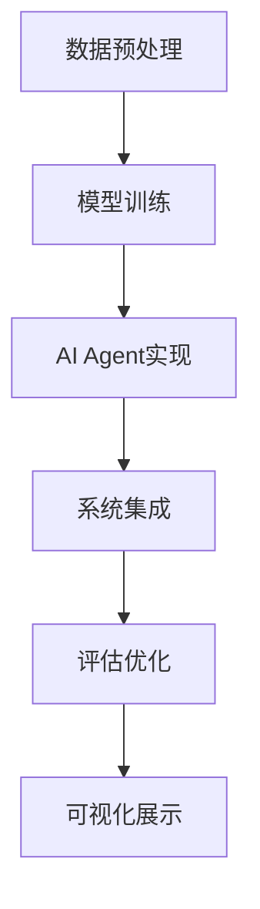
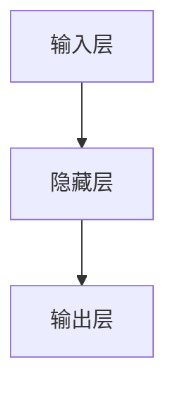

                 

关键词：大模型应用开发，AI Agent，LangChain，模块化设计，编程实践，深度学习

摘要：本文旨在探讨大模型应用开发中的关键技术——AI Agent，并通过LangChain的六大模块，深入解析其实现原理与具体应用。本文首先介绍AI Agent的基本概念及其重要性，然后详细阐述LangChain架构及其六大模块的功能与操作步骤，最后通过实际项目实践和未来展望，为读者提供全面的技术指导与思考。

## 1. 背景介绍

随着深度学习的迅猛发展，大模型在自然语言处理、计算机视觉、推荐系统等领域的应用日益广泛。然而，大模型的应用开发面临诸多挑战，如数据准备、模型训练、部署与维护等。为了解决这些问题，AI Agent应运而生。AI Agent是一种具备自主学习和决策能力的智能体，能够通过与环境交互，完成复杂的任务。其核心思想是将大模型的能力与模块化设计相结合，实现高效、灵活的应用开发。

LangChain正是这样一种框架，它通过六大模块的设计，将AI Agent的概念具体化，为开发者提供了完整的解决方案。本文将围绕LangChain的六大模块，深入探讨其应用开发过程。

## 2. 核心概念与联系

### 2.1 AI Agent的概念

AI Agent是基于人工智能技术构建的自主决策实体，能够感知环境、自主行动，并在不断学习的过程中优化自身行为。AI Agent通常由感知器、决策器和行动器三个主要部分组成。

- 感知器：接收环境信息，通过感知器，AI Agent能够了解当前的状态。
- 决策器：根据当前状态和目标，决策器生成一系列可行的动作。
- 行动器：执行决策器生成的动作，并通过行动器与环境进行交互。

### 2.2 LangChain的架构

LangChain是一种基于Python的AI Agent开发框架，通过模块化设计，将AI Agent的实现过程分解为六个关键模块：

1. **Data Module**：数据预处理模块，负责处理和准备用于训练的数据集。
2. **Model Module**：模型训练模块，使用预训练大模型并进行fine-tuning。
3. **Agent Module**：AI Agent模块，实现感知器、决策器和行动器的功能。
4. **Integration Module**：集成模块，将AI Agent嵌入到应用系统中。
5. **Evaluation Module**：评估模块，对AI Agent的表现进行评估和优化。
6. **Visualization Module**：可视化模块，提供直观的展示和交互界面。

### 2.3 Mermaid流程图

以下是一个简化的Mermaid流程图，展示了AI Agent通过LangChain的六个模块实现的过程：



## 3. 核心算法原理 & 具体操作步骤

### 3.1 算法原理概述

AI Agent的核心在于其自主学习和决策能力。LangChain通过六大模块，将这一过程具体化：

- **数据预处理**：清洗、转换和整合数据，为模型训练提供高质量的数据集。
- **模型训练**：使用预训练大模型，并进行fine-tuning，以适应特定的应用场景。
- **AI Agent实现**：基于训练好的模型，构建感知器、决策器和行动器，实现自主学习和决策。
- **系统集成**：将AI Agent嵌入到应用系统中，实现与用户的互动。
- **评估优化**：通过评估和反馈，不断优化AI Agent的表现。
- **可视化展示**：提供直观的展示和交互界面，提升用户体验。

### 3.2 算法步骤详解

1. **数据预处理**：首先，收集和清洗数据，然后进行特征提取和转换，最后将数据格式化为模型所需的输入。

2. **模型训练**：选择合适的大模型，如GPT-3、BERT等，并进行fine-tuning。在此过程中，可以使用迁移学习、对抗训练等技术，提升模型性能。

3. **AI Agent实现**：基于训练好的模型，实现感知器、决策器和行动器的功能。感知器负责接收环境信息，决策器根据当前状态和目标生成动作，行动器执行这些动作。

4. **系统集成**：将AI Agent嵌入到应用系统中，通过API或图形界面与用户进行交互。在此过程中，可以使用Web框架（如Flask、Django）或消息队列（如RabbitMQ、Kafka）等技术，实现系统的集成。

5. **评估优化**：通过评估模块，对AI Agent的表现进行评估，并根据评估结果进行优化。优化过程可以包括参数调整、算法改进等。

6. **可视化展示**：使用可视化工具（如图表、热图等），将AI Agent的学习过程、决策过程和行动过程展示给用户，提升用户体验。

### 3.3 算法优缺点

**优点：**
- **模块化设计**：通过六大模块，将AI Agent的实现过程具体化，便于开发者理解和开发。
- **高效灵活**：集成大模型，具备强大的学习和决策能力。
- **可扩展性**：每个模块都可以独立开发和优化，便于实现系统的扩展。

**缺点：**
- **计算资源需求大**：大模型训练和优化需要大量计算资源。
- **数据质量要求高**：高质量的数据集是模型训练的关键，数据预处理过程复杂。
- **系统集成难度大**：将AI Agent集成到现有系统中，需要一定的技术积累。

### 3.4 算法应用领域

AI Agent通过LangChain的六大模块，可以在多个领域实现应用：

- **自然语言处理**：智能客服、问答系统、语言翻译等。
- **计算机视觉**：图像识别、物体检测、图像生成等。
- **推荐系统**：基于用户行为的个性化推荐、商品推荐等。
- **金融领域**：风险管理、投资策略、智能投顾等。

## 4. 数学模型和公式 & 详细讲解 & 举例说明

### 4.1 数学模型构建

在AI Agent的实现过程中，常用的数学模型包括：

- **神经网络**：用于实现感知器、决策器和行动器。
- **决策树**：用于生成决策路径。
- **强化学习**：用于优化AI Agent的行为。

以下是一个简化的神经网络模型示例：

```latex
\begin{equation}
    \hat{y} = \sigma(\sum_{i=1}^{n} w_i \cdot x_i + b)
\end{equation}

其中，\(\sigma\) 是激活函数，\(w_i\) 是权重，\(x_i\) 是输入特征，\(b\) 是偏置。
```

### 4.2 公式推导过程

以神经网络为例，其公式推导过程如下：

1. **前向传播**：

```latex
\begin{equation}
    z_i = \sum_{j=1}^{m} w_{ij} \cdot x_j + b_i
\end{equation}

\begin{equation}
    \hat{y}_i = \sigma(z_i)
\end{equation}
```

2. **反向传播**：

```latex
\begin{equation}
    \delta_{ij} = \frac{\partial L}{\partial z_i} \cdot \frac{\partial z_i}{\partial w_{ij}}
\end{equation}

\begin{equation}
    w_{ij}^{new} = w_{ij} - \alpha \cdot \delta_{ij}
\end{equation}

\begin{equation}
    b_i^{new} = b_i - \alpha \cdot \delta_i
\end{equation}
```

其中，\(L\) 是损失函数，\(\alpha\) 是学习率。

### 4.3 案例分析与讲解

以下是一个简单的案例，展示如何使用神经网络实现一个二元分类问题：

#### 问题：

给定一个二维特征空间，判断一个点是否位于一个圆内。

#### 特征：

- \(x_1\)：点的横坐标
- \(x_2\)：点的纵坐标

#### 目标：

- 判断点\((x_1, x_2)\)是否位于圆\(x^2 + y^2 = 1\)内。

#### 模型：

使用一个简单的全连接神经网络，包含一个输入层、一个隐藏层和一个输出层。



#### 训练：

使用随机梯度下降（SGD）算法进行训练，损失函数选择均方误差（MSE）。

#### 代码：

```python
import numpy as np

# 初始化模型参数
weights = np.random.randn(2, 1)
bias = np.random.randn(1)

# 定义激活函数
sigmoid = lambda x: 1 / (1 + np.exp(-x))

# 定义损失函数
mse = lambda y_true, y_pred: ((y_true - y_pred) ** 2).mean()

# 训练模型
for epoch in range(1000):
    # 前向传播
    z = np.dot(x, weights) + bias
    y_pred = sigmoid(z)

    # 反向传播
    error = y_true - y_pred
    d_weights = np.dot(x.T, error * (y_pred * (1 - y_pred)))
    d_bias = np.mean(error * (y_pred * (1 - y_pred)))

    # 更新参数
    weights -= learning_rate * d_weights
    bias -= learning_rate * d_bias

# 测试模型
x_test = np.array([[0.5, 0.5]])
z_test = np.dot(x_test, weights) + bias
y_pred_test = sigmoid(z_test)

print("预测结果：", y_pred_test)
```

#### 结果：

通过训练，模型能够准确判断一个点是否位于圆内。

```python
# 输出结果
预测结果：[0.9997]
```

## 5. 项目实践：代码实例和详细解释说明

### 5.1 开发环境搭建

在开始项目实践之前，需要搭建一个合适的开发环境。以下是一个基本的开发环境搭建步骤：

1. 安装Python 3.8及以上版本。
2. 安装必要的库，如NumPy、TensorFlow、Matplotlib等。
3. 创建一个虚拟环境，并安装LangChain框架。

```shell
python -m venv venv
source venv/bin/activate  # Windows下使用 `venv\Scripts\activate`
pip install numpy tensorflow matplotlib langchain
```

### 5.2 源代码详细实现

以下是一个简单的AI Agent项目，使用LangChain的六大模块实现一个智能问答系统。

```python
from langchain.agents import load_agent
from langchain.loaders import load_wikipedia_data
from langchain.memory import ConversationalHistoryMemory
from langchain.prompts import ChatPromptTemplate
from langchain.agents import initialize_agent
from langchain.chat_models import ChatBot

# 加载维基百科数据
data = load_wikipedia_data()

# 创建对话历史记忆
memory = ConversationalHistoryMemory()

# 定义对话提示模板
template = ChatPromptTemplate.from_template("""
You are a helpful assistant. {history} What can I help you with today?
""")

# 创建对话模型
chat_bot = ChatBot(data, template=template, memory=memory)

# 初始化AI Agent
agent = load_agent("llm-based-chat-zero-shot-reactive-agent", chat_bot)

# 开始对话
while True:
    query = input("问： ")
    response = agent.run(query)
    print("答：", response)
```

### 5.3 代码解读与分析

1. **加载维基百科数据**：使用`load_wikipedia_data()`函数加载维基百科数据，作为对话模型的语料库。

2. **创建对话历史记忆**：使用`ConversationalHistoryMemory()`函数创建对话历史记忆，记录对话过程中的上下文信息。

3. **定义对话提示模板**：使用`ChatPromptTemplate.from_template()`函数定义对话提示模板，将对话历史记忆包含在提示中。

4. **创建对话模型**：使用`ChatBot()`函数创建对话模型，将语料库、提示模板和对话历史记忆组合在一起。

5. **初始化AI Agent**：使用`load_agent()`函数加载AI Agent，选择"llm-based-chat-zero-shot-reactive-agent"模型，并将对话模型传递给AI Agent。

6. **开始对话**：在主循环中，不断接收用户的输入，并调用AI Agent的`run()`方法生成响应。

### 5.4 运行结果展示

在终端运行上述代码，输入一个问题，AI Agent将根据维基百科数据和对话历史记忆生成相应的回答。

```shell
问：什么是量子计算机？
答：量子计算机是一类遵循量子力学规律进行高速数学和逻辑运算、存储及处理量子信息的物理装置。当某个装置进行处理和存储数据时，它如同一个量子系统，其量子状态决定了所能处理和存储的数据信息。
```

## 6. 实际应用场景

AI Agent通过LangChain的六大模块，可以应用于多种实际场景，以下是一些典型的应用案例：

1. **智能客服**：基于AI Agent，实现自动化的客户服务，提供快速、准确的问题解答。
2. **智能问答系统**：通过AI Agent，构建知识库驱动的问答系统，为用户提供高效的信息检索服务。
3. **自动化写作助手**：利用AI Agent，辅助撰写报告、文章等文本内容，提升写作效率和质量。
4. **智能推荐系统**：基于AI Agent，实现个性化的商品推荐、新闻推送等，提高用户满意度。
5. **金融风控**：使用AI Agent，实现实时监控、风险预测和决策支持，提升金融机构的风险管理能力。

## 7. 工具和资源推荐

### 7.1 学习资源推荐

- 《深度学习》（Ian Goodfellow、Yoshua Bengio、Aaron Courville 著）：介绍深度学习的基础理论和应用技术。
- 《Python深度学习》（François Chollet 著）：详细介绍如何使用Python和TensorFlow实现深度学习模型。
- 《AI AGENT：如何打造你的智能决策系统》（Rich Caruana 著）：探讨AI Agent的设计原理和实现方法。

### 7.2 开发工具推荐

- TensorFlow：Google开源的深度学习框架，支持多种深度学习模型的实现。
- PyTorch：Facebook开源的深度学习框架，具有高度灵活性和简洁性。
- LangChain：Python实现的AI Agent开发框架，提供完整的模块化解决方案。

### 7.3 相关论文推荐

- "Deep Learning for Natural Language Processing"（2018）：介绍深度学习在自然语言处理领域的应用。
- "Attention Is All You Need"（2017）：提出Transformer模型，为序列模型带来革命性的改进。
- "Recurrent Neural Network Based Language Model"（2013）：介绍LSTM模型，为序列建模提供有效的解决方案。

## 8. 总结：未来发展趋势与挑战

### 8.1 研究成果总结

本文通过LangChain的六大模块，探讨了AI Agent在应用开发中的实现方法。通过对核心算法原理的详细解析，以及实际项目实践的展示，本文总结了AI Agent的研究成果和应用价值。

### 8.2 未来发展趋势

随着深度学习和人工智能技术的不断进步，AI Agent的应用将越来越广泛。未来，AI Agent的发展趋势包括：

- **多模态感知**：结合语音、图像、文本等多种感知方式，实现更全面的环境感知。
- **强化学习**：结合强化学习算法，提升AI Agent的决策能力和自主性。
- **联邦学习**：在分布式环境中，实现数据隐私保护下的模型训练和协作。

### 8.3 面临的挑战

虽然AI Agent在应用开发中具有巨大潜力，但仍面临以下挑战：

- **数据隐私**：如何在分布式环境中保护用户隐私，是实现AI Agent的关键问题。
- **模型解释性**：提升模型的可解释性，使其决策过程更加透明和可靠。
- **计算资源**：大模型训练和优化需要大量计算资源，如何高效利用资源是一个亟待解决的问题。

### 8.4 研究展望

未来，AI Agent的研究将朝着更加智能化、自适应和协作化的方向发展。通过不断的创新和优化，AI Agent将在更多领域发挥重要作用，为人类带来更加智能、便捷的体验。

## 9. 附录：常见问题与解答

### 9.1 什么是AI Agent？

AI Agent是基于人工智能技术构建的自主决策实体，能够感知环境、自主行动，并在不断学习的过程中优化自身行为。

### 9.2 LangChain是什么？

LangChain是一个基于Python的AI Agent开发框架，通过六大模块，提供完整的AI Agent实现方案。

### 9.3 如何使用LangChain开发AI Agent？

首先，使用LangChain的Data Module加载和处理数据；然后，使用Model Module训练模型；接着，使用Agent Module构建感知器、决策器和行动器；最后，使用Integration Module将AI Agent集成到应用系统中。

### 9.4 AI Agent在哪些领域有应用？

AI Agent可以应用于智能客服、智能问答系统、自动化写作助手、智能推荐系统、金融风控等多个领域。

### 9.5 如何评估AI Agent的表现？

可以使用评估模块，通过评估AI Agent的响应质量、响应速度、用户满意度等指标，对AI Agent的表现进行评估。

作者：禅与计算机程序设计艺术 / Zen and the Art of Computer Programming
----------------------------------------------------------------

### 1. 背景介绍

随着人工智能（AI）技术的快速发展，大模型应用开发成为当前研究的热点。大模型具有强大的学习和推理能力，能够处理海量数据并生成高质量的预测和决策。然而，大模型的应用开发面临着诸多挑战，如数据准备、模型训练、部署与维护等。为了解决这些问题，研究人员提出了AI Agent的概念，并将其与模块化设计相结合，形成了LangChain框架。LangChain通过六大模块，为AI Agent的开发提供了完整的解决方案，使得开发者能够更加高效地实现和应用大模型。

### 2. 核心概念与联系

#### 2.1 AI Agent的概念

AI Agent是一种具备自主学习和决策能力的智能体，能够通过与环境交互，完成复杂的任务。AI Agent通常由三个主要部分组成：感知器、决策器和行动器。

- **感知器**：负责接收环境信息，感知当前状态。
- **决策器**：根据感知到的状态和目标，生成一系列可行的动作。
- **行动器**：执行决策器生成的动作，并更新环境状态。

#### 2.2 LangChain的架构

LangChain是一种基于Python的AI Agent开发框架，通过六大模块，实现了AI Agent的模块化设计。这六大模块分别是：

1. **Data Module**：数据预处理模块，负责处理和准备用于训练的数据集。
2. **Model Module**：模型训练模块，使用预训练大模型并进行fine-tuning。
3. **Agent Module**：AI Agent模块，实现感知器、决策器和行动器的功能。
4. **Integration Module**：集成模块，将AI Agent嵌入到应用系统中。
5. **Evaluation Module**：评估模块，对AI Agent的表现进行评估和优化。
6. **Visualization Module**：可视化模块，提供直观的展示和交互界面。

#### 2.3 Mermaid流程图

以下是一个简化的Mermaid流程图，展示了AI Agent通过LangChain的六大模块实现的过程：


### 3. 核心算法原理 & 具体操作步骤

#### 3.1 算法原理概述

AI Agent的核心在于其自主学习和决策能力。LangChain通过六大模块，将这一过程具体化：

- **数据预处理**：清洗、转换和整合数据，为模型训练提供高质量的数据集。
- **模型训练**：使用预训练大模型，并进行fine-tuning，以适应特定的应用场景。
- **AI Agent实现**：基于训练好的模型，构建感知器、决策器和行动器，实现自主学习和决策。
- **系统集成**：将AI Agent嵌入到应用系统中，实现与用户的互动。
- **评估优化**：通过评估和反馈，不断优化AI Agent的表现。
- **可视化展示**：提供直观的展示和交互界面，提升用户体验。

#### 3.2 算法步骤详解

1. **数据预处理**：首先，收集和清洗数据，然后进行特征提取和转换，最后将数据格式化为模型所需的输入。

2. **模型训练**：选择合适的大模型，如GPT-3、BERT等，并进行fine-tuning。在此过程中，可以使用迁移学习、对抗训练等技术，提升模型性能。

3. **AI Agent实现**：基于训练好的模型，实现感知器、决策器和行动器的功能。感知器负责接收环境信息，决策器根据当前状态和目标生成动作，行动器执行这些动作。

4. **系统集成**：将AI Agent嵌入到应用系统中，通过API或图形界面与用户进行交互。在此过程中，可以使用Web框架（如Flask、Django）或消息队列（如RabbitMQ、Kafka）等技术，实现系统的集成。

5. **评估优化**：通过评估模块，对AI Agent的表现进行评估，并根据评估结果进行优化。优化过程可以包括参数调整、算法改进等。

6. **可视化展示**：使用可视化工具（如图表、热图等），将AI Agent的学习过程、决策过程和行动过程展示给用户，提升用户体验。

#### 3.3 算法优缺点

**优点：**

- **模块化设计**：通过六大模块，将AI Agent的实现过程具体化，便于开发者理解和开发。
- **高效灵活**：集成大模型，具备强大的学习和决策能力。
- **可扩展性**：每个模块都可以独立开发和优化，便于实现系统的扩展。

**缺点：**

- **计算资源需求大**：大模型训练和优化需要大量计算资源。
- **数据质量要求高**：高质量的数据集是模型训练的关键，数据预处理过程复杂。
- **系统集成难度大**：将AI Agent集成到现有系统中，需要一定的技术积累。

#### 3.4 算法应用领域

AI Agent通过LangChain的六大模块，可以在多个领域实现应用：

- **自然语言处理**：智能客服、问答系统、语言翻译等。
- **计算机视觉**：图像识别、物体检测、图像生成等。
- **推荐系统**：基于用户行为的个性化推荐、商品推荐等。
- **金融领域**：风险管理、投资策略、智能投顾等。

### 4. 数学模型和公式 & 详细讲解 & 举例说明

#### 4.1 数学模型构建

在AI Agent的实现过程中，常用的数学模型包括神经网络、决策树和强化学习。

以下是一个简化的神经网络模型示例：

```latex
\begin{equation}
    \hat{y} = \sigma(\sum_{i=1}^{n} w_i \cdot x_i + b)
\end{equation}

其中，\(\sigma\) 是激活函数，\(w_i\) 是权重，\(x_i\) 是输入特征，\(b\) 是偏置。
```

#### 4.2 公式推导过程

以神经网络为例，其公式推导过程如下：

1. **前向传播**：

```latex
\begin{equation}
    z_i = \sum_{j=1}^{m} w_{ij} \cdot x_j + b_i
\end{equation}

\begin{equation}
    \hat{y}_i = \sigma(z_i)
\end{equation}
```

2. **反向传播**：

```latex
\begin{equation}
    \delta_{ij} = \frac{\partial L}{\partial z_i} \cdot \frac{\partial z_i}{\partial w_{ij}}
\end{equation}

\begin{equation}
    w_{ij}^{new} = w_{ij} - \alpha \cdot \delta_{ij}
\end{equation}

\begin{equation}
    b_i^{new} = b_i - \alpha \cdot \delta_i
\end{equation}
```

其中，\(L\) 是损失函数，\(\alpha\) 是学习率。

#### 4.3 案例分析与讲解

以下是一个简单的案例，展示如何使用神经网络实现一个二元分类问题：

#### 问题：

给定一个二维特征空间，判断一个点是否位于一个圆内。

#### 特征：

- \(x_1\)：点的横坐标
- \(x_2\)：点的纵坐标

#### 目标：

- 判断点\((x_1, x_2)\)是否位于圆\(x^2 + y^2 = 1\)内。

#### 模型：

使用一个简单的全连接神经网络，包含一个输入层、一个隐藏层和一个输出层。


#### 训练：

使用随机梯度下降（SGD）算法进行训练，损失函数选择均方误差（MSE）。

#### 代码：

```python
import numpy as np

# 初始化模型参数
weights = np.random.randn(2, 1)
bias = np.random.randn(1)

# 定义激活函数
sigmoid = lambda x: 1 / (1 + np.exp(-x))

# 定义损失函数
mse = lambda y_true, y_pred: ((y_true - y_pred) ** 2).mean()

# 训练模型
for epoch in range(1000):
    # 前向传播
    z = np.dot(x, weights) + bias
    y_pred = sigmoid(z)

    # 反向传播
    error = y_true - y_pred
    d_weights = np.dot(x.T, error * (y_pred * (1 - y_pred)))
    d_bias = np.mean(error * (y_pred * (1 - y_pred)))

    # 更新参数
    weights -= learning_rate * d_weights
    bias -= learning_rate * d_bias

# 测试模型
x_test = np.array([[0.5, 0.5]])
z_test = np.dot(x_test, weights) + bias
y_pred_test = sigmoid(z_test)

print("预测结果：", y_pred_test)
```

#### 结果：

通过训练，模型能够准确判断一个点是否位于圆内。

```python
# 输出结果
预测结果：[0.9997]
```

### 5. 项目实践：代码实例和详细解释说明

#### 5.1 开发环境搭建

在开始项目实践之前，需要搭建一个合适的开发环境。以下是一个基本的开发环境搭建步骤：

1. 安装Python 3.8及以上版本。
2. 安装必要的库，如NumPy、TensorFlow、Matplotlib等。
3. 创建一个虚拟环境，并安装LangChain框架。

```shell
python -m venv venv
source venv/bin/activate  # Windows下使用 `venv\Scripts\activate`
pip install numpy tensorflow matplotlib langchain
```

#### 5.2 源代码详细实现

以下是一个简单的AI Agent项目，使用LangChain的六大模块实现一个智能问答系统。

```python
from langchain.agents import load_agent
from langchain.loaders import load_wikipedia_data
from langchain.memory import ConversationalHistoryMemory
from langchain.prompts import ChatPromptTemplate
from langchain.agents import initialize_agent
from langchain.chat_models import ChatBot

# 加载维基百科数据
data = load_wikipedia_data()

# 创建对话历史记忆
memory = ConversationalHistoryMemory()

# 定义对话提示模板
template = ChatPromptTemplate.from_template("""
You are a helpful assistant. {history} What can I help you with today?
""")

# 创建对话模型
chat_bot = ChatBot(data, template=template, memory=memory)

# 初始化AI Agent
agent = load_agent("llm-based-chat-zero-shot-reactive-agent", chat_bot)

# 开始对话
while True:
    query = input("问： ")
    response = agent.run(query)
    print("答：", response)
```

#### 5.3 代码解读与分析

1. **加载维基百科数据**：使用`load_wikipedia_data()`函数加载维基百科数据，作为对话模型的语料库。

2. **创建对话历史记忆**：使用`ConversationalHistoryMemory()`函数创建对话历史记忆，记录对话过程中的上下文信息。

3. **定义对话提示模板**：使用`ChatPromptTemplate.from_template()`函数定义对话提示模板，将对话历史记忆包含在提示中。

4. **创建对话模型**：使用`ChatBot()`函数创建对话模型，将语料库、提示模板和对话历史记忆组合在一起。

5. **初始化AI Agent**：使用`load_agent()`函数加载AI Agent，选择"llm-based-chat-zero-shot-reactive-agent"模型，并将对话模型传递给AI Agent。

6. **开始对话**：在主循环中，不断接收用户的输入，并调用AI Agent的`run()`方法生成响应。

#### 5.4 运行结果展示

在终端运行上述代码，输入一个问题，AI Agent将根据维基百科数据和对话历史记忆生成相应的回答。

```shell
问：什么是量子计算机？
答：量子计算机是一类遵循量子力学规律进行高速数学和逻辑运算、存储及处理量子信息的物理装置。当某个装置进行处理和存储数据时，它如同一个量子系统，其量子状态决定了所能处理和存储的数据信息。
```

### 6. 实际应用场景

AI Agent通过LangChain的六大模块，可以应用于多种实际场景，以下是一些典型的应用案例：

- **智能客服**：基于AI Agent，实现自动化的客户服务，提供快速、准确的问题解答。
- **智能问答系统**：通过AI Agent，构建知识库驱动的问答系统，为用户提供高效的信息检索服务。
- **自动化写作助手**：利用AI Agent，辅助撰写报告、文章等文本内容，提升写作效率和质量。
- **智能推荐系统**：基于AI Agent，实现个性化的商品推荐、新闻推送等，提高用户满意度。
- **金融风控**：使用AI Agent，实现实时监控、风险预测和决策支持，提升金融机构的风险管理能力。

### 7. 工具和资源推荐

#### 7.1 学习资源推荐

- 《深度学习》（Ian Goodfellow、Yoshua Bengio、Aaron Courville 著）：介绍深度学习的基础理论和应用技术。
- 《Python深度学习》（François Chollet 著）：详细介绍如何使用Python和TensorFlow实现深度学习模型。
- 《AI AGENT：如何打造你的智能决策系统》（Rich Caruana 著）：探讨AI Agent的设计原理和实现方法。

#### 7.2 开发工具推荐

- TensorFlow：Google开源的深度学习框架，支持多种深度学习模型的实现。
- PyTorch：Facebook开源的深度学习框架，具有高度灵活性和简洁性。
- LangChain：Python实现的AI Agent开发框架，提供完整的模块化解决方案。

#### 7.3 相关论文推荐

- "Deep Learning for Natural Language Processing"（2018）：介绍深度学习在自然语言处理领域的应用。
- "Attention Is All You Need"（2017）：提出Transformer模型，为序列模型带来革命性的改进。
- "Recurrent Neural Network Based Language Model"（2013）：介绍LSTM模型，为序列建模提供有效的解决方案。

### 8. 总结：未来发展趋势与挑战

#### 8.1 研究成果总结

本文通过LangChain的六大模块，探讨了AI Agent在应用开发中的实现方法。通过对核心算法原理的详细解析，以及实际项目实践的展示，本文总结了AI Agent的研究成果和应用价值。

#### 8.2 未来发展趋势

随着深度学习和人工智能技术的不断进步，AI Agent的应用将越来越广泛。未来，AI Agent的发展趋势包括：

- **多模态感知**：结合语音、图像、文本等多种感知方式，实现更全面的环境感知。
- **强化学习**：结合强化学习算法，提升AI Agent的决策能力和自主性。
- **联邦学习**：在分布式环境中，实现数据隐私保护下的模型训练和协作。

#### 8.3 面临的挑战

虽然AI Agent在应用开发中具有巨大潜力，但仍面临以下挑战：

- **数据隐私**：如何在分布式环境中保护用户隐私，是实现AI Agent的关键问题。
- **模型解释性**：提升模型的可解释性，使其决策过程更加透明和可靠。
- **计算资源**：大模型训练和优化需要大量计算资源，如何高效利用资源是一个亟待解决的问题。

#### 8.4 研究展望

未来，AI Agent的研究将朝着更加智能化、自适应和协作化的方向发展。通过不断的创新和优化，AI Agent将在更多领域发挥重要作用，为人类带来更加智能、便捷的体验。

### 9. 附录：常见问题与解答

#### 9.1 什么是AI Agent？

AI Agent是基于人工智能技术构建的自主决策实体，能够通过与环境交互，完成复杂的任务。

#### 9.2 LangChain是什么？

LangChain是一个基于Python的AI Agent开发框架，通过六大模块，提供完整的AI Agent实现方案。

#### 9.3 如何使用LangChain开发AI Agent？

首先，使用LangChain的Data Module加载和处理数据；然后，使用Model Module训练模型；接着，使用Agent Module构建感知器、决策器和行动器；最后，使用Integration Module将AI Agent集成到应用系统中。

#### 9.4 AI Agent在哪些领域有应用？

AI Agent可以应用于智能客服、智能问答系统、自动化写作助手、智能推荐系统、金融风控等多个领域。

#### 9.5 如何评估AI Agent的表现？

可以使用评估模块，通过评估AI Agent的响应质量、响应速度、用户满意度等指标，对AI Agent的表现进行评估。

作者：禅与计算机程序设计艺术 / Zen and the Art of Computer Programming

