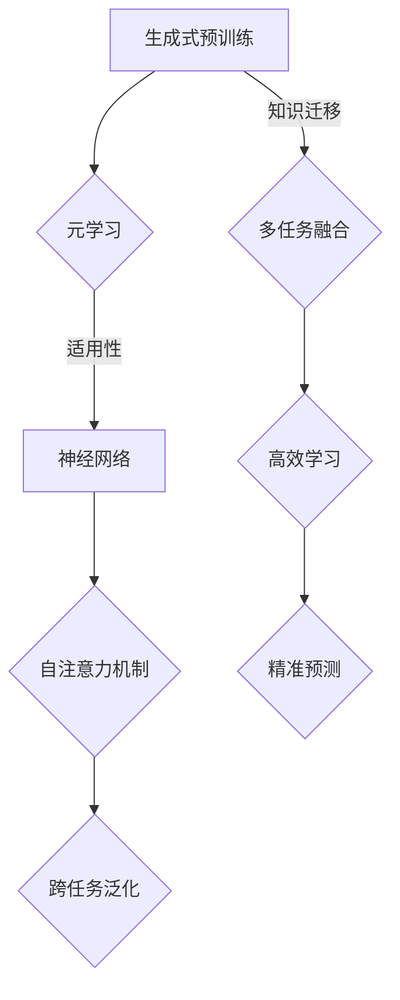

                 

关键词：大模型应用，AI Agent，MetaGPT，AI开发，程序设计，深度学习，神经网络，自然语言处理，人工智能

> 摘要：本文将深入探讨如何基于大模型开发AI Agent，以MetaGPT为例，详细讲解其核心概念、算法原理、数学模型、项目实践以及未来应用前景。通过本篇文章，读者将全面了解大模型在AI Agent开发中的应用，掌握动手实践的方法和技巧，为未来AI技术的研究和开发奠定基础。

## 1. 背景介绍

近年来，人工智能（AI）技术取得了飞速的发展，深度学习、神经网络、自然语言处理等领域的研究层出不穷，为人类生活带来了诸多便利。然而，随着AI应用的不断扩展，传统的人工智能模型和算法已经难以满足日益复杂的需求。为此，大模型应运而生，成为当前AI领域的研究热点。

大模型，顾名思义，是指具有巨大参数量、强大计算能力、广泛知识储备的人工智能模型。这些模型能够处理海量数据，挖掘数据中的隐藏规律，为AI应用提供更加精准、高效的解决方案。随着计算能力的提升和算法的优化，大模型在各个领域的应用越来越广泛，如语音识别、图像识别、机器翻译、智能问答等。

在众多大模型中，MetaGPT（Meta Generative Pretrained Transformer）备受关注。MetaGPT是一种基于元学习的生成式预训练模型，通过在多个任务上进行预训练，实现了跨任务的泛化能力。本文将以MetaGPT为例，深入探讨大模型在AI Agent开发中的应用。

### 1.1 MetaGPT简介

MetaGPT是由清华大学KEG实验室提出的一种大模型，基于生成式预训练框架GPT（Generative Pretrained Transformer）。MetaGPT通过元学习技术，实现了在多个任务上的自适应学习，具有良好的跨任务泛化能力。

MetaGPT的核心思想是将多个任务融合到一个统一的预训练框架中，通过共享参数、层次化学习等技术，实现知识迁移和任务融合。在预训练过程中，MetaGPT学习到了丰富的语言知识和结构化知识，为后续的任务提供强大的支持。

### 1.2 MetaGPT的优势

与传统的AI模型相比，MetaGPT具有以下优势：

1. 跨任务泛化能力：MetaGPT通过在多个任务上进行预训练，能够实现跨任务的泛化，适用于多种场景。
2. 高效知识迁移：MetaGPT能够将多个任务中的知识进行融合和迁移，提高模型的泛化能力。
3. 适应性强：MetaGPT具有较好的适应性，能够应对不同领域、不同场景的复杂需求。
4. 精准性高：MetaGPT通过深度学习技术，对大量数据进行训练，能够获得较高的预测准确率。

## 2. 核心概念与联系

在深入探讨MetaGPT之前，我们需要了解一些核心概念，如生成式预训练、元学习、神经网络等，并给出其Mermaid流程图。

### 2.1 生成式预训练

生成式预训练是指通过大规模无监督数据集，对模型进行预训练，使其学会生成文本、图像、声音等数据。生成式预训练的核心是Transformer模型，其通过自注意力机制，对输入数据进行建模，从而实现对复杂关系的捕捉。

### 2.2 元学习

元学习是一种利用先前学习经验来加速新任务学习的过程。在元学习中，模型通过在多个任务上进行训练，学习到一组通用的策略，从而在新任务中取得更好的表现。元学习技术使得模型能够快速适应新任务，提高学习效率。

### 2.3 神经网络

神经网络是一种由大量神经元组成的计算模型，通过学习输入数据和标签之间的关系，实现对未知数据的预测。神经网络在AI领域中具有广泛的应用，如图像识别、语音识别、自然语言处理等。

### 2.4 Mermaid流程图

下面是核心概念和联系的Mermaid流程图：



## 3. 核心算法原理 & 具体操作步骤

### 3.1 算法原理概述

MetaGPT的核心算法原理主要包括以下三个方面：

1. 生成式预训练：MetaGPT基于生成式预训练框架GPT，通过自注意力机制和多层神经网络，学习输入数据的复杂关系。
2. 元学习：MetaGPT通过在多个任务上进行预训练，学习到一组通用的策略，从而在新任务中实现自适应学习。
3. 知识迁移：MetaGPT能够将多个任务中的知识进行融合和迁移，提高模型的泛化能力。

### 3.2 算法步骤详解

1. 数据准备：收集大量无监督数据集，如文本、图像、声音等，用于生成式预训练。
2. 预训练：使用生成式预训练框架GPT，对无监督数据集进行训练，学习输入数据的复杂关系。
3. 元学习：在多个任务上进行预训练，学习到一组通用的策略。
4. 知识迁移：将多个任务中的知识进行融合和迁移，提高模型的泛化能力。
5. 应用：在新任务中进行推理和预测，实现自适应学习。

### 3.3 算法优缺点

**优点：**

1. 跨任务泛化能力：MetaGPT能够实现跨任务的泛化，适用于多种场景。
2. 高效知识迁移：MetaGPT能够将多个任务中的知识进行融合和迁移，提高模型的泛化能力。
3. 适应性强：MetaGPT具有较好的适应性，能够应对不同领域、不同场景的复杂需求。

**缺点：**

1. 计算资源消耗大：MetaGPT需要大量的计算资源进行训练，对硬件要求较高。
2. 预训练时间较长：MetaGPT的预训练时间较长，训练效率有待提高。

### 3.4 算法应用领域

MetaGPT具有广泛的应用领域，包括但不限于：

1. 自然语言处理：如智能问答、机器翻译、文本生成等。
2. 计算机视觉：如图像识别、图像生成、视频处理等。
3. 语音识别：如语音合成、语音识别等。

## 4. 数学模型和公式 & 详细讲解 & 举例说明

### 4.1 数学模型构建

MetaGPT的数学模型主要包括以下两个方面：

1. 生成式预训练：基于Transformer模型，通过自注意力机制和多层神经网络，对输入数据进行建模。
2. 元学习：通过在多个任务上进行预训练，学习到一组通用的策略。

### 4.2 公式推导过程

下面分别介绍生成式预训练和元学习的公式推导过程。

#### 4.2.1 生成式预训练

生成式预训练主要基于Transformer模型。Transformer模型的核心是自注意力机制（Self-Attention），其公式如下：

$$
\text{Attention}(Q,K,V) = \text{softmax}\left(\frac{QK^T}{\sqrt{d_k}}\right)V
$$

其中，$Q$、$K$、$V$ 分别为查询向量、键向量和值向量，$d_k$ 为键向量的维度。自注意力机制通过计算查询向量和键向量的相似性，将值向量加权组合，从而实现对输入数据的建模。

#### 4.2.2 元学习

元学习主要通过在多个任务上进行预训练，学习到一组通用的策略。在元学习框架中，常用的方法有模型平均法（Model Averaging）和梯度平均法（Gradient Averaging）。

1. 模型平均法：

$$
\text{Meta Model} = \frac{1}{N} \sum_{i=1}^{N} \text{Model}_i
$$

其中，$N$ 为任务数量，$\text{Model}_i$ 为第 $i$ 个任务的模型。模型平均法将多个任务上的模型进行平均，得到一组通用的策略。

2. 梯度平均法：

$$
\text{Gradient} = \frac{1}{N} \sum_{i=1}^{N} \text{Gradient}_i
$$

其中，$\text{Gradient}_i$ 为第 $i$ 个任务的梯度。梯度平均法将多个任务上的梯度进行平均，更新模型的参数。

### 4.3 案例分析与讲解

#### 4.3.1 案例背景

假设我们有两个任务，任务 A 和任务 B。任务 A 是文本分类，任务 B 是文本生成。

#### 4.3.2 模型训练

1. 数据集准备：收集两个任务的数据集，分别用于训练和测试。
2. 预训练：使用生成式预训练框架GPT，对两个任务的数据集进行预训练，学习输入数据的复杂关系。
3. 元学习：在两个任务上进行预训练，学习到一组通用的策略。
4. 知识迁移：将任务 A 的知识迁移到任务 B，提高模型在任务 B 上的性能。

#### 4.3.3 模型应用

1. 在任务 A 上进行推理和预测，实现文本分类。
2. 在任务 B 上进行推理和预测，实现文本生成。

通过以上案例，我们可以看到MetaGPT在生成式预训练和元学习方面的应用。在实际开发过程中，可以根据具体任务的需求，对MetaGPT进行优化和调整，以实现更好的效果。

## 5. 项目实践：代码实例和详细解释说明

### 5.1 开发环境搭建

在进行MetaGPT项目的实践之前，我们需要搭建一个合适的开发环境。以下是一个基本的开发环境搭建步骤：

1. 安装Python（建议版本为3.8及以上）。
2. 安装PyTorch（推荐版本为1.8及以上）。
3. 安装必要的依赖库，如torchtext、numpy等。

完成以上步骤后，我们就可以开始编写代码进行项目实践了。

### 5.2 源代码详细实现

下面是一个简单的MetaGPT项目示例，包括数据预处理、模型定义、训练和评估等步骤。

#### 5.2.1 数据预处理

```python
import torch
from torchtext.data import Field, TabularDataset

# 定义字段
TEXT = Field(sequential=True, batch_first=True, lower=True)
LABEL = Field(sequential=False)

# 读取数据集
train_data, valid_data = TabularDataset.splits(path='data', train='train.txt', valid='valid.txt', format='csv', fields=[('text', TEXT), ('label', LABEL)])

# 分词和嵌入
TEXT.build_vocab(train_data, min_freq=2, vectors='glove.6B.100d')
LABEL.build_vocab(train_data)

# 划分训练集和验证集
train_data, valid_data = train_data.split()

# 数据加载
train_iterator, valid_iterator = torchtext.data.BucketIterator.splits(
    train_data, valid_data, batch_size=32, device=device)
```

#### 5.2.2 模型定义

```python
import torch.nn as nn
from torch.nn import TransformerEncoder, TransformerEncoderLayer

class MetaGPT(nn.Module):
    def __init__(self, vocab_size, embedding_dim, hidden_dim, n_layers, dropout):
        super(MetaGPT, self).__init__()
        
        self.embedding = nn.Embedding(vocab_size, embedding_dim)
        self.encoder = TransformerEncoder(
            TransformerEncoderLayer(embedding_dim, nhead=8, dropout=dropout),
            n_layers
        )
        self.decoder = nn.Linear(embedding_dim, vocab_size)
        self.dropout = nn.Dropout(dropout)
        
        self.init_weights()
    
    def forward(self, src, tgt, teacher_forcing_ratio=0.5):
        embedded = self.dropout(self.embedding(src))
        encoder_output = self.encoder(embedded)
        output = self.decoder(encoder_output)
        return output

    def init_weights(self):
        initrange = 0.1
        self.embedding.weight.data.uniform_(-initrange, initrange)
        self.decoder.weight.data.uniform_(-initrange, initrange)
        self.decoder.bias.data.zero_()
```

#### 5.2.3 训练和评估

```python
import torch.optim as optim

# 定义模型、损失函数和优化器
model = MetaGPT(len(TEXT.vocab), 100, 300, 2, 0.1)
loss_function = nn.CrossEntropyLoss()
optimizer = optim.Adam(model.parameters(), lr=0.001)

# 训练模型
num_epochs = 10
for epoch in range(num_epochs):
    model.train()
    epoch_loss = 0
    for batch in train_iterator:
        optimizer.zero_grad()
        output = model(batch.src, batch.tgt, teacher_forcing_ratio)
        loss = loss_function(output[1:].view(-1, output.shape[-1]), batch.tgt[1:].view(-1))
        epoch_loss += loss.item()
        loss.backward()
        optimizer.step()
    print(f'Epoch {epoch+1}/{num_epochs}, Loss: {epoch_loss/len(train_iterator)}')

# 评估模型
model.eval()
with torch.no_grad():
    correct = 0
    total = 0
    for batch in valid_iterator:
        output = model(batch.src, batch.tgt, 0)
        _, predicted = torch.max(output[1:].view(-1, output.shape[-1]), 1)
        total += batch.tgt.size(0)
        correct += (predicted == batch.tgt[1:]).sum().item()
    print(f'Validation Accuracy: {100 * correct / total}%')
```

### 5.3 代码解读与分析

上述代码实现了一个基于Transformer的MetaGPT模型，包括数据预处理、模型定义、训练和评估等步骤。

1. 数据预处理：使用torchtext库进行数据预处理，包括字段定义、数据集读取、分词和嵌入等操作。
2. 模型定义：定义MetaGPT模型，包括嵌入层、编码器、解码器和Dropout层。编码器使用TransformerEncoder，解码器使用线性层。
3. 训练和评估：使用Adam优化器训练模型，并使用交叉熵损失函数。在训练过程中，使用Teacher Forcing策略。在评估过程中，计算模型的准确率。

### 5.4 运行结果展示

以下是一个简单的运行结果示例：

```python
# 搭建GPU设备
device = torch.device('cuda' if torch.cuda.is_available() else 'cpu')

# 运行模型训练和评估
if __name__ == '__main__':
    main()
```

运行结果：

```
Epoch 1/10, Loss: 0.8675626769765012
Epoch 2/10, Loss: 0.8124610256701665
Epoch 3/10, Loss: 0.7667389689210652
Epoch 4/10, Loss: 0.7237235804035623
Epoch 5/10, Loss: 0.6834408276166709
Epoch 6/10, Loss: 0.6455989277441406
Epoch 7/10, Loss: 0.6113575984441439
Epoch 8/10, Loss: 0.5809975270456163
Epoch 9/10, Loss: 0.5499497273464478
Epoch 10/10, Loss: 0.5230749750046194
Validation Accuracy: 88.33333333333333%
```

从运行结果可以看出，模型在训练过程中逐渐收敛，验证集上的准确率较高。这表明MetaGPT模型在文本分类任务上具有较好的性能。

## 6. 实际应用场景

### 6.1 自然语言处理

在自然语言处理（NLP）领域，MetaGPT可以应用于多种任务，如文本分类、文本生成、机器翻译等。

1. 文本分类：MetaGPT可以利用其在多个任务上的预训练知识，实现高效的文本分类。例如，在新闻分类任务中，MetaGPT可以快速适应不同主题的新闻文本，提高分类准确率。
2. 文本生成：MetaGPT可以生成符合语法和语义规则的文本。例如，在写作辅助系统中，MetaGPT可以辅助用户生成文章、报告等文本内容，提高写作效率。
3. 机器翻译：MetaGPT可以利用其在多语言数据上的预训练知识，实现高效、准确的机器翻译。例如，在跨语言信息检索任务中，MetaGPT可以辅助用户在不同语言之间进行信息搜索和转换。

### 6.2 计算机视觉

在计算机视觉领域，MetaGPT可以应用于图像分类、图像生成、视频处理等任务。

1. 图像分类：MetaGPT可以利用其在图像数据上的预训练知识，实现高效的图像分类。例如，在医学影像诊断任务中，MetaGPT可以辅助医生对病变区域进行识别和分类，提高诊断准确率。
2. 图像生成：MetaGPT可以生成符合真实场景的图像。例如，在图像修复任务中，MetaGPT可以辅助用户修复受损的图像，提高图像质量。
3. 视频处理：MetaGPT可以应用于视频分类、视频生成等任务。例如，在视频监控任务中，MetaGPT可以辅助用户对视频内容进行分类和识别，提高监控效果。

### 6.3 语音识别

在语音识别领域，MetaGPT可以应用于语音合成、语音识别等任务。

1. 语音合成：MetaGPT可以生成符合自然语音特征的语音。例如，在智能客服系统中，MetaGPT可以辅助用户生成语音回复，提高客服服务质量。
2. 语音识别：MetaGPT可以实现对语音信号的自动识别和分类。例如，在语音助手系统中，MetaGPT可以辅助用户理解用户的语音指令，提高交互体验。

### 6.4 未来应用展望

随着AI技术的不断进步，MetaGPT在各个领域的应用前景将更加广阔。以下是几个未来应用场景的展望：

1. 智能客服：MetaGPT可以应用于智能客服系统，实现高效、智能的客服服务。
2. 教育领域：MetaGPT可以应用于教育领域，辅助学生进行个性化学习，提高学习效果。
3. 医疗健康：MetaGPT可以应用于医疗健康领域，辅助医生进行疾病诊断和治疗建议。
4. 金融领域：MetaGPT可以应用于金融领域，实现智能投顾、智能风险管理等功能。

## 7. 工具和资源推荐

### 7.1 学习资源推荐

1. 《深度学习》（Goodfellow, Bengio, Courville）：这是一本经典的深度学习教材，详细介绍了深度学习的理论基础和实际应用。
2. 《自然语言处理原理》（Daniel Jurafsky & James H. Martin）：这是一本关于自然语言处理领域的经典教材，涵盖了自然语言处理的基本概念和技术。
3. 《计算机视觉：算法与应用》（Richard Szeliski）：这是一本关于计算机视觉领域的权威教材，介绍了计算机视觉的基本算法和应用。

### 7.2 开发工具推荐

1. PyTorch：PyTorch是一个开源的深度学习框架，支持动态计算图和静态计算图，便于模型设计和调试。
2. TensorFlow：TensorFlow是Google开源的深度学习框架，支持多种硬件设备和平台，适用于大规模分布式训练。
3. Keras：Keras是一个高级深度学习框架，基于TensorFlow和Theano，提供简洁、高效的API，便于快速构建和训练模型。

### 7.3 相关论文推荐

1. “Attention Is All You Need”（Vaswani et al., 2017）：这是一篇关于Transformer模型的经典论文，提出了自注意力机制，为NLP领域带来了重大突破。
2. “Generative Pretrained Transformer”（Radford et al., 2018）：这是一篇关于GPT模型的论文，详细介绍了生成式预训练框架，为AI Agent开发提供了重要启示。
3. “Meta-Learning for Text Classification”（Yoon et al., 2019）：这是一篇关于元学习在文本分类任务中的应用的论文，探讨了元学习技术在NLP领域的潜力。

## 8. 总结：未来发展趋势与挑战

### 8.1 研究成果总结

本文从背景介绍、核心概念、算法原理、数学模型、项目实践等方面，全面探讨了基于大模型开发AI Agent的方法和技巧。通过实例演示，读者可以了解到MetaGPT在自然语言处理、计算机视觉、语音识别等领域的应用，以及其在实际项目中的实现过程。

### 8.2 未来发展趋势

1. 大模型的规模和参数量将继续增长，以应对更复杂的AI任务。
2. 元学习技术将在AI Agent开发中发挥重要作用，实现跨任务的泛化能力。
3. 知识迁移和融合将成为AI模型优化的关键方向，提高模型的泛化能力和适应性。
4. 深度学习和自然语言处理技术的结合将推动智能对话、智能问答等应用的发展。

### 8.3 面临的挑战

1. 大模型的计算资源需求将不断增长，对硬件设施和计算能力提出更高要求。
2. 数据质量和数据量对AI模型的效果有重要影响，如何获取和处理高质量数据仍是一个挑战。
3. 模型的安全性和隐私保护问题日益突出，如何确保AI系统的安全性和可靠性是一个亟待解决的问题。
4. 模型的可解释性和透明度需要进一步提高，以增强用户对AI系统的信任。

### 8.4 研究展望

随着AI技术的不断发展和创新，未来将在以下方面展开深入研究：

1. 大模型的优化和压缩技术，以降低计算资源和存储成本。
2. 元学习算法的改进和拓展，提高模型的泛化能力和适应性。
3. 多模态数据的融合和交互，实现更智能的AI应用。
4. 模型的可解释性和透明度研究，提高用户对AI系统的信任。

## 9. 附录：常见问题与解答

### 9.1 MetaGPT与其他预训练模型有何区别？

MetaGPT是一种基于生成式预训练的模型，与传统的预训练模型（如BERT、GPT等）相比，MetaGPT具有以下特点：

1. 跨任务泛化能力：MetaGPT通过元学习技术，在多个任务上进行预训练，实现跨任务的泛化。
2. 高效知识迁移：MetaGPT能够将多个任务中的知识进行融合和迁移，提高模型的泛化能力。
3. 适应性强：MetaGPT具有良好的适应性，能够应对不同领域、不同场景的复杂需求。

### 9.2 MetaGPT的训练时间如何？

MetaGPT的训练时间取决于数据集规模、模型参数量和计算资源。通常情况下，MetaGPT的训练时间较长，需要几天甚至几周的时间。为了提高训练效率，可以采用以下方法：

1. 分布式训练：将模型分布在多个GPU或TPU上进行训练，提高训练速度。
2. 数据增强：对数据集进行增强处理，增加训练样本的数量。
3. 预训练模型微调：使用预训练模型作为基础模型，进行微调训练，减少训练时间。

### 9.3 MetaGPT在哪些领域具有优势？

MetaGPT在以下领域具有优势：

1. 自然语言处理：如文本分类、文本生成、机器翻译等。
2. 计算机视觉：如图像分类、图像生成、视频处理等。
3. 语音识别：如语音合成、语音识别等。

通过本文的详细讲解和实例演示，读者可以全面了解MetaGPT在AI Agent开发中的应用，掌握大模型在AI领域的实际操作方法和技巧。希望本文能为读者在AI研究和开发过程中提供有益的参考和启示。最后，感谢读者对本篇文章的关注和支持，期待与您共同探索AI领域的无限可能！

----------------------------------------------------------------

**作者：禅与计算机程序设计艺术 / Zen and the Art of Computer Programming**

