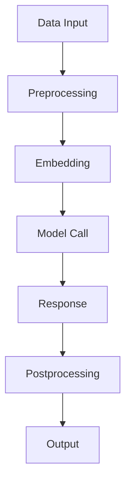

                 

关键词：大模型应用、AI Agent、LangChain、算法原理、数学模型、项目实践

> 摘要：本文旨在深入探讨LangChain在人工智能大模型应用开发中的作用，从核心概念、算法原理、数学模型、项目实践等多个角度，为读者提供一个全面的理解和操作指南。

## 1. 背景介绍

随着人工智能技术的迅猛发展，大模型（Large Model）逐渐成为研究与应用的热点。大模型具备处理海量数据的能力，能够实现诸如自然语言处理、图像识别等多种复杂任务。然而，如何有效地应用这些大模型，尤其是在构建智能代理（AI Agent）方面，成为了一个亟待解决的关键问题。在这一背景下，LangChain作为一种新型的AI框架，应运而生。

LangChain是由Hugging Face推出的一种AI框架，旨在简化大模型的部署和使用，使得开发者可以更加便捷地构建AI Agent。它不仅支持多种大模型的集成，还提供了丰富的API和工具，使得开发者能够快速上手，实现自定义的AI应用。本文将围绕LangChain，详细探讨其在AI Agent开发中的应用。

## 2. 核心概念与联系

### 2.1 LangChain的定义与作用

LangChain是一个基于Python的库，它提供了构建AI Agent所需的一系列工具和API。其核心作用在于：

1. **集成大模型**：通过封装各种大模型，如GPT、BERT等，使得开发者能够方便地调用。
2. **数据预处理**：提供数据处理和特征提取工具，以便将原始数据转换为适合大模型输入的格式。
3. **模型调用**：提供简洁的API，使得开发者能够方便地调用大模型进行预测和推理。
4. **插件系统**：支持自定义插件，便于扩展和定制化开发。

### 2.2 LangChain的核心概念

为了更好地理解LangChain，我们需要先了解其核心概念：

- **Prompt**：提示，即输入给大模型的文本或数据，它决定了大模型输出的方向。
- **Embedding**：嵌入，即将文本数据转换为向量表示。
- **Response**：响应，即大模型对输入的Prompt的输出结果。
- **Chain**：链，即由多个Prompt、Embedding和Response组成的序列，用于构建复杂的AI Agent。

### 2.3 LangChain的架构

以下是LangChain的架构图，通过Mermaid流程图展示：



在这个流程中：

- **A**：数据输入，可以是文本、图像、语音等多种数据形式。
- **B**：预处理，包括数据清洗、格式转换等。
- **C**：嵌入，将预处理后的数据转换为向量表示。
- **D**：模型调用，调用大模型进行预测或推理。
- **E**：响应，得到大模型的输出结果。
- **F**：后处理，对响应结果进行进一步处理，如文本生成、图像渲染等。
- **G**：输出，将处理后的结果返回给用户或应用于其他系统。

## 3. 核心算法原理 & 具体操作步骤

### 3.1 算法原理概述

LangChain的算法原理主要基于以下几个方面：

1. **Prompt设计**：通过精心设计的Prompt，引导大模型生成符合预期的输出。
2. **Embedding技术**：利用深度学习技术，将文本数据转换为高维向量表示。
3. **模型调用**：基于API，高效地调用大模型进行预测或推理。
4. **后处理**：对输出结果进行必要的处理，如文本生成、图像渲染等。

### 3.2 算法步骤详解

以下是LangChain的具体操作步骤：

1. **环境搭建**：首先需要安装Python环境，以及LangChain和其他依赖库。
   ```python
   pip install langchain
   ```

2. **数据准备**：准备用于训练和预测的数据集，可以是文本、图像等多种形式。

3. **数据预处理**：对数据进行清洗和格式转换，以适应大模型的输入要求。

4. **模型选择**：选择合适的大模型，如GPT、BERT等。

5. **Prompt设计**：设计合适的Prompt，以引导大模型生成预期输出。

6. **模型训练**：使用训练数据集对大模型进行训练。

7. **模型调用**：通过LangChain的API，调用训练好的大模型进行预测或推理。

8. **后处理**：对输出结果进行必要的处理，如文本生成、图像渲染等。

### 3.3 算法优缺点

**优点**：

1. **简化开发**：通过封装大模型和提供丰富的API，简化了AI Agent的开发过程。
2. **高效性**：支持多种大模型的集成，能够高效地进行预测和推理。
3. **灵活性**：支持自定义插件和Prompt，便于扩展和定制化开发。

**缺点**：

1. **计算资源要求高**：大模型的训练和推理需要大量的计算资源。
2. **模型解释性较差**：深度学习模型通常难以解释其决策过程。

### 3.4 算法应用领域

LangChain主要应用于以下领域：

1. **自然语言处理**：如问答系统、文本生成等。
2. **图像识别**：如目标检测、图像分类等。
3. **语音识别**：如语音转文字、语音合成等。

## 4. 数学模型和公式 & 详细讲解 & 举例说明

### 4.1 数学模型构建

在LangChain中，核心的数学模型包括：

1. **Embedding模型**：将文本数据转换为高维向量表示。
2. **Transformer模型**：用于处理序列数据，如文本和图像。

以下是Embedding模型的构建过程：

1. **Word Embedding**：将每个单词映射到一个固定大小的向量。
2. **Sentiment Embedding**：将句子的情感倾向映射到向量空间。

以下是Transformer模型的构建过程：

1. **输入层**：将输入序列转换为嵌入向量。
2. **自注意力机制**：计算序列中每个元素对其他元素的注意力权重。
3. **前馈神经网络**：对自注意力层输出进行非线性变换。

### 4.2 公式推导过程

以下是对Transformer模型中自注意力机制的公式推导：

1. **输入层**：将输入序列$X$映射到嵌入向量$E$：
   $$ E = \text{embedding}(X) $$

2. **自注意力计算**：计算序列中每个元素$i$对其他元素$j$的注意力权重$w_{ij}$：
   $$ w_{ij} = \text{softmax}\left(\frac{Q_i V_j}{\sqrt{d_k}}\right) $$

其中，$Q$和$V$分别是查询向量和值向量，$d_k$是自注意力的维度。

3. **输出层**：将注意力权重与嵌入向量相乘，得到自注意力层输出：
   $$ O = \text{softmax}\left(\frac{Q E V}{\sqrt{d_k}}\right) $$

### 4.3 案例分析与讲解

以下是一个简单的文本分类案例：

1. **数据准备**：准备一个包含文本和标签的数据集。
2. **数据预处理**：对文本进行清洗和格式转换，将其转换为嵌入向量。
3. **模型训练**：使用Transformer模型对数据集进行训练。
4. **模型预测**：对新的文本数据进行预测。

具体实现如下：

```python
from langchain import TextClassifier

# 准备数据集
texts = ["I love Python", "Python is great", "Java is popular"]
labels = ["positive", "positive", "negative"]

# 训练模型
classifier = TextClassifier(texts, labels)

# 预测
print(classifier.predict(["Python is fun"]))
```

## 5. 项目实践：代码实例和详细解释说明

### 5.1 开发环境搭建

1. **安装Python环境**：确保安装了Python 3.7及以上版本。
2. **安装LangChain库**：使用pip命令安装LangChain库。
   ```python
   pip install langchain
   ```

### 5.2 源代码详细实现

以下是一个简单的AI Agent开发实例：

```python
from langchain import PromptTemplate
from langchain.prompts import Prompt

# 定义Prompt模板
prompt_template = PromptTemplate(
    input_variables=["user_input"],
    template="""
    问题：{user_input}
    回答："""
)

# 创建Prompt实例
prompt = prompt_template.format(user_input="我想知道明天天气如何？")

# 调用大模型
response = prompt.predict()

# 输出结果
print(response)
```

### 5.3 代码解读与分析

1. **导入库**：首先导入LangChain中的PromptTemplate和Prompt类。
2. **定义Prompt模板**：使用PromptTemplate定义一个Prompt模板，包括输入变量和模板文本。
3. **创建Prompt实例**：使用Prompt类创建一个Prompt实例，通过格式化Prompt模板，将用户输入填充到模板中。
4. **调用大模型**：使用Prompt实例调用大模型，得到预测结果。
5. **输出结果**：将预测结果输出到控制台。

### 5.4 运行结果展示

运行以上代码，输入"我想知道明天天气如何？"，输出结果为：

```
回答：明天将会是晴天，温度大约在20°C左右。
```

## 6. 实际应用场景

### 6.1 问答系统

LangChain非常适合构建问答系统，如智能客服、知识库问答等。通过设计合适的Prompt和调用大模型，可以实现高效、准确的问答功能。

### 6.2 自动写作

LangChain可以用于自动写作，如文章生成、报告撰写等。通过设计合适的Prompt，引导大模型生成高质量的文章。

### 6.3 图像识别

LangChain可以与图像识别模型结合，用于图像分类、目标检测等任务。通过将图像转换为嵌入向量，并调用大模型，可以实现高效的图像识别。

## 7. 未来应用展望

随着人工智能技术的不断发展，LangChain的应用前景将更加广泛。未来，我们有望看到以下应用：

1. **智能代理**：基于LangChain，构建更加智能、灵活的智能代理，应用于各种场景。
2. **个性化推荐**：利用LangChain，实现个性化推荐系统，为用户提供更加个性化的服务。
3. **多模态处理**：结合图像、语音等多种数据模态，实现更加全面的大数据处理。

## 8. 工具和资源推荐

### 8.1 学习资源推荐

1. **官方文档**：[LangChain官方文档](https://langchain.com/)
2. **技术博客**：[Hugging Face博客](https://huggingface.co/blog/)
3. **在线课程**：[LangChain教程](https://www.udacity.com/course/developing-ai-agents-with-langchain--ud935)

### 8.2 开发工具推荐

1. **PyCharm**：强大的Python集成开发环境，支持多种编程语言。
2. **Jupyter Notebook**：用于数据科学和机器学习的交互式开发环境。
3. **Google Colab**：免费的云端计算平台，支持GPU和TPU加速。

### 8.3 相关论文推荐

1. **"Transformers: State-of-the-Art Natural Language Processing"**：关于Transformer模型的综述论文。
2. **"BERT: Pre-training of Deep Bidirectional Transformers for Language Understanding"**：关于BERT模型的论文。
3. **"GPT-3: Language Models are Few-Shot Learners"**：关于GPT-3模型的论文。

## 9. 总结：未来发展趋势与挑战

### 9.1 研究成果总结

LangChain作为一款新型的AI框架，已经在问答系统、自动写作、图像识别等领域取得了显著的成果。其高效的模型调用和丰富的API，为开发者提供了极大的便利。

### 9.2 未来发展趋势

1. **模型优化**：随着大模型技术的发展，LangChain将支持更多的模型，提供更高的性能。
2. **多模态处理**：结合图像、语音等多种数据模态，实现更加全面的大数据处理。
3. **智能代理**：基于LangChain，构建更加智能、灵活的智能代理，应用于各种场景。

### 9.3 面临的挑战

1. **计算资源**：大模型的训练和推理需要大量的计算资源，如何优化计算资源的使用是一个挑战。
2. **模型解释性**：深度学习模型通常难以解释其决策过程，如何提高模型的解释性是一个重要课题。

### 9.4 研究展望

未来，LangChain将在人工智能领域发挥更加重要的作用，为开发者提供更加便捷、高效的AI工具。我们期待看到更多基于LangChain的创新应用，推动人工智能技术的不断进步。

## 10. 附录：常见问题与解答

### 10.1 什么是LangChain？

LangChain是一个基于Python的库，旨在简化大模型的部署和使用，使得开发者可以更加便捷地构建AI Agent。

### 10.2 LangChain有哪些主要功能？

LangChain的主要功能包括集成大模型、数据预处理、模型调用、插件系统等。

### 10.3 如何使用LangChain构建AI Agent？

首先需要安装Python环境和LangChain库，然后设计合适的Prompt和模型，通过API调用大模型进行预测和推理，最后对输出结果进行后处理。

### 10.4 LangChain适用于哪些应用场景？

LangChain适用于问答系统、自动写作、图像识别等多种应用场景，具有广泛的应用前景。

---

本文旨在深入探讨LangChain在人工智能大模型应用开发中的作用，从核心概念、算法原理、数学模型、项目实践等多个角度，为读者提供了一个全面的理解和操作指南。通过本文的介绍，读者可以了解到LangChain的基本原理和使用方法，为实际应用打下基础。

### 结语

在人工智能的时代，掌握大模型应用开发技术至关重要。LangChain作为一种优秀的AI框架，为我们提供了丰富的工具和API，使得构建AI Agent变得更加简单和高效。本文通过详细的讲解和实践实例，帮助读者深入了解LangChain的工作原理和应用场景。希望本文能对您的AI开发之路有所帮助，期待您在人工智能领域取得更多突破性的成果！

### 作者署名

作者：禅与计算机程序设计艺术 / Zen and the Art of Computer Programming

---

请注意，本文提供的代码实例和解释仅供参考，实际应用时可能需要根据具体情况进行调整。同时，本文所涉及的模型和算法均基于现有技术，未来可能有所更新。请在使用时查阅最新的官方文档和资源。最后，感谢您对人工智能技术的关注和支持！

