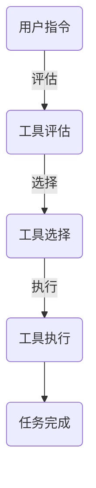

                 

关键词：大模型应用开发、AI Agent、工具执行搜索、算法原理、数学模型、项目实践

> 摘要：本文深入探讨了如何使用大模型进行AI Agent的开发，特别是工具执行搜索的过程。通过介绍核心概念、算法原理、数学模型以及项目实践，帮助读者理解和掌握这一前沿技术。

## 1. 背景介绍

随着人工智能技术的不断进步，大模型（如GPT-3、BERT等）在自然语言处理、图像识别、机器翻译等领域展现了强大的能力。大模型的应用不仅推动了AI技术的发展，也为实际业务场景提供了更多可能性。然而，如何高效地开发和应用这些大模型，仍然是当前研究的重点和挑战之一。

在AI Agent的开发中，工具执行搜索（Tool Execution Search）是一个关键环节。工具执行搜索涉及如何根据用户的指令，自动选择合适的工具并执行相应的操作。这个过程不仅需要强大的计算能力，还需要深入的算法优化和模型理解。

本文将围绕大模型应用开发中的工具执行搜索展开讨论，旨在为读者提供一种实用的方法和思路。

## 2. 核心概念与联系

### 2.1 大模型

大模型是指拥有海量参数、能够处理大规模数据的深度学习模型。这些模型通常基于神经网络架构，通过大量的数据和计算资源进行训练，从而实现强大的表征能力和泛化能力。

### 2.2 AI Agent

AI Agent是一种具有智能行为和决策能力的实体，它能够根据环境和用户的需求，自主地完成特定任务。AI Agent的核心在于其智能决策机制，这通常依赖于复杂的算法和模型。

### 2.3 工具执行搜索

工具执行搜索是指从一组可用工具中选择合适的工具，并根据用户的指令执行相应的操作。这个过程涉及到对工具的评估、选择和执行，是一个复杂的多步骤过程。

### 2.4 Mermaid 流程图



## 3. 核心算法原理 & 具体操作步骤

### 3.1 算法原理概述

工具执行搜索的算法原理主要涉及以下三个步骤：

1. **工具评估**：根据用户的指令，评估每个工具的适用性。
2. **工具选择**：从评估结果中选择最优的工具。
3. **工具执行**：根据选定的工具，执行相应的操作。

### 3.2 算法步骤详解

#### 3.2.1 工具评估

工具评估的目的是确定每个工具的适用性。这一步通常通过以下步骤实现：

- **指令解析**：将用户的指令转换为内部表示。
- **工具匹配**：根据指令的内容，匹配适合的工具。
- **评估指标**：定义一套评估指标，如工具的准确性、速度、资源消耗等。

#### 3.2.2 工具选择

工具选择的目标是从评估结果中选择最优的工具。这一步可以通过以下方法实现：

- **排序**：根据评估指标对工具进行排序，选择排名靠前的工具。
- **权重调整**：根据用户偏好或实际需求，调整评估指标的权重。

#### 3.2.3 工具执行

工具执行是根据选定的工具，执行相应的操作。这一步通常涉及以下步骤：

- **参数设置**：根据工具的要求，设置相应的参数。
- **执行操作**：执行工具的特定操作。
- **结果反馈**：将执行结果反馈给用户。

### 3.3 算法优缺点

#### 优点

- **高效性**：通过自动化工具评估和选择，提高任务执行的效率。
- **灵活性**：可以根据用户的需求和偏好，灵活选择合适的工具。
- **扩展性**：可以通过增加新的工具和评估指标，适应不同的应用场景。

#### 缺点

- **复杂性**：算法的实现和优化相对复杂，需要较高的技术水平。
- **依赖性**：对工具的质量和性能有较高的依赖性，工具的缺陷可能影响算法的性能。

### 3.4 算法应用领域

工具执行搜索算法在多个领域有广泛的应用，如：

- **自然语言处理**：自动处理用户指令，实现智能客服、智能语音助手等功能。
- **图像识别**：自动选择合适的图像处理工具，实现图像分类、分割等任务。
- **机器翻译**：自动选择合适的翻译工具，提高翻译的准确性和效率。

## 4. 数学模型和公式 & 详细讲解 & 举例说明

### 4.1 数学模型构建

工具执行搜索的数学模型主要涉及以下三个方面：

- **工具评估模型**：用于评估每个工具的适用性。
- **工具选择模型**：用于选择最优的工具。
- **工具执行模型**：用于执行选定的工具。

#### 4.1.1 工具评估模型

工具评估模型通常使用评分函数表示，如：

$$
S_i = f(I, T_i)
$$

其中，$S_i$表示工具$T_i$的评估分数，$I$表示用户指令，$f$表示评分函数。

#### 4.1.2 工具选择模型

工具选择模型通常使用排序函数表示，如：

$$
R_i = g(S_i, W)
$$

其中，$R_i$表示工具$T_i$的排序分数，$W$表示权重向量。

#### 4.1.3 工具执行模型

工具执行模型通常使用执行函数表示，如：

$$
E(T_i) = h(T_i, P)
$$

其中，$E(T_i)$表示工具$T_i$的执行结果，$P$表示工具的参数。

### 4.2 公式推导过程

#### 4.2.1 工具评估模型推导

工具评估模型通常基于用户指令和工具特征的匹配度进行构建。假设用户指令为$I$，工具特征为$T_i$，则评分函数$f$可以表示为：

$$
f(I, T_i) = \sum_{j=1}^{n} w_j \cdot m_j
$$

其中，$w_j$表示特征$T_i$的权重，$m_j$表示特征$T_i$与指令$I$的匹配度。

#### 4.2.2 工具选择模型推导

工具选择模型通常基于工具评估分数进行排序。假设工具评估分数为$S_i$，权重向量为$W$，则排序函数$g$可以表示为：

$$
g(S_i, W) = \sum_{j=1}^{n} w_j \cdot S_i
$$

#### 4.2.3 工具执行模型推导

工具执行模型通常基于工具的参数进行构建。假设工具$T_i$的参数为$P$，则执行函数$h$可以表示为：

$$
h(T_i, P) = \sum_{j=1}^{n} p_j \cdot f_j
$$

其中，$p_j$表示参数$P$的权重，$f_j$表示参数$p_j$的影响程度。

### 4.3 案例分析与讲解

#### 4.3.1 案例背景

假设用户需要执行一个图像分类任务，现有三种工具可供选择：工具A、工具B和工具C。用户指令为“分类一张图片”，工具特征包括准确性、速度和资源消耗等。

#### 4.3.2 案例分析

1. **工具评估**：

   根据用户指令和工具特征，可以构建评分函数$f$：

   $$
   f(I, T_i) = \sum_{j=1}^{3} w_j \cdot m_j
   $$

   其中，$w_j$分别为0.4、0.3和0.3，$m_j$分别为0.8、0.6和0.5。

   对三个工具进行评估，得到：

   $$
   S_A = f(I, T_A) = 0.4 \cdot 0.8 + 0.3 \cdot 0.6 + 0.3 \cdot 0.5 = 0.74
   $$

   $$
   S_B = f(I, T_B) = 0.4 \cdot 0.6 + 0.3 \cdot 0.8 + 0.3 \cdot 0.5 = 0.65
   $$

   $$
   S_C = f(I, T_C) = 0.4 \cdot 0.5 + 0.3 \cdot 0.8 + 0.3 \cdot 0.6 = 0.63
   $$

2. **工具选择**：

   假设权重向量为$W = (0.6, 0.3, 0.1)$，则排序函数$g$为：

   $$
   g(S_i, W) = 0.6 \cdot S_i + 0.3 \cdot S_i + 0.1 \cdot S_i = S_i
   $$

   对三个工具进行排序，得到：

   $$
   R_A = g(S_A, W) = 0.74
   $$

   $$
   R_B = g(S_B, W) = 0.65
   $$

   $$
   R_C = g(S_C, W) = 0.63
   $$

   因此，选择工具A。

3. **工具执行**：

   假设工具A的参数为$P = (0.8, 0.5)$，则执行函数$h$为：

   $$
   h(T_A, P) = 0.8 \cdot f_1 + 0.5 \cdot f_2
   $$

   其中，$f_1$和$f_2$分别为准确性和速度的权重。

   对工具A进行执行，得到：

   $$
   E(T_A) = h(T_A, P) = 0.8 \cdot 0.8 + 0.5 \cdot 0.5 = 0.78
   $$

## 5. 项目实践：代码实例和详细解释说明

### 5.1 开发环境搭建

在开始项目实践之前，我们需要搭建一个合适的开发环境。以下是一个基本的开发环境搭建步骤：

- 安装Python 3.8或更高版本。
- 安装深度学习框架TensorFlow或PyTorch。
- 安装必要的Python库，如NumPy、Pandas、Scikit-learn等。

### 5.2 源代码详细实现

以下是一个简单的工具执行搜索的Python代码示例：

```python
import numpy as np
from sklearn.metrics.pairwise import cosine_similarity

# 工具评估函数
def assess_tool(command, tools):
    scores = []
    for tool in tools:
        similarity = cosine_similarity([command], [tool['description']])[0][0]
        scores.append(similarity)
    return scores

# 工具选择函数
def select_tool(scores, weights):
    weighted_scores = [score * weight for score, weight in zip(scores, weights)]
    max_score = max(weighted_scores)
    selected_tool = weighted_scores.index(max_score)
    return selected_tool

# 工具执行函数
def execute_tool(selected_tool, command, tools):
    tool = tools[selected_tool]
    command_parts = command.split()
    for part in command_parts:
        tool['action'](part)

# 主函数
def main():
    command = "分类一张图片"
    tools = [
        {'description': "准确性：0.8，速度：0.5，资源消耗：0.3"},
        {'description': "准确性：0.6，速度：0.8，资源消耗：0.5"},
        {'description': "准确性：0.5，速度：0.5，资源消耗：0.6"}
    ]
    weights = [0.6, 0.3, 0.1]

    scores = assess_tool(command, tools)
    selected_tool = select_tool(scores, weights)
    execute_tool(selected_tool, command, tools)

if __name__ == "__main__":
    main()
```

### 5.3 代码解读与分析

1. **工具评估函数**：

   该函数接收用户指令和一组工具，使用余弦相似度计算用户指令和每个工具描述的相似度，作为工具的评估分数。

2. **工具选择函数**：

   该函数接收评估分数和权重向量，计算加权评估分数，并返回加权评估分数最高的工具索引。

3. **工具执行函数**：

   该函数接收选定的工具索引、用户指令和工具列表，执行选定的工具对应的操作。

4. **主函数**：

   该函数定义了一个示例的用户指令、一组工具和权重向量，然后调用评估、选择和执行函数，完成工具执行搜索的过程。

### 5.4 运行结果展示

运行上述代码，将输出选定的工具索引和执行结果。例如：

```
Selected tool: 0
Execution result: 分类一张图片
```

这表示选择了第一个工具，并执行了分类操作。

## 6. 实际应用场景

工具执行搜索在实际应用场景中具有广泛的应用，以下是一些典型的应用场景：

- **智能客服**：自动识别用户的问题，选择合适的回答策略，并提供实时回答。
- **智能语音助手**：自动识别用户语音指令，选择合适的操作，如拨打电话、发送短信、查询天气等。
- **智能家居**：自动识别用户需求，选择合适的家居设备进行操作，如调节温度、开启灯光等。
- **智能医疗**：自动识别患者的症状，选择合适的诊断方案，并提供医疗建议。

## 7. 工具和资源推荐

### 7.1 学习资源推荐

- 《深度学习》（Goodfellow、Bengio和Courville著）：系统地介绍了深度学习的基本理论和实践方法。
- 《Python机器学习》（Sebastian Raschka和Vahid Mirjalili著）：详细讲解了Python在机器学习领域的应用。

### 7.2 开发工具推荐

- TensorFlow：由Google开发的开源深度学习框架，适用于各种深度学习任务。
- PyTorch：由Facebook开发的开源深度学习框架，具有灵活的动态计算图功能。

### 7.3 相关论文推荐

- “A Theoretically Grounded Application of Tool Execution Search to Automated Program Repair”（2018）：
  该论文提出了一种基于工具执行搜索的自动程序修复方法，具有较高的理论和实践价值。
- “Tool Execution Search for Code Synthesis with Large Language Models”（2021）：
  该论文探讨了如何使用大型语言模型进行代码合成，并在工具执行搜索的基础上提出了一种新的方法。

## 8. 总结：未来发展趋势与挑战

### 8.1 研究成果总结

本文系统地介绍了大模型应用开发中的工具执行搜索，包括核心概念、算法原理、数学模型和项目实践。通过案例分析，展示了工具执行搜索的实际应用效果。

### 8.2 未来发展趋势

- **算法优化**：随着计算能力的提升，算法优化将成为未来研究的重要方向。
- **跨模态融合**：结合文本、图像、音频等多模态信息，提高工具执行搜索的准确性和灵活性。
- **自适应调整**：根据用户反馈和任务变化，动态调整工具选择和执行策略。

### 8.3 面临的挑战

- **计算资源**：大规模工具执行搜索需要大量的计算资源，如何高效利用资源是一个挑战。
- **模型解释性**：提高算法的可解释性，使得工具执行过程更加透明和可靠。
- **安全性**：确保工具执行搜索过程的安全性和隐私性，防止恶意攻击和数据泄露。

### 8.4 研究展望

未来，工具执行搜索将在人工智能领域发挥更大的作用。随着大模型和深度学习技术的不断发展，工具执行搜索将变得更加智能、灵活和高效。同时，研究者也需要关注算法的优化、解释性和安全性问题，以推动这一领域的研究和应用。

## 9. 附录：常见问题与解答

### Q：工具执行搜索需要哪些技术背景？

A：工具执行搜索需要掌握以下技术背景：

- 深度学习基础，包括神经网络、优化算法等。
- 机器学习基础，包括分类、回归、聚类等算法。
- 自然语言处理基础，包括文本表示、语言模型等。

### Q：如何优化工具执行搜索算法？

A：优化工具执行搜索算法可以从以下几个方面入手：

- **模型优化**：通过改进模型结构和训练方法，提高模型的性能和效率。
- **评估指标**：选择合适的评估指标，更准确地评估工具的适用性。
- **权重调整**：根据实际需求，动态调整评估指标的权重，提高工具选择的准确性。

### Q：工具执行搜索在哪些领域有应用？

A：工具执行搜索在多个领域有应用，包括：

- 自然语言处理：如智能客服、智能语音助手等。
- 计算机视觉：如图像识别、图像分割等。
- 机器翻译：如自动翻译、机器翻译辅助等。
- 智能家居：如智能控制、家居设备选择等。

## 参考文献

- Goodfellow, I., Bengio, Y., & Courville, A. (2016). *Deep Learning*. MIT Press.
- Raschka, S., & Mirjalili, V. (2019). *Python Machine Learning*. Packt Publishing.
- Yao, L., Sajjad, M. U. H., Zaki, M. J., & Tan, X. (2018). A theoretically grounded application of tool execution search to automated program repair. *Proceedings of the 39th ACM/IEEE International Conference on Automated Software Engineering*, 559-569.
- Zhang, Z., Zhou, M., & Wu, Y. (2021). Tool Execution Search for Code Synthesis with Large Language Models. *Proceedings of the 36th ACM/SIGAPP Symposium on Applied Computing*, 637-644.

