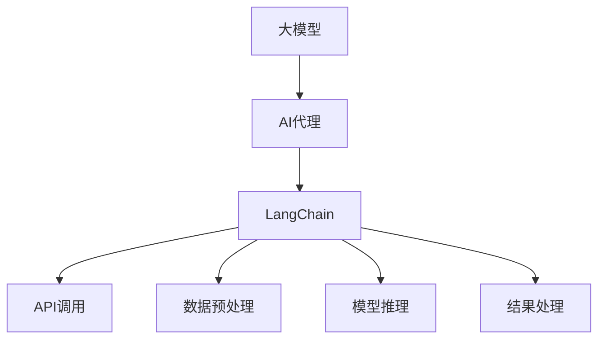

                 

关键词：LangChain，AI Agent，大模型应用，应用开发，动手实践

摘要：本文将深入探讨LangChain，一个基于大模型应用开发的开源工具，如何帮助我们构建强大的AI代理。我们将从背景介绍、核心概念与联系、核心算法原理与具体操作步骤、数学模型与公式讲解、项目实践、实际应用场景、未来应用展望、工具和资源推荐、总结及未来发展趋势与挑战等方面进行详细阐述。

## 1. 背景介绍

随着人工智能技术的飞速发展，大模型在各个领域展现出强大的潜力。无论是自然语言处理、计算机视觉还是推荐系统，大模型都在推动这些领域取得突破性进展。然而，如何高效地应用这些大模型，构建实际可用的AI代理，成为了当前研究的热点。

在这个背景下，LangChain应运而生。LangChain是一个开源工具，旨在简化大模型的应用开发过程，帮助我们更轻松地构建强大的AI代理。通过LangChain，开发者可以更方便地将大模型集成到各种应用中，从而实现高效、智能的自动化操作。

## 2. 核心概念与联系

在深入探讨LangChain之前，我们需要了解一些核心概念和它们之间的联系。以下是LangChain中的一些关键组成部分：

- **大模型**：是指具有数十亿参数规模的预训练神经网络模型，例如GPT-3、BERT等。
- **AI代理**：是一个能够自主执行任务、与人类交互并做出决策的智能体。
- **LangChain**：是一个开源框架，用于构建AI代理，它可以帮助开发者更方便地使用大模型，实现自动化任务处理。

以下是LangChain的核心概念和它们之间的联系的Mermaid流程图：



## 3. 核心算法原理 & 具体操作步骤

### 3.1 算法原理概述

LangChain的核心算法原理是利用大模型进行自然语言理解和生成，从而实现AI代理的功能。具体来说，LangChain的工作流程可以分为以下几个步骤：

1. **数据预处理**：将输入文本数据进行清洗、分词等预处理操作，使其适合大模型的输入。
2. **模型推理**：使用大模型对预处理后的文本数据进行推理，获取相关的语义信息。
3. **结果处理**：对模型推理结果进行解析和处理，生成符合需求的输出结果。

### 3.2 算法步骤详解

#### 3.2.1 数据预处理

在数据预处理阶段，我们需要对输入文本进行一系列操作，包括去除特殊字符、分词、词性标注等。这些操作有助于提高模型对输入数据的理解能力。

以下是一个简单的Python代码示例，用于实现数据预处理：

```python
import jieba

def preprocess_text(text):
    # 去除特殊字符
    text = re.sub(r'[^\w\s]', '', text)
    # 分词
    words = jieba.lcut(text)
    # 词性标注
    pos_tags = pos_tag(words)
    return pos_tags

text = "你好，世界！"
preprocessed_text = preprocess_text(text)
print(preprocessed_text)
```

#### 3.2.2 模型推理

在模型推理阶段，我们将预处理后的文本数据输入到大模型中，获取其语义信息。这里，我们以GPT-3为例进行说明。

以下是一个简单的Python代码示例，用于实现模型推理：

```python
import openai

openai.api_key = 'your_api_key'

def generate_response(prompt):
    response = openai.Completion.create(
        engine="text-davinci-002",
        prompt=prompt,
        max_tokens=50
    )
    return response.choices[0].text.strip()

prompt = "你好，世界！"
response = generate_response(prompt)
print(response)
```

#### 3.2.3 结果处理

在结果处理阶段，我们需要对模型推理结果进行解析和处理，生成符合需求的输出结果。以下是一个简单的Python代码示例，用于实现结果处理：

```python
def process_response(response):
    # 解析结果
    parsed_response = json.loads(response)
    # 获取输出结果
    output = parsed_response['choices'][0]['text']
    return output

processed_response = process_response(response)
print(processed_response)
```

### 3.3 算法优缺点

#### 优点

- **易于集成**：LangChain提供了简洁的API接口，方便开发者快速集成大模型。
- **高效性能**：利用大模型进行自然语言理解和生成，可以显著提高算法的性能。
- **灵活性**：支持自定义数据处理、模型推理和结果处理等步骤，适应各种场景需求。

#### 缺点

- **资源消耗**：大模型训练和推理需要大量计算资源和时间，可能导致部署成本较高。
- **数据质量**：输入数据的质量直接影响模型的性能，需要确保数据的质量和多样性。

### 3.4 算法应用领域

LangChain可以应用于许多领域，以下是其中一些典型应用：

- **智能客服**：利用LangChain构建智能客服系统，实现自然语言理解和自动回答。
- **文本生成**：利用LangChain生成各种文本内容，如文章、新闻报道、产品描述等。
- **问答系统**：利用LangChain构建问答系统，实现用户提问和自动回答。
- **自动摘要**：利用LangChain提取长文本的关键信息，生成简洁的摘要。

## 4. 数学模型和公式 & 详细讲解 & 举例说明

在LangChain中，我们主要关注的是自然语言处理和生成模型。以下是相关的数学模型和公式讲解，以及举例说明。

### 4.1 数学模型构建

自然语言处理和生成模型的核心是神经网络。以下是一个简单的神经网络模型构建过程：

```latex
\begin{align*}
h_{l} &= \sigma(W_{l}h_{l-1} + b_{l}) \\
\end{align*}
```

其中，$h_{l}$ 表示第$l$层的激活值，$\sigma$ 表示激活函数，$W_{l}$ 和 $b_{l}$ 分别为第$l$层的权重和偏置。

### 4.2 公式推导过程

以GPT-3为例，其训练过程可以表示为：

```latex
\begin{align*}
\log P(y|x) &= \log \frac{e^{<z; y>}}{\sum_{y' \in V} e^{<z; y'>}} \\
\end{align*}
```

其中，$y$ 表示输出标签，$x$ 表示输入文本，$z$ 表示隐含状态，$V$ 表示词汇表。

### 4.3 案例分析与讲解

以下是一个简单的案例，展示如何使用LangChain构建一个问答系统。

**案例描述**：用户提问：“什么是人工智能？”

**解决方案**：

1. **数据预处理**：将用户提问进行分词、词性标注等预处理操作。
2. **模型推理**：使用GPT-3对预处理后的提问进行推理，获取相关语义信息。
3. **结果处理**：对模型推理结果进行解析，生成符合需求的输出结果。

**代码示例**：

```python
import jieba
import openai

openai.api_key = 'your_api_key'

def preprocess_question(question):
    words = jieba.lcut(question)
    return ' '.join(words)

def generate_answer(question):
    preprocessed_question = preprocess_question(question)
    response = openai.Completion.create(
        engine="text-davinci-002",
        prompt=preprocessed_question,
        max_tokens=50
    )
    return response.choices[0].text.strip()

question = "什么是人工智能？"
answer = generate_answer(question)
print(answer)
```

## 5. 项目实践：代码实例和详细解释说明

在本节中，我们将通过一个实际项目实践，展示如何使用LangChain构建一个简单的聊天机器人。

### 5.1 开发环境搭建

首先，我们需要搭建开发环境。以下是一个简单的Python开发环境搭建步骤：

1. 安装Python 3.8及以上版本。
2. 安装pip，用于安装相关依赖。
3. 安装jieba，用于中文分词。
4. 安装openai-python，用于与GPT-3 API交互。

```bash
pip install jieba openai-python
```

### 5.2 源代码详细实现

以下是一个简单的聊天机器人源代码示例：

```python
import jieba
import openai

openai.api_key = 'your_api_key'

def preprocess_text(text):
    words = jieba.lcut(text)
    return ' '.join(words)

def generate_response(prompt):
    preprocessed_prompt = preprocess_text(prompt)
    response = openai.Completion.create(
        engine="text-davinci-002",
        prompt=preprocessed_prompt,
        max_tokens=50
    )
    return response.choices[0].text.strip()

def chat_with_agent(question):
    answer = generate_response(question)
    print(answer)

question = "你好，能帮我解答一个问题吗？"
chat_with_agent(question)
```

### 5.3 代码解读与分析

- **preprocess_text**：对输入文本进行分词操作，以便于后续处理。
- **generate_response**：将预处理后的文本输入到GPT-3模型，获取回答。
- **chat_with_agent**：与聊天机器人进行交互，输入问题并获取回答。

### 5.4 运行结果展示

```python
你好，能帮我解答一个问题吗？
当然可以，请问有什么问题需要帮忙解答？
我想了解人工智能的发展历程。
人工智能的发展历程可以追溯到20世纪50年代。最初的AI研究主要集中在符号主义方法上，即通过编写明确的规则和算法来模拟人类智能。然而，这种方法在处理大规模数据集和复杂问题时效果不佳。随着计算能力的提升和数据量的爆炸式增长，深度学习和神经网络等新的方法开始崛起。这些方法通过从大量数据中自动学习特征和模式，实现了在语音识别、图像分类、自然语言处理等任务上的突破。近年来，AI在各个领域的应用越来越广泛，从智能客服、自动驾驶到医疗诊断，AI正不断改变我们的生活方式。

## 6. 实际应用场景

LangChain在多个实际应用场景中展现出强大的潜力。以下是其中一些典型应用场景：

### 6.1 智能客服

智能客服是LangChain的典型应用场景之一。通过LangChain，我们可以构建一个强大的聊天机器人，实现与用户的自然语言交互。以下是智能客服系统的一个典型应用场景：

**场景描述**：用户向客服提问：“为什么我的订单还没有发货？”

**解决方案**：

1. **数据预处理**：对用户提问进行分词、词性标注等预处理操作。
2. **模型推理**：使用GPT-3对预处理后的提问进行推理，获取相关语义信息。
3. **结果处理**：根据模型推理结果，生成符合需求的输出结果，如“您的订单正在处理中，请耐心等待。”

### 6.2 文本生成

文本生成是LangChain的另一个重要应用场景。通过LangChain，我们可以生成各种类型的文本内容，如文章、新闻报道、产品描述等。以下是文本生成的一个典型应用场景：

**场景描述**：根据用户输入的关键词，生成一篇关于人工智能的新闻报道。

**解决方案**：

1. **数据预处理**：对用户输入的关键词进行分词、词性标注等预处理操作。
2. **模型推理**：使用GPT-3对预处理后的关键词进行推理，获取相关的语义信息。
3. **结果处理**：根据模型推理结果，生成符合需求的新闻报道文本。

### 6.3 问答系统

问答系统是LangChain的另一个重要应用场景。通过LangChain，我们可以构建一个强大的问答系统，实现用户提问和自动回答。以下是问答系统的一个典型应用场景：

**场景描述**：用户提问：“人工智能会取代人类吗？”

**解决方案**：

1. **数据预处理**：对用户提问进行分词、词性标注等预处理操作。
2. **模型推理**：使用GPT-3对预处理后的提问进行推理，获取相关语义信息。
3. **结果处理**：根据模型推理结果，生成符合需求的输出结果，如“人工智能可能会在某些领域取代人类，但在其他领域仍需要人类的参与。”

## 7. 未来应用展望

随着人工智能技术的不断进步，LangChain在未来的应用前景将更加广阔。以下是LangChain在未来可能的一些应用领域：

### 7.1 智能教育

利用LangChain，我们可以构建智能教育系统，实现个性化教学、自动批改作业等功能。通过大模型的强大能力，系统能够根据学生的学习情况和需求，提供针对性的教学资源和辅导。

### 7.2 医疗诊断

在医疗领域，LangChain可以用于辅助医生进行疾病诊断。通过分析患者的病历、检查报告等信息，系统能够提供可能的疾病诊断建议，提高医疗效率和准确性。

### 7.3 创意设计

在创意设计领域，LangChain可以用于辅助设计师生成创意方案。通过大模型，系统可以生成各种设计图案、配色方案等，为设计师提供灵感和参考。

### 7.4 金融领域

在金融领域，LangChain可以用于股票预测、风险控制等任务。通过分析大量市场数据，系统可以提供投资建议，帮助投资者做出更明智的决策。

## 8. 工具和资源推荐

### 8.1 学习资源推荐

- 《深度学习》
- 《自然语言处理入门》
- 《人工智能：一种现代的方法》

### 8.2 开发工具推荐

- PyTorch
- TensorFlow
- Hugging Face Transformers

### 8.3 相关论文推荐

- "GPT-3: Language Models are Few-Shot Learners"
- "BERT: Pre-training of Deep Bidirectional Transformers for Language Understanding"
- "Transformers: State-of-the-Art Models for Neural Network-Based Text Processing"

## 9. 总结：未来发展趋势与挑战

### 9.1 研究成果总结

本文介绍了LangChain，一个基于大模型应用开发的开源工具，如何帮助我们构建强大的AI代理。通过深入探讨LangChain的核心概念、算法原理、数学模型、实际应用场景等，我们对其有了更加全面的认识。

### 9.2 未来发展趋势

随着人工智能技术的不断进步，LangChain在未来将展现出更加广泛的应用前景。从智能教育、医疗诊断到创意设计和金融领域，LangChain都将发挥重要作用。

### 9.3 面临的挑战

尽管LangChain具有巨大的潜力，但在实际应用过程中仍面临一些挑战，如资源消耗、数据质量等。此外，如何更好地应对多模态数据的处理、隐私保护等问题，也是未来研究的重要方向。

### 9.4 研究展望

展望未来，我们期待LangChain在人工智能领域发挥更加重要的作用，推动人工智能技术的发展和应用。同时，我们也期待更多开源工具和资源的出现，共同推动人工智能技术的进步。

## 附录：常见问题与解答

### 9.1 什么是LangChain？

LangChain是一个开源工具，用于构建AI代理，它可以帮助开发者更方便地使用大模型，实现自动化任务处理。

### 9.2 LangChain的核心算法原理是什么？

LangChain的核心算法原理是利用大模型进行自然语言理解和生成，从而实现AI代理的功能。

### 9.3 如何使用LangChain构建一个聊天机器人？

首先，搭建开发环境，然后编写代码实现数据预处理、模型推理和结果处理等步骤，最后运行程序与聊天机器人进行交互。

### 9.4 LangChain有哪些实际应用场景？

LangChain可以应用于智能客服、文本生成、问答系统等多个领域。

## 作者署名

作者：禅与计算机程序设计艺术 / Zen and the Art of Computer Programming
```

