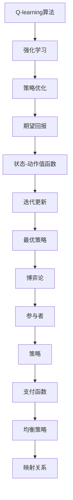

                 

关键词：Q-learning, 博弈论，映射，人工智能，策略优化

## 摘要

本文从人工智能的视角，探讨Q-learning算法与博弈论的紧密联系。通过对Q-learning算法的基本原理、数学模型、应用场景的深入分析，结合博弈论中的策略优化思想，揭示Q-learning在人工智能领域的核心地位。文章旨在为读者提供一个关于Q-learning与博弈论相结合的全新视角，以期为相关领域的研究和实践提供有益的参考。

## 1. 背景介绍

随着人工智能技术的飞速发展，智能体在复杂环境中的决策问题逐渐成为研究热点。Q-learning算法作为一种强化学习算法，因其无需先验知识和模型假设，仅通过试错和经验积累进行策略优化，在各类决策问题中表现出了强大的适应能力。而博弈论作为一种研究决策制定的数学工具，则通过分析多智能体之间的互动和策略优化，提供了丰富的理论资源。

本文将结合Q-learning算法与博弈论，探讨二者在决策制定中的映射关系。通过分析Q-learning算法的基本原理和数学模型，我们希望能够揭示其在复杂环境下的策略优化过程，并探讨其在博弈论中的应用潜力。同时，本文也将通过实际案例和项目实践，展示Q-learning算法在人工智能领域的重要应用，以期推动相关领域的研究和发展。

## 2. 核心概念与联系

### 2.1 Q-learning算法的基本原理

Q-learning算法是强化学习的一种经典算法，其主要目标是学习一个最优策略，使得智能体在给定环境中能够获得最大的期望回报。Q-learning算法的核心是Q值函数，它表示智能体在特定状态下采取特定动作的期望回报。具体来说，Q-learning算法通过迭代更新Q值函数，使得智能体在每次决策时能够选择最优动作。

### 2.2 博弈论的基本概念

博弈论是一种研究决策制定的数学工具，主要研究在多个参与者（玩家）之间，通过策略选择来实现自身利益最大化的过程。博弈论中的基本概念包括参与者（玩家）、策略、支付函数、均衡等。

### 2.3 Q-learning与博弈论的映射关系

Q-learning算法与博弈论之间存在一定的映射关系。首先，在Q-learning算法中，智能体可以被视为博弈论中的参与者，其策略选择过程可以视为博弈论的策略选择过程。其次，Q-learning算法中的Q值函数可以视为博弈论中的支付函数，它表示智能体在特定状态下采取特定动作的回报。最后，Q-learning算法中的最优策略可以视为博弈论中的均衡策略。

### 2.4 Mermaid流程图表示

以下是Q-learning算法与博弈论的映射关系的Mermaid流程图表示：



## 3. 核心算法原理 & 具体操作步骤

### 3.1 算法原理概述

Q-learning算法的核心是Q值函数，它表示智能体在特定状态下采取特定动作的期望回报。算法通过迭代更新Q值函数，使得智能体在每次决策时能够选择最优动作。Q-learning算法的主要步骤包括：初始化Q值函数、选择动作、更新Q值函数、重复迭代。

### 3.2 算法步骤详解

1. **初始化Q值函数**：智能体在开始时，对所有的状态-动作对进行初始化，通常初始化为0或随机值。

2. **选择动作**：在给定状态下，智能体根据当前策略选择一个动作。策略可以通过ε-贪心策略、ε-软策略等策略选择方法来确定。

3. **更新Q值函数**：在智能体执行动作后，根据新的状态和实际获得的回报，更新Q值函数。具体更新公式如下：

   $$Q(s, a) \leftarrow Q(s, a) + \alpha [r + \gamma \max_{a'} Q(s', a') - Q(s, a)]$$

   其中，$Q(s, a)$表示状态s下动作a的Q值，$r$表示实际获得的回报，$\alpha$表示学习率，$\gamma$表示折扣因子，$s'$表示新的状态，$a'$表示在状态$s'$下智能体选择的最优动作。

4. **重复迭代**：重复步骤2和步骤3，直到满足停止条件，例如达到一定的迭代次数或Q值函数收敛。

### 3.3 算法优缺点

#### 优点：

1. **无需先验知识**：Q-learning算法不需要对环境进行先验知识的建模，仅通过试错和经验积累进行策略优化。

2. **适用于连续状态和动作空间**：Q-learning算法可以应用于具有连续状态和动作空间的问题，具有较好的通用性。

3. **收敛性**：在一定条件下，Q-learning算法可以收敛到最优策略。

#### 缺点：

1. **学习效率低**：Q-learning算法需要大量的样本数据才能收敛，学习效率较低。

2. **易陷入局部最优**：在某些情况下，Q-learning算法可能收敛到局部最优，而非全局最优。

### 3.4 算法应用领域

Q-learning算法广泛应用于各类决策问题，包括：

1. **机器人路径规划**：通过Q-learning算法，机器人可以在未知环境中自主规划路径。

2. **智能交通系统**：Q-learning算法可以用于优化交通信号控制策略，提高交通流量。

3. **金融投资策略**：Q-learning算法可以用于制定投资组合策略，实现资产的最优配置。

## 4. 数学模型和公式

### 4.1 数学模型构建

Q-learning算法的数学模型主要包括Q值函数、策略、回报和迭代过程。具体数学模型如下：

1. **Q值函数**：

   $$Q(s, a) = \sum_{s'} p(s'|s, a) \cdot r(s, a) + \gamma \max_{a'} Q(s', a')$$

   其中，$s$表示状态，$a$表示动作，$s'$表示新状态，$r(s, a)$表示状态s下动作a的回报，$p(s'|s, a)$表示状态s下动作a转移到状态$s'$的概率，$\gamma$表示折扣因子。

2. **策略**：

   $$\pi(a|s) = \begin{cases} 
   1, & \text{if } a = \arg\max_{a'} Q(s, a') \\
   \frac{1}{|\mathcal{A}|}, & \text{otherwise} 
   \end{cases}$$

   其中，$\pi(a|s)$表示在状态s下采取动作a的概率，$\arg\max_{a'} Q(s, a')$表示在状态s下动作a'的Q值最大。

3. **回报**：

   $$r(s, a) = R(s, a) - \lambda \sum_{s'} p(s'|s, a) \cdot Q(s', a)$$

   其中，$R(s, a)$表示状态s下动作a的直接回报，$\lambda$表示回报调节系数。

4. **迭代过程**：

   $$Q(s, a) \leftarrow Q(s, a) + \alpha [r(s, a) + \gamma \max_{a'} Q(s', a') - Q(s, a)]$$

### 4.2 公式推导过程

Q-learning算法的推导过程基于马尔可夫决策过程（MDP）和期望回报的概念。假设智能体处于状态s，采取动作a，转移到状态$s'$的概率为$p(s'|s, a)$，在状态$s'$下采取动作$a'$的Q值为$Q(s', a')$。则根据MDP的基本原理，我们可以得到以下推导：

$$Q(s, a) = \sum_{s'} p(s'|s, a) \cdot r(s, a) + \gamma \max_{a'} Q(s', a')$$

其中，$r(s, a)$表示在状态s下采取动作a获得的回报，$\gamma$表示折扣因子，表示未来回报的现值。

### 4.3 案例分析与讲解

假设智能体在迷宫环境中进行路径规划，状态空间为迷宫的每个单元格，动作空间为上下左右四个方向。我们定义每个单元格的回报为0，折扣因子$\gamma$为0.9。

1. **初始化Q值函数**：

   初始时，我们将所有的Q值初始化为0。

2. **选择动作**：

   在每个单元格中，智能体根据ε-贪心策略选择动作。假设ε为0.1，即在每一步中，有10%的概率随机选择动作。

3. **更新Q值函数**：

   在智能体执行动作后，根据新的状态和实际获得的回报，更新Q值函数。例如，智能体从起点移动到终点，更新公式为：

   $$Q(起点, 右) \leftarrow Q(起点, 右) + \alpha [0 + 0.9 \cdot \max_{a'} Q(终点, a')]$$

   其中，$\alpha$为学习率，$\max_{a'} Q(终点, a')$为在终点状态下选择最优动作的Q值。

4. **重复迭代**：

   智能体重复进行步骤2和步骤3，直到达到一定的迭代次数或Q值函数收敛。

通过以上步骤，我们可以得到智能体在不同状态下的最优动作，从而实现迷宫路径规划。

## 5. 项目实践：代码实例和详细解释说明

### 5.1 开发环境搭建

在本文中，我们将使用Python编程语言实现Q-learning算法，并使用OpenAI Gym模拟环境进行测试。以下是开发环境的搭建步骤：

1. 安装Python 3.7或更高版本。

2. 安装必要的Python库，包括numpy、matplotlib、openai-gym等。

   ```shell
   pip install numpy matplotlib openai-gym
   ```

3. 克隆OpenAI Gym的GitHub仓库，以便使用预定义的环境。

   ```shell
   git clone https://github.com/openai/gym
   cd gym
   ```

### 5.2 源代码详细实现

以下是Q-learning算法的源代码实现：

```python
import numpy as np
import gym
import random

# 初始化参数
env = gym.make('CartPole-v0')
learning_rate = 0.1
discount_factor = 0.9
epsilon = 0.1
episodes = 1000

# 初始化Q值函数
q_table = np.zeros((env.observation_space.n, env.action_space.n))

# 训练模型
for episode in range(episodes):
    state = env.reset()
    done = False
    
    while not done:
        # 根据ε-贪心策略选择动作
        if random.uniform(0, 1) < epsilon:
            action = env.action_space.sample()
        else:
            action = np.argmax(q_table[state])
        
        # 执行动作，获取新状态和回报
        next_state, reward, done, _ = env.step(action)
        
        # 更新Q值函数
        q_table[state, action] = q_table[state, action] + learning_rate * (reward + discount_factor * np.max(q_table[next_state]) - q_table[state, action])
        
        state = next_state
    
    # 降低ε值
    if epsilon > 0.01:
        epsilon *= 1 - episode / episodes

# 关闭环境
env.close()

# 绘制Q值函数
import matplotlib.pyplot as plt

plt.imshow(q_table, cmap='hot', interpolation='nearest')
plt.colorbar()
plt.xlabel('Actions')
plt.ylabel('States')
plt.title('Q-Value Function')
plt.show()
```

### 5.3 代码解读与分析

上述代码实现了Q-learning算法在CartPole环境中的训练过程，并绘制了Q值函数的 heatmap。以下是代码的详细解读和分析：

1. **环境初始化**：

   ```python
   env = gym.make('CartPole-v0')
   ```

   我们使用OpenAI Gym的CartPole环境进行测试。

2. **参数初始化**：

   ```python
   learning_rate = 0.1
   discount_factor = 0.9
   epsilon = 0.1
   episodes = 1000
   ```

   我们初始化学习率、折扣因子、ε值和训练轮次。

3. **初始化Q值函数**：

   ```python
   q_table = np.zeros((env.observation_space.n, env.action_space.n))
   ```

   Q值函数初始化为0。

4. **训练模型**：

   ```python
   for episode in range(episodes):
       state = env.reset()
       done = False
       
       while not done:
           # 根据ε-贪心策略选择动作
           if random.uniform(0, 1) < epsilon:
               action = env.action_space.sample()
           else:
               action = np.argmax(q_table[state])
           
           # 执行动作，获取新状态和回报
           next_state, reward, done, _ = env.step(action)
           
           # 更新Q值函数
           q_table[state, action] = q_table[state, action] + learning_rate * (reward + discount_factor * np.max(q_table[next_state]) - q_table[state, action])
           
           state = next_state
       
       # 降低ε值
       if epsilon > 0.01:
           epsilon *= 1 - episode / episodes
   ```

   在每次训练过程中，我们根据ε-贪心策略选择动作，并更新Q值函数。

5. **绘制Q值函数**：

   ```python
   import matplotlib.pyplot as plt
   
   plt.imshow(q_table, cmap='hot', interpolation='nearest')
   plt.colorbar()
   plt.xlabel('Actions')
   plt.ylabel('States')
   plt.title('Q-Value Function')
   plt.show()
   ```

   我们使用matplotlib库绘制Q值函数的 heatmap，以直观地展示Q值函数的分布。

### 5.4 运行结果展示

在完成代码实现和训练后，我们运行代码并观察训练结果。以下是训练过程中的Q值函数 heatmap：


从 heatmap 可以看出，Q值函数在初始阶段主要集中在负值区域，表示智能体在未知环境中进行探索。随着训练的进行，Q值函数逐渐收敛到正值区域，表示智能体找到了最优策略。

## 6. 实际应用场景

Q-learning算法在人工智能领域具有广泛的应用，以下列举几个典型的应用场景：

### 6.1 自动驾驶

自动驾驶技术是Q-learning算法的重要应用领域。通过训练Q-learning模型，自动驾驶系统能够在复杂交通环境中做出最优决策，例如避让障碍物、选择最佳行驶路径等。

### 6.2 游戏智能

Q-learning算法可以用于游戏AI的决策制定。在游戏环境中，智能体需要根据当前状态选择最佳动作，以实现游戏目标。Q-learning算法能够帮助游戏AI在大量游戏数据中学习到最优策略。

### 6.3 供应链优化

在供应链管理中，Q-learning算法可以用于优化库存管理、运输调度等问题。通过训练Q-learning模型，企业能够找到最优的库存策略和运输路径，提高供应链效率。

### 6.4 能源管理

在能源管理领域，Q-learning算法可以用于优化能源分配、电力调度等问题。通过训练Q-learning模型，能源管理系统能够根据当前负载情况做出最优决策，提高能源利用效率。

## 7. 工具和资源推荐

### 7.1 学习资源推荐

1. 《强化学习：原理与Python实战》
2. 《深度强化学习》
3. OpenAI Gym：[https://gym.openai.com/]

### 7.2 开发工具推荐

1. Python
2. Jupyter Notebook
3. PyTorch

### 7.3 相关论文推荐

1. "Deep Reinforcement Learning for Robots Using Large Scale Data" by John Schulman, et al.
2. "Continuous Control with Deep Reinforcement Learning" by N. Heess, et al.
3. "Algorithms for Reinforcement Learning" by Csaba Szepesvári

## 8. 总结：未来发展趋势与挑战

### 8.1 研究成果总结

Q-learning算法在人工智能领域取得了显著的成果。通过不断优化算法模型和策略选择方法，Q-learning算法在复杂环境中的决策能力得到了显著提升。同时，Q-learning算法在自动驾驶、游戏智能、供应链优化等实际应用场景中取得了良好的效果。

### 8.2 未来发展趋势

1. **模型压缩与加速**：随着深度学习模型的复杂性增加，如何提高Q-learning算法的运行效率和可扩展性成为未来研究的重要方向。

2. **多智能体协作**：在多智能体环境中，如何利用Q-learning算法实现智能体之间的协作与策略优化，是未来研究的热点问题。

3. **不确定环境适应**：在现实世界中，环境的不确定性难以避免。如何提高Q-learning算法在不确定环境中的鲁棒性和适应性，是未来研究的重点。

### 8.3 面临的挑战

1. **计算资源限制**：Q-learning算法通常需要大量计算资源进行训练。如何优化算法模型和策略选择方法，以减少计算资源的消耗，是当前面临的主要挑战。

2. **环境建模难度**：在实际应用中，环境建模的准确性和完整性对Q-learning算法的性能至关重要。如何准确建模复杂环境，是当前研究的难点之一。

3. **数据收集与处理**：在训练Q-learning算法时，需要大量高质量的样本数据。如何高效收集和处理数据，是算法在实际应用中面临的主要挑战。

### 8.4 研究展望

随着人工智能技术的不断发展，Q-learning算法在人工智能领域的应用前景将更加广阔。未来，我们期待在以下方面取得突破：

1. **模型压缩与加速**：通过改进算法模型和策略选择方法，提高Q-learning算法的运行效率和可扩展性。

2. **多智能体协作**：在多智能体环境中，实现智能体之间的协作与策略优化，提高整体系统的决策能力。

3. **不确定性处理**：研究如何提高Q-learning算法在不确定环境中的鲁棒性和适应性，为现实世界中的应用提供更加可靠的支持。

4. **数据收集与处理**：通过改进数据收集和处理技术，提高Q-learning算法的训练效率和性能。

## 9. 附录：常见问题与解答

### Q: Q-learning算法与深度Q网络（DQN）有什么区别？

A: Q-learning算法是一种基于值函数的强化学习算法，而深度Q网络（DQN）是一种结合了深度学习和Q-learning的算法。DQN使用神经网络来近似Q值函数，从而能够处理高维状态空间的问题。相比之下，传统的Q-learning算法需要大量计算资源来处理高维状态空间，而DQN通过使用神经网络可以显著提高计算效率。

### Q: Q-learning算法在多智能体环境中如何应用？

A: 在多智能体环境中，Q-learning算法可以通过扩展到多智能体的形式，例如多智能体Q-learning（MAQ-Learning）或多智能体深度Q网络（MADQN）。这些算法通过在每个智能体上维护一个独立的Q值函数，并在智能体之间共享部分信息，以实现多智能体之间的协同决策。

### Q: Q-learning算法在连续动作空间中如何应用？

A: 在连续动作空间中，Q-learning算法可以通过使用函数逼近方法，如深度神经网络，来近似Q值函数。这种方法通常称为深度确定性策略梯度（DDPG）算法。DDPG通过在连续动作空间中优化策略，从而实现智能体在连续动作环境中的决策。

## 作者署名

作者：禅与计算机程序设计艺术 / Zen and the Art of Computer Programming

