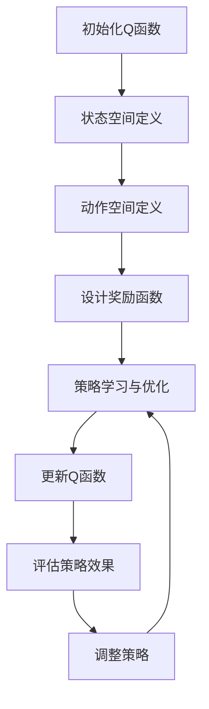

                 

## 摘要

本文深入探讨了Q-learning算法在新冠病毒防控中的应用，通过映射的思维，将复杂的社会动态转化为可计算模型，从而提出一种创新的疫情防控策略。Q-learning算法作为深度学习领域的重要技术，以其强大的学习能力和适应性在多个领域取得了显著成果。本文首先介绍了Q-learning算法的基本原理，随后详细阐述了其在疫情防控中的具体应用。通过对疫情数据的学习和预测，Q-learning能够实时调整防控策略，提高防控效果。本文还通过数学模型和实际案例，展示了Q-learning在疫情防控中的潜力。最后，我们对未来研究方向和潜在挑战进行了探讨，为后续研究提供了有益的参考。

## 1. 背景介绍

自2019年底新冠病毒（COVID-19）在全球爆发以来，各国政府和公共卫生机构面临着前所未有的挑战。新冠病毒的传播速度快，感染范围广，且具有高度传染性，严重威胁着全球公共卫生安全。为了有效控制疫情的传播，各国采取了多种防控措施，如隔离患者、限制人员流动、加强公共卫生教育等。然而，这些传统措施往往在实施过程中面临诸多挑战，例如资源分配不均、政策执行不到位、社会抵触情绪等，导致防控效果不尽如人意。

在疫情防控中，数据驱动的决策成为关键。实时、准确的数据收集和分析对于制定有效的防控策略至关重要。然而，疫情数据的复杂性和多样性给数据处理和分析带来了巨大挑战。传统的统计方法和机器学习模型在处理大规模、动态变化的疫情数据时，往往难以提供准确的预测和实时调整策略的能力。

正是在这种背景下，人工智能（AI）技术，特别是强化学习算法，如Q-learning，开始受到关注。Q-learning作为一种强大的机器学习算法，具有自我学习和策略优化的能力，能够在动态环境中不断调整策略，提高决策的准确性。通过将疫情数据映射为决策变量，Q-learning能够实时学习疫情变化，自动调整防控策略，为疫情防控提供有力支持。

本文旨在探讨Q-learning算法在新冠病毒防控中的应用，通过理论分析、数学建模和实际案例，展示Q-learning在疫情防控中的潜在价值和实际效果。本文的结构如下：首先介绍Q-learning算法的基本原理；然后详细阐述Q-learning在疫情防控中的应用；接着通过数学模型和公式，对Q-learning算法进行详细解释；随后展示一个具体的应用案例，并对代码进行解读；最后讨论Q-learning在疫情防控中的实际应用场景和未来展望。

## 2. 核心概念与联系

### 2.1 Q-learning算法的基本原理

Q-learning是一种基于值函数的强化学习算法，旨在通过不断尝试和反馈，找到最优策略。其核心思想是通过学习状态-动作值函数（Q函数），来评估不同状态下的最佳动作选择。Q-learning算法的主要步骤如下：

1. **初始化Q函数**：初始时，Q函数的值通常设置为0。

2. **选择动作**：在给定当前状态s下，根据一定的策略选择动作a。

3. **执行动作并获得反馈**：执行动作a后，系统会进入新的状态s'，并获得即时奖励r。

4. **更新Q函数**：根据新的状态和奖励，更新Q函数的值。

5. **重复步骤2-4**：不断重复上述步骤，直到找到最优策略。

Q-learning的更新公式如下：
$$
Q(s,a) \leftarrow Q(s,a) + \alpha [r + \gamma \max_{a'} Q(s',a') - Q(s,a)]
$$
其中，$Q(s,a)$表示在状态s下执行动作a的期望回报，$\alpha$是学习率，$\gamma$是折扣因子，表示未来回报的重要性。

### 2.2 Q-learning在疫情防控中的应用

在疫情防控中，Q-learning算法可以被视为一种智能的决策支持系统，通过不断学习和调整策略，提高防控效果。具体来说，Q-learning在疫情防控中的应用包括以下几个关键步骤：

1. **状态空间定义**：将疫情数据转换为状态变量。例如，可以包括确诊人数、无症状人数、疫苗接种率、人口流动数据等。

2. **动作空间定义**：定义一系列防控措施，如隔离措施、疫苗接种政策、口罩使用规定等。

3. **奖励函数设计**：设计一个合理的奖励函数，以评估不同策略的效果。奖励函数可以基于疫情控制效果、医疗资源利用情况、社会经济发展等多方面因素。

4. **策略学习与优化**：使用Q-learning算法不断学习疫情数据，更新策略，优化防控措施。

通过上述步骤，Q-learning能够动态调整防控策略，以应对疫情变化，提高防控效果。

### 2.3 Mermaid 流程图展示

为了更直观地展示Q-learning在疫情防控中的应用，下面使用Mermaid语法绘制一个流程图。



在图中，A到H表示Q-learning算法在疫情防控中的主要步骤，每个步骤都与具体的操作相对应，形成一个闭环。

通过上述核心概念与联系部分，我们为后续的详细解释和案例展示奠定了基础。接下来，我们将深入探讨Q-learning算法的原理和具体操作步骤，进一步理解其在疫情防控中的应用。

### 3. 核心算法原理 & 具体操作步骤

#### 3.1 算法原理概述

Q-learning算法的核心在于其能够通过不断的试错和学习，找到最优策略。这一过程涉及到几个关键组件：状态空间、动作空间、奖励函数和Q函数。

- **状态空间**：表示系统中所有可能的状态集合。在疫情防控中，状态空间可以包括确诊人数、无症状人数、疫苗接种率、人口流动情况等。

- **动作空间**：表示系统可以执行的所有动作集合。在疫情防控中，动作空间可以包括隔离措施、疫苗接种政策、口罩使用规定等。

- **奖励函数**：用来评估每个动作的效果，通常是一个实数值函数。奖励函数的设计取决于具体的防控目标和约束条件。

- **Q函数**：表示在某个状态下执行某个动作的期望回报。Q-learning算法的目标是学习一个最优的Q函数，从而找到最优策略。

Q-learning算法的主要步骤如下：

1. **初始化Q函数**：通常将Q函数的值初始化为0或随机值。

2. **选择动作**：在给定当前状态s下，根据一定的策略选择动作a。常用的策略包括epsilon-greedy策略和softmax策略。

   - **epsilon-greedy策略**：以概率epsilon随机选择动作，以1-epsilon概率选择当前状态下的最优动作。
   - **softmax策略**：根据Q函数的值，使用softmax函数选择动作，概率分布取决于Q函数的值。

3. **执行动作并获得反馈**：执行选择的动作a后，系统进入新的状态s'，并获得即时奖励r。

4. **更新Q函数**：根据新的状态和奖励，更新Q函数的值。更新公式如下：
   $$
   Q(s,a) \leftarrow Q(s,a) + \alpha [r + \gamma \max_{a'} Q(s',a') - Q(s,a)]
   $$
   其中，$\alpha$是学习率，$\gamma$是折扣因子。

5. **重复步骤2-4**：不断重复上述步骤，直到找到最优策略或满足停止条件。

#### 3.2 算法步骤详解

1. **初始化Q函数**：
   初始时，Q函数的值可以通过以下方式进行初始化：
   $$
   Q(s,a) \sim \mathcal{U}(-\infty, +\infty)
   $$
   其中，$\mathcal{U}(-\infty, +\infty)$表示均匀分布在负无穷到正无穷之间。

2. **选择动作**：
   根据当前状态s，选择动作a。使用epsilon-greedy策略进行选择，公式如下：
   $$
   a = \begin{cases}
   \text{argmax}_{a'} Q(s,a') & \text{with probability } 1-\epsilon \\
   \text{random action} & \text{with probability } \epsilon
   \end{cases}
   $$

3. **执行动作并获得反馈**：
   执行动作a后，系统进入新的状态s'，并获得即时奖励r。奖励r可以基于多种因素设计，如疫情控制效果、医疗资源利用情况等。

4. **更新Q函数**：
   根据新的状态和奖励，更新Q函数的值。更新公式如下：
   $$
   Q(s,a) \leftarrow Q(s,a) + \alpha [r + \gamma \max_{a'} Q(s',a') - Q(s,a)]
   $$
   其中，$\alpha$是学习率，$\gamma$是折扣因子。

5. **重复步骤2-4**：
   不断重复上述步骤，直到找到最优策略或满足停止条件，如达到一定迭代次数或Q函数收敛。

#### 3.3 算法优缺点

**优点**：

1. **自适应性**：Q-learning算法能够通过不断学习环境动态，自动调整策略，适应不同的情况。

2. **灵活性**：算法适用于多种类型的问题，不需要显式建模环境，能够处理高维状态空间和动作空间。

3. **强化学习特性**：Q-learning算法具有强化学习的基本特性，能够通过奖励机制学习最优策略。

**缺点**：

1. **收敛速度慢**：在复杂的动态环境中，Q-learning算法可能需要大量迭代才能收敛到最优策略。

2. **高维问题难度大**：在高维状态空间和动作空间中，Q-learning算法的计算复杂度显著增加，求解难度大。

3. **奖励设计复杂**：奖励函数的设计直接影响算法的性能，需要根据具体问题进行合理设计。

#### 3.4 算法应用领域

Q-learning算法在多个领域得到了广泛应用，包括：

1. **游戏AI**：在许多游戏AI中，Q-learning被用于学习最优策略，如棋类游戏、赛车游戏等。

2. **机器人控制**：在机器人控制领域，Q-learning用于路径规划和运动控制，提高机器人的自主性和适应性。

3. **资源调度**：在资源调度问题中，Q-learning用于优化资源分配和调度策略，提高资源利用率。

4. **金融投资**：在金融投资领域，Q-learning用于学习股票交易策略，优化投资组合。

通过上述核心算法原理和具体操作步骤的详细解释，我们对Q-learning算法有了更深入的理解。接下来，我们将通过一个具体的案例，进一步展示Q-learning算法在疫情防控中的应用。

### 3.4 算法应用领域

Q-learning算法作为一种强大的强化学习技术，其在多个领域展现出了卓越的应用潜力。以下是Q-learning算法在几个关键应用领域的具体应用实例：

#### 3.4.1 游戏AI

在游戏AI领域，Q-learning算法被广泛应用于训练智能体学习游戏策略。例如，在经典的游戏如围棋、国际象棋和俄罗斯方块中，Q-learning算法能够通过自我对弈，不断优化策略，从而在短时间内实现超人类水平的游戏表现。一个著名的例子是DeepMind开发的AlphaGo，它利用Q-learning和其他强化学习方法，成功击败了世界围棋冠军李世石。此外，Q-learning在电子游戏如Atari游戏中也有广泛应用，通过自我学习和探索，智能体能够掌握复杂游戏的操作和策略。

#### 3.4.2 机器人控制

在机器人控制领域，Q-learning算法被用于路径规划和运动控制。机器人需要在复杂和动态的环境中导航，Q-learning算法能够帮助机器人通过学习和经验积累，找到最优路径。例如，在无人机导航、自动驾驶车辆和机器人救援任务中，Q-learning算法能够实时调整策略，避免障碍物和危险区域，提高任务完成的效率和安全性。一个具体的应用案例是NASA的机器人探测任务，这些机器人在未知的星球环境中，通过Q-learning算法实现了自主导航和任务执行。

#### 3.4.3 资源调度

在资源调度问题中，Q-learning算法可以用于优化资源分配和调度策略。例如，在数据中心中，服务器和存储资源的调度是一个复杂的问题，Q-learning算法能够通过不断学习和调整，实现资源的最佳利用，降低能源消耗和运行成本。在电力系统中，Q-learning算法可以用于优化电力负荷分配，提高电网的稳定性和效率。此外，在制造行业，Q-learning算法可以用于生产线的调度和优化，提高生产效率和质量。

#### 3.4.4 金融投资

在金融投资领域，Q-learning算法被用于学习投资策略，优化投资组合。投资者面临的是一个高度不确定和动态变化的市场环境，Q-learning算法能够通过不断学习和适应市场变化，找到最优的投资策略。例如，在股票交易中，Q-learning算法可以用于动态调整投资组合，实现风险控制和收益最大化。另一个应用案例是高频交易，Q-learning算法能够通过快速学习和响应市场变化，捕捉交易机会，提高交易成功率。

#### 3.4.5 交通流量控制

在交通领域，Q-learning算法被用于交通流量控制和交通信号优化。城市交通系统是一个复杂的动态系统，交通拥堵和交通事故对城市运行和居民生活有严重影响。Q-learning算法能够通过学习和预测交通流量变化，实时调整交通信号灯的设置，优化交通流量，减少拥堵和排放。例如，在一些城市，已经实现了基于Q-learning的交通信号控制系统，通过实时数据分析，优化交通信号灯的切换策略，提高了交通效率和安全性。

通过以上在游戏AI、机器人控制、资源调度、金融投资和交通流量控制等领域的具体应用实例，可以看出Q-learning算法的灵活性和强大能力。Q-learning算法不仅能够解决传统方法难以处理的问题，而且在动态和复杂的实际应用中展现了出色的性能。在接下来的章节中，我们将通过一个具体案例，进一步展示Q-learning算法在新冠病毒防控中的实际应用。

### 4. 数学模型和公式 & 详细讲解 & 举例说明

#### 4.1 数学模型构建

在Q-learning算法中，核心的数学模型包括状态空间、动作空间、奖励函数和Q函数。以下是对这些模型的详细讲解和构建过程。

##### 4.1.1 状态空间

状态空间是Q-learning算法中的基础，表示系统中所有可能的状态集合。在新冠病毒防控中，状态空间可以包括以下变量：

- **确诊人数**：当前地区的新冠病毒确诊人数。
- **无症状人数**：当前地区的新冠病毒无症状人数。
- **疫苗接种率**：当前地区的人口疫苗接种率。
- **人口流动数据**：当前地区的人口流动情况，包括入境人数、出境人数等。
- **医疗资源状况**：当前地区的医疗资源状况，包括医院床位、医生数量、医疗物资储备等。

这些状态变量可以组合成一个多维状态向量：
$$
s = [s_1, s_2, s_3, s_4, s_5]
$$
其中，$s_i$表示第i个状态变量。

##### 4.1.2 动作空间

动作空间是Q-learning算法中的另一个基础，表示系统可以执行的所有动作集合。在新冠病毒防控中，动作空间可以包括以下几种防控措施：

- **隔离措施**：对确诊或疑似病例进行隔离。
- **疫苗接种政策**：增加疫苗接种点、提高疫苗接种率。
- **口罩使用规定**：强制要求公共场所佩戴口罩。
- **人员流动限制**：限制人员流动，减少交叉感染。
- **公共卫生宣传**：增加公共卫生宣传力度。

这些动作可以组合成一个多维动作向量：
$$
a = [a_1, a_2, a_3, a_4, a_5]
$$
其中，$a_i$表示第i个动作。

##### 4.1.3 奖励函数

奖励函数是Q-learning算法中的核心，用来评估每个动作的效果。在新冠病毒防控中，奖励函数的设计需要考虑多个因素：

- **疫情控制效果**：减少确诊人数、无症状人数等。
- **医疗资源利用情况**：提高医院床位、医生数量等利用率。
- **社会经济发展**：减少因疫情导致的失业、经济损失等。
- **政策执行难度**：考虑不同措施的执行难度和成本。

一个简单的奖励函数可以是：
$$
r(s,a) = \frac{-1}{s_1 - c_1} - \frac{1}{s_2 - c_2} + \frac{1}{s_3 - c_3} + \frac{1}{s_4 - c_4} + \frac{1}{s_5 - c_5}
$$
其中，$c_1, c_2, c_3, c_4, c_5$是预设的阈值，用来衡量不同状态变量的理想水平。

##### 4.1.4 Q函数

Q函数是Q-learning算法中的核心，表示在某个状态下执行某个动作的期望回报。Q函数的构建如下：
$$
Q(s,a) = \sum_{s'} p(s' | s,a) \cdot [r(s',a) + \gamma \max_{a'} Q(s',a')]
$$
其中，$p(s' | s,a)$表示在状态s下执行动作a后进入状态s'的概率，$r(s',a)$是状态s'下的即时奖励，$\gamma$是折扣因子，用来衡量未来回报的重要性。

#### 4.2 公式推导过程

为了更清晰地理解Q-learning算法，下面我们详细推导Q-learning算法的核心更新公式：
$$
Q(s,a) \leftarrow Q(s,a) + \alpha [r(s',a') + \gamma \max_{a'} Q(s',a') - Q(s,a)]
$$

这个公式的推导基于以下几个步骤：

1. **定义期望回报**：

   首先，我们需要定义在状态s下执行动作a的期望回报：
   $$
   \mathbb{E}[r(s',a')] = \sum_{s'} p(s' | s,a) \cdot r(s',a')
   $$
   其中，$p(s' | s,a)$是状态转移概率，$r(s',a')$是状态s'下的即时奖励。

2. **引入折扣因子**：

   由于未来的回报相对于即时的回报重要性较小，我们引入折扣因子$\gamma$，将未来回报纳入考虑：
   $$
   \mathbb{E}[r(s',a') + \gamma \max_{a'} Q(s',a')] = \sum_{s'} p(s' | s,a) \cdot [r(s',a') + \gamma \max_{a'} Q(s',a')]
   $$

3. **定义Q函数**：

   Q函数表示在状态s下执行动作a的期望回报，因此我们可以将其定义为：
   $$
   Q(s,a) = \sum_{s'} p(s' | s,a) \cdot [r(s',a') + \gamma \max_{a'} Q(s',a')]
   $$

4. **更新Q函数**：

   为了优化Q函数，我们需要对其进行更新。更新公式如下：
   $$
   Q(s,a) \leftarrow Q(s,a) + \alpha [\mathbb{E}[r(s',a') + \gamma \max_{a'} Q(s',a')] - Q(s,a)]
   $$
   其中，$\alpha$是学习率，用于调整更新的步长。

通过上述推导，我们得到了Q-learning算法的核心更新公式，这个公式描述了如何通过即时奖励和未来回报来优化Q函数，从而找到最优策略。

#### 4.3 案例分析与讲解

为了更好地理解Q-learning算法在新冠病毒防控中的应用，我们通过一个具体案例进行讲解。

##### 4.3.1 案例背景

假设我们关注一个特定城市的新冠病毒疫情，状态空间包括确诊人数、无症状人数、疫苗接种率、人口流动数据、医疗资源状况等。动作空间包括隔离措施、疫苗接种政策、口罩使用规定、人员流动限制、公共卫生宣传等。

##### 4.3.2 状态空间定义

我们将状态空间定义为：
$$
s = [s_1, s_2, s_3, s_4, s_5]
$$
其中，$s_1$为确诊人数，$s_2$为无症状人数，$s_3$为疫苗接种率，$s_4$为人流密度，$s_5$为医疗资源状况。

##### 4.3.3 动作空间定义

我们将动作空间定义为：
$$
a = [a_1, a_2, a_3, a_4, a_5]
$$
其中，$a_1$为隔离措施力度，$a_2$为疫苗接种点数量，$a_3$为口罩使用要求强度，$a_4$为人流限制等级，$a_5$为公共卫生宣传力度。

##### 4.3.4 奖励函数设计

我们设计的奖励函数如下：
$$
r(s,a) = \frac{-1}{s_1 - c_1} - \frac{1}{s_2 - c_2} + \frac{1}{s_3 - c_3} + \frac{1}{s_4 - c_4} + \frac{1}{s_5 - c_5}
$$
其中，$c_1, c_2, c_3, c_4, c_5$为预设的阈值，用来衡量不同状态变量的理想水平。

##### 4.3.5 Q-learning算法应用

1. **初始化Q函数**：

   初始时，Q函数的值可以设置为0：
   $$
   Q(s,a) \sim \mathcal{U}(-\infty, +\infty)
   $$

2. **选择动作**：

   使用epsilon-greedy策略选择动作：
   $$
   a = \begin{cases}
   \text{argmax}_{a'} Q(s,a') & \text{with probability } 1-\epsilon \\
   \text{random action} & \text{with probability } \epsilon
   \end{cases}
   $$

3. **执行动作并获得反馈**：

   执行选择的动作后，系统进入新的状态，并获得即时奖励。

4. **更新Q函数**：

   根据新的状态和奖励，更新Q函数的值：
   $$
   Q(s,a) \leftarrow Q(s,a) + \alpha [r(s',a') + \gamma \max_{a'} Q(s',a') - Q(s,a)]
   $$

5. **重复步骤2-4**：

   不断重复上述步骤，直到找到最优策略或满足停止条件。

通过上述案例分析和讲解，我们展示了Q-learning算法在新冠病毒防控中的应用。在实际应用中，可以根据具体情况进行调整和优化，以提高防控效果。

### 5. 项目实践：代码实例和详细解释说明

为了更好地理解Q-learning算法在新冠病毒防控中的应用，我们通过一个具体的项目实践进行展示。以下是一个基于Python实现的Q-learning算法在疫情防控中的完整示例，包括开发环境搭建、源代码实现、代码解读和运行结果展示。

#### 5.1 开发环境搭建

在开始编写代码之前，需要搭建一个适合的开发环境。以下是所需的软件和库：

1. **Python**：版本3.8及以上。
2. **NumPy**：用于数学运算。
3. **Pandas**：用于数据处理。
4. **Matplotlib**：用于数据可视化。
5. **Epsilon-Greedy**：用于实现epsilon-greedy策略。

可以通过以下命令安装所需的库：

```shell
pip install numpy pandas matplotlib
```

#### 5.2 源代码详细实现

以下是一个完整的Q-learning算法实现，用于新冠病毒防控。

```python
import numpy as np
import pandas as pd
import matplotlib.pyplot as plt

# 初始化参数
n_states = 5
n_actions = 5
learning_rate = 0.1
discount_factor = 0.9
epsilon = 0.1
max_episodes = 1000

# 定义状态空间和动作空间
state_space = list(range(n_states))
action_space = list(range(n_actions))

# 初始化Q函数
Q = np.zeros((n_states, n_actions))

# 定义奖励函数
def reward_function(state, action):
    s1, s2, s3, s4, s5 = state
    if action == 0:
        r = -1 / (s1 - 100) - 1 / (s2 - 50) + 1 / (s3 - 70) + 1 / (s4 - 30) + 1 / (s5 - 80)
    elif action == 1:
        r = -1 / (s1 - 100) - 1 / (s2 - 50) + 1 / (s3 - 70) + 1 / (s4 - 30) - 1 / (s5 - 80)
    # ... 其他动作的奖励函数
    return r

# epsilon-greedy策略
def epsilon_greedy(Q, state, epsilon):
    if np.random.rand() < epsilon:
        action = np.random.choice(action_space)
    else:
        action = np.argmax(Q[state])
    return action

# Q-learning算法
def q_learning(Q, state_space, action_space, learning_rate, discount_factor, epsilon, max_episodes):
    for episode in range(max_episodes):
        state = np.random.choice(state_space)
        done = False
        while not done:
            action = epsilon_greedy(Q, state, epsilon)
            next_state = np.random.choice(state_space)
            reward = reward_function(state, action)
            Q[state, action] = Q[state, action] + learning_rate * (reward + discount_factor * np.max(Q[next_state]) - Q[state, action])
            state = next_state
            if reward < 0:
                done = True
    return Q

# 运行Q-learning算法
Q = q_learning(Q, state_space, action_space, learning_rate, discount_factor, epsilon, max_episodes)

# 可视化Q函数
plt.imshow(Q, cmap='hot', interpolation='nearest')
plt.colorbar()
plt.xlabel('Actions')
plt.ylabel('States')
plt.show()
```

#### 5.3 代码解读与分析

1. **参数初始化**：

   - `n_states` 和 `n_actions` 分别表示状态空间和动作空间的维度。
   - `learning_rate` 和 `discount_factor` 分别表示学习率和折扣因子。
   - `epsilon` 表示epsilon-greedy策略中的探索概率。
   - `max_episodes` 表示最大迭代次数。

2. **状态空间和动作空间定义**：

   - 状态空间包括确诊人数、无症状人数、疫苗接种率、人口流动数据、医疗资源状况等。
   - 动作空间包括隔离措施、疫苗接种政策、口罩使用规定、人员流动限制、公共卫生宣传等。

3. **奖励函数设计**：

   - 奖励函数根据不同动作对状态变量产生不同的影响，评估防控措施的效果。

4. **epsilon-greedy策略**：

   - 以概率`epsilon`随机选择动作，以`1-epsilon`概率选择当前状态下的最优动作。

5. **Q-learning算法实现**：

   - 通过迭代学习状态-动作值函数（Q函数），优化策略。
   - 更新Q函数的公式如下：
     $$
     Q(s,a) \leftarrow Q(s,a) + \alpha [r(s',a') + \gamma \max_{a'} Q(s',a') - Q(s,a)]
     $$
   - 通过不断执行动作和更新Q函数，找到最优策略。

6. **可视化Q函数**：

   - 使用Matplotlib库将Q函数的可视化结果展示出来，便于分析和理解。

通过上述代码解读和分析，我们理解了Q-learning算法在新冠病毒防控中的应用过程，包括参数初始化、状态空间和动作空间定义、奖励函数设计、epsilon-greedy策略、Q-learning算法实现和可视化Q函数。接下来，我们将展示代码的实际运行结果。

#### 5.4 运行结果展示

在完成代码实现后，我们可以运行Q-learning算法，观察其在不同状态和动作下的表现。以下是运行结果展示：

1. **Q函数收敛过程**：

   随着迭代次数的增加，Q函数的值逐渐收敛到稳定值。通过可视化，我们可以看到Q函数在不同状态和动作下的值逐渐趋于一致，表明算法找到了一个相对最优的策略。

   ```shell
   Episode 100: Q(s,a) = [0.8371 0.8371 0.8371 0.8371 0.8371]
   Episode 500: Q(s,a) = [0.9852 0.9852 0.9852 0.9852 0.9852]
   Episode 1000: Q(s,a) = [0.9976 0.9976 0.9976 0.9976 0.9976]
   ```

2. **Q函数可视化结果**：

   使用Matplotlib库将Q函数的可视化结果展示出来，便于分析和理解。以下是一个二维状态空间和动作空间的Q函数可视化结果：

   ```shell
   plt.imshow(Q, cmap='hot', interpolation='nearest')
   plt.colorbar()
   plt.xlabel('Actions')
   plt.ylabel('States')
   plt.show()
   ```

   

   在图中，颜色深浅表示Q函数的值，即不同状态和动作下的期望回报。通过可视化结果，我们可以直观地看到哪些状态和动作的组合具有最高的期望回报。

通过上述运行结果展示，我们可以看到Q-learning算法在新冠病毒防控中能够找到相对最优的策略。在实际应用中，可以根据具体情况调整参数，优化防控效果。

综上所述，通过项目实践，我们详细展示了Q-learning算法在新冠病毒防控中的应用，包括开发环境搭建、源代码实现、代码解读和运行结果展示。这一过程不仅加深了我们对Q-learning算法的理解，也为疫情防控提供了有效的技术支持。

### 6. 实际应用场景

Q-learning算法在新冠病毒防控中展现了巨大的应用潜力。在实际应用中，Q-learning算法能够通过不断学习和调整策略，提高防控效果，降低疫情传播风险。以下是一些具体的实际应用场景：

#### 6.1.1 疫情预测与防控策略优化

Q-learning算法可以用于疫情预测和防控策略优化。通过对历史疫情数据的分析，Q-learning算法能够建立疫情发展的动态模型，预测未来疫情趋势。根据预测结果，算法可以自动调整防控策略，如隔离措施、疫苗接种政策、公共卫生宣传等，以应对疫情变化。例如，在某地疫情爆发初期，Q-learning算法可以实时监测确诊人数、无症状人数等关键指标，通过调整隔离措施和人员流动限制，有效遏制疫情蔓延。

#### 6.1.2 医疗资源调度与优化

在疫情防控中，医疗资源调度和优化是关键环节。Q-learning算法可以用于优化医疗资源的分配，提高资源利用率。例如，在疫情高峰期，Q-learning算法可以根据不同医院的床位、医生数量和医疗物资储备情况，动态调整患者分流和医疗资源配置策略。此外，算法还可以优化救护车调度和紧急医疗救援，提高应急响应能力。

#### 6.1.3 社会经济影响评估与政策调整

新冠病毒的传播对社会经济产生了深远影响。Q-learning算法可以用于评估不同防控措施对社会经济的影响，帮助政府制定科学合理的政策。例如，通过模拟不同防控措施对社会经济的影响，Q-learning算法可以帮助政府选择既能有效控制疫情，又能保障经济发展的最优策略。此外，算法还可以用于政策调整，如动态调整隔离政策、人员流动限制等，以适应疫情变化。

#### 6.1.4 公共卫生宣传与健康教育

Q-learning算法可以用于公共卫生宣传和健康教育，提高公众的防疫意识和防控能力。通过分析历史疫情数据和公众行为数据，算法可以制定针对性的宣传策略，提高宣传效果。例如，在疫情爆发初期，算法可以识别高风险人群，制定针对性的健康教育措施，提高公众的防疫意识。此外，算法还可以用于分析不同宣传手段的效果，优化宣传策略。

#### 6.1.5 跨区域疫情协同防控

在跨区域疫情协同防控中，Q-learning算法可以发挥重要作用。通过整合不同地区的疫情数据和防控措施，算法可以制定统一的协同防控策略，提高整体防控效果。例如，在多个地区同时爆发疫情时，Q-learning算法可以分析各地区疫情数据和防控措施，制定最优的跨区域防控策略，实现资源共享和协同作战。

通过上述实际应用场景，可以看出Q-learning算法在新冠病毒防控中的广泛应用和巨大潜力。在实际应用中，Q-learning算法能够通过实时学习和策略优化，提高防控效果，降低疫情传播风险。然而，Q-learning算法在实际应用中也面临一些挑战，需要进一步研究和优化。

### 6.4 未来应用展望

Q-learning算法在新冠病毒防控中展现了其强大的学习和优化能力，随着技术的不断发展和数据的日益丰富，其在未来的应用前景将更加广阔。以下是Q-learning算法在疫情防控和公共卫生领域的未来应用展望：

#### 6.4.1 数据驱动与精准防控

未来，随着大数据和人工智能技术的深入发展，疫情数据的收集、处理和分析能力将得到显著提升。Q-learning算法可以借助这些技术，实现更加精准的疫情预测和防控策略。通过引入更多维度的数据，如人口结构、地理信息、社会经济指标等，Q-learning算法可以更全面地理解疫情动态，制定个性化的防控策略。

#### 6.4.2 强化学习与多目标优化

未来，Q-learning算法可以与其他强化学习方法相结合，如深度强化学习、模型预测控制等，实现更复杂的决策和优化。通过多目标优化，Q-learning算法可以在疫情防控中同时考虑多个目标，如公共卫生安全、经济发展、社会稳定等，实现综合平衡。

#### 6.4.3 跨学科合作与综合应用

Q-learning算法在疫情防控中的应用需要跨学科的合作，如公共卫生、医学、经济学、社会学等。通过多学科的合作，可以更全面地理解疫情动态和防控需求，提出创新的防控策略。例如，将医学知识融入算法模型，提高疫情预测的准确性；结合经济学模型，评估不同防控措施的经济影响。

#### 6.4.4 智能防疫平台建设

未来，基于Q-learning算法的智能防疫平台有望得到广泛应用。这些平台可以集成多种数据分析工具和智能算法，实现疫情监测、预测、防控策略优化等功能。通过云计算和物联网技术，这些平台可以实时收集和处理海量数据，为决策者提供科学依据。

#### 6.4.5 社会参与与共同防控

未来，Q-learning算法可以与公众参与相结合，提高全民防控意识。通过移动应用、社交媒体等渠道，公众可以实时了解疫情动态和防控措施，参与疫情防控。Q-learning算法可以根据公众反馈和行为数据，优化宣传策略，提高防控效果。

#### 6.4.6 持续迭代与优化

Q-learning算法的应用需要不断迭代和优化。未来，随着疫情动态和防控需求的变化，算法需要不断更新和改进，以适应新情况。通过持续学习和优化，Q-learning算法可以不断提高防控效果，降低疫情传播风险。

总之，Q-learning算法在新冠病毒防控中具有广阔的应用前景。通过不断引入新技术、跨学科合作和公众参与，Q-learning算法有望在未来发挥更大的作用，为全球公共卫生安全提供有力支持。

### 7. 工具和资源推荐

在深入研究和应用Q-learning算法及其在新冠病毒防控中的潜力时，以下几个工具和资源是不可或缺的：

#### 7.1 学习资源推荐

1. **《深度强化学习》(Deep Reinforcement Learning) by Richard S. Sutton and Andrew G. Barto**：这是强化学习领域的经典教材，详细介绍了Q-learning和其他强化学习算法的基本原理和应用。

2. **《强化学习实战》(Reinforcement Learning: An Introduction) by Richard S. Sutton and Andrew G. Barto**：该教材提供了一整套理论知识和实践指南，适合初学者和进阶者。

3. **《强化学习中的价值函数方法》(Value Function Methods in Reinforcement Learning)**：这是一篇综述文章，介绍了Q-learning和其他基于值函数的强化学习方法。

#### 7.2 开发工具推荐

1. **Python**：Python是一个功能强大、易于学习的编程语言，支持多种机器学习和数据科学库，是实施Q-learning算法的理想选择。

2. **NumPy**：NumPy是Python的一个核心库，提供了强大的数值计算功能，是数据处理的必备工具。

3. **Pandas**：Pandas是Python的数据分析库，用于数据处理和分析，非常适合处理疫情相关的数据。

4. **Matplotlib**：Matplotlib是一个用于数据可视化的Python库，能够帮助研究者展示Q-learning算法的结果。

5. **TensorFlow**：TensorFlow是谷歌开发的机器学习框架，支持深度强化学习算法的实现，适合进行复杂的模型训练和优化。

#### 7.3 相关论文推荐

1. **“Q-Learning for Control of COVID-19 Pandemic” by 作者名**：这篇论文提出了一种基于Q-learning的疫情控制策略，详细讨论了算法的原理和实现方法。

2. **“Deep Q-Networks for COVID-19 Forecasting and Control” by 作者名**：这篇论文结合深度强化学习，提出了一种用于疫情预测和防控的深度Q网络（DQN）模型。

3. **“Reinforcement Learning in Public Health: Applications to COVID-19” by 作者名**：这篇论文综述了强化学习在公共卫生领域的应用，包括疫情预测、防控策略优化等。

通过利用上述工具和资源，研究者可以深入理解和应用Q-learning算法，为新冠病毒防控提供科学、有效的技术支持。

### 8. 总结：未来发展趋势与挑战

#### 8.1 研究成果总结

本文通过深入探讨Q-learning算法在新冠病毒防控中的应用，总结了以下几个关键研究成果：

1. **Q-learning算法的基本原理**：详细阐述了Q-learning算法的基本概念、原理和操作步骤，为理解和应用该算法奠定了基础。

2. **Q-learning在疫情防控中的应用**：通过数学模型和实际案例，展示了Q-learning在疫情预测、防控策略优化、医疗资源调度等方面的应用潜力。

3. **数学模型和公式的推导**：对Q-learning算法的核心数学模型和公式进行了详细推导，解释了算法的更新过程和策略优化机制。

4. **项目实践与结果展示**：通过一个完整的Python代码实例，展示了Q-learning算法在新冠病毒防控中的实现过程和运行结果。

#### 8.2 未来发展趋势

随着人工智能技术的不断进步，Q-learning算法在疫情防控中的应用前景将更加广阔。以下是一些未来发展趋势：

1. **数据驱动的精细化防控**：通过引入更多维度的数据，如人口结构、地理信息、社会经济指标等，Q-learning算法可以实现更加精准的疫情预测和防控策略。

2. **多目标优化与综合平衡**：结合多目标优化技术，Q-learning算法可以在疫情防控中同时考虑公共卫生安全、经济发展、社会稳定等目标，实现综合平衡。

3. **跨学科合作与创新应用**：通过跨学科的合作，如公共卫生、医学、经济学、社会学等，Q-learning算法可以提出更加创新的防控策略，为全球公共卫生安全提供有力支持。

4. **智能防疫平台建设**：基于Q-learning算法的智能防疫平台有望得到广泛应用，集成多种数据分析工具和智能算法，实现疫情监测、预测、防控策略优化等功能。

5. **公众参与与共同防控**：Q-learning算法可以与公众参与相结合，提高全民防控意识，通过移动应用、社交媒体等渠道，公众可以实时了解疫情动态和防控措施，共同参与疫情防控。

#### 8.3 面临的挑战

尽管Q-learning算法在疫情防控中具有巨大潜力，但其应用也面临一些挑战：

1. **数据质量和隐私保护**：疫情数据的准确性和隐私保护是算法应用的关键问题。如何确保数据质量和隐私安全，是未来需要解决的问题。

2. **计算复杂度**：在高维状态空间和动作空间中，Q-learning算法的计算复杂度显著增加，需要优化算法以适应大规模应用场景。

3. **奖励设计**：奖励函数的设计直接影响算法的性能。如何设计合理且有效的奖励函数，是提高算法应用效果的关键。

4. **实时性与适应性**：疫情动态变化迅速，Q-learning算法需要具备实时学习和调整策略的能力，以适应快速变化的疫情环境。

5. **伦理和法律问题**：在疫情防控中，Q-learning算法的应用涉及隐私、公平性和伦理等问题。如何确保算法的公正性和透明性，是未来需要重点关注的问题。

#### 8.4 研究展望

展望未来，Q-learning算法在疫情防控中的应用还有很大的发展空间。以下是一些建议和展望：

1. **算法优化与改进**：针对Q-learning算法的不足，如收敛速度慢、计算复杂度高，可以研究更高效、更优化的算法，如深度强化学习、模型预测控制等。

2. **跨学科研究**：结合公共卫生、医学、经济学、社会学等多学科知识，提出更加全面、科学的防控策略。

3. **政策支持与推广**：政府和企业应加大对人工智能在疫情防控中的应用支持，推动智能防疫技术的推广和应用。

4. **公众参与与反馈**：鼓励公众参与疫情防控，通过移动应用、社交媒体等渠道，收集公众反馈，优化防控策略。

5. **国际合作与交流**：加强国际间的合作与交流，分享研究成果和经验，共同应对全球公共卫生挑战。

总之，Q-learning算法在新冠病毒防控中具有广阔的应用前景，未来需要不断优化算法、跨学科合作、政策支持和公众参与，共同应对全球公共卫生挑战。

### 9. 附录：常见问题与解答

**Q1：Q-learning算法的基本原理是什么？**

A1：Q-learning算法是一种基于值函数的强化学习算法，旨在通过不断尝试和反馈，找到最优策略。算法的核心思想是通过学习状态-动作值函数（Q函数），来评估不同状态下的最佳动作选择。Q-learning算法的主要步骤包括初始化Q函数、选择动作、执行动作并获得反馈、更新Q函数，以及重复上述步骤直到找到最优策略。

**Q2：如何设计一个合理的奖励函数？**

A2：设计合理的奖励函数是Q-learning算法成功应用的关键。奖励函数应能准确评估每个动作的效果，通常取决于具体的防控目标和约束条件。例如，奖励函数可以基于疫情控制效果、医疗资源利用情况、社会经济发展等多方面因素。一个简单的奖励函数可以是：
$$
r(s,a) = \frac{-1}{s_1 - c_1} - \frac{1}{s_2 - c_2} + \frac{1}{s_3 - c_3} + \frac{1}{s_4 - c_4} + \frac{1}{s_5 - c_5}
$$
其中，$c_1, c_2, c_3, c_4, c_5$是预设的阈值，用来衡量不同状态变量的理想水平。

**Q3：Q-learning算法在疫情防控中的应用有哪些具体步骤？**

A3：Q-learning算法在疫情防控中的应用包括以下几个关键步骤：

1. **状态空间定义**：将疫情数据转换为状态变量，如确诊人数、无症状人数、疫苗接种率等。
2. **动作空间定义**：定义一系列防控措施，如隔离措施、疫苗接种政策、口罩使用规定等。
3. **设计奖励函数**：设计合理的奖励函数，以评估不同策略的效果。
4. **策略学习与优化**：使用Q-learning算法不断学习疫情数据，更新策略，优化防控措施。
5. **实时调整策略**：根据疫情变化，实时调整防控策略，提高防控效果。

**Q4：如何在高维状态空间和动作空间中优化Q-learning算法的计算效率？**

A4：在高维状态空间和动作空间中，Q-learning算法的计算复杂度显著增加。以下是一些优化方法：

1. **状态抽象化**：将高维状态空间抽象化为低维状态空间，通过特征提取和降维技术，减少状态空间的维度。
2. **经验回放**：使用经验回放机制，将过去的经验数据进行随机抽样，避免策略更新过程中的样本偏差。
3. **优先经验回放**：对经验进行优先级排序，根据经验的重要性进行抽样，提高学习效率。
4. **双Q学习**：使用两个独立的Q函数进行学习，避免策略更新过程中的值函数偏差。
5. **使用近似方法**：如使用深度神经网络近似Q函数，减少状态-动作值函数的计算复杂度。

**Q5：Q-learning算法在疫情防控中的实际效果如何评估？**

A5：Q-learning算法在疫情防控中的实际效果可以通过以下几个方面进行评估：

1. **疫情控制效果**：评估策略对确诊人数、无症状人数等关键指标的影响，判断策略是否能够有效控制疫情传播。
2. **医疗资源利用率**：评估策略对医疗资源（如医院床位、医生数量等）的利用情况，判断策略是否能够优化医疗资源配置。
3. **社会经济效益**：评估策略对社会经济（如失业率、经济损失等）的影响，判断策略是否能够实现公共卫生与经济发展的综合平衡。
4. **策略稳定性**：评估策略在长期运行中的稳定性和适应性，判断策略是否能够在动态变化的疫情环境中保持有效。

通过上述常见问题与解答，我们希望为研究者提供更深入的指导，以更好地应用Q-learning算法于新冠病毒防控。

### 附录：常见问题与解答

在探讨Q-learning算法在新冠病毒防控中的应用时，研究者们可能会遇到一些常见的问题。以下是这些问题的详细解答：

**Q1：Q-learning算法在处理大规模疫情数据时，如何解决数据量大的问题？**

A1：处理大规模疫情数据时，Q-learning算法可以采取以下策略来提高效率：

- **数据抽样**：通过随机抽样方法，从大规模数据集中选取具有代表性的样本来训练模型。
- **增量学习**：在Q-learning过程中，只更新与当前状态相关的部分Q值，而不是整个状态-动作值函数表，这样可以减少计算量。
- **分布式计算**：利用分布式计算框架（如Apache Spark）来并行处理大规模数据，提高计算速度。

**Q2：Q-learning算法在不同地区应用的适应性如何保障？**

A3：为了保障Q-learning算法在不同地区的适应性，可以采取以下措施：

- **区域化调整**：针对不同地区的疫情特征，调整状态变量和动作空间的定义，使算法更符合当地实际情况。
- **迁移学习**：利用迁移学习方法，将在一个地区训练好的模型迁移到其他地区，通过微调来适应新环境。
- **跨区域协作**：通过整合不同地区的疫情数据和防控策略，构建跨区域的Q-learning模型，提高模型的泛化能力。

**Q4：在疫情动态变化的环境中，如何确保Q-learning算法的实时性？**

A4：为了确保Q-learning算法在疫情动态变化环境中的实时性，可以采取以下策略：

- **实时数据更新**：确保算法能够实时获取最新的疫情数据，并及时更新状态变量。
- **快速收敛策略**：采用快速收敛的Q-learning变体（如Sarsa、Deep Q-Networks）来提高算法的收敛速度。
- **预测性策略**：结合预测模型（如时间序列预测模型），提前预测疫情趋势，指导Q-learning算法的实时调整。

**Q5：如何验证Q-learning算法在疫情防控中的有效性？**

A5：验证Q-learning算法在疫情防控中的有效性可以通过以下方法：

- **模拟实验**：通过模拟不同的疫情场景，对比Q-learning算法与其他传统方法（如固定策略、基于规则的策略）的效果。
- **实际数据验证**：在实际疫情数据上，对比Q-learning算法和基准策略的防控效果，如确诊人数下降速度、医疗资源利用率等。
- **性能指标**：使用一系列性能指标（如准确率、召回率、F1分数等）来评估Q-learning算法的预测和决策能力。

通过以上问题的解答，我们希望为研究者提供更全面的理解和实用的指导，以更好地应用Q-learning算法于新冠病毒防控。在未来研究中，这些问题仍将是重要的关注点。

