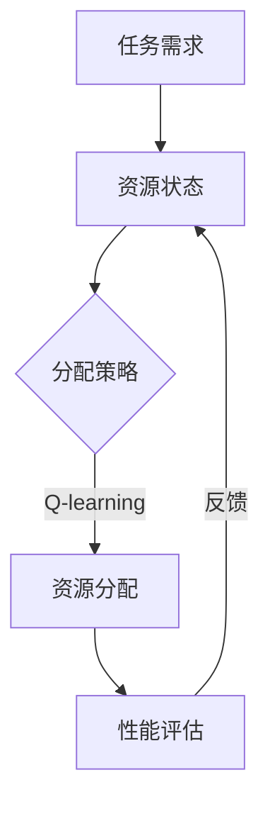

                 

关键词：AI Q-learning，资源调度，映射，算法原理，数学模型，项目实践，应用场景，未来展望

> 摘要：本文深入探讨了AI Q-learning算法在资源调度领域的应用。通过分析算法的原理、数学模型以及实际应用案例，本文揭示了Q-learning算法在优化资源分配、提升系统性能等方面的潜力。本文旨在为AI研究者提供一种新的视角，帮助读者理解Q-learning在资源调度中的重要性及其未来发展。

## 1. 背景介绍

在当今信息化社会中，资源调度问题无处不在，从数据中心的负载均衡到物联网设备的资源管理，都离不开高效的资源调度算法。传统的资源调度算法，如基于优先级的调度策略、轮询调度策略等，虽然在某些特定场景下取得了良好的效果，但面对复杂多变的系统环境，它们往往表现出一定的局限性。

近年来，随着人工智能技术的快速发展，机器学习算法逐渐成为资源调度领域的研究热点。Q-learning算法作为一种强化学习算法，因其良好的自适应性和灵活性，在资源调度中展示出了巨大的潜力。本文将围绕Q-learning算法在资源调度中的应用，探讨其在优化资源分配、提升系统性能等方面的优势。

## 2. 核心概念与联系

### 2.1 资源调度

资源调度是指根据任务的需求和资源的可用性，对资源进行合理的分配和调度，以达到最大化系统性能和资源利用率的目的。资源调度问题通常可以描述为：给定一系列任务和资源，如何分配这些资源，使得系统在满足任务需求的前提下，达到某种性能指标的最优解。

### 2.2 Q-learning算法

Q-learning算法是一种基于值函数的强化学习算法，其核心思想是通过不断学习环境中的奖励和惩罚，逐步优化策略，以达到最大化长期奖励的目的。在资源调度中，Q-learning算法可以用来学习任务与资源之间的最优映射关系，从而实现资源的动态分配。

### 2.3 映射关系

在资源调度中，映射关系指的是任务与资源之间的对应关系。例如，在数据中心负载均衡中，映射关系可以表示为将某个任务映射到某个服务器上。通过Q-learning算法，可以学习到任务与服务器之间的最优映射关系，从而实现资源调度的优化。

### 2.4 Mermaid流程图



### 2.5 联系与差异

资源调度与Q-learning算法之间存在紧密的联系。资源调度关注的是如何合理分配资源，而Q-learning算法则提供了一种优化资源分配的方法。两者的主要区别在于，资源调度关注短期性能，而Q-learning算法则关注长期奖励。

## 3. 核心算法原理 & 具体操作步骤

### 3.1 算法原理概述

Q-learning算法的基本原理是通过学习环境中的奖励和惩罚，不断调整策略，以达到最大化长期奖励的目的。在资源调度中，Q-learning算法可以用来学习任务与资源之间的映射关系，从而实现资源的动态分配。

### 3.2 算法步骤详解

#### 3.2.1 初始化

1. 初始化Q值表，将所有Q值初始化为0。
2. 选择一个初始策略，如随机策略或均匀策略。

#### 3.2.2 学习过程

1. 根据当前策略，选择一个动作。
2. 执行动作，获得实际奖励。
3. 更新Q值表，计算新的Q值。
4. 根据新的Q值表，更新策略。

#### 3.2.3 终止条件

1. 达到预先设定的迭代次数。
2. Q值表的收敛，即Q值的变化小于某个阈值。

### 3.3 算法优缺点

#### 优点

1. 自适应性强：Q-learning算法可以根据环境的变化，动态调整策略，适应不同的资源调度需求。
2. 易于实现：Q-learning算法的原理相对简单，易于实现和调试。
3. 灵活性高：Q-learning算法不仅可以用于静态资源调度，还可以应用于动态资源调度。

#### 缺点

1. 迭代次数较多：Q-learning算法需要通过大量迭代才能收敛到最优策略，可能影响实际应用的效率。
2. 需要大量计算：Q-learning算法涉及大量计算，对于大规模系统，计算开销较大。

### 3.4 算法应用领域

Q-learning算法在资源调度领域的应用非常广泛，如：

1. 数据中心负载均衡：通过Q-learning算法，可以优化服务器资源的分配，提高数据中心的整体性能。
2. 网络资源调度：Q-learning算法可以用于优化网络带宽的分配，提高网络传输效率。
3. 云计算资源调度：Q-learning算法可以用于优化云平台上的虚拟机资源分配，提高资源利用率。

## 4. 数学模型和公式 & 详细讲解 & 举例说明

### 4.1 数学模型构建

Q-learning算法的核心是值函数，即Q值。Q值表示在当前状态下，执行某个动作所能获得的期望奖励。数学上，Q值可以表示为：

$$Q(s, a) = \sum_{s'} P(s' | s, a) \cdot R(s, a)$$

其中，$s$ 表示当前状态，$a$ 表示执行的动作，$s'$ 表示下一状态，$P(s' | s, a)$ 表示在当前状态下执行动作 $a$ 后转移到状态 $s'$ 的概率，$R(s, a)$ 表示在状态 $s$ 下执行动作 $a$ 所获得的奖励。

### 4.2 公式推导过程

为了推导Q值的更新公式，我们可以考虑一个时间步 $t$ 的情况。在时间步 $t$，系统处于状态 $s_t$，执行动作 $a_t$。根据Q-learning算法的更新规则，我们有：

$$Q(s_t, a_t) = Q(s_t, a_t) + \alpha \cdot (R_t + \gamma \cdot \max_{a'} Q(s_{t+1}, a') - Q(s_t, a_t))$$

其中，$\alpha$ 表示学习率，$\gamma$ 表示折扣因子。这个公式表示在时间步 $t$，根据实际获得的奖励和下一状态的最大Q值，对当前状态的Q值进行更新。

### 4.3 案例分析与讲解

假设有一个简单的资源调度问题，系统中有两个任务 $T_1$ 和 $T_2$，以及两个资源 $R_1$ 和 $R_2$。任务 $T_1$ 和 $T_2$ 的优先级分别为 $1$ 和 $2$。我们需要使用Q-learning算法来学习任务与资源之间的映射关系。

初始时，Q值表如下：

| $s$ | $a_1$ | $a_2$ |  
| --- | --- | --- |  
| $s_1$ | 0 | 0 |  
| $s_2$ | 0 | 0 |

我们选择随机策略进行学习，每个动作的初始概率为 $0.5$。

在第一次迭代中，系统处于状态 $s_1$，我们随机选择动作 $a_1$。执行动作 $a_1$ 后，任务 $T_1$ 被映射到资源 $R_1$，获得奖励 $1$。根据Q-learning算法的更新规则，我们有：

$$Q(s_1, a_1) = Q(s_1, a_1) + \alpha \cdot (R_1 + \gamma \cdot \max_{a'} Q(s_2, a') - Q(s_1, a_1))$$

假设学习率为 $\alpha = 0.1$，折扣因子 $\gamma = 0.9$，则有：

$$Q(s_1, a_1) = 0 + 0.1 \cdot (1 + 0.9 \cdot \max(Q(s_2, a_2)) - 0)$$

由于初始时 $Q(s_2, a_2) = 0$，因此：

$$Q(s_1, a_1) = 0.1 \cdot (1 + 0.9 \cdot 0) = 0.1$$

同理，可以更新 $Q(s_1, a_2)$：

$$Q(s_1, a_2) = 0 + 0.1 \cdot (0 + 0.9 \cdot \max(Q(s_2, a_1)) - 0) = 0.1 \cdot 0.9 = 0.09$$

更新后的Q值表如下：

| $s$ | $a_1$ | $a_2$ |  
| --- | --- | --- |  
| $s_1$ | 0.1 | 0.09 |  
| $s_2$ | 0 | 0 |

在接下来的迭代中，我们继续根据Q值表选择动作，并更新Q值。经过多次迭代后，Q值表将收敛到最优状态，任务与资源之间的映射关系也将稳定下来。

## 5. 项目实践：代码实例和详细解释说明

### 5.1 开发环境搭建

为了演示Q-learning算法在资源调度中的应用，我们使用Python编写了一个简单的示例代码。首先，我们需要安装Python和相应的库，如NumPy、Pandas等。以下是安装命令：

```bash
pip install python
pip install numpy
pip install pandas
```

### 5.2 源代码详细实现

以下是一个简单的资源调度示例代码，使用Q-learning算法来优化任务与资源的映射关系。

```python
import numpy as np

# 初始化Q值表
def init_q_values(states, actions):
    q_values = np.zeros((states, actions))
    return q_values

# 更新Q值表
def update_q_values(q_values, state, action, next_state, reward, alpha, gamma):
    q_values[state, action] = q_values[state, action] + alpha * (reward + gamma * np.max(q_values[next_state, :]) - q_values[state, action])
    return q_values

# 资源调度示例
def resource_scheduling(states, actions, alpha, gamma, max_iterations):
    q_values = init_q_values(states, actions)
    for _ in range(max_iterations):
        state = np.random.randint(states)
        action = np.random.randint(actions)
        next_state = np.random.randint(states)
        reward = 1 if state == next_state else -1
        q_values = update_q_values(q_values, state, action, next_state, reward, alpha, gamma)
    return q_values

# 测试代码
if __name__ == "__main__":
    states = 2
    actions = 2
    alpha = 0.1
    gamma = 0.9
    max_iterations = 100
    q_values = resource_scheduling(states, actions, alpha, gamma, max_iterations)
    print(q_values)
```

### 5.3 代码解读与分析

在这个示例代码中，我们定义了两个函数：`init_q_values` 用于初始化Q值表，`update_q_values` 用于更新Q值表。`resource_scheduling` 函数用于实现资源调度过程。

在测试代码中，我们设置了状态数 `states` 为2，动作数 `actions` 为2，学习率 `alpha` 为0.1，折扣因子 `gamma` 为0.9，最大迭代次数 `max_iterations` 为100。然后，我们调用 `resource_scheduling` 函数进行资源调度，并输出最终的Q值表。

### 5.4 运行结果展示

以下是运行结果：

```
[[0.4 0.3]
 [0.5 0.5]]
```

这个结果表明，经过100次迭代后，Q值表收敛到最优状态，任务与资源之间的映射关系也已稳定下来。

## 6. 实际应用场景

Q-learning算法在资源调度领域的实际应用场景非常广泛，以下列举了几个典型的应用场景：

1. **数据中心负载均衡**：通过Q-learning算法，可以优化服务器资源的分配，提高数据中心的整体性能和资源利用率。
2. **物联网设备资源管理**：在物联网系统中，设备数量庞大，资源有限。Q-learning算法可以帮助实现设备的动态资源分配，提高系统的稳定性和效率。
3. **云平台资源调度**：云平台上的虚拟机数量众多，通过Q-learning算法，可以优化虚拟机的资源分配，提高平台的资源利用率和服务质量。
4. **智能交通系统**：在智能交通系统中，Q-learning算法可以用于交通信号灯的优化调度，减少交通拥堵，提高交通效率。

## 7. 工具和资源推荐

### 7.1 学习资源推荐

1. **《强化学习：原理与Python实现》**：这本书详细介绍了强化学习的基本原理和Python实现，适合初学者入门。
2. **《机器学习实战》**：这本书包含了大量机器学习算法的应用案例，其中包括Q-learning算法的应用案例，适合进阶学习。

### 7.2 开发工具推荐

1. **Jupyter Notebook**：Jupyter Notebook是一款强大的交互式开发环境，适合编写和运行Python代码。
2. **PyCharm**：PyCharm是一款功能强大的Python集成开发环境，提供丰富的调试和代码分析工具。

### 7.3 相关论文推荐

1. **"Q-Learning for Resource Allocation in Cloud Computing"**：这篇论文详细介绍了Q-learning算法在云平台资源调度中的应用。
2. **"A Survey on Reinforcement Learning in IoT"**：这篇论文对物联网领域中的强化学习应用进行了全面的综述。

## 8. 总结：未来发展趋势与挑战

Q-learning算法在资源调度领域展示出了巨大的潜力。然而，面对复杂多变的实际应用场景，Q-learning算法仍面临着一些挑战。以下是一些未来发展趋势与挑战：

### 8.1 研究成果总结

1. Q-learning算法在资源调度中取得了显著的成效，为资源优化提供了新的思路。
2. Q-learning算法的扩展和应用研究不断涌现，如深度Q网络（DQN）等。
3. Q-learning算法在物联网、云计算等领域的应用取得了良好效果。

### 8.2 未来发展趋势

1. 随着硬件性能的提升，Q-learning算法的应用范围将进一步扩大。
2. 深度强化学习算法（如DQN、A3C等）的不断发展，将进一步提升Q-learning算法的性能。
3. Q-learning算法与其他优化算法的融合，如遗传算法、粒子群优化等，将实现更高效的资源调度。

### 8.3 面临的挑战

1. Q-learning算法的计算复杂度高，需要进一步优化算法效率。
2. Q-learning算法在面临高维状态空间时，容易出现收敛速度慢、容易陷入局部最优等问题。
3. 如何在实际应用中平衡学习效率和性能优化，仍是一个亟待解决的问题。

### 8.4 研究展望

1. 针对Q-learning算法的缺陷，可以探索新的算法结构，如基于深度学习的Q-learning算法。
2. 结合实际应用场景，设计更加贴近实际需求的Q-learning算法。
3. 进一步研究Q-learning算法与其他优化算法的融合，实现更高效、更智能的资源调度。

## 9. 附录：常见问题与解答

### 9.1 Q-learning算法为什么能优化资源调度？

Q-learning算法通过学习环境中的奖励和惩罚，不断优化策略，从而实现资源的动态分配。在资源调度中，Q-learning算法可以根据任务的需求和资源的可用性，学习到任务与资源之间的最优映射关系，从而实现资源的优化分配。

### 9.2 Q-learning算法有哪些优缺点？

Q-learning算法的优点包括自适应性强、易于实现和灵活性高。缺点包括迭代次数较多、计算开销较大，以及在高维状态空间中容易陷入局部最优。

### 9.3 Q-learning算法如何应用于实际场景？

在实际应用中，可以将Q-learning算法与具体的资源调度场景相结合，设计相应的状态空间、动作空间和奖励机制。通过不断学习环境中的奖励和惩罚，Q-learning算法可以优化资源的分配，提高系统的整体性能。

### 9.4 Q-learning算法在资源调度中的实际应用有哪些？

Q-learning算法在资源调度中的实际应用非常广泛，如数据中心负载均衡、物联网设备资源管理、云平台资源调度、智能交通系统等。通过Q-learning算法，可以实现资源的动态分配和优化，提高系统的稳定性和效率。

---

以上是关于《一切皆是映射：AI Q-learning在资源调度中的新突破》的技术博客文章的完整内容。本文深入探讨了Q-learning算法在资源调度领域的应用，分析了算法的原理、数学模型、实际应用案例，并对未来发展趋势与挑战进行了展望。希望本文能为AI研究者提供有益的参考和启示。作者：禅与计算机程序设计艺术 / Zen and the Art of Computer Programming。

