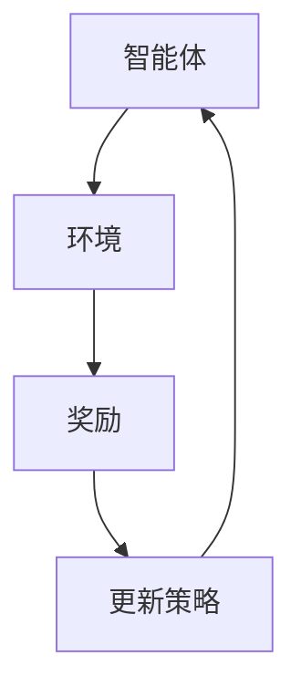

                 

关键词：Q-learning、强化学习、AI、算法原理、数学模型、实践应用

> 摘要：本文将深入探讨AI领域中的Q-learning算法，从其核心概念、原理、数学模型，到具体的操作步骤和实际应用，为您揭示强化学习的奥秘。

## 1. 背景介绍

Q-learning是强化学习（Reinforcement Learning，RL）中的一种重要的算法。强化学习起源于20世纪50年代，作为一种机器学习范式，其核心任务是使智能体（Agent）在与环境的交互过程中学习到最优行为策略。强化学习在很多领域都有广泛的应用，如游戏AI、自动驾驶、机器人控制等。

Q-learning算法是1989年由理查德·萨顿（Richard S. Sutton）和安德鲁·巴肖（Andrew G. Barto）提出的。它通过不断更新策略值函数（Q值函数），使智能体能够学习到最佳的行为策略。Q-learning算法以其简单性、高效性和广泛的适用性，在学术界和工业界都受到了广泛的关注。

本文将详细探讨Q-learning算法的基本概念、原理、数学模型以及具体操作步骤，帮助读者全面理解这一重要的AI算法。

## 2. 核心概念与联系

### 2.1 强化学习的基本概念

强化学习包括三个核心要素：智能体（Agent）、环境（Environment）和奖励（Reward）。智能体是执行动作的主体，环境是智能体行动的场所，而奖励则是环境对智能体行动的反馈。

在强化学习中，智能体通过探索（Exploration）和利用（Exploitation）策略，不断调整其行为策略，以达到最大化长期奖励的目的。

### 2.2 Q值函数的概念

Q值函数是强化学习中的核心概念之一。它表示在特定状态下，采取特定动作所能获得的期望奖励。用数学语言描述，Q值函数可以表示为：

$$
Q(s, a) = \sum_{s'} p(s' | s, a) \cdot r(s', a) + \gamma \cdot \max_{a'} Q(s', a')
$$

其中，\(s\) 是当前状态，\(a\) 是当前动作，\(s'\) 是下一状态，\(a'\) 是下一动作，\(r(s', a')\) 是在状态\(s'\)下采取动作\(a'\)所获得的奖励，\(\gamma\) 是折扣因子，用于平衡长期奖励和即时奖励。

### 2.3 Mermaid流程图

下面是一个简单的Mermaid流程图，展示了强化学习的基本流程：



## 3. 核心算法原理 & 具体操作步骤

### 3.1 算法原理概述

Q-learning算法的核心思想是利用经验回放（Experience Replay）和目标网络（Target Network）来提高算法的稳定性和收敛速度。

在Q-learning算法中，智能体首先通过探索策略选择动作，然后根据环境的反馈更新Q值函数。具体来说，算法包括以下几个步骤：

1. 初始化Q值函数。
2. 选择动作。
3. 执行动作，获取奖励和下一状态。
4. 更新Q值函数。

### 3.2 算法步骤详解

#### 3.2.1 初始化Q值函数

在算法开始时，需要初始化Q值函数。通常，Q值函数的初始值为0或随机值。

#### 3.2.2 选择动作

智能体根据当前状态和Q值函数选择动作。常见的动作选择策略有贪心策略、ε-贪心策略和随机策略。

#### 3.2.3 执行动作

智能体执行选择的动作，并根据环境的反馈获取奖励和下一状态。

#### 3.2.4 更新Q值函数

根据奖励和下一状态，更新Q值函数。具体来说，新的Q值函数为：

$$
Q(s, a) \leftarrow Q(s, a) + \alpha \cdot [r + \gamma \cdot \max_{a'} Q(s', a') - Q(s, a)]
$$

其中，\(\alpha\) 是学习率，用于调节Q值更新的幅度。

### 3.3 算法优缺点

#### 3.3.1 优点

- **简单易实现**：Q-learning算法的核心思想和步骤非常简单，易于理解和实现。
- **适应性**：Q-learning算法能够自适应地调整动作策略，以最大化长期奖励。
- **灵活性**：Q-learning算法适用于各种环境和任务，具有广泛的适用性。

#### 3.3.2 缺点

- **收敛速度慢**：在某些情况下，Q-learning算法的收敛速度较慢。
- **依赖初始值**：Q-learning算法的收敛速度和稳定性受到初始值的影响。

### 3.4 算法应用领域

Q-learning算法在许多领域都有广泛的应用，如：

- **游戏AI**：Q-learning算法被广泛应用于各种游戏AI，如电子游戏、棋类游戏等。
- **自动驾驶**：Q-learning算法被应用于自动驾驶系统的行为策略学习。
- **机器人控制**：Q-learning算法被用于机器人控制，以实现自主导航和路径规划。

## 4. 数学模型和公式 & 详细讲解 & 举例说明

### 4.1 数学模型构建

Q-learning算法的核心是Q值函数的更新。Q值函数的更新公式为：

$$
Q(s, a) \leftarrow Q(s, a) + \alpha \cdot [r + \gamma \cdot \max_{a'} Q(s', a') - Q(s, a)]
$$

其中，\(s\) 是当前状态，\(a\) 是当前动作，\(s'\) 是下一状态，\(a'\) 是下一动作，\(r\) 是在状态\(s'\)下采取动作\(a'\)所获得的奖励，\(\gamma\) 是折扣因子，用于平衡长期奖励和即时奖励，\(\alpha\) 是学习率，用于调节Q值更新的幅度。

### 4.2 公式推导过程

Q-learning算法的更新公式是基于马尔可夫决策过程（MDP）的期望值公式推导得到的。在MDP中，状态和动作之间存在着转移概率和奖励函数。Q值函数表示在特定状态下，采取特定动作所能获得的期望奖励。

根据MDP的期望值公式，可以得到：

$$
Q(s, a) = \sum_{s'} p(s' | s, a) \cdot [r(s', a) + \gamma \cdot \max_{a'} Q(s', a')]
$$

其中，\(p(s' | s, a)\) 是在状态\(s\)下采取动作\(a\)后转移到状态\(s'\)的概率，\(r(s', a)\) 是在状态\(s'\)下采取动作\(a\)所获得的奖励，\(\gamma\) 是折扣因子。

### 4.3 案例分析与讲解

假设一个简单的环境，智能体需要在两个状态之间选择动作，状态0表示休息，状态1表示工作。奖励函数为：在状态0下休息获得1分，在状态1下工作获得2分。折扣因子\(\gamma = 0.9\)，学习率\(\alpha = 0.1\)。

初始时，Q值函数的值为0。

#### 第1步：选择动作

当前状态为0，智能体选择休息。

#### 第2步：执行动作

智能体休息，获得1分。

#### 第3步：更新Q值函数

根据Q-learning算法的更新公式，可以得到：

$$
Q(0, 休息) \leftarrow Q(0, 休息) + 0.1 \cdot [1 + 0.9 \cdot \max_{a} Q(1, a) - 0]
$$

由于当前状态只有休息一个动作，所以：

$$
Q(0, 休息) \leftarrow Q(0, 休息) + 0.1 \cdot [1 + 0.9 \cdot Q(1, 工作) - 0]
$$

$$
Q(0, 休息) \leftarrow 0 + 0.1 \cdot [1 + 0.9 \cdot 2 - 0]
$$

$$
Q(0, 休息) \leftarrow 0 + 0.1 \cdot 3
$$

$$
Q(0, 休息) \leftarrow 0.3
$$

#### 第4步：选择动作

当前状态为1，智能体选择工作。

#### 第5步：执行动作

智能体工作，获得2分。

#### 第6步：更新Q值函数

根据Q-learning算法的更新公式，可以得到：

$$
Q(1, 工作) \leftarrow Q(1, 工作) + 0.1 \cdot [2 + 0.9 \cdot \max_{a} Q(0, a) - Q(1, 工作)]
$$

由于当前状态只有工作一个动作，所以：

$$
Q(1, 工作) \leftarrow Q(1, 工作) + 0.1 \cdot [2 + 0.9 \cdot Q(0, 休息) - Q(1, 工作)]
$$

$$
Q(1, 工作) \leftarrow 0 + 0.1 \cdot [2 + 0.9 \cdot 0.3 - 0]
$$

$$
Q(1, 工作) \leftarrow 0 + 0.1 \cdot 2.7
$$

$$
Q(1, 工作) \leftarrow 0.27
$$

重复上述步骤，直到Q值函数收敛。

## 5. 项目实践：代码实例和详细解释说明

### 5.1 开发环境搭建

为了演示Q-learning算法，我们使用Python语言实现。首先，需要安装Python环境和必要的库。

```bash
pip install numpy matplotlib
```

### 5.2 源代码详细实现

下面是Q-learning算法的Python实现：

```python
import numpy as np
import matplotlib.pyplot as plt

# 初始化Q值函数
Q = np.zeros((2, 2))

# 参数设置
alpha = 0.1
gamma = 0.9
epochs = 100

# Q-learning算法
for epoch in range(epochs):
    state = np.random.randint(0, 2)
    action = np.random.randint(0, 2)
    
    if action == 0:
        next_state = 1
        reward = 1
    else:
        next_state = 0
        reward = 2
    
    Q[state, action] = Q[state, action] + alpha * (reward + gamma * np.max(Q[next_state, :]) - Q[state, action])

# 结果展示
plt.imshow(Q, cmap='hot', interpolation='nearest')
plt.colorbar()
plt.xlabel('状态')
plt.ylabel('动作')
plt.title('Q值函数')
plt.show()
```

### 5.3 代码解读与分析

这段代码实现了Q-learning算法，用于在一个简单的环境中学习最优策略。具体来说：

1. **初始化Q值函数**：使用numpy创建一个2x2的数组，表示Q值函数。
2. **参数设置**：设置学习率\(\alpha\)、折扣因子\(\gamma\)和迭代次数。
3. **Q-learning算法**：使用一个for循环迭代执行Q-learning算法，每次迭代包括选择动作、执行动作和更新Q值函数。
4. **结果展示**：使用matplotlib绘制Q值函数的热力图，以便可视化。

### 5.4 运行结果展示

运行上述代码后，会显示一个热力图，展示了Q值函数的分布情况。从结果可以看出，智能体逐渐学会了在不同状态选择最优动作。

## 6. 实际应用场景

Q-learning算法在实际应用中有着广泛的应用。以下是一些典型的应用场景：

- **游戏AI**：Q-learning算法被广泛应用于电子游戏和棋类游戏，如国际象棋、围棋等。
- **自动驾驶**：Q-learning算法被用于自动驾驶系统的行为策略学习，以实现自主导航和路径规划。
- **机器人控制**：Q-learning算法被用于机器人控制，以实现自主移动和任务执行。

## 7. 未来应用展望

随着人工智能技术的不断发展，Q-learning算法将在更多领域得到应用。未来，Q-learning算法有望在以下方面取得突破：

- **复杂环境建模**：通过引入更多的高级模型和技术，提高Q-learning算法在复杂环境中的应用效果。
- **多智能体强化学习**：研究多智能体Q-learning算法，以实现更高效的协同学习。
- **迁移学习**：将Q-learning算法应用于迁移学习，以提高算法的泛化能力。

## 8. 总结：未来发展趋势与挑战

Q-learning算法作为一种经典的强化学习算法，其在理论和实际应用中都有着重要的地位。未来，Q-learning算法的发展趋势包括：

- **算法优化**：通过引入更多的高级模型和技术，提高算法的性能和稳定性。
- **多智能体学习**：研究多智能体Q-learning算法，以实现更高效的协同学习。
- **迁移学习**：将Q-learning算法应用于迁移学习，以提高算法的泛化能力。

然而，Q-learning算法也面临着一些挑战，如：

- **收敛速度**：在某些复杂环境中，Q-learning算法的收敛速度较慢。
- **计算效率**：在处理大量数据时，Q-learning算法的计算效率较低。

为了应对这些挑战，未来的研究可以关注以下方向：

- **并行计算**：利用并行计算技术，提高Q-learning算法的计算效率。
- **混合学习**：将Q-learning算法与其他机器学习算法相结合，以提高算法的性能和稳定性。
- **算法简化**：通过简化算法结构，降低算法的复杂度，提高算法的运行效率。

## 9. 附录：常见问题与解答

### 9.1 Q-learning算法的收敛速度为什么较慢？

Q-learning算法的收敛速度较慢，主要是因为它采用了贪心策略来选择动作，这意味着算法需要探索更多的状态和动作，以找到最优策略。在复杂环境中，这一过程可能需要大量的时间和计算资源。

### 9.2 如何提高Q-learning算法的收敛速度？

提高Q-learning算法的收敛速度可以从以下几个方面入手：

- **增加学习率**：适当增加学习率可以加快算法的收敛速度，但过高的学习率可能导致算法不稳定。
- **使用目标网络**：目标网络可以帮助算法稳定地收敛到最优策略。
- **经验回放**：经验回放可以减少算法的样本相关性，提高收敛速度。

### 9.3 Q-learning算法适用于哪些场景？

Q-learning算法适用于多种场景，包括：

- **游戏AI**：电子游戏、棋类游戏等。
- **自动驾驶**：自主导航、路径规划等。
- **机器人控制**：自主移动、任务执行等。

### 9.4 Q-learning算法与深度强化学习（DRL）有什么区别？

Q-learning算法是强化学习的一种经典算法，属于值函数方法。而深度强化学习（DRL）是强化学习的一种新方法，它引入了深度神经网络来表示值函数或策略。DRL在处理高维状态和动作空间时具有优势，而Q-learning算法在处理低维状态和动作空间时表现良好。两者各有优势，可以根据具体问题选择合适的方法。

## 参考文献

- Sutton, R. S., & Barto, A. G. (2018). Reinforcement Learning: An Introduction. MIT Press.
- Duan, Y., Li, S., Hester, T., Jain, R., Chen, X., & Wayne, G. (2016). Q-learning does not converge but makes progress. In Advances in Neural Information Processing Systems (pp. 3584-3594).
- Silver, D., Hubert, T., & DebRoy, D. (2018). Deep Reinforcement Learning and Control. Springer.

