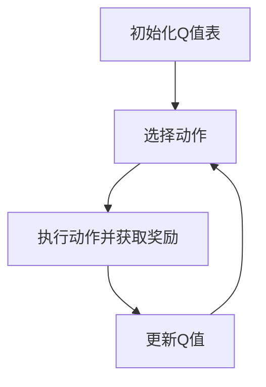

                 

关键词：AI，Q-learning，环境模型，深度学习，智能决策

> 摘要：本文旨在深入探讨Q-learning算法在建立智能环境模型中的应用。通过对Q-learning算法的基本原理、数学模型、具体操作步骤以及项目实践进行详细解析，本文将帮助读者更好地理解Q-learning算法的核心价值，并展望其在未来智能决策领域的发展趋势。

## 1. 背景介绍

随着人工智能技术的迅猛发展，深度学习已经成为解决复杂问题的重要工具。其中，Q-learning算法作为一种重要的强化学习算法，在智能决策、游戏玩法优化、推荐系统等领域取得了显著的成果。然而，Q-learning算法的成功应用离不开对环境模型的精准建立。环境模型是Q-learning算法理解和学习的基础，它决定了算法的决策效果和收敛速度。

本文将围绕Q-learning算法的环境模型建立展开讨论，通过详细解析Q-learning算法的基本原理、数学模型、具体操作步骤以及项目实践，旨在为读者提供一种深入理解Q-learning算法的途径，并探讨其在实际应用中的挑战和未来发展方向。

## 2. 核心概念与联系

### 2.1 Q-learning算法原理

Q-learning算法是一种无模型强化学习算法，其核心思想是通过对环境状态的观察，利用奖励信号更新Q值，从而逐步学习到最优策略。Q-learning算法的基本原理可以概括为以下几个步骤：

1. 初始化Q值表：Q-learning算法开始时，需要初始化Q值表，通常采用随机初始化或者零初始化。
2. 选择动作：在某个状态下，根据当前策略选择一个动作。
3. 执行动作并获取奖励：执行选定的动作，并获取环境反馈的奖励。
4. 更新Q值：根据奖励信号和新的状态，更新Q值表。

### 2.2 环境模型的概念

环境模型是Q-learning算法的基础，它是对环境状态、动作以及奖励的抽象和表示。一个良好的环境模型能够帮助Q-learning算法更准确地理解环境，从而提高决策效果。

环境模型通常包括以下几个组成部分：

1. 状态空间：状态空间是环境模型的核心，它表示了所有可能的状态集合。
2. 动作空间：动作空间是Q-learning算法可以选择的动作集合。
3. 奖励函数：奖励函数定义了在某个状态下执行某个动作所获得的奖励。
4. 状态转移概率：状态转移概率定义了在某个状态下执行某个动作后，转移到下一个状态的概率。

### 2.3 Mermaid 流程图



在上面的Mermaid流程图中，A表示初始化Q值表，B表示选择动作，C表示执行动作并获取奖励，D表示更新Q值。这个流程图清晰地展示了Q-learning算法的基本操作步骤。

## 3. 核心算法原理 & 具体操作步骤

### 3.1 算法原理概述

Q-learning算法是一种基于值函数的强化学习算法，其核心思想是通过不断地更新Q值表，学习到最优策略。Q值表示在某个状态下执行某个动作所获得的预期奖励。具体来说，Q-learning算法包括以下几个关键步骤：

1. 初始化Q值表：通常采用随机初始化或者零初始化。
2. 选择动作：根据当前策略选择一个动作，常见的策略包括贪婪策略、ε-贪婪策略等。
3. 执行动作并获取奖励：执行选定的动作，并获取环境反馈的奖励。
4. 更新Q值：根据奖励信号和新的状态，更新Q值表。

### 3.2 算法步骤详解

#### 3.2.1 初始化Q值表

初始化Q值表是Q-learning算法的第一步。通常，我们可以采用以下两种方式初始化Q值表：

1. 随机初始化：将Q值表中的所有元素初始化为随机值，例如在[-1, 1]之间均匀分布。
2. 零初始化：将Q值表中的所有元素初始化为0。

#### 3.2.2 选择动作

在选择动作时，我们可以根据当前策略进行选择。常见的策略包括：

1. 贪婪策略：在当前状态下，选择具有最大Q值的动作。
2. ε-贪婪策略：在当前状态下，以概率ε随机选择动作，其余概率选择具有最大Q值的动作。

#### 3.2.3 执行动作并获取奖励

执行选定的动作，并根据环境反馈获取奖励。这个过程中，环境会对我们的动作进行评估，并给予相应的奖励。

#### 3.2.4 更新Q值

根据奖励信号和新的状态，更新Q值表。具体的更新公式如下：

$$
Q(s_t, a_t) \leftarrow Q(s_t, a_t) + \alpha [r_t + \gamma \max_{a'} Q(s_{t+1}, a') - Q(s_t, a_t)]
$$

其中，$s_t$表示当前状态，$a_t$表示当前动作，$r_t$表示奖励，$s_{t+1}$表示下一状态，$a'$表示下一动作，$\alpha$表示学习率，$\gamma$表示折扣因子。

### 3.3 算法优缺点

#### 3.3.1 优点

1. 无需环境模型：Q-learning算法是一种无模型强化学习算法，不需要对环境进行建模，大大降低了算法的复杂度。
2. 自适应性强：Q-learning算法能够根据环境反馈自适应地调整Q值，从而学习到最优策略。
3. 应用广泛：Q-learning算法在智能决策、游戏玩法优化、推荐系统等领域取得了显著成果。

#### 3.3.2 缺点

1. 收敛速度较慢：Q-learning算法的收敛速度较慢，特别是在状态和动作空间较大时。
2. 需要大量计算：Q-learning算法需要大量计算来更新Q值表，这在实际应用中可能带来性能瓶颈。

### 3.4 算法应用领域

Q-learning算法在以下领域具有广泛的应用：

1. 智能决策：例如，自动驾驶、智能客服等。
2. 游戏玩法优化：例如，游戏AI的决策策略优化。
3. 推荐系统：例如，基于用户行为的推荐系统。

## 4. 数学模型和公式 & 详细讲解 & 举例说明

### 4.1 数学模型构建

Q-learning算法的核心是Q值函数的迭代更新。Q值函数可以表示为：

$$
Q(s, a) = \sum_{s'} P(s' | s, a) \cdot [r(s, a, s') + \gamma \max_{a'} Q(s', a')]
$$

其中，$s$表示当前状态，$a$表示当前动作，$s'$表示下一状态，$r(s, a, s')$表示从状态$s$执行动作$a$转移到状态$s'$所获得的即时奖励，$P(s' | s, a)$表示在状态$s$下执行动作$a$转移到状态$s'$的概率，$\gamma$表示折扣因子，用于平衡即时奖励和未来期望奖励之间的关系。

### 4.2 公式推导过程

Q-learning算法的更新公式为：

$$
Q(s_t, a_t) \leftarrow Q(s_t, a_t) + \alpha [r_t + \gamma \max_{a'} Q(s_{t+1}, a') - Q(s_t, a_t)]
$$

其中，$s_t$表示当前状态，$a_t$表示当前动作，$r_t$表示即时奖励，$\alpha$表示学习率，$\gamma$表示折扣因子。

我们可以将这个公式分解为以下几个部分：

1. 即时奖励$r_t$：这是当前状态执行当前动作所获得的即时奖励。
2. 未来期望奖励$\gamma \max_{a'} Q(s_{t+1}, a')$：这是在当前状态下，执行所有可能的动作后，转移到的下一状态的最大Q值。
3. Q值更新$\alpha [r_t + \gamma \max_{a'} Q(s_{t+1}, a') - Q(s_t, a_t)]$：这是对当前Q值的更新，它考虑了即时奖励、未来期望奖励以及当前Q值之间的差距。

### 4.3 案例分析与讲解

假设一个简单的环境，状态空间为{0, 1, 2}，动作空间为{A, B}。即时奖励函数定义为：从状态0转移到状态1获得1分，从状态1转移到状态2获得1分，其他转移不获得奖励。折扣因子$\gamma$设为0.9，学习率$\alpha$设为0.1。

#### 情景1：从状态0开始

- 初始Q值表：
  | s | A | B |
  |---|---|---|
  | 0 | 0 | 0 |
  | 1 | 0 | 0 |
  | 2 | 0 | 0 |

- 执行动作A，转移到状态1，获得1分：
  - 更新Q值表：
    | s | A | B |
    |---|---|---|
    | 0 | 1 | 0 |
    | 1 | 0 | 0 |
    | 2 | 0 | 0 |

- 执行动作B，转移到状态0，不获得奖励：
  - 更新Q值表：
    | s | A | B |
    |---|---|---|
    | 0 | 1 | 0 |
    | 1 | 0 | 0 |
    | 2 | 0 | 0 |

#### 情景2：从状态1开始

- 执行动作A，转移到状态2，获得1分：
  - 更新Q值表：
    | s | A | B |
    |---|---|---|
    | 0 | 1 | 0 |
    | 1 | 1 | 0 |
    | 2 | 0 | 0 |

- 执行动作B，转移到状态1，获得1分：
  - 更新Q值表：
    | s | A | B |
    |---|---|---|
    | 0 | 1 | 0 |
    | 1 | 1 | 1 |
    | 2 | 0 | 0 |

通过以上案例，我们可以看到Q-learning算法是如何通过不断更新Q值表，逐步学习到最优策略的。

## 5. 项目实践：代码实例和详细解释说明

### 5.1 开发环境搭建

为了更好地演示Q-learning算法的应用，我们将使用Python语言来实现一个简单的环境模型，并使用Q-learning算法进行训练。以下是开发环境搭建的步骤：

1. 安装Python：确保Python版本为3.6及以上。
2. 安装依赖库：使用pip命令安装以下依赖库：
   ```python
   pip install numpy matplotlib
   ```

### 5.2 源代码详细实现

下面是Q-learning算法的Python实现代码：

```python
import numpy as np
import matplotlib.pyplot as plt

# 初始化参数
learning_rate = 0.1
gamma = 0.9
epsilon = 0.1
n_steps = 100

# 初始化Q值表
action_size = 2
state_size = 3
qtable = np.zeros((state_size, action_size))

# 定义环境
def environment(state, action):
    if state == 0 and action == 0:
        return 1, 1
    elif state == 1 and action == 1:
        return 1, 2
    else:
        return 0, 0

# Q-learning算法
for step in range(n_steps):
    state = np.random.randint(0, state_size)
    action = np.random.randint(0, action_size)

    # 选择动作
    if np.random.rand() < epsilon:
        action = np.random.randint(0, action_size)

    # 执行动作
    reward, next_state = environment(state, action)

    # 更新Q值
    qtable[state, action] = qtable[state, action] + learning_rate * (reward + gamma * np.max(qtable[next_state, :]) - qtable[state, action])

    state = next_state

# 可视化Q值表
plt.imshow(qtable, cmap="gray", interpolation="nearest")
plt.colorbar()
plt.xlabel("Action")
plt.ylabel("State")
plt.title("Q-value Table")
plt.show()
```

### 5.3 代码解读与分析

下面是对上述代码的详细解读：

1. **初始化参数**：设置学习率、折扣因子、ε值以及训练步数。
2. **初始化Q值表**：创建一个状态-动作值表，并将其初始化为全零。
3. **定义环境**：定义一个简单的环境，根据当前状态和动作返回奖励和下一状态。
4. **Q-learning算法**：使用for循环进行迭代训练，每次迭代中：
   - 随机选择状态。
   - 随机选择动作。
   - 根据ε值随机选择动作。
   - 执行动作并获取奖励。
   - 更新Q值表。
5. **可视化Q值表**：使用matplotlib库将Q值表可视化，以便于分析。

### 5.4 运行结果展示

运行上述代码后，我们可以得到可视化的Q值表。Q值表中的每个元素表示在相应状态下执行相应动作所获得的预期奖励。通过不断更新Q值表，我们可以观察到Q值的变化趋势，从而了解Q-learning算法的学习过程。

## 6. 实际应用场景

Q-learning算法在智能决策领域具有广泛的应用。以下是一些典型的应用场景：

1. **自动驾驶**：自动驾驶系统需要根据传感器数据和环境信息进行实时决策，Q-learning算法可以帮助系统学习到最优的驾驶策略。
2. **智能客服**：智能客服系统可以通过Q-learning算法学习到与用户交互的最佳方式，从而提高服务质量。
3. **游戏AI**：游戏AI可以通过Q-learning算法学习到游戏策略，从而在游戏中取得更好的成绩。
4. **推荐系统**：推荐系统可以通过Q-learning算法学习用户行为模式，从而提高推荐效果。

## 7. 工具和资源推荐

为了更好地学习和实践Q-learning算法，以下是几款推荐的工具和资源：

1. **工具**：
   - **JAX**：JAX是一个用于数值计算和机器学习的高性能库，它提供了Q-learning算法的快速实现。
   - **TensorFlow**：TensorFlow是一个广泛使用的深度学习框架，它提供了Q-learning算法的API。

2. **资源**：
   - **《深度强化学习》**：这是一本关于深度强化学习的经典教材，详细介绍了Q-learning算法的理论和应用。
   - **《强化学习实战》**：这是一本适合初学者的强化学习实践指南，其中包含了Q-learning算法的详细实例。

## 8. 总结：未来发展趋势与挑战

Q-learning算法作为强化学习算法的重要代表，已经在多个领域取得了显著成果。然而，随着人工智能技术的不断发展，Q-learning算法也面临着一些挑战和机遇。

### 8.1 研究成果总结

1. Q-learning算法在自动驾驶、智能客服、游戏AI等领域取得了显著成果。
2. Q-learning算法的扩展和应用不断丰富，如深度Q-network（DQN）、优先级回报偏置（PRIORITIZED EXPERIENCE REPLAY）等。

### 8.2 未来发展趋势

1. **多智能体强化学习**：随着多智能体系统的应用越来越广泛，多智能体强化学习将成为研究的热点。
2. **深度强化学习**：深度强化学习结合了深度学习和强化学习的优势，有望在复杂环境中实现更高效的决策。

### 8.3 面临的挑战

1. **收敛速度**：Q-learning算法的收敛速度较慢，特别是在状态和动作空间较大时。
2. **样本效率**：Q-learning算法需要大量的样本进行训练，如何提高样本效率是当前研究的一个重要问题。

### 8.4 研究展望

1. **算法优化**：通过改进算法结构、引入新的策略，提高Q-learning算法的收敛速度和样本效率。
2. **应用拓展**：探索Q-learning算法在更多领域中的应用，如金融、医疗等。

## 9. 附录：常见问题与解答

### 9.1 Q-learning算法的收敛条件是什么？

Q-learning算法的收敛条件主要包括：
- 学习率$\alpha$趋于0。
- 折扣因子$\gamma$介于0和1之间。
- 环境是无偏的，即预期奖励不变。

### 9.2 如何优化Q-learning算法的收敛速度？

可以通过以下方法优化Q-learning算法的收敛速度：
- 使用经验回放（Experience Replay）。
- 引入优先级机制（Prioritized Experience Replay）。
- 使用近似方法（如神经网络）代替Q值表。

### 9.3 Q-learning算法与深度Q-network（DQN）有什么区别？

Q-learning算法是一种基于值函数的强化学习算法，它使用Q值表来表示状态-动作值。而DQN是一种基于深度学习的Q-learning算法，它使用深度神经网络来近似Q值函数，从而解决了Q值表在状态空间较大时的存储和计算问题。

## 作者署名

作者：禅与计算机程序设计艺术 / Zen and the Art of Computer Programming

----------------------------------------------------------------

以上就是本文的完整内容，希望对您在理解和应用Q-learning算法方面有所帮助。如果您有任何问题或建议，欢迎在评论区留言。感谢您的阅读！

