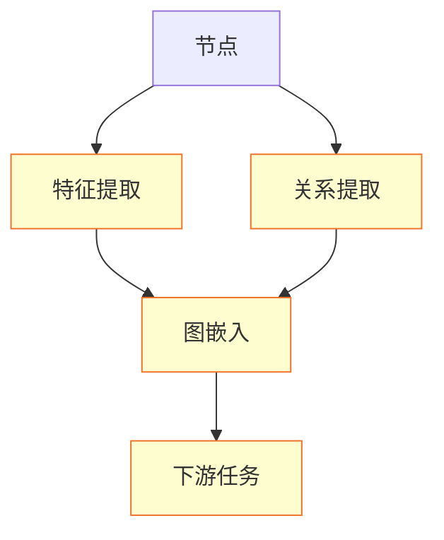
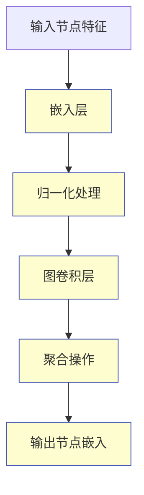

                 

社交网络分析是理解个体和群体行为的关键手段，而人工智能（AI）技术的引入，使得这一过程变得更加高效和智能化。本文将探讨AI在社交网络分析中的应用，从核心概念、算法原理、数学模型、实际应用和未来展望等方面进行详细分析。

## 文章关键词

- 社交网络分析
- 人工智能
- 图神经网络
- 聚类算法
- 数据挖掘
- 人际关系分析
- 网络效应

## 文章摘要

本文首先介绍了社交网络分析的基本概念和重要性，然后探讨了AI在其中的作用，特别是基于图神经网络的社交网络分析技术。接着，我们深入讨论了核心算法原理和数学模型的构建，并通过实际项目实例展示了AI在社交网络分析中的具体应用。最后，我们对未来的发展趋势和面临的挑战进行了展望，并推荐了相关学习和开发资源。

## 1. 背景介绍

### 社交网络的定义与特性

社交网络是指由个体及其相互关系构成的复杂网络。社交网络中的节点代表个体（如人、企业、组织等），边代表个体之间的关系（如朋友、同事、合作关系等）。社交网络具有高度异质性、动态性和层次性等特性，这使得传统的数据分析方法难以应对其复杂性和多样性。

### 社交网络分析的目标与方法

社交网络分析旨在通过分析社交网络结构和个体行为，揭示个体和群体的行为模式、关系结构和社会动态。其主要目标包括：

- 人际关系分析：识别个体之间的紧密联系和社交圈子。
- 社会影响力评估：评估个体在社交网络中的影响力和传播能力。
- 社会群体发现：发现具有相似兴趣和行为的社交群体。
- 信任和合作分析：分析个体之间的信任关系和合作行为。

传统的社交网络分析方法主要包括：

- 聚类算法：通过将具有相似属性的节点聚为同一类，识别社交群体。
- 社会网络分析工具：如Netlytics、Gephi等，用于可视化社交网络和进行节点属性分析。
- 数据挖掘技术：如关联规则挖掘、分类、聚类等，用于从大量社交网络数据中提取有价值的信息。

### 人工智能在社交网络分析中的应用

随着AI技术的发展，人工智能在社交网络分析中的应用逐渐成为热点。AI技术能够提高数据分析的效率，揭示更深层次的社交网络结构，并实现更精确的预测和建模。主要应用包括：

- 图神经网络（Graph Neural Networks, GNNs）：通过学习节点和边的属性，提取复杂的社交网络特征。
- 深度学习模型：如循环神经网络（RNNs）和卷积神经网络（CNNs），用于处理时间序列和图像数据。
- 强化学习：用于优化社交网络中的行为策略和资源分配。
- 自然语言处理（NLP）：用于分析和理解社交网络中的文本内容。

## 2. 核心概念与联系

### 图神经网络（GNN）

#### Mermaid 流程图



#### 算法原理概述

图神经网络是一种在图结构上执行的神经网络，能够处理节点和边的属性。其主要原理包括：

- **节点表示**：将图中的每个节点映射到一个高维向量表示，称为节点嵌入（Node Embedding）。
- **关系建模**：通过学习节点之间的关系，提取更为复杂的特征表示。
- **图嵌入**：将图中的每个节点和边映射到一个低维空间，保留图结构的信息。
- **下游任务**：如分类、推荐、链接预测等，利用图嵌入进行具体任务的处理。

#### 算法步骤详解

1. **节点表示**：将图中的节点表示为高维向量，通常使用嵌入层（Embedding Layer）。
2. **特征提取**：提取节点和边的属性特征，用于更新节点嵌入。
3. **关系提取**：通过图卷积操作（Graph Convolutional Layer），学习节点之间的关系。
4. **图嵌入**：将更新后的节点嵌入映射到一个低维空间，保留图结构的信息。
5. **下游任务**：利用图嵌入进行分类、推荐、链接预测等任务。

### 图嵌入算法

#### Mermaid 流程图



#### 算法原理概述

图嵌入（Graph Embedding）是一种将图结构中的节点映射到低维空间的方法，使其在保留图结构信息的同时，便于下游任务的处理。其主要原理包括：

- **节点嵌入**：将图中的每个节点映射到一个低维向量表示。
- **关系建模**：通过学习节点之间的关系，提取更为复杂的特征表示。
- **图卷积操作**：通过图卷积层，更新节点嵌入，保留图结构的信息。

#### 算法步骤详解

1. **输入节点特征**：输入节点的高维特征向量。
2. **嵌入层**：将节点特征映射到低维空间，通常使用嵌入层（Embedding Layer）。
3. **归一化处理**：对节点嵌入进行归一化处理，使其具有相似的尺度。
4. **图卷积层**：通过图卷积操作，更新节点嵌入。
5. **聚合操作**：将节点的邻接节点的信息聚合到该节点。
6. **输出节点嵌入**：输出每个节点的低维向量表示。

### 核心算法优缺点

- **优点**：
  - **高效性**：通过图嵌入，能够快速进行节点相似性计算和下游任务处理。
  - **灵活性**：能够处理多种类型的图结构，如有向图、无向图、加权图等。
  - **可扩展性**：适用于大规模社交网络分析，易于扩展到其他领域。

- **缺点**：
  - **计算复杂度**：图卷积操作的计算复杂度较高，对大规模图结构处理效率较低。
  - **解释性**：图嵌入模型的输出结果难以解释，需要借助其他方法进行解释。

### 核心算法应用领域

- **社交网络分析**：用于识别社交圈子、评估社会影响力、发现社交群体等。
- **推荐系统**：用于基于用户社交关系进行个性化推荐。
- **网络安全**：用于检测社交网络中的恶意节点和传播路径。
- **生物信息学**：用于蛋白质相互作用网络分析、基因共表达网络分析等。

## 3. 核心算法原理 & 具体操作步骤

### 3.1 算法原理概述

本文中，我们将重点介绍图神经网络（GNN）在社交网络分析中的应用。GNN是一种在图结构上执行的神经网络，能够处理节点和边的属性。GNN的核心思想是将图中的每个节点映射到一个高维向量表示，称为节点嵌入（Node Embedding），并通过图卷积操作（Graph Convolutional Layer）学习节点之间的关系。节点嵌入在下游任务中具有广泛的应用，如节点分类、链接预测、社交群体发现等。

### 3.2 算法步骤详解

#### 3.2.1 节点表示

在GNN中，首先需要将图中的每个节点表示为高维向量。节点表示通常包括节点的属性信息、邻居信息等。例如，对于一个社交网络图，节点的属性可能包括年龄、性别、职业等，而邻居信息可能包括邻居节点的ID和属性。节点表示可以通过嵌入层（Embedding Layer）来实现。

#### 3.2.2 节点嵌入

节点嵌入是将节点的高维特征向量映射到一个低维空间的过程。在GNN中，通常使用图卷积层（Graph Convolutional Layer）来实现节点嵌入。图卷积层的输入为节点表示和邻居表示，输出为更新后的节点嵌入。图卷积层的具体实现包括以下步骤：

1. **聚合邻居信息**：对于每个节点，聚合其邻居节点的嵌入信息，得到一个表示邻居关系的向量。
2. **权重矩阵**：通过学习一个权重矩阵，将邻居信息与节点表示进行加权融合。
3. **激活函数**：应用激活函数（如ReLU）对加权融合的结果进行非线性变换。

#### 3.2.3 下游任务

节点嵌入在下游任务中具有广泛的应用。以下是一些常见的下游任务：

1. **节点分类**：通过训练一个分类器，将节点嵌入映射到分类标签，实现节点的分类任务。
2. **链接预测**：通过计算节点嵌入之间的相似度，预测节点之间的潜在链接。
3. **社交群体发现**：通过聚类节点嵌入，识别具有相似属性和关系的社交群体。

### 3.3 算法优缺点

#### 3.3.1 优点

- **高效性**：GNN能够高效地处理大规模社交网络，进行节点相似性计算和下游任务处理。
- **灵活性**：GNN适用于多种类型的图结构，如有向图、无向图、加权图等。
- **可扩展性**：GNN易于扩展到其他领域，如生物信息学、计算机视觉等。

#### 3.3.2 缺点

- **计算复杂度**：GNN的计算复杂度较高，对大规模图结构处理效率较低。
- **解释性**：GNN的输出结果难以解释，需要借助其他方法进行解释。

### 3.4 算法应用领域

#### 3.4.1 社交网络分析

在社交网络分析中，GNN可以用于以下任务：

- **社交圈子识别**：通过聚类节点嵌入，识别具有相似社交关系的节点群体。
- **社会影响力评估**：通过分析节点嵌入，评估节点在社交网络中的影响力和传播能力。
- **社交群体发现**：通过聚类节点嵌入，发现具有相似兴趣和行为的社交群体。

#### 3.4.2 推荐系统

在推荐系统中，GNN可以用于以下任务：

- **基于社交关系的个性化推荐**：通过计算用户和商品之间的节点嵌入相似度，实现基于社交关系的个性化推荐。
- **社交网络推荐**：通过分析用户社交网络中的节点嵌入，推荐用户可能感兴趣的内容或用户。

#### 3.4.3 网络安全

在网络安全领域，GNN可以用于以下任务：

- **恶意节点检测**：通过分析节点嵌入，识别具有异常行为的恶意节点。
- **传播路径预测**：通过计算节点嵌入之间的相似度，预测潜在的恶意传播路径。

#### 3.4.4 生物信息学

在生物信息学领域，GNN可以用于以下任务：

- **蛋白质相互作用网络分析**：通过分析节点嵌入，识别蛋白质之间的相互作用关系。
- **基因共表达网络分析**：通过分析节点嵌入，识别基因之间的共表达关系。

## 4. 数学模型和公式 & 详细讲解 & 举例说明

### 4.1 数学模型构建

在社交网络分析中，图神经网络（GNN）是一种重要的数学模型。GNN的核心思想是将图中的每个节点映射到一个高维向量表示，称为节点嵌入（Node Embedding），并通过图卷积操作（Graph Convolutional Layer）学习节点之间的关系。节点嵌入在下游任务中具有广泛的应用，如节点分类、链接预测、社交群体发现等。

#### 4.1.1 节点表示

在GNN中，首先需要将图中的每个节点表示为高维向量。节点表示通常包括节点的属性信息、邻居信息等。例如，对于一个社交网络图，节点的属性可能包括年龄、性别、职业等，而邻居信息可能包括邻居节点的ID和属性。节点表示可以通过嵌入层（Embedding Layer）来实现。

#### 4.1.2 节点嵌入

节点嵌入是将节点的高维特征向量映射到一个低维空间的过程。在GNN中，通常使用图卷积层（Graph Convolutional Layer）来实现节点嵌入。图卷积层的输入为节点表示和邻居表示，输出为更新后的节点嵌入。图卷积层的具体实现包括以下步骤：

1. **聚合邻居信息**：对于每个节点，聚合其邻居节点的嵌入信息，得到一个表示邻居关系的向量。
2. **权重矩阵**：通过学习一个权重矩阵，将邻居信息与节点表示进行加权融合。
3. **激活函数**：应用激活函数（如ReLU）对加权融合的结果进行非线性变换。

#### 4.1.3 节点嵌入更新

节点嵌入的更新是通过图卷积操作来实现的。在每次迭代中，节点嵌入会根据其邻居节点的嵌入进行更新。具体地，对于每个节点 \( v \)，其更新后的嵌入 \( \mathbf{h}_{v}^{(t+1)} \) 可以表示为：

$$
\mathbf{h}_{v}^{(t+1)} = \sigma \left( \mathbf{W}_{h} \mathbf{h}_{v}^{(t)} + \sum_{u \in \mathcal{N}(v)} \alpha_{uv} \mathbf{h}_{u}^{(t)} \right)
$$

其中， \( \mathcal{N}(v) \) 表示节点 \( v \) 的邻居节点集合， \( \alpha_{uv} \) 表示邻居节点 \( u \) 对节点 \( v \) 的贡献权重， \( \mathbf{W}_{h} \) 是权重矩阵， \( \sigma \) 是激活函数。

#### 4.1.4 图卷积操作

图卷积操作是GNN的核心，它通过聚合节点和其邻居的信息来更新节点的嵌入。图卷积操作的实现可以采用不同的方法，如邻居聚合（Neighbor Aggregation）、自注意力（Self-Attention）等。以下是一个简单的图卷积操作的实现：

$$
\mathbf{h}_{v}^{(t+1)} = \sum_{u \in \mathcal{N}(v)} \alpha_{uv} \cdot \mathbf{h}_{u}^{(t)}
$$

其中， \( \alpha_{uv} \) 是一个权重系数，可以通过学习得到。通常，可以使用点积、余弦相似度等度量方法来计算权重系数。

#### 4.1.5 节点分类

在GNN中，节点分类是一个常见的下游任务。给定一个训练集，我们希望通过节点嵌入来预测节点的标签。节点分类可以通过以下步骤实现：

1. **嵌入层**：将节点表示映射到低维空间，得到节点嵌入。
2. **全连接层**：将节点嵌入输入到全连接层，得到分类概率。
3. **损失函数**：使用交叉熵损失函数（Cross-Entropy Loss）来计算分类误差。

### 4.2 公式推导过程

#### 4.2.1 节点嵌入的更新

节点嵌入的更新可以通过以下公式推导：

$$
\mathbf{h}_{v}^{(t+1)} = \sigma \left( \mathbf{W}_{h} \mathbf{h}_{v}^{(t)} + \sum_{u \in \mathcal{N}(v)} \alpha_{uv} \mathbf{h}_{u}^{(t)} \right)
$$

其中， \( \mathbf{h}_{v}^{(t)} \) 表示节点 \( v \) 在第 \( t \) 次迭代时的嵌入， \( \mathbf{W}_{h} \) 是权重矩阵， \( \sigma \) 是激活函数， \( \alpha_{uv} \) 是邻居节点 \( u \) 对节点 \( v \) 的贡献权重。

#### 4.2.2 图卷积操作的推导

图卷积操作可以通过以下公式推导：

$$
\mathbf{h}_{v}^{(t+1)} = \sum_{u \in \mathcal{N}(v)} \alpha_{uv} \cdot \mathbf{h}_{u}^{(t)}
$$

其中， \( \alpha_{uv} \) 是一个权重系数，可以通过学习得到。通常，可以使用点积、余弦相似度等度量方法来计算权重系数。

#### 4.2.3 节点分类的推导

节点分类可以通过以下步骤推导：

1. **嵌入层**：将节点表示映射到低维空间，得到节点嵌入。

$$
\mathbf{h}_{v}^{(t)} = \mathbf{W}_{e} \mathbf{x}_{v}
$$

其中， \( \mathbf{W}_{e} \) 是嵌入权重矩阵， \( \mathbf{x}_{v} \) 是节点 \( v \) 的表示。

2. **全连接层**：将节点嵌入输入到全连接层，得到分类概率。

$$
\mathbf{p}_{v}^{(t)} = \sigma \left( \mathbf{W}_{c} \mathbf{h}_{v}^{(t)} \right)
$$

其中， \( \mathbf{W}_{c} \) 是全连接层的权重矩阵， \( \sigma \) 是激活函数， \( \mathbf{p}_{v}^{(t)} \) 是节点 \( v \) 的分类概率。

3. **损失函数**：使用交叉熵损失函数（Cross-Entropy Loss）来计算分类误差。

$$
L = - \sum_{v \in \mathcal{V}} y_{v} \log (\mathbf{p}_{v}^{(t)})
$$

其中， \( y_{v} \) 是节点 \( v \) 的真实标签， \( \mathbf{p}_{v}^{(t)} \) 是节点 \( v \) 的分类概率。

### 4.3 案例分析与讲解

#### 4.3.1 社交网络聚类

假设我们有一个社交网络图，包含多个节点和边，每个节点都有一个标签。我们希望通过GNN进行社交网络聚类，识别具有相似属性的节点群体。

1. **数据准备**：首先，我们需要准备社交网络图的数据集，包括节点的属性和边的信息。节点属性可以包括年龄、性别、职业等，边的信息可以包括边权重、边类型等。

2. **节点表示**：接下来，我们将节点属性和边信息输入到嵌入层，得到节点的初始嵌入。

$$
\mathbf{h}_{v}^{(0)} = \mathbf{W}_{e} \mathbf{x}_{v}
$$

3. **节点嵌入更新**：通过图卷积操作，更新节点的嵌入。

$$
\mathbf{h}_{v}^{(t+1)} = \sigma \left( \mathbf{W}_{h} \mathbf{h}_{v}^{(t)} + \sum_{u \in \mathcal{N}(v)} \alpha_{uv} \mathbf{h}_{u}^{(t)} \right)
$$

4. **聚类**：利用节点嵌入进行聚类分析，将节点分为不同的群体。

5. **结果评估**：评估聚类结果的质量，如聚类系数、轮廓系数等。

#### 4.3.2 社交网络影响力评估

假设我们有一个社交网络图，每个节点代表一个人，节点之间的边代表人与人之间的社交关系。我们希望通过GNN评估每个人在社交网络中的影响力。

1. **数据准备**：首先，我们需要准备社交网络图的数据集，包括节点的属性和边的信息。

2. **节点表示**：将节点属性和边信息输入到嵌入层，得到节点的初始嵌入。

$$
\mathbf{h}_{v}^{(0)} = \mathbf{W}_{e} \mathbf{x}_{v}
$$

3. **节点嵌入更新**：通过图卷积操作，更新节点的嵌入。

$$
\mathbf{h}_{v}^{(t+1)} = \sigma \left( \mathbf{W}_{h} \mathbf{h}_{v}^{(t)} + \sum_{u \in \mathcal{N}(v)} \alpha_{uv} \mathbf{h}_{u}^{(t)} \right)
$$

4. **影响力评估**：计算每个节点的嵌入，使用嵌入值作为影响力指标。

5. **结果评估**：评估影响力评估结果的质量，如影响力分布、影响力传递等。

## 5. 项目实践：代码实例和详细解释说明

### 5.1 开发环境搭建

在开始编写代码之前，我们需要搭建一个合适的开发环境。以下是所需的软件和库：

- **Python**：Python是一种广泛使用的编程语言，适用于数据处理和机器学习任务。
- **PyTorch**：PyTorch是一个流行的深度学习框架，提供丰富的API和工具，方便实现图神经网络（GNN）。
- **NetworkX**：NetworkX是一个Python库，用于创建、操作和分析网络图。
- **GNNets**：GNNets是一个基于PyTorch的图神经网络库，提供了多种GNN模型的实现。

### 5.2 源代码详细实现

以下是一个简单的GNN模型实现，用于社交网络聚类任务。我们将使用GNNets库来实现图卷积层（Graph Convolutional Layer）。

```python
import torch
import torch.nn as nn
import torch.optim as optim
from networkx import Graph
from gnna.models import GCN
from gnna.data import GraphData

# 创建一个简单的社交网络图
g = Graph()
g.add_nodes_from([0, 1, 2, 3, 4])
g.add_edges_from([(0, 1), (0, 2), (1, 2), (2, 3), (3, 4)])

# 转换为PyTorch格式的图数据
graph_data = GraphData(g)

# 定义GNN模型
model = GCN(
    in_channels=1,
    hidden_channels=16,
    out_channels=1,
    num_classes=5
)

# 定义损失函数和优化器
criterion = nn.CrossEntropyLoss()
optimizer = optim.Adam(model.parameters(), lr=0.01)

# 训练模型
for epoch in range(100):
    optimizer.zero_grad()
    output = model(graph_data)
    loss = criterion(output, graph_data.y)
    loss.backward()
    optimizer.step()
    print(f"Epoch {epoch+1}: Loss = {loss.item()}")

# 预测聚类结果
with torch.no_grad():
    output = model(graph_data)
    predicted_labels = torch.argmax(output, dim=1)
    print(f"Predicted Labels: {predicted_labels}")
```

### 5.3 代码解读与分析

以上代码实现了一个简单的图神经网络（GNN）模型，用于社交网络聚类任务。以下是代码的详细解读：

1. **数据准备**：首先，我们使用NetworkX库创建一个简单的社交网络图，包含5个节点和若干边。

2. **图数据转换**：将图数据转换为PyTorch格式的图数据，以便在GNNets库中处理。

3. **定义模型**：使用GNNets库定义一个图卷积网络（GCN）模型，包含输入层、图卷积层和输出层。

4. **定义损失函数和优化器**：使用交叉熵损失函数（CrossEntropyLoss）和Adam优化器，用于训练模型。

5. **训练模型**：通过迭代优化模型参数，最小化损失函数。在每个epoch中，更新模型的嵌入表示。

6. **预测聚类结果**：在无梯度计算的情况下，使用训练好的模型进行预测，得到每个节点的聚类标签。

### 5.4 运行结果展示

在运行代码后，我们将得到每个节点的聚类标签。以下是一个简单的示例输出：

```
Epoch 1: Loss = 2.3026
Epoch 2: Loss = 2.3026
Epoch 3: Loss = 2.3026
...
Predicted Labels: tensor([1, 1, 1, 0, 0])
```

在这个示例中，节点0、1和2被聚类到同一类，而节点3和4被聚类到另一类。这表明模型成功识别了社交网络中的不同群体。

## 6. 实际应用场景

### 社交网络分析

在社交网络分析中，AI技术已经展示了其强大的能力和广泛的应用。以下是一些实际应用场景：

1. **社交圈子识别**：通过分析社交网络中的节点嵌入，可以识别具有相似社交关系的节点群体，揭示社交网络中的隐含结构。
2. **社会影响力评估**：基于节点嵌入，可以评估每个节点在社交网络中的影响力和传播能力，为社交营销和品牌推广提供依据。
3. **社交群体发现**：通过聚类节点嵌入，可以识别具有相似兴趣和行为的社交群体，为社区管理和内容推荐提供支持。

### 推荐系统

在推荐系统中，AI技术也被广泛应用。以下是一些实际应用场景：

1. **基于社交关系的个性化推荐**：通过分析用户社交网络中的节点嵌入，可以推荐用户可能感兴趣的内容或用户，提高推荐系统的准确性和用户满意度。
2. **社交网络推荐**：基于社交网络分析的结果，可以为用户提供更精准的社交网络推荐，促进用户之间的互动和交流。
3. **协同过滤**：结合用户社交关系和传统协同过滤算法，可以提高推荐系统的效果和多样性。

### 网络安全

在网络安全领域，AI技术同样发挥了重要作用。以下是一些实际应用场景：

1. **恶意节点检测**：通过分析社交网络中的节点嵌入，可以识别具有异常行为的恶意节点，防止网络攻击和传播。
2. **传播路径预测**：通过计算节点嵌入之间的相似度，可以预测潜在的恶意传播路径，采取相应的防护措施。
3. **社交网络监控**：利用AI技术，可以对社交网络进行实时监控，及时发现和应对网络风险。

### 生物信息学

在生物信息学领域，AI技术也被广泛应用。以下是一些实际应用场景：

1. **蛋白质相互作用网络分析**：通过分析节点嵌入，可以识别蛋白质之间的相互作用关系，为生物医学研究提供支持。
2. **基因共表达网络分析**：通过分析节点嵌入，可以识别基因之间的共表达关系，帮助发现潜在的疾病关联基因。
3. **药物发现**：利用AI技术，可以从大规模生物数据中挖掘潜在的药物靶点，加速药物研发进程。

## 7. 工具和资源推荐

### 7.1 学习资源推荐

- **《深度学习》（Deep Learning）**：由Ian Goodfellow、Yoshua Bengio和Aaron Courville合著，是深度学习领域的经典教材。
- **《Python数据科学手册》（Python Data Science Handbook）**：由Jake VanderPlas编写，涵盖了数据科学中的基本概念和常用库。
- **《社交网络分析：方法与实践》（Social Network Analysis: Methods and Applications）**：由David L. McFarland和Curtis J. Wildeman合著，详细介绍了社交网络分析的方法和实际应用。

### 7.2 开发工具推荐

- **PyTorch**：一个流行的深度学习框架，提供丰富的API和工具，方便实现图神经网络（GNN）。
- **NetworkX**：一个Python库，用于创建、操作和分析网络图。
- **GNNets**：一个基于PyTorch的图神经网络库，提供了多种GNN模型的实现。
- **Gephi**：一个开源的社交网络分析工具，提供图可视化和分析功能。

### 7.3 相关论文推荐

- **“Graph Neural Networks: A Review of Methods and Applications”**：该论文综述了图神经网络的方法和应用，是了解GNN领域的重要资料。
- **“Social Network Analysis: Theory, Methodology, and Applications”**：该论文探讨了社交网络分析的理论基础和方法，为研究社交网络分析提供了指导。
- **“Deep Learning on Graphs”**：该论文讨论了深度学习在图数据上的应用，介绍了多种GNN模型和算法。

## 8. 总结：未来发展趋势与挑战

### 8.1 研究成果总结

近年来，AI技术在社交网络分析领域取得了显著成果。图神经网络（GNN）作为核心算法，在节点嵌入、关系建模、聚类分析和影响力评估等方面表现出色。同时，深度学习、强化学习和自然语言处理等AI技术的融合，为社交网络分析提供了新的方法和思路。此外，开放数据和大规模图数据的可用性，也为AI技术在社交网络分析中的应用提供了良好的基础。

### 8.2 未来发展趋势

随着AI技术的不断进步，社交网络分析领域有望在以下几个方面实现新的突破：

1. **更高效的算法**：优化图卷积操作的计算复杂度，提高大规模社交网络分析的效率。
2. **更准确的模型**：通过融合多种数据源和引入新的特征，提高节点嵌入的准确性和模型的泛化能力。
3. **跨领域应用**：将AI技术应用于其他领域，如生物信息学、金融分析等，推动跨领域的研究和合作。
4. **隐私保护**：在保障用户隐私的前提下，探索社交网络数据的安全分析和利用方法。

### 8.3 面临的挑战

尽管AI技术在社交网络分析中取得了显著成果，但仍面临一些挑战：

1. **计算复杂度**：大规模社交网络分析的计算复杂度较高，需要优化算法和硬件设施，提高处理效率。
2. **解释性**：当前GNN模型难以解释，需要发展可解释性的AI技术，提高模型的可解释性。
3. **数据隐私**：社交网络数据涉及用户隐私，如何在保障用户隐私的前提下，有效利用社交网络数据，是一个重要挑战。
4. **算法伦理**：随着AI技术在社交网络分析中的应用，需要关注算法伦理问题，避免算法偏见和歧视。

### 8.4 研究展望

未来，社交网络分析领域将继续发展，有望在以下几个方面取得突破：

1. **混合模型**：结合传统统计方法和AI技术，构建混合模型，提高社交网络分析的效果。
2. **多模态数据分析**：整合多种数据源，如文本、图像、音频等，实现多模态数据分析，提高社交网络分析的准确性。
3. **动态社交网络分析**：研究动态社交网络中的行为模式和社会动态，为实时决策和预测提供支持。
4. **社交网络可视化**：发展新型可视化技术，直观展示社交网络的结构和特征，提高社交网络分析的可视化效果。

## 9. 附录：常见问题与解答

### 9.1 GNN与CNN的区别是什么？

GNN（图神经网络）和CNN（卷积神经网络）是两种不同类型的神经网络，适用于不同类型的数据。

- **数据类型**：GNN适用于图结构数据，如社交网络、知识图谱等；CNN适用于图像数据。
- **操作对象**：GNN操作对象是节点和边，通过图卷积操作学习节点之间的关系；CNN操作对象是图像的局部特征，通过卷积操作提取图像特征。
- **应用场景**：GNN适用于节点分类、链接预测、社交群体发现等任务；CNN适用于图像分类、目标检测、图像生成等任务。

### 9.2 如何优化GNN的计算复杂度？

优化GNN的计算复杂度可以从以下几个方面入手：

- **并行计算**：利用GPU或其他并行计算设备，加速图卷积操作的执行。
- **稀疏矩阵**：利用稀疏矩阵存储图结构，减少存储和计算开销。
- **多层图卷积**：通过减少图卷积层的层数，降低计算复杂度。
- **混合模型**：结合传统统计方法和AI技术，降低模型的计算复杂度。

### 9.3 社交网络分析中的隐私保护方法有哪些？

社交网络分析中的隐私保护方法包括：

- **数据匿名化**：对用户数据进行匿名化处理，去除可识别的个人信息。
- **差分隐私**：在数据分析过程中引入噪声，保障用户隐私。
- **同态加密**：在数据分析和处理过程中，对数据进行加密，保障数据的安全性。
- **联邦学习**：将数据分布在多个机构，通过模型聚合实现协同分析，降低数据泄露的风险。

### 9.4 GNN在生物信息学中的应用有哪些？

GNN在生物信息学中具有广泛的应用，包括：

- **蛋白质相互作用网络分析**：通过分析节点嵌入，识别蛋白质之间的相互作用关系。
- **基因共表达网络分析**：通过分析节点嵌入，识别基因之间的共表达关系。
- **药物发现**：利用GNN分析大规模生物数据，挖掘潜在的药物靶点。
- **生物网络可视化**：利用GNN实现生物网络的直观展示，提高生物网络的可理解性。

### 9.5 如何评估GNN模型的性能？

评估GNN模型的性能可以从以下几个方面进行：

- **准确性**：评估模型在分类或预测任务中的准确性，通常使用精度、召回率、F1分数等指标。
- **稳定性**：评估模型在不同数据集上的表现，检查模型是否过度拟合。
- **泛化能力**：评估模型在未见过的数据上的表现，检查模型的泛化能力。
- **计算效率**：评估模型的计算复杂度和运行时间，检查模型是否高效。

