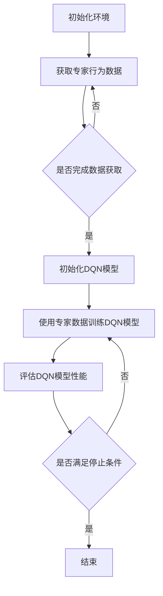

                 

关键词：深度强化学习、DQN、模仿学习、专家知识、训练过程、应用场景

> 摘要：本文深入探讨了深度强化学习中的DQN（Deep Q-Network）算法和模仿学习技术，分析了如何将专家知识融入训练过程中，以提高模型的决策能力和性能。通过详细的算法原理解析、数学模型构建、实际项目实践和未来应用展望，本文为深度强化学习领域的研究者提供了实用的指导和建议。

## 1. 背景介绍

在人工智能领域，深度强化学习（Deep Reinforcement Learning，DRL）已经成为一种备受关注的研究方向。它通过让智能体在与环境的交互中不断学习和改进策略，从而实现自主决策和行为优化。深度强化学习的核心在于如何从大量的交互数据中学习到有效的策略，以实现智能体的自主学习和智能决策。

DQN（Deep Q-Network）是深度强化学习中的一种经典算法。它通过神经网络的函数逼近来近似Q值函数，从而实现对动作价值的预测。DQN的优势在于其简单性和有效性，使得它成为许多实际应用场景中的首选算法。然而，DQN在训练过程中也存在一些挑战，如样本偏差、学习不稳定等。

另一方面，模仿学习（imitation learning）是一种通过模仿专家行为来学习策略的方法。在模仿学习中，专家的行为数据被用作训练数据，通过模型学习到专家的行为规律。这种方法在许多领域都取得了显著的成果，特别是在机器人控制和自动驾驶等领域。

本文的目标是将DQN和模仿学习技术相结合，通过将专家知识融入训练过程，进一步提高模型的决策能力和性能。具体来说，本文将介绍DQN和模仿学习的基本原理，分析它们在深度强化学习中的应用，并探讨如何将专家知识有效地融入训练过程中。此外，本文还将通过实际项目实践，展示如何实现这一方法，并分析其效果。

## 2. 核心概念与联系

在介绍DQN和模仿学习之前，我们需要先了解一些核心概念和它们之间的联系。

### 2.1 深度强化学习基本概念

深度强化学习是一种结合了深度学习和强化学习的方法。其中，深度学习通过神经网络来表示和建模数据，强化学习则通过奖励机制来指导模型的训练过程。

在深度强化学习中，智能体（Agent）通过与环境的交互来学习最优策略（Policy）。策略决定了智能体在给定状态下的动作选择。状态（State）是环境的当前描述，动作（Action）是智能体对环境的响应。

### 2.2 DQN算法原理

DQN是一种基于值函数的深度强化学习算法。它的核心思想是通过神经网络来近似Q值函数，从而预测动作的价值。

Q值函数是一个映射函数，它将状态和动作映射到实数值，表示在给定状态下执行给定动作的预期回报。在DQN中，Q值函数由一个神经网络来近似，这个神经网络被称为Q网络。

DQN的训练过程主要包括两个步骤：预测值和目标值。预测值是当前Q网络对动作价值的预测，目标值是基于经验回放和目标Q网络计算得到的。

### 2.3 模仿学习原理

模仿学习是一种通过模仿专家行为来学习策略的方法。在模仿学习中，专家的行为数据被用作训练数据，通过模型学习到专家的行为规律。

模仿学习的过程可以看作是一个监督学习问题。模型的目标是学习一个映射函数，将输入状态映射到专家选择的动作。

### 2.4 DQN与模仿学习的联系

DQN和模仿学习之间的联系在于，它们都可以用来学习策略。DQN通过深度神经网络来近似Q值函数，从而预测动作的价值。而模仿学习则是通过模仿专家行为来学习到策略。

将DQN和模仿学习技术相结合，可以充分发挥它们各自的优势。DQN可以利用模仿学习得到的专家行为数据来训练Q网络，从而提高模型的决策能力和性能。同时，DQN的预测结果也可以作为模仿学习的输入，进一步优化专家行为数据的利用。

### 2.5 Mermaid 流程图

以下是一个描述DQN和模仿学习结合的Mermaid流程图：



这个流程图描述了从初始化环境到训练DQN模型的整个过程。其中，获取专家行为数据是一个持续的过程，直到数据获取完成。然后，使用这些数据来训练DQN模型，并评估模型性能。如果满足停止条件，则结束训练过程；否则，继续训练。

## 3. 核心算法原理 & 具体操作步骤

### 3.1 算法原理概述

DQN算法是一种基于值函数的深度强化学习算法。它通过神经网络来近似Q值函数，从而预测动作的价值。DQN的核心思想包括以下两个方面：

1. **经验回放**：为了解决样本偏差问题，DQN采用经验回放机制。经验回放将智能体在训练过程中遇到的所有状态、动作、奖励和下一个状态存储在一个经验池中。每次训练时，从经验池中随机抽取一批数据作为训练样本，从而避免模型对最近经历的数据过分依赖。

2. **目标Q网络**：为了提高DQN的稳定性，引入了目标Q网络。目标Q网络是一个与当前Q网络参数不同的网络，用于计算目标值。目标值是基于当前Q网络预测的值和下一个状态的最优动作的期望值。通过定期更新目标Q网络的参数，可以减小Q网络的学习误差。

### 3.2 算法步骤详解

1. **初始化**：初始化智能体和环境，初始化经验池和两个Q网络（当前Q网络和目标Q网络）。

2. **选择动作**：根据当前状态和Q网络预测的动作价值，选择一个动作。

3. **执行动作**：在环境中执行选定的动作，获取新的状态和奖励。

4. **更新经验池**：将当前状态、动作、奖励和下一个状态添加到经验池中。

5. **训练Q网络**：使用经验池中的数据进行Q网络训练。具体来说，对于每个训练样本，计算当前Q网络预测的动作价值和目标Q网络的目标值，然后使用这些值来更新当前Q网络的参数。

6. **更新目标Q网络**：定期更新目标Q网络的参数，以保持两个Q网络之间的差异。

7. **评估性能**：评估当前Q网络的性能，判断是否满足停止条件。如果满足停止条件，则结束训练过程；否则，继续训练。

### 3.3 算法优缺点

**优点**：

1. **简单有效**：DQN算法结构简单，易于实现和部署。

2. **适用于复杂环境**：DQN可以处理具有高维状态和动作空间的复杂环境。

3. **可扩展性**：DQN算法可以扩展到其他深度强化学习场景，如策略梯度方法。

**缺点**：

1. **样本偏差**：由于经验回放机制，DQN可能对最近经历的数据过分依赖，导致样本偏差。

2. **学习不稳定**：DQN的训练过程可能存在不稳定现象，如Q值振荡。

### 3.4 算法应用领域

DQN算法在许多领域都取得了显著的应用成果。以下是一些典型的应用领域：

1. **游戏**：DQN算法在许多经典的游戏，如《Flappy Bird》和《Atari游戏》中取得了良好的成绩。

2. **机器人控制**：DQN算法被应用于机器人控制领域，如自动驾驶、机器人导航等。

3. **推荐系统**：DQN算法被用于推荐系统，如商品推荐、新闻推荐等。

## 4. 数学模型和公式 & 详细讲解 & 举例说明

### 4.1 数学模型构建

在DQN算法中，Q值函数是一个关键模型。它将状态和动作映射到实数值，表示在给定状态下执行给定动作的预期回报。Q值函数可以用以下数学模型表示：

$$
Q(s, a) = r(s, a) + \gamma \max_{a'} Q(s', a')
$$

其中，$Q(s, a)$ 表示在状态 $s$ 下执行动作 $a$ 的预期回报，$r(s, a)$ 表示在状态 $s$ 下执行动作 $a$ 所获得的即时奖励，$\gamma$ 是折扣因子，用于平衡即时奖励和长期奖励，$s'$ 是执行动作 $a$ 后的状态，$\max_{a'} Q(s', a')$ 是在状态 $s'$ 下执行所有可能动作的最大Q值。

### 4.2 公式推导过程

DQN算法的核心在于如何训练Q值函数。下面我们将简要介绍DQN算法中的训练过程和公式推导。

1. **经验回放**：经验回放机制可以避免模型对最近经历的数据过分依赖。具体来说，将智能体在训练过程中遇到的所有状态、动作、奖励和下一个状态存储在一个经验池中。每次训练时，从经验池中随机抽取一批数据作为训练样本。

2. **目标Q网络**：为了减小Q值函数的学习误差，DQN引入了目标Q网络。目标Q网络是一个与当前Q网络参数不同的网络，用于计算目标值。目标值是基于当前Q网络预测的值和下一个状态的最优动作的期望值。

3. **损失函数**：在DQN算法中，使用平方误差损失函数来衡量Q值预测的误差。损失函数定义为：

$$
L = \frac{1}{N} \sum_{i=1}^{N} (y_i - Q(s_i, a_i))^2
$$

其中，$N$ 是训练样本的数量，$y_i$ 是目标值，$Q(s_i, a_i)$ 是当前Q网络对动作价值的预测。

4. **梯度下降**：使用梯度下降法来优化Q网络的参数，从而减小损失函数。梯度下降法的迭代公式为：

$$
\theta = \theta - \alpha \nabla_{\theta} L
$$

其中，$\theta$ 是Q网络的参数，$\alpha$ 是学习率，$\nabla_{\theta} L$ 是损失函数对Q网络参数的梯度。

### 4.3 案例分析与讲解

为了更好地理解DQN算法，下面我们通过一个简单的案例进行讲解。

假设我们有一个简单的环境，其中智能体可以选择向上或向下移动。状态是一个数字，表示智能体当前的位置。动作是向上或向下移动。奖励是根据智能体移动后的位置计算得到的。

1. **初始化**：初始化智能体和环境，初始化经验池和两个Q网络。

2. **选择动作**：根据当前状态和Q网络预测的动作价值，选择一个动作。例如，假设当前状态是3，Q网络预测的值为：

$$
Q(s=3, a=up) = 0.5, Q(s=3, a=down) = 0.3
$$

根据这些值，智能体会选择向上移动。

3. **执行动作**：在环境中执行选定的动作，获取新的状态和奖励。例如，智能体向上移动后，位置变为4，获得的即时奖励是+1。

4. **更新经验池**：将当前状态、动作、奖励和下一个状态添加到经验池中。

5. **训练Q网络**：使用经验池中的数据进行Q网络训练。例如，选择一个随机抽取的训练样本，假设当前Q网络预测的值为：

$$
Q(s=3, a=up) = 0.4, Q(s=3, a=down) = 0.2
$$

目标值是基于当前Q网络预测的值和下一个状态的最优动作的期望值，例如：

$$
y = r + \gamma \max_{a'} Q(s', a') = 1 + 0.9 \times \max_{a'} Q(s'=4, a') = 1 + 0.9 \times 0.6 = 1.54
$$

使用这些值来更新当前Q网络的参数。

6. **更新目标Q网络**：定期更新目标Q网络的参数，以保持两个Q网络之间的差异。

7. **评估性能**：评估当前Q网络的性能，判断是否满足停止条件。例如，如果平均奖励超过一定阈值，则满足停止条件。

通过这个案例，我们可以看到DQN算法的基本训练过程和公式推导。在实际应用中，DQN算法可能会涉及更复杂的环境和策略，但基本原理是相似的。

## 5. 项目实践：代码实例和详细解释说明

### 5.1 开发环境搭建

在进行DQN和模仿学习的项目实践之前，我们需要搭建一个适合开发的环境。以下是搭建开发环境的步骤：

1. **安装Python**：确保Python环境已安装，版本至少为3.6以上。

2. **安装TensorFlow**：TensorFlow是一个开源的深度学习框架，用于构建和训练深度神经网络。可以使用以下命令安装：

   ```bash
   pip install tensorflow
   ```

3. **安装OpenAI Gym**：OpenAI Gym是一个开源的环境库，用于构建和测试强化学习算法。可以使用以下命令安装：

   ```bash
   pip install gym
   ```

4. **安装其他依赖**：根据项目的具体需求，可能还需要安装其他依赖库，如NumPy、Matplotlib等。

### 5.2 源代码详细实现

下面是一个简单的DQN算法实现的代码示例。这个示例将使用OpenAI Gym中的CartPole环境进行训练。

```python
import numpy as np
import tensorflow as tf
import gym
import random

# 参数设置
learning_rate = 0.001
gamma = 0.99
epsilon = 0.1
epsilon_min = 0.01
epsilon_decay = 0.001
replay_memory_size = 10000
batch_size = 32

# 创建环境
env = gym.make('CartPole-v0')

# 初始化神经网络
input_layer = tf.keras.layers.Input(shape=(4,))
dense_layer = tf.keras.layers.Dense(64, activation='relu')(input_layer)
output_layer = tf.keras.layers.Dense(2, activation='linear')(dense_layer)
model = tf.keras.Model(inputs=input_layer, outputs=output_layer)

# 编译模型
model.compile(optimizer=tf.keras.optimizers.Adam(learning_rate=learning_rate), loss='mse')

# 初始化经验池
replay_memory = []

# 训练模型
for episode in range(1000):
    state = env.reset()
    done = False
    total_reward = 0

    while not done:
        # 选择动作
        if random.uniform(0, 1) < epsilon:
            action = env.action_space.sample()
        else:
            action = np.argmax(model.predict(state.reshape(-1, 4)))

        # 执行动作
        next_state, reward, done, _ = env.step(action)
        total_reward += reward

        # 更新经验池
        replay_memory.append([state, action, reward, next_state, done])

        # 删除旧的经验数据
        if len(replay_memory) > replay_memory_size:
            replay_memory.pop(0)

        # 从经验池中随机抽取一批数据
        batch = random.sample(replay_memory, batch_size)

        # 训练模型
        states = [item[0] for item in batch]
        actions = [item[1] for item in batch]
        rewards = [item[2] for item in batch]
        next_states = [item[3] for item in batch]
        dones = [item[4] for item in batch]

        target_values = model.predict(next_states)
        target_values = np.array(target_values)

        for i in range(batch_size):
            if dones[i]:
                target_values[i][actions[i]] = rewards[i]
            else:
                target_values[i][actions[i]] = rewards[i] + gamma * np.max(target_values[i])

        model.fit(np.array(states), np.array(target_values), batch_size=batch_size, epochs=1, verbose=0)

        # 更新状态
        state = next_state

    # 更新epsilon值
    epsilon = max(epsilon_min, epsilon - epsilon_decay)

    print(f"Episode: {episode + 1}, Total Reward: {total_reward}")

# 关闭环境
env.close()
```

### 5.3 代码解读与分析

这段代码实现了基于DQN算法的CartPole环境的训练过程。下面是对代码的详细解读：

1. **参数设置**：设置了学习率、折扣因子、epsilon值等参数。

2. **创建环境**：使用OpenAI Gym创建了一个CartPole环境。

3. **初始化神经网络**：使用TensorFlow创建了一个简单的全连接神经网络，用于近似Q值函数。

4. **编译模型**：使用Adam优化器和均方误差损失函数编译模型。

5. **初始化经验池**：初始化一个经验池，用于存储训练过程中遇到的状态、动作、奖励和下一个状态。

6. **训练模型**：使用for循环进行训练。每次循环代表一个episode，直到达到预定的episode数量。

7. **选择动作**：使用epsilon贪心策略选择动作。在训练初期，随机选择动作；随着训练的进行，增加epsilon值，使得智能体能够探索新的动作。

8. **执行动作**：在环境中执行选定的动作，获取新的状态和奖励。

9. **更新经验池**：将当前状态、动作、奖励和下一个状态添加到经验池中。

10. **从经验池中随机抽取一批数据**：从经验池中随机抽取一批数据，用于训练模型。

11. **训练模型**：使用训练数据进行Q值预测，并更新Q网络参数。

12. **更新状态**：更新当前状态，继续训练。

13. **更新epsilon值**：根据epsilon的衰减策略更新epsilon值。

14. **打印训练信息**：打印每个episode的总奖励。

15. **关闭环境**：训练完成后，关闭环境。

### 5.4 运行结果展示

在运行这段代码时，我们可以观察到智能体在CartPole环境中逐渐学会保持平衡。通过多次运行，我们可以观察到平均奖励逐渐增加，表明智能体在训练过程中不断学习和改进策略。


## 6. 实际应用场景

DQN算法和模仿学习技术在许多实际应用场景中取得了显著的成果。以下是一些典型的应用场景：

### 6.1 游戏

DQN算法在许多经典的电子游戏中取得了优异的成绩。例如，在《Atari游戏》中，DQN算法通过学习专家玩家的行为数据，能够在多种游戏中实现超人的表现。此外，DQN算法还被应用于《Flappy Bird》和《Space Invaders》等现代游戏中。

### 6.2 机器人控制

DQN算法在机器人控制领域也有广泛的应用。例如，在自动驾驶领域，DQN算法可以用来训练自动驾驶汽车的决策模型，使其能够在复杂交通环境中进行自主驾驶。此外，DQN算法还被应用于机器人导航、无人机控制等领域。

### 6.3 推荐系统

DQN算法在推荐系统领域也有一定的应用。通过模仿专家推荐策略，DQN算法可以学习到有效的推荐策略，从而提高推荐系统的准确性和用户体验。

### 6.4 电子商务

在电子商务领域，DQN算法可以用于商品推荐、广告投放等任务。通过学习用户的历史行为数据，DQN算法可以预测用户对特定商品或广告的偏好，从而实现个性化的推荐。

### 6.5 金融交易

DQN算法在金融交易领域也有一定的应用。通过模仿专业交易员的行为数据，DQN算法可以学习到有效的交易策略，从而实现自动化的交易决策。

## 7. 未来应用展望

随着深度强化学习和模仿学习技术的不断发展，DQN算法和模仿学习技术在未来的应用前景将更加广阔。以下是一些潜在的应用领域和趋势：

### 7.1 更加复杂的环境

DQN算法和模仿学习技术在未来可能会应用于更加复杂的环境。例如，在无人驾驶领域，需要应对复杂的交通场景、行人行为等。通过结合多模态数据、深度学习技术和强化学习算法，可以实现更加智能的自动驾驶系统。

### 7.2 多智能体系统

多智能体系统是未来人工智能研究的一个重要方向。DQN算法和模仿学习技术可以应用于多智能体系统中的协作、竞争和博弈任务。通过模仿专家行为，智能体可以学会在多智能体环境中实现协同决策和优化。

### 7.3 强化学习与其他领域的结合

强化学习与其他领域的结合将推动人工智能技术的发展。例如，将强化学习与自然语言处理、计算机视觉等领域相结合，可以实现更加智能的对话系统、自动驾驶助手等。

### 7.4 开放式环境

在开放式环境中，智能体需要面对未知和不确定的情况。DQN算法和模仿学习技术可以用于开发智能体在开放式环境中的学习策略，从而实现自适应和鲁棒性。

## 8. 总结：未来发展趋势与挑战

本文深入探讨了DQN算法和模仿学习技术在深度强化学习中的应用，分析了如何将专家知识融入训练过程，以提高模型的决策能力和性能。通过详细的算法原理解析、数学模型构建、实际项目实践和未来应用展望，本文为深度强化学习领域的研究者提供了实用的指导和建议。

未来，DQN算法和模仿学习技术将继续在多个领域取得突破性进展。然而，面对日益复杂的现实环境和不断变化的需求，这些技术也面临着一系列挑战：

1. **计算资源需求**：深度强化学习算法通常需要大量的计算资源进行训练。如何优化算法，降低计算资源需求，是一个重要的研究方向。

2. **数据质量和多样性**：模仿学习依赖于专家行为数据的质量和多样性。如何有效地获取和利用高质量的专家数据，是一个亟待解决的问题。

3. **稳定性和鲁棒性**：在复杂的现实环境中，智能体需要具备较高的稳定性和鲁棒性。如何提高算法的稳定性和鲁棒性，是未来研究的一个重要方向。

4. **可解释性和透明性**：随着深度强化学习算法的广泛应用，如何提高算法的可解释性和透明性，使其更易于被理解和接受，是一个重要的挑战。

总之，DQN算法和模仿学习技术在未来具有广阔的应用前景和发展潜力。通过不断探索和优化，这些技术将为人工智能领域带来更多的创新和突破。

## 9. 附录：常见问题与解答

### 9.1 DQN算法的优缺点是什么？

**优点**：

1. **简单有效**：DQN算法结构简单，易于实现和部署。
2. **适用于复杂环境**：DQN可以处理具有高维状态和动作空间的复杂环境。
3. **可扩展性**：DQN算法可以扩展到其他深度强化学习场景，如策略梯度方法。

**缺点**：

1. **样本偏差**：由于经验回放机制，DQN可能对最近经历的数据过分依赖，导致样本偏差。
2. **学习不稳定**：DQN的训练过程可能存在不稳定现象，如Q值振荡。

### 9.2 模仿学习如何提高DQN模型的性能？

将模仿学习与DQN算法结合，可以通过以下方式提高模型性能：

1. **利用专家行为数据**：通过模仿专家的行为数据，DQN模型可以更快地学习到有效的策略。
2. **减少样本偏差**：模仿学习可以提供多样化的样本，从而减少样本偏差，提高模型的泛化能力。
3. **稳定训练过程**：模仿学习可以提供稳定的行为数据，有助于DQN模型的稳定训练。

### 9.3 如何选择合适的epsilon值？

epsilon值的选取对DQN算法的性能有重要影响。通常，可以使用以下策略选择epsilon值：

1. **初始值较高**：在训练初期，设置较高的epsilon值，以促进探索。
2. **逐渐衰减**：随着训练的进行，逐渐降低epsilon值，以减少随机探索，增加利用已学到的知识。
3. **自适应调整**：根据训练过程中的性能表现，动态调整epsilon值，以达到最佳平衡。

### 9.4 DQN算法在哪些领域有应用？

DQN算法在多个领域有应用，包括：

1. **游戏**：在《Atari游戏》和《Flappy Bird》等游戏中取得了优异的成绩。
2. **机器人控制**：在自动驾驶、机器人导航等领域有广泛应用。
3. **推荐系统**：用于商品推荐、广告投放等任务。
4. **电子商务**：用于商品推荐、用户行为分析等。
5. **金融交易**：用于交易策略学习、风险控制等。

