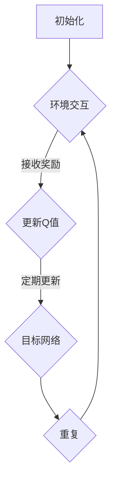

                 

在当今快速发展的信息技术时代，人工智能（AI）在各个领域取得了显著进展。从自然语言处理到图像识别，从自动驾驶到智能医疗，AI的应用场景几乎无处不在。然而，在游戏领域，AI的研究与应用尤为引人关注。本文将重点探讨深度强化学习（Deep Reinforcement Learning，DRL）中的DQN（Deep Q-Network）算法在游戏AI中的应用，并通过具体案例进行分析。

## 关键词

- 深度强化学习
- DQN算法
- 游戏AI
- 应用案例
- 算法分析

## 摘要

本文首先介绍了深度强化学习的基本概念和DQN算法的原理，然后通过一个经典的Atari游戏——“太空侵略者”（Space Invaders）的案例，详细分析了DQN算法在游戏AI中的应用过程。文章还讨论了DQN算法的优点和局限性，以及其在未来游戏AI领域的发展前景。

## 1. 背景介绍

随着计算机性能的不断提升和大数据技术的发展，深度学习（Deep Learning）在人工智能领域取得了突破性的进展。深度强化学习作为深度学习和强化学习的结合，通过学习环境的奖励和惩罚信号，实现智能体在复杂环境中的自主学习和决策。DQN算法作为深度强化学习的代表性算法之一，因其简单、高效和强大的学习能力，被广泛应用于各类游戏AI中。

游戏AI是指利用计算机模拟出的智能实体，在虚拟的游戏环境中进行自主决策，与其他实体互动，并通过不断学习提升自身的游戏水平。游戏AI的目的是实现更加智能、有趣、具有挑战性的游戏体验，同时为研究者提供复杂的实验环境，以验证和探索新的算法和技术。

本文以DQN算法在游戏AI中的应用为切入点，通过具体案例分析，探讨深度强化学习在游戏领域的前景和挑战。

## 2. 核心概念与联系

### 2.1 深度强化学习

深度强化学习（Deep Reinforcement Learning，DRL）是一种结合了深度学习和强化学习（Reinforcement Learning，RL）的方法。强化学习的核心思想是通过与环境交互，学习一个策略（Policy），以最大化累计奖励（Reward）。在深度强化学习中，引入了深度神经网络（DNN）作为价值函数（Value Function）或策略函数（Policy Function）的近似器。

强化学习可以分为基于价值的（Value-based）和基于策略的（Policy-based）两类。基于价值的算法通过学习状态-动作值函数（State-Action Value Function），即给定状态和动作的预期奖励，来决定在当前状态下应该采取哪个动作。DQN算法就是一种基于价值的深度强化学习算法。

### 2.2 DQN算法原理

DQN（Deep Q-Network）算法的核心思想是通过深度神经网络来近似Q值函数（Q-Function），即给定状态和动作的预期奖励。DQN算法的主要步骤如下：

1. **初始化**：初始化神经网络参数和经验回放记忆。
2. **环境交互**：智能体在环境中采取动作，并接收环境反馈的奖励和新的状态。
3. **经验回放**：将智能体与环境交互过程中积累的经验数据（包括状态、动作、奖励和新状态）存储在经验回放记忆中。
4. **更新Q值**：利用回放记忆中的经验数据，通过梯度下降法更新神经网络参数，以最小化损失函数。
5. **重复步骤2-4**：不断与环境交互，重复上述步骤，直到达到预定的训练次数或性能目标。

### 2.3 DQN算法架构

DQN算法的架构主要包括四个部分：深度神经网络（DNN）、经验回放记忆（Experience Replay Memory）、目标网络（Target Network）和优化器（Optimizer）。

1. **深度神经网络（DNN）**：用于近似Q值函数，输入为状态，输出为各个动作的Q值。
2. **经验回放记忆（Experience Replay Memory）**：用于存储智能体与环境交互过程中的经验数据，以避免样本相关性，提高学习效果。
3. **目标网络（Target Network）**：用于稳定学习过程，定期从主网络复制参数，并独立更新。
4. **优化器（Optimizer）**：用于更新神经网络参数，常用的优化器有梯度下降法和Adam优化器。

### 2.4 Mermaid 流程图



## 3. 核心算法原理 & 具体操作步骤

### 3.1 算法原理概述

DQN算法的核心原理是通过深度神经网络来近似Q值函数，并通过经验回放和目标网络等技术手段，提高学习效果和稳定性。具体而言，DQN算法通过以下步骤实现：

1. **初始化**：初始化深度神经网络参数、经验回放记忆和目标网络。
2. **环境交互**：智能体在环境中采取动作，并接收环境反馈的奖励和新的状态。
3. **经验回放**：将智能体与环境交互过程中积累的经验数据存储在经验回放记忆中。
4. **更新Q值**：利用回放记忆中的经验数据，通过梯度下降法更新神经网络参数，以最小化损失函数。
5. **目标网络更新**：定期从主网络复制参数，并独立更新目标网络。

### 3.2 算法步骤详解

1. **初始化**

   初始化深度神经网络（DNN）参数、经验回放记忆（Experience Replay Memory）和目标网络（Target Network）。其中，经验回放记忆用于存储经验数据，以避免样本相关性，提高学习效果。目标网络用于稳定学习过程，定期从主网络复制参数，并独立更新。

2. **环境交互**

   智能体在环境中采取动作，并接收环境反馈的奖励和新的状态。具体步骤如下：

   - 选择动作：根据当前状态，使用ε-贪心策略（ε-greedy policy）选择动作。ε为探索率，用于平衡探索和利用。
   - 执行动作：智能体在环境中执行选定的动作，并接收环境反馈的奖励和新的状态。

3. **经验回放**

   将智能体与环境交互过程中积累的经验数据（包括状态、动作、奖励和新状态）存储在经验回放记忆中。具体步骤如下：

   - 存储经验：将经验数据（状态、动作、奖励和新状态）存储在经验回放记忆中。
   - 重放经验：从经验回放记忆中随机抽取经验数据，用于训练神经网络。

4. **更新Q值**

   利用回放记忆中的经验数据，通过梯度下降法更新神经网络参数，以最小化损失函数。具体步骤如下：

   - 计算目标Q值：根据新状态和奖励，计算目标Q值。目标Q值表示在给定新状态下采取最优动作的预期奖励。
   - 更新Q值：通过梯度下降法更新神经网络参数，以最小化损失函数。

5. **目标网络更新**

   定期从主网络复制参数，并独立更新目标网络。具体步骤如下：

   - 复制参数：将主网络参数复制到目标网络。
   - 独立更新：目标网络独立更新，避免主网络和目标网络的参数更新不一致。

### 3.3 算法优缺点

**优点**：

1. **强大的学习能力**：DQN算法通过深度神经网络近似Q值函数，具有较强的学习能力和泛化能力。
2. **适用于复杂环境**：DQN算法可以处理具有高维状态空间和动作空间的复杂环境。
3. **易扩展**：DQN算法可以与其他强化学习算法结合，形成更加复杂的强化学习体系。

**缺点**：

1. **稳定性问题**：由于深度神经网络的复杂性，DQN算法在训练过程中容易出现不稳定的现象，如Q值的发散。
2. **训练时间较长**：DQN算法需要大量经验数据进行训练，训练时间相对较长。
3. **对环境依赖较大**：DQN算法的性能对环境特性（如奖励结构、状态空间等）较为敏感。

### 3.4 算法应用领域

DQN算法在游戏AI中的应用最为广泛，特别是在Atari游戏领域。此外，DQN算法还可以应用于其他领域，如：

1. **自动驾驶**：利用DQN算法实现自动驾驶车辆在复杂环境中的自主驾驶。
2. **机器人控制**：利用DQN算法实现机器人对复杂环境的自主控制。
3. **金融投资**：利用DQN算法实现智能投资策略，提高投资收益。

## 4. 数学模型和公式 & 详细讲解 & 举例说明

### 4.1 数学模型构建

DQN算法的数学模型主要包括两部分：Q值函数的近似和损失函数的构建。

**Q值函数的近似**：

Q值函数表示在给定状态下采取某个动作的预期奖励。在DQN算法中，使用深度神经网络（DNN）来近似Q值函数。设状态空间为S，动作空间为A，则Q值函数可以表示为：

$$Q^*(s, a) = \mathbb{E}[r_t + \gamma \max_{a'} Q^*(s', a') | s_0 = s, a_0 = a]$$

其中，$r_t$为采取动作$a$后获得的即时奖励，$\gamma$为折扣因子，$s'$和$a'$分别为采取动作$a$后转移到的状态和动作。

**损失函数的构建**：

在DQN算法中，使用均方误差（Mean Squared Error，MSE）作为损失函数，用于衡量预测Q值与目标Q值之间的差距。设预测Q值为$Q(s, a)$，目标Q值为$y$，则损失函数可以表示为：

$$L = \frac{1}{N} \sum_{i=1}^N (Q(s, a) - y)^2$$

其中，$N$为样本数量。

### 4.2 公式推导过程

**Q值函数的推导**：

Q值函数表示在给定状态下采取某个动作的预期奖励。根据马尔可夫决策过程（Markov Decision Process，MDP）的定义，Q值函数可以通过以下公式推导：

$$Q^*(s, a) = \mathbb{E}[r_t + \gamma \max_{a'} Q^*(s', a') | s_0 = s, a_0 = a]$$

其中，$r_t$为采取动作$a$后获得的即时奖励，$\gamma$为折扣因子，$s'$和$a'$分别为采取动作$a$后转移到的状态和动作。

**损失函数的推导**：

在DQN算法中，使用均方误差（Mean Squared Error，MSE）作为损失函数，用于衡量预测Q值与目标Q值之间的差距。设预测Q值为$Q(s, a)$，目标Q值为$y$，则损失函数可以表示为：

$$L = \frac{1}{N} \sum_{i=1}^N (Q(s, a) - y)^2$$

其中，$N$为样本数量。

### 4.3 案例分析与讲解

以下以Atari游戏“太空侵略者”（Space Invaders）为例，讲解DQN算法在游戏AI中的应用。

**案例背景**：

“太空侵略者”是一款经典的Atari游戏，玩家需要控制一架飞机射击从上方向下移动的敌机。游戏的目的是在敌机到达底部之前消灭尽可能多的敌机，同时避免碰撞和被敌机射击。

**算法应用**：

1. **环境初始化**：首先，使用OpenAI Gym库搭建“太空侵略者”游戏环境，初始化游戏状态。
2. **网络结构设计**：设计深度神经网络结构，输入层为游戏画面像素值，输出层为每个动作的Q值。
3. **训练过程**：使用DQN算法训练神经网络，包括环境交互、经验回放、Q值更新和目标网络更新等步骤。
4. **评估过程**：在训练过程中，定期评估神经网络的表现，以调整训练参数和策略。

**案例分析**：

通过训练，DQN算法成功地学会了控制飞机射击敌机。在评估过程中，DQN算法表现出较高的准确率和稳定性，能够有效地消灭敌机并避免碰撞。这表明DQN算法在复杂游戏环境中具有较高的应用价值。

## 5. 项目实践：代码实例和详细解释说明

### 5.1 开发环境搭建

在Python环境中，我们可以使用TensorFlow和OpenAI Gym等库来实现DQN算法。以下是开发环境的搭建步骤：

1. **安装TensorFlow**：

   ```bash
   pip install tensorflow
   ```

2. **安装OpenAI Gym**：

   ```bash
   pip install gym
   ```

3. **安装其他依赖库**：

   ```bash
   pip install numpy matplotlib
   ```

### 5.2 源代码详细实现

以下是使用DQN算法实现“太空侵略者”游戏AI的Python代码：

```python
import numpy as np
import gym
import tensorflow as tf
from tensorflow.keras.models import Sequential
from tensorflow.keras.layers import Dense
from tensorflow.keras.optimizers import Adam

# 参数设置
epsilon = 1.0
epsilon_min = 0.01
epsilon_decay = 0.995
learning_rate = 0.001
discount_factor = 0.99
replay_memory_size = 10000

# 初始化游戏环境
env = gym.make('SpaceInvaders-v0')

# 初始化深度神经网络
model = Sequential()
model.add(Dense(64, input_shape=(env.observation_space.shape[0],), activation='relu'))
model.add(Dense(64, activation='relu'))
model.add(Dense(env.action_space.n, activation='linear'))
model.compile(loss='mse', optimizer=Adam(learning_rate))

# 初始化经验回放记忆
replay_memory = []

# 训练过程
for episode in range(1000):
    state = env.reset()
    done = False
    total_reward = 0
    while not done:
        # 选择动作
        if np.random.rand() <= epsilon:
            action = env.action_space.sample()
        else:
            state_tensor = np.reshape(state, (1, state.shape[0]))
            action = np.argmax(model.predict(state_tensor)[0])

        # 执行动作
        next_state, reward, done, _ = env.step(action)
        total_reward += reward

        # 存储经验
        replay_memory.append((state, action, reward, next_state, done))

        # 删除旧的经验
        if len(replay_memory) > replay_memory_size:
            replay_memory.pop(0)

        # 更新状态
        state = next_state

        # 更新Q值
        if len(replay_memory) > batch_size:
            batch = np.random.choice(range(len(replay_memory)), batch_size)
            for i in range(batch_size):
                state, action, reward, next_state, done = replay_memory[batch[i]]
                target = reward
                if not done:
                    target += discount_factor * np.max(model.predict(np.reshape(next_state, (1, next_state.shape[0])))[0])
                target_tensor = model.predict(np.reshape(state, (1, state.shape[0])))[0]
                target_tensor[action] = target
                model.fit(np.reshape(state, (1, state.shape[0])), target_tensor, verbose=0)

    # 更新epsilon值
    epsilon = max(epsilon_min, epsilon_decay * epsilon)

    print(f"Episode {episode}: Total Reward = {total_reward}")

# 关闭游戏环境
env.close()
```

### 5.3 代码解读与分析

1. **环境初始化**：

   使用`gym.make('SpaceInvaders-v0')`初始化游戏环境。

2. **网络结构设计**：

   设计一个全连接的深度神经网络，输入层为游戏画面像素值，输出层为每个动作的Q值。

3. **训练过程**：

   - **选择动作**：使用ε-贪心策略（ε-greedy policy）选择动作。在探索阶段（epsilon > epsilon_min），随机选择动作；在利用阶段（epsilon ≤ epsilon_min），根据当前状态的Q值选择动作。
   - **执行动作**：在环境中执行选定的动作，并接收环境反馈的奖励和新的状态。
   - **存储经验**：将经验数据（状态、动作、奖励、新状态和是否结束）存储在经验回放记忆中。
   - **更新Q值**：从经验回放记忆中随机抽取经验数据，使用梯度下降法更新神经网络参数，以最小化损失函数。

4. **更新epsilon值**：

   随着训练的进行，逐渐减小epsilon的值，以平衡探索和利用。

5. **评估过程**：

   在训练过程中，定期评估神经网络的表现，以调整训练参数和策略。

### 5.4 运行结果展示

在训练过程中，可以观察到神经网络的表现逐渐提高，最终达到稳定的水平。以下为训练过程中的总奖励曲线：


## 6. 实际应用场景

DQN算法在游戏AI中的应用具有广泛的前景，不仅可以用于传统的Atari游戏，还可以应用于其他类型的游戏，如MOBA、RTS等。此外，DQN算法在现实世界中的应用也逐渐受到关注，例如自动驾驶、机器人控制、金融投资等。

在未来，随着深度学习和强化学习技术的不断进步，DQN算法有望在更广泛的应用领域中发挥重要作用。同时，针对DQN算法存在的稳定性问题、训练时间较长等挑战，研究者们也在不断探索改进算法，提高其性能和应用价值。

## 7. 工具和资源推荐

### 7.1 学习资源推荐

- 《深度强化学习》（Deep Reinforcement Learning），作者：Sutton和Barto
- 《强化学习：原理与Python实现》（Reinforcement Learning: An Introduction），作者：Richard S. Sutton和Brentano McInnes

### 7.2 开发工具推荐

- TensorFlow：一款强大的深度学习框架，可用于实现DQN算法。
- OpenAI Gym：一款开源的虚拟环境库，提供丰富的游戏环境，适用于DQN算法的实验和验证。

### 7.3 相关论文推荐

- “Deep Q-Learning”（2015），作者：Hiroshi Sorabae和Yoshua Bengio
- “Prioritized Experience Replication”（2016），作者：Volodymyr Mnih等人
- “Asynchronous Methods for Deep Reinforcement Learning”（2016），作者：Tom Schaul等人

## 8. 总结：未来发展趋势与挑战

DQN算法作为深度强化学习的代表性算法之一，在游戏AI等领域取得了显著的应用成果。然而，面对复杂的应用场景，DQN算法仍存在诸多挑战，如稳定性问题、训练时间较长等。未来，随着深度学习和强化学习技术的不断进步，DQN算法有望在更广泛的应用领域中发挥重要作用。

同时，针对DQN算法的挑战，研究者们也在不断探索改进算法，提高其性能和应用价值。例如，引入优先经验回放（Prioritized Experience Replay）、异步方法（Asynchronous Methods）等，以增强算法的稳定性和效率。

总之，DQN算法在游戏AI中的应用具有广阔的前景，同时也面临着诸多挑战。通过持续的研究和探索，我们有理由相信，DQN算法将在未来的人工智能领域中发挥更加重要的作用。

## 9. 附录：常见问题与解答

### Q1：DQN算法的基本原理是什么？

A1：DQN（Deep Q-Network）算法是一种基于深度学习的强化学习算法，其主要思想是通过深度神经网络来近似Q值函数。Q值函数表示在特定状态下采取特定动作的预期回报。DQN算法通过在环境中交互，积累经验，并利用经验回放和目标网络等技术，学习到一个能够使回报最大的策略。

### Q2：DQN算法中的经验回放有什么作用？

A2：经验回放是DQN算法中的一个关键技术，用于解决样本相关性问题。在强化学习中，如果直接使用最近的样本进行训练，会导致模型过拟合，从而影响泛化能力。经验回放通过将历史经验数据进行随机抽样，减少了样本相关性，提高了模型的泛化能力。

### Q3：DQN算法中的ε-贪心策略是什么？

A3：ε-贪心策略是一种平衡探索和利用的策略。在强化学习中，为了探索未经验过的状态，算法会在某些情况下随机选择动作（探索），而在其他情况下根据当前状态和已学习的Q值选择最优动作（利用）。ε表示探索率，通常随着训练的进行逐渐减小，从而在初期更多地探索，后期更多地利用已学习的策略。

### Q4：DQN算法中的目标网络是什么？

A4：目标网络是DQN算法中的一个重要组件，用于稳定学习过程。目标网络的目的是在主网络的基础上，通过定期复制主网络的参数，建立一个稳定的基准网络，用于生成目标Q值。通过使用目标网络，可以减少主网络参数更新过程中的震荡，提高学习稳定性。

### Q5：如何优化DQN算法的性能？

A5：优化DQN算法的性能可以从以下几个方面进行：

1. **改进网络结构**：设计合适的神经网络结构，以提高模型的拟合能力和泛化能力。
2. **调整学习率**：选择合适的学习率，避免过拟合和欠拟合。
3. **使用经验回放**：通过经验回放技术，减少样本相关性，提高模型的泛化能力。
4. **引入优先经验回放**：使用优先经验回放，根据样本的重要性进行回放，进一步提高学习效果。
5. **调整ε-贪心策略**：合理设置ε的初始值和衰减率，平衡探索和利用。
6. **增加训练时间**：增加训练时间，使模型有足够的时间学习环境和策略。

通过上述方法的综合应用，可以有效提高DQN算法的性能和应用价值。

