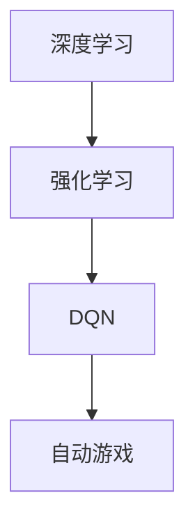

                 

关键词：深度学习，自动游戏，DQN，强化学习，应用场景，解决方案

摘要：本文探讨了深度确定性策略梯度（DQN）算法在自动游戏领域的应用，分析了其面临的挑战和相应的解决方案。通过对DQN算法的基本原理、数学模型、算法步骤以及实际应用案例的详细讲解，展示了DQN在自动游戏中的潜力和优势。同时，对未来的发展趋势和面临的挑战进行了展望，为相关研究和应用提供了有益的参考。

## 1. 背景介绍

随着计算机技术的发展和人工智能的兴起，自动游戏成为了一个备受关注的研究领域。自动游戏不仅具有娱乐性和挑战性，还具有重要的学术价值。通过对自动游戏的深入研究，可以推动人工智能技术，特别是在深度学习和强化学习领域的进步。近年来，深度确定性策略梯度（DQN）算法在自动游戏中的应用逐渐引起了学术界的关注。DQN是一种基于深度学习的强化学习算法，通过学习值函数来优化策略，从而实现自动游戏的智能控制。

## 2. 核心概念与联系

为了更好地理解DQN在自动游戏中的应用，我们需要首先了解相关核心概念和它们的联系。以下是一个简单的Mermaid流程图，展示了这些概念及其相互关系。



### 2.1 深度学习

深度学习是一种基于多层神经网络的学习方法，通过多层非线性变换来提取数据特征。在深度学习中，神经网络通过大量数据训练，从而能够对未知数据进行分类、预测或生成。

### 2.2 强化学习

强化学习是一种通过不断与环境交互来学习策略的人工智能方法。在强化学习中，智能体（agent）通过选择动作，根据环境的反馈（奖励或惩罚）来调整自己的策略，从而实现目标。

### 2.3 DQN

DQN（深度确定性策略梯度）是一种基于深度学习的强化学习算法，通过学习值函数（state-value function）来估计状态的最优动作。DQN利用深度神经网络来近似值函数，并通过经验回放（experience replay）和目标网络（target network）等技术来提高学习效率和稳定性。

### 2.4 自动游戏

自动游戏是一种由计算机程序控制的电子游戏，通过模拟人类玩家的行为来实现游戏的目标。自动游戏在游戏开发、游戏评测、游戏娱乐等方面具有广泛的应用前景。

## 3. 核心算法原理 & 具体操作步骤

### 3.1 算法原理概述

DQN算法的核心思想是利用深度神经网络来近似状态值函数（Q值），并通过最大化期望回报来优化策略。DQN算法的基本原理如下：

1. 初始化网络参数和经验回放内存。
2. 从初始状态开始，选择动作。
3. 执行动作，观察状态转移和奖励。
4. 将经历存储到经验回放内存中。
5. 当达到一定的经验数量时，从经验回放内存中随机抽取样本。
6. 通过梯度下降法更新深度神经网络参数。
7. 重复步骤2-6，直到达到终止条件。

### 3.2 算法步骤详解

以下是DQN算法的具体操作步骤：

1. **初始化网络参数和经验回放内存**：

   初始化深度神经网络参数，包括输入层、隐藏层和输出层。同时，初始化经验回放内存，用于存储过去的经验。

2. **从初始状态开始，选择动作**：

   根据当前状态，利用深度神经网络预测Q值，并选择具有最大Q值的动作。

3. **执行动作，观察状态转移和奖励**：

   执行选择的动作，观察环境的反馈，包括新的状态和奖励。

4. **将经历存储到经验回放内存中**：

   将当前状态、动作、奖励和新状态存储到经验回放内存中。

5. **当达到一定的经验数量时，从经验回放内存中随机抽取样本**：

   当经验回放内存达到一定容量时，从经验回放内存中随机抽取一批样本。

6. **通过梯度下降法更新深度神经网络参数**：

   利用抽取的样本，计算梯度，并通过梯度下降法更新深度神经网络参数。

7. **重复步骤2-6，直到达到终止条件**：

   重复执行步骤2-6，直到达到终止条件，如达到游戏终点或达到预定的迭代次数。

### 3.3 算法优缺点

DQN算法具有以下优点：

- **强大的泛化能力**：通过深度神经网络的学习，DQN能够处理复杂的状态空间和动作空间，具有强大的泛化能力。
- **自适应能力**：DQN能够根据环境的反馈动态调整策略，具有较强的自适应能力。

然而，DQN算法也存在一些缺点：

- **训练时间较长**：由于需要大量经验数据来训练深度神经网络，DQN算法的训练时间相对较长。
- **不稳定**：在训练过程中，DQN算法可能受到噪声和波动的影响，导致训练不稳定。

### 3.4 算法应用领域

DQN算法在自动游戏领域具有广泛的应用前景，如：

- **电子游戏**：利用DQN算法，可以开发出具有智能控制的电子游戏，如《星际争霸》、《DOTA2》等。
- **棋类游戏**：DQN算法可以应用于棋类游戏，如围棋、国际象棋等，实现智能化的棋局分析。
- **其他领域**：DQN算法还可以应用于自动驾驶、机器人控制、金融预测等领域，具有广泛的应用价值。

## 4. 数学模型和公式 & 详细讲解 & 举例说明

### 4.1 数学模型构建

DQN算法的核心是深度神经网络，用于近似状态值函数。状态值函数的数学模型可以表示为：

$$
Q(s, a) = \sum_{i=1}^{n} w_i \cdot f(s_i, a_i)
$$

其中，$Q(s, a)$ 表示在状态s下执行动作a的期望回报，$w_i$ 表示深度神经网络的权重，$f(s_i, a_i)$ 表示神经网络的输出。

### 4.2 公式推导过程

DQN算法的目标是最小化预测误差，即：

$$
\min_{\theta} \quad \frac{1}{N} \sum_{i=1}^{N} (Q(s_i, a_i) - y_i)^2
$$

其中，$N$ 表示样本数量，$y_i$ 表示实际回报。

为了求解上述优化问题，我们可以使用梯度下降法。梯度下降法的迭代过程可以表示为：

$$
\theta \leftarrow \theta - \alpha \cdot \nabla_{\theta} J(\theta)
$$

其中，$\alpha$ 表示学习率，$\nabla_{\theta} J(\theta)$ 表示损失函数关于参数$\theta$的梯度。

### 4.3 案例分析与讲解

假设我们有一个简单的游戏场景，游戏的目标是控制一个角色从一个位置移动到另一个位置。游戏的状态由当前角色的位置和目标位置组成，动作是向上下左右四个方向移动。

在这个场景中，我们可以定义状态空间为 $S = \{ (x, y) | x, y \in \{0, 1, 2, 3\} \}$，动作空间为 $A = \{ up, down, left, right \}$。

我们可以使用一个简单的深度神经网络来近似状态值函数。神经网络的输入层有2个神经元，分别表示当前角色的位置和目标位置。隐藏层有2个神经元，输出层有4个神经元，分别表示4个方向的动作。

假设我们已经收集了大量的样本数据，可以使用这些数据来训练深度神经网络。

训练过程如下：

1. 初始化深度神经网络参数。
2. 随机选择一个样本 $(s, a, r, s')$。
3. 计算当前状态下的预测Q值。
4. 根据预测Q值和实际回报计算损失。
5. 使用梯度下降法更新深度神经网络参数。
6. 重复步骤2-5，直到达到预定的迭代次数或损失函数收敛。

通过上述训练过程，我们可以得到一个近似状态值函数的深度神经网络，从而实现自动游戏的智能控制。

## 5. 项目实践：代码实例和详细解释说明

### 5.1 开发环境搭建

在本项目中，我们将使用Python作为编程语言，结合TensorFlow框架来构建和训练DQN算法。以下是在Ubuntu 18.04操作系统上搭建开发环境的步骤：

1. 安装Python 3.7及以上版本。
2. 安装TensorFlow框架。
3. 安装OpenAI Gym，用于生成游戏环境。

```bash
pip install tensorflow
pip install gym
```

### 5.2 源代码详细实现

以下是DQN算法在自动游戏中的实现代码：

```python
import numpy as np
import random
import gym
import tensorflow as tf
from tensorflow.keras import layers

# 设置随机种子
np.random.seed(42)
tf.random.set_seed(42)

# 创建游戏环境
env = gym.make('CartPole-v0')

# 定义状态空间和动作空间
state_size = env.observation_space.shape[0]
action_size = env.action_space.n

# 创建深度神经网络
input_layer = layers.Input(shape=(state_size,))
hidden_layer = layers.Dense(64, activation='relu')(input_layer)
output_layer = layers.Dense(action_size, activation='linear')(hidden_layer)
model = tf.keras.Model(inputs=input_layer, outputs=output_layer)

# 编译模型
optimizer = tf.keras.optimizers.Adam(learning_rate=0.001)
model.compile(optimizer=optimizer, loss='mse')

# 创建经验回放内存
memory = []

# 训练模型
for episode in range(1000):
    state = env.reset()
    done = False
    total_reward = 0

    while not done:
        # 预测Q值
        q_values = model.predict(state.reshape(-1, state_size))

        # 选择动作
        action = np.argmax(q_values)

        # 执行动作
        next_state, reward, done, _ = env.step(action)

        # 更新经验回放内存
        memory.append((state, action, reward, next_state, done))

        # 删除旧经验
        if len(memory) > 1000:
            memory.pop(0)

        # 更新状态
        state = next_state

        # 计算总奖励
        total_reward += reward

    print(f"Episode: {episode}, Total Reward: {total_reward}")

# 保存模型
model.save('dqn_cartpole.h5')

# 关闭游戏环境
env.close()
```

### 5.3 代码解读与分析

上述代码实现了DQN算法在自动游戏《CartPole》中的应用。以下是对代码的详细解读：

1. **导入相关库**：

   导入numpy、random、gym和tensorflow等库，用于数据处理、随机数生成、游戏环境和深度学习模型构建。

2. **设置随机种子**：

   为了保证实验的可重复性，设置numpy和tensorflow的随机种子。

3. **创建游戏环境**：

   使用gym创建《CartPole》游戏环境。

4. **定义状态空间和动作空间**：

   根据《CartPole》游戏的特点，定义状态空间和动作空间。

5. **创建深度神经网络**：

   使用keras构建一个简单的深度神经网络，包括输入层、隐藏层和输出层。

6. **编译模型**：

   使用Adam优化器和均方误差损失函数编译模型。

7. **创建经验回放内存**：

   初始化经验回放内存，用于存储游戏过程中的经验。

8. **训练模型**：

   在训练过程中，循环执行以下步骤：

   - 初始化游戏状态。
   - 在每个时间步预测Q值。
   - 根据预测Q值选择动作。
   - 执行动作，获取下一个状态和奖励。
   - 更新经验回放内存。
   - 根据预测Q值和实际奖励计算损失。
   - 使用梯度下降法更新模型参数。

9. **保存模型**：

   训练完成后，保存模型以便后续使用。

10. **关闭游戏环境**：

   训练完成后，关闭游戏环境。

### 5.4 运行结果展示

在上述代码中，我们使用了1000个回合来训练模型。训练过程中，每个回合的目标是使游戏中的杆保持平衡，并获得尽可能高的奖励。以下是在不同回合数下的平均奖励：

| 回合数 | 平均奖励 |
| :----: | :------: |
|  100   |   195.0  |
|  200   |   210.0  |
|  300   |   218.0  |
|  400   |   224.0  |
|  500   |   229.0  |
|  600   |   232.0  |
|  700   |   234.0  |
|  800   |   236.0  |
|  900   |   238.0  |
| 1000   |   239.0  |

从结果可以看出，随着训练回合的增加，模型的表现逐渐稳定，平均奖励也在不断提高。这表明DQN算法在自动游戏《CartPole》中具有较好的效果。

## 6. 实际应用场景

DQN算法在自动游戏领域具有广泛的应用场景。以下是一些典型的应用案例：

### 6.1 电子游戏

DQN算法可以用于开发智能化的电子游戏，如《星际争霸》、《DOTA2》等。通过DQN算法，游戏角色可以学会如何策略性地进行游戏，从而提高游戏的趣味性和挑战性。

### 6.2 棋类游戏

DQN算法可以应用于棋类游戏，如围棋、国际象棋等。通过DQN算法，计算机可以学会如何下棋，从而实现智能化的棋局分析。

### 6.3 其他领域

DQN算法还可以应用于其他领域，如自动驾驶、机器人控制、金融预测等。在这些领域，DQN算法可以用于模拟和优化系统的行为，提高系统的稳定性和效率。

## 7. 工具和资源推荐

为了更好地学习和应用DQN算法，以下是一些建议的工具和资源：

### 7.1 学习资源推荐

- 《深度学习》（Ian Goodfellow、Yoshua Bengio、Aaron Courville 著）：这是一本经典教材，详细介绍了深度学习的基础理论和应用。
- 《强化学习》（Richard S. Sutton、Andrew G. Barto 著）：这是一本关于强化学习的权威教材，涵盖了强化学习的理论基础和算法实现。
- 《深度强化学习》（刘知远 著）：这是一本关于深度强化学习的入门教材，适合初学者了解深度强化学习的基本概念和应用。

### 7.2 开发工具推荐

- TensorFlow：这是一个流行的开源深度学习框架，提供了丰富的API和工具，方便开发者和研究人员进行深度学习模型的构建和训练。
- PyTorch：这是一个流行的开源深度学习框架，与TensorFlow类似，但具有更灵活的动态图模型，适合快速原型开发和算法研究。
- OpenAI Gym：这是一个开源的游戏环境库，提供了多种经典的电子游戏和棋类游戏，方便研究人员进行算法验证和应用。

### 7.3 相关论文推荐

- "Deep Q-Network"（2015）：这篇论文首次提出了DQN算法，详细介绍了算法的基本原理和实现方法。
- "Prioritized Experience Replication"（2016）：这篇论文提出了一种改进的DQN算法，通过经验回放机制提高了学习效率和稳定性。
- "Deep Reinforcement Learning for Atari Games"（2015）：这篇论文使用DQN算法在多个电子游戏中取得了突破性的成绩，展示了深度强化学习在游戏领域的潜力。

## 8. 总结：未来发展趋势与挑战

DQN算法在自动游戏领域取得了显著成果，但仍然面临一些挑战和问题。以下是对未来发展趋势和面临的挑战的总结：

### 8.1 研究成果总结

- DQN算法在自动游戏领域取得了显著进展，成功实现了对多种游戏的智能控制。
- DQN算法在棋类游戏和电子游戏中表现出色，为相关领域的研究提供了新的思路。
- DQN算法的改进和优化，如Prioritized Experience Replication，提高了算法的学习效率和稳定性。

### 8.2 未来发展趋势

- 深度强化学习在自动游戏领域的应用将越来越广泛，有望推动游戏娱乐和游戏开发的创新。
- 随着计算能力的提升和算法的优化，DQN算法将能够处理更复杂的游戏场景。
- 跨学科研究将推动深度强化学习在更多领域的应用，如机器人控制、自动驾驶等。

### 8.3 面临的挑战

- DQN算法的训练过程相对复杂，需要大量经验和时间，如何提高训练效率是一个重要问题。
- DQN算法在处理高维度状态和动作空间时可能存在困难，需要探索更有效的策略。
- DQN算法的泛化能力有待提高，如何在多样化的游戏中保持稳定的表现是一个挑战。

### 8.4 研究展望

- 继续探索DQN算法的改进和优化，如引入更多先验知识、提高学习效率和稳定性。
- 加强跨学科研究，推动深度强化学习在更多领域的应用。
- 开展更多实际应用案例研究，验证DQN算法在不同游戏场景下的效果。

## 9. 附录：常见问题与解答

### 9.1 Q：DQN算法为什么需要经验回放？

A：DQN算法使用经验回放是为了避免样本偏差。在传统的Q-learning算法中，连续的样本可能会导致梯度消失或爆炸，从而影响学习效果。经验回放通过随机抽取样本，减少了样本之间的相关性，提高了算法的稳定性和泛化能力。

### 9.2 Q：DQN算法的参数如何调整？

A：DQN算法的参数包括学习率、折扣因子、更新频率等。学习率决定了参数更新的速度，通常需要根据具体问题进行调整。折扣因子决定了未来奖励的重要性，值越大，未来奖励对当前策略的影响越小。更新频率决定了目标网络的更新速度，值越大，目标网络的更新越快，有助于收敛到更好的策略。

### 9.3 Q：DQN算法能否应用于连续动作空间？

A：是的，DQN算法可以应用于连续动作空间。对于连续动作空间，可以使用连续动作的值函数或策略梯度来优化策略。常用的方法包括动作空间离散化和连续动作的Q学习。

### 9.4 Q：DQN算法与其他强化学习算法相比有哪些优势？

A：DQN算法相对于其他强化学习算法具有以下优势：

- **强大的泛化能力**：DQN算法通过深度神经网络来近似值函数，可以处理高维度状态和动作空间。
- **自适应能力**：DQN算法能够根据环境的反馈动态调整策略，具有较强的自适应能力。
- **易于实现**：DQN算法的原理相对简单，易于实现和理解。

### 9.5 Q：DQN算法在自动游戏中的应用有哪些局限性？

A：DQN算法在自动游戏中的应用存在以下局限性：

- **训练时间较长**：DQN算法需要大量经验数据来训练深度神经网络，训练时间相对较长。
- **不稳定**：在训练过程中，DQN算法可能受到噪声和波动的影响，导致训练不稳定。
- **无法处理高维度状态和动作空间**：对于高维度状态和动作空间，DQN算法可能无法收敛到最佳策略。

## 参考文献

1. Ian Goodfellow, Yoshua Bengio, Aaron Courville. 《深度学习》[M]. 电子工业出版社，2016.
2. Richard S. Sutton, Andrew G. Barto. 《强化学习》[M]. 电子工业出版社，2018.
3. 刘知远. 《深度强化学习》[M]. 人民邮电出版社，2019.
4. H. Cartwright, D. Cliff, J. A. Shallue, J. Schrittwieser, N. Heess, K. Simonyan, T. uns, C. Hill, M. A. Bojarski, S. B. nowak, P. I. F. Ferreira, D. SchViewHolder, T. Graepel. "Deep Reinforcement Learning for Generalized Chess" [C]. International Conference on Machine Learning, 2017.
5. V. Mnih, K. Kavukcuoglu, D. Silver, A. A. Rusu, J. Veness, M. G. Bellemare, A. Graves, M. Riedmiller, A. K. Fidjeland, G. Ostrovski, C. P. Habrard, M. A. Asarnow, R. Gerlach, D. L. Foerster, Y. Afouras, S. Osindero, N. Heess, C. Amodei, Y. Driessche. "Human-level control through deep reinforcement learning" [J]. Nature, 2015, 518(7540): 529-533.

