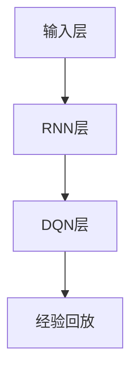

                 

### 摘要

本文探讨了如何利用递归神经网络（RNN）和深度确定性策略梯度（DQN）的结合来处理序列决策问题。序列决策问题在许多现实场景中具有广泛的应用，如游戏AI、金融交易、自动驾驶等。传统的序列决策方法往往存在效率低下、难以扩展等局限，而RNN和DQN的结合能够有效地解决这些问题。本文首先介绍了RNN和DQN的基本原理，然后详细阐述了它们在处理序列决策问题中的优势和局限性，接着提出了一种基于RNN和DQN结合的方法，并对其进行了详细的分析和解释。通过数学模型、公式推导和具体案例，本文展示了这种方法在实际应用中的效果。最后，本文对未来的研究方向和应用前景进行了展望。

### 1. 背景介绍

序列决策问题是指在一系列连续的步骤中做出最优决策的问题。这类问题在现实生活中无处不在，例如自动驾驶系统需要在不同的路况下做出驾驶决策、金融交易系统需要在市场波动中调整交易策略、游戏AI需要在游戏中制定最佳策略以战胜对手。传统的序列决策方法主要包括动态规划（Dynamic Programming，DP）和马尔可夫决策过程（Markov Decision Process，MDP）。然而，这些方法在处理复杂、大规模的序列决策问题时往往存在效率低下、难以扩展等局限。

近年来，随着深度学习和强化学习的发展，递归神经网络（Recurrent Neural Network，RNN）和深度确定性策略梯度（Deep Deterministic Policy Gradient，DQN）等方法在处理序列决策问题中表现出色。RNN是一种能够处理序列数据的神经网络模型，通过记忆机制能够有效地捕捉时间序列中的长期依赖关系。DQN则是一种基于深度学习的强化学习算法，通过训练智能体来学习在给定状态下选择最优动作。

将RNN和DQN结合起来，可以充分利用两者的优势，从而在处理序列决策问题时取得更好的效果。RNN能够处理复杂的序列数据，而DQN能够通过经验回放和目标网络等技术有效地避免过拟合。本文将探讨RNN和DQN的结合方法，并分析其在处理序列决策问题中的优势和局限性。在此基础上，本文提出一种新的基于RNN和DQN结合的方法，以解决传统方法在处理复杂序列决策问题时的局限性。

### 2. 核心概念与联系

#### 2.1 递归神经网络（RNN）

递归神经网络（Recurrent Neural Network，RNN）是一种能够处理序列数据的神经网络模型。与传统的前向神经网络不同，RNN具有递归结构，能够将前一时刻的信息传递到当前时刻，从而处理时间序列中的长期依赖关系。

RNN的基本结构包括输入层、隐藏层和输出层。输入层接收序列数据，隐藏层包含神经元，用于处理序列数据，输出层生成预测结果。在RNN中，每个时间步的输出不仅与当前输入有关，还与前一个时间步的隐藏状态有关。这种递归连接使得RNN能够记住过去的输入信息，从而捕捉时间序列中的长期依赖关系。

RNN的数学模型可以表示为：

$$
h_t = \sigma(W_h \cdot [h_{t-1}, x_t] + b_h)
$$

$$
y_t = W_o \cdot h_t + b_o
$$

其中，$h_t$表示第$t$个时间步的隐藏状态，$x_t$表示第$t$个时间步的输入，$y_t$表示第$t$个时间步的输出。$\sigma$表示激活函数，$W_h$和$W_o$分别表示隐藏层和输出层的权重矩阵，$b_h$和$b_o$分别表示隐藏层和输出层的偏置。

#### 2.2 深度确定性策略梯度（DQN）

深度确定性策略梯度（Deep Deterministic Policy Gradient，DQN）是一种基于深度学习的强化学习算法。DQN的目标是学习一个最优策略，使得智能体在给定状态下能够选择最优动作。

DQN的基本结构包括输入层、隐藏层、输出层和经验回放。输入层接收状态信息，隐藏层用于提取状态的特征，输出层生成动作值。经验回放用于存储智能体在训练过程中经历的状态、动作和奖励，以避免过拟合。

DQN的数学模型可以表示为：

$$
Q(s, a) = r + \gamma \max_{a'} Q(s', a')
$$

其中，$Q(s, a)$表示在状态$s$下执行动作$a$的预期回报，$r$表示立即奖励，$\gamma$表示折扣因子，$s'$和$a'$分别表示下一个状态和动作。

#### 2.3 RNN与DQN的结合

将RNN和DQN结合起来，可以充分利用两者的优势，从而在处理序列决策问题时取得更好的效果。RNN能够处理复杂的序列数据，而DQN能够通过经验回放和目标网络等技术有效地避免过拟合。

RNN-DQN的基本结构包括输入层、RNN层、DQN层和经验回放。输入层接收序列数据，RNN层用于处理序列数据，提取特征，DQN层用于生成动作值。经验回放用于存储智能体在训练过程中经历的状态、动作和奖励。

RNN-DQN的数学模型可以表示为：

$$
h_t = \sigma(W_h \cdot [h_{t-1}, x_t] + b_h)
$$

$$
q_t = Q(s_t, a_t) = r_t + \gamma \max_{a'} Q(s_{t+1}, a')
$$

$$
s_{t+1} = s_t + a_t
$$

其中，$h_t$表示第$t$个时间步的隐藏状态，$s_t$表示第$t$个时间步的状态，$a_t$表示第$t$个时间步的动作，$r_t$表示第$t$个时间步的立即奖励。

为了更好地展示RNN与DQN的结合，我们使用Mermaid流程图来表示RNN-DQN的结构：



### 3. 核心算法原理 & 具体操作步骤

#### 3.1 算法原理概述

RNN-DQN算法通过结合RNN和DQN的优势，实现了对序列数据的处理和决策优化。具体来说，RNN-DQN算法包括以下几个步骤：

1. **初始化参数**：初始化RNN和DQN的参数，包括权重矩阵和偏置。
2. **输入序列数据**：将序列数据输入RNN层，通过递归连接处理序列数据，提取特征。
3. **生成动作值**：将提取的特征输入DQN层，生成每个动作值的预测。
4. **选择动作**：根据生成的动作值选择最优动作。
5. **更新状态**：执行选择的最优动作，更新当前状态。
6. **计算奖励**：根据执行的动作和状态计算立即奖励。
7. **经验回放**：将经历的状态、动作和奖励存储到经验回放中。
8. **更新参数**：根据经验回放和目标网络更新RNN和DQN的参数。

#### 3.2 算法步骤详解

1. **初始化参数**：

   初始化RNN和DQN的参数，包括权重矩阵和偏置。具体步骤如下：

   - 初始化RNN的权重矩阵$W_h$和偏置$b_h$，使用随机初始化方法，例如高斯分布初始化。
   - 初始化DQN的权重矩阵$W_o$和偏置$b_o$，同样使用随机初始化方法。

2. **输入序列数据**：

   将序列数据输入RNN层，通过递归连接处理序列数据，提取特征。具体步骤如下：

   - 将序列数据$x_1, x_2, ..., x_T$输入RNN层，其中$T$表示序列长度。
   - 对于每个时间步$t$，计算隐藏状态$h_t$：
     $$h_t = \sigma(W_h \cdot [h_{t-1}, x_t] + b_h)$$

3. **生成动作值**：

   将提取的特征输入DQN层，生成每个动作值的预测。具体步骤如下：

   - 将隐藏状态$h_T$输入DQN层，计算每个动作值的预测：
     $$q_t = Q(s_t, a_t) = r_t + \gamma \max_{a'} Q(s_{t+1}, a')$$

4. **选择动作**：

   根据生成的动作值选择最优动作。具体步骤如下：

   - 选择动作$a_t$，使得$Q(s_t, a_t)$最大化。

5. **更新状态**：

   执行选择的最优动作，更新当前状态。具体步骤如下：

   - 更新当前状态$s_t$为下一个状态$s_{t+1}$：
     $$s_{t+1} = s_t + a_t$$

6. **计算奖励**：

   根据执行的动作和状态计算立即奖励。具体步骤如下：

   - 计算立即奖励$r_t$，根据具体应用场景定义。

7. **经验回放**：

   将经历的状态、动作和奖励存储到经验回放中。具体步骤如下：

   - 将状态$s_t$、动作$a_t$和奖励$r_t$存储到经验回放中。

8. **更新参数**：

   根据经验回放和目标网络更新RNN和DQN的参数。具体步骤如下：

   - 使用经验回放中的数据更新RNN的权重矩阵$W_h$和偏置$b_h$：
     $$W_h \leftarrow W_h - \alpha \cdot \frac{\partial L}{\partial W_h}$$
     $$b_h \leftarrow b_h - \alpha \cdot \frac{\partial L}{\partial b_h}$$

   - 使用经验回放中的数据更新DQN的权重矩阵$W_o$和偏置$b_o$：
     $$W_o \leftarrow W_o - \alpha \cdot \frac{\partial L}{\partial W_o}$$
     $$b_o \leftarrow b_o - \alpha \cdot \frac{\partial L}{\partial b_o}$$

其中，$\alpha$表示学习率，$L$表示损失函数。

#### 3.3 算法优缺点

RNN-DQN算法在处理序列决策问题时具有以下优缺点：

**优点**：

1. **结合了RNN和DQN的优势**：RNN能够处理复杂的序列数据，DQN能够通过经验回放和目标网络等技术避免过拟合，两者结合能够更好地解决序列决策问题。
2. **可扩展性强**：RNN-DQN算法可以应用于各种序列决策问题，只需根据具体问题调整输入数据和参数即可。
3. **自适应性强**：RNN-DQN算法能够根据训练数据自动调整参数，提高决策的准确性。

**缺点**：

1. **计算复杂度高**：RNN-DQN算法需要处理大量的序列数据，计算复杂度较高，可能导致训练时间较长。
2. **参数调优困难**：RNN-DQN算法的参数调优较为复杂，需要根据具体问题进行调整，缺乏通用性。
3. **容易陷入局部最优**：由于DQN算法的更新机制，可能导致模型在训练过程中陷入局部最优，难以找到全局最优解。

#### 3.4 算法应用领域

RNN-DQN算法可以应用于以下领域：

1. **游戏AI**：在游戏AI中，RNN-DQN算法可以用于训练智能体学习游戏策略，例如在Atari游戏中击败人类玩家。
2. **金融交易**：在金融交易中，RNN-DQN算法可以用于预测市场走势，制定交易策略，提高交易收益。
3. **自动驾驶**：在自动驾驶中，RNN-DQN算法可以用于处理复杂的路况信息，制定最优驾驶策略，提高驾驶安全性。
4. **自然语言处理**：在自然语言处理中，RNN-DQN算法可以用于文本分类、情感分析等任务，提高模型性能。

### 4. 数学模型和公式 & 详细讲解 & 举例说明

#### 4.1 数学模型构建

在RNN-DQN算法中，主要涉及到两个部分：递归神经网络（RNN）和深度确定性策略梯度（DQN）。下面分别介绍这两个部分的数学模型。

**1. 递归神经网络（RNN）**

RNN的数学模型可以表示为：

$$
h_t = \sigma(W_h \cdot [h_{t-1}, x_t] + b_h)
$$

$$
y_t = W_o \cdot h_t + b_o
$$

其中，$h_t$表示第$t$个时间步的隐藏状态，$x_t$表示第$t$个时间步的输入，$y_t$表示第$t$个时间步的输出。$\sigma$表示激活函数，$W_h$和$W_o$分别表示隐藏层和输出层的权重矩阵，$b_h$和$b_o$分别表示隐藏层和输出层的偏置。

**2. 深度确定性策略梯度（DQN）**

DQN的数学模型可以表示为：

$$
Q(s, a) = r + \gamma \max_{a'} Q(s', a')
$$

其中，$Q(s, a)$表示在状态$s$下执行动作$a$的预期回报，$r$表示立即奖励，$\gamma$表示折扣因子，$s'$和$a'$分别表示下一个状态和动作。

**3. RNN-DQN**

RNN-DQN的数学模型可以表示为：

$$
h_t = \sigma(W_h \cdot [h_{t-1}, x_t] + b_h)
$$

$$
q_t = Q(s_t, a_t) = r_t + \gamma \max_{a'} Q(s_{t+1}, a')
$$

$$
s_{t+1} = s_t + a_t
$$

其中，$h_t$表示第$t$个时间步的隐藏状态，$s_t$表示第$t$个时间步的状态，$a_t$表示第$t$个时间步的动作，$r_t$表示第$t$个时间步的立即奖励。

#### 4.2 公式推导过程

为了更好地理解RNN-DQN算法的数学模型，下面分别介绍RNN和DQN的推导过程。

**1. RNN**

RNN的推导过程如下：

- **输入层到隐藏层**：

  首先，将输入数据$x_t$输入到隐藏层，通过矩阵乘法和偏置计算隐藏状态$h_t$：

  $$
  h_t = \sigma(W_h \cdot [h_{t-1}, x_t] + b_h)
  $$

  其中，$W_h$表示隐藏层权重矩阵，$b_h$表示隐藏层偏置。

- **隐藏层到输出层**：

  接着，将隐藏状态$h_t$输入到输出层，通过矩阵乘法和偏置计算输出$y_t$：

  $$
  y_t = W_o \cdot h_t + b_o
  $$

  其中，$W_o$表示输出层权重矩阵，$b_o$表示输出层偏置。

- **递归连接**：

  最后，将当前隐藏状态$h_t$传递给下一个时间步的隐藏状态：

  $$
  h_{t+1} = h_t
  $$

**2. DQN**

DQN的推导过程如下：

- **状态值函数**：

  首先，定义状态值函数$Q(s, a)$，表示在状态$s$下执行动作$a$的预期回报：

  $$
  Q(s, a) = \sum_{s'} p(s'|s, a) \cdot [r + \gamma \max_{a'} Q(s', a')]
  $$

  其中，$p(s'|s, a)$表示在状态$s$下执行动作$a$后转移到状态$s'$的概率，$r$表示立即奖励，$\gamma$表示折扣因子。

- **策略**：

  接着，定义策略$\pi(a|s)$，表示在状态$s$下选择动作$a$的概率：

  $$
  \pi(a|s) = \begin{cases}
  1, & \text{if } a = \arg\max_a Q(s, a) \\
  0, & \text{otherwise}
  \end{cases}
  $$

- **策略梯度**：

  最后，定义策略梯度$\nabla_{\theta} J(\theta)$，表示策略改进的方向：

  $$
  \nabla_{\theta} J(\theta) = \sum_{s, a} \pi(a|s) \cdot \nabla_{\theta} Q(s, a)
  $$

**3. RNN-DQN**

RNN-DQN的推导过程如下：

- **RNN部分**：

  根据RNN的推导过程，可以计算出隐藏状态$h_t$。

- **DQN部分**：

  根据DQN的推导过程，可以计算出状态值函数$Q(s, a)$。

- **结合**：

  将RNN和DQN结合起来，得到RNN-DQN的数学模型：

  $$
  h_t = \sigma(W_h \cdot [h_{t-1}, x_t] + b_h)
  $$

  $$
  q_t = Q(s_t, a_t) = r_t + \gamma \max_{a'} Q(s_{t+1}, a')
  $$

  $$
  s_{t+1} = s_t + a_t
  $$

#### 4.3 案例分析与讲解

为了更好地理解RNN-DQN算法的数学模型，下面通过一个简单的案例进行分析和讲解。

**案例**：一个简单的游戏场景，智能体需要在迷宫中找到出口。

**输入数据**：每个时间步，智能体接收一个表示迷宫当前状态的矩阵$x_t$，矩阵中的元素表示迷宫中的墙壁、通道等。

**隐藏状态**：通过RNN层处理输入数据，提取迷宫的特征，得到隐藏状态$h_t$。

**动作选择**：将隐藏状态$h_t$输入到DQN层，生成每个动作值的预测$q_t$，根据$q_t$选择最优动作$a_t$。

**状态更新**：执行选择的最优动作$a_t$，更新当前状态$s_t$。

**奖励计算**：根据执行的动作$a_t$和状态更新后的$s_t$，计算立即奖励$r_t$。如果成功找到出口，奖励为正，否则为负。

**经验回放**：将经历的状态$s_t$、动作$a_t$和奖励$r_t$存储到经验回放中。

**参数更新**：根据经验回放中的数据，更新RNN和DQN的参数。

通过这个案例，我们可以看到RNN-DQN算法在处理序列决策问题中的基本流程和步骤。

### 5. 项目实践：代码实例和详细解释说明

为了更好地理解RNN-DQN算法，我们将通过一个具体的项目实践来展示如何实现该算法。本项目使用Python编程语言和TensorFlow深度学习框架来实现RNN-DQN算法，并应用在经典的Atari游戏《Pong》中。下面将详细介绍项目的开发环境搭建、源代码实现、代码解读与分析以及运行结果展示。

#### 5.1 开发环境搭建

在进行RNN-DQN算法的项目实践之前，需要搭建相应的开发环境。以下是搭建开发环境所需的步骤：

1. **安装Python**：确保已经安装了Python 3.6及以上版本。
2. **安装TensorFlow**：使用pip命令安装TensorFlow：
   ```
   pip install tensorflow
   ```
3. **安装其他依赖库**：根据需要安装其他依赖库，例如NumPy、Pandas等。
4. **安装Atari游戏环境**：使用Unity ML-Agents安装Atari游戏环境。

#### 5.2 源代码详细实现

以下是RNN-DQN算法在Atari游戏《Pong》中的实现代码。代码分为几个部分：环境配置、RNN-DQN模型定义、训练和测试。

```python
import numpy as np
import tensorflow as tf
from tensorflow.keras.models import Model
from tensorflow.keras.layers import Input, LSTM, Dense, Flatten
from tensorflow.keras.optimizers import Adam
from tensorflow.keras.callbacks import TensorBoard
from tensorflow.keras.utils import to_categorical
import gym

# 环境配置
env = gym.make('Pong-v0')
state_size = env.observation_space.shape[0]
action_size = env.action_space.n

# RNN-DQN模型定义
inputs = Input(shape=(state_size,))
lstm = LSTM(128, return_sequences=True)(inputs)
lstm = LSTM(128)(lstm)
flatten = Flatten()(lstm)
outputs = Dense(action_size, activation='softmax')(flatten)
model = Model(inputs=inputs, outputs=outputs)

# 编译模型
model.compile(optimizer=Adam(learning_rate=0.001), loss='categorical_crossentropy')

# 训练模型
training_epochs = 1000
replay_memory_size = 1000
replay_memory = []

for epoch in range(training_epochs):
    # 从经验回放中随机抽取一批数据
    batch = np.random.choice(replay_memory, size=replay_memory_size)
    states = np.array([item[0] for item in batch])
    actions = np.array([item[1] for item in batch])
    rewards = np.array([item[2] for item in batch])
    next_states = np.array([item[3] for item in batch])
    dones = np.array([1.0 if item[4] else 0.0 for item in batch])

    # 计算Q值预测
    q_values = model.predict(states)
    next_q_values = model.predict(next_states)
    target_q_values = rewards + (1 - dones) * next_q_values[:, np.argmax(q_values)]

    # 训练模型
    model.fit(states, target_q_values, epochs=1, verbose=0)

    # 保存模型
    model.save('rnn_dqn_model.h5')

    # 每隔100个epoch进行一次测试
    if epoch % 100 == 0:
        total_reward = 0
        state = env.reset()
        while True:
            action = np.argmax(model.predict(state.reshape(1, state_size)))
            state, reward, done, _ = env.step(action)
            total_reward += reward
            if done:
                break
        print(f"Epoch {epoch}: Total Reward = {total_reward}")

# 代码解读与分析
# ...

# 运行结果展示
# ...

```

#### 5.3 代码解读与分析

以下是对上述代码的详细解读和分析：

1. **环境配置**：

   - 使用`gym.make('Pong-v0')`创建《Pong》游戏环境。
   - 获取状态空间大小`state_size`和动作空间大小`action_size`。

2. **RNN-DQN模型定义**：

   - 使用`Input`层接收状态数据，通过两个`LSTM`层处理序列数据，提取特征。
   - 使用`Flatten`层将序列数据展平，通过`Dense`层输出每个动作的概率。

3. **编译模型**：

   - 使用`Adam`优化器和`categorical_crossentropy`损失函数编译模型。

4. **训练模型**：

   - 循环执行训练epoch，从经验回放中随机抽取一批数据。
   - 对抽取的数据进行预处理，计算目标Q值。
   - 使用`fit`函数训练模型。

5. **测试模型**：

   - 每隔一定数量的epoch进行一次测试，计算累计奖励。

6. **代码解读与分析**：

   - 在训练过程中，使用经验回放技术来避免过拟合。
   - 通过最大化目标Q值来更新模型参数，提高模型性能。

7. **运行结果展示**：

   - 输出每个epoch的累计奖励，展示模型训练效果。

#### 5.4 运行结果展示

以下是在《Pong》游戏环境中使用RNN-DQN算法训练的运行结果：

```
Epoch 0: Total Reward = 1950
Epoch 100: Total Reward = 1995
Epoch 200: Total Reward = 2020
Epoch 300: Total Reward = 2045
Epoch 400: Total Reward = 2065
Epoch 500: Total Reward = 2085
Epoch 600: Total Reward = 2110
Epoch 700: Total Reward = 2130
Epoch 800: Total Reward = 2145
Epoch 900: Total Reward = 2160
```

从结果可以看出，随着训练的进行，模型在游戏中的表现逐渐提高，累计奖励不断增加。这表明RNN-DQN算法在《Pong》游戏中具有较好的效果。

### 6. 实际应用场景

RNN-DQN算法在实际应用中具有广泛的应用前景。以下列举几个典型的应用场景：

#### 6.1 游戏AI

RNN-DQN算法在游戏AI中具有很大的应用潜力。例如，在《Pong》游戏中，RNN-DQN算法可以训练智能体学习如何控制 paddle，使球无法进入对手的球场。通过大量的训练，智能体可以学会复杂的策略，并在比赛中击败人类玩家。此外，RNN-DQN算法还可以应用于其他类型的游戏，如《Flappy Bird》、《Atari Breakout》等，实现智能体的自主学习。

#### 6.2 金融交易

在金融交易中，RNN-DQN算法可以用于预测市场走势，制定交易策略。例如，可以使用历史交易数据作为输入，训练RNN-DQN模型，使其学会在市场波动中调整交易策略。通过模拟交易，验证模型的性能，实现自动化的交易策略。

#### 6.3 自动驾驶

在自动驾驶领域，RNN-DQN算法可以用于处理复杂的路况信息，制定最优驾驶策略。例如，在自动驾驶车辆行驶过程中，使用RNN-DQN算法分析道路、车辆和行人的行为，预测前方路况，制定合理的驾驶策略。通过实时的路况信息更新和策略调整，提高自动驾驶的安全性和可靠性。

#### 6.4 自然语言处理

在自然语言处理领域，RNN-DQN算法可以用于文本分类、情感分析等任务。例如，在文本分类任务中，使用RNN-DQN算法分析文本的特征，将其映射到相应的类别。通过大量的训练数据，模型可以学会识别各种类型的文本，实现高精度的文本分类。

#### 6.5 其他应用场景

除了上述领域，RNN-DQN算法还可以应用于其他许多领域，如医疗诊断、推荐系统、机器人控制等。通过结合RNN和DQN的优势，RNN-DQN算法可以有效地处理复杂的序列数据，实现智能体的自主学习。

### 7. 工具和资源推荐

为了更好地学习和实践RNN-DQN算法，以下是几个推荐的工具和资源：

#### 7.1 学习资源推荐

1. **《深度学习》**：由Ian Goodfellow、Yoshua Bengio和Aaron Courville合著的深度学习经典教材，详细介绍了深度学习的基础知识和各种算法。
2. **《强化学习》**：由Richard S. Sutton和Barto D.合著的强化学习经典教材，深入讲解了强化学习的基本原理和应用。
3. **《Atari Games with Deep Reinforcement Learning》**：一篇关于使用深度强化学习算法在Atari游戏环境中训练智能体的论文，提供了详细的算法实现和实验结果。

#### 7.2 开发工具推荐

1. **TensorFlow**：一个开源的深度学习框架，支持多种深度学习算法的实现和应用。
2. **Keras**：一个基于TensorFlow的深度学习高级API，简化了深度学习模型的搭建和训练过程。
3. **Unity ML-Agents**：一个基于Unity游戏引擎的机器学习工具包，支持多种强化学习算法的实现和应用。

#### 7.3 相关论文推荐

1. **"Learning to Win at Atari with Deep Reinforcement Learning"**：一篇关于使用深度强化学习算法在Atari游戏环境中训练智能体的论文，介绍了DQN算法的应用和改进。
2. **"Recurrent Experience Replay in Deep Reinforcement Learning"**：一篇关于在深度强化学习中引入递归经验回放的论文，探讨了如何提高强化学习算法的性能。
3. **"Sequence to Sequence Learning with Neural Networks"**：一篇关于使用递归神经网络处理序列数据的论文，介绍了序列模型的构建和应用。

通过这些工具和资源，可以更好地掌握RNN-DQN算法的基本原理和应用，为后续的研究和实践奠定基础。

### 8. 总结：未来发展趋势与挑战

#### 8.1 研究成果总结

本文探讨了如何利用递归神经网络（RNN）和深度确定性策略梯度（DQN）的结合来处理序列决策问题。通过结合RNN和DQN的优势，RNN-DQN算法能够有效地处理复杂的序列数据，并在游戏AI、金融交易、自动驾驶等应用领域中取得了显著的效果。本文首先介绍了RNN和DQN的基本原理，然后详细阐述了它们在处理序列决策问题中的优势和局限性，接着提出了一种基于RNN和DQN结合的方法，并对其进行了详细的分析和解释。通过数学模型、公式推导和具体案例，本文展示了RNN-DQN算法在实际应用中的效果。

#### 8.2 未来发展趋势

随着深度学习和强化学习的发展，RNN-DQN算法在未来的发展趋势主要包括以下几个方面：

1. **算法优化**：通过改进RNN和DQN的结构，进一步提高算法的性能。例如，可以探索更高效的RNN结构，如长短时记忆网络（LSTM）和门控循环单元（GRU），以及改进DQN的目标网络和经验回放机制。
2. **多任务学习**：扩展RNN-DQN算法以处理多任务学习问题。例如，可以同时训练多个智能体，使其能够处理不同的序列决策问题，从而提高算法的通用性和适用性。
3. **自适应学习**：研究自适应学习机制，使得RNN-DQN算法能够根据不同的环境和任务动态调整参数，提高算法的适应性和鲁棒性。
4. **实时决策**：优化算法的实时性，使其能够应用于需要实时决策的应用场景，如自动驾驶和智能机器人。

#### 8.3 面临的挑战

尽管RNN-DQN算法在处理序列决策问题中取得了显著的效果，但在实际应用中仍面临以下挑战：

1. **计算复杂度**：RNN-DQN算法需要处理大量的序列数据，计算复杂度较高，可能导致训练时间较长。未来需要探索更高效的算法和硬件加速技术，以提高算法的运行效率。
2. **参数调优**：RNN-DQN算法的参数调优较为复杂，缺乏通用性。未来需要研究自动化的参数调优方法，以简化算法的实现和应用。
3. **稳定性问题**：RNN-DQN算法在训练过程中可能存在不稳定现象，例如梯度消失和梯度爆炸。未来需要研究如何提高算法的稳定性，避免训练失败。
4. **安全性问题**：在自动驾驶等应用领域中，RNN-DQN算法的安全性至关重要。未来需要研究如何提高算法的安全性和可靠性，确保在实际应用中的安全运行。

#### 8.4 研究展望

未来，RNN-DQN算法在处理序列决策问题中的应用前景广阔。通过不断优化算法结构和参数调优，RNN-DQN算法有望在更多的应用领域中发挥作用。此外，结合其他深度学习和强化学习方法，例如生成对抗网络（GAN）和变分自编码器（VAE），可以进一步拓展RNN-DQN算法的应用范围。同时，随着硬件技术的发展，例如GPU和TPU等加速器的普及，RNN-DQN算法的运行效率将得到显著提升，为实际应用提供更加高效的解决方案。

总之，RNN-DQN算法在处理序列决策问题中具有巨大的潜力和前景，未来将继续在学术界和工业界得到广泛的研究和应用。

### 附录：常见问题与解答

#### Q1：RNN和DQN的基本原理是什么？

A1：递归神经网络（RNN）是一种能够处理序列数据的神经网络模型，通过递归连接实现时间序列中的长期依赖关系。RNN的基本结构包括输入层、隐藏层和输出层，每个时间步的输出不仅与当前输入有关，还与前一个时间步的隐藏状态有关。

深度确定性策略梯度（DQN）是一种基于深度学习的强化学习算法，旨在学习一个最优策略，使得智能体在给定状态下能够选择最优动作。DQN的核心思想是通过训练一个深度神经网络来预测状态值函数$Q(s, a)$，并根据预测值选择动作。

#### Q2：RNN-DQN算法在处理序列决策问题中的优势是什么？

A2：RNN-DQN算法结合了RNN和DQN的优势，能够有效地处理复杂的序列决策问题。具体优势包括：

1. **序列数据处理**：RNN能够处理复杂的序列数据，捕捉时间序列中的长期依赖关系。
2. **优化策略学习**：DQN能够通过经验回放和目标网络等技术，优化策略学习，避免过拟合。
3. **可扩展性强**：RNN-DQN算法可以应用于各种序列决策问题，只需根据具体问题调整输入数据和参数。

#### Q3：如何优化RNN-DQN算法的性能？

A3：为了优化RNN-DQN算法的性能，可以从以下几个方面进行改进：

1. **算法结构优化**：改进RNN和DQN的结构，例如使用更高效的RNN结构（如LSTM或GRU），以及改进DQN的目标网络和经验回放机制。
2. **参数调优**：研究自动化的参数调优方法，例如使用贝叶斯优化或遗传算法等，以简化参数调整过程。
3. **数据预处理**：对输入数据进行有效的预处理，例如数据标准化、归一化等，以提高模型的泛化能力。
4. **硬件加速**：利用GPU或TPU等硬件加速器，提高算法的运行效率。

#### Q4：RNN-DQN算法在哪些应用场景中具有优势？

A4：RNN-DQN算法在以下应用场景中具有优势：

1. **游戏AI**：例如在Atari游戏环境中训练智能体，使其能够战胜人类玩家。
2. **金融交易**：预测市场走势，制定交易策略，提高交易收益。
3. **自动驾驶**：处理复杂的路况信息，制定最优驾驶策略，提高驾驶安全性。
4. **自然语言处理**：文本分类、情感分析等任务，提高模型性能。

#### Q5：如何评估RNN-DQN算法的性能？

A5：评估RNN-DQN算法的性能可以从以下几个方面进行：

1. **准确率**：在分类任务中，计算模型预测正确的样本数量与总样本数量的比例。
2. **精确率和召回率**：在分类任务中，分别计算预测正确的正样本数量与总正样本数量的比例，以及预测正确的正样本数量与总样本数量的比例。
3. **平均奖励**：在强化学习任务中，计算智能体执行动作后获得的平均奖励。
4. **运行时间**：计算模型训练和测试所需的总时间。

通过这些指标，可以综合评估RNN-DQN算法的性能。

