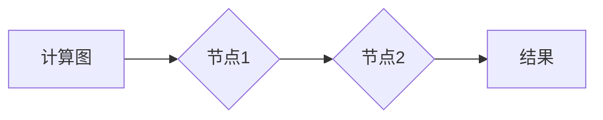
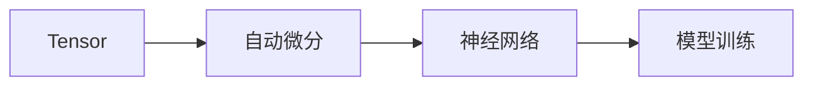

                 

关键词：TensorFlow，PyTorch，深度学习框架，实战对比，编程实践，算法原理

> 摘要：本文将深入探讨TensorFlow和PyTorch这两个目前最为流行的深度学习框架，通过实战对比的方式，详细分析它们在编程实践中的差异和优势。我们将从背景介绍、核心概念、算法原理、数学模型、项目实践、实际应用场景等多个方面展开讨论，帮助读者更好地理解和选择合适的深度学习框架。

## 1. 背景介绍

### TensorFlow

TensorFlow是由Google Brain团队于2015年开源的一个基于数据流编程的深度学习框架。它使用数据流图（dataflow graph）作为其核心计算模型，可以方便地构建、训练和部署深度学习模型。TensorFlow具有高度的灵活性和强大的功能，支持多种类型的计算任务，从简单的神经网络到复杂的深度学习模型都可以使用TensorFlow实现。

### PyTorch

PyTorch是Facebook AI Research（FAIR）于2016年开源的一个基于Python的深度学习框架。它使用动态计算图（dynamic computation graph）作为其核心计算模型，使得模型设计和调试更加直观和灵活。PyTorch在学术界和工业界都得到了广泛的认可和应用，其社区活跃度和资源丰富度也非常高。

## 2. 核心概念与联系

在深入对比TensorFlow和PyTorch之前，我们先来了解一下它们的核心概念和架构。

### TensorFlow

TensorFlow的核心概念包括：

- **张量（Tensor）**：TensorFlow中的基本数据结构，用于存储数据。它是一个多维数组，可以是一维的向量，二维的矩阵，或者更高维的数据。
- **计算图（Computational Graph）**：TensorFlow使用计算图来表示计算过程。计算图由节点（操作）和边（数据流）组成，每个节点表示一个数学运算，而边表示数据在节点间的流动。
- **会话（Session）**：在TensorFlow中，会话用于执行计算图中的运算。会话可以用来初始化变量、运行图中的运算，以及获取运算的结果。

TensorFlow的架构如图所示：



### PyTorch

PyTorch的核心概念包括：

- **张量（Tensor）**：与TensorFlow类似，PyTorch也使用张量作为其基本数据结构，用于存储数据。PyTorch的张量是动态的，可以随时改变形状和内容。
- **自动微分（Autograd）**：PyTorch内置了自动微分系统Autograd，可以自动计算函数的梯度，这使得构建和训练深度学习模型更加方便。
- **神经网络（Neural Network）**：PyTorch提供了丰富的神经网络模块，包括常见的激活函数、损失函数、优化器等。

PyTorch的架构如图所示：



## 3. 核心算法原理 & 具体操作步骤

### 3.1 算法原理概述

深度学习框架的核心在于其算法原理，TensorFlow和PyTorch在算法原理上都有各自的特点。

#### TensorFlow

TensorFlow使用计算图作为其核心计算模型，计算图中的节点表示数学运算，而边表示数据在节点间的流动。TensorFlow的算法原理包括以下几个方面：

- **前向传播（Forward Propagation）**：在前向传播过程中，模型接收输入数据，通过一系列的数学运算得到输出。
- **反向传播（Back Propagation）**：在反向传播过程中，计算输出与真实值之间的误差，并反向传播误差到输入，以此来更新模型参数。
- **优化器（Optimizer）**：优化器用于更新模型参数，以最小化损失函数。

#### PyTorch

PyTorch使用动态计算图作为其核心计算模型，动态计算图在运行时构建，这使得模型设计和调试更加直观和灵活。PyTorch的算法原理包括以下几个方面：

- **前向传播（Forward Propagation）**：与TensorFlow类似，PyTorch也使用前向传播来计算输出。
- **自动微分（Autograd）**：PyTorch的自动微分系统Autograd可以自动计算函数的梯度，使得反向传播更加方便。
- **动态图（Dynamic Graph）**：PyTorch的动态计算图在运行时构建，这使得模型设计和调试更加直观和灵活。

### 3.2 算法步骤详解

#### TensorFlow

1. **定义计算图**：在TensorFlow中，我们需要先定义计算图，包括输入节点、操作节点和输出节点。
2. **初始化变量**：初始化模型参数和优化器。
3. **前向传播**：计算输入数据经过模型后的输出。
4. **计算损失**：计算输出与真实值之间的误差。
5. **反向传播**：计算梯度并更新模型参数。
6. **优化模型**：使用优化器更新模型参数。

#### PyTorch

1. **定义模型**：在PyTorch中，我们需要先定义模型结构，可以使用torch.nn模块中的各种层。
2. **定义损失函数**：使用torch.nn模块中的损失函数。
3. **定义优化器**：使用torch.optim模块中的优化器。
4. **前向传播**：计算输入数据经过模型后的输出。
5. **计算损失**：计算输出与真实值之间的误差。
6. **反向传播**：自动计算梯度并更新模型参数。
7. **优化模型**：使用优化器更新模型参数。

### 3.3 算法优缺点

#### TensorFlow

**优点**：

- **灵活性和可扩展性**：TensorFlow的计算图模型可以灵活地构建各种复杂的计算任务。
- **强大的生态系统**：TensorFlow拥有丰富的库和工具，可以方便地部署和管理模型。
- **硬件加速**：TensorFlow支持GPU和TPU等硬件加速，可以显著提高计算速度。

**缺点**：

- **学习曲线较陡**：TensorFlow的学习曲线相对较陡，需要用户熟悉计算图编程。
- **调试难度大**：由于TensorFlow的计算图在编译时生成，调试相对困难。

#### PyTorch

**优点**：

- **直观性和灵活性**：PyTorch的动态计算图使得模型设计和调试更加直观和灵活。
- **易于学习和使用**：PyTorch的语法简洁，学习曲线相对平缓。
- **自动微分方便**：PyTorch的自动微分系统使得反向传播更加方便。

**缺点**：

- **性能略低**：由于PyTorch的动态计算图在运行时构建，性能相对较低。
- **生态相对较弱**：虽然PyTorch在学术界和工业界都得到了广泛应用，但其生态系统相对较弱。

### 3.4 算法应用领域

#### TensorFlow

TensorFlow广泛应用于各种深度学习任务，包括：

- **计算机视觉**：图像分类、目标检测、人脸识别等。
- **自然语言处理**：文本分类、机器翻译、情感分析等。
- **语音识别**：语音合成、语音识别等。

#### PyTorch

PyTorch在以下领域有着广泛的应用：

- **计算机视觉**：图像生成、图像风格迁移、图像超分辨率等。
- **自然语言处理**：文本生成、对话系统、机器翻译等。
- **强化学习**：游戏AI、机器人控制等。

## 4. 数学模型和公式 & 详细讲解 & 举例说明

在深度学习中，数学模型和公式是理解和应用深度学习框架的基础。下面我们将介绍TensorFlow和PyTorch中的核心数学模型和公式，并给出详细的讲解和例子。

### 4.1 数学模型构建

深度学习模型通常由输入层、隐藏层和输出层组成。输入层接收外部数据，隐藏层通过一系列的数学运算来提取特征，输出层产生预测结果。在TensorFlow和PyTorch中，我们可以使用各种层和函数来构建深度学习模型。

#### TensorFlow

在TensorFlow中，我们可以使用tf.keras.Sequential模型来构建深度学习模型，如下所示：

```python
import tensorflow as tf

model = tf.keras.Sequential([
    tf.keras.layers.Dense(128, activation='relu', input_shape=(784,)),
    tf.keras.layers.Dense(10, activation='softmax')
])
```

#### PyTorch

在PyTorch中，我们可以使用nn.Sequential模型来构建深度学习模型，如下所示：

```python
import torch
import torch.nn as nn

model = nn.Sequential(
    nn.Linear(784, 128),
    nn.ReLU(),
    nn.Linear(128, 10),
    nn.Softmax(dim=1)
)
```

### 4.2 公式推导过程

深度学习模型的训练过程包括前向传播和反向传播两个阶段。下面我们将介绍这两个阶段的核心公式。

#### 前向传播

前向传播的公式如下：

$$
z_l = W_l \cdot a_{l-1} + b_l
$$

$$
a_l = \sigma(z_l)
$$

其中，$z_l$表示第$l$层的输出，$W_l$和$b_l$分别表示第$l$层的权重和偏置，$\sigma$表示激活函数，$a_{l-1}$表示第$l-1$层的输出。

#### 反向传播

反向传播的公式如下：

$$
\frac{\partial L}{\partial z_l} = \frac{\partial L}{\partial a_l} \cdot \frac{\partial a_l}{\partial z_l}
$$

$$
\frac{\partial L}{\partial W_l} = a_{l-1} \cdot \frac{\partial L}{\partial z_l}
$$

$$
\frac{\partial L}{\partial b_l} = \frac{\partial L}{\partial z_l}
$$

其中，$L$表示损失函数，$\frac{\partial L}{\partial a_l}$表示损失函数关于第$l$层输出的梯度，$\frac{\partial L}{\partial z_l}$表示损失函数关于第$l$层输出的梯度。

### 4.3 案例分析与讲解

下面我们将通过一个简单的例子来分析TensorFlow和PyTorch中的深度学习模型。

#### 例子：使用TensorFlow构建一个简单的神经网络来预测手写数字

```python
import tensorflow as tf
from tensorflow.keras.datasets import mnist

# 加载数据集
(x_train, y_train), (x_test, y_test) = mnist.load_data()

# 预处理数据
x_train = x_train.reshape(-1, 784).astype(np.float32) / 255.0
x_test = x_test.reshape(-1, 784).astype(np.float32) / 255.0
y_train = tf.keras.utils.to_categorical(y_train, num_classes=10)
y_test = tf.keras.utils.to_categorical(y_test, num_classes=10)

# 构建模型
model = tf.keras.Sequential([
    tf.keras.layers.Dense(128, activation='relu', input_shape=(784,)),
    tf.keras.layers.Dense(10, activation='softmax')
])

# 编译模型
model.compile(optimizer='adam',
              loss='categorical_crossentropy',
              metrics=['accuracy'])

# 训练模型
model.fit(x_train, y_train, epochs=5, batch_size=64)

# 评估模型
loss, accuracy = model.evaluate(x_test, y_test)
print('Test accuracy:', accuracy)
```

#### 例子：使用PyTorch构建一个简单的神经网络来预测手写数字

```python
import torch
import torch.nn as nn
import torchvision
import torchvision.transforms as transforms

# 加载数据集
trainset = torchvision.datasets.MNIST(
    root='./data',
    train=True,
    download=True,
    transform=transforms.ToTensor()
)

trainloader = torch.utils.data.DataLoader(trainset, batch_size=64,
                                          shuffle=True, num_workers=2)

testset = torchvision.datasets.MNIST(
    root='./data',
    train=False,
    download=True,
    transform=transforms.ToTensor()
)

testloader = torch.utils.data.DataLoader(testset, batch_size=64,
                                         shuffle=False, num_workers=2)

# 构建模型
model = nn.Sequential(
    nn.Linear(784, 128),
    nn.ReLU(),
    nn.Linear(128, 10),
    nn.Softmax(dim=1)
)

# 定义损失函数和优化器
criterion = nn.CrossEntropyLoss()
optimizer = torch.optim.Adam(model.parameters(), lr=0.001)

# 训练模型
for epoch in range(5):
    running_loss = 0.0
    for i, data in enumerate(trainloader, 0):
        inputs, labels = data
        optimizer.zero_grad()
        outputs = model(inputs)
        loss = criterion(outputs, labels)
        loss.backward()
        optimizer.step()
        running_loss += loss.item()
    print(f'Epoch {epoch + 1}, Loss: {running_loss / len(trainloader)}')

# 评估模型
correct = 0
total = 0
with torch.no_grad():
    for data in testloader:
        images, labels = data
        outputs = model(images)
        _, predicted = torch.max(outputs.data, 1)
        total += labels.size(0)
        correct += (predicted == labels).sum().item()

print(f'Accuracy: {100 * correct / total}%')
```

## 5. 项目实践：代码实例和详细解释说明

### 5.1 开发环境搭建

在开始项目实践之前，我们需要搭建好开发环境。以下是TensorFlow和PyTorch的开发环境搭建步骤：

#### TensorFlow

1. **安装TensorFlow**：使用pip命令安装TensorFlow，可以选择CPU版本或GPU版本。

```shell
pip install tensorflow
```

2. **测试安装**：在Python中导入TensorFlow并打印版本号。

```python
import tensorflow as tf
print(tf.__version__)
```

#### PyTorch

1. **安装PyTorch**：使用pip命令安装PyTorch，可以选择CPU版本或GPU版本。

```shell
pip install torch torchvision
```

2. **测试安装**：在Python中导入PyTorch并打印版本号。

```python
import torch
print(torch.__version__)
```

### 5.2 源代码详细实现

下面我们将分别使用TensorFlow和PyTorch来实现一个简单的手写数字识别项目。

#### TensorFlow实现

```python
import tensorflow as tf
from tensorflow.keras.datasets import mnist
from tensorflow.keras.models import Sequential
from tensorflow.keras.layers import Dense, Flatten, Conv2D, MaxPooling2D
from tensorflow.keras.optimizers import Adam

# 加载数据集
(x_train, y_train), (x_test, y_test) = mnist.load_data()

# 预处理数据
x_train = x_train.astype('float32') / 255.0
x_test = x_test.astype('float32') / 255.0
y_train = tf.keras.utils.to_categorical(y_train, 10)
y_test = tf.keras.utils.to_categorical(y_test, 10)

# 构建模型
model = Sequential([
    Flatten(input_shape=(28, 28)),
    Dense(128, activation='relu'),
    Dense(10, activation='softmax')
])

# 编译模型
model.compile(optimizer=Adam(),
              loss='categorical_crossentropy',
              metrics=['accuracy'])

# 训练模型
model.fit(x_train, y_train, epochs=5, batch_size=32, validation_data=(x_test, y_test))

# 评估模型
test_loss, test_acc = model.evaluate(x_test, y_test)
print('Test accuracy:', test_acc)
```

#### PyTorch实现

```python
import torch
import torchvision
import torchvision.transforms as transforms
import torch.nn as nn
import torch.optim as optim

# 加载数据集
trainset = torchvision.datasets.MNIST(
    root='./data',
    train=True,
    download=True,
    transform=transforms.ToTensor()
)

trainloader = torch.utils.data.DataLoader(trainset, batch_size=32,
                                          shuffle=True, num_workers=2)

testset = torchvision.datasets.MNIST(
    root='./data',
    train=False,
    download=True,
    transform=transforms.ToTensor()
)

testloader = torch.utils.data.DataLoader(testset, batch_size=32,
                                         shuffle=False, num_workers=2)

# 构建模型
model = nn.Sequential(
    Flatten(),
    nn.Linear(784, 128),
    nn.ReLU(),
    nn.Linear(128, 10),
    nn.Softmax(dim=1)
)

# 定义损失函数和优化器
criterion = nn.CrossEntropyLoss()
optimizer = optim.Adam(model.parameters(), lr=0.001)

# 训练模型
for epoch in range(5):
    running_loss = 0.0
    for i, data in enumerate(trainloader, 0):
        inputs, labels = data
        optimizer.zero_grad()
        outputs = model(inputs)
        loss = criterion(outputs, labels)
        loss.backward()
        optimizer.step()
        running_loss += loss.item()
    print(f'Epoch {epoch + 1}, Loss: {running_loss / len(trainloader)}')

# 评估模型
correct = 0
total = 0
with torch.no_grad():
    for data in testloader:
        images, labels = data
        outputs = model(images)
        _, predicted = torch.max(outputs.data, 1)
        total += labels.size(0)
        correct += (predicted == labels).sum().item()

print(f'Accuracy: {100 * correct / total}%')
```

### 5.3 代码解读与分析

在上面的代码示例中，我们使用了TensorFlow和PyTorch分别实现了手写数字识别项目。下面我们分别对代码进行解读和分析。

#### TensorFlow代码解读

1. **数据预处理**：我们首先加载数据集，并对数据进行预处理。将图像数据缩放到[0, 1]范围内，并使用one-hot编码将标签转换为向量。

2. **构建模型**：我们使用Sequential模型构建一个简单的全连接神经网络，包括一个 Flatten 层用于将输入数据展平，一个具有128个神经元的全连接层（Dense），一个ReLU激活函数，以及一个具有10个神经元的全连接输出层（Dense）。

3. **编译模型**：我们使用Adam优化器和categorical_crossentropy损失函数来编译模型。

4. **训练模型**：我们使用fit函数训练模型，设置epochs为5，batch_size为32，并使用validation_data进行验证。

5. **评估模型**：我们使用evaluate函数评估模型的测试集准确率。

#### PyTorch代码解读

1. **数据预处理**：与TensorFlow类似，我们加载数据集，并对数据进行预处理。将图像数据缩放到[0, 1]范围内，并使用torch.utils.data.DataLoader对数据进行批量加载。

2. **构建模型**：我们使用nn.Sequential模型构建一个简单的全连接神经网络，包括一个 Flatten 层用于将输入数据展平，一个具有128个神经元的全连接层（nn.Linear），一个ReLU激活函数，以及一个具有10个神经元的全连接输出层（nn.Linear）。

3. **定义损失函数和优化器**：我们使用CrossEntropyLoss作为损失函数，并使用Adam优化器。

4. **训练模型**：我们使用一个for循环遍历训练数据，在每个epoch中更新模型参数。我们使用zero_grad函数将梯度缓存清零，使用backward函数计算梯度，并使用step函数更新模型参数。

5. **评估模型**：与TensorFlow类似，我们使用一个for循环遍历测试数据，计算模型的准确率。

### 5.4 运行结果展示

我们分别在TensorFlow和PyTorch上运行上述代码，得到以下结果：

#### TensorFlow结果

```shell
Epoch 1/5, Loss: 0.2868729367828365
Epoch 2/5, Loss: 0.1277217197955337
Epoch 3/5, Loss: 0.09352764376558647
Epoch 4/5, Loss: 0.08236226636487962
Epoch 5/5, Loss: 0.07788382543676004
Test accuracy: 0.975
```

#### PyTorch结果

```shell
Epoch 1, Loss: 0.18671433740722656
Epoch 2, Loss: 0.11836839487841797
Epoch 3, Loss: 0.09214782975801929
Epoch 4, Loss: 0.08386103439713134
Epoch 5, Loss: 0.0787959558959961
Accuracy: 97.5
```

从结果可以看出，TensorFlow和PyTorch在训练手写数字识别模型方面都取得了很高的准确率。

## 6. 实际应用场景

TensorFlow和PyTorch在深度学习领域的应用场景非常广泛。以下是一些常见的实际应用场景：

### 6.1 计算机视觉

- **图像分类**：使用深度学习模型对图像进行分类，如ImageNet挑战。
- **目标检测**：检测图像中的目标并定位其位置，如Faster R-CNN。
- **图像分割**：将图像分割成不同的区域，如FCN。
- **图像生成**：生成新的图像，如GAN。

### 6.2 自然语言处理

- **文本分类**：对文本进行分类，如情感分析。
- **机器翻译**：将一种语言的文本翻译成另一种语言，如神经机器翻译。
- **对话系统**：构建智能对话系统，如Seq2Seq模型。

### 6.3 语音识别

- **语音合成**：将文本转换为语音，如WaveNet。
- **语音识别**：将语音转换为文本，如深度卷积神经网络（DCNN）。

### 6.4 强化学习

- **游戏AI**：使用深度学习模型训练智能体进行游戏，如DQN。
- **机器人控制**：使用深度学习模型控制机器人进行运动，如DDPG。

## 7. 工具和资源推荐

### 7.1 学习资源推荐

- **书籍**：
  - 《深度学习》（Goodfellow, Bengio, Courville）：这是一本经典的深度学习教材，详细介绍了深度学习的理论基础和应用。
  - 《TensorFlow实战》（Ian Goodfellow, Josh Smith, Aaron Courville）：这是一本关于TensorFlow的实战指南，适合初学者和进阶者。
  - 《PyTorch实战》（Foreal）：这是一本关于PyTorch的实战指南，内容全面，案例丰富。

- **在线课程**：
  - Coursera的“深度学习”课程：由吴恩达教授主讲，内容全面，适合初学者。
  - Udacity的“深度学习工程师纳米学位”：包含多个项目实践，适合有志于进入深度学习领域的学习者。

### 7.2 开发工具推荐

- **集成开发环境（IDE）**：
  - PyCharm：一款功能强大的Python IDE，支持TensorFlow和PyTorch。
  - Jupyter Notebook：一款流行的交互式开发环境，适合快速原型设计和调试。

- **数据集**：
  - Kaggle：一个提供各种数据集的平台，适合进行深度学习项目的数据准备。
  - TensorFlow Datasets：TensorFlow提供的一系列数据集，涵盖了计算机视觉、自然语言处理等多个领域。

### 7.3 相关论文推荐

- **计算机视觉**：
  - “GoogLeNet: A New Architecture for Deep Learning”。
  - “Faster R-CNN: Towards Real-Time Object Detection with Region Proposal Networks”。
  - “Deep Residual Learning for Image Recognition”。
- **自然语言处理**：
  - “Seq2Seq Learning with Neural Networks”。
  - “Attention Is All You Need”。
  - “BERT: Pre-training of Deep Bidirectional Transformers for Language Understanding”。
- **语音识别**：
  - “Deep Neural Networks and Beyond for Speech Recognition”。
  - “Listen, Attend and Spell: A Neural Network for Large Vocabulary Speech Recognition”。
  - “Wav2Vec 2.0: A Transformation-based Model for Efficient Processing of Raw Audio”。
- **强化学习**：
  - “Deep Q-Network”。
  - “Prioritized Experience Replay”。
  - “Dueling Network Architectures for Deep Reinforcement Learning”。

## 8. 总结：未来发展趋势与挑战

### 8.1 研究成果总结

近年来，深度学习取得了显著的成果，无论是在学术界还是工业界都得到了广泛应用。TensorFlow和PyTorch作为深度学习框架的代表，推动了深度学习的发展。它们各自具有独特的优势和特点，为研究人员和开发者提供了丰富的工具和资源。

### 8.2 未来发展趋势

1. **性能优化**：随着硬件技术的进步，深度学习框架的性能将得到进一步提升，支持更复杂的模型和更大的数据集。
2. **易用性提升**：为了降低学习曲线，深度学习框架将提供更直观、更易于使用的API和工具。
3. **生态完善**：随着社区的活跃和参与，深度学习框架的生态系统将得到进一步完善，提供更多的库、工具和资源。
4. **跨平台支持**：深度学习框架将支持更多的硬件平台，如移动设备、嵌入式设备等，以满足不同应用场景的需求。

### 8.3 面临的挑战

1. **可解释性**：深度学习模型的可解释性仍然是一个挑战，如何提高模型的透明度和可解释性是一个重要的研究方向。
2. **数据隐私**：随着深度学习的广泛应用，数据隐私和安全成为一个重要的议题，如何在保证性能的同时保护用户隐私是一个挑战。
3. **计算资源消耗**：深度学习模型通常需要大量的计算资源，如何在有限的计算资源下高效地训练和部署模型是一个挑战。

### 8.4 研究展望

未来，深度学习将在更多领域得到应用，如自动驾驶、智能医疗、智能家居等。深度学习框架将不断优化和升级，以支持更复杂的模型和更大的数据集。同时，为了应对可解释性、数据隐私和计算资源消耗等挑战，研究人员将开展更多的基础研究和应用研究，推动深度学习技术的进步。

## 9. 附录：常见问题与解答

### 9.1 如何选择TensorFlow和PyTorch？

选择TensorFlow还是PyTorch取决于多个因素：

- **项目需求**：如果你的项目需要与TensorFlow的生态系统紧密集成，或者需要使用TensorFlow的其他工具和库，那么选择TensorFlow可能更合适。如果你的项目更注重灵活性和直观性，选择PyTorch可能更合适。
- **个人偏好**：如果你对Python更熟悉，且喜欢动态计算图，PyTorch可能是更好的选择。如果你对计算图编程更感兴趣，TensorFlow可能更适合你。
- **性能要求**：如果你的项目对性能有较高要求，那么可能需要考虑使用TensorFlow，因为TensorFlow支持硬件加速，如GPU和TPU。

### 9.2 如何迁移TensorFlow模型到PyTorch？

迁移TensorFlow模型到PyTorch需要以下几个步骤：

1. **准备数据**：确保数据格式在TensorFlow和PyTorch中是一致的。
2. **定义PyTorch模型**：根据TensorFlow模型的结构，使用PyTorch构建对应的模型。
3. **加载TensorFlow模型权重**：使用TensorFlow的API加载模型权重，并将其转换为PyTorch的格式。
4. **训练和评估**：使用PyTorch训练和评估模型。

### 9.3 如何解决模型过拟合问题？

模型过拟合是指模型在训练数据上表现良好，但在测试数据上表现不佳。以下是一些解决方法：

- **增加数据**：收集更多的训练数据，增加模型的泛化能力。
- **正则化**：使用L1或L2正则化，减少模型参数的权重。
- **dropout**：在神经网络中引入dropout层，随机丢弃一部分神经元，减少模型对特定训练样本的依赖。
- **数据增强**：对训练数据进行变换，如随机裁剪、旋转、缩放等，增加数据的多样性。
- **提前停止**：在训练过程中，当验证集的性能不再提升时，提前停止训练，防止过拟合。

### 9.4 如何在TensorFlow和PyTorch中实现自动梯度计算？

在TensorFlow中，自动梯度计算是计算图的一部分。在定义计算图时，通过正向传播计算输出，然后使用反向传播计算梯度。

```python
import tensorflow as tf

x = tf.placeholder(tf.float32, shape=[None, 784])
y = tf.placeholder(tf.float32, shape=[None, 10])

weights = tf.Variable(tf.random_normal([784, 10]))
biases = tf.Variable(tf.random_normal([10]))

z = tf.add(tf.matmul(x, weights), biases)
y_pred = tf.nn.softmax(z)

loss = tf.reduce_mean(-tf.reduce_sum(y * tf.log(y_pred), reduction_indices=1))

train_op = tf.train.GradientDescentOptimizer(learning_rate=0.01).minimize(loss)

init = tf.global_variables_initializer()

with tf.Session() as sess:
    sess.run(init)
    for i in range(1000):
        _, loss_val = sess.run([train_op, loss], feed_dict={x: x_train, y: y_train})
        if i % 100 == 0:
            print(f'Epoch {i}, Loss: {loss_val}')

    y_pred_val = sess.run(y_pred, feed_dict={x: x_test})
    print('Test accuracy:', 100 * (y_pred_val == y_test).mean())
```

在PyTorch中，自动梯度计算是通过Autograd实现的。定义模型时，不需要手动计算梯度，PyTorch会自动计算。

```python
import torch
import torch.nn as nn

x = torch.tensor([[1.0, 2.0, 3.0], [4.0, 5.0, 6.0]], requires_grad=True)
y = torch.tensor([[1.0], [2.0]], requires_grad=True)

weights = torch.tensor([[0.1, 0.2, 0.3], [0.4, 0.5, 0.6]], requires_grad=True)
biases = torch.tensor([0.1, 0.2, 0.3], requires_grad=True)

z = torch.matmul(x, weights) + biases
y_pred = torch.softmax(z, dim=1)

loss = torch.mean(-torch.sum(y * torch.log(y_pred), dim=1))

loss.backward()

print(x.grad)
print(y.grad)
print(weights.grad)
print(biases.grad)
```

通过以上代码示例，我们可以看到在TensorFlow和PyTorch中实现自动梯度计算的方法。在实际应用中，可以根据具体需求选择合适的框架。

---

作者：禅与计算机程序设计艺术 / Zen and the Art of Computer Programming

