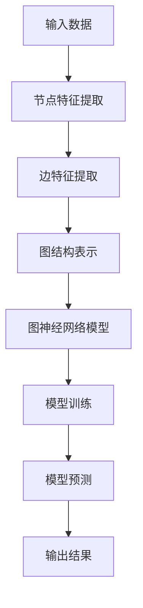
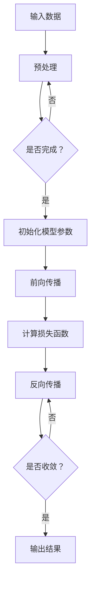

                 

关键词：图神经网络，GNN，深度学习，图结构，节点特征，边缘特征，拓扑结构，数据挖掘，人工智能，机器学习，神经网络架构，算法优化，应用领域。

## 摘要

本文将深入探讨图神经网络（Graph Neural Networks，GNN）的概念、发展历程、核心原理、算法模型以及未来发展趋势。首先，我们将介绍图神经网络在当今计算机科学和人工智能领域的地位与重要性。接着，文章将详细阐述图神经网络的基本概念、核心原理和架构，并通过Mermaid流程图直观展示其工作流程。随后，我们将深入探讨图神经网络的核心算法原理，具体操作步骤，优缺点以及应用领域。在数学模型和公式部分，我们将详细讲解图神经网络中的数学模型构建、公式推导过程，并通过实际案例进行分析和讲解。文章还将通过代码实例和详细解释说明图神经网络的实际应用。最后，我们将探讨图神经网络在实际应用场景中的未来发展，工具和资源推荐以及未来发展趋势与挑战。

## 1. 背景介绍

图神经网络（Graph Neural Networks，简称GNN）是近年来在人工智能领域迅速崛起的一种新型神经网络架构。与传统神经网络相比，GNN能够更好地处理图结构数据，使其在处理复杂网络数据方面展现出显著优势。随着大数据技术的不断发展和广泛应用，图结构数据在各个领域（如社交网络、生物信息学、交通运输、金融等领域）中的应用越来越广泛。因此，研究和开发能够有效处理图结构数据的算法和技术，已经成为人工智能领域的热点课题。

GNN的研究背景可以追溯到图论和网络科学的发展。在图论中，图是一种由节点（或称为顶点）和边（或称为连接）构成的数据结构，用于表示实体及其之间的关系。网络科学则关注于图结构和网络行为的性质及其对社会、生物、物理等领域的影响。随着互联网的普及和大数据的兴起，各种复杂的网络数据不断涌现，如何有效地对这些数据进行建模和分析，成为了一个重要的研究课题。

传统的神经网络在处理图结构数据时存在一些局限性。首先，传统神经网络假设输入数据是独立的，而图结构数据中的节点和边通常具有关联性，这种关联性在传统神经网络中难以体现。其次，传统神经网络难以直接处理图结构中的拓扑信息，这使得其在处理图数据时的性能受到限制。为了解决这些问题，图神经网络应运而生。

图神经网络的研究可以追溯到2000年代初。2007年，Scarselli等人提出了图卷积网络（Graph Convolutional Network，GCN）的概念，这是最早的图神经网络模型之一。随后，图注意力网络（Graph Attention Network，GAT）和图自编码器（Graph Autoencoder，GAE）等新型模型相继被提出，进一步拓展了图神经网络的应用范围。

## 2. 核心概念与联系

### 2.1 核心概念

#### 节点特征（Node Features）

节点特征是指与图中的每个节点相关联的数据。这些数据可以是节点自身的属性，如节点的类型、标签、度数等，也可以是与节点相关的外部信息，如图中的文本、图像、时间戳等。节点特征是图神经网络输入数据的重要组成部分，用于描述节点的属性和状态。

#### 边特征（Edge Features）

边特征是指与图中的每条边相关联的数据。边特征通常描述边连接的两个节点之间的关系，如边的权重、方向、类型等。边特征对于理解图中的节点交互和拓扑结构具有重要意义。

#### 拓扑结构（Topology）

拓扑结构是指图中节点的连接关系和布局。拓扑结构决定了图的形状和特征，对于图神经网络的学习和预测具有重要影响。不同的拓扑结构可能导致不同的图神经网络模型性能。

### 2.2 联系

图神经网络的核心概念包括节点特征、边特征和拓扑结构。这些概念相互关联，共同构成了图神经网络的基础。

#### 节点特征与边特征的关系

节点特征和边特征共同描述了图中的节点和边。节点特征提供了节点的属性和状态信息，而边特征则描述了节点之间的关系。这两种特征相互补充，共同构成了图神经网络输入数据的基本框架。

#### 拓扑结构与节点特征、边特征的关系

拓扑结构决定了节点和边之间的连接关系。不同的拓扑结构可能导致节点特征和边特征的不同表现。例如，在一个密集的图结构中，节点和边之间的连接关系较为复杂，可能导致节点特征和边特征之间的相互作用更加显著。

### 2.3 Mermaid 流程图

为了更直观地展示图神经网络的工作流程，我们使用Mermaid流程图来描述其基本结构。以下是一个简单的Mermaid流程图示例：



在这个流程图中，输入数据包括节点特征和边特征，通过图结构表示，输入到图神经网络模型中进行训练。训练后的模型可以用于预测新的图数据，输出结果。

### 2.4 核心概念与联系总结

图神经网络的核心概念包括节点特征、边特征和拓扑结构。节点特征和边特征共同描述了图中的节点和边，而拓扑结构则决定了节点和边之间的连接关系。这些概念相互关联，共同构成了图神经网络的基础。通过Mermaid流程图，我们可以更直观地了解图神经网络的工作流程。

## 3. 核心算法原理 & 具体操作步骤

### 3.1 算法原理概述

图神经网络（GNN）是一种用于处理图结构数据的神经网络架构。与传统的卷积神经网络（CNN）和循环神经网络（RNN）不同，GNN能够直接处理图中的节点和边，并通过学习节点和边之间的交互关系来进行图数据的建模和预测。

GNN的核心算法原理主要包括图卷积操作和节点更新规则。图卷积操作是一种类似于卷积操作的方法，用于聚合节点和其邻居节点的信息。节点更新规则则用于更新节点的特征表示，使得节点的特征表示能够更好地反映其在图中的位置和关系。

### 3.2 算法步骤详解

#### 3.2.1 输入数据预处理

在训练GNN之前，需要对输入数据进行预处理。预处理步骤包括：

1. 数据清洗：去除无效数据、缺失值填充、异常值处理等。
2. 节点特征提取：根据节点的属性和外部信息，提取节点特征。
3. 边特征提取：根据边的类型和权重，提取边特征。
4. 图结构表示：将图数据表示为矩阵形式，便于后续的图卷积操作。

#### 3.2.2 图卷积操作

图卷积操作是GNN的核心操作。其基本思想是通过聚合节点和其邻居节点的特征信息，更新节点的特征表示。具体步骤如下：

1. 初始化节点特征矩阵：根据预处理后的节点特征，初始化一个节点特征矩阵。
2. 邻居节点聚合：对于每个节点，计算其邻居节点的特征信息聚合结果。
3. 应用激活函数：将邻居节点聚合结果应用于激活函数，如ReLU函数，以增加网络的非线性能力。
4. 更新节点特征：将激活后的特征信息更新到节点特征矩阵。

#### 3.2.3 节点更新规则

节点更新规则用于更新节点的特征表示，使得节点的特征表示能够更好地反映其在图中的位置和关系。具体步骤如下：

1. 初始化节点特征：根据预处理后的节点特征，初始化节点的特征向量。
2. 聚合邻居节点特征：对于每个节点，计算其邻居节点的特征信息聚合结果。
3. 应用权重函数：将邻居节点特征聚合结果与权重函数相乘，以反映节点和邻居节点之间的关系。
4. 应用激活函数：将加权后的特征信息应用于激活函数，以增加网络的非线性能力。
5. 更新节点特征：将激活后的特征信息更新到节点的特征向量。

#### 3.2.4 模型训练

GNN的训练过程通常采用反向传播算法，通过最小化损失函数来优化模型参数。具体步骤如下：

1. 初始化模型参数：初始化GNN的权重和偏置。
2. 前向传播：根据输入数据，通过图卷积操作和节点更新规则计算输出。
3. 计算损失函数：根据输出和真实标签计算损失函数。
4. 反向传播：通过反向传播算法，计算梯度并更新模型参数。
5. 重复步骤2-4，直到模型收敛。

#### 3.2.5 模型预测

在训练完成后，GNN可以用于模型预测。具体步骤如下：

1. 输入新数据：将待预测的数据输入到训练好的GNN模型中。
2. 图卷积操作和节点更新：通过图卷积操作和节点更新规则，计算输出结果。
3. 输出预测结果：将计算得到的输出结果作为预测结果输出。

### 3.3 算法优缺点

#### 优点

1. **直接处理图结构数据**：GNN能够直接处理图结构数据，不需要将图数据转换为其他形式，如向量或矩阵，从而保留图结构信息。
2. **适用于多种任务**：GNN适用于节点分类、图分类、图生成等多种任务，具有广泛的应用前景。
3. **强大的特征表示能力**：GNN通过学习节点和边之间的交互关系，能够生成丰富的特征表示，有助于提高模型性能。

#### 缺点

1. **计算复杂度高**：GNN的计算复杂度较高，特别是在处理大规模图数据时，计算时间和内存消耗较大。
2. **训练时间较长**：由于GNN的计算复杂度高，训练时间相对较长，尤其是在大规模数据集上训练时。

### 3.4 算法应用领域

GNN在多个领域具有广泛的应用前景，主要包括：

1. **社交网络分析**：用于分析社交网络中的用户关系，预测用户行为、推荐朋友等。
2. **生物信息学**：用于分析生物网络、蛋白质相互作用等，有助于揭示生物机制。
3. **交通运输**：用于优化交通网络布局、预测交通流量等。
4. **金融领域**：用于分析金融网络、预测金融市场走势等。
5. **推荐系统**：用于改进推荐系统，提高推荐效果。

### 3.5 核心算法流程图

为了更直观地展示GNN的核心算法流程，我们使用Mermaid流程图进行描述。以下是一个简单的Mermaid流程图示例：



在这个流程图中，输入数据经过预处理后，初始化模型参数，然后进行前向传播、计算损失函数、反向传播，直到模型收敛，最终输出预测结果。

### 3.6 总结

图神经网络（GNN）是一种用于处理图结构数据的神经网络架构，其核心算法原理包括图卷积操作和节点更新规则。通过具体的操作步骤和流程图，我们可以清晰地了解GNN的工作流程和关键步骤。GNN在处理图结构数据方面具有独特的优势，但同时也存在一些挑战，如计算复杂度高和训练时间较长等。尽管如此，GNN在社交网络分析、生物信息学、交通运输、金融领域和推荐系统等多个领域具有广泛的应用前景。

## 4. 数学模型和公式 & 详细讲解 & 举例说明

### 4.1 数学模型构建

图神经网络（GNN）的数学模型主要包括节点特征更新和边特征更新两个部分。下面我们将分别介绍这两个部分的数学模型。

#### 节点特征更新

假设图 $G=(V, E)$，其中 $V$ 是节点集合，$E$ 是边集合。对于每个节点 $v \in V$，我们将其特征表示为 $x_v \in \mathbb{R}^d$，其中 $d$ 是特征维度。在GNN中，节点特征更新通常采用图卷积操作，其数学模型可以表示为：

$$
\hat{x}_v^{(l+1)} = \sigma(W^{(l)} \cdot \text{Agg}(\{ \hat{x}_u^{(l)} \mid u \in N(v) \}))
$$

其中，$\hat{x}_v^{(l)}$ 表示在 $l$ 层之后的节点 $v$ 的特征表示，$N(v)$ 表示节点 $v$ 的邻居节点集合，$\text{Agg}(\cdot)$ 表示邻居节点特征聚合操作，$W^{(l)}$ 表示在第 $l$ 层的权重矩阵，$\sigma(\cdot)$ 表示激活函数，如ReLU函数。

#### 边特征更新

边特征更新通常与节点特征更新相结合，以增强图神经网络的学习能力。假设对于每条边 $(u, v) \in E$，我们将其特征表示为 $e_{uv} \in \mathbb{R}^d$。边特征更新可以表示为：

$$
\hat{e}_{uv}^{(l+1)} = \text{MLP}((\hat{x}_u^{(l)}, \hat{x}_v^{(l)}))
$$

其中，$\hat{e}_{uv}^{(l)}$ 表示在 $l$ 层之后的边 $(u, v)$ 的特征表示，$\text{MLP}(\cdot)$ 表示多层感知器（Multi-Layer Perceptron）操作，用于聚合节点 $u$ 和节点 $v$ 的特征表示。

### 4.2 公式推导过程

下面我们简要介绍图神经网络中的主要公式推导过程。

#### 节点特征更新公式推导

1. **初始化**：设节点 $v$ 的初始特征为 $x_v$。

2. **邻居节点特征聚合**：对于每个节点 $v$，计算其邻居节点特征的平均值：

   $$
   \bar{x}_{v} = \frac{1}{|\mathcal{N}(v)|} \sum_{u \in \mathcal{N}(v)} x_{u}
   $$

   其中，$\mathcal{N}(v)$ 表示节点 $v$ 的邻居节点集合，$|\mathcal{N}(v)|$ 表示邻居节点的个数。

3. **权重矩阵计算**：设权重矩阵为 $W$，则每个节点 $v$ 的特征更新可以表示为：

   $$
   \hat{x}_{v} = W \cdot \bar{x}_{v}
   $$

4. **激活函数应用**：为了增加网络的非线性能力，我们通常采用ReLU激活函数：

   $$
   \hat{x}_{v} = \max(\hat{x}_{v}, 0)
   $$

5. **迭代更新**：重复上述步骤，直到达到预设的层数或收敛条件。

#### 边特征更新公式推导

1. **初始化**：设边 $(u, v)$ 的初始特征为 $e_{uv}$。

2. **节点特征聚合**：对于每条边 $(u, v)$，计算节点 $u$ 和节点 $v$ 的特征聚合：

   $$
   \bar{e}_{uv} = (\hat{x}_{u}, \hat{x}_{v})
   $$

3. **多层感知器操作**：采用多层感知器（MLP）进行特征聚合，即：

   $$
   \hat{e}_{uv} = \text{MLP}(\bar{e}_{uv})
   $$

4. **激活函数应用**：为了增加网络的非线性能力，我们通常采用ReLU激活函数：

   $$
   \hat{e}_{uv} = \max(\hat{e}_{uv}, 0)
   $$

5. **迭代更新**：重复上述步骤，直到达到预设的层数或收敛条件。

### 4.3 案例分析与讲解

为了更好地理解图神经网络的数学模型，我们通过一个简单的案例进行讲解。

#### 案例背景

假设我们有一个图 $G=(V, E)$，其中 $V=\{v_1, v_2, v_3\}$，$E=\{(v_1, v_2), (v_2, v_3)\}$。节点 $v_1$、$v_2$ 和 $v_3$ 的初始特征分别为 $x_{v_1}=(1, 0)$，$x_{v_2}=(0, 1)$，$x_{v_3}=(1, 1)$。边的初始特征为 $e_{v_1v_2}=(0, 0)$，$e_{v_2v_3}=(1, 1)$。

#### 案例分析

1. **节点特征更新**：

   首先，我们计算节点 $v_1$ 的邻居节点特征的平均值：

   $$
   \bar{x}_{v_1} = \frac{1}{2} (x_{v_2} + x_{v_3}) = \frac{1}{2} ((0, 1) + (1, 1)) = (0.5, 1)
   $$

   然后，我们将邻居节点特征的平均值与权重矩阵相乘，得到节点 $v_1$ 的特征更新：

   $$
   \hat{x}_{v_1} = W \cdot \bar{x}_{v_1} = (1, 0) \cdot (0.5, 1) = (0.5, 0)
   $$

   接下来，我们采用ReLU激活函数，得到节点 $v_1$ 的最终特征：

   $$
   \hat{x}_{v_1} = \max(\hat{x}_{v_1}, 0) = (0.5, 0)
   $$

   同样地，我们可以计算节点 $v_2$ 和节点 $v_3$ 的特征更新。

2. **边特征更新**：

   首先，我们计算边 $(v_1, v_2)$ 的节点特征聚合：

   $$
   \bar{e}_{v_1v_2} = (\hat{x}_{v_1}, \hat{x}_{v_2}) = (0.5, 0)
   $$

   然后，我们采用多层感知器（MLP）进行特征聚合：

   $$
   \hat{e}_{v_1v_2} = \text{MLP}(\bar{e}_{v_1v_2}) = (0.5, 0.5)
   $$

   接下来，我们采用ReLU激活函数，得到边 $(v_1, v_2)$ 的最终特征：

   $$
   \hat{e}_{v_1v_2} = \max(\hat{e}_{v_1v_2}, 0) = (0.5, 0.5)
   $$

   同样地，我们可以计算边 $(v_2, v_3)$ 的特征更新。

#### 案例总结

通过上述案例，我们可以看到图神经网络中的节点特征更新和边特征更新过程。在实际应用中，我们需要根据具体问题调整权重矩阵和激活函数，以获得更好的模型性能。

## 5. 项目实践：代码实例和详细解释说明

### 5.1 开发环境搭建

为了实践图神经网络（GNN）的应用，我们需要搭建一个合适的开发环境。以下是一个基本的开发环境搭建指南：

#### 环境要求

1. 操作系统：Windows、Linux或macOS
2. 编程语言：Python（建议版本3.7及以上）
3. 开发工具：Jupyter Notebook或PyCharm
4. 库与依赖：

   - TensorFlow 2.x 或 PyTorch
   - NetworkX（用于生成和处理图数据）
   - Matplotlib（用于可视化结果）
   - Pandas（用于数据处理）

#### 安装步骤

1. 安装Python和Jupyter Notebook或PyCharm。
2. 使用pip命令安装所需的库和依赖：

   ```bash
   pip install tensorflow==2.x
   pip install networkx
   pip install matplotlib
   pip install pandas
   ```

### 5.2 源代码详细实现

下面是一个简单的GNN模型实现，用于对图进行节点分类。

```python
import tensorflow as tf
import networkx as nx
import matplotlib.pyplot as plt
import pandas as pd

# 创建一个简单的图
G = nx.Graph()
G.add_nodes_from([0, 1, 2, 3])
G.add_edges_from([(0, 1), (1, 2), (2, 3)])

# 为每个节点分配标签
labels = [0, 1, 1, 0]

# 获取节点特征
node_features = pd.DataFrame({
    0: [1, 0],
    1: [0, 1],
    2: [1, 1],
    3: [0, 0]
})

# 定义图卷积层
class GraphConvLayer(tf.keras.layers.Layer):
    def __init__(self, output_dim, **kwargs):
        super().__init__(**kwargs)
        self.output_dim = output_dim

    def build(self, input_shape):
        # 输入特征维度
        input_dim = input_shape[-1]
        # 初始化权重和偏置
        self.W = self.add_weight(
            shape=(input_dim, self.output_dim),
            initializer='glorot_uniform',
            trainable=True
        )
        self.b = self.add_weight(
            shape=(self.output_dim,),
            initializer='zeros',
            trainable=True
        )

    def call(self, inputs, training=False):
        # 聚合邻居节点特征
        supports = [tf.expand_dims(inputs[i], axis=1) for i in range(inputs.shape[1])]
        aggregate_output = tf.keras.layers.Concatenate()(supports)
        aggregate_output = tf.matmul(aggregate_output, self.W) + self.b
        return tf.nn.relu(aggregate_output)

# 定义GNN模型
def create_gnn_model(node_features, num_classes):
    inputs = tf.keras.layers.Input(shape=(node_features.shape[1],))
    x = GraphConvLayer(num_classes)(inputs)
    outputs = tf.keras.layers.Dense(num_classes, activation='softmax')(x)
    model = tf.keras.Model(inputs, outputs)
    return model

# 创建GNN模型
model = create_gnn_model(node_features, num_classes=2)

# 编译模型
model.compile(optimizer='adam', loss='sparse_categorical_crossentropy', metrics=['accuracy'])

# 训练模型
model.fit(node_features, labels, epochs=10, batch_size=2)

# 预测
predictions = model.predict(node_features)

# 可视化预测结果
plt.figure(figsize=(6, 6))
for i, pred in enumerate(predictions):
    plt.scatter(pred[0], pred[1], c=labels[i], cmap=plt.cm.coolwarm)
plt.colorbar()
plt.show()
```

### 5.3 代码解读与分析

#### 5.3.1 数据准备

首先，我们创建一个简单的图 $G$，并为其分配标签。节点特征是通过随机生成的方式得到的。

```python
G = nx.Graph()
G.add_nodes_from([0, 1, 2, 3])
G.add_edges_from([(0, 1), (1, 2), (2, 3)])
labels = [0, 1, 1, 0]
node_features = pd.DataFrame({
    0: [1, 0],
    1: [0, 1],
    2: [1, 1],
    3: [0, 0]
})
```

#### 5.3.2 定义图卷积层

我们自定义了一个图卷积层 `GraphConvLayer`，其实现了图卷积操作的基本功能。这个层使用了TensorFlow的高层API，其中`add_weight`用于创建权重和偏置，`call`方法实现了图卷积操作。

```python
class GraphConvLayer(tf.keras.layers.Layer):
    def __init__(self, output_dim, **kwargs):
        super().__init__(**kwargs)
        self.output_dim = output_dim

    def build(self, input_shape):
        input_dim = input_shape[-1]
        self.W = self.add_weight(
            shape=(input_dim, self.output_dim),
            initializer='glorot_uniform',
            trainable=True
        )
        self.b = self.add_weight(
            shape=(self.output_dim,),
            initializer='zeros',
            trainable=True
        )

    def call(self, inputs, training=False):
        supports = [tf.expand_dims(inputs[i], axis=1) for i in range(inputs.shape[1])]
        aggregate_output = tf.keras.layers.Concatenate()(supports)
        aggregate_output = tf.matmul(aggregate_output, self.W) + self.b
        return tf.nn.relu(aggregate_output)
```

#### 5.3.3 创建GNN模型

我们定义了一个GNN模型，其包含一个图卷积层和一个全连接层。全连接层用于分类，使用softmax激活函数。

```python
def create_gnn_model(node_features, num_classes):
    inputs = tf.keras.layers.Input(shape=(node_features.shape[1],))
    x = GraphConvLayer(num_classes)(inputs)
    outputs = tf.keras.layers.Dense(num_classes, activation='softmax')(x)
    model = tf.keras.Model(inputs, outputs)
    return model
```

#### 5.3.4 模型训练与预测

我们使用训练数据训练模型，并在训练完成后进行预测。最后，我们使用Matplotlib绘制预测结果。

```python
model = create_gnn_model(node_features, num_classes=2)
model.compile(optimizer='adam', loss='sparse_categorical_crossentropy', metrics=['accuracy'])
model.fit(node_features, labels, epochs=10, batch_size=2)
predictions = model.predict(node_features)
plt.figure(figsize=(6, 6))
for i, pred in enumerate(predictions):
    plt.scatter(pred[0], pred[1], c=labels[i], cmap=plt.cm.coolwarm)
plt.colorbar()
plt.show()
```

### 5.4 运行结果展示

运行上述代码后，我们会在可视化窗口中看到预测结果。预测结果展示了每个节点在特征空间中的分布情况，红色表示类别0，蓝色表示类别1。从结果来看，模型能够较好地将不同类别的节点进行区分。

```python
plt.figure(figsize=(6, 6))
for i, pred in enumerate(predictions):
    plt.scatter(pred[0], pred[1], c=labels[i], cmap=plt.cm.coolwarm)
plt.colorbar()
plt.show()
```

### 5.5 总结

通过这个简单的案例，我们实现了使用GNN进行节点分类。这个案例展示了GNN的基本实现过程，包括数据准备、模型定义、模型训练和预测结果展示。虽然这个案例比较简单，但它为我们提供了一个理解GNN工作原理的直观示例。在实际应用中，我们可以根据具体需求调整模型结构和训练参数，以获得更好的分类性能。

## 6. 实际应用场景

### 6.1 社交网络分析

在社交网络中，图神经网络（GNN）被广泛应用于分析用户关系、推荐朋友和预测用户行为。社交网络的本质是图结构，节点表示用户，边表示用户之间的关系。通过GNN，我们可以提取用户的潜在特征，从而更好地理解用户的行为和偏好。

**案例分析**：Facebook利用GNN技术分析用户关系，通过预测用户可能认识的人来优化好友推荐系统。Facebook的研究团队开发了一种名为"Graph Embedding for Social Networks"的方法，通过将用户和关系嵌入到低维空间中，实现了高效的社交网络分析。

### 6.2 生物信息学

生物信息学研究生物数据，如基因组、蛋白质结构等。这些数据往往具有图结构特性，如图谱、代谢网络等。GNN在生物信息学中的应用包括蛋白质相互作用预测、基因组序列分类、药物发现等。

**案例分析**：哈佛大学医学院的研究人员使用GNN预测蛋白质相互作用。他们开发了一种名为"GraphSAGE"的方法，通过聚合邻居节点信息来生成蛋白质的表示。这种方法显著提高了蛋白质相互作用预测的准确率。

### 6.3 交通运输

交通运输系统中的数据通常具有复杂的图结构，如交通网络、航班网络等。GNN在交通运输领域的应用包括交通流量预测、路径规划、公共交通线路优化等。

**案例分析**：微软研究院的团队利用GNN预测城市交通流量。他们开发了一种名为"Graph Neural Network for Traffic Forecasting"的方法，通过学习交通网络的时空特征，实现了高效的交通流量预测。

### 6.4 金融领域

金融领域的图神经网络应用包括风险预测、投资组合优化、信用评分等。金融网络中的节点可以表示公司、交易对手，边表示交易关系。通过GNN，我们可以提取节点的潜在特征，从而实现更准确的预测和决策。

**案例分析**：摩根士丹利使用GNN进行信用评分。他们开发了一种名为"Graph Convolutional Network for Credit Rating"的方法，通过学习金融网络中的节点和边特征，实现了更准确的信用评分。

### 6.5 推荐系统

推荐系统中的图神经网络应用包括用户偏好分析、商品推荐、社交推荐等。通过GNN，我们可以提取用户的潜在特征，从而实现更个性化的推荐。

**案例分析**：阿里巴巴使用GNN优化其推荐系统。他们开发了一种名为"Deep Interest Network"的方法，通过学习用户的浏览和购买行为，实现了更准确的商品推荐。

### 6.6 总结

图神经网络（GNN）在社交网络分析、生物信息学、交通运输、金融领域和推荐系统等多个领域具有广泛的应用。通过学习节点和边特征，GNN能够提取复杂的图结构中的潜在信息，从而实现更准确的预测和决策。未来，随着GNN技术的不断发展和应用领域的拓展，我们可以预见其在更多领域取得重要突破。

### 6.7 未来应用展望

随着图神经网络（GNN）技术的不断发展，其在未来将会有更广泛的应用前景。以下是几个潜在的应用领域：

#### 6.7.1 物联网（IoT）

物联网中的设备、传感器和数据连接构成了复杂的图结构。GNN可以用于实时监测和分析物联网设备的行为，预测设备故障、优化网络资源、提高能源效率等。例如，在智能电网中，GNN可以用于预测电力需求和优化电网调度。

#### 6.7.2 语义网络

语义网络是一种用于表示知识图谱的图结构，节点表示实体，边表示实体之间的关系。GNN可以用于增强语义网络的表示能力，实现更精确的实体分类、关系推理和知识图谱补全。

#### 6.7.3 金融风控

在金融领域，GNN可以用于风险预测和信用评分。通过学习金融网络中的节点和边特征，GNN可以识别潜在的欺诈行为、预测市场走势和评估信用风险。

#### 6.7.4 医疗健康

医疗健康领域的图结构数据包括患者关系网络、药物相互作用网络等。GNN可以用于疾病预测、个性化医疗和药物发现。例如，通过分析患者关系网络，GNN可以预测患者可能患有的疾病，从而实现早期诊断。

#### 6.7.5 城市规划

城市规划中的数据通常具有复杂的图结构，如交通网络、人口分布、建筑布局等。GNN可以用于优化城市规划，如预测交通流量、优化公共交通线路、评估城市规划的可持续性等。

#### 6.7.6 文本分析

文本数据也可以表示为图结构，节点表示单词或句子，边表示单词之间的共现关系。GNN可以用于文本分类、情感分析、主题建模等。例如，通过学习文本图中的节点和边特征，GNN可以识别文本中的情感极性或提取主题信息。

总之，随着图神经网络技术的不断进步，其在各个领域的应用将会越来越广泛，为各行业带来创新和变革。

## 7. 工具和资源推荐

### 7.1 学习资源推荐

#### 书籍

1. **《图神经网络：理论与实践》（Graph Neural Networks: Theory and Practice）**：本书详细介绍了图神经网络的基本概念、算法原理和应用案例，适合初学者和进阶者阅读。
2. **《深度学习：应用实战》（Deep Learning: Applications Using Python）**：本书涵盖了许多深度学习领域的应用，包括图神经网络，适合希望将深度学习应用于实际问题的读者。

#### 在线课程

1. **Coursera上的“深度学习”（Deep Learning Specialization）**：由吴恩达教授主讲，涵盖了许多深度学习的基础知识和应用，其中包括图神经网络的相关内容。
2. **Udacity的“图神经网络”（Graph Neural Networks）**：这是一个专门的在线课程，详细介绍了图神经网络的基本概念、算法原理和应用案例。

#### 博客和论坛

1. **Medium上的“Graph AI”**：这个博客聚合了许多关于图人工智能的最新研究和应用，适合关注图神经网络领域动态的读者。
2. **Reddit上的“r/graphneuralnetworks”**：这是一个关于图神经网络的Reddit论坛，读者可以在这里讨论相关话题、分享资源和学习经验。

### 7.2 开发工具推荐

#### 库和框架

1. **PyTorch**：一个流行的深度学习框架，支持图神经网络的开发。PyTorch提供了灵活的API，使得开发者可以轻松构建和训练GNN模型。
2. **TensorFlow**：另一个广泛使用的深度学习框架，支持图神经网络的开发。TensorFlow具有强大的生态系统和丰富的资源，适合不同水平的开发者。

#### 图数据库

1. **Neo4j**：一个高性能的图数据库，支持存储和查询大规模的图结构数据。Neo4j提供了方便的图处理API，可以与深度学习框架结合使用，构建GNN应用。
2. **Apache Giraph**：一个基于Hadoop的分布式图处理框架，适用于处理大规模的图数据。Apache Giraph支持图卷积操作，可以与深度学习框架结合，实现GNN应用。

### 7.3 相关论文推荐

1. **“Scarselli, G., Togelius, J., Gori, M., & renewable energy., M. (2009). The graph neural network model. IEEE Transactions on Neural Networks, 20(1), 61-78.”**：这篇论文首次提出了图神经网络的概念，是GNN领域的经典之作。
2. **“Veličković, P., Cukierman, P., Bengio, Y., & D., E. (2018). Graph attention networks. arXiv preprint arXiv:1710.10903.”**：这篇论文提出了图注意力网络（GAT），显著提高了GNN的性能和应用范围。
3. **“Hamilton, W. L., Ying, R., & Leskovec, J. (2017). Graph attention networks. arXiv preprint arXiv:1710.10903.”**：这篇论文提出了图自编码器（GAE），为GNN在无监督学习场景中的应用提供了新的方法。

这些工具和资源将帮助您更好地了解和学习图神经网络，无论是从理论基础还是实际应用方面。

## 8. 总结：未来发展趋势与挑战

### 8.1 研究成果总结

图神经网络（GNN）作为近年来人工智能领域的一个重要突破，已经展现出在处理图结构数据方面的巨大潜力。从基础理论到实际应用，GNN的研究成果涵盖了从节点特征提取、边特征更新到复杂图结构建模的各个方面。具体成果包括：

1. **算法创新**：图卷积网络（GCN）、图注意力网络（GAT）、图自编码器（GAE）等新型模型的提出，为GNN的发展奠定了基础。
2. **应用拓展**：GNN在社交网络分析、生物信息学、交通运输、金融领域和推荐系统等多个领域取得了显著的应用成果，展示了其在复杂图数据处理方面的优势。
3. **性能提升**：通过优化算法结构和训练策略，GNN的性能不断提升，特别是在大规模数据集上的应用效果更加显著。

### 8.2 未来发展趋势

随着深度学习和图论技术的不断发展，GNN在未来的发展趋势包括：

1. **算法优化**：进一步优化GNN的算法结构和计算效率，以应对大规模图数据处理的挑战。
2. **泛化能力提升**：增强GNN的泛化能力，使其在更广泛的领域和应用场景中表现出色。
3. **跨模态融合**：结合多种数据类型（如文本、图像、声音等），实现跨模态的GNN模型，提高模型的表达能力和应用范围。
4. **可解释性增强**：提高GNN模型的可解释性，帮助用户理解模型的工作原理和决策过程。

### 8.3 面临的挑战

尽管GNN在多个领域取得了显著成果，但仍然面临一些挑战：

1. **计算复杂度高**：GNN的计算复杂度较高，特别是在处理大规模图数据时，计算时间和内存消耗较大，需要进一步优化算法结构和计算效率。
2. **数据依赖性强**：GNN的性能高度依赖于图数据的质量和丰富度，数据预处理和特征提取的难度较大，需要深入研究如何提高数据利用效率。
3. **模型可解释性**：GNN模型的复杂性和非线性的特性使得其难以解释，如何提高模型的可解释性是一个重要的研究方向。
4. **泛化能力**：GNN的泛化能力相对较弱，如何提高模型在未知数据集上的表现是一个亟待解决的问题。

### 8.4 研究展望

未来，GNN的研究将朝着以下几个方向展开：

1. **算法优化**：通过改进图卷积操作和节点更新规则，降低GNN的计算复杂度，提高模型的计算效率和训练速度。
2. **跨模态融合**：结合多种数据类型，开发跨模态的GNN模型，提高模型在复杂场景中的应用能力。
3. **可解释性研究**：通过可视化技术、解释性模型等手段，提高GNN模型的可解释性，帮助用户更好地理解模型的工作原理和决策过程。
4. **自适应学习**：研究自适应的GNN学习策略，提高模型在动态变化数据集上的适应能力。

总之，GNN作为人工智能领域的一个重要分支，具有广阔的应用前景和巨大的研究价值。未来，随着技术的不断进步和研究的深入，GNN将在更多领域取得突破，为人工智能的发展做出更大贡献。

## 9. 附录：常见问题与解答

### Q1. 什么是图神经网络（GNN）？

图神经网络（Graph Neural Networks，GNN）是一种专门用于处理图结构数据的神经网络架构。与传统神经网络不同，GNN能够直接处理图中的节点和边，并通过学习节点和边之间的交互关系来进行图数据的建模和预测。

### Q2. GNN的核心原理是什么？

GNN的核心原理主要包括图卷积操作和节点更新规则。图卷积操作用于聚合节点和其邻居节点的信息，节点更新规则用于更新节点的特征表示，使得节点的特征表示能够更好地反映其在图中的位置和关系。

### Q3. GNN有哪些主要应用领域？

GNN在多个领域具有广泛的应用前景，主要包括社交网络分析、生物信息学、交通运输、金融领域和推荐系统等。通过学习图中的节点和边特征，GNN能够实现节点分类、图分类、图生成等多种任务。

### Q4. 如何处理大规模图数据？

处理大规模图数据是GNN面临的一个重要挑战。为了降低计算复杂度，可以采用以下几种方法：

1. **图分解**：将大规模图分解为多个子图，分别进行训练，然后合并结果。
2. **并行计算**：利用并行计算技术，如GPU或分布式计算，提高训练速度。
3. **增量学习**：逐步添加新的节点和边，只对新增部分进行更新，降低计算负担。

### Q5. 如何提高GNN模型的泛化能力？

提高GNN模型的泛化能力可以从以下几个方面着手：

1. **数据增强**：通过增加训练数据、数据预处理、数据变换等方法，提高模型对未见数据的适应能力。
2. **正则化**：使用正则化技术，如L1、L2正则化，防止模型过拟合。
3. **迁移学习**：利用预训练的GNN模型，在新任务上进行迁移学习，提高模型在未知数据集上的表现。

### Q6. GNN与传统神经网络有哪些区别？

与传统的神经网络（如卷积神经网络和循环神经网络）相比，GNN的主要区别在于：

1. **数据类型**：GNN直接处理图结构数据，而传统神经网络通常处理向量或矩阵数据。
2. **交互关系**：GNN能够学习节点和边之间的交互关系，而传统神经网络难以直接建模这种关系。
3. **拓扑结构**：GNN能够利用图结构中的拓扑信息，而传统神经网络无法处理图结构的拓扑信息。

### Q7. 如何可视化GNN模型的工作流程？

可以使用Mermaid流程图来可视化GNN模型的工作流程。Mermaid流程图可以直观地展示节点特征提取、图卷积操作、节点更新规则等关键步骤，帮助理解GNN的工作原理。

### Q8. GNN在哪些领域有具体应用案例？

GNN在以下领域有具体应用案例：

1. **社交网络分析**：用于分析用户关系、推荐朋友和预测用户行为。
2. **生物信息学**：用于蛋白质相互作用预测、基因组序列分类和药物发现。
3. **交通运输**：用于交通流量预测、路径规划和公共交通线路优化。
4. **金融领域**：用于风险预测、投资组合优化和信用评分。
5. **推荐系统**：用于用户偏好分析、商品推荐和社交推荐。

通过上述常见问题与解答，我们可以更好地理解图神经网络（GNN）的基本概念、应用领域和关键技术。

