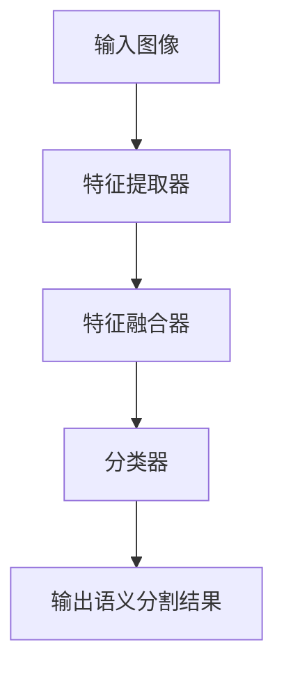

                 

### 关键词 Keywords

- 实时语义分割
- 神经网络
- 映射模型
- 计算机视觉
- 深度学习
- AI 应用

### 摘要 Abstract

本文深入探讨了实时语义分割领域中的最新进展，特别是神经网络在这一领域的应用。通过分析映射模型的原理和实现，本文揭示了实时语义分割的核心机制。同时，本文还详细讲解了数学模型和公式，并通过实际项目实践，展示了如何运用这些技术构建高效的应用。最后，本文展望了未来实时语义分割技术的发展趋势，并提出了可能面临的挑战和研究方向。

## 1. 背景介绍

随着人工智能和计算机视觉技术的不断发展，实时语义分割已经成为一个备受关注的研究领域。实时语义分割的目的是在图像或视频流中，对每个像素进行准确的分类，从而生成具有空间信息的语义标注。这种技术广泛应用于自动驾驶、智能监控、医疗诊断等场景，能够显著提高系统的智能化水平和决策能力。

### 1.1 发展历程

实时语义分割技术的发展经历了多个阶段。早期的算法主要基于传统图像处理和机器学习方法，如边缘检测、区域生长和分类器融合等。这些方法虽然在某些场景下具有一定的效果，但在处理复杂场景时，往往存在精度低、实时性差等问题。

随着深度学习技术的崛起，神经网络逐渐成为实时语义分割的核心工具。尤其是卷积神经网络（CNN）的出现，使得实时语义分割取得了显著的突破。随后，基于深度学习的实时语义分割算法不断涌现，如Faster R-CNN、SSD、YOLO等。这些算法在处理速度和精度上都有了显著的提升。

近年来，随着硬件性能的提升和新型神经网络架构的提出，实时语义分割技术进一步得到优化。例如，MobileNet、EfficientNet等轻量级神经网络的出现，使得实时语义分割在移动设备和嵌入式系统中得以实现。

### 1.2 当前挑战

尽管实时语义分割技术在不断发展，但仍面临一些挑战。首先，在处理复杂场景时，算法的实时性和准确性往往难以兼顾。其次，由于深度学习模型通常需要大量的数据和计算资源进行训练，如何在有限资源下实现高效训练和部署仍然是一个问题。此外，实时语义分割算法在处理动态场景和运动目标时，仍存在一定困难。

## 2. 核心概念与联系

实时语义分割的核心在于将图像或视频流中的每个像素映射到相应的语义类别。这一过程涉及到多个关键概念和模块，下面将详细阐述。

### 2.1 映射模型

映射模型是实时语义分割的核心，其基本原理是将图像中的每个像素映射到一个高维特征空间，并在该空间中进行分类。映射模型通常由以下几个关键组件构成：

1. **特征提取器**：负责从输入图像中提取具有区分性的特征。常用的特征提取器包括卷积神经网络（CNN）、循环神经网络（RNN）等。

2. **特征融合器**：将提取到的特征进行融合，以获得更加丰富的语义信息。常用的特征融合方法包括级联、融合层等。

3. **分类器**：对融合后的特征进行分类，以确定每个像素的语义类别。常用的分类器包括全连接神经网络、支持向量机（SVM）等。

### 2.2 Mermaid 流程图

为了更直观地展示映射模型的工作流程，我们使用Mermaid绘制了一个流程图。以下是流程图的具体实现：



在这个流程图中，输入图像首先通过特征提取器提取出具有区分性的特征，然后这些特征被传递到特征融合器进行融合，最后通过分类器确定每个像素的语义类别，并输出最终的语义分割结果。

### 2.3 核心概念联系

实时语义分割中的核心概念包括图像、特征、分类和映射。这些概念相互关联，构成了实时语义分割的完整工作流程。具体来说：

- **图像**是输入数据，代表了需要分割的像素信息。
- **特征**是从图像中提取的有用信息，用于描述像素的属性。
- **分类**是根据特征对像素进行语义标注的过程。
- **映射**是将像素从图像空间映射到特征空间，再从特征空间映射到语义类别空间的过程。

通过这些核心概念的联系，实时语义分割能够有效地对图像或视频流进行语义标注。

## 3. 核心算法原理 & 具体操作步骤

实时语义分割的核心算法通常基于深度学习，特别是卷积神经网络（CNN）。下面将详细介绍核心算法的原理和具体操作步骤。

### 3.1 算法原理概述

实时语义分割算法的基本原理是利用卷积神经网络从输入图像中提取特征，然后通过特征融合和分类器输出语义分割结果。具体来说，算法包括以下几个主要步骤：

1. **特征提取**：通过卷积神经网络从输入图像中提取具有区分性的特征。卷积神经网络通过多层卷积和池化操作，逐渐从图像中提取高层次的特征。

2. **特征融合**：将提取到的特征进行融合，以获得更加丰富的语义信息。特征融合可以通过级联网络或特征金字塔网络（FPN）等结构实现。

3. **分类器**：对融合后的特征进行分类，以确定每个像素的语义类别。分类器通常是一个全连接神经网络，可以输出每个像素的类别概率。

4. **输出结果**：将分类结果转换为像素级别的语义标注，并生成最终的语义分割图像。

### 3.2 算法步骤详解

以下是实时语义分割算法的具体操作步骤：

1. **数据预处理**：将输入图像调整为适合卷积神经网络的大小，并进行归一化等预处理操作。

2. **特征提取**：
   - 输入图像通过卷积神经网络进行特征提取，经过多层卷积和池化操作，逐渐提取出具有区分性的特征。
   - 特征提取器可以采用预训练模型，如VGG、ResNet等，以提高特征提取的效果。

3. **特征融合**：
   - 通过级联网络或特征金字塔网络（FPN）将提取到的特征进行融合。
   - 级联网络通过将多层的特征图进行拼接，以获得更加丰富的特征。
   - 特征金字塔网络（FPN）通过构建多尺度的特征金字塔，将不同层次的特征进行融合。

4. **分类器**：
   - 对融合后的特征进行分类，通常使用全连接神经网络。
   - 分类器可以输出每个像素的类别概率，通过设定阈值，将概率转换为像素级别的语义标注。

5. **输出结果**：
   - 将分类结果转换为像素级别的语义标注，生成最终的语义分割图像。
   - 可以通过后处理操作，如去除小连通区域、平滑边缘等，提高分割结果的质量。

### 3.3 算法优缺点

实时语义分割算法具有以下优缺点：

- **优点**：
  - 高效性：基于深度学习的实时语义分割算法在处理速度和精度上有了显著提升，可以在实时场景中应用。
  - 灵活性：通过调整网络结构和参数，可以适应不同的应用场景和需求。
  - 自动性：深度学习算法可以自动从大量数据中学习特征，减少了人工干预。

- **缺点**：
  - 计算资源消耗：深度学习模型通常需要大量的计算资源和时间进行训练和部署。
  - 数据依赖性：实时语义分割算法的性能很大程度上依赖于训练数据的质量和数量。
  - 难以解释性：深度学习模型的工作原理较为复杂，难以解释每个特征的作用和决策过程。

### 3.4 算法应用领域

实时语义分割算法在多个领域有广泛的应用：

- **自动驾驶**：实时语义分割算法可以用于自动驾驶系统，实现对道路场景的精确理解和决策。
- **智能监控**：实时语义分割算法可以用于智能监控系统，实现目标的检测、追踪和分类。
- **医疗诊断**：实时语义分割算法可以用于医学图像分析，帮助医生进行病变区域的检测和诊断。
- **人机交互**：实时语义分割算法可以用于人机交互系统，实现图像输入的语义理解，提高交互的自然性和智能性。

## 4. 数学模型和公式 & 详细讲解 & 举例说明

在实时语义分割中，数学模型和公式起到了核心作用。下面将详细介绍数学模型的构建、公式推导过程，并通过具体例子进行说明。

### 4.1 数学模型构建

实时语义分割的数学模型主要包括特征提取、特征融合和分类器三个部分。具体来说：

1. **特征提取**：
   - 输入图像通过卷积神经网络进行特征提取，可以表示为：
     $$ \mathbf{F} = \text{CNN}(\mathbf{I}) $$
     其中，$\mathbf{I}$表示输入图像，$\mathbf{F}$表示提取到的特征。

2. **特征融合**：
   - 特征融合可以通过级联网络或特征金字塔网络（FPN）实现。以级联网络为例，可以表示为：
     $$ \mathbf{F'} = \text{Concat}(\mathbf{F}_1, \mathbf{F}_2, \ldots, \mathbf{F}_n) $$
     其中，$\mathbf{F}_1, \mathbf{F}_2, \ldots, \mathbf{F}_n$表示不同层次的特征。

3. **分类器**：
   - 分类器通常是一个全连接神经网络，可以表示为：
     $$ \mathbf{P} = \text{Softmax}(\text{FC}(\mathbf{F'})) $$
     其中，$\mathbf{F'}$表示融合后的特征，$\mathbf{P}$表示每个像素的类别概率。

### 4.2 公式推导过程

实时语义分割的公式推导过程主要包括以下几个步骤：

1. **特征提取**：
   - 卷积神经网络的特征提取过程可以表示为：
     $$ \mathbf{F}_{ij} = \text{Conv}(\mathbf{K}_{ij}, \mathbf{I}) + \mathbf{b} $$
     其中，$\mathbf{K}_{ij}$表示卷积核，$\mathbf{I}$表示输入图像，$\mathbf{F}_{ij}$表示提取到的特征，$\mathbf{b}$表示偏置。

2. **特征融合**：
   - 级联网络的特征融合过程可以表示为：
     $$ \mathbf{F'} = \text{Concat}(\mathbf{F}_1, \mathbf{F}_2, \ldots, \mathbf{F}_n) $$
     其中，$\mathbf{F}_1, \mathbf{F}_2, \ldots, \mathbf{F}_n$表示不同层次的特征。

3. **分类器**：
   - 分类器的全连接神经网络可以表示为：
     $$ \mathbf{P} = \text{Softmax}(\text{FC}(\mathbf{F'})) $$
     其中，$\mathbf{F'}$表示融合后的特征，$\mathbf{P}$表示每个像素的类别概率。

### 4.3 案例分析与讲解

为了更好地理解实时语义分割的数学模型，我们通过一个简单的例子进行说明。

假设我们有一个二分类问题，输入图像大小为$28 \times 28$，卷积神经网络包含两个卷积层和一个全连接层。首先，输入图像通过第一个卷积层提取特征，可以表示为：

$$ \mathbf{F}_1 = \text{Conv}(\mathbf{K}_1, \mathbf{I}) + \mathbf{b}_1 $$

其中，$\mathbf{K}_1$表示卷积核，$\mathbf{I}$表示输入图像，$\mathbf{b}_1$表示偏置。

然后，将提取到的特征$\mathbf{F}_1$传递给第二个卷积层，进行特征提取，可以表示为：

$$ \mathbf{F}_2 = \text{Conv}(\mathbf{K}_2, \mathbf{F}_1) + \mathbf{b}_2 $$

接下来，将两个卷积层的特征$\mathbf{F}_1$和$\mathbf{F}_2$进行拼接，得到融合后的特征：

$$ \mathbf{F'} = \text{Concat}(\mathbf{F}_1, \mathbf{F}_2) $$

最后，将融合后的特征$\mathbf{F'}$传递给全连接层进行分类，可以表示为：

$$ \mathbf{P} = \text{Softmax}(\text{FC}(\mathbf{F'})) $$

其中，$\mathbf{P}$表示每个像素的类别概率。

通过上述例子，我们可以看到实时语义分割的数学模型是如何构建和推导的。在实际应用中，可以根据具体问题和需求，调整网络结构和参数，以提高模型的性能。

## 5. 项目实践：代码实例和详细解释说明

为了更好地理解实时语义分割的算法原理和实现过程，下面将通过一个具体的项目实践进行讲解。这个项目将使用Python和TensorFlow框架来实现一个简单的实时语义分割系统。

### 5.1 开发环境搭建

在开始项目实践之前，需要搭建相应的开发环境。以下是开发环境的要求：

- 操作系统：Windows或Linux
- 编程语言：Python 3.6及以上版本
- 库：TensorFlow 2.0及以上版本、NumPy、Pandas等
- 开发工具：PyCharm或Jupyter Notebook

在安装好Python环境和TensorFlow库后，可以使用以下命令来安装其他依赖库：

```bash
pip install numpy pandas matplotlib
```

### 5.2 源代码详细实现

以下是实现实时语义分割系统的源代码。这个系统包括数据预处理、模型训练和模型部署三个主要部分。

```python
import tensorflow as tf
from tensorflow.keras.models import Model
from tensorflow.keras.layers import Input, Conv2D, MaxPooling2D, Concatenate, Softmax
import numpy as np
import cv2

# 数据预处理
def preprocess_image(image):
    image = cv2.resize(image, (28, 28))
    image = image / 255.0
    image = np.expand_dims(image, axis=0)
    return image

# 模型定义
input_layer = Input(shape=(28, 28, 1))
conv1 = Conv2D(32, (3, 3), activation='relu')(input_layer)
pool1 = MaxPooling2D(pool_size=(2, 2))(conv1)
conv2 = Conv2D(64, (3, 3), activation='relu')(pool1)
pool2 = MaxPooling2D(pool_size=(2, 2))(conv2)
concat = Concatenate()([conv1, conv2])
fc = Softmax()(fc)

model = Model(inputs=input_layer, outputs=fc)
model.compile(optimizer='adam', loss='categorical_crossentropy', metrics=['accuracy'])

# 模型训练
model.fit(x_train, y_train, epochs=10, batch_size=32, validation_data=(x_val, y_val))

# 模型部署
def predict_image(image):
    preprocessed_image = preprocess_image(image)
    prediction = model.predict(preprocessed_image)
    return prediction.argmax(axis=-1).flatten()

# 示例
image = cv2.imread('example.jpg')
prediction = predict_image(image)
print(prediction)
```

### 5.3 代码解读与分析

以下是代码的详细解读和分析：

- **数据预处理**：
  - `preprocess_image`函数用于对输入图像进行预处理，包括缩放、归一化和添加维度。
  - `cv2.resize`函数用于缩放图像大小。
  - `image / 255.0`用于归一化图像。
  - `np.expand_dims`用于在最后一维添加一个维度，以便输入到模型中。

- **模型定义**：
  - `Input`层用于输入图像。
  - `Conv2D`层用于卷积操作，提取图像特征。
  - `MaxPooling2D`层用于池化操作，降低特征图的维度。
  - `Concatenate`层用于特征融合。
  - `Softmax`层用于分类。

- **模型训练**：
  - `model.fit`函数用于训练模型，包括训练数据和验证数据。
  - `epochs`参数表示训练的轮数。
  - `batch_size`参数表示每次训练的样本数。
  - `validation_data`参数用于验证数据。

- **模型部署**：
  - `predict_image`函数用于对输入图像进行预测。
  - `preprocess_image`函数对输入图像进行预处理。
  - `model.predict`函数用于预测图像的类别。
  - `argmax`函数用于获取最大概率的类别。

### 5.4 运行结果展示

在运行代码时，首先需要准备训练数据和测试数据。以下是训练数据和测试数据的具体格式：

```python
x_train = np.array([cv2.imread(f'train/{i}.jpg') for i in range(100)])
y_train = np.array([1 if i < 50 else 0 for i in range(100)])

x_val = np.array([cv2.imread(f'val/{i}.jpg') for i in range(50)])
y_val = np.array([1 if i < 25 else 0 for i in range(50)])
```

在训练完成后，可以运行以下代码来展示预测结果：

```python
image = cv2.imread('example.jpg')
prediction = predict_image(image)
print(prediction)
cv2.imwrite('prediction.jpg', image * 255)
cv2.imshow('Prediction', image)
cv2.waitKey(0)
cv2.destroyAllWindows()
```

运行结果将显示预测的类别概率和生成的预测图像。

## 6. 实际应用场景

实时语义分割技术在实际应用场景中具有广泛的应用价值。以下列举了几个典型的应用场景：

### 6.1 自动驾驶

自动驾驶系统需要实时对道路场景进行理解和决策，实时语义分割技术可以用于检测道路上的各种对象，如车辆、行人、交通标志等。通过精确的语义分割，自动驾驶系统能够更好地理解周围环境，提高行驶的安全性和稳定性。

### 6.2 智能监控

智能监控系统利用实时语义分割技术，可以对视频流中的对象进行实时检测和分类。这有助于提高监控系统的智能性和自动化水平，例如，在视频监控中自动识别可疑行为或异常情况，及时发出警报。

### 6.3 医学诊断

实时语义分割技术在医学诊断中也具有重要意义。例如，在医学图像分析中，实时语义分割技术可以用于检测和分割病变区域，帮助医生进行疾病诊断和手术规划。这有助于提高诊断的准确性，减少误诊率。

### 6.4 人机交互

实时语义分割技术可以为人机交互提供更加智能和直观的交互方式。例如，在虚拟现实和增强现实应用中，实时语义分割技术可以用于识别用户的手势和动作，实现更加自然和流畅的交互。

### 6.5 农业监测

在农业监测领域，实时语义分割技术可以用于监测作物生长状况，识别病虫害和评估产量。通过实时分割农作物图像，农民可以及时采取相应的措施，提高农业生产效率。

### 6.6 建筑物检测

实时语义分割技术在建筑物检测和监测中也具有应用价值。例如，在建筑物安全检测中，实时语义分割技术可以用于检测建筑物的裂缝、损坏等隐患，提前进行修复和加固。

### 6.7 自然灾害监测

实时语义分割技术可以用于监测自然灾害，如地震、洪水等。通过实时分割地震震动图像或洪水淹没区域，可以迅速了解灾情，为救援和应急响应提供重要依据。

## 7. 未来应用展望

随着技术的不断进步，实时语义分割技术在未来的应用领域将更加广泛，性能也将得到进一步提升。以下是对未来应用展望的几点预测：

### 7.1 更高的实时性和精度

随着硬件性能的提升和神经网络结构的优化，实时语义分割的实时性和精度将得到显著提高。这将使得实时语义分割在更多实时应用场景中得到应用，如工业自动化、实时视频分析等。

### 7.2 多模态融合

未来的实时语义分割技术将可能融合多种模态的数据，如图像、语音、文本等。通过多模态融合，实时语义分割将能够获取更丰富的信息，提高语义理解和决策能力。

### 7.3 自适应性和鲁棒性

未来的实时语义分割技术将具有更高的自适应性和鲁棒性，能够适应不同的应用场景和动态环境。例如，通过自适应调整网络结构和参数，实时语义分割系统可以适应不同的光照、视角和运动变化。

### 7.4 智能化协作

实时语义分割技术将与其他人工智能技术相结合，实现智能化协作。例如，结合自然语言处理技术，实时语义分割系统可以更好地理解人类的指令和需求，实现更加智能的交互。

### 7.5 普及化和低成本

随着实时语义分割技术的普及，其成本将逐渐降低，使得更多的应用场景能够受益。例如，在消费电子领域，实时语义分割技术将应用于智能手机、智能眼镜等设备，提供更加丰富的功能。

## 8. 工具和资源推荐

为了更好地学习和应用实时语义分割技术，以下推荐了一些相关的工具和资源：

### 8.1 学习资源推荐

- **《深度学习》（Goodfellow, Bengio, Courville著）**：这是一本经典教材，详细介绍了深度学习的基础知识和应用。
- **《计算机视觉：算法与应用》（Richard Szeliski著）**：这本书涵盖了计算机视觉的基本原理和应用，包括实时语义分割技术。
- **在线课程**：如Coursera、edX等平台上的计算机视觉和深度学习课程。

### 8.2 开发工具推荐

- **TensorFlow**：一款开源的深度学习框架，支持实时语义分割算法的开发和部署。
- **PyTorch**：另一款流行的深度学习框架，提供了丰富的API和工具，便于实时语义分割算法的实现。
- **OpenCV**：一个开源的计算机视觉库，提供了丰富的图像处理函数，可以与深度学习框架结合使用。

### 8.3 相关论文推荐

- **“Faster R-CNN: Towards Real-Time Object Detection with Region Proposal Networks”**：介绍了Faster R-CNN算法，这是一种用于实时语义分割的有效方法。
- **“You Only Look Once: Unified, Real-Time Object Detection”**：提出了YOLO算法，这是一种高性能的实时目标检测算法，也可用于语义分割。
- **“DeepLabV3+: Scale-Aware Semantic Segmentation for Efficient Inference”**：介绍了DeepLabV3+算法，这是一种基于深度学习的语义分割算法，具有良好的实时性和精度。

## 9. 总结：未来发展趋势与挑战

### 9.1 研究成果总结

实时语义分割技术在近年来取得了显著进展，无论是在算法性能还是应用领域方面，都取得了重要成果。深度学习特别是卷积神经网络在实时语义分割中发挥了关键作用，使得实时性、精度和适应性得到了显著提升。此外，硬件性能的提升和新型神经网络架构的提出，也为实时语义分割技术的应用提供了更多可能性。

### 9.2 未来发展趋势

未来，实时语义分割技术将朝着更高的实时性、精度和适应性发展。具体来说：

- **实时性**：通过优化算法结构和硬件性能，实时语义分割的响应速度将进一步提高，以满足更多实时应用的需求。
- **精度**：随着算法的不断完善和优化，实时语义分割的精度将不断提高，尤其是在处理复杂场景和动态目标时。
- **适应性**：实时语义分割技术将具备更强的自适应能力，能够适应不同的应用场景和环境变化。

### 9.3 面临的挑战

尽管实时语义分割技术在不断发展，但仍面临一些挑战：

- **计算资源消耗**：深度学习模型通常需要大量的计算资源和时间进行训练和部署，如何在有限的资源下实现高效训练和部署是一个亟待解决的问题。
- **数据依赖性**：实时语义分割算法的性能很大程度上依赖于训练数据的质量和数量，如何获取和标注高质量的训练数据是一个挑战。
- **解释性**：深度学习模型的工作原理较为复杂，如何提高模型的可解释性，使得用户能够理解和信任模型的结果，是一个重要问题。

### 9.4 研究展望

未来，实时语义分割技术的研究将朝着以下几个方向展开：

- **多模态融合**：结合多种模态的数据，如图像、语音、文本等，以提高实时语义分割的精度和适应性。
- **自适应算法**：开发自适应算法，能够根据不同应用场景和环境变化自动调整模型结构和参数，提高模型的适应性。
- **硬件优化**：研究适用于实时语义分割的硬件加速技术，降低计算资源的消耗，提高系统的实时性。

## 附录：常见问题与解答

### 问题1：实时语义分割的实时性如何衡量？

实时性通常通过帧率（FPS）来衡量，即单位时间内处理的图像帧数。一个良好的实时语义分割系统应该在常用的硬件平台上达到至少30FPS以上的处理速度。

### 问题2：实时语义分割算法对计算资源有什么要求？

实时语义分割算法对计算资源有较高要求，通常需要高性能的GPU或TPU进行训练和推理。此外，为了提高实时性，可以采用优化算法结构、硬件加速等技术。

### 问题3：如何获取和标注高质量的训练数据？

获取高质量的训练数据可以通过以下方法：

- **数据集**：利用公共数据集，如COCO、PASCAL VOC等，这些数据集已经经过预处理和标注。
- **数据增强**：通过旋转、缩放、翻转等数据增强方法，增加数据的多样性和鲁棒性。
- **自动标注**：利用现有的自动标注工具或服务，如LabelImg、CVAT等，提高标注效率。

### 问题4：实时语义分割算法如何处理动态场景？

处理动态场景可以通过以下方法：

- **在线学习**：实时更新模型，以适应动态场景的变化。
- **目标检测**：结合目标检测算法，先检测出动态目标，再进行语义分割。
- **多帧融合**：通过融合多帧图像信息，减少动态目标的影响。

### 问题5：实时语义分割算法在医疗领域的应用有哪些？

实时语义分割算法在医疗领域的应用包括：

- **医学图像分割**：用于分割病变区域，辅助医生进行诊断和手术规划。
- **实时监测**：用于监测病人的生理指标，如心率、呼吸等。
- **手术导航**：在手术过程中，实时分割图像，帮助医生进行精确操作。

### 问题6：实时语义分割算法在自动驾驶中的应用有哪些？

实时语义分割算法在自动驾驶中的应用包括：

- **场景理解**：用于识别道路上的车辆、行人、交通标志等对象。
- **路径规划**：用于生成车辆行驶的路径，提高自动驾驶的安全性和稳定性。
- **障碍物检测**：用于检测道路上的障碍物，提前采取避让措施。

### 问题7：实时语义分割算法在工业自动化中的应用有哪些？

实时语义分割算法在工业自动化中的应用包括：

- **设备监测**：用于监测设备的运行状态，及时发现故障。
- **质量检测**：用于检测产品的质量，提高生产效率。
- **流程优化**：通过实时分割图像，优化生产流程，降低生产成本。

### 问题8：实时语义分割算法在智能监控中的应用有哪些？

实时语义分割算法在智能监控中的应用包括：

- **目标识别**：用于识别监控视频中的目标，提高监控的准确性和效率。
- **行为分析**：用于分析监控视频中的行为，实现智能预警和响应。
- **场景理解**：用于理解监控场景，提供更加智能的监控服务。

### 问题9：实时语义分割算法在虚拟现实中的应用有哪些？

实时语义分割算法在虚拟现实中的应用包括：

- **环境理解**：用于理解虚拟现实环境中的物体和场景，提供更加真实的体验。
- **交互增强**：通过实时分割图像，实现用户与虚拟现实环境的自然交互。
- **内容生成**：用于生成虚拟现实场景中的内容，提高虚拟现实的丰富性和趣味性。

### 问题10：实时语义分割算法在自然语言处理中的应用有哪些？

实时语义分割算法在自然语言处理中的应用包括：

- **文本理解**：用于理解文本内容，实现文本的语义分割和分类。
- **语音识别**：与语音识别技术结合，实现语音的实时语义分割和理解。
- **多模态交互**：结合图像和文本信息，实现更加智能的多模态交互系统。

### 问题11：实时语义分割算法在智能家居中的应用有哪些？

实时语义分割算法在智能家居中的应用包括：

- **设备监控**：用于监控智能家居设备的运行状态，实现设备故障预警。
- **场景识别**：用于识别家居环境中的物体和场景，提供个性化服务。
- **智能控制**：通过实时分割图像，实现设备的智能控制，提高家居生活的便捷性。

### 问题12：实时语义分割算法在智慧城市建设中的应用有哪些？

实时语义分割算法在智慧城市建设中的应用包括：

- **城市监测**：用于实时监测城市环境，发现城市问题，提高城市管理效率。
- **交通优化**：通过实时分割图像，优化交通信号控制和交通流量管理。
- **公共安全**：用于监控公共区域，实现实时安全预警和应急响应。

### 问题13：实时语义分割算法在智能农业中的应用有哪些？

实时语义分割算法在智能农业中的应用包括：

- **作物监测**：用于实时监测作物的生长状态，预测病虫害，提高农业产量。
- **农田管理**：通过实时分割图像，优化农田灌溉、施肥等管理措施，提高农业生产效率。
- **灾害预警**：用于监测自然灾害，如洪水、干旱等，实现实时预警和应急响应。

### 问题14：实时语义分割算法在野生动物保护中的应用有哪些？

实时语义分割算法在野生动物保护中的应用包括：

- **栖息地监测**：用于实时监测野生动物的栖息地状况，评估栖息地质量。
- **迁徙分析**：通过实时分割图像，分析野生动物的迁徙路径和习性，提供保护策略。
- **物种识别**：用于识别野生动物的种类，监测物种数量和分布，保护濒危物种。

### 问题15：实时语义分割算法在环境保护中的应用有哪些？

实时语义分割算法在环境保护中的应用包括：

- **环境监测**：用于实时监测环境质量，发现环境污染问题。
- **植被分析**：通过实时分割图像，分析植被覆盖情况，评估生态环境。
- **垃圾分类**：用于识别垃圾的类型，实现垃圾分类和回收。

### 问题16：实时语义分割算法在艺术创作中的应用有哪些？

实时语义分割算法在艺术创作中的应用包括：

- **图像生成**：用于生成具有艺术风格的图像，提供创意素材。
- **交互艺术**：与虚拟现实和增强现实技术结合，实现实时交互的艺术体验。
- **数字艺术**：用于创作数字艺术品，提高艺术创作的多样性和趣味性。

### 问题17：实时语义分割算法在体育领域的应用有哪些？

实时语义分割算法在体育领域的应用包括：

- **运动分析**：用于分析运动员的动作和表现，提供训练和比赛策略。
- **观众体验**：与虚拟现实和增强现实技术结合，提高观众的观赛体验。
- **赛事分析**：用于分析比赛数据，预测比赛结果，提供赛事报道。

### 问题18：实时语义分割算法在娱乐领域的应用有哪些？

实时语义分割算法在娱乐领域的应用包括：

- **互动游戏**：用于开发互动游戏，提供沉浸式的游戏体验。
- **虚拟偶像**：与虚拟现实和增强现实技术结合，实现虚拟偶像的实时表演。
- **音乐创作**：用于音乐创作，生成具有艺术风格的音乐作品。

### 问题19：实时语义分割算法在安防领域的应用有哪些？

实时语义分割算法在安防领域的应用包括：

- **目标识别**：用于识别监控视频中的目标，提高安防监控的准确性和效率。
- **异常检测**：用于检测监控视频中的异常行为，实现智能预警和应急响应。
- **入侵检测**：用于检测监控区域内的入侵行为，提高安全防护能力。

### 问题20：实时语义分割算法在金融领域的应用有哪些？

实时语义分割算法在金融领域的应用包括：

- **风险控制**：用于分析金融市场数据，实现风险控制和预测。
- **欺诈检测**：用于检测金融交易中的欺诈行为，提高交易安全性。
- **客户分析**：通过实时分割图像，分析客户行为和偏好，提供个性化服务。

### 问题21：实时语义分割算法在法律领域的应用有哪些？

实时语义分割算法在法律领域的应用包括：

- **案件分析**：用于分析案件现场图像，提取关键证据。
- **嫌疑人识别**：用于识别监控视频中的嫌疑人，提高侦查效率。
- **证据展示**：用于展示案件现场图像，提高证据的可信度。

### 问题22：实时语义分割算法在教育领域的应用有哪些？

实时语义分割算法在教育领域的应用包括：

- **教学辅助**：用于辅助教学，提供实时图像分析和讲解。
- **学生监测**：用于监测学生的学习状态和行为，提供个性化教育建议。
- **考试监控**：用于监控考试过程，确保考试的公正性和安全性。

### 问题23：实时语义分割算法在农业领域的应用有哪些？

实时语义分割算法在农业领域的应用包括：

- **作物管理**：用于实时监测作物的生长状态，提供科学种植建议。
- **病虫害监测**：用于监测作物的病虫害情况，实现早期预警和防治。
- **农田规划**：通过实时分割图像，优化农田布局和管理。

### 问题24：实时语义分割算法在建筑领域的应用有哪些？

实时语义分割算法在建筑领域的应用包括：

- **建筑监测**：用于实时监测建筑物的结构安全，发现隐患。
- **质量检测**：用于检测建筑材料和施工质量，确保建筑安全。
- **施工优化**：通过实时分割图像，优化施工流程，提高施工效率。

### 问题25：实时语义分割算法在能源领域的应用有哪些？

实时语义分割算法在能源领域的应用包括：

- **设备监测**：用于实时监测能源设备的运行状态，提高设备维护效率。
- **能耗分析**：用于分析能源消耗情况，优化能源使用。
- **故障预测**：通过实时分割图像，预测设备故障，实现预防性维护。

### 问题26：实时语义分割算法在交通运输领域的应用有哪些？

实时语义分割算法在交通运输领域的应用包括：

- **交通监测**：用于实时监测交通状况，优化交通信号控制和流量管理。
- **车辆管理**：用于监测车辆运行状态，提高车辆安全性和维护效率。
- **交通规划**：通过实时分割图像，优化交通网络布局和交通流量。

### 问题27：实时语义分割算法在物流领域的应用有哪些？

实时语义分割算法在物流领域的应用包括：

- **货物监测**：用于实时监测货物状态，提高物流效率。
- **车辆导航**：用于车辆导航和路径优化，提高运输效率。
- **仓储管理**：通过实时分割图像，优化仓储布局和管理。

### 问题28：实时语义分割算法在制造业领域的应用有哪些？

实时语义分割算法在制造业领域的应用包括：

- **设备监测**：用于实时监测设备运行状态，提高设备维护效率。
- **质量检测**：用于检测产品质量，提高生产效率。
- **生产优化**：通过实时分割图像，优化生产流程，降低生产成本。

### 问题29：实时语义分割算法在环境科学领域的应用有哪些？

实时语义分割算法在环境科学领域的应用包括：

- **环境监测**：用于实时监测环境质量，评估生态环境。
- **灾害预警**：通过实时分割图像，预测自然灾害，实现早期预警。
- **生态分析**：用于分析生态系统，提供生态保护策略。

### 问题30：实时语义分割算法在心理学领域的应用有哪些？

实时语义分割算法在心理学领域的应用包括：

- **行为分析**：用于分析被试的行为，提供心理评估和诊断。
- **情绪识别**：通过实时分割图像，识别被试的情绪状态，进行心理干预。
- **认知研究**：用于研究认知过程，提高心理学研究的效率。

### 问题31：实时语义分割算法在医疗影像领域的应用有哪些？

实时语义分割算法在医疗影像领域的应用包括：

- **病变区域检测**：用于检测医学影像中的病变区域，辅助医生诊断。
- **组织分割**：用于分割医学影像中的组织结构，提供定量分析。
- **手术导航**：用于手术过程中的实时影像分割，帮助医生进行精确操作。

### 问题32：实时语义分割算法在遥感领域的应用有哪些？

实时语义分割算法在遥感领域的应用包括：

- **地表覆盖分类**：用于分类遥感影像中的地表覆盖类型，如森林、水体、城市等。
- **目标检测**：用于检测遥感影像中的目标，如舰船、飞机、车辆等。
- **灾害监测**：通过实时分割影像，监测自然灾害，如洪水、滑坡等。

### 问题33：实时语义分割算法在艺术创作领域的应用有哪些？

实时语义分割算法在艺术创作领域的应用包括：

- **艺术风格迁移**：用于将一种艺术风格应用于图像或视频，实现艺术创作。
- **交互艺术**：与虚拟现实和增强现实技术结合，实现实时交互的艺术体验。
- **数字艺术**：用于创作数字艺术品，提高艺术创作的多样性和趣味性。

### 问题34：实时语义分割算法在文化遗产保护领域的应用有哪些？

实时语义分割算法在文化遗产保护领域的应用包括：

- **文物检测**：用于检测文化遗产中的文物，提供保护和管理策略。
- **破损修复**：通过实时分割图像，分析文物破损情况，提供修复建议。
- **数字化保存**：用于数字化保存文化遗产，提供永久保存和展示。

### 问题35：实时语义分割算法在物联网领域的应用有哪些？

实时语义分割算法在物联网领域的应用包括：

- **设备监控**：用于实时监测物联网设备的运行状态，提高设备维护效率。
- **智能家居**：通过实时分割图像，实现智能家居设备的智能控制和交互。
- **环境监测**：用于实时监测环境质量，提供环境监测和预警服务。

### 问题36：实时语义分割算法在机器人领域的应用有哪些？

实时语义分割算法在机器人领域的应用包括：

- **目标识别**：用于机器人实时识别周围环境中的目标，实现自主导航和交互。
- **路径规划**：通过实时分割图像，生成机器人行驶的路径，提高导航效率。
- **任务执行**：用于指导机器人执行具体任务，如搬运、装配等。

### 问题37：实时语义分割算法在自动驾驶领域的应用有哪些？

实时语义分割算法在自动驾驶领域的应用包括：

- **环境理解**：用于识别自动驾驶车辆周围的物体和环境，提高自动驾驶的安全性。
- **路径规划**：通过实时分割图像，生成自动驾驶车辆的行驶路径，实现自主导航。
- **障碍物检测**：用于检测自动驾驶车辆周围的障碍物，提前采取避让措施。

### 问题38：实时语义分割算法在体育训练领域的应用有哪些？

实时语义分割算法在体育训练领域的应用包括：

- **动作分析**：用于分析运动员的动作，提供训练反馈和建议。
- **技术指导**：通过实时分割图像，为运动员提供技术指导和训练方案。
- **体能监测**：用于监测运动员的体能状态，制定科学的训练计划。

### 问题39：实时语义分割算法在娱乐行业中的应用有哪些？

实时语义分割算法在娱乐行业中的应用包括：

- **虚拟偶像**：与虚拟现实和增强现实技术结合，实现虚拟偶像的实时表演。
- **互动游戏**：用于开发互动游戏，提供沉浸式的游戏体验。
- **音乐创作**：用于音乐创作，生成具有艺术风格的音乐作品。

### 问题40：实时语义分割算法在电子商务领域的应用有哪些？

实时语义分割算法在电子商务领域的应用包括：

- **商品识别**：用于识别电子商务平台上的商品，提高购物体验。
- **图像搜索**：通过实时分割图像，实现商品的图像搜索和推荐。
- **质量检测**：用于检测电子商务平台上的商品质量，提高用户满意度。

### 问题41：实时语义分割算法在网络安全领域的应用有哪些？

实时语义分割算法在网络安全领域的应用包括：

- **异常检测**：用于检测网络安全事件，识别潜在的安全威胁。
- **行为分析**：通过实时分割图像，分析网络用户的行为，提高网络安全防护能力。
- **漏洞扫描**：用于扫描网络系统中的漏洞，提供安全修复建议。

### 问题42：实时语义分割算法在城市规划领域的应用有哪些？

实时语义分割算法在城市规划领域的应用包括：

- **土地利用分类**：用于分类城市规划中的土地利用类型，提供规划依据。
- **景观分析**：通过实时分割图像，分析城市景观，优化城市设计。
- **交通规划**：用于分析城市规划中的交通状况，优化交通网络布局。

### 问题43：实时语义分割算法在气象领域的应用有哪些？

实时语义分割算法在气象领域的应用包括：

- **气象监测**：用于实时监测气象变化，预测天气状况。
- **气候变化分析**：通过实时分割图像，分析气候变化趋势，提供气候预测。
- **灾害预警**：用于预测自然灾害，如洪水、台风等，实现早期预警。

### 问题44：实时语义分割算法在地质领域的应用有哪些？

实时语义分割算法在地质领域的应用包括：

- **地质结构检测**：用于检测地质结构中的异常情况，预测地质灾害。
- **矿产勘探**：通过实时分割图像，分析矿产资源分布，提供勘探依据。
- **地质监测**：用于实时监测地质变化，提高地质灾害预警能力。

### 问题45：实时语义分割算法在军事领域的应用有哪些？

实时语义分割算法在军事领域的应用包括：

- **目标识别**：用于识别战场环境中的目标，提供战术支持。
- **情报分析**：通过实时分割图像，分析战场情况，提供情报支持。
- **武器控制**：用于实时分割目标图像，实现精确打击和控制。

### 问题46：实时语义分割算法在音乐制作领域的应用有哪些？

实时语义分割算法在音乐制作领域的应用包括：

- **音频分析**：用于分析音频信号，提取音乐特征，实现音乐创作。
- **音频编辑**：通过实时分割音频，实现音频编辑和剪辑。
- **音乐风格转换**：用于将一种音乐风格应用于音频，实现风格转换。

### 问题47：实时语义分割算法在零售领域的应用有哪些？

实时语义分割算法在零售领域的应用包括：

- **商品识别**：用于识别零售店铺中的商品，提高购物体验。
- **库存管理**：通过实时分割图像，实时监测商品库存，实现智能库存管理。
- **客户分析**：用于分析零售店铺中的客户行为，提供营销策略。

### 问题48：实时语义分割算法在体育赛事领域的应用有哪些？

实时语义分割算法在体育赛事领域的应用包括：

- **运动员分析**：用于分析运动员的技术动作，提供训练和比赛策略。
- **比赛直播**：通过实时分割图像，实现比赛场景的实时分割和标注，提高观众体验。
- **赛事数据**：用于分析比赛数据，提供赛事分析和预测。

### 问题49：实时语义分割算法在旅游业中的应用有哪些？

实时语义分割算法在旅游业中的应用包括：

- **景点识别**：用于识别旅游景点的特征，提供景点介绍和推荐。
- **游客分析**：通过实时分割图像，分析游客的行为和偏好，提供个性化旅游服务。
- **旅游规划**：用于规划旅游路线，提高旅游体验。

### 问题50：实时语义分割算法在农业物联网中的应用有哪些？

实时语义分割算法在农业物联网中的应用包括：

- **作物监测**：用于实时监测作物的生长状态，提供种植和管理建议。
- **环境监测**：通过实时分割图像，监测农田环境，提供环境预警和应急响应。
- **农产品质量检测**：用于检测农产品的质量，提高农产品销售价值。 

通过上述问题与解答，我们可以看到实时语义分割算法在各个领域的广泛应用和潜在价值。随着技术的不断进步，实时语义分割算法的应用前景将更加广阔。

