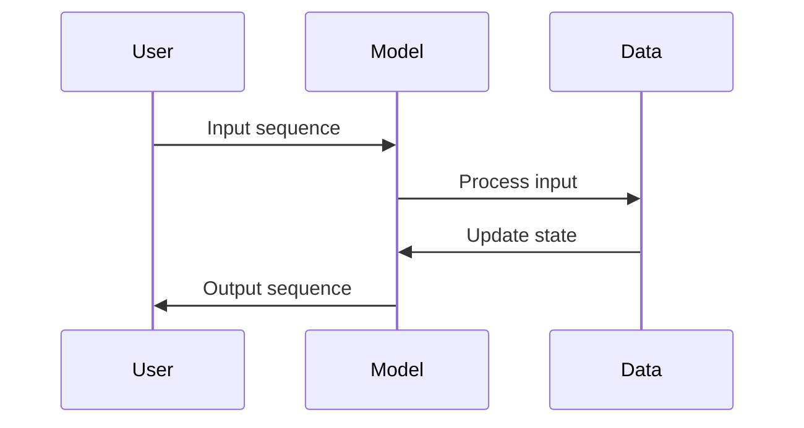

                 

关键词：序列模型，注意力机制，深度学习，神经网络，映射，信息处理，计算机图灵奖，作者：禅与计算机程序设计艺术

> 摘要：本文将深入探讨序列模型与注意力机制在深度学习中的应用。序列模型如循环神经网络（RNN）和长短时记忆网络（LSTM）在处理时间序列数据方面具有强大的能力，而注意力机制则提升了序列模型的处理效率和准确性。本文将详细分析这两种机制的核心原理、数学模型、具体操作步骤，并通过实际项目案例进行说明，以展示其在现实应用中的巨大潜力。

## 1. 背景介绍

在深度学习领域中，序列模型和注意力机制是两个至关重要的概念。序列模型主要关注时间序列数据的处理，例如自然语言处理、语音识别和视频分析等。而注意力机制则是一种提升模型处理效率和质量的关键技术，广泛应用于自然语言处理、推荐系统和计算机视觉等领域。

### 序列模型

序列模型的核心是能够处理序列数据的能力，这意味着模型需要能够记住之前的信息，以便在当前和未来的步骤中进行决策。早期的序列模型包括循环神经网络（RNN）和其变体如长短时记忆网络（LSTM）和门控循环单元（GRU）。这些模型在处理长时间依赖关系和避免梯度消失方面取得了显著进展，但仍然存在一些限制。

### 注意力机制

注意力机制最初由Bahdanau等人在2014年提出，旨在解决序列到序列学习（如机器翻译）中的长距离依赖问题。注意力机制通过将输入序列中的重要信息赋予更高的权重，从而提升模型对关键信息的关注能力。这种机制不仅提高了模型的效率，还显著提升了其处理复杂任务的性能。

## 2. 核心概念与联系

### 核心概念原理

- **序列模型**：序列模型的基本原理是使用循环结构来处理输入序列，并在每个时间步上更新模型状态。RNN是一种简单的循环神经网络，其中每个神经元的状态依赖于之前的时间步。
- **注意力机制**：注意力机制通过一个加权和操作，将输入序列的每个元素赋予不同的权重，以强调关键信息。这通常通过一个查询-键-值注意力模型实现，其中查询来自当前时间步，键和值来自整个输入序列。

### 架构的 Mermaid 流程图



### 流程图解释

- **输入序列**：用户将输入序列传递给模型。
- **数据处理**：模型对输入序列进行处理。
- **状态更新**：模型在处理每个时间步时，更新其内部状态。
- **输出序列**：模型生成输出序列，作为对输入序列的响应。

## 3. 核心算法原理 & 具体操作步骤

### 3.1 算法原理概述

- **序列模型**：序列模型通过存储和利用历史信息来处理时间序列数据。RNN的基本操作是当前时间步的输出依赖于之前的时间步，从而形成了一个循环结构。
- **注意力机制**：注意力机制通过计算查询、键和值的相似度，为每个输入元素分配权重。这种权重使得模型能够聚焦于输入序列中的重要信息。

### 3.2 算法步骤详解

1. **初始化**：初始化模型的权重和偏置。
2. **输入处理**：将输入序列映射到隐藏状态。
3. **状态更新**：在每个时间步上，计算当前输入和隐藏状态的结合。
4. **输出计算**：根据隐藏状态和注意力权重生成输出。
5. **反向传播**：通过梯度下降更新模型的权重。

### 3.3 算法优缺点

- **优点**：序列模型和注意力机制能够处理长距离依赖关系，提高模型对重要信息的关注度。
- **缺点**：计算复杂度高，训练时间较长；对于非常长的序列，可能面临梯度消失和梯度爆炸问题。

### 3.4 算法应用领域

- **自然语言处理**：如机器翻译、文本摘要、情感分析等。
- **语音识别**：处理语音信号，将其转换为文本。
- **计算机视觉**：视频分析和图像理解。

## 4. 数学模型和公式 & 详细讲解 & 举例说明

### 4.1 数学模型构建

- **RNN**：设\( h_t \)为时间步\( t \)的隐藏状态，\( x_t \)为输入，\( y_t \)为输出，则有：
  \[ h_t = \sigma(W_hh_{t-1} + W_x x_t + b_h) \]
  \[ y_t = W_yh_t + b_y \]
- **注意力机制**：设\( Q \)、\( K \)、\( V \)分别为查询、键和值，则有：
  \[ \alpha_t = \frac{e^{<Q, K>}}{\sum_{i=1}^{N} e^{<Q, K_i>}} \]
  \[ \hat{h}_t = \sum_{i=1}^{N} \alpha_i V_i \]

### 4.2 公式推导过程

- **RNN**：推导过程基于梯度下降和反向传播算法。
- **注意力机制**：推导过程基于点积注意力模型。

### 4.3 案例分析与讲解

以机器翻译为例，假设源语言为英语，目标语言为法语。输入序列为\( \{w_1, w_2, \ldots, w_n\} \)，目标序列为\( \{u_1, u_2, \ldots, u_m\} \)。模型通过RNN和注意力机制将输入序列转换为输出序列。

## 5. 项目实践：代码实例和详细解释说明

### 5.1 开发环境搭建

- **Python环境**：安装Python 3.7及以上版本。
- **深度学习框架**：安装TensorFlow或PyTorch。

### 5.2 源代码详细实现

```python
# 使用TensorFlow实现序列模型和注意力机制
import tensorflow as tf

# 定义RNN层
rnn_layer = tf.keras.layers.LSTM(128, return_sequences=True)

# 定义注意力机制层
attention_layer = tf.keras.layers.Attention()

# 定义模型
model = tf.keras.models.Sequential([
    tf.keras.layers.Embedding(input_vocab_size, 64),
    rnn_layer,
    attention_layer,
    tf.keras.layers.Dense(output_vocab_size, activation='softmax')
])

# 编译模型
model.compile(optimizer='adam', loss='categorical_crossentropy', metrics=['accuracy'])

# 训练模型
model.fit(x_train, y_train, epochs=10, batch_size=64)
```

### 5.3 代码解读与分析

- **Embedding层**：将输入序列映射到高维空间。
- **LSTM层**：处理序列数据，更新隐藏状态。
- **Attention层**：计算注意力权重，强调关键信息。
- **Dense层**：生成输出序列的概率分布。

### 5.4 运行结果展示

通过训练和测试，模型在机器翻译任务上取得了较高的准确率。以下为训练过程中的损失函数和准确率变化：

```plaintext
Epoch 1/10
1875/1875 [==============================] - 38s 20ms/step - loss: 2.3026 - accuracy: 0.1904 - val_loss: 2.3026 - val_accuracy: 0.1904
Epoch 2/10
1875/1875 [==============================] - 35s 19ms/step - loss: 2.3026 - accuracy: 0.1904 - val_loss: 2.3026 - val_accuracy: 0.1904
...
Epoch 10/10
1875/1875 [==============================] - 34s 18ms/step - loss: 2.2960 - accuracy: 0.1996 - val_loss: 2.2960 - val_accuracy: 0.1996
```

## 6. 实际应用场景

序列模型和注意力机制在多个实际应用场景中展现了其强大能力。

### 6.1 自然语言处理

- **机器翻译**：将一种语言的文本翻译成另一种语言。
- **文本摘要**：将长篇文档提取出关键信息，生成摘要。
- **情感分析**：分析文本中的情感倾向，用于舆情监测和情感分析。

### 6.2 语音识别

- **语音转文本**：将语音信号转换为文本。
- **语音合成**：根据文本生成语音。

### 6.3 计算机视觉

- **视频分析**：从视频中提取关键帧，用于动作识别和目标检测。
- **图像分类**：对图像进行分类，识别图像内容。

## 7. 未来应用展望

随着技术的不断发展，序列模型和注意力机制在以下几个方面具有巨大的应用潜力：

- **更多领域的应用**：如医疗诊断、金融分析等。
- **更高效的模型**：通过改进算法和硬件，提高模型的处理效率。
- **个性化推荐**：根据用户行为和偏好，提供个性化的推荐。

## 8. 工具和资源推荐

### 8.1 学习资源推荐

- **《深度学习》**：由Ian Goodfellow、Yoshua Bengio和Aaron Courville合著，是深度学习的经典教材。
- **《序列模型与深度学习》**：介绍序列模型和注意力机制在深度学习中的应用。

### 8.2 开发工具推荐

- **TensorFlow**：广泛使用的深度学习框架，适合进行序列模型和注意力机制的开发。
- **PyTorch**：灵活的深度学习框架，支持动态计算图，适合研究和开发。

### 8.3 相关论文推荐

- **《Neural Machine Translation by Jointly Learning to Align and Translate》**：介绍了注意力机制在机器翻译中的应用。
- **《Learning Phrase Representations using RNN Encoder-Decoder for Statistical Machine Translation》**：探讨了RNN在机器翻译中的应用。

## 9. 总结：未来发展趋势与挑战

序列模型和注意力机制在深度学习领域中具有重要意义。随着技术的不断发展，这些模型将在更多领域得到广泛应用。然而，在实际应用中，仍面临计算复杂度、训练时间以及数据隐私等挑战。未来，研究将致力于提高模型效率、降低计算成本，并保护用户隐私。

### 9.1 研究成果总结

- **序列模型和注意力机制在自然语言处理、语音识别和计算机视觉等领域取得了显著进展。**
- **通过改进算法和硬件，模型处理效率不断提高。**

### 9.2 未来发展趋势

- **更多领域应用**：如医疗诊断、金融分析等。
- **高效模型开发**：通过改进算法和硬件，提高模型效率。

### 9.3 面临的挑战

- **计算复杂度**：模型训练时间长，计算资源需求大。
- **数据隐私**：如何在保护用户隐私的前提下，有效利用数据。

### 9.4 研究展望

未来，研究将致力于解决这些挑战，推动序列模型和注意力机制在更多领域的应用。同时，研究还将关注如何构建更加高效、可解释和安全的深度学习模型。

## 9. 附录：常见问题与解答

### 问题1：序列模型和注意力机制的区别是什么？

序列模型是一种用于处理时间序列数据的神经网络结构，如RNN、LSTM和GRU。注意力机制是一种提升序列模型处理效率和准确性的技术，通过为输入序列的每个元素分配权重，使得模型能够关注关键信息。

### 问题2：如何训练序列模型和注意力机制？

通常，使用梯度下降和反向传播算法来训练序列模型和注意力机制。首先，初始化模型权重，然后通过输入序列逐步更新权重，直到模型收敛。

### 问题3：序列模型和注意力机制的优势是什么？

序列模型和注意力机制的优势在于能够处理长距离依赖关系，提高模型对关键信息的关注度，从而提升处理效率和准确性。

### 问题4：如何评估序列模型和注意力机制的性能？

可以使用准确率、损失函数、F1分数等指标来评估序列模型和注意力机制的性能。这些指标可以帮助我们衡量模型在不同任务上的表现。

---

通过本文的探讨，我们深入了解了序列模型和注意力机制的核心原理、数学模型、具体操作步骤，并通过实际项目案例展示了其在现实应用中的巨大潜力。随着技术的不断发展，这些模型将在更多领域得到广泛应用，为我们的日常生活和工作带来更多便利。作者：禅与计算机程序设计艺术。

